# paradigmxyz/reth - Code Wiki Export

> Source: https://codewiki.google/github.com/paradigmxyz/reth
> Export path: captured API payload

## 目录

- [paradigmxyz/reth 概览](#paradigmxyzreth-overview)
  - [Reth 项目结构与开发工作流](#reth-project-structure-and-development-workflow)
    - [Reth 的模块化架构与设计原则](#reth-project-structure-and-development-workflow-reths-modular-architecture-and-design-principles)
    - [持续集成与部署工作流](#reth-project-structure-and-development-workflow-continuous-integration-and-deployment-workflows)
    - [全面的基准测试与性能分析](#reth-project-structure-and-development-workflow-comprehensive-benchmarking-and-performance-analysis)
    - [核心开发与贡献指南](#reth-project-structure-and-development-workflow-core-development-and-contribution-guidelines)
    - [端到端测试与 Ethereum Foundation 测试集成](#reth-project-structure-and-development-workflow-end-to-end-testing-and-ethereum-foundation-test-integration)
    - [Reth CLI 应用结构与 Feature Flags](#reth-project-structure-and-development-workflow-reth-cli-application-structure-and-feature-flags)
  - [节点运行与命令行接口](#node-operation-and-command-line-interface)
    - [核心 Reth 可执行文件与节点管理](#node-operation-and-command-line-interface-core-reth-executable-and-node-management)
    - [通用 CLI 框架与 Chain Specification 解析](#node-operation-and-command-line-interface-common-cli-framework-and-chain-specification-parsing)
    - [Reth CLI 命令参考](#node-operation-and-command-line-interface-reth-cli-command-reference)
    - [CLI 运行时执行与任务管理](#node-operation-and-command-line-interface-cli-runtime-execution-and-task-management)
    - [CLI 工具模块](#node-operation-and-command-line-interface-cli-utility-modules)
    - [Reth Big Block 基准测试工具 (`reth-bb`)](#node-operation-and-command-line-interface-reth-big-block-benchmarking-tool-reth-bb)
    - [Reth 通用基准测试工具 (`reth-bench`)](#node-operation-and-command-line-interface-reth-general-benchmarking-tool-reth-bench)
  - [核心区块链组件](#core-blockchain-components)
    - [核心 Consensus 验证逻辑](#core-blockchain-components-core-consensus-validation-logic)
    - [用于 Execution Layer 测试的 Debug Consensus Client](#core-blockchain-components-debug-consensus-client-for-execution-layer-testing)
    - [EVM 配置与区块执行](#core-blockchain-components-evm-configuration-and-block-execution)
    - [EVM 执行错误处理与 Trie 操作](#core-blockchain-components-evm-execution-error-handling-and-trie-operations)
    - [聚合的 EVM 执行结果](#core-blockchain-components-aggregated-evm-execution-outcomes)
    - [Transaction Pool：摄入、验证与池化](#core-blockchain-components-transaction-pool-ingestion-validation-and-pooling)
    - [使用缓存优化区块处理](#core-blockchain-components-optimized-block-processing-with-caching)
    - [Invalid Block 处理与 Execution Witness 生成](#core-blockchain-components-invalid-block-handling-and-execution-witness-generation)
    - [本地区块挖掘与 Payload Attributes](#core-blockchain-components-local-block-mining-and-payload-attributes)
    - [Engine API Primitives 与 Forkchoice State 管理](#core-blockchain-components-engine-api-primitives-and-forkchoice-state-management)
    - [Engine Tree 逻辑：链编排与 State Root 计算](#core-blockchain-components-engine-tree-logic-chain-orchestration-and-state-root-calculation)
    - [用于消息流操作的 Engine 工具](#core-blockchain-components-engine-utilities-for-message-stream-manipulation)
  - [网络与点对点通信](#networking-and-peer-to-peer-communication)
    - [Peer 发现机制 (Discv4、Discv5 与 DNS)](#networking-and-peer-to-peer-communication-peer-discovery-mechanisms-discv4-discv5-and-dns)
    - [RLPx ECIES 安全传输协议](#networking-and-peer-to-peer-communication-rlpx-ecies-secure-transport-protocol)
    - [Ethereum Wire Protocol (eth-wire) 与消息类型](#networking-and-peer-to-peer-communication-ethereum-wire-protocol-eth-wire-and-message-types)
    - [Block 与 Header Downloader](#networking-and-peer-to-peer-communication-block-and-header-downloaders)
    - [Network API 与 Peer 管理抽象](#networking-and-peer-to-peer-communication-network-api-and-peer-management-abstractions)
    - [Peer 与 IP Banlist 管理](#networking-and-peer-to-peer-communication-peer-and-ip-banlist-management)
    - [外部 IP 解析与 NAT 穿透](#networking-and-peer-to-peer-communication-external-ip-resolution-and-nat-traversal)
  - [数据存储与检索](#data-storage-and-retrieval)
    - [MDBX Database 实现与管理](#data-storage-and-retrieval-mdbx-database-implementation-and-management)
    - [Database 抽象层与数据建模](#data-storage-and-retrieval-database-abstraction-layer-and-data-modeling)
    - [使用 NippyJar 的列式数据存储](#data-storage-and-retrieval-columnar-data-storage-with-nippyjar)
    - [统一的区块链数据访问与 Provider 框架](#data-storage-and-retrieval-unified-blockchain-data-access-and-provider-framework)
    - [基于 RPC 的区块链数据访问](#data-storage-and-retrieval-rpc-based-blockchain-data-access)
    - [Ethereum Trie 操作与 State Root 计算](#data-storage-and-retrieval-ethereum-trie-operations-and-state-root-computation)
  - [节点配置与可扩展性](#node-configuration-and-extensibility)
    - [Node Builder API 与生命周期管理](#node-configuration-and-extensibility-node-builder-api-and-lifecycle-management)
    - [Node 配置 Traits 与 Types](#node-configuration-and-extensibility-node-configuration-traits-and-types)
    - [通过 Execution Extensions (ExEx) 与 Hooks 实现可扩展性](#node-configuration-and-extensibility-extensibility-through-execution-extensions-exex-and-hooks)
    - [RPC Server 配置与定制](#node-configuration-and-extensibility-rpc-server-configuration-and-customization)
    - [调试特性与 Invalid Block 处理](#node-configuration-and-extensibility-debugging-features-and-invalid-block-handling)
    - [Node 事件处理与 Consensus Layer 健康监控](#node-configuration-and-extensibility-node-event-handling-and-consensus-layer-health-monitoring)
    - [Metrics 暴露与 Prometheus 集成](#node-configuration-and-extensibility-metrics-exposure-and-prometheus-integration)
    - [用于节点统计报告的 Ethstats Client](#node-configuration-and-extensibility-ethstats-client-for-node-statistics-reporting)
    - [核心配置与命令行参数解析](#node-configuration-and-extensibility-core-configuration-and-command-line-argument-parsing)
    - [数据目录管理与节点退出](#node-configuration-and-extensibility-data-directory-management-and-node-exit)
  - [RPC 与进程间通信](#rpc-and-inter-process-communication)
    - [进程间通信 (IPC) 实现](#rpc-and-inter-process-communication-inter-process-communication-ipc-implementation)
    - [聚合的 RPC API 定义与 Traits](#rpc-and-inter-process-communication-aggregated-rpc-api-definitions-and-traits)
    - [核心 RPC Server 实现与异步处理](#rpc-and-inter-process-communication-core-rpc-server-implementation-and-asynchronous-handling)
    - [RPC Server 配置、管理与中间件](#rpc-and-inter-process-communication-rpc-server-configuration-management-and-middleware)
    - [用于 CL/EL 交互的 Ethereum Engine API 实现](#rpc-and-inter-process-communication-ethereum-engine-api-implementation-for-clel-interaction)
    - [Ethereum RPC `eth_` API 与模块化](#rpc-and-inter-process-communication-ethereum-rpc-eth-api-and-modularity)
    - [RPC Eth Types：缓存、错误处理与数据建模](#rpc-and-inter-process-communication-rpc-eth-types-caching-error-handling-and-data-modeling)
    - [RPC 层认证与压缩](#rpc-and-inter-process-communication-rpc-layer-authentication-and-compression)
    - [RPC Server Types、Constants 与验证](#rpc-and-inter-process-communication-rpc-server-types-constants-and-validation)
    - [RPC 数据类型转换工具](#rpc-and-inter-process-communication-rpc-data-type-conversion-utilities)
    - [端到端 RPC 兼容性测试](#rpc-and-inter-process-communication-end-to-end-rpc-compatibility-testing)
    - [用于 Trace 与 Debug 的 RPC 测试工具](#rpc-and-inter-process-communication-rpc-testing-utilities-for-trace-and-debug)
  - [区块链同步阶段](#blockchain-synchronization-stages)
    - [核心 Pipeline 编排与控制](#blockchain-synchronization-stages-core-pipeline-orchestration-and-control)
    - [各个同步 Stage 及其功能](#blockchain-synchronization-stages-individual-synchronization-stages-and-their-functions)
    - [Checkpointing 与进度追踪](#blockchain-synchronization-stages-checkpointing-and-progress-tracking)
    - [预定义 Stage Sets 与 Sync Flows](#blockchain-synchronization-stages-predefined-stage-sets-and-sync-flows)
    - [Metrics 收集与报告](#blockchain-synchronization-stages-metrics-collection-and-reporting)
    - [测试工具与集成测试](#blockchain-synchronization-stages-testing-utilities-and-integration-tests)
  - [示例与工具](#examples-and-utilities)
    - [Node Builder 定制与 Hooks](#examples-and-utilities-node-builder-customizations-and-hooks)
    - [Execution Extension (ExEx) 实现](#examples-and-utilities-execution-extension-exex-implementations)
    - [RPC 与中间件定制](#examples-and-utilities-rpc-and-middleware-customization)
    - [Database 交互模式](#examples-and-utilities-database-interaction-patterns)
    - [高级网络与 P2P 配置](#examples-and-utilities-advanced-network-and-p2p-configurations)
    - [Mempool 与 Transaction Pool 定制](#examples-and-utilities-mempool-and-transaction-pool-customization)
    - [Prometheus 与 Grafana 监控配置](#examples-and-utilities-prometheus-and-grafana-monitoring-setup)


---

## paradigmxyz/reth 概览

代码仓库概览：paradigmxyz/reth

Reth 是一个 Ethereum execution layer client，用于处理 blockchain 数据，并与 Consensus Layer 进行交互。它在 Ethereum 网络中为节点运行、数据同步和安全的点对点通信提供了强大的功能。

该客户端的设计强调将不同功能分离为独立的组件，从而提高适应性。它使用一个事务型数据库以及针对历史记录的专用列式格式来管理 blockchain 数据的持久化存储和检索。Reth 通过 peer discovery、加密通信和高效的区块数据下载来支持网络交互。其核心操作包括 consensus 验证、Ethereum Virtual Machine (EVM) 执行以及 transaction pool 管理。一个结构化的 pipeline 编排 blockchain 数据的获取与处理，以确保节点保持同步。该客户端还提供了广泛的配置选项和扩展机制，包括 Execution Extensions 和可定制的 RPC 服务，以支持多种运行需求。一个持续集成与部署系统则在开发周期中确保了可靠性与性能。

主要功能包括：
*   **模块化架构**：支持灵活的组件集成与适应性。参见 [Reth 的模块化架构与设计原则](#reth-project-structure-and-development-workflow-reths-modular-architecture-and-design-principles)。
*   **数据存储与检索**：使用 MDBX 持久化 blockchain 数据，并通过抽象层支持多种数据模型，以及为历史记录提供高效的列式存储。参见 [数据存储与检索](#data-storage-and-retrieval)。
*   **网络与点对点通信**：管理 peer discovery、RLPx ECIES 安全传输以及用于数据交换的 Ethereum Wire Protocol。参见 [网络与点对点通信](#networking-and-peer-to-peer-communication)。
*   **核心区块链组件**：实现 consensus 验证、EVM 操作、区块执行、transaction pooling 以及 state root 计算。参见 [核心区块链组件](#core-blockchain-components)。
*   **区块链同步阶段**：编排一个模块化、可扩展的框架，用于获取和处理 blockchain 数据。参见 [区块链同步阶段](#blockchain-synchronization-stages)。
*   **节点配置与可扩展性**：提供 Node Builder API、Execution Extensions (ExEx) 以及用于定制节点行为的 hooks。参见 [节点配置与可扩展性](#node-configuration-and-extensibility)。
*   **RPC 与进程间通信**：通过 HTTP、WebSocket 和 IPC 提供 JSON-RPC 服务，包括用于与 Consensus Layer 交互的 Engine API。参见 [RPC 与进程间通信](#rpc-and-inter-process-communication)。
*   **开发工作流**：包含持续集成、全面的基准测试和广泛的测试，包括 Ethereum Foundation 测试。参见 [Reth 项目结构与开发工作流](#reth-project-structure-and-development-workflow)。

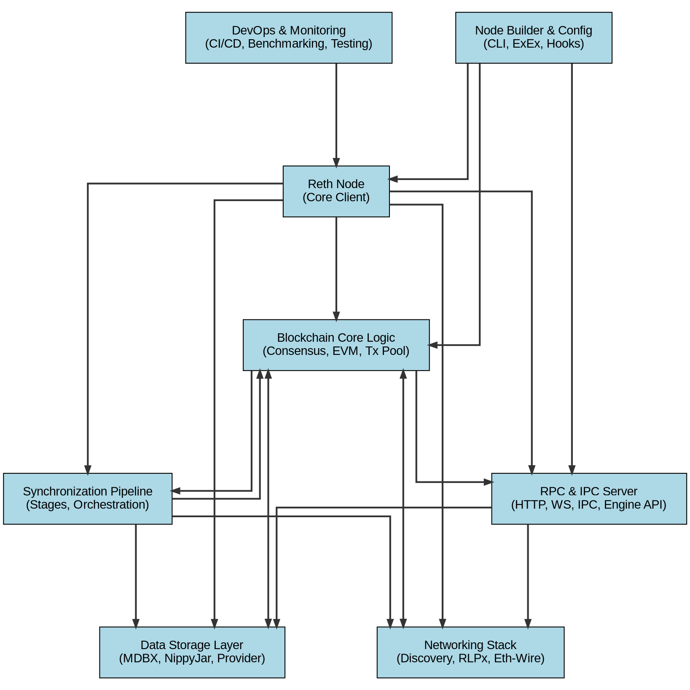
```dot
digraph G {
	nodesep=1.0;
	overlap=false;
	rankdir=TD;
	ranksep=1.0;
	ratio=1.0;
	splines=ortho;
	"DevOps & Monitoring"->"Reth Node"[ arrowsize=0.8, color="#333333", fontname="Arial", fontsize=14, style=bold ];
	"Node Builder & Config"->"Reth Node"[ arrowsize=0.8, color="#333333", fontname="Arial", fontsize=14, style=bold ];
	"Reth Node"->"Blockchain Core Logic"[ arrowsize=0.8, color="#333333", fontname="Arial", fontsize=14, style=bold ];
	"Reth Node"->"Data Storage Layer"[ arrowsize=0.8, color="#333333", fontname="Arial", fontsize=14, style=bold ];
	"Reth Node"->"Networking Stack"[ arrowsize=0.8, color="#333333", fontname="Arial", fontsize=14, style=bold ];
	"Reth Node"->"Synchronization Pipeline"[ arrowsize=0.8, color="#333333", fontname="Arial", fontsize=14, style=bold ];
	"Reth Node"->"RPC & IPC Server"[ arrowsize=0.8, color="#333333", fontname="Arial", fontsize=14, style=bold ];
	"Blockchain Core Logic"->"Data Storage Layer"[ arrowsize=0.8, color="#333333", dir=both, fontname="Arial", fontsize=14, style=bold ];
	"Blockchain Core Logic"->"Networking Stack"[ arrowsize=0.8, color="#333333", dir=both, fontname="Arial", fontsize=14, style=bold ];
	"Blockchain Core Logic"->"Synchronization Pipeline"[ arrowsize=0.8, color="#333333", fontname="Arial", fontsize=14, style=bold ];
	"Blockchain Core Logic"->"RPC & IPC Server"[ arrowsize=0.8, color="#333333", fontname="Arial", fontsize=14, style=bold ];
	"Synchronization Pipeline"->"Blockchain Core Logic"[ arrowsize=0.8, color="#333333", fontname="Arial", fontsize=14, style=bold ];
	"Synchronization Pipeline"->"Data Storage Layer"[ arrowsize=0.8, color="#333333", fontname="Arial", fontsize=14, style=bold ];
	"Synchronization Pipeline"->"Networking Stack"[ arrowsize=0.8, color="#333333", fontname="Arial", fontsize=14, style=bold ];
	"RPC & IPC Server"->"Data Storage Layer"[ arrowsize=0.8, color="#333333", fontname="Arial", fontsize=14, style=bold ];
	"RPC & IPC Server"->"Networking Stack"[ arrowsize=0.8, color="#333333", fontname="Arial", fontsize=14, style=bold ];
	"Node Builder & Config"->"Blockchain Core Logic"[ arrowsize=0.8, color="#333333", fontname="Arial", fontsize=14, style=bold ];
	"Node Builder & Config"->"RPC & IPC Server"[ arrowsize=0.8, color="#333333", fontname="Arial", fontsize=14, style=bold ];
	"Blockchain Core Logic" [ fillcolor=lightblue, fontname="Arial", fontsize=14, label="Blockchain Core Logic\n(Consensus, EVM, Tx Pool)", margin="0.3,0.2", shape=box, style=filled ];
	"Data Storage Layer" [ fillcolor=lightblue, fontname="Arial", fontsize=14, label="Data Storage Layer\n(MDBX, NippyJar, Provider)", margin="0.3,0.2", shape=box, style=filled ];
	"DevOps & Monitoring" [ fillcolor=lightblue, fontname="Arial", fontsize=14, label="DevOps & Monitoring\n(CI/CD, Benchmarking, Testing)", margin="0.3,0.2", shape=box, style=filled ];
	"Networking Stack" [ fillcolor=lightblue, fontname="Arial", fontsize=14, label="Networking Stack\n(Discovery, RLPx, Eth-Wire)", margin="0.3,0.2", shape=box, style=filled ];
	"Node Builder & Config" [ fillcolor=lightblue, fontname="Arial", fontsize=14, label="Node Builder & Config\n(CLI, ExEx, Hooks)", margin="0.3,0.2", shape=box, style=filled ];
	"RPC & IPC Server" [ fillcolor=lightblue, fontname="Arial", fontsize=14, label="RPC & IPC Server\n(HTTP, WS, IPC, Engine API)", margin="0.3,0.2", shape=box, style=filled ];
	"Reth Node" [ fillcolor=lightblue, fontname="Arial", fontsize=14, label="Reth Node\n(Core Client)", margin="0.3,0.2", shape=box, style=filled ];
	"Synchronization Pipeline" [ fillcolor=lightblue, fontname="Arial", fontsize=14, label="Synchronization Pipeline\n(Stages, Orchestration)", margin="0.3,0.2", shape=box, style=filled ];

}
```


---

### Reth 项目结构与开发工作流

本节将介绍 Reth Ethereum client 的整体架构，重点突出其模块化设计、性能侧重点以及易用性。同时也会涉及持续集成与部署流程，包括对项目质量与性能至关重要的基准测试和测试基础设施。

Source paths:

- `/paradigmxyz/reth`
- `/paradigmxyz/reth/.github`
- `/paradigmxyz/reth/scripts`

Reth 项目实现了一个 Ethereum execution layer client，专为模块化、高性能和易用性而设计，并通过 Engine API 支持 Ethereum Consensus Layer。其架构允许将各个组件作为独立的 library 使用，从而提升开发的可扩展性和灵活性。该项目遵循开源模式，致力于在 Ethereum 生态系统中促进 client 多样性，并支持多种 EVM 兼容链。

Reth 开发的一个核心方面是对持续集成与部署 (CI/CD) 的重视，这对维护代码质量、性能和稳定性至关重要。该基础设施包含全面的基准测试和广泛的测试能力。例如，CI/CD 系统通过位于 [`/paradigmxyz/reth/.github/scripts`](%2Fparadigmxyz%2Freth%2F.github%2Fscripts) 目录下的各种基准测试脚本自动化性能监控，这些脚本负责节点设置、执行、数据收集和结果分析。它们可生成详细的性能报告、对延迟和吞吐量等指标的图形化展示，以及在不同代码版本之间进行统计比较，确保性能回归能被快速发现。此外，CI/CD pipeline 还包含兼容性检查，例如验证 Docker 镜像架构以及 Rust crates 的 WebAssembly 支持，相关脚本可见于 [`/paradigmxyz/reth/.github/scripts/verify_image_arch.sh`](%2Fparadigmxyz%2Freth%2F.github%2Fscripts%2Fverify_image_arch.sh) 与 [`/paradigmxyz/reth/.github/scripts/check_wasm.sh`](%2Fparadigmxyz%2Freth%2F.github%2Fscripts%2Fcheck_wasm.sh)。

除了自动化检查之外，Reth 还集成了一套健壮的测试框架以进行严格的验证。项目的测试基础设施，特别是位于 [`/paradigmxyz/reth/testing`](%2Fparadigmxyz%2Freth%2Ftesting) 目录下的部分，支持执行 Ethereum Foundation (EF) 测试。这些测试对于确保 client 遵循 Ethereum 协议规范至关重要。测试工具还支持为多种测试场景生成 blockchain 数据和自定义 genesis block allocations。关于为 Reth 做贡献的全面指南，包括 bug 报告、功能请求和 pull request 礼仪，均记录于 [`/paradigmxyz/reth/CONTRIBUTING.md`](%2Fparadigmxyz%2Freth%2FCONTRIBUTING.md) 中，以确保一致且高质量的开发流程。此外，[`/paradigmxyz/reth/HARDFORK-CHECKLIST.md`](%2Fparadigmxyz%2Freth%2FHARDFORK-CHECKLIST.md) 等专用检查清单指导开发者集成新的 hard fork 变更，详细说明了对原始类型 (primitive types)、Engine API 更新以及其他 Reth 特定调整所需的修改。整体的构建、测试和开发工作流由 [`/paradigmxyz/reth/Makefile`](%2Fparadigmxyz%2Freth%2FMakefile) 管理，它编排了从二进制编译、交叉编译到全面测试和 linting 等各种任务。

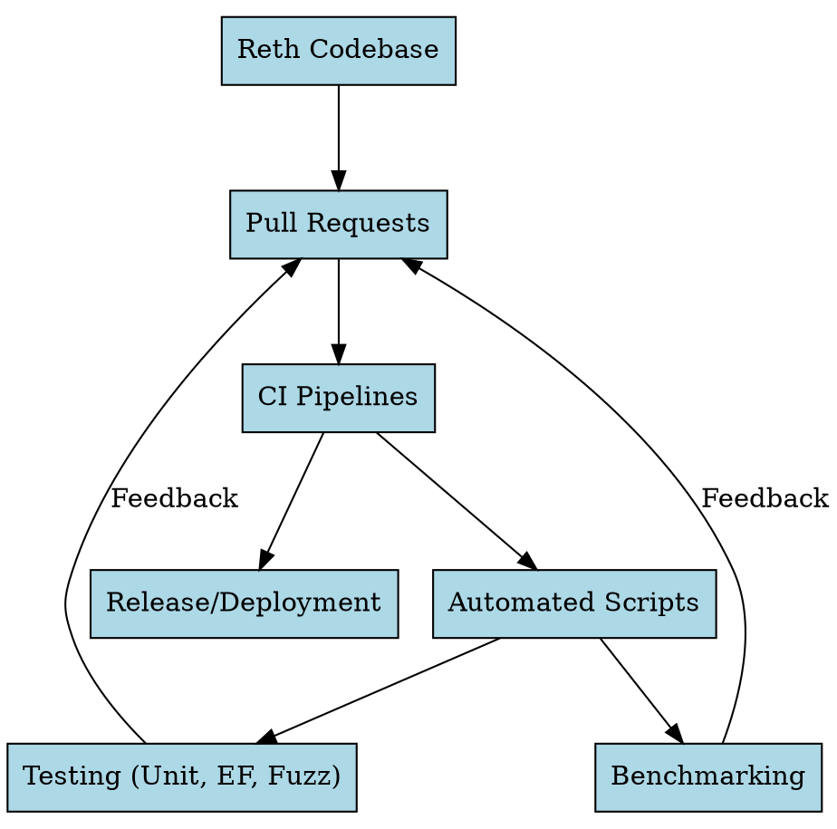
```dot
digraph G {
	rankdir=TD;
	ratio=1.0;
	"Codebase"->"Pull Requests";
	"Pull Requests"->"CI Pipelines";
	"CI Pipelines"->"Automated Scripts";
	"Automated Scripts"->"Testing (Unit, EF, Fuzz)";
	"Automated Scripts"->"Benchmarking";
	"Testing (Unit, EF, Fuzz)"->"Pull Requests"[ label="Feedback" ];
	"Benchmarking"->"Pull Requests"[ label="Feedback" ];
	"CI Pipelines"->"Release/Deployment";
	"Automated Scripts" [ fillcolor=lightblue, label="Automated Scripts", shape=box, style=filled ];
	"Benchmarking" [ fillcolor=lightblue, label="Benchmarking", shape=box, style=filled ];
	"CI Pipelines" [ fillcolor=lightblue, label="CI Pipelines", shape=box, style=filled ];
	"Codebase" [ fillcolor=lightblue, label="Reth Codebase", shape=box, style=filled ];
	"Pull Requests" [ fillcolor=lightblue, label="Pull Requests", shape=box, style=filled ];
	"Release/Deployment" [ fillcolor=lightblue, label="Release/Deployment", shape=box, style=filled ];
	"Testing (Unit, EF, Fuzz)" [ fillcolor=lightblue, label="Testing (Unit, EF, Fuzz)", shape=box, style=filled ];

}
```


---

#### Reth 的模块化架构与设计原则

本小节将详述 Reth 总体设计哲学，重点关注模块化、性能、可配置性以及开源友好性是如何通过其 Rust crate 结构、具体设计目标以及对 database、P2P stack 和 metrics 等组件的架构选择来实现的。

Source paths:

- `/paradigmxyz/reth/docs/design`
- `/paradigmxyz/reth/docs/repo/layout.md`
- `/paradigmxyz/reth/crates`

Reth Ethereum client 的设计高度强调模块化、性能、可配置性以及开源友好性。这些原则体现在其 Rust crate 结构（按功能逻辑分离）以及对 database、P2P stack 和 metrics 等关键组件的架构选择中。其总体设计目标是打造一个健壮、可适应的 client，能够高效地进行 blockchain 同步和运行。

Reth 的核心目标优先考虑性能，通过优化 state access 和 I/O 操作，从而获得更快的同步速度和更低的运行成本。这种关注也延伸到了对数据（如 transaction receipts）的运行时生成，以最小化磁盘占用，详见 [`/paradigmxyz/reth/docs/design/goals.md`](%2Fparadigmxyz%2Freth%2Fdocs%2Fdesign%2Fgoals.md) 中的 Reth Goals 文档。可配置性通过一种支持用户控制各种权衡的设计来实现，便于为不同用户画像（例如 archive node、RPC provider、MEV searcher）创建预设方案。这通过广泛使用模块化和泛型接口得以支持。开源友好性则通过提供全面的文档来培育，文档涵盖了设计、实现和贡献流程的上下文，使其对更广泛的开发者社区可访问。

项目的架构被组织成不同的 Rust crates，每个 crate 处理特定的关注点，详见 [`/paradigmxyz/reth/docs/repo/layout.md`](%2Fparadigmxyz%2Freth%2Fdocs%2Frepo%2Flayout.md) 中的项目布局文档。这种结构促进了代码复用，简化了维护，并允许独立开发和测试各个组件。

Database 架构在 [`/paradigmxyz/reth/docs/design/database.md`](%2Fparadigmxyz%2Freth%2Fdocs%2Fdesign%2Fdatabase.md) 中描述，旨在实现灵活性和高性能。它使用一个 [`Database`](%2Fparadigmxyz%2Freth%2Fdocs%2Fcrates%2Fdb.md#L71) trait 来抽象不同的后端实现，目前支持 [`MDBX`](%2Fparadigmxyz%2Freth%2FMakefile#L100)。一个 [`Transaction`](%2Fparadigmxyz%2Freth%2Fbin%2Freth-bb%2Fsrc%2Fevm.rs#L427) 抽象进一步管理 database 操作。泛型的 [`Encode`](%2Fparadigmxyz%2Freth%2Fcrates%2Fstorage%2Fdb-api%2Fsrc%2Ftable.rs#L42) 和 [`Decode`](%2Fparadigmxyz%2Freth%2Fcrates%2Fstorage%2Fdb-api%2Fsrc%2Ftable.rs#L51) traits，以及 [`reth_codec`](%2Fparadigmxyz%2Freth%2Fdocs%2Fcrates%2Feth-wire.md#L133) 派生宏，支持高效的数据序列化与反序列化，支持多种格式，并便于基准测试和 fuzzing。Database schema 包含用于 canonical headers、transactions、receipts、bytecodes 以及历史 state changes 的表，确保对过往 state 的快速访问以进行分析和重新执行。

P2P 网络栈基于一种将分层 subprotocols 作为泛型异步流的设计，详见 [`/paradigmxyz/reth/docs/design/p2p.md`](%2Fparadigmxyz%2Freth%2Fdocs%2Fdesign%2Fp2p.md)。这种方法允许对网络通信进行灵活、高效的处理，包括 [`P2PStream`](%2Fparadigmxyz%2Freth%2Fdocs%2Fcrates%2Feth-wire.md#L163) 与 [`EthStream`](%2Fparadigmxyz%2Freth%2Fdocs%2Fcrates%2Feth-wire.md#L320) 组件。Headers Downloader 文档详见 [`/paradigmxyz/reth/docs/design/headers-downloader.md`](%2Fparadigmxyz%2Freth%2Fdocs%2Fdesign%2Fheaders-downloader.md)，它使用基于流的方法高效地下载并处理 block headers，在接收和验证后立即将其 yield 出来。

Metrics 是 Reth 监控与性能分析设计中的核心部分，详见 [`/paradigmxyz/reth/docs/design/metrics.md`](%2Fparadigmxyz%2Freth%2Fdocs%2Fdesign%2Fmetrics.md)。该系统区分 metrics（以系统为中心、可聚合的数据）和 traces（以请求为中心、用于性能剖析的数据）。Reth 提供了添加 counters、gauges 和 histograms 的机制，由一个 [`metrics.Key`](%2Fparadigmxyz%2Freth%2Fdocs%2Fdesign%2Fmetrics.md#L34) 标识，并附带可选的 [`metrics.Label`](%2Fparadigmxyz%2Freth%2Fdocs%2Fdesign%2Fmetrics.md#L34) 提供上下文信息。最佳实践指导 metric 命名与单位包含的方式，同时避免冗余的、可由其他 metric 推导的指标。这一综合 metrics 系统支持外部监控工具，如 Prometheus 和 Grafana。

[`/paradigmxyz/reth/crates/chain-state`](%2Fparadigmxyz%2Freth%2Fcrates%2Fchain-state) 中的 [`chain-state`](%2Fparadigmxyz%2Freth%2FCargo.toml#L324) crate 对管理核心 blockchain state 至关重要。它包含用于监控 canonical、safe 和 finalized blocks 的 [`ChainInfoTracker`](%2Fparadigmxyz%2Freth%2Fcrates%2Fchain-state%2Fsrc%2Flib.rs#L26)，用于优化 trie 数据计算的 [`DeferredTrieData`](%2Fparadigmxyz%2Freth%2Fcrates%2Fchain-state%2Fsrc%2Fdeferred_trie.rs#L91)，以及用于在内存中管理 canonical blocks 及其执行输出的 [`InMemoryState`](%2Fparadigmxyz%2Freth%2Fcrates%2Fchain-state%2Fsrc%2Fin_memory.rs#L69)。这些组件对高效的 state access 和处理链 reorganization 都至关重要。通知系统（[`CanonStateSubscriptions`](%2Fparadigmxyz%2Freth%2Fcrates%2Fchain-state%2Fsrc%2Fnotifications.rs#L29)、[`ForkChoiceSubscriptions`](%2Fparadigmxyz%2Freth%2Fcrates%2Fchain-state%2Fsrc%2Fnotifications.rs#L187)、[`PersistedBlockSubscriptions`](%2Fparadigmxyz%2Freth%2Fcrates%2Fchain-state%2Fsrc%2Fnotifications.rs#L245)）提供了订阅 state 变更事件的机制。

[`/paradigmxyz/reth/crates/chainspec`](%2Fparadigmxyz%2Freth%2Fcrates%2Fchainspec) 中的 [`chainspec`](%2Fparadigmxyz%2Freth%2Fbin%2Freth%2Fsrc%2Flib.rs#L116) crate 通过 [`EthChainSpec`](%2Fparadigmxyz%2Freth%2Fcrates%2Fchainspec%2Fsrc%2Fapi.rs#L14) trait 和 [`ChainSpec`](%2Fparadigmxyz%2Freth%2Fbin%2Freth-bb%2Fsrc%2Fmain.rs#L156) struct 集中定义了 Ethereum 网络规范。这允许对链参数、hardforks 和 genesis 数据进行清晰、一致的配置，便于轻松适配不同的 Ethereum 网络。

[`/paradigmxyz/reth/crates/evm`](%2Fparadigmxyz%2Freth%2Fcrates%2Fevm) 中的 [`evm`](%2Fparadigmxyz%2Freth%2Fbin%2Freth-bb%2Fsrc%2Fevm.rs#L537) crate 为 EVM 操作提供了框架。它定义了诸如用于设置 EVM 环境的 [`ConfigureEvm`](%2Fparadigmxyz%2Freth%2Fbin%2Freth-bb%2Fsrc%2Fevm.rs#L91) 和用于执行 transaction 的 [`Executor`](%2Fparadigmxyz%2Freth%2Fcrates%2Fevm%2Fevm%2Fsrc%2Fexecute.rs#L34) 等 traits。这种模块化支持灵活的 EVM 配置和高效的执行错误处理。

总体而言，Reth 的架构是这些设计原则的精心平衡，体现在其结构良好的 Rust crates 和深思熟虑的实现选择中，旨在交付一个高性能、可配置且社区驱动的 Ethereum client。

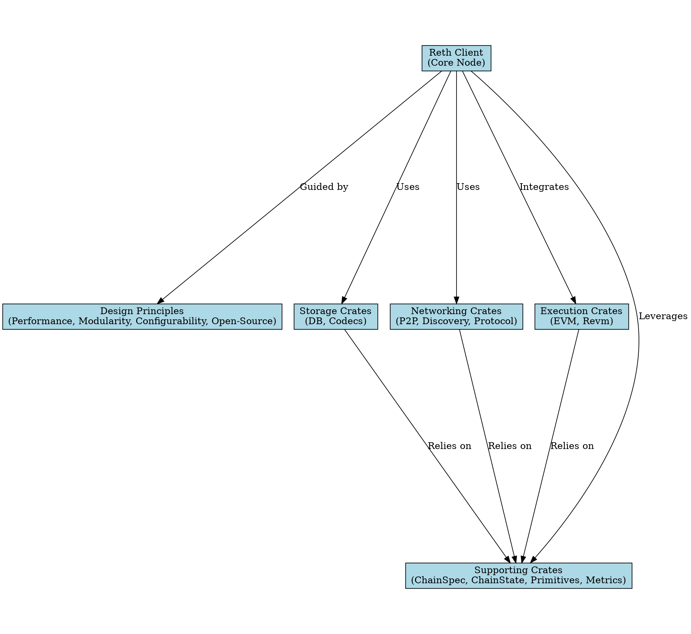
```dot
digraph G {
	rankdir=TD;
	ratio=1.0;
	RethClient->DesignPrinciples[ label="Guided by" ];
	RethClient->Storage[ label="Uses" ];
	RethClient->Networking[ label="Uses" ];
	RethClient->Execution[ label="Integrates" ];
	RethClient->SupportingCrates[ label="Leverages" ];
	Storage->SupportingCrates[ label="Relies on" ];
	Networking->SupportingCrates[ label="Relies on" ];
	Execution->SupportingCrates[ label="Relies on" ];
	DesignPrinciples [ fillcolor=lightblue, label="Design Principles\n(Performance, Modularity, Configurability, Open-Source)", shape=box, style=filled ];
	Execution [ fillcolor=lightblue, label="Execution Crates\n(EVM, Revm)", shape=box, style=filled ];
	Networking [ fillcolor=lightblue, label="Networking Crates\n(P2P, Discovery, Protocol)", shape=box, style=filled ];
	RethClient [ fillcolor=lightblue, label="Reth Client\n(Core Node)", shape=box, style=filled ];
	Storage [ fillcolor=lightblue, label="Storage Crates\n(DB, Codecs)", shape=box, style=filled ];
	SupportingCrates [ fillcolor=lightblue, label="Supporting Crates\n(ChainSpec, ChainState, Primitives, Metrics)", shape=box, style=filled ];

}
```


---

#### 持续集成与部署工作流

本小节将详细描述 Reth 的 CI/CD 基础设施，阐述涉及代码质量、文档、测试以及发布流程的各种工作流，包括 linting、unit tests、integration tests、fuzz tests 以及每夜重测试。

Source paths:

- `/paradigmxyz/reth/.github`
- `/paradigmxyz/reth/docs/repo/ci.md`
- `/paradigmxyz/reth/docs/workflow.md`
- `/paradigmxyz/reth/docs/release.md`

Reth 的持续集成与部署 (CI/CD) 基础设施自动化各种流程，以维护代码质量、确保功能正确性、管理文档以及推动发布。该系统主要由 [`.github`](%2Fparadigmxyz%2Freth%2FREADME.md#L85) 目录中定义的工作流驱动，其中包含用于这些自动化任务的脚本和配置文件。

CI/CD pipeline 包含多种工作流，涵盖代码质量、文档、测试与发布管理，详见 [`/paradigmxyz/reth/docs/repo/ci.md`](%2Fparadigmxyz%2Freth%2Fdocs%2Frepo%2Fci.md) 文档。与代码相关的工作流涵盖 unit tests、integration tests 与性能 benchmarks。文档相关工作流构建、测试并部署项目的文档。元工作流处理发布流程、依赖管理以及 Docker 镜像发布。

所有 pull requests 都会经过自动化检查，包括 [`clippy`](%2Fparadigmxyz%2Freth%2FMakefile#L253) 与 [`rustfmt`](%2Fparadigmxyz%2Freth%2FAGENTS.md#L34) 等 linting 工具、unit tests、fuzz tests，以及模拟 peering 和 testnet 交互的 integration tests，详见 [`/paradigmxyz/reth/docs/workflow.md`](%2Fparadigmxyz%2Freth%2Fdocs%2Fworkflow.md) 文档。此外，在发布之前，每个 pull request 都会在实时 testnet 上每夜重测试，以确认其稳定性和性能。

发布流程在 [`/paradigmxyz/reth/docs/release.md`](%2Fparadigmxyz%2Freth%2Fdocs%2Frelease.md) 中描述，涉及准备一个发布 pull request、更新版本号，以及在 [`main`](%2Fparadigmxyz%2Freth%2Fbin%2Freth%2Fsrc%2Fmain.rs#L20) 分支上对提交打 tag。这会触发一个自动化工作流，构建发布产物并在 GitHub 上创建一个 draft release，由维护者最终确认。

基准测试与性能分析也被集成到 CI/CD 系统中。[`/paradigmxyz/reth/.github/scripts`](%2Fparadigmxyz%2Freth%2F.github%2Fscripts) 中的脚本负责执行 benchmarks、生成报告，以及为 GitHub pull requests 更新状态。例如，[`/paradigmxyz/reth/.github/scripts/bench-job-summary.js`](%2Fparadigmxyz%2Freth%2F.github%2Fscripts%2Fbench-job-summary.js) 生成详细的 benchmark 结果汇总，包括性能指标、图表和性能剖析链接。[`/paradigmxyz/reth/.github/scripts/bench-slack-notify.js`](%2Fparadigmxyz%2Freth%2F.github%2Fscripts%2Fbench-slack-notify.js) 向通信渠道发送通知，[`/paradigmxyz/reth/.github/scripts/bench-update-status.js`](%2Fparadigmxyz%2Freth%2F.github%2Fscripts%2Fbench-update-status.js) 则更新 pull request 评论以反映 benchmark 任务状态。

兼容性检查确保 Reth 在不同环境和架构下均能正常工作。例如，[`/paradigmxyz/reth/.github/scripts/check_rv32imac.sh`](%2Fparadigmxyz%2Freth%2F.github%2Fscripts%2Fcheck_rv32imac.sh) 验证特定 Rust crates 是否能为 RISC-V 目标构建，而 [`/paradigmxyz/reth/.github/scripts/check_wasm.sh`](%2Fparadigmxyz%2Freth%2F.github%2Fscripts%2Fcheck_wasm.sh) 确认 WebAssembly 兼容性。[`/paradigmxyz/reth/.github/scripts/hive`](%2Fparadigmxyz%2Freth%2F.github%2Fscripts%2Fhive) 子目录管理用于广泛 integration 测试的 [`hive`](%2Fparadigmxyz%2Freth%2Fdocs%2Frepo%2Fci.md#L27) simulators，包括构建并运行 simulators，以及解析测试报告以进行验证。

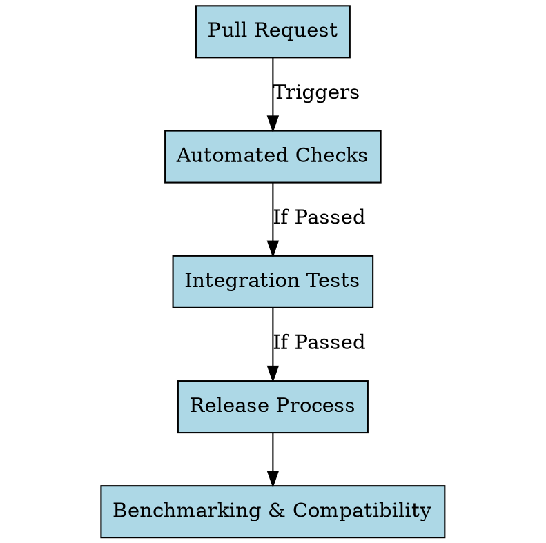
```dot
digraph G {
	rankdir=TD;
	ratio=1.0;
	"Pull Request"->"Automated Checks"[ label="Triggers" ];
	"Automated Checks"->"Integration Tests"[ label="If Passed" ];
	"Integration Tests"->"Release Process"[ label="If Passed" ];
	"Release Process"->"Benchmarking & Compatibility";
	"Automated Checks" [ fillcolor=lightblue, shape=box, style=filled ];
	"Benchmarking & Compatibility" [ fillcolor=lightblue, shape=box, style=filled ];
	"Integration Tests" [ fillcolor=lightblue, shape=box, style=filled ];
	"Pull Request" [ fillcolor=lightblue, shape=box, style=filled ];
	"Release Process" [ fillcolor=lightblue, shape=box, style=filled ];

}
```


---


#### 全面的基准测试与性能分析

本小节将深入介绍 Reth 广泛的基准测试工具与流程，包括如何度量、分析与报告性能，涵盖 "big block" 基准测试、live sync 性能、transaction 生成，以及 `benchmarkoor`、Prometheus 等指标工具的使用。

Source paths:

- `/paradigmxyz/reth/bin/reth-bb`
- `/paradigmxyz/reth/bin/reth-bench`
- `/paradigmxyz/reth/.github/scripts`

Reth 采用一套广泛的工具和流程进行基准测试和性能分析，涵盖 "big block" 执行、live 同步以及 transaction 生成。这些能力对于评估和维护 client 的性能特性至关重要。

[`reth-bench`](%2Fparadigmxyz%2Freth%2FCargo.toml#L323) 工具位于 [`/paradigmxyz/reth/bin/reth-bench`](%2Fparadigmxyz%2Freth%2Fbin%2Freth-bench)，是用于 Reth 性能基准测试的通用工具，尤其专注于 live 同步。它通过模拟一个 Consensus Layer (CL) client、回放历史 blocks，并在受控环境中触发 Reth 的 live sync 代码路径来运行。这允许测量诸如延迟、每区块 gas used 以及 gas 吞吐量（[`GGas/s`](%2Fparadigmxyz%2Freth%2Fbin%2Freth-bench%2FREADME.md#L122)）等关键指标。[`reth-bench`](%2Fparadigmxyz%2Freth%2FCargo.toml#L323) 支持多种 Engine API 交互模拟，包括 [`newPayload`](%2Fparadigmxyz%2Freth%2FAGENTS.md#L21) 与 [`forkchoiceUpdated`](%2Fparadigmxyz%2Freth%2FAGENTS.md#L21) 调用，它们是 mainnet live 同步的基础。它还提供受控的等待模式、RPC 配置选项以及相对于当前 head 进行 block 基准测试的能力，使其适应不同的测试场景。对于深入的性能分析，[`reth-bench`](%2Fparadigmxyz%2Freth%2FCargo.toml#L323) 与 Prometheus 集成进行指标收集，并提供 CSV 格式输出，便于结果的进一步处理和可视化。同时也内建 profiling 支持，允许在 benchmarks 期间进行详细的 CPU 与内存使用分析。[`/paradigmxyz/reth/bin/reth-bench/scripts`](%2Fparadigmxyz%2Freth%2Fbin%2Freth-bench%2Fscripts) 中的脚本便于分析和比较 [`reth-bench`](%2Fparadigmxyz%2Freth%2FCargo.toml#L323) 输出的性能指标，生成诸如延迟直方图和 gas 吞吐量图表的可视化结果，以便识别性能回归或改进。

对于 "big block" 执行基准测试，Reth 使用位于 [`/paradigmxyz/reth/bin/reth-bb`](%2Fparadigmxyz%2Freth%2Fbin%2Freth-bb) 的专用 [`reth-bb`](%2Fparadigmxyz%2Freth%2Fbin%2Freth-bb%2FREADME.md#L1) 工具。这个改造过的 Reth 节点通过将多个标准 blocks 中的 transactions 合并为单个、人为放大的 payloads，来模拟高 gas 工作负载。[`reth-bb`](%2Fparadigmxyz%2Freth%2Fbin%2Freth-bb%2FREADME.md#L1) 放宽了某些 consensus 验证以容纳这些超大 blocks，使其适合压力测试执行性能，而非用于生产。该工作流包括使用 [`reth-bench generate-big-block`](%2Fparadigmxyz%2Freth%2Fbin%2Freth-bb%2FREADME.md#L27) 生成 big blocks、运行 [`reth-bb`](%2Fparadigmxyz%2Freth%2Fbin%2Freth-bb%2FREADME.md#L1) 节点，然后回放生成的 payloads。[`reth-bb`](%2Fparadigmxyz%2Freth%2Fbin%2Freth-bb%2FREADME.md#L1) 节点处理这些大 blocks 的多段执行，其中每个 segment 在其自己的 EVM 环境中运行，以准确模拟原始合并 blocks 的执行上下文。

持续集成与部署 (CI/CD) 基础设施大量利用这些基准测试工具。[`/paradigmxyz/reth/.github/scripts`](%2Fparadigmxyz%2Freth%2F.github%2Fscripts) 中的脚本编排全面的基准测试工作流。例如，[`/paradigmxyz/reth/.github/scripts/bench-benchmarkoor-run.sh`](%2Fparadigmxyz%2Freth%2F.github%2Fscripts%2Fbench-benchmarkoor-run.sh) 管理 Reth 节点生命周期、重置数据目录，并集成测试执行与结果记录。[`/paradigmxyz/reth/.github/scripts/bench-benchmarkoor-snapshot.sh`](%2Fparadigmxyz%2Freth%2F.github%2Fscripts%2Fbench-benchmarkoor-snapshot.sh) 自动化设置 blockchain snapshots，确保一致的基准测试环境。诸如 [`/paradigmxyz/reth/.github/scripts/bench-benchmarkoor-summary.py`](%2Fparadigmxyz%2Freth%2F.github%2Fscripts%2Fbench-benchmarkoor-summary.py) 这样的后处理脚本汇总性能结果，而 [`/paradigmxyz/reth/.github/scripts/bench-reth-summary.py`](%2Fparadigmxyz%2Freth%2F.github%2Fscripts%2Fbench-reth-summary.py) 在 baseline 和 feature 性能之间提供统计比较，包括 `compute_paired_stats` 与 `significance`。指标收集和可视化通过 [`/paradigmxyz/reth/.github/scripts/bench-metrics-proxy.py`](%2Fparadigmxyz%2Freth%2F.github%2Fscripts%2Fbench-metrics-proxy.py)（向 Prometheus 指标注入特定的 benchmark 标签和时间戳）和 [`/paradigmxyz/reth/.github/scripts/bench-reth-charts.py`](%2Fparadigmxyz%2Freth%2F.github%2Fscripts%2Fbench-reth-charts.py)（生成延迟、吞吐量和 gas 指标的图形展示）支持。这些 CI/CD 脚本也管理 transaction 生成 benchmarks，便于在各种 transaction 负载下评估 Reth 的性能。这些 benchmarks 的结果可通过 [`/paradigmxyz/reth/.github/scripts/bench-upload-clickhouse.py`](%2Fparadigmxyz%2Freth%2F.github%2Fscripts%2Fbench-upload-clickhouse.py) 上传到 ClickHouse database 以进行长期性能监控，通知由 [`/paradigmxyz/reth/.github/scripts/bench-slack-notify.js`](%2Fparadigmxyz%2Freth%2F.github%2Fscripts%2Fbench-slack-notify.js) 和 [`/paradigmxyz/reth/.github/scripts/bench-update-status.js`](%2Fparadigmxyz%2Freth%2F.github%2Fscripts%2Fbench-update-status.js) 管理，用于 GitHub pull request 评论。

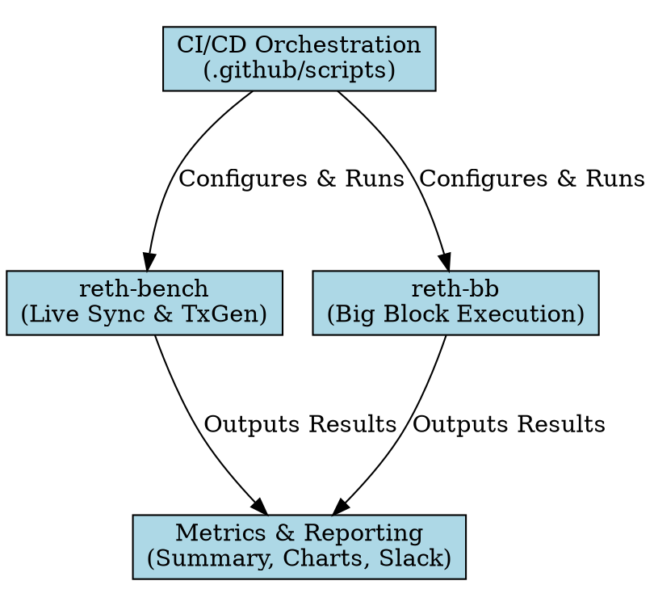
```dot
digraph G {
	rankdir=TD;
	ratio=1.0;
	"CI/CD Orchestration"->"reth-bench (Live Sync)"[ label="Configures & Runs" ];
	"CI/CD Orchestration"->"reth-bb (Big Block)"[ label="Configures & Runs" ];
	"reth-bench (Live Sync)"->"Metrics & Reporting"[ label="Outputs Results" ];
	"reth-bb (Big Block)"->"Metrics & Reporting"[ label="Outputs Results" ];
	"CI/CD Orchestration" [ fillcolor=lightblue, label="CI/CD Orchestration\n(.github/scripts)", shape=box, style=filled ];
	"Metrics & Reporting" [ fillcolor=lightblue, label="Metrics & Reporting\n(Summary, Charts, Slack)", shape=box, style=filled ];
	"reth-bb (Big Block)" [ fillcolor=lightblue, label="reth-bb\n(Big Block Execution)", shape=box, style=filled ];
	"reth-bench (Live Sync)" [ fillcolor=lightblue, label="reth-bench\n(Live Sync & TxGen)", shape=box, style=filled ];

}
```


---

#### 核心开发与贡献指南

本小节将解释为 Reth 做贡献的指南，涵盖项目的 Code of Conduct、bug 报告、功能请求流程、pull request 礼仪以及 hardfork 集成的特定说明，以确保开发的一致性和质量。

Source paths:

- `/paradigmxyz/reth/AGENTS.md`
- `/paradigmxyz/reth/CONTRIBUTING.md`
- `/paradigmxyz/reth/HARDFORK-CHECKLIST.md`
- `/paradigmxyz/reth/scripts`

为 Reth 项目做贡献需要遵守一套旨在维护代码质量、一致性和协作环境的指南。所有贡献均受 Apache 2.0 和 MIT 双许可证保护。

项目制定了一个清晰的 [Code of Conduct][rust-coc]，与 Rust 社区标准一致。违规行为可向 [`georgios@paradigm.xyz`](%2Fparadigmxyz%2Freth%2FCONTRIBUTING.md#L24) 报告。

贡献者可以通过报告 bug、建议功能或提交 pull request 来参与。如需提问或获取帮助，建议在仓库的 discussions 板块讨论，[Reth Docs][reth-docs] 也提供了全面的信息。

Bug 报告应包括 Reth 版本、操作平台、代码片段（如适用）以及具体的复现步骤。功能请求需要详细解释，最好附带来自其他工具的示例。

Pull request 是代码变更的主要机制。对于实质性更改，建议先打开一个 issue 以收集反馈。在合并之前，所有代码更改必须通过 [`make pr`](%2Fparadigmxyz%2Freth%2FMakefile#L40) 检查，包括格式化、linting 和测试。鼓励为较大的功能创建 draft pull request，以便尽早协作并避免重复工作。

提交 pull request 时，必须为任何修改的代码包含一个或多个测试。这包括针对特定函数的 unit tests 和针对更广泛功能的 integration tests。关于运行单个测试的信息可参见 [cargo-test](https://doc.rust-lang.org/cargo/commands/cargo-test.html) 文档。Commits 应当逻辑清晰地组织，"checkpoint" 提交应在打开 pull request 前压缩。一个模板被提供以指导 pull request 提交流程。

项目采用一个评审流程，任何社区成员都可以提供反馈。评审者应当友善、有洞察力、有建设性，专注于改进贡献内容。评审应优先考虑对 Reth 的整体感觉、显著的改进、明确的 bug 以及可读的 commit 消息。增量改进足以合并，且评审者应当请求更改而非苛求更改。小的非必要建议 (nits) 是可接受的，但应明确标注。如果一个 pull request 被放弃，其他人可以接手该工作，并将功劳归于原始贡献者。

对于集成新 hard fork 或 devnet 更改的开发者，[`/paradigmxyz/reth/HARDFORK-CHECKLIST.md`](%2Fparadigmxyz%2Freth%2FHARDFORK-CHECKLIST.md) 中提供了具体的检查清单。该清单指导对 [`alloy`](%2Fparadigmxyz%2Freth%2Fdeny.toml#L93) 内 primitive 数据结构的修改、更新 EIP 数据结构和常量，以及调整诸如 [`Header`](%2Fparadigmxyz%2Freth%2Fcrates%2Fchainspec%2Fsrc%2Fapi.rs#L16) 或 [`Block`](%2Fparadigmxyz%2Freth%2Fbin%2Freth-bb%2Fsrc%2Fmain.rs#L77) 等现有结构。它还详细说明了添加新的 Engine API 类型，并更新 [`ExecutionPayload`](%2Fparadigmxyz%2Freth%2Fcrates%2Fpayload%2Fprimitives%2Fsrc%2Fpayload.rs#L16) 到 Execution Layer (EL) block 的转换逻辑，以及版本特定的验证检查。

对于为 Reth 贡献的 AI agents，[`/paradigmxyz/reth/AGENTS.md`](%2Fparadigmxyz%2Freth%2FAGENTS.md) 中的专用指南概述了架构、开发工作流以及贡献标准。该指南强调模块化、性能、通过 traits 实现可扩展性以及类型安全作为核心设计原则。它还详述了开发工作流，包括代码风格（例如，[`cargo +nightly fmt --all`](%2Fparadigmxyz%2Freth%2FMakefile#L12)、[`cargo +nightly clippy`](%2Fparadigmxyz%2Freth%2FMakefile#L12)）、测试指南（unit、integration、benchmarks、fuzz、property tests），以及性能考量（避免在 hot paths 中分配、使用 [`rayon`](%2Fparadigmxyz%2Freth%2FCargo.toml#L525) 和 [`tokio`](%2Fparadigmxyz%2Freth%2FCargo.toml#L564)）。指南还提供了打开 PR 的最佳实践，包括对标题使用 [Conventional Commits](https://www.conventionalcommits.org/)，并提供关于注释的建议，重点解释 "WHY" 和不显而易见的行为。它还规定了 Rust 风格指南，例如文件中类型的排序应使主要类型与文件名匹配。PR 提交前的 CI 要求包括 format、clippy、tests 和文档更新，特别提到用于 CLI 文档的 [`make update-book-cli`](%2Fparadigmxyz%2Freth%2FMakefile#L40)。

| 贡献类型           | 关键要求与指南 | 评审流程预期 |
| :---------------- | :---------------------------- | :-------------------------- |
| Bug 报告       | 提供 Reth 版本、平台、代码片段以及具体复现步骤。 | 可能会进一步提问以澄清问题。 |
| 功能请求  | 详细解释、附加上下文，并提供其他工具的示例（如适用）。 | 将进行讨论以完善该功能。 |
| Pull Requests     | 遵守 Code of Conduct，通过 `make pr` 检查（fmt、clippy、tests），遵循 commit 消息指南（Conventional Commits），并包含测试。 | 将提供反馈；专注于变更的逻辑分组、增量改进与建设性批评。Nits 可以提，但不应阻塞 PR。 |


---

#### 端到端测试与 Ethereum Foundation 测试集成

本小节将描述 Reth 健壮的测试基础设施，特别聚焦于执行和评估 Ethereum Foundation (EF) 测试的框架、生成测试数据，以及为各种节点交互和场景模拟提供端到端测试工具。

Source paths:

- `/paradigmxyz/reth/testing`
- `/paradigmxyz/reth/crates/e2e-test-utils`

Reth 采用一个健壮的测试基础设施，旨在确保 client 的正确性和性能。这包括一个用于执行和评估 Ethereum Foundation (EF) 测试的全面框架、用于生成合成 blockchain 数据的工具，以及一套用于模拟各种节点交互和场景的端到端测试工具。

针对 Ethereum Foundation 测试的测试框架位于 [`/paradigmxyz/reth/testing/ef-tests`](%2Fparadigmxyz%2Freth%2Ftesting%2Fef-tests)，提供了处理测试用例、管理结果和断言结果的抽象。它特别实现了 [`BlockchainTests`](%2Fparadigmxyz%2Freth%2Ftesting%2Fef-tests%2Fsrc%2Fcases%2Fblockchain_test.rs#L38) 的测试运行器，对于将 Reth 的执行逻辑与已知 Ethereum states 进行验证至关重要。该框架从 JSON 文件加载并过滤测试用例、执行它们，并将执行结果与预期 states 进行验证，包括 state root 验证。这种上下文中的数据建模涉及镜像 EF 测试 JSON 格式的 Rust 结构，便于将测试特定的 fork 定义转换为 Reth 的 [`ChainSpec`](%2Fparadigmxyz%2Freth%2Fbin%2Freth-bb%2Fsrc%2Fmain.rs#L156) 对象。[`/paradigmxyz/reth/testing/runner`](%2Fparadigmxyz%2Freth%2Ftesting%2Frunner) 中提供了一个命令行接口来运行这些 EF blockchain 测试。

除了 EF 测试之外，Reth 还在 [`/paradigmxyz/reth/crates/e2e-test-utils`](%2Fparadigmxyz%2Freth%2Fcrates%2Fe2e-test-utils) 中包含端到端测试工具，简化了测试 Reth 节点设置的创建、配置和交互。这些工具允许生成和配置测试环境、管理节点交互以及处理 transactions。它们还提供用于 payload 和 chain 数据操纵的工具，包括 RLP 导入/导出能力。位于 [`/paradigmxyz/reth/crates/e2e-test-utils/tests`](%2Fparadigmxyz%2Freth%2Fcrates%2Fe2e-test-utils%2Ftests) 的测试套件覆盖了广泛的 Reth 功能，包括核心 blockchain 操作、多节点同步以及使用 [`RocksDB`](%2Fparadigmxyz%2Freth%2Fcrates%2Fstorage%2Fprovider%2Fsrc%2Feither_writer.rs#L85) 的持久化。该框架通过 [`TestBuilder`](%2Fparadigmxyz%2Freth%2Fexamples%2Fexex-test%2Fsrc%2Fmain.rs#L5) 模式支持灵活的场景构造，从而支持复杂的多节点和 consensus 相关测试场景。

为进一步辅助测试和开发，[`/paradigmxyz/reth/testing/testing-utils`](%2Fparadigmxyz%2Freth%2Ftesting%2Ftesting-utils) 目录提供了随机 blockchain 数据生成器和便于自定义 genesis block allocations 的工具。这些生成器可以创建多种 blockchain primitives，例如 sealed headers、带随机 transactions 的完整 blocks、ommers 和 withdrawals，以及模拟 state transitions。该工具中的 [`GenesisAllocator`](%2Fparadigmxyz%2Freth%2Ftesting%2Ftesting-utils%2Fsrc%2Fgenesis_allocator.rs#L44) 允许创建带有特定账户余额、code 和 storage 的自定义 genesis allocations，支持灵活的测试配置。

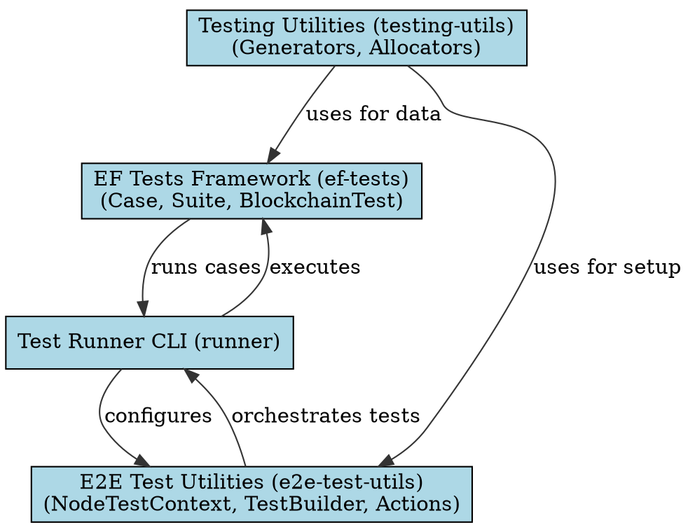
```dot
digraph G {
	overlap=false;
	rankdir=TD;
	ratio=1.0;
	splines=true;
	"Testing Utilities"->"EF Tests Framework"[ color="#333333", label="uses for data" ];
	"Testing Utilities"->"E2E Test Utilities"[ color="#333333", label="uses for setup" ];
	"EF Tests Framework"->"Test Runner CLI"[ color="#333333", label="runs cases" ];
	"E2E Test Utilities"->"Test Runner CLI"[ color="#333333", label="orchestrates tests" ];
	"Test Runner CLI"->"EF Tests Framework"[ color="#333333", label="executes" ];
	"Test Runner CLI"->"E2E Test Utilities"[ color="#333333", label="configures" ];
	"E2E Test Utilities" [ fillcolor=lightblue, label="E2E Test Utilities (e2e-test-utils)\n(NodeTestContext, TestBuilder, Actions)", shape=box, style=filled ];
	"EF Tests Framework" [ fillcolor=lightblue, label="EF Tests Framework (ef-tests)\n(Case, Suite, BlockchainTest)", shape=box, style=filled ];
	"Test Runner CLI" [ fillcolor=lightblue, label="Test Runner CLI (runner)", shape=box, style=filled ];
	"Testing Utilities" [ fillcolor=lightblue, label="Testing Utilities (testing-utils)\n(Generators, Allocators)", shape=box, style=filled ];

}
```


---

#### Reth CLI 应用结构与 Feature Flags

本小节将详述主 `reth` 可执行文件的内部结构，解释它如何从多个 crates 重新导出模块、定义大量用于自定义构建和运行时行为的 feature flags，并管理命令行接口的向后兼容性。

Source paths:

- `/paradigmxyz/reth/bin/reth`

主 [`reth`](%2Fparadigmxyz%2Freth%2FCargo.toml#L320) 可执行文件为启动 Ethereum 节点提供了入口点，处理命令行参数解析并提供 debug 能力。它采用模块化架构设计，从其他 [`reth_`](%2Fparadigmxyz%2Freth%2Fcrates%2Frpc%2Frpc-builder%2Fsrc%2Flib.rs#L875) crates 重新导出多种组件，并使用 feature flags 启用自定义构建和运行时行为。该可执行文件的核心库位于 [`/paradigmxyz/reth/bin/reth/src`](%2Fparadigmxyz%2Freth%2Fbin%2Freth%2Fsrc)，其中包含负责节点初始化和生命周期管理的 [`main.rs`](%2Fparadigmxyz%2Freth%2Fbin%2Freth%2FCargo.toml#L193) 文件。

该可执行文件充当中心枢纽，通过重新导出多个 [`reth_`](%2Fparadigmxyz%2Freth%2Fcrates%2Frpc%2Frpc-builder%2Fsrc%2Flib.rs#L875) crates 中的模块来防止破坏性变更，例如 [`cli`](%2Fparadigmxyz%2Freth%2Fcrates%2Fethereum%2Fcli%2Fsrc%2Fapp.rs#L32)、[`utils`](%2Fparadigmxyz%2Freth%2Fbin%2Freth%2Fsrc%2Flib.rs#L59)、[`payload`](%2Fparadigmxyz%2Freth%2Fcrates%2Fnode%2Ftypes%2Fsrc%2Flib.rs#L111)、[`api`](%2Fparadigmxyz%2Freth%2Fcrates%2Frpc%2Frpc-builder%2Fsrc%2Feth.rs#L10)、[`core`](%2Fparadigmxyz%2Freth%2Fbin%2Freth%2Fsrc%2Flib.rs#L80)、[`prometheus_exporter`](%2Fparadigmxyz%2Freth%2Fbin%2Freth%2Fsrc%2Flib.rs#L85)、[`args`](%2Fparadigmxyz%2Freth%2Fcrates%2Fcli%2Fcommands%2Fsrc%2Fdb%2Flist.rs#L93)、[`version`](%2Fparadigmxyz%2Freth%2Fdeny.toml#L45)、[`builder`](%2Fparadigmxyz%2Freth%2Fcrates%2Ftasks%2Fsrc%2Fpool.rs#L71)、[`dirs`](%2Fparadigmxyz%2Freth%2Fbin%2Freth%2Fsrc%2Flib.rs#L111)、[`chainspec`](%2Fparadigmxyz%2Freth%2Fbin%2Freth%2Fsrc%2Flib.rs#L116)、[`providers`](%2Fparadigmxyz%2Freth%2Fbin%2Freth%2Fsrc%2Flib.rs#L122)、[`primitives`](%2Fparadigmxyz%2Freth%2Fdocs%2Frepo%2Flayout.md#L172)、[`beacon_consensus`](%2Fparadigmxyz%2Freth%2Fbin%2Freth%2Fsrc%2Flib.rs#L134)、[`consensus`](%2Fparadigmxyz%2Freth%2Fcrates%2Fnode%2Fapi%2Fsrc%2Fnode.rs#L86)、[`revm`](%2Fparadigmxyz%2Freth%2FCargo.toml#L437)、[`tasks`](%2Fparadigmxyz%2Freth%2Fcrates%2Fpayload%2Fbasic%2Fsrc%2Flib.rs#L119)、[`network`](%2Fparadigmxyz%2Freth%2Fcrates%2Frpc%2Frpc%2Fsrc%2Fnet.rs#L12)、[`transaction_pool`](%2Fparadigmxyz%2Freth%2Fcrates%2Fnode%2Fbuilder%2Fsrc%2Fcomponents%2Fmod.rs#L74) 以及 [`rpc`](%2Fparadigmxyz%2Freth%2Fexamples%2FREADME.md#L29)。这种 re-export 策略在 [`/paradigmxyz/reth/bin/reth/src/lib.rs`](%2Fparadigmxyz%2Freth%2Fbin%2Freth%2Fsrc%2Flib.rs) 中实现，确保应用可以演进而不会不断破坏其消费者接口。

[`reth`](%2Fparadigmxyz%2Freth%2FCargo.toml#L320) 可执行文件灵活性的一个重要方面来源于在 [`/paradigmxyz/reth/bin/reth/src/lib.rs`](%2Fparadigmxyz%2Freth%2Fbin%2Freth%2Fsrc%2Flib.rs) 中定义的大量 feature flags。这些 flags 控制诸如全局内存 allocator（例如，为性能而使用 [`jemalloc`](%2Fparadigmxyz%2Freth%2Fbin%2Freth%2FCargo.toml#L124) 或作为替代方案的 [`snmalloc`](%2Fparadigmxyz%2Freth%2Fbin%2Freth%2FCargo.toml#L154)）、用于指标的 OpenTelemetry ([`otlp`](%2Fparadigmxyz%2Freth%2Fbin%2Freth%2FCargo.toml#L96))、用于 RPC 调试的 JavaScript tracers ([`js-tracer`](%2Fparadigmxyz%2Freth%2Fbin%2Freth%2FCargo.toml#L104))、用于加密操作的 Keccak256 缓存 ([`keccak-cache-global`](%2Fparadigmxyz%2Freth%2Fbin%2Freth%2FCargo.toml#L119), [`asm-keccak`](%2Fparadigmxyz%2Freth%2Fbin%2Freth%2FCargo.toml#L113))，以及用于调试和监控的各种日志级别等方面。这些特性允许开发者将节点构建定制到特定使用场景，例如优化性能、启用 profiling 工具或调整日志详细程度。

命令行接口的向后兼容性通过 [`/paradigmxyz/reth/bin/reth/src/cli/mod.rs`](%2Fparadigmxyz%2Freth%2Fbin%2Freth%2Fsrc%2Fcli%2Fmod.rs) 来维护，它重新导出已被移至 [`reth_node_core`](%2Fparadigmxyz%2Freth%2Fbin%2Freth%2Fsrc%2Flib.rs#L62) 和 [`reth_ethereum_cli::interface`](%2Fparadigmxyz%2Freth%2Fbin%2Freth%2Fsrc%2Fcli%2Fmod.rs#L12) 的 CLI 相关类型。这确保了依赖 [`reth`](%2Fparadigmxyz%2Freth%2FCargo.toml#L320) CLI 的现有脚本和工具尽管经历内部重构仍能正常工作。整体结构允许一个健壮且可适配的 Ethereum client，其核心可执行文件、各种组件和配置机制之间有清晰的关注点分离。要深入了解 Reth 的整体结构和开发，请参阅 [Reth 项目结构与开发工作流](#reth-project-structure-and-development-workflow)。关于通用 CLI 框架的更多详情，请参阅 [通用 CLI 框架与 Chain Specification 解析](#node-operation-and-command-line-interface-common-cli-framework-and-chain-specification-parsing)。

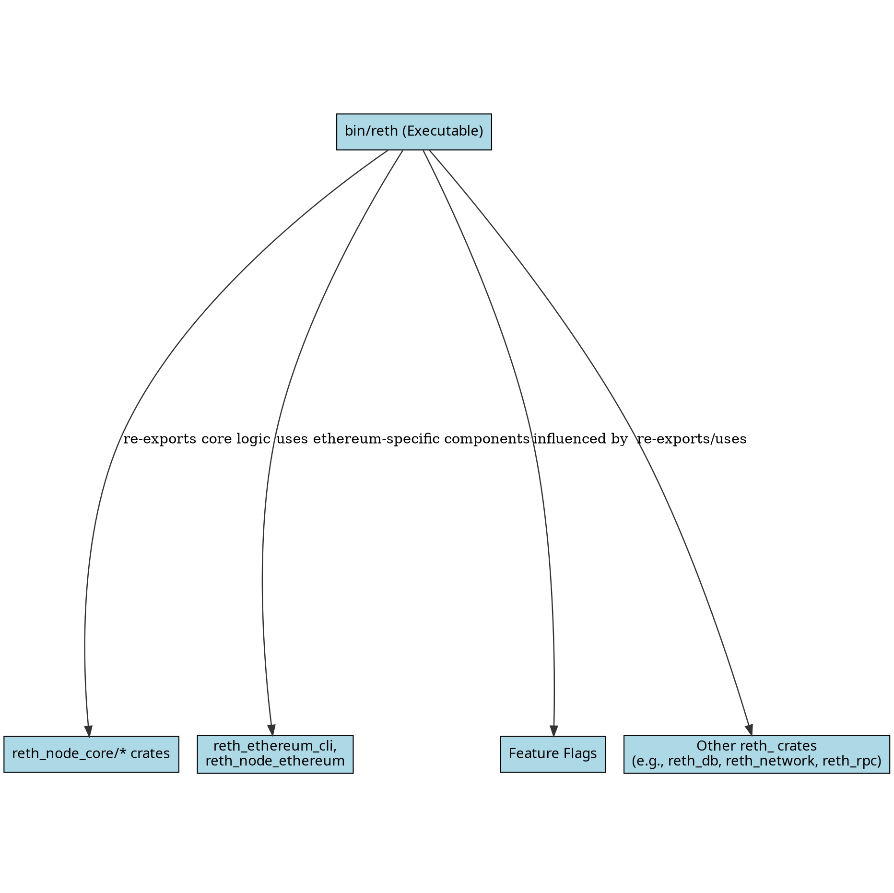
```dot
digraph G {
	rankdir=TD;
	ratio=1.0;
	"bin/reth"->"reth_node_core_crates"[ color="#333333", label="re-exports core logic", penwidth=1.2 ];
	"bin/reth"->"reth_node_specific_crates"[ color="#333333", label="uses ethereum-specific components", penwidth=1.2 ];
	"bin/reth"->"reth_feature_flags"[ color="#333333", label="influenced by", penwidth=1.2 ];
	"bin/reth"->"reth_components"[ color="#333333", label="re-exports/uses", penwidth=1.2 ];
	"bin/reth" [ fillcolor=lightblue, fontname="sans-serif", label="bin/reth (Executable)", shape=box, style=filled ];
	"reth_components" [ fillcolor=lightblue, fontname="sans-serif", label="Other reth_ crates\n(e.g., reth_db, reth_network, reth_rpc)", shape=box, style=filled ];
	"reth_feature_flags" [ fillcolor=lightblue, fontname="sans-serif", label="Feature Flags", shape=box, style=filled ];
	"reth_node_core_crates" [ fillcolor=lightblue, fontname="sans-serif", label="reth_node_core/* crates", shape=box, style=filled ];
	"reth_node_specific_crates" [ fillcolor=lightblue, fontname="sans-serif", label="reth_ethereum_cli,\nreth_node_ethereum", shape=box, style=filled ];

}
```


---

### 节点运行与命令行接口

本节聚焦于如何运行和与 Reth 节点交互。它将详细介绍 Reth 二进制可执行文件提供的核心功能，包括命令行接口 (CLI) 操作、调试能力以及用于性能分析的专用基准测试工具。同时也将涵盖所有基于 Reth 的节点 CLI 的通用接口，包括参数解析、节点标识和命令管理。

Source paths:

- `/paradigmxyz/reth/bin`
- `/paradigmxyz/reth/crates/cli`

Reth 节点主要通过 [`reth`](%2Fparadigmxyz%2Freth%2FCargo.toml#L320) 二进制可执行文件运行，它为管理 Ethereum client 提供了全面的命令行接口 (CLI)。该可执行文件提供核心节点功能、调试工具和专用的基准测试能力。

[`/paradigmxyz/reth/bin`](%2Fparadigmxyz%2Freth%2Fbin) 目录包含主 [`reth`](%2Fparadigmxyz%2Freth%2FCargo.toml#L320) 可执行文件，以及专用的基准测试工具，例如用于 "big block" 场景的 [`reth-bb`](%2Fparadigmxyz%2Freth%2Fbin%2Freth-bb%2FREADME.md#L1) 和用于分析 live 同步性能的 [`reth-bench`](%2Fparadigmxyz%2Freth%2FCargo.toml#L323)。[`reth`](%2Fparadigmxyz%2Freth%2FCargo.toml#L320) 可执行文件作为启动 Ethereum 节点的入口点，处理命令行参数解析并提供调试特性。它从多个 [`reth_`](%2Fparadigmxyz%2Freth%2Fcrates%2Frpc%2Frpc-builder%2Fsrc%2Flib.rs#L875) crates 重新导出模块以提供广泛的功能，并通过 feature flags 支持自定义构建。为 CLI 相关类型维护了向后兼容性，确保版本间的平滑过渡。

所有基于 Reth 的 CLI 的通用接口通过定义在 [`/paradigmxyz/reth/crates/cli/cli/src/lib.rs`](%2Fparadigmxyz%2Freth%2Fcrates%2Fcli%2Fcli%2Fsrc%2Flib.rs) 中的 [`RethCli`](%2Fparadigmxyz%2Freth%2Fcrates%2Fcli%2Fcli%2Fsrc%2Flib.rs#L26) trait 建立。该 trait 标准化 CLI 行为，允许一致的参数解析并与 [`CliRunner`](%2Fparadigmxyz%2Freth%2Fbin%2Freth%2Fsrc%2Flib.rs#L214) 集成以管理执行环境。Chain specification 解析，包括对 genesis 数据的处理，由 [`/paradigmxyz/reth/crates/cli/cli/src/chainspec.rs`](%2Fparadigmxyz%2Freth%2Fcrates%2Fcli%2Fcli%2Fsrc%2Fchainspec.rs) 中的 [`ChainSpecParser`](%2Fparadigmxyz%2Freth%2Fcrates%2Fcli%2Fcli%2Fsrc%2Fchainspec.rs#L35) trait 管理。

一组广泛的 CLI 命令管理 Reth 节点运行的各个方面。这些包括用于配置和启动节点的命令、管理 database 的命令（例如检查 tables、查询数据、生成统计信息、修复 tries、迁移 storage 布局以及清理数据）、导入和导出 blockchain 数据（来自 RLP 编码文件或 ERA 文件）以及从 genesis blocks 或 JSONL state dumps 初始化节点。P2P 网络工具也可用于运行 bootnodes、生成 Enode 标识符以及调试 RLPx 连接等任务。维护和验证命令支持 database pruning、为历史同步验证重新执行 blocks，以及管理 pipeline stages。此外，还提供为 Reth database tables 生成 fuzzed 测试向量的工具。关于具体命令的更多详情，请参阅 [Reth CLI 命令参考](#node-operation-and-command-line-interface-reth-cli-command-reference)。

异步 CLI 命令的执行由 [`/paradigmxyz/reth/crates/cli/runner/src/lib.rs`](%2Fparadigmxyz%2Freth%2Fcrates%2Fcli%2Frunner%2Fsrc%2Flib.rs) 中的 [`CliRunner`](%2Fparadigmxyz%2Freth%2Fbin%2Freth%2Fsrc%2Flib.rs#L214) 框架支持。该框架管理 Tokio 运行时，处理 [`SIGINT`](%2Fparadigmxyz%2Freth%2Fcrates%2Fcli%2Frunner%2Fsrc%2Flib.rs#L64) 和 [`SIGTERM`](%2Fparadigmxyz%2Freth%2Fcrates%2Fcli%2Frunner%2Fsrc%2Flib.rs#L64) 等 OS 信号以实现优雅关闭，并提供 [`TaskExecutor`](%2Fparadigmxyz%2Freth%2Fcrates%2Ftasks%2Fsrc%2Flib.rs#L57) 来 spawn 后台任务，确保健壮的错误和 panic 处理。

支持 Reth CLI 应用的关键工具模块位于 [`/paradigmxyz/reth/crates/cli/util`](%2Fparadigmxyz%2Freth%2Fcrates%2Fcli%2Futil)。这些包括自定义内存 allocator（jemalloc、snmalloc）、协作式任务取消机制、安全的 secret key 管理、高级参数解析函数，以及用于检测 stack overflow 的平台特定信号处理器。

对于大 block 执行的基准测试，[`reth-bb`](%2Fparadigmxyz%2Freth%2Fbin%2Freth-bb%2FREADME.md#L1) 工具（位于 [`/paradigmxyz/reth/bin/reth-bb`](%2Fparadigmxyz%2Freth%2Fbin%2Freth-bb)）通过将多个标准 blocks 中的 transactions 合并为单个大 payloads 来模拟高 gas 工作负载。该工具放宽了某些 consensus 验证以容纳人为放大的 blocks，从而支持在极端条件下进行性能测试。

[`/paradigmxyz/reth/bin/reth-bench`](%2Fparadigmxyz%2Freth%2Fbin%2Freth-bench) 中的 [`reth-bench`](%2Fparadigmxyz%2Freth%2FCargo.toml#L323) 工具为 [`reth`](%2Fparadigmxyz%2Freth%2FCargo.toml#L320) execution client 的 live 同步性能提供了通用基准测试框架。它模拟一个 Consensus Layer (CL) client 来回放历史 blocks，测量性能指标并支持 Engine API 交互。该工具还包括生成 invalid payloads 以测试拒绝行为，以及收集 Prometheus 指标用于详细性能分析的能力。

| 命令          | 类别               | 描述                                                                                                                                                                                                                                                                          |
| :--------------- | :--------------------- | :----------------------------------------------------------------------------------------------------------------------------------------------------------------------------------------------------------------------------------------------------------------------------------- |
| `reth`           | 节点运行         | 用于启动 Ethereum 节点的主 Reth CLI 应用。                                                                                                                                                                                                                        |
| `reth node`      | 节点运行         | 启动 Ethereum 节点，提供可配置的选项，涵盖数据目录、网络、RPC、transaction pool、payload building、调试、database、pruning、engine 和 static files。                                                                                                    |
| `reth download`  | 数据导入/导出     | 下载并提取 snapshot 归档以准备数据目录。支持单个归档下载或基于 manifest 的模块化组件下载，并提供交互式选择。                                                                                                    |
| `reth db`        | Database 管理    | 提供 database 交互工具，包括查看统计信息、列出内容、计算 checksum、复制、diff、drop/clear tables、修复 trie、查看 static file headers、管理设置、checkpoints，以及迁移 database 到 v2。 |
| `reth p2p`       | P2P 工具          | 提供 P2P 网络的调试工具，例如下载 block headers 和 bodies、RLPx 工具、管理 bootnodes 以及打印 enode 标识符。                                                                                                         |
| `reth stage`     | 维护/验证 | 允许运行、drop、dump 或 unwind Reth pipeline 的单个 stage。                                                                                                                                                                                              |
| `reth test-vectors` | 开发/测试    | 为多种数据类型生成测试向量，包括 database tables 和 `Compact` 类型，用于开发和测试。                                                                                                  |


---

#### 核心 Reth 可执行文件与节点管理

本小节将描述 `reth` 二进制文件的核心功能，包括其入口点、参数解析、使用全局 allocator 和信号处理器初始化 Ethereum 节点，以及支持自定义构建和运行时行为的大量模块 re-exports 与 feature flags。

Source paths:

- `/paradigmxyz/reth/bin/reth`
- `/paradigmxyz/reth/bin/reth/src`

[`reth`](%2Fparadigmxyz%2Freth%2FCargo.toml#L320) 二进制可执行文件作为启动和管理 Reth Ethereum 节点的主要入口点。其核心功能围绕命令行参数解析、初始化关键系统组件以及编排节点的运行生命周期。


执行时，[`reth`](%2Fparadigmxyz%2Freth%2FCargo.toml#L320) 二进制文件首先处理内存分配和信号管理。它初始化一个全局 allocator 以实现高效的内存使用，并安装一个信号处理器以优雅地管理 segmentation fault，确保系统稳定性。调试能力默认启用，配置了 backtraces 以便在出现运行时错误时提供详细诊断信息。

命令行参数解析是 [`reth`](%2Fparadigmxyz%2Freth%2FCargo.toml#L320) 的一个基本方面，允许用户配置节点行为的各个方面。[`Cli`](%2Fparadigmxyz%2Freth%2Fcrates%2Fethereum%2Fcli%2Fsrc%2Finterface.rs#L57) 结构与 [`EthereumChainSpecParser`](%2Fparadigmxyz%2Freth%2Fcrates%2Fethereum%2Fcli%2Fsrc%2Fchainspec.rs#L28) 协同工作，处理用户输入，包括对定义节点将与之交互的 Ethereum 网络至关重要的 chain specifications。

[`reth`](%2Fparadigmxyz%2Freth%2FCargo.toml#L320) 可执行文件的一个重要设计原则是其模块化，通过广泛的模块 re-exports 实现。主库文件 ([`/paradigmxyz/reth/bin/reth/src/lib.rs`](%2Fparadigmxyz%2Freth%2Fbin%2Freth%2Fsrc%2Flib.rs)) 充当中心枢纽，使来自众多底层 [`reth_`](%2Fparadigmxyz%2Freth%2Fcrates%2Frpc%2Frpc-builder%2Fsrc%2Flib.rs#L875) crates（例如 [`reth_node_core`](%2Fparadigmxyz%2Freth%2Fbin%2Freth%2Fsrc%2Flib.rs#L62)、[`reth_ethereum_primitives`](%2Fparadigmxyz%2Freth%2Fbin%2Freth%2Fsrc%2Flib.rs#L129) 和 [`reth_network`](%2Fparadigmxyz%2Freth%2Fbin%2Freth%2Fsrc%2Flib.rs#L158)）的组件可通过统一接口访问。这种方式简化了开发，并确保项目演进时的向后兼容性。

节点构建和运行时行为的定制通过 [`/paradigmxyz/reth/bin/reth/src/lib.rs`](%2Fparadigmxyz%2Freth%2Fbin%2Freth%2Fsrc%2Flib.rs) 中定义的一组全面的 feature flags 实现。这些 flags 允许开发者和运维选择不同的内存 allocator（例如，[`jemalloc`](%2Fparadigmxyz%2Freth%2Fbin%2Freth%2FCargo.toml#L124)、[`snmalloc`](%2Fparadigmxyz%2Freth%2Fbin%2Freth%2FCargo.toml#L154)），配置日志详细程度，启用诸如 Keccak256 缓存等性能优化，或激活诸如用于 RPC 调试的 JavaScript tracers 等特定开发工具。这种细粒度的控制确保 [`reth`](%2Fparadigmxyz%2Freth%2FCargo.toml#L320) 二进制文件可针对多种运行环境和性能需求进行定制。

[`/paradigmxyz/reth/bin/reth/src/cli/mod.rs`](%2Fparadigmxyz%2Freth%2Fbin%2Freth%2Fsrc%2Fcli%2Fmod.rs) 模块专门处理命令行接口类型的向后兼容性，确保移至其他 crates 的模块仍可访问，从而防止依赖 [`reth`](%2Fparadigmxyz%2Freth%2FCargo.toml#L320) crate 的 CLI 功能的用户遇到破坏性变更。

最终，[`reth`](%2Fparadigmxyz%2Freth%2FCargo.toml#L320) 二进制文件启动一个 [`EthereumNode`](%2Fparadigmxyz%2Freth%2Fcrates%2Fethereum%2Fnode%2Fsrc%2Fnode.rs#L66) 实例，启动 Ethereum client 运行所需的复杂流程，例如网络同步、transaction 处理和 state 管理。然后节点进入等待状态，优雅地管理其生命周期，直到收到关闭命令。

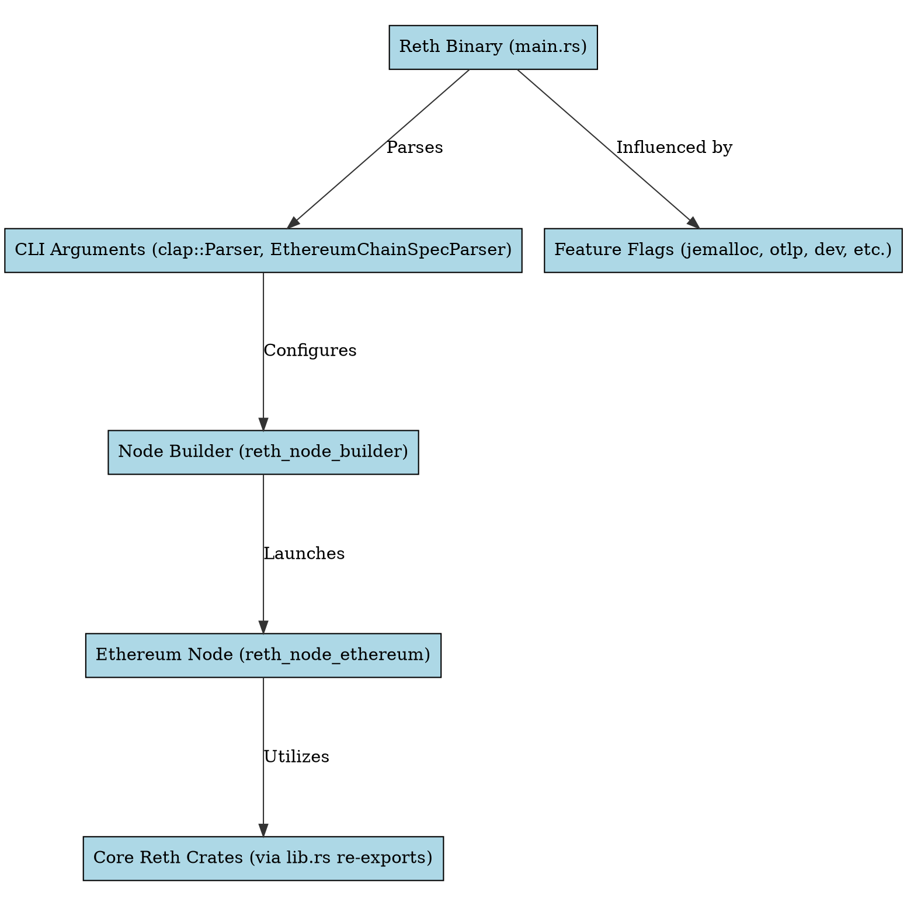
```dot
digraph G {
	overlap=true;
	rankdir=TD;
	ratio=1.0;
	splines=true;
	RethBinary->CliArguments[ color="#333333", label="Parses" ];
	CliArguments->NodeBuilder[ color="#333333", label="Configures" ];
	NodeBuilder->EthereumNode[ color="#333333", label="Launches" ];
	EthereumNode->RethCrates[ color="#333333", label="Utilizes" ];
	RethBinary->FeatureFlags[ color="#333333", label="Influenced by" ];
	CliArguments [ fillcolor=lightblue, label="CLI Arguments (clap::Parser, EthereumChainSpecParser)", shape=box, style=filled ];
	EthereumNode [ fillcolor=lightblue, label="Ethereum Node (reth_node_ethereum)", shape=box, style=filled ];
	FeatureFlags [ fillcolor=lightblue, label="Feature Flags (jemalloc, otlp, dev, etc.)", shape=box, style=filled ];
	NodeBuilder [ fillcolor=lightblue, label="Node Builder (reth_node_builder)", shape=box, style=filled ];
	RethBinary [ fillcolor=lightblue, label="Reth Binary (main.rs)", shape=box, style=filled ];
	RethCrates [ fillcolor=lightblue, label="Core Reth Crates (via lib.rs re-exports)", shape=box, style=filled ];

}
```


---

#### 通用 CLI 框架与 Chain Specification 解析

本小节将详述所有基于 Reth 的 CLI 的通用接口，涵盖用于标准化行为的 `RethCli` trait、使用 `clap` 进行参数解析，以及用于处理 blockchain chain specification（包括解析 genesis 数据）的 `ChainSpecParser`。

Source paths:

- `/paradigmxyz/reth/crates/cli/cli`
- `/paradigmxyz/reth/crates/cli/cli/src`

所有基于 Reth 的命令行接口 (CLI) 的通用框架由 [`RethCli`](%2Fparadigmxyz%2Freth%2Fcrates%2Fcli%2Fcli%2Fsrc%2Flib.rs#L26) trait 建立，它标准化了应用行为、参数解析以及节点标识。该 trait 在 [`/paradigmxyz/reth/crates/cli/cli/src/lib.rs`](%2Fparadigmxyz%2Freth%2Fcrates%2Fcli%2Fcli%2Fsrc%2Flib.rs) 中定义，为管理 CLI 生命周期提供了一致的接口，从参数解析到在运行时环境中执行命令。它利用 [`clap`](%2Fparadigmxyz%2Freth%2FCargo.toml#L501) crate 进行健壮的命令行参数处理，使应用能够高效地解析输入。

该框架的一个关键方面是处理 blockchain chain specification。[`ChainSpecParser`](%2Fparadigmxyz%2Freth%2Fcrates%2Fcli%2Fcli%2Fsrc%2Fchainspec.rs#L35) trait 在 [`/paradigmxyz/reth/crates/cli/cli/src/chainspec.rs`](%2Fparadigmxyz%2Freth%2Fcrates%2Fcli%2Fcli%2Fsrc%2Fchainspec.rs) 中实现，定义了如何解析和管理 chain 特定数据，例如 genesis 配置。这包括识别预定义的 chain 名称，以及从文件路径或直接 JSON 字符串解析 genesis 数据。这种模块化方法确保不同的基于 Reth 的 CLI 通过实现一个通用解析接口，可以轻松支持多种 Ethereum 网络和配置。[`ChainSpecParser`](%2Fparadigmxyz%2Freth%2Fcrates%2Fcli%2Fcli%2Fsrc%2Fchainspec.rs#L35) 还与 [`clap`](%2Fparadigmxyz%2Freth%2FCargo.toml#L501) 集成，为 chain 相关参数提供描述性的帮助消息和默认值。

[`RethCli`](%2Fparadigmxyz%2Freth%2Fcrates%2Fcli%2Fcli%2Fsrc%2Flib.rs#L26) trait 通过与 [`CliRunner`](%2Fparadigmxyz%2Freth%2Fbin%2Freth%2Fsrc%2Flib.rs#L214) 集成进一步支持命令的执行。该 runner 负责设置和管理 CLI 命令的执行环境，确保从参数解析到命令执行的简化流程。关于 CLI 命令如何组织和管理的更多详情，请参阅 [Reth CLI 命令参考](#node-operation-and-command-line-interface-reth-cli-command-reference) 和 [CLI 运行时执行与任务管理](#node-operation-and-command-line-interface-cli-runtime-execution-and-task-management)。

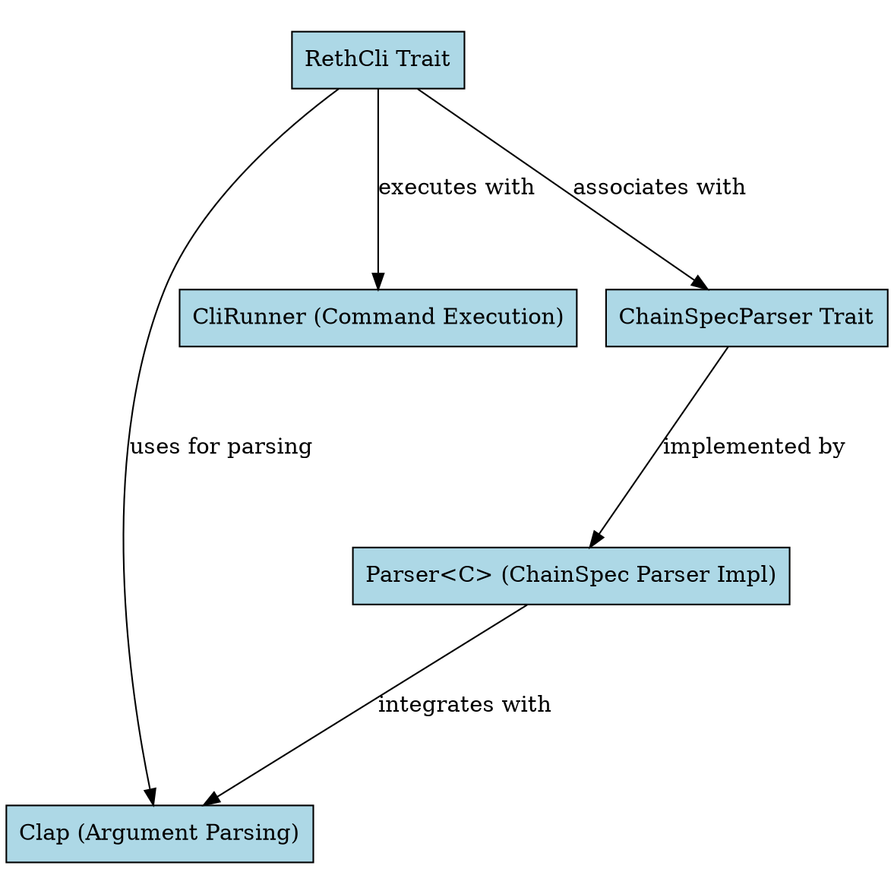
```dot
digraph G {
	rankdir=TD;
	ratio=1.0;
	RethCli->Clap[ label="uses for parsing" ];
	RethCli->CliRunner[ label="executes with" ];
	RethCli->ChainSpecParser[ label="associates with" ];
	ChainSpecParser->ParserImpl[ label="implemented by" ];
	ParserImpl->Clap[ label="integrates with" ];
	ChainSpecParser [ fillcolor=lightblue, label="ChainSpecParser Trait", shape=box, style=filled ];
	Clap [ fillcolor=lightblue, label="Clap (Argument Parsing)", shape=box, style=filled ];
	CliRunner [ fillcolor=lightblue, label="CliRunner (Command Execution)", shape=box, style=filled ];
	ParserImpl [ fillcolor=lightblue, label="Parser<C> (ChainSpec Parser Impl)", shape=box, style=filled ];
	RethCli [ fillcolor=lightblue, label="RethCli Trait", shape=box, style=filled ];

}
```


---

#### Reth CLI 命令参考

本小节将对 `reth` CLI 命令的广泛集合提供深入参考，涵盖节点生命周期与配置、全面的 database 管理工具（检查、查询、维护、统计）、数据导入/导出、从多种来源初始化节点、P2P 网络工具，以及诸如 pruning 和重新执行等维护/验证工具。

Source paths:

- `/paradigmxyz/reth/crates/cli/commands`
- `/paradigmxyz/reth/crates/cli/commands/src`

[`reth`](%2Fparadigmxyz%2Freth%2FCargo.toml#L320) 命令行接口 (CLI) 为管理 Ethereum 节点提供了一套全面的工具。这些命令主要组织在 [`/paradigmxyz/reth/crates/cli/commands`](%2Fparadigmxyz%2Freth%2Fcrates%2Fcli%2Fcommands) 目录中，提供从节点运行和配置到详细 database 管理、数据导入/导出和网络工具等多种功能。

节点生命周期和配置通过主 [`reth node`](%2Fparadigmxyz%2Freth%2FAGENTS.md#L1) 命令管理，允许用户配置和启动 Reth 节点。该命令解析与网络、RPC 服务、transaction pooling 和调试相关的各种参数。[`reth config`](%2Fparadigmxyz%2Freth%2FAGENTS.md#L1) 命令在 [`/paradigmxyz/reth/crates/cli/commands/src/config_cmd.rs`](%2Fparadigmxyz%2Freth%2Fcrates%2Fcli%2Fcommands%2Fsrc%2Fconfig_cmd.rs) 中定义，允许用户显示节点配置，可来自指定文件或使用默认设置。通用命令行参数和环境设置由 [`/paradigmxyz/reth/crates/cli/commands/src/common.rs`](%2Fparadigmxyz%2Freth%2Fcrates%2Fcli%2Fcommands%2Fsrc%2Fcommon.rs) 中的 [`EnvironmentArgs`](%2Fparadigmxyz%2Freth%2Fcrates%2Fcli%2Fcommands%2Fsrc%2Fprune.rs#L2) 处理，解析数据目录、加载节点配置，并初始化 database 和 static file providers，包括一致性检查。

对于全面的 database 管理，[`reth db`](%2Fparadigmxyz%2Freth%2FMakefile#L9) 命令提供了一套子命令。用户可以检查 database tables、从 MDBX、RocksDB 或 static files 检索数据，并使用诸如 [`reth db list`](%2Fparadigmxyz%2Freth%2FMakefile#L9)、[`reth db get`](%2Fparadigmxyz%2Freth%2FMakefile#L9) 和 [`reth db static-file-header`](%2Fparadigmxyz%2Freth%2Fdocs%2Fvocs%2Fsidebar-cli-reth.ts#L3) 等命令分别查询 static file headers。Database 和 static files 的统计分析通过 [`reth db stats`](%2Fparadigmxyz%2Freth%2FCargo.toml#L320) 可用。完整性检查由 [`reth db checksum`](%2Fparadigmxyz%2Freth%2Fdocs%2Fvocs%2Fsidebar-cli-reth.ts#L3) 命令支持，可为各种 database 组件计算 checksum，[`reth db repair-trie`](%2Fparadigmxyz%2Freth%2Fdocs%2Fvocs%2Fsidebar-cli-reth.ts#L3) 用于验证和修复 Merkle Patricia Trie。Database 维护包括用于复制 database 的 [`reth db copy`](%2Fparadigmxyz%2Freth%2FMakefile#L9)，用于从 tables 或 static files 删除数据的 [`reth db clear`](%2Fparadigmxyz%2Freth%2FAGENTS.md#L1)，以及用于更新 storage 布局的 [`reth db migrate-v2`](%2Fparadigmxyz%2Freth%2Fdocs%2Fvocs%2Fsidebar-cli-reth.ts#L3)。Pruning 和 stage checkpoint 管理通过 [`reth db prune-checkpoints`](%2Fparadigmxyz%2Freth%2Fdocs%2Fvocs%2Fsidebar-cli-reth.ts#L3) 和 [`reth db stage-checkpoints`](%2Fparadigmxyz%2Freth%2Fdocs%2Fvocs%2Fsidebar-cli-reth.ts#L3) 可用，而 [`reth db settings`](%2Fparadigmxyz%2Freth%2FCONTRIBUTING.md#L1) 允许配置 storage 选项。这些 database 功能在 [Database 抽象层与数据建模](#data-storage-and-retrieval-database-abstraction-layer-and-data-modeling) 和 [MDBX Database 实现与管理](#data-storage-and-retrieval-mdbx-database-implementation-and-management) 中有详尽介绍。

数据导入和导出功能也集成到 CLI 中。[`reth import`](%2Fparadigmxyz%2Freth%2FREADME.md#L1) 命令由 [`/paradigmxyz/reth/crates/cli/commands/src/import.rs`](%2Fparadigmxyz%2Freth%2Fcrates%2Fcli%2Fcommands%2Fsrc%2Fimport.rs) 及其位于 [`/paradigmxyz/reth/crates/cli/commands/src/import_core.rs`](%2Fparadigmxyz%2Freth%2Fcrates%2Fcli%2Fcommands%2Fsrc%2Fimport_core.rs) 的核心逻辑驱动，允许从文件向 database 导入 RLP 编码的 blocks。类似地，[`reth import-era`](%2Fparadigmxyz%2Freth%2Fbin%2Freth%2Ftests%2Fit%2Fmain.rs#L5) 可以通过从 ERA 文件导入 blockchain 数据来初始化节点，而 [`reth export-era`](%2Fparadigmxyz%2Freth%2Fbin%2Freth%2Ftests%2Fit%2Fmain.rs#L5)（定义在 [`/paradigmxyz/reth/crates/cli/commands/src/export_era.rs`](%2Fparadigmxyz%2Freth%2Fcrates%2Fcli%2Fcommands%2Fsrc%2Fexport_era.rs) 中）支持将 block 数据导出到 ERA1 文件。从外部源初始化节点还包括用于使用 genesis block 设置 database 的 [`reth init`](%2Fparadigmxyz%2Freth%2Fbin%2Freth-bb%2Fsrc%2Fevm.rs#L22)（[`/paradigmxyz/reth/crates/cli/commands/src/init_cmd.rs`](%2Fparadigmxyz%2Freth%2Fcrates%2Fcli%2Fcommands%2Fsrc%2Finit_cmd.rs)）以及用于从 JSONL state dumps 初始化的 [`reth init-state`](%2Fparadigmxyz%2Freth%2Fbin%2Freth%2Ftests%2Fit%2Fmain.rs#L5)。此外，[`reth dump-genesis`](%2Fparadigmxyz%2Freth%2Fbin%2Freth%2Ftests%2Fit%2Fmain.rs#L5) 命令（[`/paradigmxyz/reth/crates/cli/commands/src/dump_genesis.rs`](%2Fparadigmxyz%2Freth%2Fcrates%2Fcli%2Fcommands%2Fsrc%2Fdump_genesis.rs)）输出 genesis block 的 JSON 配置。

P2P 网络工具在 [`reth p2p`](%2Fparadigmxyz%2Freth%2FAGENTS.md#L1) 命令下可用。这些包括用于运行仅 discovery bootnode 的 [`reth p2p bootnode`](%2Fparadigmxyz%2Freth%2Fcrates%2Fnet%2Fdiscv4%2Fsrc%2Flib.rs#L2154)，用于生成 Enode 标识符的 [`reth p2p enode`](%2Fparadigmxyz%2Freth%2Fcrates%2Fnet%2Fdiscv5%2Fsrc%2Flib.rs#L4)，以及用于 RLPx 调试（例如 ping 节点和执行 ECIES 加密握手）的 [`reth p2p rlpx`](%2Fparadigmxyz%2Freth%2FCargo.toml#L320)。这些工具在 [Peer 发现机制 (Discv4、Discv5 与 DNS)](#networking-and-peer-to-peer-communication-peer-discovery-mechanisms-discv4-discv5-and-dns) 和 [RLPx ECIES 安全传输协议](#networking-and-peer-to-peer-communication-rlpx-ecies-secure-transport-protocol) 中有进一步阐述。

对于维护和验证，[`reth prune`](%2Fparadigmxyz%2Freth%2FCargo.toml#L320) 命令管理 database pruning，支持将数据迁移到 static files 并 compact database。[`reth re-execute`](%2Fparadigmxyz%2Freth%2Fbin%2Freth%2Ftests%2Fit%2Fmain.rs#L5) 命令通过从 database 重新执行 blocks 来验证历史同步。[`reth stage`](%2Fparadigmxyz%2Freth%2FREADME.md#L1) 子命令对同步 pipeline stages 提供细粒度控制，允许用户运行、drop、dump 或 unwind 特定 stage。测试向量生成主要用于 fuzzing 和数据完整性，由 [`reth test-vectors compact`](%2Fparadigmxyz%2Freth%2Fcrates%2Fcli%2Fcommands%2Fsrc%2Ftest_vectors%2Fmod.rs#L5) 和 [`reth test-vectors tables`](%2Fparadigmxyz%2Freth%2Fcrates%2Fcli%2Fcommands%2Fsrc%2Ftest_vectors%2Fmod.rs#L6) 支持，但这些通常用于开发和测试上下文。

| 命令 | 子命令 | 描述 | 源文件 |
| :---: | :---: | :--- | :---: |
| `node` | | 启动一个具有可配置网络、RPC、database 和其他设置的 Reth 节点。 | `node.rs` |
| `config` | | 显示默认节点配置或指定的配置文件。 | `config_cmd.rs` |
| `db` | `stats` | 列出 database table 统计信息，包括 MDBX 和 RocksDB 的条目计数和大小。 | `db/mod.rs`, `db/stats.rs` |
| | `list` | 列出指定 database table 的内容，并提供过滤选项。 | `db/mod.rs`, `db/list.rs` |
| | `get` | 从 MDBX、RocksDB 或 static files 检索并显示特定 key 的内容。 | `db/mod.rs`, `db/get.rs` |
| | `checksum` | 计算并显示 database tables 或 static file segments 的 checksum。 | `db/mod.rs`, `db/checksum/mod.rs` |
| | `copy` | 将 MDBX database 复制到新位置，可选地进行 compaction。 | `db/mod.rs`, `db/copy.rs` |
| | `clear` | 删除指定 database table 或 static file segment 的所有条目。 | `db/mod.rs`, `db/clear.rs` |
| | `repair-trie` | 验证并可选地修复 Merkle Patricia Trie 中的不一致问题。 | `db/mod.rs`, `db/repair_trie.rs` |
| | `static-file-header` | 读取并显示 static file segment 的 header 元数据。 | `db/mod.rs`, `db/static_file_header.rs` |
| | `migrate-v2` | 将 storage 从 v1 (仅 MDBX) 迁移到 v2 (static files + RocksDB)。 | `db/mod.rs`, `db/migrate_v2.rs` |
| | `prune-checkpoints` | 查看或设置各种 database segments 的 pruning checkpoints。 | `db/mod.rs`, `db/prune_checkpoints.rs` |
| | `stage-checkpoints` | 查看或设置不同 pipeline stages 的 stage checkpoints。 | `db/mod.rs`, `db/stage_checkpoints.rs` |
| `import` | | 从一个或多个文件向 database 导入 RLP 编码的 blocks。 | `import.rs`, `import_core.rs` |
| `import-era` | | 从 ERA 文件（本地目录或远程 URL）导入 block 数据。 | `import_era.rs` |
| `export-era` | | 将 database 中的 block 数据导出为 ERA1 文件。 | `export_era.rs` |
| `init` | | 使用 chain specification 定义的 genesis block 初始化 database。 | `init_cmd.rs` |
| `init-state` | | 从 JSONL state dump 文件初始化 database state。 | `init_state/mod.rs` |
| `dump-genesis` | | 打印指定 chain 的 genesis block JSON 配置。 | `dump_genesis.rs` |
| `p2p` | `header`, `body` | 从 P2P 网络下载特定的 block header 或 body。 | `p2p/mod.rs` |
| | `rlpx` | 提供 RLPx 协议工具，例如 ping 一个节点。 | `p2p/mod.rs`, `p2p/rlpx.rs` |
| | `bootnode` | 启动一个仅 discovery 的 bootnode，用于 P2P 网络引导。 | `p2p/mod.rs`, `p2p/bootnode.rs` |
| | `enode` | 打印给定 secret key 的 enode 标识符。 | `p2p/mod.rs`, `p2p/enode.rs` |
| `prune` | | 根据配置的 pruning 模式从 database pruning 旧数据。 | `prune.rs` |
| `re-execute` | | 并行重新执行 database 中的 blocks 以验证历史同步正确性。 | `re_execute.rs` |
| `stage` | `run` | 为指定的 block 范围运行单个 pipeline stage。 | `stage/mod.rs`, `stage/run.rs` |
| | `drop` | 删除一个 stage 的 tables 并重置其在 database 中的 checkpoint。 | `stage/mod.rs`, `stage/drop.rs` |
| | `dump` | 将一个范围内 stage 的数据 dump 到新的 database。 | `stage/mod.rs`, `stage/dump.rs` |
| | `unwind` | 从 database unwind 特定的 block 范围，删除其数据。 | `stage/mod.rs`, `stage/unwind.rs` |
| `test-vectors` | `tables` | 为 database tables 生成测试向量。 | `test_vectors/mod.rs`, `test_vectors/tables.rs` |
| | `compact` | 为 `Compact` codec 类型生成或验证测试向量。 | `test_vectors/mod.rs`, `test_vectors/compact.rs` |


---

#### CLI 运行时执行与任务管理

本小节将解释执行异步 CLI 命令的框架，包括 `CliRunner` 如何管理 Tokio runtime、处理 OS 信号以实现优雅关闭、提供 `TaskExecutor` 用于 spawn 后台任务，以及确保健壮的错误和 panic 处理。

Source paths:

- `/paradigmxyz/reth/crates/cli/runner`
- `/paradigmxyz/reth/crates/cli/runner/src`

Reth 命令行接口 (CLI) 使用一个框架来执行异步命令、管理其生命周期并处理优雅关闭。该框架主要由 [`CliRunner`](%2Fparadigmxyz%2Freth%2Fbin%2Freth%2Fsrc%2Flib.rs#L214) 结构体现，抽象了运行时管理、信号处理和任务协调的复杂性。

[`CliRunner`](%2Fparadigmxyz%2Freth%2Fbin%2Freth%2Fsrc%2Flib.rs#L214) 管理一个 Tokio runtime，这对于高效处理异步操作至关重要。它通过利用 Tokio 的 [`spawn_blocking`](%2Fparadigmxyz%2Freth%2FAGENTS.md#L154) 来防止主事件循环被阻塞，从而提供执行命令的机制，包括 CPU 密集型任务。[`CliRunner`](%2Fparadigmxyz%2Freth%2Fbin%2Freth%2Fsrc%2Flib.rs#L214) 被配置为拦截诸如 [`SIGINT`](%2Fparadigmxyz%2Freth%2Fcrates%2Fcli%2Frunner%2Fsrc%2Flib.rs#L64) (Ctrl-C) 和 [`SIGTERM`](%2Fparadigmxyz%2Freth%2Fcrates%2Fcli%2Frunner%2Fsrc%2Flib.rs#L64) 等操作系统信号，从而支持长时间运行操作的优雅终止。在关闭期间，它编排有序地停止 spawned tasks，让它们在可配置的超时内完成工作。

对于后台任务，[`CliContext`](%2Fparadigmxyz%2Freth%2Fbin%2Freth%2Fsrc%2Flib.rs#L214) 结构提供了一个 [`TaskExecutor`](%2Fparadigmxyz%2Freth%2Fcrates%2Ftasks%2Fsrc%2Flib.rs#L57)，允许命令 spawn 额外的异步任务。该框架还包含健壮的错误和 panic 处理，确保错误被传播，并在关键后台服务遇到 panic 时 CLI 能及时退出。这种设计优先支持异步执行，同时明确支持阻塞操作，从而维持系统的稳定性和响应性。

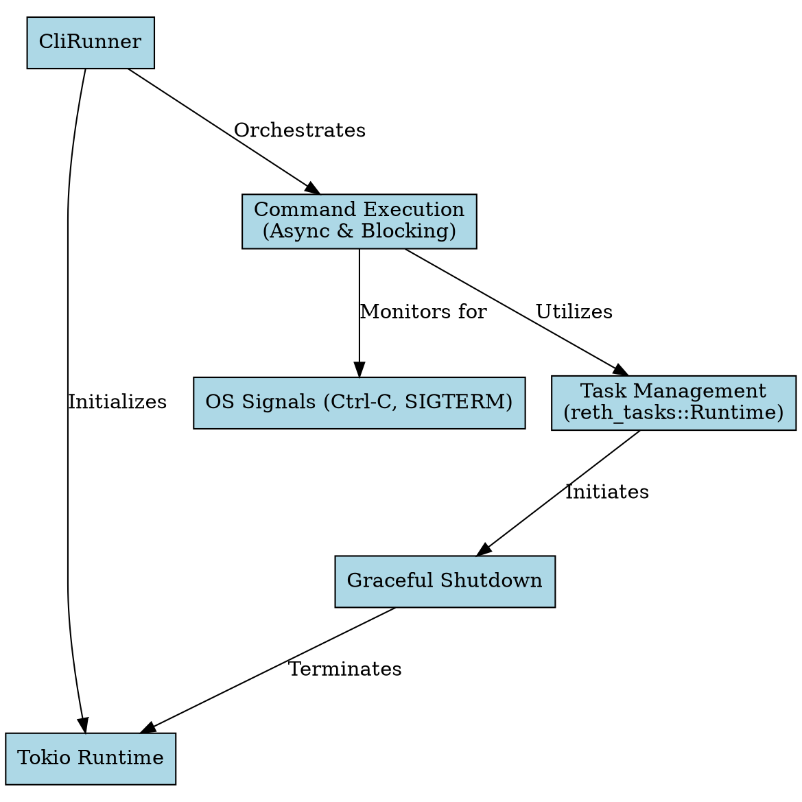
```dot
digraph G {
	rankdir=TD;
	ratio=1.0;
	CliRunner->TokioRuntime[ label="Initializes" ];
	CliRunner->CommandExecution[ label="Orchestrates" ];
	CommandExecution->OSSignals[ label="Monitors for" ];
	CommandExecution->TaskManagement[ label="Utilizes" ];
	TaskManagement->GracefulShutdown[ label="Initiates" ];
	GracefulShutdown->TokioRuntime[ label="Terminates" ];
	CliRunner [ fillcolor=lightblue, label="CliRunner", shape=box, style=filled ];
	CommandExecution [ fillcolor=lightblue, label="Command Execution\n(Async & Blocking)", shape=box, style=filled ];
	GracefulShutdown [ fillcolor=lightblue, label="Graceful Shutdown", shape=box, style=filled ];
	OSSignals [ fillcolor=lightblue, label="OS Signals (Ctrl-C, SIGTERM)", shape=box, style=filled ];
	TaskManagement [ fillcolor=lightblue, label="Task Management\n(reth_tasks::Runtime)", shape=box, style=filled ];
	TokioRuntime [ fillcolor=lightblue, label="Tokio Runtime", shape=box, style=filled ];

}
```


---

#### CLI 工具模块

本小节将涵盖在 Reth CLI 应用中使用的关键工具模块，例如自定义内存 allocator 配置 (jemalloc、snmalloc)、协作式任务取消机制、安全的 secret key 管理、高级参数解析函数，以及用于检测和调试 stack overflow 的平台特定信号处理器。

Source paths:

- `/paradigmxyz/reth/crates/cli/util`

Reth 命令行接口 (CLI) 应用依赖一组工具模块来处理诸如内存管理、进程控制、安全凭证处理和健壮的输入解析等通用功能。这些工具集中在 [`/paradigmxyz/reth/crates/cli/util`](%2Fparadigmxyz%2Freth%2Fcrates%2Fcli%2Futil) 中。

Reth CLI 应用的内存分配可通过 [`/paradigmxyz/reth/crates/cli/util/src/allocator.rs`](%2Fparadigmxyz%2Freth%2Fcrates%2Fcli%2Futil%2Fsrc%2Fallocator.rs) 中定义的 [`allocator`](%2Fparadigmxyz%2Freth%2Fcrates%2Fcli%2Futil%2Fsrc%2Flib.rs#L16) 模块进行自定义。该模块允许在 Unix 系统上选择诸如 [`jemalloc`](%2Fparadigmxyz%2Freth%2Fbin%2Freth%2FCargo.toml#L124) 或 [`snmalloc`](%2Fparadigmxyz%2Freth%2Fbin%2Freth%2FCargo.toml#L154) 等高性能 allocator，如未配置自定义选项则回退到标准系统 allocator。这种 feature-gated 方法支持性能调优而不改变核心应用逻辑，也可与内存 profiling 工具集成。

协作式任务取消由 [`/paradigmxyz/reth/crates/cli/util/src/cancellation.rs`](%2Fparadigmxyz%2Freth%2Fcrates%2Fcli%2Futil%2Fsrc%2Fcancellation.rs) 中的 [`cancellation`](%2Fparadigmxyz%2Freth%2Fcrates%2Fcli%2Futil%2Fsrc%2Flib.rs#L17) 模块管理。该模块提供了跨线程信号和检测取消请求的机制，允许 CLI 应用优雅关闭或中断长时间运行的操作。其设计利用原子操作以确保线程安全和效率。

[`secp256k1::SecretKey`](%2Fparadigmxyz%2Freth%2Fcrates%2Fnet%2Fdns%2Fsrc%2Flib.rs#L28) 实例的安全管理由 [`/paradigmxyz/reth/crates/cli/util/src/load_secret_key.rs`](%2Fparadigmxyz%2Freth%2Fcrates%2Fcli%2Futil%2Fsrc%2Fload_secret_key.rs) 中的 [`load_secret_key`](%2Fparadigmxyz%2Freth%2Fcrates%2Fcli%2Futil%2Fsrc%2Flib.rs#L20) 模块处理。该工具便于生成新的 secret key、从文件系统加载现有 key，并从各种字符串格式（包括十六进制表示）解析它们。它包含针对文件系统操作和解码问题的全面错误处理。

[`parsers`](%2Fparadigmxyz%2Freth%2Fcrates%2Fcli%2Futil%2Fsrc%2Flib.rs#L24) 模块在 [`/paradigmxyz/reth/crates/cli/util/src/parsers.rs`](%2Fparadigmxyz%2Freth%2Fcrates%2Fcli%2Futil%2Fsrc%2Fparsers.rs) 中定义，提供一组用于将 CLI 参数的字符串输入转换为结构化数据类型的函数。这包括解析 duration（支持秒和毫秒）、解析 socket address、解释 blockchain 标识符（例如 block hash 或 number），以及将人类可读的 Ether 值转换为其 Wei 等价物。这些 parsers 提升了 CLI 输入处理的友好性和健壮性。

对于调试关键错误，特别是 stack overflow，Reth 在 [`/paradigmxyz/reth/crates/cli/util/src/sigsegv_handler.rs`](%2Fparadigmxyz%2Freth%2Fcrates%2Fcli%2Futil%2Fsrc%2Fsigsegv_handler.rs) 的 [`sigsegv_handler`](%2Fparadigmxyz%2Freth%2Fbin%2Freth%2Fsrc%2Fmain.rs#L21) 模块中包含一个平台特定的 [`SIGSEGV`](%2Fparadigmxyz%2Freth%2Fcrates%2Fcli%2Futil%2Fsrc%2Fsigsegv_handler.rs#L35) 处理器。该处理器主要面向类 Unix 系统，旨在捕获 segmentation fault，并直接向标准错误提供详细的 stack trace。它采用替代的 signal stack 以确保即使主程序 stack 损坏，处理器也能执行。此外，它还包含检测并压缩 stack trace 中循环模式的逻辑，这些通常是无限递归的指标。

| 模块 | 文件路径 | 描述 |
| :----: | :-------- | :---------- |
| `allocator` | `crates/cli/util/src/allocator.rs` | 提供自定义内存 allocator 实现，在 Unix 系统上优先使用 `jemalloc` 或 `snmalloc`，并支持 `tracy-allocator` profiling。 |
| `cancellation` | `crates/cli/util/src/cancellation.rs` | 为协作式任务取消提供线程安全的 primitives，包括 `CancellationToken` 和 `CancellationGuard`。 |
| `load_secret_key` | `crates/cli/util/src/load_secret_key.rs` | 处理加密 secret key 的加载和生成，包含针对文件系统和解码问题的错误处理。 |
| `parsers` | `crates/cli/util/src/parsers.rs` | 包含解析各种 CLI 输入类型的工具函数，例如 duration、`BlockHashOrNumber`、`SocketAddr` 和 Ether 值。 |
| `sigsegv_handler` | `crates/cli/util/src/sigsegv_handler.rs` | 在受支持的 Unix 系统上安装 SIGSEGV 信号处理器，在出现 segmentation fault 时打印 stack trace。 |


---

#### Reth Big Block 基准测试工具 (`reth-bb`)

本小节将描述用于 "big block" 基准测试的专用 `reth-bb` 工具，解释它如何模拟高 gas 工作负载、定制 EVM 配置与 payload 处理、放宽 consensus 验证，并允许对合并 transactions 进行多段执行。

Source paths:

- `/paradigmxyz/reth/bin/reth-bb`
- `/paradigmxyz/reth/bin/reth-bb/src`

[`reth-bb`](%2Fparadigmxyz%2Freth%2Fbin%2Freth-bb%2FREADME.md#L1) 工具是一个专用的 [`reth`](%2Fparadigmxyz%2Freth%2FCargo.toml#L320) 节点，旨在对 "big blocks" 进行性能基准测试，模拟 Ethereum 网络上的高 gas 工作负载。与标准 [`reth`](%2Fparadigmxyz%2Freth%2FCargo.toml#L320) 节点不同，[`reth-bb`](%2Fparadigmxyz%2Freth%2Fbin%2Freth-bb%2FREADME.md#L1) 不适合生产环境，因为它放宽了多个 consensus 验证以容纳其处理的人为 block 结构。

为了模拟高 gas 工作负载，[`reth-bb`](%2Fparadigmxyz%2Freth%2Fbin%2Freth-bb%2FREADME.md#L1) 将多个连续标准 blocks 中的 transactions 合并为单个、更大的 payloads。该过程创建的 blocks 的 gas 使用量显著高于典型的 Ethereum blocks。该工具随后可以以多段方式执行这些合成的 "big blocks"，其中每个 segment 代表合并 payload 中的一个原始 block。这种方法使 [`reth-bb`](%2Fparadigmxyz%2Freth%2Fbin%2Freth-bb%2FREADME.md#L1) 能够准确模拟每个原始 block 的执行上下文，即使它们作为较大单元的一部分被处理。

[`reth-bb`](%2Fparadigmxyz%2Freth%2Fbin%2Freth-bb%2FREADME.md#L1) 的架构通过引入自定义 EVM 配置和 payload 处理，扩展了标准 [`reth-ethereum-cli`](%2Fparadigmxyz%2Freth%2FCargo.toml#L358)。它使用 [`BbEvmConfig`](%2Fparadigmxyz%2Freth%2Fbin%2Freth-bb%2Fsrc%2Fmain.rs#L12)（定义在 [`/paradigmxyz/reth/bin/reth-bb/src/evm_config.rs`](%2Fparadigmxyz%2Freth%2Fbin%2Freth-bb%2Fsrc%2Fevm_config.rs) 中）来动态管理 EVM 环境，在大 block 内每个 segment 的边界处交换配置和执行上下文。这包括禁用 basefee 验证以及为各 segment 间正确解析 [`BLOCKHASH`](%2Fparadigmxyz%2Freth%2Fbin%2Freth-bb%2Fsrc%2Fevm.rs#L48) opcode 而重新设置 block hash。

一个关键组件是 [`BbEngineValidator`](%2Fparadigmxyz%2Freth%2Fbin%2Freth-bb%2Fsrc%2Fmain.rs#L76)（位于 [`/paradigmxyz/reth/bin/reth-bb/src/main.rs`](%2Fparadigmxyz%2Freth%2Fbin%2Freth-bb%2Fsrc%2Fmain.rs) 中），它将一个 [`BigBlockData<ExecutionData>`](%2Fparadigmxyz%2Freth%2Fcrates%2Fengine%2Fprimitives%2Fsrc%2Fmessage.rs#L190) payload（代表一个 big block）转换为单个 [`SealedBlock<Block>`](%2Fparadigmxyz%2Freth%2Fbin%2Freth-bb%2Fsrc%2Fmain.rs#L82)。该 validator 将 [`BigBlockData`](%2Fparadigmxyz%2Freth%2Fbin%2Freth-bb%2FREADME.md#L11) 解构为其组成的 [`ExecutionData`](%2Fparadigmxyz%2Freth%2Fbin%2Freth-bb%2Fsrc%2Fmain.rs#L43) 项，将它们合并，并调整 block headers 以创建一个 [`reth`](%2Fparadigmxyz%2Freth%2FCargo.toml#L320) execution engine 可处理的统一 "big block"。该机制确保即便合成 block 是人为构造的，也能维护正确的 state 和 transaction 顺序。跨 segments 的实际执行由 [`BbBlockExecutor`](%2Fparadigmxyz%2Freth%2Fbin%2Freth-bb%2Fsrc%2Fevm.rs#L176)（位于 [`/paradigmxyz/reth/bin/reth-bb/src/evm.rs`](%2Fparadigmxyz%2Freth%2Fbin%2Freth-bb%2Fsrc%2Fevm.rs) 中）管理，它包装标准 [`EthBlockExecutor`](%2Fparadigmxyz%2Freth%2Fbin%2Freth-bb%2Fsrc%2Fevm.rs#L6) 以编排具备 segment 感知的执行，累积 gas 使用量并聚合所有处理过的 segments 的 requests。

使用 [`reth-bb`](%2Fparadigmxyz%2Freth%2Fbin%2Freth-bb%2FREADME.md#L1) 的工作流包括使用 [`reth-bench generate-big-block`](%2Fparadigmxyz%2Freth%2Fbin%2Freth-bb%2FREADME.md#L27) 命令生成这些 big blocks（参见 [Reth 通用基准测试工具 (`reth-bench`)](#node-operation-and-command-line-interface-reth-general-benchmarking-tool-reth-bench)），运行 [`reth-bb`](%2Fparadigmxyz%2Freth%2Fbin%2Freth-bb%2FREADME.md#L1) 节点，然后使用 [`reth-bench replay-payloads`](%2Fparadigmxyz%2Freth%2Fbin%2Freth-bb%2FREADME.md#L27) 对其回放生成的 payloads。[`--reth-new-payload`](%2Fparadigmxyz%2Freth%2Fbin%2Freth-bb%2FREADME.md#L67) flag 确保使用自定义的 [`reth_newPayload`](%2Fparadigmxyz%2Freth%2Fbin%2Freth-bb%2FREADME.md#L11) endpoint，这对处理 [`BigBlockData`](%2Fparadigmxyz%2Freth%2Fbin%2Freth-bb%2FREADME.md#L11) 并启用多段执行至关重要。

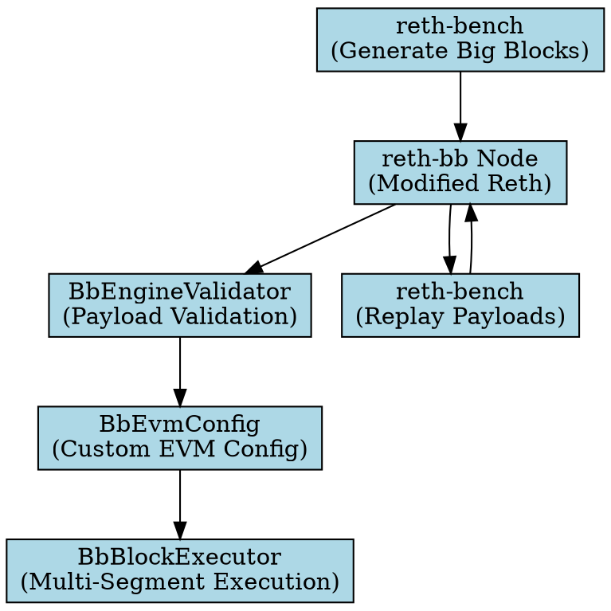
```dot
digraph G {
	rankdir=TD;
	ratio=1.0;
	"reth-bench (Generate Big Blocks)"->"reth-bb Node";
	"reth-bb Node"->"BbEngineValidator";
	"BbEngineValidator"->"BbEvmConfig";
	"BbEvmConfig"->"BbBlockExecutor";
	"reth-bench (Replay Payloads)"->"reth-bb Node";
	"reth-bb Node"->"reth-bench (Replay Payloads)";
	"BbBlockExecutor" [ fillcolor=lightblue, label="BbBlockExecutor\n(Multi-Segment Execution)", shape=box, style=filled ];
	"BbEngineValidator" [ fillcolor=lightblue, label="BbEngineValidator\n(Payload Validation)", shape=box, style=filled ];
	"BbEvmConfig" [ fillcolor=lightblue, label="BbEvmConfig\n(Custom EVM Config)", shape=box, style=filled ];
	"reth-bb Node" [ fillcolor=lightblue, label="reth-bb Node\n(Modified Reth)", shape=box, style=filled ];
	"reth-bench (Generate Big Blocks)" [ fillcolor=lightblue, label="reth-bench\n(Generate Big Blocks)", shape=box, style=filled ];
	"reth-bench (Replay Payloads)" [ fillcolor=lightblue, label="reth-bench\n(Replay Payloads)", shape=box, style=filled ];

}
```


---

#### Reth 通用基准测试工具 (`reth-bench`)

本小节将详述用于 live 同步性能基准测试的 `reth-bench` 工具，涵盖其对 Engine API 交互的模拟 (new-payload-fcu、new-payload-only)、受控等待模式、RPC 配置、profiling 支持、CSV 与 Prometheus 输出分析，以及用于性能比较和可视化的相关 Python 脚本。

Source paths:

- `/paradigmxyz/reth/bin/reth-bench`
- `/paradigmxyz/reth/bin/reth-bench/src`
- `/paradigmxyz/reth/bin/reth-bench/scripts`

[`reth-bench`](%2Fparadigmxyz%2Freth%2FCargo.toml#L323) 工具位于 [`/paradigmxyz/reth/bin/reth-bench`](%2Fparadigmxyz%2Freth%2Fbin%2Freth-bench)，是用于 [`reth`](%2Fparadigmxyz%2Freth%2FCargo.toml#L320) execution client 的 live 同步性能进行基准测试的全面工具。它通过模拟 Consensus Layer (CL) client、回放历史 blocks，并测量延迟、每 block gas used 以及计算每秒 gas used 等关键性能指标来实现这一目标。

该工具提供多个子命令以模拟各种 Engine API 交互，这些交互对 CL/EL 通信至关重要。[`new-payload-fcu`](%2Fparadigmxyz%2Freth%2Fbin%2Freth-bench%2FREADME.md#L32) 子命令在 [`/paradigmxyz/reth/bin/reth-bench/src/bench/new_payload_fcu.rs`](%2Fparadigmxyz%2Freth%2Fbin%2Freth-bench%2Fsrc%2Fbench%2Fnew_payload_fcu.rs) 中实现，通过在 [`engine_newPayload`](%2Fparadigmxyz%2Freth%2Fbin%2Freth-bench%2FREADME.md#L32) 和 [`engine_forkchoiceUpdated`](%2Fparadigmxyz%2Freth%2Fbin%2Freth-bench%2FREADME.md#L32) 调用之间交替进行，模拟典型的 live sync 行为。一个更简单的 [`new-payload-only`](%2Fparadigmxyz%2Freth%2Fbin%2Freth-bench%2FREADME.md#L38) 子命令位于 [`/paradigmxyz/reth/bin/reth-bench/src/bench/new_payload_only.rs`](%2Fparadigmxyz%2Freth%2Fbin%2Freth-bench%2Fsrc%2Fbench%2Fnew_payload_only.rs)，专注于 [`engine_newPayload`](%2Fparadigmxyz%2Freth%2Fbin%2Freth-bench%2FREADME.md#L32) 调用。为了对 payload 提交进行更细粒度的控制，[`send-payload`](%2Fparadigmxyz%2Freth%2Fbin%2Freth-bench%2Fsrc%2Fbench%2Fmod.rs#L49) 子命令允许发送从 JSON block 输入构造的 [`engine_newPayload`](%2Fparadigmxyz%2Freth%2Fbin%2Freth-bench%2FREADME.md#L32) 请求，支持不同的 Engine API 版本 (V3、V4、V5)。为了测试 Engine API 的健壮性，[`send-invalid-payload`](%2Fparadigmxyz%2Freth%2Fbin%2Freth-bench%2Fsrc%2Fbench%2Fmod.rs#L73) 子命令可以生成并发送故意构造错误的 [`engine_newPayload`](%2Fparadigmxyz%2Freth%2Fbin%2Freth-bench%2FREADME.md#L32) 请求。对于高级压力测试，[`generate-big-block`](%2Fparadigmxyz%2Freth%2Fbin%2Freth-bb%2FREADME.md#L35) 在 [`/paradigmxyz/reth/bin/reth-bench/src/bench/generate_big_block.rs`](%2Fparadigmxyz%2Freth%2Fbin%2Freth-bench%2Fsrc%2Fbench%2Fgenerate_big_block.rs) 中实现，通过合并真实 blocks 中的 transactions 来合成大 blocks，以模拟高 gas 工作负载。

[`reth-bench`](%2Fparadigmxyz%2Freth%2FCargo.toml#L323) 提供受控的等待模式以准确模拟现实条件。[`new-payload-fcu`](%2Fparadigmxyz%2Freth%2Fbin%2Freth-bench%2FREADME.md#L32) 命令可以使用固定的 [`--wait-time`](%2Fparadigmxyz%2Freth%2Fbin%2Freth-bench%2FREADME.md#L35)，或使用 [`--wait-for-persistence`](%2Fparadigmxyz%2Freth%2Fbin%2Freth-bench%2FREADME.md#L42) 机制，该机制利用 [`reth_subscribePersistedBlock`](%2Fparadigmxyz%2Freth%2Fbin%2Freth-bench%2FREADME.md#L36) subscription 来确保 blocks 在继续之前已被持久化。RPC 配置灵活，允许用户指定用于获取 block 数据的外部 RPC endpoint ([`--rpc-url`](%2Fparadigmxyz%2Freth%2Fbin%2Freth-bench%2FREADME.md#L64))，以及配置被基准测试节点的 Engine API endpoint ([`--engine-rpc-url`](%2Fparadigmxyz%2Freth%2Fbin%2Freth-bench%2FREADME.md#L44))。

该工具支持对 [`reth`](%2Fparadigmxyz%2Freth%2FCargo.toml#L320) client 的详细 profiling。建议使用特定的 profiles ([`profiling`](%2Fparadigmxyz%2Freth%2FCargo.toml#L293)、[`maxperf`](%2Fparadigmxyz%2Freth%2FMakefile#L242)) 和 features ([`jemalloc-prof`](%2Fparadigmxyz%2Freth%2Fbin%2Freth%2FCargo.toml#L131)、[`snmalloc-native,asm-keccak,min-trace-logs`](%2Fparadigmxyz%2Freth%2Fbin%2Freth-bench%2FREADME.md#L89)) 编译 [`reth`](%2Fparadigmxyz%2Freth%2FCargo.toml#L320)，以便使用外部工具进行 CPU 和内存 profiling。对于输出分析，[`reth-bench`](%2Fparadigmxyz%2Freth%2FCargo.toml#L323) 在控制台显示结果，并可使用 [`--output`](%2Fparadigmxyz%2Freth%2FMakefile#L130) flag 以 CSV 格式保存 gas 使用基准。当 [`reth`](%2Fparadigmxyz%2Freth%2FCargo.toml#L320) 配置 [`--metrics`](%2Fparadigmxyz%2Freth%2Fetc%2Flighthouse.yml#L49) 时，它还与 Prometheus 集成以收集和分析指标。[`MetricsScraper`](%2Fparadigmxyz%2Freth%2Fbin%2Freth-bench%2Fsrc%2Fbench%2Fmetrics_scraper.rs#L30) 位于 [`/paradigmxyz/reth/bin/reth-bench/src/bench/metrics_scraper.rs`](%2Fparadigmxyz%2Freth%2Fbin%2Freth-bench%2Fsrc%2Fbench%2Fmetrics_scraper.rs)，连接到 Prometheus endpoint 在每处理一个 block 后抓取诸如执行时间和 state root 计算等性能指标。

为进一步辅助性能分析，[`/paradigmxyz/reth/bin/reth-bench/scripts`](%2Fparadigmxyz%2Freth%2Fbin%2Freth-bench%2Fscripts) 目录包含 Python 脚本。具体而言，[`/paradigmxyz/reth/bin/reth-bench/scripts/compare_newpayload_latency.py`](%2Fparadigmxyz%2Freth%2Fbin%2Freth-bench%2Fscripts%2Fcompare_newpayload_latency.py) 比较两个由 [`reth-bench`](%2Fparadigmxyz%2Freth%2FCargo.toml#L323) 生成的 [`combined_latency.csv`](%2Fparadigmxyz%2Freth%2Fbin%2Freth-bench%2Fsrc%2Fbench%2Foutput.rs#L15) 文件。该脚本分析 [`total_latency`](%2Fparadigmxyz%2Freth%2Fbin%2Freth-bench%2Fsrc%2Fbench%2Foutput.rs#L90) 和 [`gas_used`](%2Fparadigmxyz%2Freth%2Fcrates%2Fengine%2Fprimitives%2Fsrc%2Fmessage.rs#L219) 指标，通过延迟百分比变化的直方图、随时间变化的延迟线图以及 gas 吞吐量图表来可视化性能变化。这允许在不同 [`reth`](%2Fparadigmxyz%2Freth%2FCargo.toml#L320) 版本或配置之间进行详细的性能比较，帮助识别回归或改进。

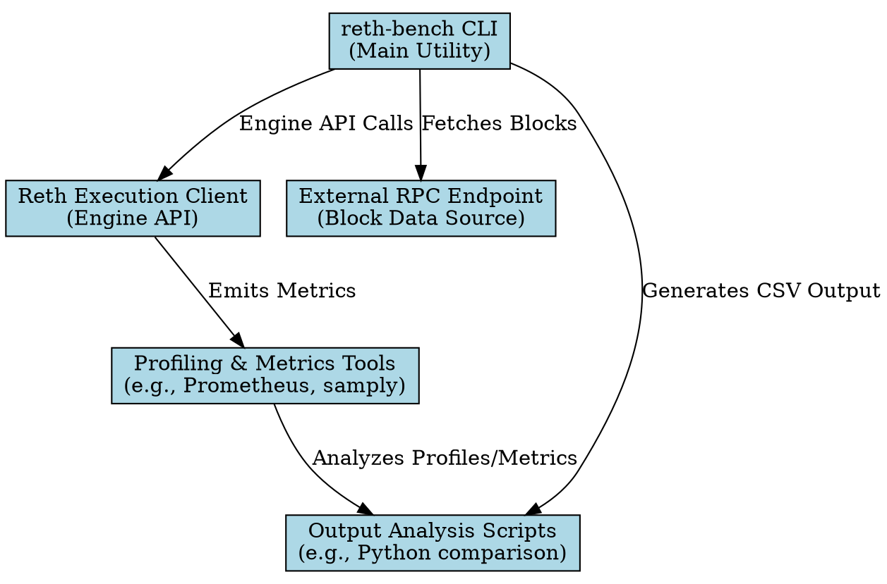
```dot
digraph G {
	rankdir=TD;
	ratio=1.0;
	"reth-bench CLI"->"Reth Execution Client"[ label="Engine API Calls" ];
	"reth-bench CLI"->"External RPC Endpoint"[ label="Fetches Blocks" ];
	"Reth Execution Client"->"Profiling & Metrics Tools"[ label="Emits Metrics" ];
	"reth-bench CLI"->"Output Analysis Scripts"[ label="Generates CSV Output" ];
	"Profiling & Metrics Tools"->"Output Analysis Scripts"[ label="Analyzes Profiles/Metrics" ];
	"External RPC Endpoint" [ fillcolor=lightblue, label="External RPC Endpoint\n(Block Data Source)", shape=box, style=filled ];
	"Output Analysis Scripts" [ fillcolor=lightblue, label="Output Analysis Scripts\n(e.g., Python comparison)", shape=box, style=filled ];
	"Profiling & Metrics Tools" [ fillcolor=lightblue, label="Profiling & Metrics Tools\n(e.g., Prometheus, samply)", shape=box, style=filled ];
	"Reth Execution Client" [ fillcolor=lightblue, label="Reth Execution Client\n(Engine API)", shape=box, style=filled ];
	"reth-bench CLI" [ fillcolor=lightblue, label="reth-bench CLI\n(Main Utility)", shape=box, style=filled ];

}
```


---

### 核心区块链组件

本节深入探讨使 Reth 作为 Ethereum client 运行的基础组件。它将涵盖核心 consensus 验证逻辑、EVM 操作、block 执行与构建，以及 transaction 生命周期管理，包括摄入、验证和池化。它还涉及具有缓存系统的优化 block 处理、execution witness 生成以及本地 block 挖矿。

Source paths:

- `/paradigmxyz/reth/crates/consensus`
- `/paradigmxyz/reth/crates/engine`
- `/paradigmxyz/reth/crates/evm`
- `/paradigmxyz/reth/crates/transaction-pool`

Reth 的核心 blockchain 组件定义了其作为 Ethereum client 的身份，涵盖了 consensus、execution 和数据管理的基础过程。在其核心，Reth 实现了 Ethereum block 的通用验证逻辑，确保遵循协议规则和 hardfork 规范。这包括对 block headers、pre-execution 条件和 post-execution 结果的检查，以及详细的错误报告以诊断在 [`/paradigmxyz/reth/crates/consensus/common`](%2Fparadigmxyz%2Freth%2Fcrates%2Fconsensus%2Fcommon) 和 [`/paradigmxyz/reth/crates/consensus/consensus`](%2Fparadigmxyz%2Freth%2Fcrates%2Fconsensus%2Fconsensus) 中协议偏离。出于测试目的，一个 debug client 模拟 consensus layer，从诸如 Etherscan 或 RPC endpoints 等外部源获取 execution payloads，并向 [`/paradigmxyz/reth/crates/consensus/debug-client`](%2Fparadigmxyz%2Freth%2Fcrates%2Fconsensus%2Fdebug-client) 中的 execution client 分派 [`ForkchoiceUpdated`](%2Fparadigmxyz%2Freth%2Fcrates%2Fengine%2Fprimitives%2Fsrc%2Fevent.rs#L24) 和 new payload 消息。

Ethereum Virtual Machine (EVM) 是 Reth 运行的核心，配备一个用于配置 EVM 操作、执行 transactions 和组装 blocks 的框架。该框架支持并行 transaction 处理，并聚合多个 blocks 的执行结果，包括 state changes、transaction receipts 以及 EIP-7685 requests。EVM 执行的错误处理，特别是针对 state 和 storage trie 操作的错误处理，也集中在 [`/paradigmxyz/reth/crates/evm`](%2Fparadigmxyz%2Freth%2Fcrates%2Fevm) 中以确保健壮性。

Transaction 管理由 transaction pool 处理，它编排 transactions 从摄入和验证到分类到子 pools（pending、parked、blob）以及最终为 block 包含的排序。这包括对 EIP-4844 blob 存储的支持，pool 限制、fee 参数和本地 transaction 处理的配置位于 [`/paradigmxyz/reth/crates/transaction-pool`](%2Fparadigmxyz%2Freth%2Fcrates%2Ftransaction-pool)。

Block 处理通过多级缓存系统进行优化。该系统包括针对 account、storage 和 bytecode 数据的内存缓存，旨在跨连续 blocks 重用缓存的 states，从而提升性能，位于 [`/paradigmxyz/reth/crates/engine/execution-cache`](%2Fparadigmxyz%2Freth%2Fcrates%2Fengine%2Fexecution-cache)。当遇到 invalid blocks 时，Reth 提供机制来重新执行它们、生成 execution witnesses 并分析 state 差异以进行调试，位于 [`/paradigmxyz/reth/crates/engine/invalid-block-hooks`](%2Fparadigmxyz%2Freth%2Fcrates%2Fengine%2Finvalid-block-hooks)。对于开发和测试，本地 engine service 支持具备可配置模式（instant、interval、trigger）的 block 挖矿，并生成 Ethereum payload attributes，适应不同的 hardfork 规范，位于 [`/paradigmxyz/reth/crates/engine/local`](%2Fparadigmxyz%2Freth%2Fcrates%2Fengine%2Flocal)。

与 Ethereum Engine API 的交互通过一组核心 primitives 进行管理，这些 primitives 定义了配置、错误处理、事件管理，以及跟踪用于与 beacon consensus engine 通信的 forkchoice state，位于 [`/paradigmxyz/reth/crates/engine/primitives`](%2Fparadigmxyz%2Freth%2Fcrates%2Fengine%2Fprimitives)。Engine 的 tree 逻辑负责 chain 编排、block 下载、state 持久化，以及使用 sparse tries 和并行执行计算 Ethereum state roots 的复杂过程，位于 [`/paradigmxyz/reth/crates/engine/tree`](%2Fparadigmxyz%2Freth%2Fcrates%2Fengine%2Ftree)。此外，一套工具可用于处理和转换 Beacon Engine API 消息流，这对测试和模拟 blockchain reorganizations 特别有用，位于 [`/paradigmxyz/reth/crates/engine/util`](%2Fparadigmxyz%2Freth%2Fcrates%2Fengine%2Futil)。

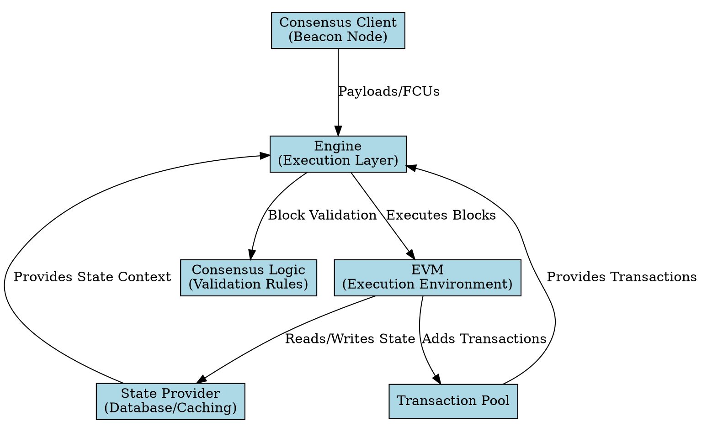
```dot
digraph G {
	rankdir=TD;
	ratio=1.0;
	"Consensus Client"->"Engine"[ label="Payloads/FCUs" ];
	"Engine"->"EVM"[ label="Executes Blocks" ];
	"EVM"->"State Provider"[ label="Reads/Writes State" ];
	"EVM"->"Transaction Pool"[ label="Adds Transactions" ];
	"Engine"->"Consensus Logic"[ label="Block Validation" ];
	"Transaction Pool"->"Engine"[ label="Provides Transactions" ];
	"State Provider"->"Engine"[ label="Provides State Context" ];
	"Consensus Client" [ fillcolor=lightblue, label="Consensus Client\n(Beacon Node)", shape=box, style=filled ];
	"Consensus Logic" [ fillcolor=lightblue, label="Consensus Logic\n(Validation Rules)", shape=box, style=filled ];
	"EVM" [ fillcolor=lightblue, label="EVM\n(Execution Environment)", shape=box, style=filled ];
	"Engine" [ fillcolor=lightblue, label="Engine\n(Execution Layer)", shape=box, style=filled ];
	"State Provider" [ fillcolor=lightblue, label="State Provider\n(Database/Caching)", shape=box, style=filled ];
	"Transaction Pool" [ fillcolor=lightblue, label="Transaction Pool", shape=box, style=filled ];

}
```


---

#### 核心 Consensus 验证逻辑

本小节将深入探讨确保 Ethereum blocks 遵循协议规则和 hardfork 规范的通用验证逻辑和 traits，包括 header、pre-execution 和 post-execution 检查，以及详细的错误报告和测试实现。

Source paths:

- `/paradigmxyz/reth/crates/consensus`
- `/paradigmxyz/reth/crates/consensus/common`
- `/paradigmxyz/reth/crates/consensus/consensus`

Reth 实现了通用的验证逻辑和 traits，以确保 Ethereum blocks 遵循协议规则和 hardfork 规范。这包括 block 处理不同阶段的检查：header 验证、pre-execution body 验证和 post-execution state 验证。

核心 consensus 功能通过位于 [`/paradigmxyz/reth/crates/consensus/consensus`](%2Fparadigmxyz%2Freth%2Fcrates%2Fconsensus%2Fconsensus) 中的一组分层 traits 定义。[`HeaderValidator`](%2Fparadigmxyz%2Freth%2Fcrates%2Fethereum%2Fconsensus%2Fsrc%2Flib.rs#L20) trait 定义了用于验证 block headers 的方法，既包括独立验证也包括相对于其 parent headers 的验证。这确保了 blockchain 的结构完整性和顺序正确性。在此基础上，[`Consensus`](%2Fparadigmxyz%2Freth%2Fdocs%2Frepo%2Flayout.md#L94) trait 添加了对 block body 的 pre-execution 验证方法，验证 body 的汇总字段（例如 transaction root 和 ommer hash）在任何 transactions 实际被处理之前与 block header 一致。[`FullConsensus`](%2Fparadigmxyz%2Freth%2Fcrates%2Fnode%2Fapi%2Fsrc%2Fnode.rs#L6) trait 通过包含 post-execution 验证进一步扩展这些能力，验证 block 执行结果（例如 [`gas_used`](%2Fparadigmxyz%2Freth%2Fcrates%2Fengine%2Fprimitives%2Fsrc%2Fmessage.rs#L219) 和 [`receipt_root`](%2Fparadigmxyz%2Freth%2Fcrates%2Fengine%2Ftree%2Fsrc%2Ftree%2Fpayload_processor%2Freceipt_root_task.rs#L73)）与 block header 中指定的 commitments 一致。

一个全面的 [`ConsensusError`](%2Fparadigmxyz%2Freth%2Fcrates%2Fconsensus%2Fconsensus%2Fsrc%2Flib.rs#L490) enum 提供针对各种验证失败的详细报告。该 enum 支持对问题的细粒度识别，从不正确的 gas limit 到 state roots 的不一致，并帮助区分瞬时错误与永久错误。这种详细的错误报告对调试和节点的健壮运行至关重要。

适用于不同 Ethereum hardfork 的特定验证规则集中在 [`/paradigmxyz/reth/crates/consensus/common`](%2Fparadigmxyz%2Freth%2Fcrates%2Fconsensus%2Fcommon) 中。这些规则包括对 [`gas_used`](%2Fparadigmxyz%2Freth%2Fcrates%2Fengine%2Fprimitives%2Fsrc%2Fmessage.rs#L219) 和 [`gas_limit`](%2Fparadigmxyz%2Freth%2Fcrates%2Fnode%2Fcore%2Fsrc%2Fcli%2Fconfig.rs#L28) 的检查、London hardfork 中 [`base_fee_per_gas`](%2Fparadigmxyz%2Freth%2Fbin%2Freth-bench%2Fsrc%2Fbench%2Fsend_invalid_payload%2Finvalidation.rs#L22) 的存在性、Shanghai 中 withdrawals 的正确性，以及 Cancun 中的 [`blob_gas_used`](%2Fparadigmxyz%2Freth%2Fcrates%2Fconsensus%2Fconsensus%2Fsrc%2Flib.rs#L377)。它还处理对 block body roots 与 header 值的验证，以及与 EIP-4844 blob transactions 相关的各种检查。这些通用验证函数确保了与不断演进的 Ethereum 协议的一致性和合规性。

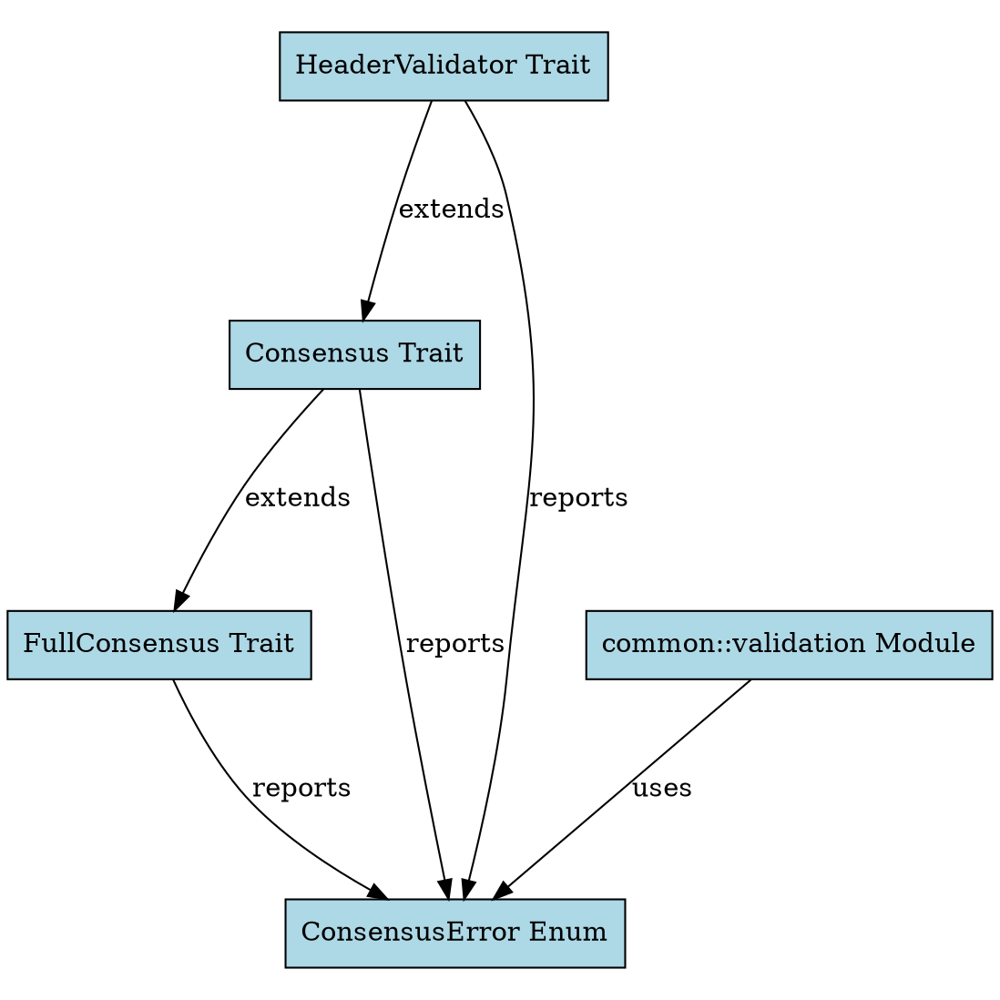
```dot
digraph G {
	overlap=true;
	rankdir=TD;
	ratio=1.0;
	splines=true;
	HeaderValidator->Consensus[ label="extends" ];
	Consensus->FullConsensus[ label="extends" ];
	Consensus->ConsensusError[ label="reports" ];
	FullConsensus->ConsensusError[ label="reports" ];
	HeaderValidator->ConsensusError[ label="reports" ];
	CommonValidation->ConsensusError[ label="uses" ];
	CommonValidation [ fillcolor=lightblue, label="common::validation Module", shape=box, style=filled ];
	Consensus [ fillcolor=lightblue, label="Consensus Trait", shape=box, style=filled ];
	ConsensusError [ fillcolor=lightblue, label="ConsensusError Enum", shape=box, style=filled ];
	FullConsensus [ fillcolor=lightblue, label="FullConsensus Trait", shape=box, style=filled ];
	HeaderValidator [ fillcolor=lightblue, label="HeaderValidator Trait", shape=box, style=filled ];

}
```


---

#### 用于 Execution Layer 测试的 Debug Consensus Client

本小节将描述用于模拟 consensus layer 的 debug client，解释它如何从 Etherscan 或 RPC endpoints 等外部 provider 获取 execution payloads，并向 execution client 发送 `ForkchoiceUpdated` 和 `new_payload` 消息以进行测试。

Source paths:

- `/paradigmxyz/reth/crates/consensus/debug-client`

Debug client 旨在模拟 consensus layer 以测试 execution clients，使开发和验证无需完整 consensus 节点即可进行。这种模拟通过从外部 provider 获取 execution payloads 并使用它们向 execution client 发送 [`ForkchoiceUpdated`](%2Fparadigmxyz%2Freth%2Fcrates%2Fengine%2Fprimitives%2Fsrc%2Fevent.rs#L24) (FCU) 和 [`new_payload`](%2Fparadigmxyz%2Freth%2Fcrates%2Fe2e-test-utils%2Fsrc%2Fnode.rs#L136) 消息来实现。

[`/paradigmxyz/reth/crates/consensus/debug-client/src/client.rs`](%2Fparadigmxyz%2Freth%2Fcrates%2Fconsensus%2Fdebug-client%2Fsrc%2Fclient.rs) 中的 [`DebugConsensusClient`](%2Fparadigmxyz%2Freth%2Fcrates%2Fnode%2Fbuilder%2Fsrc%2Flaunch%2Fdebug.rs#L8) 编排这种模拟。它使用 [`PayloadProvider`](%2Fparadigmxyz%2Freth%2Fcrates%2Fnode%2Fbuilder%2Fsrc%2Flaunch%2Fdebug.rs#L8) trait 来抽象 execution payloads 的来源，允许多种外部服务供应 block 数据。该 trait 的当前实现包括 [`/paradigmxyz/reth/crates/consensus/debug-client/src/providers/etherscan.rs`](%2Fparadigmxyz%2Freth%2Fcrates%2Fconsensus%2Fdebug-client%2Fsrc%2Fproviders%2Fetherscan.rs) 中的 [`EtherscanBlockProvider`](%2Fparadigmxyz%2Freth%2Fcrates%2Fnode%2Fbuilder%2Fsrc%2Flaunch%2Fdebug.rs#L8)，以及 [`/paradigmxyz/reth/crates/consensus/debug-client/src/providers/rpc.rs`](%2Fparadigmxyz%2Freth%2Fcrates%2Fconsensus%2Fdebug-client%2Fsrc%2Fproviders%2Frpc.rs) 中的 [`RpcBlockProvider`](%2Fparadigmxyz%2Freth%2Fcrates%2Fnode%2Fbuilder%2Fsrc%2Flaunch%2Fdebug.rs#L8)。[`EtherscanBlockProvider`](%2Fparadigmxyz%2Freth%2Fcrates%2Fnode%2Fbuilder%2Fsrc%2Flaunch%2Fdebug.rs#L8) 直接从 Etherscan API 获取 block 数据，而 [`RpcBlockProvider`](%2Fparadigmxyz%2Freth%2Fcrates%2Fnode%2Fbuilder%2Fsrc%2Flaunch%2Fdebug.rs#L8) 从标准 RPC endpoint 检索 blocks。两个 provider 都支持单个 block 检索以及对新 blocks 的连续订阅，将原始数据转换为 [`DebugConsensusClient`](%2Fparadigmxyz%2Freth%2Fcrates%2Fnode%2Fbuilder%2Fsrc%2Flaunch%2Fdebug.rs#L8) 可处理的通用 [`ExecutionData`](%2Fparadigmxyz%2Freth%2Fbin%2Freth-bb%2Fsrc%2Fmain.rs#L43) 格式。

接收到 payloads 后，client 向 execution client 发送 [`new_payload`](%2Fparadigmxyz%2Freth%2Fcrates%2Fe2e-test-utils%2Fsrc%2Fnode.rs#L136) 消息。然后它根据近期 block 历史计算 [`safe_block_hash`](%2Fparadigmxyz%2Freth%2Fcrates%2Fstorage%2Fstorage-api%2Fsrc%2Fblock_id.rs#L126) 和 [`finalized_block_hash`](%2Fparadigmxyz%2Freth%2Fcrates%2Fstorage%2Fstorage-api%2Fsrc%2Fblock_id.rs#L131)，这对构造 [`ForkchoiceState`](%2Fparadigmxyz%2Freth%2Fdocs%2Fcrates%2Fnetwork.md#L71) 至关重要。该 state 随后通过 [`fork_choice_updated`](%2Fparadigmxyz%2Freth%2Fcrates%2Fengine%2Fprimitives%2Fsrc%2Fmessage.rs#L368) 消息发送给 execution client，有效地模拟了 consensus layer 在指导 execution client 链推进中的角色。[`/paradigmxyz/reth/crates/consensus/debug-client/src/client.rs`](%2Fparadigmxyz%2Freth%2Fcrates%2Fconsensus%2Fdebug-client%2Fsrc%2Fclient.rs) 中使用环形缓冲区 ([`AllocRingBuffer`](%2Fparadigmxyz%2Freth%2Fcrates%2Fconsensus%2Fdebug-client%2Fsrc%2Fclient.rs#L4)) 高效管理这些近期 block hash，用于确定 [`safe`](%2Fparadigmxyz%2Freth%2Fcrates%2Fengine%2Ftree%2Fsrc%2Ftree%2Fmetrics.rs#L139) 和 [`finalized`](%2Fparadigmxyz%2Freth%2Fcrates%2Fengine%2Ftree%2Fsrc%2Ftree%2Fmetrics.rs#L141) block。

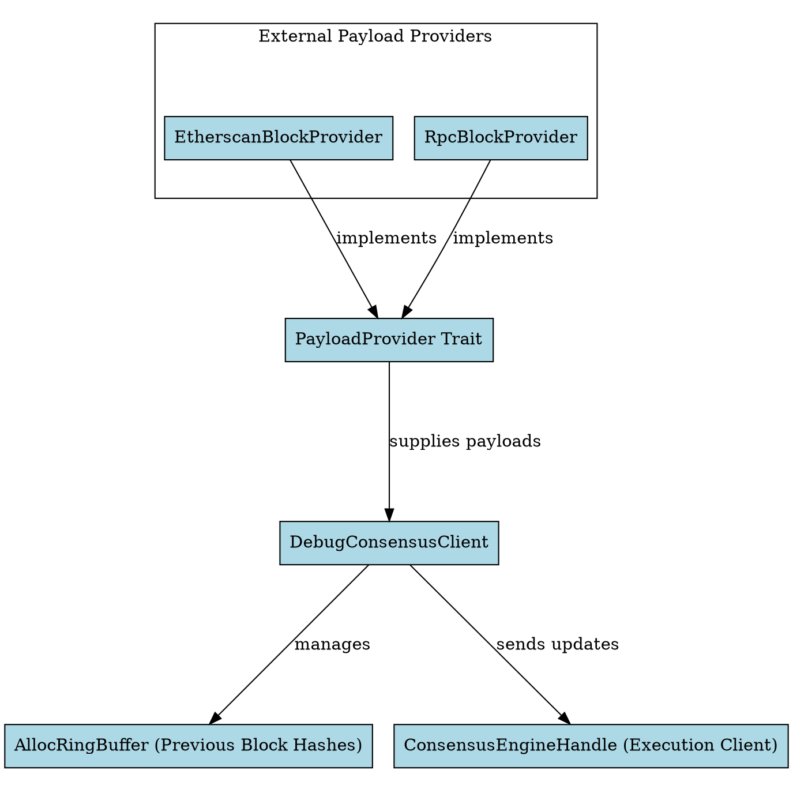
```dot
digraph G {
	rankdir=TD;
	ratio=1.0;
	"EtherscanBlockProvider"->"PayloadProvider Trait"[ label="implements" ];
	"RpcBlockProvider"->"PayloadProvider Trait"[ label="implements" ];
	"PayloadProvider Trait"->"DebugConsensusClient"[ label="supplies payloads" ];
	"DebugConsensusClient"->"AllocRingBuffer"[ label="manages" ];
	"DebugConsensusClient"->"ConsensusEngineHandle"[ label="sends updates" ];
	subgraph cluster_providers {
	label="External Payload Providers";
	"EtherscanBlockProvider" [ fillcolor=lightblue, label="EtherscanBlockProvider", shape=box, style=filled ];
	"RpcBlockProvider" [ fillcolor=lightblue, label="RpcBlockProvider", shape=box, style=filled ];

}
;
	"AllocRingBuffer" [ fillcolor=lightblue, label="AllocRingBuffer (Previous Block Hashes)", shape=box, style=filled ];
	"ConsensusEngineHandle" [ fillcolor=lightblue, label="ConsensusEngineHandle (Execution Client)", shape=box, style=filled ];
	"DebugConsensusClient" [ fillcolor=lightblue, shape=box, style=filled ];
	"PayloadProvider Trait" [ fillcolor=lightblue, shape=box, style=filled ];

}
```


---

#### EVM Configuration and Block Execution

本小节将详细介绍核心 EVM 功能，包括用于设置 EVM 环境、执行 transactions、组装 blocks 以及管理执行结果和 state 变更的 `ConfigureEvm` trait，并支持并行化的 transaction 处理。

Source paths:

- `/paradigmxyz/reth/crates/evm`
- `/paradigmxyz/reth/crates/evm/evm`

Reth 中 Ethereum Virtual Machine (EVM) 的核心功能集中在配置 EVM 环境、执行 transactions、组装 blocks 以及管理执行结果上。这主要由 [`ConfigureEvm`](%2Fparadigmxyz%2Freth%2Fbin%2Freth-bb%2Fsrc%2Fevm.rs#L91) trait 提供支持，该 trait 在 client 内部作为这些操作的统一接口。

[`ConfigureEvm`](%2Fparadigmxyz%2Freth%2Fbin%2Freth-bb%2Fsrc%2Fevm.rs#L91) trait 定义在 [`/paradigmxyz/reth/crates/evm/evm/src/lib.rs`](%2Fparadigmxyz%2Freth%2Fcrates%2Fevm%2Fevm%2Fsrc%2Flib.rs) 中，是设置 EVM 的关键。它提供了创建 EVM 环境的方法 ([`evm_env`](%2Fparadigmxyz%2Freth%2Fcrates%2Fevm%2Fevm%2Fsrc%2Flib.rs#L220)、[`next_evm_env`](%2Fparadigmxyz%2Freth%2Fcrates%2Fevm%2Fevm%2Fsrc%2Flib.rs#L237))、执行上下文 ([`context_for_block`](%2Fparadigmxyz%2Freth%2Fcrates%2Fevm%2Fevm%2Fsrc%2Flib.rs#L244)、[`context_for_next_block`](%2Fparadigmxyz%2Freth%2Fcrates%2Fevm%2Fevm%2Fsrc%2Flib.rs#L251))，并将 transactions 转换为 EVM 兼容格式 ([`tx_env`](%2Fparadigmxyz%2Freth%2Fcrates%2Fevm%2Fevm%2Fsrc%2Flib.rs#L258))。该 trait 还作为工厂，用于创建处理整个 block 的 [`BlockExecutor`](%2Fparadigmxyz%2Freth%2Fbin%2Freth-bb%2Fsrc%2Fevm.rs#L14) 实例，以及用于构造新 block 的 [`BlockBuilder`](%2Fparadigmxyz%2Freth%2Fcrates%2Fevm%2Fevm%2Fsrc%2Fexecute.rs#L329) 实例。例如，[`builder_for_next_block`](%2Fparadigmxyz%2Freth%2Fcrates%2Fevm%2Fevm%2Fsrc%2Flib.rs#L410) 是一个高级辅助函数，它将多个步骤组合起来为新 block 构造准备 [`BlockBuilder`](%2Fparadigmxyz%2Freth%2Fcrates%2Fevm%2Fevm%2Fsrc%2Fexecute.rs#L329)。这种方式确保了能够灵活、可扩展地定义不同的 EVM 配置而无需更改核心执行逻辑。

Block 执行和组装由不同的组件处理。[`/paradigmxyz/reth/crates/evm/evm/src/execute.rs`](%2Fparadigmxyz%2Freth%2Fcrates%2Fevm%2Fevm%2Fsrc%2Fexecute.rs) 中指定的 [`Executor`](%2Fparadigmxyz%2Freth%2Fcrates%2Fevm%2Fevm%2Fsrc%2Fexecute.rs#L34) trait 定义了执行 block 的接口，包括处理单个 transactions 和管理 state 变更。[`BasicBlockExecutor`](%2Fparadigmxyz%2Freth%2Fcrates%2Fevm%2Fevm%2Fsrc%2Flib.rs#L29) 是一个具体实现，它使用 [`ConfigureEvm`](%2Fparadigmxyz%2Freth%2Fbin%2Freth-bb%2Fsrc%2Fevm.rs#L91) 工厂为 blocks 创建 executors。一旦 transactions 执行完毕并记录了 state 变更，[`BlockAssembler`](%2Fparadigmxyz%2Freth%2Fcrates%2Fevm%2Fevm%2Fsrc%2Flib.rs#L208) trait（也在 [`/paradigmxyz/reth/crates/evm/evm/src/execute.rs`](%2Fparadigmxyz%2Freth%2Fcrates%2Fevm%2Fevm%2Fsrc%2Fexecute.rs) 中）便接收该输出并构造完整的 block，处理诸如 gas used、receipts root 和 logs bloom 等字段。[`BlockBuilder`](%2Fparadigmxyz%2Freth%2Fcrates%2Fevm%2Fevm%2Fsrc%2Fexecute.rs#L329) trait 由 [`BasicBlockBuilder`](%2Fparadigmxyz%2Freth%2Fcrates%2Fevm%2Fevm%2Fsrc%2Flib.rs#L20) 实现，提供了一个更高级的抽象，用于编排 transactions 的执行并利用 [`BlockAssembler`](%2Fparadigmxyz%2Freth%2Fcrates%2Fevm%2Fevm%2Fsrc%2Flib.rs#L208) 来最终确定 block。

Reth 还支持并行化的 transaction 处理。定义在 [`/paradigmxyz/reth/crates/evm/evm/src/engine.rs`](%2Fparadigmxyz%2Freth%2Fcrates%2Fevm%2Fevm%2Fsrc%2Fengine.rs) 中的 [`ConfigureEngineEvm`](%2Fparadigmxyz%2Freth%2Fcrates%2Fevm%2Fevm%2Fsrc%2Fengine.rs#L8) trait 扩展了 [`ConfigureEvm`](%2Fparadigmxyz%2Freth%2Fbin%2Freth-bb%2Fsrc%2Fevm.rs#L91) 的功能，以高效处理 transaction payloads。它提供了专为并行处理构造 EVM 环境和上下文的方法，并且关键地返回一个 [`ExecutableTxIterator`](%2Fparadigmxyz%2Freth%2Fcrates%2Fevm%2Fevm%2Fsrc%2Fengine.rs#L122) 以并行处理 transactions。[`ConvertTx`](%2Fparadigmxyz%2Freth%2Fcrates%2Fevm%2Fevm%2Fsrc%2Fengine.rs#L29) trait 抽象了将原始 transactions 转换为可执行形式的过程，支持可并行化的解码或签名恢复。为了应对 transaction 迭代器中潜在的差异，[`EitherIter<L, R>`](%2Fparadigmxyz%2Freth%2Fcrates%2Fevm%2Fevm%2Fsrc%2Fengine.rs#L142) 结构体包装了 [`Either<L, R>`](%2Fparadigmxyz%2Freth%2Fcrates%2Fevm%2Fevm%2Fsrc%2Fengine.rs#L142) 以提供透明的并行和顺序迭代，适配不同类型的 transaction 列表和转换器。

执行后，[`ExecutionOutcome<T>`](%2Fparadigmxyz%2Freth%2Fcrates%2Fevm%2Fexecution-types%2Fsrc%2Fexecution_outcome.rs#L67)（定义在 [`/paradigmxyz/reth/crates/evm/execution-types/src/execution_outcome.rs`](%2Fparadigmxyz%2Freth%2Fcrates%2Fevm%2Fexecution-types%2Fsrc%2Fexecution_outcome.rs) 中）汇总并管理结果，包括 state 变更（来自 [`revm`](%2Fparadigmxyz%2Freth%2FCargo.toml#L437) bundles）、transaction receipts 和 EIP-7685 requests。该结构提供了访问执行后数据的统一方式，例如 [`state`](%2Fparadigmxyz%2Freth%2Fcrates%2Ftasks%2Fsrc%2Fpool.rs#L320) 变更、[`accounts_iter`](%2Fparadigmxyz%2Freth%2Fcrates%2Fevm%2Fexecution-types%2Fsrc%2Fexecution_outcome.rs#L179) 和 [`receipts`](%2Fparadigmxyz%2Freth%2Fbin%2Freth-bb%2Fsrc%2Fevm.rs#L541)。EVM 执行的错误处理集中在 [`/paradigmxyz/reth/crates/evm/execution-errors/src/lib.rs`](%2Fparadigmxyz%2Freth%2Fcrates%2Fevm%2Fexecution-errors%2Fsrc%2Flib.rs) 中，该模块重新导出与 state 和 storage trie 操作相关的特定错误类型，确保整个系统中错误报告的一致性。更多细节请参阅 [EVM Execution Error Handling and Trie Operations](#core-blockchain-components-evm-execution-error-handling-and-trie-operations)。

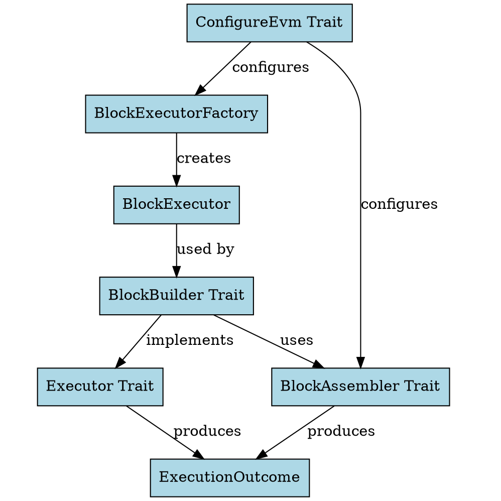
```dot
digraph G {
	rankdir=TD;
	ratio=1.0;
	ConfigureEvm->BlockExecutorFactory[ label="configures" ];
	ConfigureEvm->BlockAssembler[ label="configures" ];
	BlockExecutorFactory->BlockExecutor[ label="creates" ];
	BlockExecutor->BlockBuilder[ label="used by" ];
	BlockBuilder->BlockAssembler[ label="uses" ];
	BlockBuilder->Executor[ label="implements" ];
	Executor->ExecutionOutcome[ label="produces" ];
	BlockAssembler->ExecutionOutcome[ label="produces" ];
	BlockAssembler [ fillcolor=lightblue, label="BlockAssembler Trait", shape=box, style=filled ];
	BlockBuilder [ fillcolor=lightblue, label="BlockBuilder Trait", shape=box, style=filled ];
	BlockExecutor [ fillcolor=lightblue, label="BlockExecutor", shape=box, style=filled ];
	BlockExecutorFactory [ fillcolor=lightblue, label="BlockExecutorFactory", shape=box, style=filled ];
	ConfigureEvm [ fillcolor=lightblue, label="ConfigureEvm Trait", shape=box, style=filled ];
	ExecutionOutcome [ fillcolor=lightblue, label="ExecutionOutcome", shape=box, style=filled ];
	Executor [ fillcolor=lightblue, label="Executor Trait", shape=box, style=filled ];

}
```


---

#### EVM Execution Error Handling and Trie Operations

本小节涵盖 EVM 执行的集中式错误处理，重点关注与 state 和 storage trie 操作相关的问题，包括 state root 计算、state proof 计算以及 sparse trie 不一致性。

Source paths:

- `/paradigmxyz/reth/crates/evm/execution-errors`

Reth 中 EVM 执行的集中式错误处理主要解决与 state 和 storage trie 操作相关的问题，包括 state root 计算、state proof 计算以及 sparse tries 内部的不一致性。该系统聚合并重新导出常见错误类型，确保在各种 block 处理组件之间报告的一致性。

例如，在 state root 计算过程中产生的错误由特定的错误类型捕获，这些错误随后可以转换为更广泛的 provider 级错误以进行更通用的处理。类似地，storage root 计算期间遇到的问题也被单独管理。在计算 state proofs 时，系统会处理诸如数据库不一致、RLP 解码失败和 trie 差异等错误，这些错误可能中止 proof 计算。

对于 sparse trie 实现，专门的错误类型区分了各种问题，例如无效的 root 节点、尝试更新不完整或未初始化的 tries（称为 "blind" tries），以及找不到预期节点的情况。这种细粒度的方法有助于诊断与 Merkle Patricia Tries 的完整性和一致性相关的问题，而 Merkle Patricia Tries 对于 Ethereum 的 state 表示至关重要。错误处理机制还考虑了与 trie witnesses 相关的问题，这可能涉及不存在的 accounts 或在 state proof 生成期间出现的问题。该设计采用一致的结构，通常将 error kinds 装箱以高效管理内存并允许不同错误类型之间的多态性。

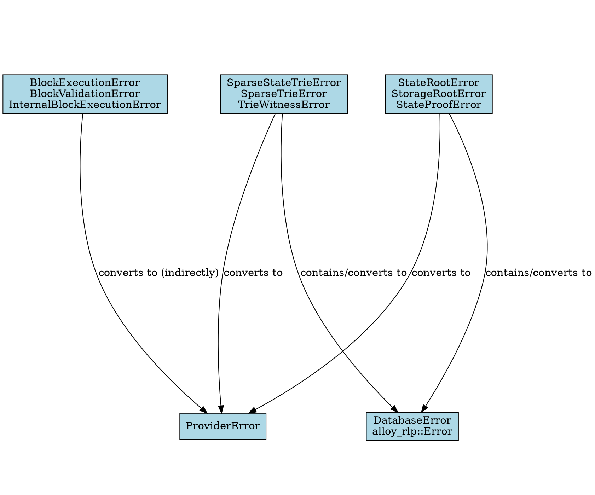
```dot
digraph G {
	rankdir=TD;
	ratio=1.0;
	"Trie-related Errors"->"Database & RLP Errors"[ label="contains/converts to" ];
	"Sparse Trie Errors"->"Database & RLP Errors"[ label="contains/converts to" ];
	"Trie-related Errors"->"ProviderError"[ label="converts to" ];
	"Sparse Trie Errors"->"ProviderError"[ label="converts to" ];
	"EVM Block Errors"->"ProviderError"[ label="converts to (indirectly)" ];
	"Database & RLP Errors" [ fillcolor=lightblue, label="DatabaseError\nalloy_rlp::Error", shape=box, style=filled ];
	"EVM Block Errors" [ fillcolor=lightblue, label="BlockExecutionError\nBlockValidationError\nInternalBlockExecutionError", shape=box, style=filled ];
	"ProviderError" [ fillcolor=lightblue, label="ProviderError", shape=box, style=filled ];
	"Sparse Trie Errors" [ fillcolor=lightblue, label="SparseStateTrieError\nSparseTrieError\nTrieWitnessError", shape=box, style=filled ];
	"Trie-related Errors" [ fillcolor=lightblue, label="StateRootError\nStorageRootError\nStateProofError", shape=box, style=filled ];

}
```


---

#### Aggregated EVM Execution Outcomes

本小节将解释 Reth 如何聚合并管理跨多个 blocks 的 EVM 执行结果，包括 state 变更、transaction receipts 和 EIP-7685 requests，以及它如何提供统一的结构来访问执行后的数据。

Source paths:

- `/paradigmxyz/reth/crates/evm/execution-types`

Reth 管理并聚合跨多个 blocks 的 EVM 执行结果，以提供统一的结构来访问执行后的数据。这包括处理 state 变更、transaction receipts 和 EIP-7685 requests。此聚合的核心组件是定义在 [`/paradigmxyz/reth/crates/evm/execution-types/src/execution_outcome.rs`](%2Fparadigmxyz%2Freth%2Fcrates%2Fevm%2Fexecution-types%2Fsrc%2Fexecution_outcome.rs) 中的 [`ExecutionOutcome`](%2Fparadigmxyz%2Freth%2Fcrates%2Fevm%2Fexecution-types%2Fsrc%2Fexecution_outcome.rs#L406) 结构体。该结构体使用 [`revm`](%2Fparadigmxyz%2Freth%2FCargo.toml#L437) 的 bundle state 封装 state 变更，按 block 分类存储 transaction receipts，并跟踪 EIP-7685 requests。

[`ExecutionOutcome`](%2Fparadigmxyz%2Freth%2Fcrates%2Fevm%2Fexecution-types%2Fsrc%2Fexecution_outcome.rs#L406) 提供了访问和操作此聚合数据的方法。例如，它允许从 [`BundleState`](%2Fparadigmxyz%2Freth%2Fcrates%2Ftrie%2Fdb%2Fsrc%2Fstate.rs#L367) 检索 account 信息、bytecode 和 storage 值。它还便于从内部 bundle state 计算 state roots，这对于验证 blockchain 的完整性至关重要。还提供了多种管理 receipts 的方法，例如遍历所有 receipts 或检索特定 block 的 receipts。

为了支持像 reorganizations 这样的动态 blockchain 操作，[`ExecutionOutcome`](%2Fparadigmxyz%2Freth%2Fcrates%2Fevm%2Fexecution-types%2Fsrc%2Fexecution_outcome.rs#L406) 包含了将 state、receipts 和 requests 回滚到指定历史 block number 的功能。它还支持在给定 block 处拆分聚合结果，从而有效地创建两个独立的结果。相反地，它可以通过合并另一个 [`ExecutionOutcome`](%2Fparadigmxyz%2Freth%2Fcrates%2Fevm%2Fexecution-types%2Fsrc%2Fexecution_outcome.rs#L406) 来扩展自身，前提是传入的 state 建立在当前 state 之上。这种模块化方式允许在同步过程中灵活处理 blockchain 数据。有关这些结果如何在 block 序列中使用的更多细节，请参阅 [Aggregated EVM Execution Outcomes](#core-blockchain-components-aggregated-evm-execution-outcomes)。

[`/paradigmxyz/reth/crates/evm/execution-types/src/chain.rs`](%2Fparadigmxyz%2Freth%2Fcrates%2Fevm%2Fexecution-types%2Fsrc%2Fchain.rs) 中的 [`chain`](%2Fparadigmxyz%2Freth%2Fcrates%2Fchainspec%2Fsrc%2Fapi.rs#L19) 模块通过管理 EVM blocks 序列、它们的执行结果以及相关的 trie 数据进一步扩展了这一概念。[`Chain`](%2Fparadigmxyz%2Freth%2Fexamples%2FREADME.md#L62) 结构体存储 [`RecoveredBlock`](%2Fparadigmxyz%2Freth%2Fcrates%2Frpc%2Frpc%2Fsrc%2Fdebug.rs#L22) 实例，以及用于 state 和变更的 [`ExecutionOutcome`](%2Fparadigmxyz%2Freth%2Fcrates%2Fevm%2Fexecution-types%2Fsrc%2Fexecution_outcome.rs#L406) 和用于 trie 相关信息的 [`LazyTrieData`](%2Fparadigmxyz%2Freth%2Fcrates%2Ftrie%2Fcommon%2Fsrc%2Flazy.rs#L44)。这使得能够管理有序的 block 序列及其产生的 states，提供对 block 数据、执行结果和 transaction 详细信息的全面访问。它还支持追加新的 blocks 或合并整个 chains，确保一致性以及 state 转换的正确处理。

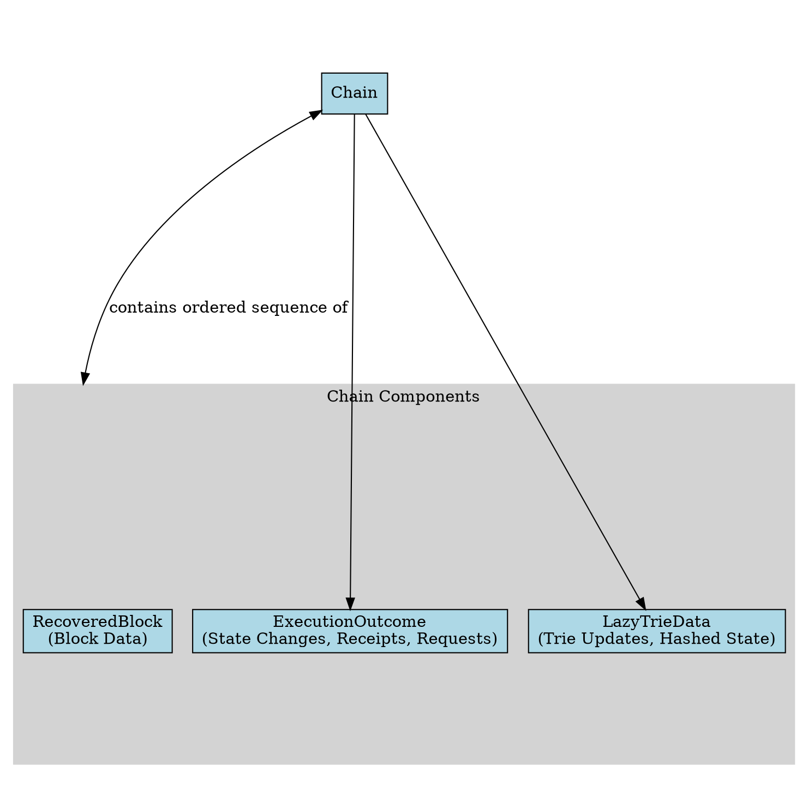
```dot
digraph G {
	compound=true;
	overlap=false;
	rankdir=TD;
	ratio=1.0;
	splines=true;
	Chain->RecoveredBlock[ dir=both, label="contains ordered sequence of", lhead=cluster_chain_components ];
	Chain->ExecutionOutcome;
	Chain->LazyTrieData;
	subgraph cluster_chain_components {
	color=lightgrey;
	compound=true;
	label="Chain Components";
	overlap=false;
	splines=true;
	style=filled;
	ExecutionOutcome [ fillcolor=lightblue, label="ExecutionOutcome\n(State Changes, Receipts, Requests)", shape=box, style=filled ];
	LazyTrieData [ fillcolor=lightblue, label="LazyTrieData\n(Trie Updates, Hashed State)", shape=box, style=filled ];
	RecoveredBlock [ fillcolor=lightblue, label="RecoveredBlock\n(Block Data)", shape=box, style=filled ];

}
;
	Chain [ fillcolor=lightblue, label="Chain", shape=box, style=filled ];

}
```


---

#### Transaction Pool: Ingestion, Validation, and Pooling

本小节将探讨 transaction pool 的生命周期管理，涵盖 transaction 的引入、全面验证、按子池（pending、parked、blob）分类，以及对 transactions 进行排序以纳入 block 的机制，包括 EIP-4844 blob 存储。

Source paths:

- `/paradigmxyz/reth/crates/transaction-pool`
- `/paradigmxyz/reth/crates/transaction-pool/src`

Transaction pool 管理 Reth 内 Ethereum transactions 的生命周期，从最初的引入和全面验证，到分类到专门的子池中，最终为纳入 block 进行排序。该系统确保只有有效且经济上可行的 transactions 才会被考虑用于 block 生产，并支持包括 EIP-4844 blob transactions 在内的各种 transaction 类型。

Transaction 请求被提交到池中，并由 [`/paradigmxyz/reth/crates/transaction-pool/src/batcher.rs`](%2Fparadigmxyz%2Freth%2Fcrates%2Ftransaction-pool%2Fsrc%2Fbatcher.rs) 中的 [`BatchTxProcessor`](%2Fparadigmxyz%2Freth%2Fcrates%2Ftransaction-pool%2Fsrc%2Fbatcher.rs#L53) 进行批处理。这种批处理机制将多个 transaction 插入合并为单一操作，减少了高并发环境下的争用并提高了吞吐量。每个批处理请求都包含一个 channel，用于将处理结果传回调用者。

引入后，transactions 使用 [`TransactionValidator`](%2Fparadigmxyz%2Freth%2Fcrates%2Ftransaction-pool%2Fsrc%2Fvalidate%2Fmod.rs#L170) 经历多方面的验证过程。此验证器由 [`/paradigmxyz/reth/crates/transaction-pool/src/validate/eth.rs`](%2Fparadigmxyz%2Freth%2Fcrates%2Ftransaction-pool%2Fsrc%2Fvalidate%2Feth.rs) 中的 [`EthTransactionValidator`](%2Fparadigmxyz%2Freth%2Fcrates%2Ftransaction-pool%2Fsrc%2Fvalidate%2Feth.rs#L79) 实现，根据当前链状况和 hardfork 规范执行无状态检查（例如签名有效性、格式）和有状态检查（例如 nonce、余额、gas limits）。针对 EIP-4844 和 EIP-7702 transactions 存在专门的验证例程，以确保符合各自的规则。此验证可通过 [`/paradigmxyz/reth/crates/transaction-pool/src/validate/task.rs`](%2Fparadigmxyz%2Freth%2Fcrates%2Ftransaction-pool%2Fsrc%2Fvalidate%2Ftask.rs) 中的 [`TransactionValidationTaskExecutor`](%2Fparadigmxyz%2Freth%2Fcrates%2Fethereum%2Fnode%2Fsrc%2Fnode.rs#L56) 卸载到后台任务以防止阻塞主事件循环。

经过验证的 transactions 然后被分类并放入若干子池之一，每个子池都有特定的 transaction 数量和总大小限制，定义在 [`/paradigmxyz/reth/crates/transaction-pool/src/config.rs`](%2Fparadigmxyz%2Freth%2Fcrates%2Ftransaction-pool%2Fsrc%2Fconfig.rs) 中的 [`PoolConfig`](%2Fparadigmxyz%2Freth%2Fcrates%2Ftransaction-pool%2Fsrc%2Fconfig.rs#L77) 内：
*   **Pending Pool：** 包含已准备好立即纳入 block 的 transactions。
*   **Parked/Queued Pool：** 保存当前不可执行但将来可能可执行的 transactions（例如，由于 base fee 较低、缺少祖先 transaction 或发送方余额不足）。
*   **BaseFee Pool：** parked pool 的子集，专门用于等待更高 base fee 的 transactions。
*   **Blob Pool：** 管理尚未有资格进入 pending pool 的 EIP-4844 blob transactions。

[`/paradigmxyz/reth/crates/transaction-pool/src/lib.rs`](%2Fparadigmxyz%2Freth%2Fcrates%2Ftransaction-pool%2Fsrc%2Flib.rs) 中的 [`Pool`](%2Fparadigmxyz%2Freth%2Fcrates%2Fnode%2Fapi%2Fsrc%2Fnode.rs#L68) 结构体提供了与这些子池交互的主要接口，包括添加、检索和移除 transactions 的方法。它还为各种 transaction 状态（例如 pending、discarded、queued）提供事件监听器，允许其他组件响应池的变化。

Transaction pool 操作的核心是 EIP-4844 和 EIP-7594 blob 数据的管理。[`/paradigmxyz/reth/crates/transaction-pool/src/blobstore/mod.rs`](%2Fparadigmxyz%2Freth%2Fcrates%2Ftransaction-pool%2Fsrc%2Fblobstore%2Fmod.rs) 中定义的 [`BlobStore`](%2Fparadigmxyz%2Freth%2Fcrates%2Ftransaction-pool%2Fsrc%2Fblobstore%2Fmod.rs#L33) trait 抽象了 blob 的存储和检索。实现包括用于持久化存储的 [`/paradigmxyz/reth/crates/transaction-pool/src/blobstore/disk.rs`](%2Fparadigmxyz%2Freth%2Fcrates%2Ftransaction-pool%2Fsrc%2Fblobstore%2Fdisk.rs) 中的 [`DiskFileBlobStore`](%2Fparadigmxyz%2Freth%2Fcrates%2Ftransaction-pool%2Fsrc%2Fblobstore%2Fdisk.rs#L36)，以及用于缓存的 [`/paradigmxyz/reth/crates/transaction-pool/src/blobstore/mem.rs`](%2Fparadigmxyz%2Freth%2Fcrates%2Ftransaction-pool%2Fsrc%2Fblobstore%2Fmem.rs) 中的 [`InMemoryBlobStore`](%2Fparadigmxyz%2Freth%2Fcrates%2Ftransaction-pool%2Fsrc%2Fblobstore%2Fmem.rs#L16)。[`/paradigmxyz/reth/crates/transaction-pool/src/blobstore/tracker.rs`](%2Fparadigmxyz%2Freth%2Fcrates%2Ftransaction-pool%2Fsrc%2Fblobstore%2Ftracker.rs) 中的 [`BlobStoreCanonTracker`](%2Fparadigmxyz%2Freth%2Fcrates%2Ftransaction-pool%2Fsrc%2Fblobstore%2Ftracker.rs#L17) 确保正确跟踪 canonical transactions 的 blobs 并最终清理。不同 blob sidecar 格式之间的转换由 [`/paradigmxyz/reth/crates/transaction-pool/src/blobstore/converter.rs`](%2Fparadigmxyz%2Freth%2Fcrates%2Ftransaction-pool%2Fsrc%2Fblobstore%2Fconverter.rs) 中的 [`BlobSidecarConverter`](%2Fparadigmxyz%2Freth%2Fcrates%2Ftransaction-pool%2Fsrc%2Fblobstore%2Fconverter.rs#L13) 处理。

用于 block 纳入的 transaction 排序由 [`/paradigmxyz/reth/crates/transaction-pool/src/ordering.rs`](%2Fparadigmxyz%2Freth%2Fcrates%2Ftransaction-pool%2Fsrc%2Fordering.rs) 中的 [`TransactionOrdering`](%2Fparadigmxyz%2Freth%2Fcrates%2Ftransaction-pool%2Fsrc%2Fordering.rs#L44) trait 管理。默认的 [`CoinbaseTipOrdering`](%2Fparadigmxyz%2Freth%2Fcrates%2Ftransaction-pool%2Fsrc%2Flib.rs#L292) 策略基于每个 gas 的有效 tip 对 transactions 进行优先级排序。池的状态会响应链事件（例如新 block 或 reorganizations）持续更新，由 [`/paradigmxyz/reth/crates/transaction-pool/src/maintain.rs`](%2Fparadigmxyz%2Freth%2Fcrates%2Ftransaction-pool%2Fsrc%2Fmaintain.rs) 中的维护逻辑处理。

Transaction 生命周期中遇到的错误由 [`/paradigmxyz/reth/crates/transaction-pool/src/error.rs`](%2Fparadigmxyz%2Freth%2Fcrates%2Ftransaction-pool%2Fsrc%2Ferror.rs) 中的 [`PoolError`](%2Fparadigmxyz%2Freth%2Fcrates%2Ftransaction-pool%2Fsrc%2Ferror.rs#L77) 和 [`InvalidPoolTransactionError`](%2Fparadigmxyz%2Freth%2Fcrates%2Ftransaction-pool%2Fsrc%2Ferror.rs#L300) 分类。这些错误类型区分了"坏" transactions（需对 peer 进行惩罚）和其他问题，影响着如何管理 network peers。

Transaction 发送方的唯一标识符 ([`SenderId`](%2Fparadigmxyz%2Freth%2Fcrates%2Ftransaction-pool%2Fsrc%2Fidentifier.rs#L63)) 和单个 transaction 的唯一标识符 ([`TransactionId`](%2Fparadigmxyz%2Freth%2Fcrates%2Ftransaction-pool%2Fsrc%2Fidentifier.rs#L99)) 由 [`/paradigmxyz/reth/crates/transaction-pool/src/identifier.rs`](%2Fparadigmxyz%2Freth%2Fcrates%2Ftransaction-pool%2Fsrc%2Fidentifier.rs) 中的 [`SenderIdentifiers`](%2Fparadigmxyz%2Freth%2Fcrates%2Ftransaction-pool%2Fsrc%2Fidentifier.rs#L19) 管理。该系统允许高效地跟踪 transactions 及其依赖关系，特别是 nonces 相关的内容。

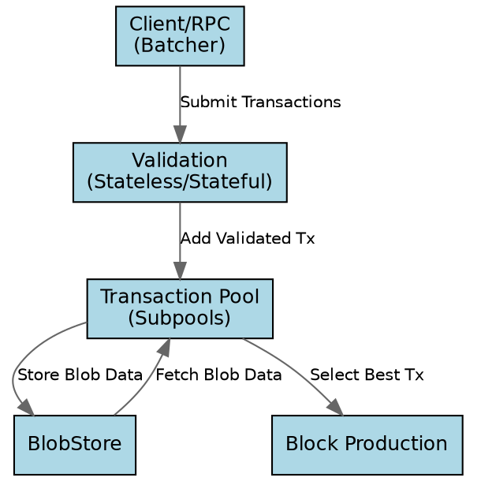
```dot
digraph G {
	rankdir=TD;
	ratio=1.0;
	"Client/RPC"->"Validation"[ color="#666666", fontname="Helvetica", fontsize=10, label="Submit Transactions" ];
	"Validation"->"TransactionPool"[ color="#666666", fontname="Helvetica", fontsize=10, label="Add Validated Tx" ];
	"TransactionPool"->"BlobStore"[ color="#666666", fontname="Helvetica", fontsize=10, label="Store Blob Data" ];
	"BlobStore"->"TransactionPool"[ color="#666666", fontname="Helvetica", fontsize=10, label="Fetch Blob Data" ];
	"TransactionPool"->"Block Production"[ color="#666666", fontname="Helvetica", fontsize=10, label="Select Best Tx" ];
	"BlobStore" [ fillcolor=lightblue, fontname="Helvetica", fontsize=12, label="BlobStore", shape=box, style=filled ];
	"Block Production" [ fillcolor=lightblue, fontname="Helvetica", fontsize=12, label="Block Production", shape=box, style=filled ];
	"Client/RPC" [ fillcolor=lightblue, fontname="Helvetica", fontsize=12, label="Client/RPC\n(Batcher)", shape=box, style=filled ];
	"TransactionPool" [ fillcolor=lightblue, fontname="Helvetica", fontsize=12, label="Transaction Pool\n(Subpools)", shape=box, style=filled ];
	"Validation" [ fillcolor=lightblue, fontname="Helvetica", fontsize=12, label="Validation\n(Stateless/Stateful)", shape=box, style=filled ];

}
```


---

#### Optimized Block Processing with Caching

本小节将描述 Reth 旨在优化 block 处理的多级缓存系统，包括用于 account、storage 和 bytecode 数据的内存缓存，以及缓存 states 如何在连续 blocks 之间重用。

Source paths:

- `/paradigmxyz/reth/crates/engine/execution-cache`

Reth 采用多级缓存系统来优化 block 处理，特别是在连续 block 执行期间。该系统旨在通过将频繁访问的执行相关数据存储在内存中来减少冗余的数据库查找。

其核心是 [`/paradigmxyz/reth/crates/engine/execution-cache/src/cached_state.rs`](%2Fparadigmxyz%2Freth%2Fcrates%2Fengine%2Fexecution-cache%2Fsrc%2Fcached_state.rs) 中的 [`ExecutionCache`](%2Fparadigmxyz%2Freth%2Fcrates%2Fengine%2Fexecution-cache%2Fsrc%2Fcached_state.rs#L690)，它管理 account、storage 和 bytecode 数据的内存缓存。此缓存配置有大小预算，该预算在不同数据类型之间分配。当 block 执行发生时，[`ExecutionCache`](%2Fparadigmxyz%2Freth%2Fcrates%2Fengine%2Fexecution-cache%2Fsrc%2Fcached_state.rs#L690) 首先尝试从这些内存缓存中检索必要的数据。如果未找到某项数据（缓存未命中），则会从底层 state provider 获取该数据，然后插入缓存以供将来使用。缓存还通过更新或清除相关缓存条目来处理 block 执行期间发生的 state 更新，例如 account 变更或 self-destruct 操作，以保持一致性。

为进一步提升连续 block 处理的性能，Reth 利用位于 [`/paradigmxyz/reth/crates/engine/execution-cache/src/lib.rs`](%2Fparadigmxyz%2Freth%2Fcrates%2Fengine%2Fexecution-cache%2Fsrc%2Flib.rs) 中的 [`PayloadExecutionCache`](%2Fparadigmxyz%2Freth%2Fcrates%2Fengine%2Fexecution-cache%2Fsrc%2Flib.rs#L49)。这是一个线程安全的、受保护的缓存，保存与最近处理的 block 相关联的 [`ExecutionCache`](%2Fparadigmxyz%2Freth%2Fcrates%2Fengine%2Fexecution-cache%2Fsrc%2Fcached_state.rs#L690) 实例。其主要作用是允许新 block 重用其父 block 的缓存 state，这在 blocks 通常按顺序处理的同步期间尤其有益。处理新 block 时，[`PayloadExecutionCache`](%2Fparadigmxyz%2Freth%2Fcrates%2Fengine%2Fexecution-cache%2Fsrc%2Flib.rs#L49) 会检查父 block 的缓存 state 是否可用以及是否与预期的父 hash 匹配。如果是，它可以将此预热的缓存提供给执行过程，显著减少初始数据加载时间。在父 hash 不匹配（表示 fork 或乱序处理）的情况下，现有缓存会被清除并为新 block 重置，从而确保数据完整性。该机制对于减少密集型 blockchain 操作期间的延迟和资源消耗至关重要。

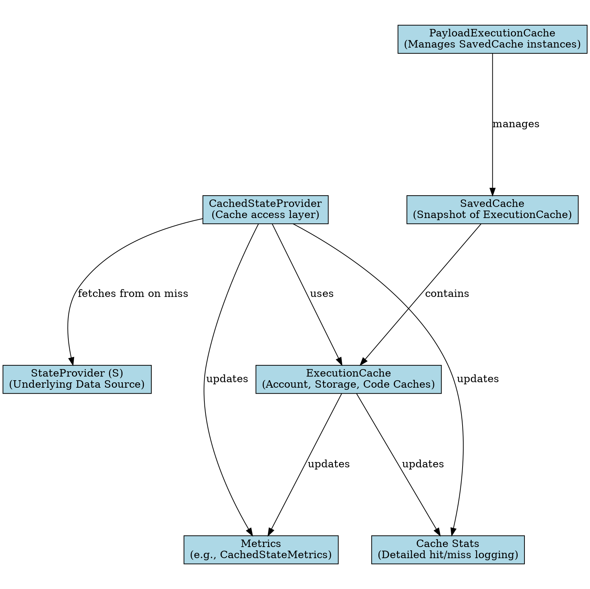
```dot
digraph G {
	rankdir=TD;
	ratio=1.0;
	PayloadExecutionCache->SavedCache[ label="manages" ];
	SavedCache->ExecutionCache[ label="contains" ];
	CachedStateProvider->ExecutionCache[ label="uses" ];
	CachedStateProvider->StateProvider[ label="fetches from on miss" ];
	CachedStateProvider->Metrics[ label="updates" ];
	CachedStateProvider->CacheStats[ label="updates" ];
	ExecutionCache->Metrics[ label="updates" ];
	ExecutionCache->CacheStats[ label="updates" ];
	CacheStats [ fillcolor=lightblue, label="Cache Stats\n(Detailed hit/miss logging)", shape=box, style=filled ];
	CachedStateProvider [ fillcolor=lightblue, label="CachedStateProvider\n(Cache access layer)", shape=box, style=filled ];
	ExecutionCache [ fillcolor=lightblue, label="ExecutionCache\n(Account, Storage, Code Caches)", shape=box, style=filled ];
	Metrics [ fillcolor=lightblue, label="Metrics\n(e.g., CachedStateMetrics)", shape=box, style=filled ];
	PayloadExecutionCache [ fillcolor=lightblue, label="PayloadExecutionCache\n(Manages SavedCache instances)", shape=box, style=filled ];
	SavedCache [ fillcolor=lightblue, label="SavedCache\n(Snapshot of ExecutionCache)", shape=box, style=filled ];
	StateProvider [ fillcolor=lightblue, label="StateProvider (S)\n(Underlying Data Source)", shape=box, style=filled ];

}
```


---

#### Invalid Block Handling and Execution Witness Generation

本小节将详细介绍 Reth 如何处理无效的 Ethereum blocks，重点是重新执行它们以生成和分析 execution witnesses 和 state diffs 以用于调试目的。

Source paths:

- `/paradigmxyz/reth/crates/engine/invalid-block-hooks`

Reth 包含一个用于处理和分析无效 Ethereum blocks 的专用机制，主要位于 [`/paradigmxyz/reth/crates/engine/invalid-block-hooks`](%2Fparadigmxyz%2Freth%2Fcrates%2Fengine%2Finvalid-block-hooks) 目录中。当遇到无效 block 时，系统会重新执行该 block 以生成 *execution witness* 和详细的 *state differences*，这对于调试和理解无效性的根本原因至关重要。此过程由 [`InvalidBlockWitnessHook`](%2Fparadigmxyz%2Freth%2Fcrates%2Fengine%2Finvalid-block-hooks%2Fsrc%2Fwitness.rs#L193)（定义于 [`/paradigmxyz/reth/crates/engine/invalid-block-hooks/src/witness.rs`](%2Fparadigmxyz%2Freth%2Fcrates%2Fengine%2Finvalid-block-hooks%2Fsrc%2Fwitness.rs)）管理，它充当触发重新执行和分析的回调。

重新执行涉及获取无效 block 并通过 Ethereum Virtual Machine (EVM) 针对父 block 的 state 运行该 block。在此重新执行过程中，Reth 会收集所有 state 变更，包括 contract codes、account/storage preimages 和最终的 hashed post-state。这些收集的数据形成 [`ExecutionWitness`](%2Fparadigmxyz%2Freth%2Fcrates%2Frevm%2Fsrc%2Fwitness.rs#L26)，提供 block 执行路径及其对 state 影响的全面记录。

为确保一致性并协助调试，系统执行多项比较：
*   将重新执行期间生成的 [`BundleState`](%2Fparadigmxyz%2Freth%2Fcrates%2Ftrie%2Fdb%2Fsrc%2Fstate.rs#L367)（代表所有 state 变更）与原始 [`BundleState`](%2Fparadigmxyz%2Freth%2Fcrates%2Ftrie%2Fdb%2Fsrc%2Fstate.rs#L367) 进行比较以识别差异。
*   将重新执行的 block 计算出的 state root 和 trie 更新与 block 声明的 state root 进行验证。
*   或者，如果可以连接到健康的 Ethereum 节点，则可以将生成的 execution witness 与从健康节点获取的 witness 进行比较，突出显示可能表示协议偏差或细微 bug 的差异。

所有分析结果，包括生成的 witnesses 和任何识别出的 state differences，都会保存到文件中。这种基于文件的输出支持离线调试和与外部分析工具的集成，使开发人员能够仔细检查 block 被判定为无效的原因。有关调试功能的更多详情，请参阅 [Debugging Features and Invalid Block Handling](#node-configuration-and-extensibility-debugging-features-and-invalid-block-handling)。

```dot
digraph G {
	rankdir=TD;
	ratio=1.0;
	"Invalid Block Encountered"->"Block Re-execution";
	"Block Re-execution"->"Execution Witness & State Collection";
	"Execution Witness & State Collection"->"Comparison & Validation";
	"Comparison & Validation"->"Healthy Node Client"[ label="Witness Comparison" ];
	"Comparison & Validation"->"Output Analysis Results"[ label="BundleState, State Root, Trie Updates Validation" ];
	"Healthy Node Client"->"Output Analysis Results";
	"Output Analysis Results"->"Output Directory";
	"Block Re-execution" [ fillcolor=lightblue, label="Block Re-execution\n(re_execute_block)", shape=box, style=filled ];
	"Comparison & Validation" [ fillcolor=lightblue, label="Comparison &\nValidation", shape=box, style=filled ];
	"Execution Witness & State Collection" [ fillcolor=lightblue, label="Execution Witness &\nState Collection\n(collect_execution_data, generate)", shape=box, style=filled ];
	"Healthy Node Client" [ fillcolor=lightblue, label="Healthy Node\nClient (Optional)", shape=box, style=filled ];
	"Invalid Block Encountered" [ fillcolor=lightblue, label="Invalid Block\nEncountered", shape=box, style=filled ];
	"Output Analysis Results" [ fillcolor=lightblue, label="Output Analysis Results\n(save_file, save_diff)", shape=box, style=filled ];
	"Output Directory" [ fillcolor=lightblue, label="Output Directory", shape=box, style=filled ];

}
```


---

#### Local Block Mining and Payload Attributes

本小节将解释用于开发 blockchains 的本地 engine service，特别是它如何支持具有可配置模式（instant、interval、trigger）的本地 block mining 以及生成 Ethereum payload attributes，并考虑 hardfork 规范。

Source paths:

- `/paradigmxyz/reth/crates/engine/local`

Reth 为开发 blockchains 提供了一个本地 engine service，使其能够模拟 Ethereum 的 consensus layer 交互。该服务支持具有可配置模式的本地 block mining，并生成考虑 hardfork 规范的 Ethereum payload attributes。

核心组件 [`LocalMiner`](%2Fparadigmxyz%2Freth%2Fcrates%2Fengine%2Flocal%2Fsrc%2Fminer.rs#L151) 位于 [`/paradigmxyz/reth/crates/engine/local/src/miner.rs`](%2Fparadigmxyz%2Freth%2Fcrates%2Fengine%2Flocal%2Fsrc%2Fminer.rs)，负责通过构建并提交新的 blocks 来推进 blockchain。它基于多种 [`MiningMode`](%2Fparadigmxyz%2Freth%2Fcrates%2Fengine%2Flocal%2Fsrc%2Fminer.rs#L26) 策略运行：
*   **Instant Mining：** 在收到新 transactions 时或达到指定数量的 transactions 后立即挖出 blocks。
*   **Interval Mining：** 以固定的时间间隔挖出 blocks。
*   **Triggered Mining：** 由来自异步流的外部信号启动 block 生产，为自定义场景提供灵活的控制。

[`LocalMiner`](%2Fparadigmxyz%2Freth%2Fcrates%2Fengine%2Flocal%2Fsrc%2Fminer.rs#L151) 使用定义在 [`/paradigmxyz/reth/crates/engine/local/src/payload.rs`](%2Fparadigmxyz%2Freth%2Fcrates%2Fengine%2Flocal%2Fsrc%2Fpayload.rs) 中的 [`LocalPayloadAttributesBuilder`](%2Fparadigmxyz%2Freth%2Fcrates%2Fengine%2Flocal%2Fsrc%2Fpayload.rs#L23) 来构造 [`EthPayloadAttributes`](%2Fparadigmxyz%2Freth%2Fcrates%2Fethereum%2Fnode%2Fsrc%2Fnode.rs#L12)。该 builder 填充诸如 timestamp、[`prev_randao`](%2Fparadigmxyz%2Freth%2Fcrates%2Fevm%2Fevm%2Fsrc%2Flib.rs#L502) 和建议的 fee recipient 等字段。关键的是，它根据生成时间戳处的活跃 hardforks（例如 Shanghai、Cancun、Amsterdam，由 [`ChainSpec`](%2Fparadigmxyz%2Freth%2Fbin%2Freth-bb%2Fsrc%2Fmain.rs#L156) 确定）有条件地包含 hardfork 特定字段，如 [`withdrawals`](%2Fparadigmxyz%2Freth%2Fcrates%2Fpayload%2Fbasic%2Fsrc%2Fstack.rs#L76)、[`parent_beacon_block_root`](%2Fparadigmxyz%2Freth%2Fcrates%2Fpayload%2Fbasic%2Fsrc%2Fstack.rs#L69) 和 [`slot_number`](%2Fparadigmxyz%2Freth%2Fcrates%2Fpayload%2Fbasic%2Fsrc%2Fstack.rs#L83)。这确保本地挖出的 blocks 准确反映指定 Ethereum network 的协议规则。

[`LocalMiner`](%2Fparadigmxyz%2Freth%2Fcrates%2Fengine%2Flocal%2Fsrc%2Fminer.rs#L151) 通过 [`ConsensusEngineHandle`](%2Fparadigmxyz%2Freth%2Fcrates%2Fnode%2Fapi%2Fsrc%2Fnode.rs#L8) 与 consensus engine 交互以发送 [`fork_choice_updated`](%2Fparadigmxyz%2Freth%2Fcrates%2Fengine%2Fprimitives%2Fsrc%2Fmessage.rs#L368) 和 [`new_payload`](%2Fparadigmxyz%2Freth%2Fcrates%2Fe2e-test-utils%2Fsrc%2Fnode.rs#L136) 消息，并使用 [`PayloadBuilderHandle`](%2Fparadigmxyz%2Freth%2Fcrates%2Fnode%2Fapi%2Fsrc%2Fnode.rs#L13) 来解析 payload 详情。这种解耦设计允许 miner 与不同的 consensus engine 实现配合工作，只要它们遵守定义的 RPC 接口。此功能特别适用于快速本地开发和测试，使开发人员能够模拟 blockchain 进程并在不连接到实时 network 的情况下观察其在各种条件下的行为。有关 node 调试的更多详情，请参阅 [Debugging Features and Invalid Block Handling](#node-configuration-and-extensibility-debugging-features-and-invalid-block-handling)。

```dot
digraph G {
	rankdir=TD;
	ratio=1.0;
	MiningMode->LocalMiner[ label="triggers block production" ];
	LocalMiner->PayloadAttributesBuilder[ label="requests attributes" ];
	PayloadAttributesBuilder->EthChainSpec[ label="uses hardfork info" ];
	LocalMiner->ConsensusEngineHandle[ label="sends FCU and NewPayload" ];
	LocalMiner->PayloadBuilderHandle[ label="resolves payload" ];
	ConsensusEngineHandle->LocalMiner[ label="returns status" ];
	PayloadBuilderHandle->LocalMiner[ label="returns BuiltPayload" ];
	ConsensusEngineHandle [ fillcolor=lightblue, label="ConsensusEngineHandle", shape=box, style=filled ];
	EthChainSpec [ fillcolor=lightblue, label="EthChainSpec\n(Hardforks)", shape=box, style=filled ];
	LocalMiner [ fillcolor=lightblue, label="LocalMiner", shape=box, style=filled ];
	MiningMode [ fillcolor=lightblue, label="MiningMode\n(Instant, Interval, Trigger)", shape=box, style=filled ];
	PayloadAttributesBuilder [ fillcolor=lightblue, label="LocalPayloadAttributesBuilder\n(EthPayloadAttributes)", shape=box, style=filled ];
	PayloadBuilderHandle [ fillcolor=lightblue, label="PayloadBuilderHandle", shape=box, style=filled ];

}
```


---

#### Engine API Primitives and Forkchoice State Management

本小节将涵盖 Reth engine 与 Ethereum Engine API 交互的基础构建模块，包括配置、错误处理、事件管理，以及用于 beacon consensus engine 通信的 forkchoice state 跟踪。

Source paths:

- `/paradigmxyz/reth/crates/engine/primitives`

Reth engine 与 Ethereum Engine API 的交互依赖于通信和 state 管理的基础构建模块。这涉及结构化的配置、稳健的错误处理、详细的事件报告，以及对 forkchoice state 的精确跟踪。

Engine 的 tree 组件的配置通过 [`/paradigmxyz/reth/crates/engine/primitives/src/config.rs`](%2Fparadigmxyz%2Freth%2Fcrates%2Fengine%2Fprimitives%2Fsrc%2Fconfig.rs) 中的 [`TreeConfig`](%2Fparadigmxyz%2Freth%2Fcrates%2Fnode%2Fbuilder%2Fsrc%2Frpc.rs#L27) 结构体进行管理。该结构集中了管理持久化、缓存、并行执行和 state root 计算的参数。它包含影响 block 数据何时持久化到磁盘、内部缓存如何运行以及 state roots 如何计算的设置，并提供并行任务或回退机制的选项。该配置还包括 Engine API 交互特定的参数，例如控制如何处理从 consensus layer 接收的 blocks。

与 beacon consensus engine 交互产生的错误条件定义在 [`/paradigmxyz/reth/crates/engine/primitives/src/error.rs`](%2Fparadigmxyz%2Freth%2Fcrates%2Fengine%2Fprimitives%2Fsrc%2Ferror.rs) 中。这些包括用于 new payload 处理期间问题的 [`BeaconOnNewPayloadError`](%2Fparadigmxyz%2Freth%2Fcrates%2Fengine%2Fprimitives%2Fsrc%2Ferror.rs#L18) 和用于应用 forkchoice 更新时遇到的问题的 [`BeaconForkChoiceUpdateError`](%2Fparadigmxyz%2Freth%2Fcrates%2Fengine%2Fprimitives%2Fsrc%2Ferror.rs#L42)。这些错误类型旨在作为 JSON RPC 错误返回给 beacon node，为 engine 不可用或内部处理失败提供清晰的指示。

Consensus engine 通过 [`/paradigmxyz/reth/crates/engine/primitives/src/event.rs`](%2Fparadigmxyz%2Freth%2Fcrates%2Fengine%2Fprimitives%2Fsrc%2Fevent.rs) 中的 [`ConsensusEngineEvent`](%2Fparadigmxyz%2Freth%2Fcrates%2Fnode%2Fapi%2Fsrc%2Fnode.rs#L8) 枚举所定义的事件系统传达其运行状态和进度。这些事件涵盖关键事件，例如 [`ForkchoiceUpdated`](%2Fparadigmxyz%2Freth%2Fcrates%2Fengine%2Fprimitives%2Fsrc%2Fevent.rs#L24)、[`BlockReceived`](%2Fparadigmxyz%2Freth%2Fcrates%2Fengine%2Fprimitives%2Fsrc%2Fevent.rs#L28)、[`CanonicalBlockAdded`](%2Fparadigmxyz%2Freth%2Fcrates%2Fengine%2Fprimitives%2Fsrc%2Fevent.rs#L30) 和 [`InvalidBlock`](%2Fparadigmxyz%2Freth%2Fcrates%2Fengine%2Fprimitives%2Fsrc%2Fevent.rs#L34)，提供有关 engine 活动的详细信息。该事件系统对于监控 engine 的健康状况和 state 变化至关重要，允许其他组件响应 blockchain 同步过程中的重要进展。

Engine API 的核心是 Ethereum forkchoice state 的管理，由 [`/paradigmxyz/reth/crates/engine/primitives/src/forkchoice.rs`](%2Fparadigmxyz%2Freth%2Fcrates%2Fengine%2Fprimitives%2Fsrc%2Fforkchoice.rs) 中的 [`ForkchoiceStateTracker`](%2Fparadigmxyz%2Freth%2Fcrates%2Fengine%2Fprimitives%2Fsrc%2Fforkchoice.rs#L17) 处理。该 tracker 为最新接收的、最后有效的和同步中的 [`ForkchoiceState`](%2Fparadigmxyz%2Freth%2Fdocs%2Fcrates%2Fnetwork.md#L71) 对象维护不同的状态。该设计对于准确处理来自 consensus layer 的异步更新非常重要，尤其是在真正有效的 state 被确认之前处理无效或同步中的 states 时。诸如 [`set_latest`](%2Fparadigmxyz%2Freth%2Fcrates%2Fengine%2Fprimitives%2Fsrc%2Fforkchoice.rs#L22) 和 [`promote_sync_target_to_valid`](%2Fparadigmxyz%2Freth%2Fcrates%2Fengine%2Fprimitives%2Fsrc%2Fforkchoice.rs#L42) 的方法允许这些状态之间的动态更新和转换，反映 blockchain 的 head、safe 和 finalized blocks 不断变化的状态。

与 Beacon Consensus Engine 的通信由定义在 [`/paradigmxyz/reth/crates/engine/primitives/src/message.rs`](%2Fparadigmxyz%2Freth%2Fcrates%2Fengine%2Fprimitives%2Fsrc%2Fmessage.rs) 中的 [`ConsensusEngineHandle`](%2Fparadigmxyz%2Freth%2Fcrates%2Fnode%2Fapi%2Fsrc%2Fnode.rs#L8) 和 [`OnForkChoiceUpdated`](%2Fparadigmxyz%2Freth%2Fcrates%2Fengine%2Fprimitives%2Fsrc%2Fmessage.rs#L44) 类型来促进。[`ConsensusEngineHandle`](%2Fparadigmxyz%2Freth%2Fcrates%2Fnode%2Fapi%2Fsrc%2Fnode.rs#L8) 提供发送诸如 [`NewPayload`](%2Fparadigmxyz%2Freth%2Fcrates%2Fengine%2Futil%2Fsrc%2Fengine_store.rs#L30) 和 [`ForkchoiceUpdated`](%2Fparadigmxyz%2Freth%2Fcrates%2Fengine%2Fprimitives%2Fsrc%2Fevent.rs#L24) 消息到 consensus engine 的主要接口。[`OnForkChoiceUpdated`](%2Fparadigmxyz%2Freth%2Fcrates%2Fengine%2Fprimitives%2Fsrc%2Fmessage.rs#L44) future 表示 forkchoice 更新的异步结果，提供立即状态并最终解析为更完整的结果，可能包含 [`PayloadId`](%2Fparadigmxyz%2Freth%2Fcrates%2Fpayload%2Fbasic%2Fsrc%2Flib.rs#L19)。这种异步设计允许 engine 处理请求而不阻塞调用者，从而实现高效的后台操作。对于特殊场景，定义了 [`BigBlockData`](%2Fparadigmxyz%2Freth%2Fbin%2Freth-bb%2FREADME.md#L11) 来表示组合多个"真实" blocks 的 execution payloads，管理复杂多段执行的环境切换和 block hash 解析。

```dot
digraph G {
	rankdir=TD;
	ratio=1.0;
	"ConsensusEngineHandle"->"BeaconEngineMessages"[ label="Sends" ];
	"BeaconEngineMessages"->"EngineBehavior"[ label="Triggers" ];
	"TreeConfig"->"EngineBehavior"[ label="Configures" ];
	"EngineBehavior"->"ForkchoiceStateManagement"[ label="Updates" ];
	"EngineBehavior"->"EngineEvents"[ label="Emits" ];
	"EngineBehavior"->"ErrorHandling"[ label="Reports" ];
	"ForkchoiceStateManagement"->"EngineBehavior"[ label="Informs" ];
	"BeaconEngineMessages" [ fillcolor=lightblue, label="BeaconEngineMessage Types\n(NewPayload, ForkchoiceUpdated)", shape=box, style=filled ];
	"ConsensusEngineHandle" [ fillcolor=lightblue, label="ConsensusEngineHandle\n(Message Passing)", shape=box, style=filled ];
	"EngineBehavior" [ fillcolor=lightblue, label="Engine Behavior\n(Persistence, Caching, Execution)", shape=box, style=filled ];
	"EngineEvents" [ fillcolor=lightblue, label="ConsensusEngineEvent\n(Event Emission)", shape=box, style=filled ];
	"ErrorHandling" [ fillcolor=lightblue, label="BeaconOnNewPayloadError,\nBeaconForkChoiceUpdateError\n(Error Reporting)", shape=box, style=filled ];
	"ForkchoiceStateManagement" [ fillcolor=lightblue, label="ForkchoiceStateTracker\n(State Tracking)", shape=box, style=filled ];
	"TreeConfig" [ fillcolor=lightblue, label="TreeConfig\n(Engine Configuration)", shape=box, style=filled ];

}
```


---

#### Engine Tree Logic: Chain Orchestration and State Root Calculation

本小节将深入研究 Reth engine 与 consensus layer 交互的核心逻辑，重点关注 chain orchestration、block 下载、state 持久化，以及使用 sparse tries 和并行执行计算 Ethereum state roots 的复杂过程。

Source paths:

- `/paradigmxyz/reth/crates/engine/tree`

Reth engine 与 consensus layer 的交互由一个集中的 [`ChainOrchestrator`](%2Fparadigmxyz%2Freth%2Fcrates%2Fengine%2Ftree%2Fsrc%2Fchain.rs#L44) 管理，该 orchestrator 协调链推进和 backfill synchronization。该 orchestrator 定义在 [`/paradigmxyz/reth/crates/engine/tree/src/chain.rs`](%2Fparadigmxyz%2Freth%2Fcrates%2Fengine%2Ftree%2Fsrc%2Fchain.rs) 中，使用状态驱动的方式管理 [`ChainHandler`](%2Fparadigmxyz%2Freth%2Fcrates%2Fengine%2Ftree%2Fsrc%2Fchain.rs#L199)（用于核心链逻辑）和 [`BackfillSync`](%2Fparadigmxyz%2Freth%2Fcrates%2Fengine%2Ftree%2Fsrc%2Fbackfill.rs#L50) 组件之间的事件和操作，确保一致的数据处理和独占的数据库访问。

该组件的核心职责是管理 block 数据，包括获取和持久化。[`/paradigmxyz/reth/crates/engine/tree/src/download.rs`](%2Fparadigmxyz%2Freth%2Fcrates%2Fengine%2Ftree%2Fsrc%2Fdownload.rs) 中实现的 [`BlockDownloader`](%2Fparadigmxyz%2Freth%2Fcrates%2Fengine%2Ftree%2Fsrc%2Fdownload.rs#L23) 处理对单个 blocks、blocks 集合或范围的请求，对它们进行缓冲并按升序返回。该组件利用 [`FullBlockClient`](%2Fparadigmxyz%2Freth%2Fcrates%2Fnet%2Fp2p%2Fsrc%2Ffull_block.rs#L101) 从 network 获取 blocks，跟踪正在进行的请求并管理与活动下载相关的 metrics。一旦 blocks 被处理，[`PersistenceService`](%2Fparadigmxyz%2Freth%2Fcrates%2Fengine%2Ftree%2Fsrc%2Fpersistence.rs#L65)（如 [`/paradigmxyz/reth/crates/engine/tree/src/persistence.rs`](%2Fparadigmxyz%2Freth%2Fcrates%2Fengine%2Ftree%2Fsrc%2Fpersistence.rs) 所述在专用线程中运行）将数据保存到数据库和静态文件中，包括 pruning 操作，从而将 I/O 从关键路径上卸载。

链推进通过两种不同的同步类型处理：backfill 和 live sync。Backfill sync 由 [`/paradigmxyz/reth/crates/engine/tree/src/backfill.rs`](%2Fparadigmxyz%2Freth%2Fcrates%2Fengine%2Ftree%2Fsrc%2Fbackfill.rs) 中的 [`PipelineSync`](%2Fparadigmxyz%2Freth%2Fcrates%2Fengine%2Ftree%2Fsrc%2Flib.rs#L45) 管理，通过执行 [`Pipeline`](%2Fparadigmxyz%2Freth%2Fcrates%2Fnode%2Fevents%2Fsrc%2Fnode.rs#L429) 任务进行数据下载和执行直到指定的 block target，以处理链中的大缺口。相反，live sync 通过响应来自 consensus layer 的新 blocks 并动态下载任何缺失的 blocks 来处理较小的缺口。[`/paradigmxyz/reth/crates/engine/tree/src/tree/mod.rs`](%2Fparadigmxyz%2Freth%2Fcrates%2Fengine%2Ftree%2Fsrc%2Ftree%2Fmod.rs) 中定义的 [`EngineApiTreeHandler`](%2Fparadigmxyz%2Freth%2Fcrates%2Fengine%2Ftree%2Fsrc%2Ftree%2Fmod.rs#L264) 是 engine 操作的核心，管理 blockchain 的内存状态，处理 [`newPayload`](%2Fparadigmxyz%2Freth%2FAGENTS.md#L21) 和 [`forkchoiceUpdated`](%2Fparadigmxyz%2Freth%2FAGENTS.md#L21) 消息，执行 blocks 并协调 backfill。

Engine tree 的一个关键功能是 Ethereum state roots 的计算，这是一个由 [`engine_newPayload`](%2Fparadigmxyz%2Freth%2Fbin%2Freth-bench%2FREADME.md#L32) 请求启动的复杂过程，详见 [`/paradigmxyz/reth/crates/engine/tree/docs/root.md`](%2Fparadigmxyz%2Freth%2Fcrates%2Fengine%2Ftree%2Fdocs%2Froot.md)。该过程涉及：
*   **Prewarming（预热）：** Transactions 并行执行以预取已修改 accounts 和 storage slots 的 proofs。
*   **Sequential Execution（顺序执行）：** 然后 transactions 顺序执行，state 更新被发送到 [`State Root Task`](%2Fparadigmxyz%2Freth%2Fcrates%2Fengine%2Ftree%2Fdocs%2Froot.md#L1)。
*   **State Root Task：** 此状态机协调整体计算，请求来自 [`MultiProof Manager`](%2Fparadigmxyz%2Freth%2Fcrates%2Fengine%2Ftree%2Fdocs%2Froot.md#L147) 的 proof 生成并通过 [`Sparse Trie Task`](%2Fparadigmxyz%2Freth%2Fcrates%2Fengine%2Ftree%2Fdocs%2Froot.md#L61) 更新 sparse trie。
*   **MultiProof Manager：** 为修改的 state 元素生成 Merkle Patricia Trie (MPT) proofs。
*   **Sparse Trie Task：** 此组件在 "sparse" trie 上操作，该 trie 仅将 state trie 中已修改和必要的部分加载到内存中。它揭示 proofs 并将更新应用于 storage 和 account tries 以计算最终的 state root hash。

[`/paradigmxyz/reth/crates/engine/tree/src/launch.rs`](%2Fparadigmxyz%2Freth%2Fcrates%2Fengine%2Ftree%2Fsrc%2Flaunch.rs) 中的 [`build_engine_orchestrator`](%2Fparadigmxyz%2Freth%2Fcrates%2Fengine%2Ftree%2Fsrc%2Flaunch.rs#L3) 函数将所有这些组件集成在一起，包括 [`BasicBlockDownloader`](%2Fparadigmxyz%2Freth%2Fcrates%2Fengine%2Ftree%2Fsrc%2Flaunch.rs#L10)、[`PersistenceHandle`](%2Fparadigmxyz%2Freth%2Fcrates%2Fengine%2Ftree%2Fsrc%2Flaunch.rs#L12)、[`EngineApiTreeHandler`](%2Fparadigmxyz%2Freth%2Fcrates%2Fengine%2Ftree%2Fsrc%2Ftree%2Fmod.rs#L264)、[`EngineApiRequestHandler`](%2Fparadigmxyz%2Freth%2Fcrates%2Fengine%2Ftree%2Fsrc%2Fengine.rs#L178)、[`EngineHandler`](%2Fparadigmxyz%2Freth%2Fcrates%2Fengine%2Ftree%2Fsrc%2Fengine.rs#L50) 和 [`PipelineSync`](%2Fparadigmxyz%2Freth%2Fcrates%2Fengine%2Ftree%2Fsrc%2Flib.rs#L45)，组成驱动整个链推进过程的 [`ChainOrchestrator`](%2Fparadigmxyz%2Freth%2Fcrates%2Fengine%2Ftree%2Fsrc%2Fchain.rs#L44)。

```dot
digraph G {
	rankdir=TD;
	ratio=1.0;
	ChainOrchestrator->EngineHandler[ label="polls" ];
	ChainOrchestrator->PipelineSync[ label="polls" ];
	EngineHandler->EngineApiTreeHandler[ label="sends requests/receives events" ];
	EngineHandler->BlockDownloader[ label="initiates downloads" ];
	EngineApiTreeHandler->PersistenceService[ label="sends actions" ];
	EngineApiTreeHandler->StateRootCalculation[ label="initiates" ];
	BlockDownloader [ fillcolor=lightblue, label="{<p>BlockDownloader|Downloads blocks on demand}", shape=box, style=filled ];
	ChainOrchestrator [ fillcolor=lightblue, label="{<p>ChainOrchestrator|Drives chain forward, orchestrates components, polls handler}", shape=box, style=filled ];
	EngineApiTreeHandler [ fillcolor=lightblue, label="{<p>EngineApiTreeHandler|Processes Engine API requests, manages in-memory chain state, calculates state root}", shape=box, style=filled ];
	EngineHandler [ fillcolor=lightblue, label="{<p>EngineHandler|Routes CL messages, manages downloads}", shape=box, style=filled ];
	PersistenceService [ fillcolor=lightblue, label="{<p>PersistenceService|Writes state to DB, performs pruning}", shape=box, style=filled ];
	PipelineSync [ fillcolor=lightblue, label="{<p>PipelineSync|Handles large block range synchronization}", shape=box, style=filled ];
	StateRootCalculation [ fillcolor=lightblue, label="{<p>State Root Calculation|Manages MPT proofs and sparse trie updates}", shape=box, style=filled ];

}
```


---

#### Engine Utilities for Message Stream Manipulation

本小节将描述用于处理、转换和持久化 Ethereum Beacon Engine API 消息流的实用工具，包括跳过消息、将其存储到磁盘以及模拟 blockchain reorganizations 用于测试和调试的功能。

Source paths:

- `/paradigmxyz/reth/crates/engine/util`

[`engine/util`](%2Fparadigmxyz%2Freth%2FCargo.toml#L32) crate 提供了一组旨在处理、转换和持久化 Ethereum Beacon Engine API 消息流的工具。这些实用工具特别适用于测试、模拟和调试 consensus 和 execution layers 之间的交互。

核心组件是定义在 [`/paradigmxyz/reth/crates/engine/util/src/lib.rs`](%2Fparadigmxyz%2Freth%2Fcrates%2Fengine%2Futil%2Fsrc%2Flib.rs) 中的 [`EngineMessageStreamExt`](%2Fparadigmxyz%2Freth%2Fcrates%2Fengine%2Futil%2Fsrc%2Flib.rs#L34) trait，它为 [`BeaconEngineMessage`](%2Fparadigmxyz%2Freth%2Fcrates%2Fengine%2Futil%2Fsrc%2Flib.rs#L12) 项扩展了 [`futures::Stream`](%2Fparadigmxyz%2Freth%2Fcrates%2Frpc%2Frpc%2Fsrc%2Fdebug.rs#L14) trait。该 trait 提供了操作 engine 消息流的方法，包括 [`skip_fcu`](%2Fparadigmxyz%2Freth%2Fcrates%2Fengine%2Futil%2Fsrc%2Flib.rs#L37) 和 [`skip_new_payload`](%2Fparadigmxyz%2Freth%2Fcrates%2Fengine%2Futil%2Fsrc%2Flib.rs#L59)，它们允许选择性地忽略指定数量的 [`ForkchoiceUpdated`](%2Fparadigmxyz%2Freth%2Fcrates%2Fengine%2Fprimitives%2Fsrc%2Fevent.rs#L24) 和 [`NewPayload`](%2Fparadigmxyz%2Freth%2Fcrates%2Fengine%2Futil%2Fsrc%2Fengine_store.rs#L30) 消息。这在某些消息可能冗余或需要抑制的场景中可能有益，例如在特定同步阶段或错误恢复期间。

该 crate 还包括使用 [`/paradigmxyz/reth/crates/engine/util/src/engine_store.rs`](%2Fparadigmxyz%2Freth%2Fcrates%2Fengine%2Futil%2Fsrc%2Fengine_store.rs) 中的 [`EngineMessageStore`](%2Fparadigmxyz%2Freth%2Fcrates%2Fengine%2Futil%2Fsrc%2Fengine_store.rs#L44) 持久化存储 engine 消息的机制。此组件可以将 [`BeaconEngineMessage`](%2Fparadigmxyz%2Freth%2Fcrates%2Fengine%2Futil%2Fsrc%2Flib.rs#L12) 作为 JSON 文件存储到磁盘，便于稍后检查和回放。[`EngineStoreStream`](%2Fparadigmxyz%2Freth%2Fcrates%2Fengine%2Futil%2Fsrc%2Flib.rs#L18) 然后包装现有消息流以透明地拦截并在处理时存储消息，提供一种非侵入性的方式来记录消息流。

此外，[`/paradigmxyz/reth/crates/engine/util/src/reorg.rs`](%2Fparadigmxyz%2Freth%2Fcrates%2Fengine%2Futil%2Fsrc%2Freorg.rs) 中的 [`EngineReorg`](%2Fparadigmxyz%2Freth%2Fcrates%2Fengine%2Futil%2Fsrc%2Flib.rs#L27) 允许模拟 blockchain reorganizations。该工具以可配置的频率和深度将合成的 [`NewPayload`](%2Fparadigmxyz%2Freth%2Fcrates%2Fengine%2Futil%2Fsrc%2Fengine_store.rs#L30) 和 [`ForkchoiceUpdated`](%2Fparadigmxyz%2Freth%2Fcrates%2Fengine%2Fprimitives%2Fsrc%2Fevent.rs#L24) 消息注入流中，创建 reorg 事件。这对于在面对 chain reorganizations（blockchain 运作的正常组成部分）时测试 execution client 的弹性和正确性非常有用。[`create_reorg_head`](%2Fparadigmxyz%2Freth%2Fcrates%2Fengine%2Futil%2Fsrc%2Freorg.rs#L162) 辅助函数通过重新执行历史 blocks 中的 transactions 来形成替代链头，从而协助生成这些 reorg blocks。

```dot
digraph G {
	rankdir=TD;
	ratio=1.0;
	"Initial Stream"->"Message Utilities"[ label="" ];
	"Message Utilities"->"Processed Stream"[ label="" ];
	"Initial Stream" [ fillcolor=lightblue, label="Initial BeaconEngineMessage Stream", penwidth=2, shape=box, style=filled ];
	"Message Utilities" [ fillcolor=lightblue, label="EngineMessageStreamExt\n(Skip/Store/Reorg)", penwidth=2, shape=box, style=filled ];
	"Processed Stream" [ fillcolor=lightblue, label="Processed BeaconEngineMessage Stream", penwidth=2, shape=box, style=filled ];

}
```


---

### Networking and Peer-to-Peer Communication

本节将描述 Reth 如何管理 Ethereum network 内的通信。它将解释 peer discovery、连接管理、安全通信协议以及用于 block 数据下载的不同 wire protocols 的处理。还将涵盖外部 IP 解析和可用于 networking 的灵活配置选项。

Source paths:

- `/paradigmxyz/reth/crates/net`

Reth 通过模块化的 networking 栈管理 Ethereum network 内的通信。该栈促进 peer 发现、连接建立和管理，以及 block 数据和其他协议特定消息的安全交换。该系统结合了灵活的配置选项和外部 IP 解析机制。

Peer 发现通过 Discv4、Discv5 和基于 DNS 的发现（EIP-1459）实现来实现。位于 [`/paradigmxyz/reth/crates/net/discv4`](%2Fparadigmxyz%2Freth%2Fcrates%2Fnet%2Fdiscv4) 中的 Discv4 利用类似 Kademlia 的分布式哈希表来定位和管理 peers，包括支持 UPnP 来处理外部连接。Discv5 是 [`/paradigmxyz/reth/crates/net/discv5`](%2Fparadigmxyz%2Freth%2Fcrates%2Fnet%2Fdiscv5) 内 [`sigp/discv5`](%2Fparadigmxyz%2Freth%2Fdeny.toml#L101) 库的封装，提供具有高级配置和 ENR 过滤的类似功能。在 [`/paradigmxyz/reth/crates/net/dns`](%2Fparadigmxyz%2Freth%2Fcrates%2Fnet%2Fdns) 中实现的基于 EIP-1459 DNS 的发现允许通过 DNS ENR 树同步 Ethereum Node Records (ENRs)。这些机制共同确保 Reth 节点能够高效地查找并连接到 network 上的其他节点。

一旦发现 peers，Reth 使用 RLPx ECIES（Elliptic Curve Integrated Encryption Scheme）帧化传输协议建立安全通信，详见 [`/paradigmxyz/reth/crates/net/ecies`](%2Fparadigmxyz%2Freth%2Fcrates%2Fnet%2Fecies)。该协议处理连接的加密方面，包括密钥派生、消息加密和解密以及 RLPx 握手过程，确保 peers 之间交换数据的机密性和完整性。

通过已建立的安全通道进行通信使用 Ethereum Wire Protocol（[`eth-wire`](%2Fparadigmxyz%2Freth%2Fdocs%2Fcrates%2Feth-wire.md#L1)），在 [`/paradigmxyz/reth/crates/net/eth-wire`](%2Fparadigmxyz%2Freth%2Fcrates%2Fnet%2Feth-wire) 中实现。该协议定义了用于交换各种 blockchain 数据（例如 blocks、transactions 和 state 信息）的消息类型和过程。它管理 P2P stream 握手、消息多路复用，并包括针对协议特定问题的错误处理。这些 wire protocols 的数据结构定义在 [`/paradigmxyz/reth/crates/net/eth-wire-types`](%2Fparadigmxyz%2Freth%2Fcrates%2Fnet%2Feth-wire-types) 中。

Block 数据下载是一项关键功能，由位于 [`/paradigmxyz/reth/crates/net/downloaders`](%2Fparadigmxyz%2Freth%2Fcrates%2Fnet%2Fdownloaders) 中的专门下载器管理。这些组件采用并发请求和验证 block bodies 和 headers 的算法，结合 backpressure 机制以管理 network 负载并确保高效同步。集成了 metrics 跟踪以监控这些下载过程的性能。

Reth 还包括用于管理 peer 和 IP banlists 的功能，如 [`/paradigmxyz/reth/crates/net/banlist`](%2Fparadigmxyz%2Freth%2Fcrates%2Fnet%2Fbanlist) 中所述。这允许基于 Peer IDs 或 IP 地址排除恶意或行为不当的 peers，支持定时禁令和使用 CIDR 范围进行 IP 过滤。由 [`/paradigmxyz/reth/crates/net/nat`](%2Fparadigmxyz%2Freth%2Fcrates%2Fnet%2Fnat) 处理的外部 IP 解析使用各种策略（如 UPnP 和公共 IP API）确定节点的公共 IP 地址，这对于其他节点连接至关重要。在 [`/paradigmxyz/reth/crates/net/network-api`](%2Fparadigmxyz%2Freth%2Fcrates%2Fnet%2Fnetwork-api) 和 [`/paradigmxyz/reth/crates/net/p2p`](%2Fparadigmxyz%2Freth%2Fcrates%2Fnet%2Fp2p) 中可以找到的总体 network API 和 peer 管理抽象，定义了 network 交互的核心 traits 和数据结构，包括 block 下载、事件监听和 peer reputation 管理。封装在 [`/paradigmxyz/reth/crates/net`](%2Fparadigmxyz%2Freth%2Fcrates%2Fnet) 中的整个 network 栈，为 Ethereum P2P 通信提供了全面且可配置的解决方案。

```dot
digraph G {
	rankdir=TD;
	ratio=1.0;
	"Discovery"->"Network Manager"[ color="#333333", label="Manages Peers", penwidth=1.2 ];
	"Network Manager"->"ECIES"[ color="#333333", label="Establishes Secure Channel", penwidth=1.2 ];
	"ECIES"->"Eth-Wire"[ color="#333333", label="Encrypts/Decrypts Traffic", penwidth=1.2 ];
	"Eth-Wire"->"Downloaders"[ color="#333333", label="Requests/Receives Data", penwidth=1.2 ];
	"Network Manager"->"BanList"[ color="#333333", label="Enforces Policies", penwidth=1.2 ];
	"Network Manager"->"Discovery"[ color="#333333", label="Updates Status", penwidth=1.2 ];
	"Downloaders"->"Network Manager"[ color="#333333", label="Provides Block Data", penwidth=1.2 ];
	"BanList" [ fillcolor=lightblue, label="BanList & Filters", penwidth=2, shape=box, style=filled ];
	"Discovery" [ fillcolor=lightblue, label="Peer Discovery\n(Discv4, Discv5, DNS)", penwidth=2, shape=box, style=filled ];
	"Downloaders" [ fillcolor=lightblue, label="Downloaders", penwidth=2, shape=box, style=filled ];
	"ECIES" [ fillcolor=lightblue, label="ECIES Transport", penwidth=2, shape=box, style=filled ];
	"Eth-Wire" [ fillcolor=lightblue, label="Eth-Wire Protocol", penwidth=2, shape=box, style=filled ];
	"Network Manager" [ fillcolor=lightblue, label="Network Manager", penwidth=2, shape=box, style=filled ];

}
```


---

#### Peer Discovery Mechanisms (Discv4, Discv5, and DNS)

本小节将深入探讨 Reth 中实现的各种 peer 发现协议，详细说明 Discv4、Discv5 和基于 DNS 的发现（EIP-1459）如何运作以查找和管理节点，包括它们底层的 Kademlia 使用、ENR 管理和配置选项。

Source paths:

- `/paradigmxyz/reth/crates/net/discv4`
- `/paradigmxyz/reth/crates/net/discv5`
- `/paradigmxyz/reth/crates/net/dns`
- `/paradigmxyz/reth/crates/net/peers`

Reth 采用多种 peer 发现协议来查找和管理 Ethereum network 内的节点：Discv4、Discv5 和基于 DNS 的发现（EIP-1459）。这些协议协同工作以构建和维护一个强大的 peer 表，使 client 能够连接到其他节点并同步 blockchain 数据。

Discv4 在 [`/paradigmxyz/reth/crates/net/discv4`](%2Fparadigmxyz%2Freth%2Fcrates%2Fnet%2Fdiscv4) 中实现，是一个类似 Kademlia 的分布式哈希表，持续寻求建立 RLPx sessions 的连接。它重用了 Discv5 crate 中的 Kademlia 功能。Discv4 的一个关键方面是其对准确系统时钟的依赖，以获得正确的过期时间戳，如果不准确，可能会导致连接问题。Discv4 实现提供了一个用于交互的前端 API 和一个后端服务（[`/paradigmxyz/reth/crates/net/discv4/src/lib.rs`](%2Fparadigmxyz%2Freth%2Fcrates%2Fnet%2Fdiscv4%2Fsrc%2Flib.rs)），该服务管理状态、UDP 通信和 Kademlia 路由表。它处理各种消息类型，如 Ping、Pong、FindNode 和 Neighbours，并包括用于外部 IP 解析和 banlist 管理的机制。Discv4 的配置参数（包括 network 时序、缓冲区大小和 peer 管理）定义在 [`/paradigmxyz/reth/crates/net/discv4/src/config.rs`](%2Fparadigmxyz%2Freth%2Fcrates%2Fnet%2Fdiscv4%2Fsrc%2Fconfig.rs) 中。

Discv5 主要是 [`sigp/discv5`](%2Fparadigmxyz%2Freth%2Fdeny.toml#L101) 库的封装，位于 [`/paradigmxyz/reth/crates/net/discv5`](%2Fparadigmxyz%2Freth%2Fcrates%2Fnet%2Fdiscv5) 中，管理 peer 发现和 k-bucket 维护。它处理 Discv5 服务的配置，维护本地 Ethereum Node Record (ENR)，发现并过滤 peers，并管理 Kademlia k-buckets。Discv5 的配置详见 [`/paradigmxyz/reth/crates/net/discv5/src/config.rs`](%2Fparadigmxyz%2Freth%2Fcrates%2Fnet%2Fdiscv5%2Fsrc%2Fconfig.rs)，允许灵活的设置，包括添加 bootnodes、指定 [`tcp_socket`](%2Fparadigmxyz%2Freth%2Fcrates%2Fnet%2Fdiscv5%2Fsrc%2Fconfig.rs#L183) 和 [`advertised_ip`](%2Fparadigmxyz%2Freth%2Fcrates%2Fnet%2Fdiscv5%2Fsrc%2Fconfig.rs#L190)，以及 ENR 键值对的管理。Discv5 还支持 ENR 和 PeerId 之间的转换（[`/paradigmxyz/reth/crates/net/discv5/src/enr.rs`](%2Fparadigmxyz%2Freth%2Fcrates%2Fnet%2Fdiscv5%2Fsrc%2Fenr.rs)）、错误处理（[`/paradigmxyz/reth/crates/net/discv5/src/error.rs`](%2Fparadigmxyz%2Freth%2Fcrates%2Fnet%2Fdiscv5%2Fsrc%2Ferror.rs)）和 ENR 过滤（[`/paradigmxyz/reth/crates/net/discv5/src/filter.rs`](%2Fparadigmxyz%2Freth%2Fcrates%2Fnet%2Fdiscv5%2Fsrc%2Ffilter.rs)）。

基于 DNS 的发现实现了 EIP-1459，可在 [`/paradigmxyz/reth/crates/net/dns`](%2Fparadigmxyz%2Freth%2Fcrates%2Fnet%2Fdns) 中找到。该机制管理 DNS ENR 树的同步，解析 DNS 记录并流式传输发现的 ENRs。[`DnsDiscoveryService`](%2Fparadigmxyz%2Freth%2Fcrates%2Fnet%2Fdns%2Fsrc%2Flib.rs#L117)（[`/paradigmxyz/reth/crates/net/dns/src/lib.rs`](%2Fparadigmxyz%2Freth%2Fcrates%2Fnet%2Fdns%2Fsrc%2Flib.rs)）编排发现过程，处理事件循环、处理命令并管理 [`SyncTree`](%2Fparadigmxyz%2Freth%2Fcrates%2Fnet%2Fdns%2Fsrc%2Fsync.rs#L8) 同步。DNS 发现的配置参数，例如 [`lookup_timeout`](%2Fparadigmxyz%2Freth%2Fcrates%2Fnet%2Fdns%2Fsrc%2Fquery.rs#L41)、[`max_requests_per_sec`](%2Fparadigmxyz%2Freth%2Fcrates%2Fnet%2Fdns%2Fsrc%2Fconfig.rs#L22) 和 [`recheck_interval`](%2Fparadigmxyz%2Freth%2Fcrates%2Fnet%2Fdns%2Fsrc%2Flib.rs#L110)，定义在 [`/paradigmxyz/reth/crates/net/dns/src/config.rs`](%2Fparadigmxyz%2Freth%2Fcrates%2Fnet%2Fdns%2Fsrc%2Fconfig.rs) 中。该系统包括针对 DNS 条目解析和查找操作的稳健错误处理（[`/paradigmxyz/reth/crates/net/dns/src/error.rs`](%2Fparadigmxyz%2Freth%2Fcrates%2Fnet%2Fdns%2Fsrc%2Ferror.rs)），以及用于管理 DNS 查询执行和限速的 [`QueryPool`](%2Fparadigmxyz%2Freth%2Fcrates%2Fnet%2Fdns%2Fsrc%2Fquery.rs#L29)（[`/paradigmxyz/reth/crates/net/dns/src/query.rs`](%2Fparadigmxyz%2Freth%2Fcrates%2Fnet%2Fdns%2Fsrc%2Fquery.rs)）。一个 [`Resolver`](%2Fparadigmxyz%2Freth%2Fcrates%2Fnet%2Fdns%2Fsrc%2Fresolver.rs#L10) trait（[`/paradigmxyz/reth/crates/net/dns/src/resolver.rs`](%2Fparadigmxyz%2Freth%2Fcrates%2Fnet%2Fdns%2Fsrc%2Fresolver.rs)）抽象了 DNS 文本记录查找，提供了解析机制的灵活性。DNS ENR 树的同步状态和逻辑由 [`/paradigmxyz/reth/crates/net/dns/src/sync.rs`](%2Fparadigmxyz%2Freth%2Fcrates%2Fnet%2Fdns%2Fsrc%2Fsync.rs) 中的 [`SyncTree`](%2Fparadigmxyz%2Freth%2Fcrates%2Fnet%2Fdns%2Fsrc%2Fsync.rs#L8) 结构体管理，该结构体跟踪 root、link 和 sync state。EIP-1459 DNS 记录类型的数据结构，包括 Root、Link、Branch 和 Node 条目，定义在 [`/paradigmxyz/reth/crates/net/dns/src/tree.rs`](%2Fparadigmxyz%2Freth%2Fcrates%2Fnet%2Fdns%2Fsrc%2Ftree.rs) 中。

用于管理 Ethereum peer 表示的通用框架（包括 [`NodeRecord`](%2Fparadigmxyz%2Freth%2Fcrates%2Fnet%2Fpeers%2Fsrc%2Flib.rs#L118)、[`PeerId`](%2Fparadigmxyz%2Freth%2Fcrates%2Fnet%2Fpeers%2Fsrc%2Flib.rs#L71) 和 [`Enr`](%2Fparadigmxyz%2Freth%2Fcrates%2Fnet%2Fdns%2Fsrc%2Flib.rs#L388)）位于 [`/paradigmxyz/reth/crates/net/peers`](%2Fparadigmxyz%2Freth%2Fcrates%2Fnet%2Fpeers) 中。该模块提供 bootnode 管理实用工具，例如各种 Ethereum networks 的 bootnode [`enode`](%2Fparadigmxyz%2Freth%2Fcrates%2Fnet%2Fnetwork-api%2Fsrc%2Flib.rs#L236) URL 的静态列表（[`/paradigmxyz/reth/crates/net/peers/src/bootnodes.rs`](%2Fparadigmxyz%2Freth%2Fcrates%2Fnet%2Fpeers%2Fsrc%2Fbootnodes.rs)）。它还包括通过 [`AnyNode`](%2Fparadigmxyz%2Freth%2Fcrates%2Fnet%2Fpeers%2Fsrc%2Flib.rs#L126) 进行的 peer 标识符灵活反序列化，以及通过 [`TrustedPeer`](%2Fparadigmxyz%2Freth%2Fcrates%2Fnet%2Fpeers%2Fsrc%2Ftrusted_peer.rs#L33)（[`/paradigmxyz/reth/crates/net/peers/src/trusted_peer.rs`](%2Fparadigmxyz%2Freth%2Fcrates%2Fnet%2Fpeers%2Fsrc%2Ftrusted_peer.rs)）支持域名的可信 peer 解析。这些组件共同确保 Reth 能够有效地发现并连接到其他节点，适应不同的 network 环境和协议版本。有关这些发现机制帮助建立的 RLPx ECIES 安全传输协议的更多详情，请参阅 [RLPx ECIES Secure Transport Protocol](#networking-and-peer-to-peer-communication-rlpx-ecies-secure-transport-protocol)。

```dot
digraph G {
	overlap=false;
	rankdir=TD;
	ratio=1.0;
	"Discovery Mechanisms"->"Peer Management"[ label="Discover/Update" ];
	"Discovery Mechanisms"->"ENR/NodeRecord/PeerId";
	"Peer Management"->"ENR/NodeRecord/PeerId"[ label="Utilizes" ];
	"Discovery Mechanisms" [ fillcolor=lightblue, label="Discovery Mechanisms\n(Discv4, Discv5, DNS)", shape=box, style=filled ];
	"ENR/NodeRecord/PeerId" [ fillcolor=lightblue, label="ENR/NodeRecord/PeerId Conversions", shape=box, style=filled ];
	"Peer Management" [ fillcolor=lightblue, label="Peer Management (reth_network_peers)", shape=box, style=filled ];

}
```


---

#### RLPx ECIES Secure Transport Protocol

本小节将解释 RLPx ECIES（Elliptic Curve Integrated Encryption Scheme）帧化传输协议的实现，涵盖密钥派生、消息加密/解密、authentication 握手过程，以及非标准的 Ethereum MAC 构造。

Source paths:

- `/paradigmxyz/reth/crates/net/ecies`

RLPx ECIES（Elliptic Curve Integrated Encryption Scheme）帧化传输协议在 Reth Ethereum client 内提供安全通信，实现加密和经认证的 peer-to-peer 连接。该实现通过管理密钥交换、消息加密/解密和消息认证码（MAC）来确保 network 流量的机密性和完整性。

ECIES 实现的核心位于 [`/paradigmxyz/reth/crates/net/ecies/src/algorithm.rs`](%2Fparadigmxyz%2Freth%2Fcrates%2Fnet%2Fecies%2Fsrc%2Falgorithm.rs) 中定义的 [`ECIES`](%2Fparadigmxyz%2Freth%2Fcrates%2Fnet%2Fecies%2Fsrc%2Falgorithm.rs#L52) 结构体。该结构体封装了 ECIES session 的状态和操作，包括静态和临时加密密钥、nonces，以及用于加密和 MAC 操作的派生对称密钥。密钥派生是该协议的基本方面，依赖于用于 Elliptic Curve Diffie-Hellman 密钥交换的 [`ecdh_x`](%2Fparadigmxyz%2Freth%2Fcrates%2Fnet%2Fecies%2Fsrc%2Falgorithm.rs#L34) 和用于 NIST SP 800-56A 串联密钥派生函数的 [`kdf`](%2Fparadigmxyz%2Freth%2Fcrates%2Fnet%2Fecies%2Fsrc%2Falgorithm.rs#L48)，它们共同在 peers 之间建立共享密钥。消息加密和解密由 [`encrypt_message`](%2Fparadigmxyz%2Freth%2Fcrates%2Fnet%2Fecies%2Fsrc%2Falgorithm.rs#L367) 和 [`decrypt_message`](%2Fparadigmxyz%2Freth%2Fcrates%2Fnet%2Fecies%2Fsrc%2Falgorithm.rs#L400) 处理，它们通过为每条非握手消息生成新的临时密钥对来确保数据机密性和每条消息的前向保密性。

对于建立安全通道至关重要的 authentication 握手过程涉及 [`auth`](%2Fparadigmxyz%2Freth%2Fcrates%2Fnode%2Fbuilder%2Fsrc%2Frpc.rs#L65)（authentication）和 [`ack`](%2Fparadigmxyz%2Freth%2Fcrates%2Fnet%2Fecies%2Fsrc%2Flib.rs#L32)（acknowledgment）消息。诸如 [`create_auth_unencrypted`](%2Fparadigmxyz%2Freth%2Fcrates%2Fnet%2Fecies%2Fsrc%2Falgorithm.rs#L411)、[`write_auth`](%2Fparadigmxyz%2Freth%2Fcrates%2Fnet%2Fecies%2Fsrc%2Falgorithm.rs#L456)、[`parse_auth_unencrypted`](%2Fparadigmxyz%2Freth%2Fcrates%2Fnet%2Fecies%2Fsrc%2Falgorithm.rs#L475) 和 [`read_auth`](%2Fparadigmxyz%2Freth%2Fcrates%2Fnet%2Fecies%2Fsrc%2Fcodec.rs#L79) 等函数管理 [`auth`](%2Fparadigmxyz%2Freth%2Fcrates%2Fnode%2Fbuilder%2Fsrc%2Frpc.rs#L65) 消息的生成、编码、加密和验证，这些消息包含发送方的公钥、临时公钥签名和 nonce。类似地，[`create_ack_unencrypted`](%2Fparadigmxyz%2Freth%2Fcrates%2Fnet%2Fecies%2Fsrc%2Falgorithm.rs#L509)、[`write_ack`](%2Fparadigmxyz%2Freth%2Fcrates%2Fnet%2Fecies%2Fsrc%2Falgorithm.rs#L532)、[`parse_ack_unencrypted`](%2Fparadigmxyz%2Freth%2Fcrates%2Fnet%2Fecies%2Fsrc%2Falgorithm.rs#L560) 和 [`read_ack`](%2Fparadigmxyz%2Freth%2Fcrates%2Fnet%2Fecies%2Fsrc%2Fcodec.rs#L98) 处理相应的 [`ack`](%2Fparadigmxyz%2Freth%2Fcrates%2Fnet%2Fecies%2Fsrc%2Flib.rs#L32) 消息。此握手过程通过 [`/paradigmxyz/reth/crates/net/ecies/src/codec.rs`](%2Fparadigmxyz%2Freth%2Fcrates%2Fnet%2Fecies%2Fsrc%2Fcodec.rs) 中的 [`ECIESCodec`](%2Fparadigmxyz%2Freth%2Fcrates%2Fnet%2Fecies%2Fsrc%2Fcodec.rs#L45) 管理的状态机进行编排，该状态机依次经过 [`Auth`](%2Fparadigmxyz%2Freth%2Fcrates%2Fnet%2Fecies%2Fsrc%2Flib.rs#L30)、[`Ack`](%2Fparadigmxyz%2Freth%2Fcrates%2Fnet%2Fecies%2Fsrc%2Flib.rs#L32)、[`InitialHeader`](%2Fparadigmxyz%2Freth%2Fcrates%2Fnet%2Fecies%2Fsrc%2Fcodec.rs#L35)、[`Header`](%2Fparadigmxyz%2Freth%2Fcrates%2Fchainspec%2Fsrc%2Fapi.rs#L16) 和 [`Body`](%2Fparadigmxyz%2Freth%2Fcrates%2Fnet%2Fp2p%2Fsrc%2Feither.rs#L40) 状态以确保消息按正确顺序处理。

RLPx ECIES 协议的一个独特特性是其非标准的 Ethereum 消息认证码（MAC）构造。在 [`/paradigmxyz/reth/crates/net/ecies/src/mac.rs`](%2Fparadigmxyz%2Freth%2Fcrates%2Fnet%2Fecies%2Fsrc%2Fmac.rs) 中实现的 [`MAC`](%2Fparadigmxyz%2Freth%2Fcrates%2Fnet%2Fecies%2Fsrc%2Fmac.rs#L31) 结构体专门为 128 位消息设计，并使用 AES-256 和 Keccak-256 进行完整性验证。诸如 [`update_header`](%2Fparadigmxyz%2Freth%2Fcrates%2Fnet%2Fecies%2Fsrc%2Fmac.rs#L43) 和 [`update_body`](%2Fparadigmxyz%2Freth%2Fcrates%2Fnet%2Fecies%2Fsrc%2Fmac.rs#L55) 等函数应用特定顺序的加密和 XOR 操作，将 header 和 body 字节累积到 MAC 的内部状态中，[`digest`](%2Fparadigmxyz%2Freth%2Fcrates%2Fnet%2Fecies%2Fsrc%2Fmac.rs#L70) 产生最终的 128 位 MAC。这种自定义的 MAC 确保 peers 之间交换的数据帧的真实性和完整性。

通过这些安全通道的异步通信由 [`/paradigmxyz/reth/crates/net/ecies/src/stream.rs`](%2Fparadigmxyz%2Freth%2Fcrates%2Fnet%2Fecies%2Fsrc%2Fstream.rs) 中的 [`ECIESStream`](%2Fparadigmxyz%2Freth%2Fcrates%2Fnet%2Fecies%2Fsrc%2Fstream.rs#L38) 实现，它使用 [`ECIESCodec`](%2Fparadigmxyz%2Freth%2Fcrates%2Fnet%2Fecies%2Fsrc%2Fcodec.rs#L45) 包装 [`tokio_util::codec::Framed`](%2Fparadigmxyz%2Freth%2Fcrates%2Fnet%2Fecies%2Fsrc%2Ferror.rs#L92)。该 stream 提供客户端连接建立的方法（例如 [`connect`](%2Fparadigmxyz%2Freth%2Fcrates%2Fe2e-test-utils%2Fsrc%2Fnode.rs#L74)、[`connect_with_timeout`](%2Fparadigmxyz%2Freth%2Fcrates%2Fnet%2Fecies%2Fsrc%2Fstream.rs#L53)）以及服务器端 stream 接受（[`incoming`](%2Fparadigmxyz%2Freth%2Fcrates%2Fnet%2Fecies%2Fsrc%2Fstream.rs#L99)），处理完整的 ECIES 握手和后续的安全消息交换。[`ECIESStream`](%2Fparadigmxyz%2Freth%2Fcrates%2Fnet%2Fecies%2Fsrc%2Fstream.rs#L38) 实现了 [`tokio_stream::Stream`](%2Fparadigmxyz%2Freth%2Fcrates%2Fnet%2Feth-wire%2Fsrc%2Fpinger.rs#L9) 和 [`Sink`](%2Fparadigmxyz%2Freth%2Fdocs%2Fcrates%2Feth-wire.md#L252)，允许加密消息作为 [`Bytes`](%2Fparadigmxyz%2Freth%2Fbin%2Freth-bb%2Fsrc%2Fmain.rs#L36) 异步发送和接收。[`/paradigmxyz/reth/crates/net/ecies/src/util.rs`](%2Fparadigmxyz%2Freth%2Fcrates%2Fnet%2Fecies%2Fsrc%2Futil.rs) 中提供了用于加密哈希的实用函数（[`sha256`](%2Fparadigmxyz%2Freth%2Fcrates%2Fnet%2Fecies%2Fsrc%2Futil.rs#L8)）和键控哈希消息认证码（[`hmac_sha256`](%2Fparadigmxyz%2Freth%2Fcrates%2Fnet%2Fecies%2Fsrc%2Futil.rs#L15)）以支持这些加密操作。整体设计优先考虑 Reth 的强大、安全和高性能 networking 层。

```dot
digraph G {
	rankdir=TD;
	ratio=1.0;
	ECIESStream->ECIESCodec[ label="Uses" ];
	ECIESCodec->ECIES[ label="Manages" ];
	ECIESCodec->Keys[ label="Initializes with" ];
	ECIES->Keys[ label="Manages" ];
	ECIES->EncryptedMessage[ label="Parses/Decrypts" ];
	EncryptedMessage->SymmetricKeys[ label="Derives" ];
	ECIES->SymmetricKeys[ label="Uses" ];
	ECIES [ fillcolor=lightblue, label="ECIES (Core Crypto Logic)", shape=box, style=filled ];
	ECIESCodec [ fillcolor=lightblue, label="ECIESCodec (Tokio Codec)", shape=box, style=filled ];
	ECIESStream [ fillcolor=lightblue, label="ECIESStream (Async I/O)", shape=box, style=filled ];
	EncryptedMessage [ fillcolor=lightblue, label="EncryptedMessage (Parsed RLPx)", shape=box, style=filled ];
	Keys [ fillcolor=lightblue, label="SecretKey, PublicKey, PeerId", shape=box, style=filled ];
	SymmetricKeys [ fillcolor=lightblue, label="RLPxSymmetricKeys", shape=box, style=filled ];

}
```


---

#### Ethereum Wire Protocol (eth-wire) and Message Types

本小节将详细介绍 `eth` wire protocol，包括其 P2P stream 管理、握手过程、消息多路复用、各种 `eth` 和 `snap` wire protocol 消息（blocks、transactions、state 数据）的定义、版本管理，以及内存安全的 RLP 编码/解码。

Source paths:

- `/paradigmxyz/reth/crates/net/eth-wire`
- `/paradigmxyz/reth/crates/net/eth-wire-types`

[`eth`](%2Fparadigmxyz%2Freth%2Fcrates%2Frpc%2Frpc%2Fsrc%2Fnet.rs#L14) wire protocol 定义了 Ethereum 节点交换 blockchain 数据的通信模式。它包括 peer-to-peer (P2P) stream 管理、握手过程、消息多路复用，以及用于 blocks、transactions 和 state 数据的各种消息的特定定义。该协议确保节点能够高效地同步 blockchain 并维护对 network 的一致视图。

[`eth`](%2Fparadigmxyz%2Freth%2Fcrates%2Frpc%2Frpc%2Fsrc%2Fnet.rs#L14) wire protocol 的核心是建立和维护 peers 之间连接的能力。此过程从握手开始，节点之间交换 [`HelloMessage`](%2Fparadigmxyz%2Freth%2Fcrates%2Fnet%2Feth-wire%2Fsrc%2Fhello.rs#L126) 以发现彼此的能力并协商共享协议，如 [`/paradigmxyz/reth/crates/net/eth-wire/src/hello.rs`](%2Fparadigmxyz%2Freth%2Fcrates%2Fnet%2Feth-wire%2Fsrc%2Fhello.rs) 中所定义。一旦建立了初始 P2P 连接，便进行 [`eth`](%2Fparadigmxyz%2Freth%2Fcrates%2Frpc%2Frpc%2Fsrc%2Fnet.rs#L14) 子协议握手，节点之间交换 [`StatusMessage`](%2Fparadigmxyz%2Freth%2Fcrates%2Fnet%2Feth-wire-types%2Fsrc%2Fstatus.rs#L405) 以就共同的 Ethereum 协议版本达成一致并确保链兼容性，如 [`/paradigmxyz/reth/crates/net/eth-wire/src/handshake.rs`](%2Fparadigmxyz%2Freth%2Fcrates%2Fnet%2Feth-wire%2Fsrc%2Fhandshake.rs) 中所处理。

该系统支持在单个连接上多路复用多个 RLPx 子协议，例如 [`eth`](%2Fparadigmxyz%2Freth%2Fcrates%2Frpc%2Frpc%2Fsrc%2Fnet.rs#L14) 和 [`snap`](%2Fparadigmxyz%2Freth%2Fcrates%2Fnet%2Feth-wire%2Fsrc%2Fprotocol.rs#L34)。这是通过仔细管理消息 ID 偏移量来实现的。每个共享 capability，例如 [`Eth`](%2Fparadigmxyz%2Freth%2Fcrates%2Fnet%2Feth-wire%2Fsrc%2Fcapability.rs#L25) 或 [`Snap`](%2Fparadigmxyz%2Freth%2Fcrates%2Fnet%2Feth-wire%2Fsrc%2Feth_snap_stream.rs#L53)，都被分配了一个消息 ID 范围，允许 [`/paradigmxyz/reth/crates/net/eth-wire/src/multiplex.rs`](%2Fparadigmxyz%2Freth%2Fcrates%2Fnet%2Feth-wire%2Fsrc%2Fmultiplex.rs) 中的 [`RlpxProtocolMultiplexer`](%2Fparadigmxyz%2Freth%2Fcrates%2Fnet%2Feth-wire%2Fsrc%2Fmultiplex.rs#L42) 正确路由消息。定义在 [`/paradigmxyz/reth/crates/net/eth-wire/src/capability.rs`](%2Fparadigmxyz%2Freth%2Fcrates%2Fnet%2Feth-wire%2Fsrc%2Fcapability.rs) 中的 [`SharedCapability`](%2Fparadigmxyz%2Freth%2Fcrates%2Fnet%2Feth-wire%2Fsrc%2Fcapability.rs#L49) 和 [`SharedCapabilities`](%2Fparadigmxyz%2Freth%2Fcrates%2Fnet%2Feth-wire%2Fsrc%2Fcapability.rs#L149) 结构管理这些 capabilities 及其消息 ID 偏移量，这对于跨 peers 的一致多路复用至关重要。

[`eth`](%2Fparadigmxyz%2Freth%2Fcrates%2Frpc%2Frpc%2Fsrc%2Fnet.rs#L14) wire protocol 定义了众多消息类型，用于交换不同种类的 blockchain 数据。这些消息的结构旨在支持节点同步和操作的各个方面。例如，[`GetBlockHeaders`](%2Fparadigmxyz%2Freth%2Fcrates%2Fnet%2Fnetwork%2Fsrc%2Fmessage.rs#L116) 和 [`BlockHeaders`](%2Fparadigmxyz%2Freth%2Fcrates%2Fnet%2Fnetwork%2Fsrc%2Fmessage.rs#L137) 用于请求和发送 block headers，而 [`GetBlockBodies`](%2Fparadigmxyz%2Freth%2Fcrates%2Fnet%2Fnetwork%2Fsrc%2Fmessage.rs#L121) 和 [`BlockBodies`](%2Fparadigmxyz%2Freth%2Fcrates%2Fnet%2Fnetwork%2Fsrc%2Fmessage.rs#L142) 处理 block 内容的传输。Transaction 相关消息包括用于宣告新 blocks 的 [`NewBlockHashes`](%2Fparadigmxyz%2Freth%2Fcrates%2Fnet%2Fnetwork%2Fsrc%2Fstate.rs#L609) 和 [`NewBlock`](%2Fparadigmxyz%2Freth%2Fcrates%2Fnet%2Fnetwork%2Fsrc%2Fstate.rs#L603)，以及用于广播新 transactions 及其 hashes 的 [`Transactions`](%2Fparadigmxyz%2Freth%2Fcrates%2Fstatic-file%2Ftypes%2Fsrc%2Fsegment.rs#L36) 和 [`NewPooledTransactionHashes`](%2Fparadigmxyz%2Freth%2Fcrates%2Fnet%2Feth-wire-types%2Fsrc%2Fmessage.rs#L621)。该协议还包括用于交换 state trie 节点的 [`GetNodeData`](%2Fparadigmxyz%2Freth%2Fcrates%2Fnet%2Fnetwork-api%2Fsrc%2Fevents.rs#L223) 和 [`NodeData`](%2Fparadigmxyz%2Freth%2Fcrates%2Fnet%2Fnetwork%2Fsrc%2Fmessage.rs#L152)，以及用于 transaction receipts 的 [`GetReceipts`](%2Fparadigmxyz%2Freth%2Fcrates%2Fnet%2Fnetwork%2Fsrc%2Fmessage.rs#L130) 和 [`Receipts`](%2Fparadigmxyz%2Freth%2Fcrates%2Fnet%2Fnetwork%2Fsrc%2Fmessage.rs#L157)。这些消息定义及其相应的 RLP（Recursive Length Prefix）编码和解码逻辑主要位于 [`/paradigmxyz/reth/crates/net/eth-wire-types`](%2Fparadigmxyz%2Freth%2Fcrates%2Fnet%2Feth-wire-types) 目录中。

该协议支持各种 [`eth`](%2Fparadigmxyz%2Freth%2Fcrates%2Frpc%2Frpc%2Fsrc%2Fnet.rs#L14) 协议版本（例如，[`Eth66`](%2Fparadigmxyz%2Freth%2Fcrates%2Fnet%2Feth-wire-types%2Fsrc%2Fversion.rs#L23) 到 [`Eth72`](%2Fparadigmxyz%2Freth%2Fcrates%2Fnet%2Feth-wire-types%2Fsrc%2Fversion.rs#L35)）和 RLPx 协议版本，确保 Ethereum network 内的向后和向前兼容性。定义在 [`/paradigmxyz/reth/crates/net/eth-wire-types/src/version.rs`](%2Fparadigmxyz%2Freth%2Fcrates%2Fnet%2Feth-wire-types%2Fsrc%2Fversion.rs) 中的 [`EthVersion`](%2Fparadigmxyz%2Freth%2Fcrates%2Fnet%2Fnetwork%2Fsrc%2Ffetch%2Fmod.rs#L755) 和 [`ProtocolVersion`](%2Fparadigmxyz%2Freth%2Fcrates%2Fnet%2Feth-wire-types%2Fsrc%2Fversion.rs#L204) 枚举促进了这种版本控制。消息结构通常使用 [`EthVersion`](%2Fparadigmxyz%2Freth%2Fcrates%2Fnet%2Fnetwork%2Fsrc%2Ffetch%2Fmod.rs#L755) 动态解释消息格式，支持版本限制和转换以适应不同的 peer 能力。

高效的数据处理至关重要，特别是对于大型 transaction 列表。一些消息类型，如 [`Transactions`](%2Fparadigmxyz%2Freth%2Fcrates%2Fstatic-file%2Ftypes%2Fsrc%2Fsegment.rs#L36) 和 [`PooledTransactions`](%2Fparadigmxyz%2Freth%2Fcrates%2Fnet%2Fnetwork%2Fsrc%2Fmessage.rs#L57)，实现了内存预算受限的反序列化函数，例如 [`/paradigmxyz/reth/crates/net/eth-wire-types/src/broadcast.rs`](%2Fparadigmxyz%2Freth%2Fcrates%2Fnet%2Feth-wire-types%2Fsrc%2Fbroadcast.rs) 中的 [`decode_with_memory_budget`](%2Fparadigmxyz%2Freth%2Fcrates%2Fnet%2Feth-wire-types%2Fsrc%2Fbroadcast.rs#L151)，以防止解码期间过度的内存消耗。这确保节点能够处理 network 流量而不耗尽系统资源。

[`/paradigmxyz/reth/crates/net/eth-wire/src/eth_snap_stream.rs`](%2Fparadigmxyz%2Freth%2Fcrates%2Fnet%2Feth-wire%2Fsrc%2Feth_snap_stream.rs) 中的 [`EthSnapStream`](%2Fparadigmxyz%2Freth%2Fcrates%2Fnet%2Feth-wire%2Fsrc%2Feth_snap_stream.rs#L68) 是一个抽象，它将 Ethereum（[`eth`](%2Fparadigmxyz%2Freth%2Fcrates%2Frpc%2Frpc%2Fsrc%2Fnet.rs#L14)）和 Snap（[`snap`](%2Fparadigmxyz%2Freth%2Fcrates%2Fnet%2Feth-wire%2Fsrc%2Fprotocol.rs#L34)）协议 streams 组合在单个 RLPx 连接上。它处理 [`EthSnapMessage`](%2Fparadigmxyz%2Freth%2Fcrates%2Fnet%2Feth-wire%2Fsrc%2Feth_snap_stream.rs#L49) 的编码、解码和 ID 多路复用，允许更高级别的逻辑无缝地与两种协议交互。这种统一的 stream 机制对于需要支持经典 [`eth`](%2Fparadigmxyz%2Freth%2Fcrates%2Frpc%2Frpc%2Fsrc%2Fnet.rs#L14) 协议功能和更优化的 [`snap`](%2Fparadigmxyz%2Freth%2Fcrates%2Fnet%2Feth-wire%2Fsrc%2Fprotocol.rs#L34) 协议进行 state 同步的现代 Ethereum clients 至关重要。

```dot
digraph G {
	rankdir=TD;
	ratio=1.0;
	P2PConnection->RlpxHandshake[ color="#333333", label="establishes", penwidth=1.5 ];
	RlpxHandshake->EthHandshake[ color="#333333", label="initiates", penwidth=1.5 ];
	EthHandshake->Multiplexer[ color="#333333", label="configures", penwidth=1.5 ];
	Multiplexer->EthMessages[ color="#333333", label="routes", penwidth=1.5 ];
	Multiplexer->SnapMessages[ color="#333333", label="routes", penwidth=1.5 ];
	EthMessages->RequestResponsePairs[ color="#333333", label="includes", penwidth=1.5 ];
	EthHandshake [ fillcolor=lightblue, label="Eth Protocol Handshake", penwidth=2, shape=box, style=filled ];
	EthMessages [ fillcolor=lightblue, label="Eth Messages", penwidth=2, shape=box, style=filled ];
	Multiplexer [ fillcolor=lightblue, label="Protocol Multiplexer", penwidth=2, shape=box, style=filled ];
	P2PConnection [ fillcolor=lightblue, label="P2P Connection", penwidth=2, shape=box, style=filled ];
	RequestResponsePairs [ fillcolor=lightblue, label="Request/Response Pairs", penwidth=2, shape=box, style=filled ];
	RlpxHandshake [ fillcolor=lightblue, label="RLPx Handshake", penwidth=2, shape=box, style=filled ];
	SnapMessages [ fillcolor=lightblue, label="Snap Messages", penwidth=2, shape=box, style=filled ];

}
```


---

#### Block and Header Downloaders

本小节将描述 Reth 用于 Ethereum block bodies 和 headers 的专用下载器，概述其用于并发请求、验证、backpressure 机制和 metrics 跟踪的算法，以及基于文件的 client 实现。

Source paths:

- `/paradigmxyz/reth/crates/net/downloaders`

Reth 的 block 和 header 下载器对于同步 Ethereum blockchain 至关重要。这些专门的组件管理从 peer-to-peer network 获取 block bodies 和 headers 的过程，采用并发请求、数据验证和 backpressure 控制的策略。

对于 block bodies，[`/paradigmxyz/reth/crates/net/downloaders/src/bodies/bodies.rs`](%2Fparadigmxyz%2Freth%2Fcrates%2Fnet%2Fdownloaders%2Fsrc%2Fbodies%2Fbodies.rs) 中的 [`BodiesDownloader`](%2Fparadigmxyz%2Freth%2Fdocs%2Fcrates%2Fnetwork.md#L53) 充当一个异步 stream，产出批量下载的 bodies。它通过 [`BodiesClient`](%2Fparadigmxyz%2Freth%2Fdocs%2Fcrates%2Fnetwork.md#L360) 协调请求并利用内部 [`OrderedBodiesResponse`](%2Fparadigmxyz%2Freth%2Fcrates%2Fnet%2Fdownloaders%2Fsrc%2Fbodies%2Fbodies.rs#L447) [`BinaryHeap`](%2Fparadigmxyz%2Freth%2Fcrates%2Fetl%2Fsrc%2Flib.rs#L19) 来确保响应按顺序处理，即使它们乱序到达。Backpressure 机制（例如 [`can_submit_new_request`](%2Fparadigmxyz%2Freth%2Fcrates%2Fnet%2Fdownloaders%2Fsrc%2Fbodies%2Fbodies.rs#L272)）防止下载器请求过多数据并使系统资源过载。[`BodiesDownloaderBuilder`](%2Fparadigmxyz%2Freth%2Fcrates%2Fnet%2Fdownloaders%2Fsrc%2Fbodies%2Fbodies.rs#L513) 允许配置请求限制和并发等参数。为了管理多个同时进行的请求，[`/paradigmxyz/reth/crates/net/downloaders/src/bodies/queue.rs`](%2Fparadigmxyz%2Freth%2Fcrates%2Fnet%2Fdownloaders%2Fsrc%2Fbodies%2Fqueue.rs) 中的 [`BodiesRequestQueue`](%2Fparadigmxyz%2Freth%2Fcrates%2Fnet%2Fdownloaders%2Fsrc%2Fbodies%2Fqueue.rs#L31) 使用 [`FuturesUnordered`](%2Fparadigmxyz%2Freth%2Fdocs%2Fcrates%2Fnetwork.md#L715) 来处理 [`BodiesRequestFuture`](%2Fparadigmxyz%2Freth%2Fcrates%2Fnet%2Fdownloaders%2Fsrc%2Fbodies%2Frequest.rs#L39) 实例，这些实例负责单个 body 下载请求的生命周期，包括分派、处理和验证响应。对于需要专用任务的场景，[`/paradigmxyz/reth/crates/net/downloaders/src/bodies/task.rs`](%2Fparadigmxyz%2Freth%2Fcrates%2Fnet%2Fdownloaders%2Fsrc%2Fbodies%2Ftask.rs) 中的 [`TaskDownloader`](%2Fparadigmxyz%2Freth%2Fcrates%2Fnet%2Fdownloaders%2Fsrc%2Fbodies%2Ftask.rs#L34) 可以包装任何 [`BodyDownloader`](%2Fparadigmxyz%2Freth%2Fcrates%2Fnet%2Fp2p%2Fsrc%2Fbodies%2Fdownloader.rs#L16) 并在单独的异步任务上运行它。

类似地，header 下载由 [`/paradigmxyz/reth/crates/net/downloaders/src/headers/reverse_headers.rs`](%2Fparadigmxyz%2Freth%2Fcrates%2Fnet%2Fdownloaders%2Fsrc%2Fheaders%2Freverse_headers.rs) 中的 [`ReverseHeadersDownloader`](%2Fparadigmxyz%2Freth%2Fdocs%2Fcrates%2Fnetwork.md#L384) 等实现管理。该组件从链尖端向后下载并验证 headers，分批处理。它还支持并发请求，动态调整并发，并集成错误处理以惩罚无响应的 peers。Headers 使用 [`BinaryHeap`](%2Fparadigmxyz%2Freth%2Fcrates%2Fetl%2Fsrc%2Flib.rs#L19) 中的 [`OrderedHeadersResponse`](%2Fparadigmxyz%2Freth%2Fcrates%2Fnet%2Fdownloaders%2Fsrc%2Fheaders%2Freverse_headers.rs#L961) 进行缓冲和排序，以在使用注入的 [`Consensus`](%2Fparadigmxyz%2Freth%2Fdocs%2Frepo%2Flayout.md#L94) 对象进行验证之前保持顺序。[`/paradigmxyz/reth/crates/net/downloaders/src/headers/task.rs`](%2Fparadigmxyz%2Freth%2Fcrates%2Fnet%2Fdownloaders%2Fsrc%2Fheaders%2Ftask.rs) 中的 [`TaskDownloader`](%2Fparadigmxyz%2Freth%2Fcrates%2Fnet%2Fdownloaders%2Fsrc%2Fbodies%2Ftask.rs#L34) 也可用于将 header 下载卸载到单独的任务。

Body 和 header 下载器都分别与 [`/paradigmxyz/reth/crates/net/downloaders/src/metrics.rs`](%2Fparadigmxyz%2Freth%2Fcrates%2Fnet%2Fdownloaders%2Fsrc%2Fmetrics.rs) 中的 [`BodyDownloaderMetrics`](%2Fparadigmxyz%2Freth%2Fcrates%2Fnet%2Fdownloaders%2Fsrc%2Fmetrics.rs#L54) 和 [`HeaderDownloaderMetrics`](%2Fparadigmxyz%2Freth%2Fcrates%2Fnet%2Fdownloaders%2Fsrc%2Fmetrics.rs#L134) 集成。这些 metrics 跟踪性能指标，例如总下载项、在途请求、缓冲响应和各种错误类型，提供对下载器运行健康状况的洞察。

Reth 还包括基于文件的 clients，由 [`file-client`](%2Fparadigmxyz%2Freth%2Fcrates%2Fnet%2Fdownloaders%2FCargo.toml#L75) 特性启用，适用于从本地文件而非 network 读取 blockchain 数据的场景。[`/paradigmxyz/reth/crates/net/downloaders/src/file_client.rs`](%2Fparadigmxyz%2Freth%2Fcrates%2Fnet%2Fdownloaders%2Fsrc%2Ffile_client.rs) 中的 [`FileClient`](%2Fparadigmxyz%2Freth%2Fcrates%2Fnet%2Fdownloaders%2Fsrc%2Flib.rs#L30) 提供了一个用于从本地文件获取 block 数据（headers、bodies）的内存 client。它支持未压缩和 Gzip 压缩的 RLP 编码 block streams，并实现 [`HeadersClient`](%2Fparadigmxyz%2Freth%2Fdocs%2Fcrates%2Fnetwork.md#L360)、[`BodiesClient`](%2Fparadigmxyz%2Freth%2Fdocs%2Fcrates%2Fnetwork.md#L360)、[`DownloadClient`](%2Fparadigmxyz%2Freth%2Fcrates%2Fnet%2Fp2p%2Fsrc%2Feither.rs#L7) 和 [`BlockClient`](%2Fparadigmxyz%2Freth%2Fcrates%2Fnet%2Fp2p%2Fsrc%2Flib.rs#L65) traits，允许它替代基于 network 的下载器。在文件摄入期间，注入的 [`Consensus`](%2Fparadigmxyz%2Freth%2Fdocs%2Frepo%2Flayout.md#L94) trait 对象验证 blocks，确保数据完整性。[`/paradigmxyz/reth/crates/net/downloaders/src/receipt_file_client.rs`](%2Fparadigmxyz%2Freth%2Fcrates%2Fnet%2Fdownloaders%2Fsrc%2Freceipt_file_client.rs) 中的 [`ReceiptFileClient`](%2Fparadigmxyz%2Freth%2Fcrates%2Fnet%2Fdownloaders%2Fsrc%2Freceipt_file_client.rs#L52) 将此功能扩展到 receipts，从文件读取并解码 RLP 编码的 receipts，并按 block number 组织它们。[`/paradigmxyz/reth/crates/net/downloaders/src/file_codec.rs`](%2Fparadigmxyz%2Freth%2Fcrates%2Fnet%2Fdownloaders%2Fsrc%2Ffile_codec.rs) 中的 [`BlockFileCodec`](%2Fparadigmxyz%2Freth%2Fcrates%2Fnet%2Fdownloaders%2Fsrc%2Ffile_codec.rs#L21) 在与这些基于文件的 clients 交互时为 [`Block`](%2Fparadigmxyz%2Freth%2Fbin%2Freth-bb%2Fsrc%2Fmain.rs#L77) 类型提供必要的编码和解码逻辑。

```dot
digraph G {
	rankdir=TD;
	ratio=1.0;
	"Downloaders"->"Downloader Logic"[ label="Uses" ];
	"Downloader Logic"->"Client Interfaces"[ label="Sends Requests" ];
	"Client Interfaces"->"Downloader Logic"[ label="Sends Responses" ];
	"Downloader Logic"->"Request Management"[ label="Manages Requests" ];
	"Request Management"->"Response Buffering"[ label="Buffers Responses" ];
	"Response Buffering"->"Downloader Logic"[ label="Provides Ordered Data" ];
	"Downloader Logic"->"Metrics"[ label="Reports Data" ];
	"Task Spawning"->"Downloader Logic"[ label="Spawns" ];
	"Client Interfaces" [ fillcolor=lightblue, label="BodiesClient / HeadersClient", shape=box, style=filled ];
	"Downloader Logic" [ fillcolor=lightblue, label="BodiesDownloader / ReverseHeadersDownloader", shape=box, style=filled ];
	"Downloaders" [ fillcolor=lightblue, label="Block and Header Downloaders", shape=box, style=filled ];
	"Metrics" [ fillcolor=lightblue, label="BodyDownloaderMetrics / HeaderDownloaderMetrics", shape=box, style=filled ];
	"Request Management" [ fillcolor=lightblue, label="BodiesRequestQueue / In-progress Futures", shape=box, style=filled ];
	"Response Buffering" [ fillcolor=lightblue, label="BinaryHeap (Ordered Responses)", shape=box, style=filled ];
	"Task Spawning" [ fillcolor=lightblue, label="TaskDownloader", shape=box, style=filled ];

}
```


---

#### Network API and Peer Management Abstractions

本小节将涵盖定义 Reth 的 network API 的核心 traits 和数据结构，包括用于 block 下载、事件监听、peer 信息检索、peer reputation 管理和连接状态处理的抽象，以及用于测试的 no-op 实现。

Source paths:

- `/paradigmxyz/reth/crates/net/network-api`
- `/paradigmxyz/reth/crates/net/network-types`
- `/paradigmxyz/reth/crates/net/p2p`

Reth network API 提供了一套用于管理 peer-to-peer 通信和 blockchain 数据同步的基础抽象。这些抽象主要通过 traits 和数据结构定义，使 network 交互能够采用模块化的方式。

该 API 的核心是定义在 [`/paradigmxyz/reth/crates/net/network-api/src/lib.rs`](%2Fparadigmxyz%2Freth%2Fcrates%2Fnet%2Fnetwork-api%2Fsrc%2Flib.rs) 中的 [`FullNetwork`](%2Fparadigmxyz%2Freth%2Fcrates%2Fnet%2Fnetwork-api%2Fsrc%2Flib.rs#L49) trait。这个复合 trait 整合了运行节点所需的功能，包括 block 下载、network 同步、一般 network 信息、事件监听和 peer 管理。这种设计允许各种组件通过单一统一的接口与 network 交互。

Network 信息和状态可通过 [`NetworkInfo`](%2Fparadigmxyz%2Freth%2Fbin%2Freth%2Fsrc%2Flib.rs#L162) trait 访问（也在 [`/paradigmxyz/reth/crates/net/network-api/src/lib.rs`](%2Fparadigmxyz%2Freth%2Fcrates%2Fnet%2Fnetwork-api%2Fsrc%2Flib.rs) 中），该 trait 提供本地监听地址、当前 network 状态、chain ID 和同步状态等详细信息。Peer 管理由 [`PeersInfo`](%2Fparadigmxyz%2Freth%2Fbin%2Freth%2Fsrc%2Flib.rs#L162) 和 [`Peers`](%2Fparadigmxyz%2Freth%2Fbin%2Freth%2Fsrc%2Flib.rs#L162) traits 处理，提供查询已连接 peers 数量、检索本地节点记录、添加或移除 peers、管理连接和调整 peer reputation 的能力。

该 API 还包括用于处理 network 事件的机制。在 [`/paradigmxyz/reth/crates/net/network-api/src/events.rs`](%2Fparadigmxyz%2Freth%2Fcrates%2Fnet%2Fnetwork-api%2Fsrc%2Fevents.rs) 中找到的 [`NetworkEventListenerProvider`](%2Fparadigmxyz%2Freth%2Fexamples%2Fbsc-p2p%2Fsrc%2Fmain.rs#L17) trait 允许组件订阅 network 和 peer 特定事件的流，例如 session 建立或关闭。类似地，[`PeerRequestSender`](%2Fparadigmxyz%2Freth%2Fcrates%2Fnet%2Fnetwork-api%2Fsrc%2Fevents.rs#L355) 便于向单个 peers 发送特定协议级请求，实现数据检索的细粒度通信。

对于不需要实际 network 操作的场景，例如测试或占位实现，Reth 在 [`/paradigmxyz/reth/crates/net/network-api/src/noop.rs`](%2Fparadigmxyz%2Freth%2Fcrates%2Fnet%2Fnetwork-api%2Fsrc%2Fnoop.rs) 中提供了 [`NoopNetwork`](%2Fparadigmxyz%2Freth%2Fexamples%2Frpc-db%2Fsrc%2Fmain.rs#L22) 实现。此工具使用 no-op 或默认响应满足所有 network 相关 traits，通过消除对实时 network 连接的需求简化开发和测试。

Network API 还定义了用于管理 peer reputation 和连接状态的类型，这对于维护健康可靠的 peer-to-peer network 至关重要。Peer 分类、连接配置和针对问题 peers 的退避策略都封装在 [`/paradigmxyz/reth/crates/net/network-types`](%2Fparadigmxyz%2Freth%2Fcrates%2Fnet%2Fnetwork-types) crate 中。

Block 和 header 下载功能通过定义在 [`/paradigmxyz/reth/crates/net/network-api/src/downloaders.rs`](%2Fparadigmxyz%2Freth%2Fcrates%2Fnet%2Fnetwork-api%2Fsrc%2Fdownloaders.rs) 中的 [`BlockDownloaderProvider`](%2Fparadigmxyz%2Freth%2Fcrates%2Fnet%2Fnetwork%2Fsrc%2Flib.rs#L154) 和 [`BlockClient`](%2Fparadigmxyz%2Freth%2Fcrates%2Fnet%2Fp2p%2Fsrc%2Flib.rs#L65) 等 traits 提供。这些 traits 抽象了从 network 获取 blockchain 数据的过程，允许系统请求 blocks 和 headers 而无需了解底层 peer-to-peer 通信细节。各种数据类型的更具体下载器可在 [Block and Header Downloaders](#networking-and-peer-to-peer-communication-block-and-header-downloaders) 中找到。所有 network 相关错误类型，例如 [`NetworkError`](%2Fparadigmxyz%2Freth%2Fcrates%2Fnet%2Fnetwork%2Fsrc%2Ferror.rs#L68)，都定义在 [`/paradigmxyz/reth/crates/net/network-api/src/error.rs`](%2Fparadigmxyz%2Freth%2Fcrates%2Fnet%2Fnetwork-api%2Fsrc%2Ferror.rs) 中，集中处理 network 操作的错误。

```dot
digraph G {
	rankdir=TD;
	ratio=1.0;
	FullNetwork->NetworkInfo;
	FullNetwork->PeersApi;
	FullNetwork->NetworkEvents;
	FullNetwork->BlockDownloading;
	BlockDownloading [ fillcolor=lightblue, label="BlockDownloaderProvider &\nBlockClient", shape=box, style=filled ];
	FullNetwork [ fillcolor=lightblue, label="FullNetwork\n(Composite API)", shape=box, style=filled ];
	NetworkEvents [ fillcolor=lightblue, label="NetworkEventListenerProvider", shape=box, style=filled ];
	NetworkInfo [ fillcolor=lightblue, label="NetworkInfo", shape=box, style=filled ];
	PeersApi [ fillcolor=lightblue, label="PeersInfo &\nPeers", shape=box, style=filled ];

}
```


---

#### Peer and IP Banlist Management

本小节将详细介绍 Reth 如何管理被禁止的 peers 和 IP 地址，包括使用定时禁令、驱逐过期禁令以及基于 CIDR 范围的 IP 过滤以限制 network 通信。

Source paths:

- `/paradigmxyz/reth/crates/net/banlist`
- `/paradigmxyz/reth/crates/net/banlist/src`

Reth 包含管理 peer 和 IP 地址 banlists 的机制，这对于维护 network 健康和稳定性至关重要。该功能主要由两个组件处理：[`BanList`](%2Fparadigmxyz%2Freth%2Fcrates%2Fnet%2Fbanlist%2Fsrc%2Flib.rs#L38) 和 [`IpFilter`](%2Fparadigmxyz%2Freth%2Fcrates%2Fnet%2Fbanlist%2Fsrc%2Flib.rs#L227)，位于 [`/paradigmxyz/reth/crates/net/banlist`](%2Fparadigmxyz%2Freth%2Fcrates%2Fnet%2Fbanlist) 目录中。

[`BanList`](%2Fparadigmxyz%2Freth%2Fcrates%2Fnet%2Fbanlist%2Fsrc%2Flib.rs#L38) 组件管理被禁止 peers 和 IP 地址的条目。Peers 或 IP 地址可以被无限期禁止或在指定时间内禁止。系统允许检查给定 peer 或 IP 的禁止状态，并包括驱逐过期禁令的实用工具，确保 banlist 保持最新。[`BanList`](%2Fparadigmxyz%2Freth%2Fcrates%2Fnet%2Fbanlist%2Fsrc%2Flib.rs#L38) 的一个显著特性是它能够区分全球可路由和非全球可路由的 IP 地址，防止意外禁止私有或环回地址。

[`IpFilter`](%2Fparadigmxyz%2Freth%2Fcrates%2Fnet%2Fbanlist%2Fsrc%2Flib.rs#L227) 组件提供基于 CIDR 表示法的 IP 范围限制 network 通信的机制。它可以配置允许的 networks 列表，确保只允许来自或发往这些范围的连接。如果未设置特定限制，[`IpFilter`](%2Fparadigmxyz%2Freth%2Fcrates%2Fnet%2Fbanlist%2Fsrc%2Flib.rs#L227) 默认允许所有 IP 地址。该组件支持从 CIDR 字符串输入创建过滤器，并包括验证给定 IP 地址是否在允许的 network 配置范围内的方法。

```dot
digraph G {
	overlap=false;
	rankdir=TD;
	ratio=1.0;
	splines=true;
	"Incoming/Outgoing Connection"->"BanList"[ color="#333333", label="Checks if Banned", penwidth=1.5 ];
	"Incoming/Outgoing Connection"->"IpFilter"[ color="#333333", label="Checks if Allowed", penwidth=1.5 ];
	"BanList"->"Decision"[ color="#333333", label="Informs", penwidth=1.5 ];
	"IpFilter"->"Decision"[ color="#333333", label="Informs", penwidth=1.5 ];
	"BanList" [ fillcolor=lightblue, fontname="Helvetica", label="BanList (Peer IDs & IPs)", shape=box, style=filled ];
	"Decision" [ fillcolor=lightblue, fontname="Helvetica", label="Connection Decision", shape=box, style=filled ];
	"Incoming/Outgoing Connection" [ fillcolor=lightblue, fontname="Helvetica", label="Connection Attempt", shape=box, style=filled ];
	"IpFilter" [ fillcolor=lightblue, fontname="Helvetica", label="IP Filter (CIDR Ranges)", shape=box, style=filled ];

}
```


---

#### External IP Resolution and NAT Traversal

本小节将解释 Reth 用于确定机器外部 IP 地址的各种策略，包括 UPnP、公共 IP API、network 接口解析和定期更新，以促进 peer 连接。

Source paths:

- `/paradigmxyz/reth/crates/net/nat`

Reth 使用各种解析策略确定节点的外部 IP 地址，这是 peer-to-peer 连接的关键步骤。这些策略封装在 [`/paradigmxyz/reth/crates/net/nat/src/lib.rs`](%2Fparadigmxyz%2Freth%2Fcrates%2Fnet%2Fnat%2Fsrc%2Flib.rs) 中的 [`NatResolver`](%2Fparadigmxyz%2Freth%2Fcrates%2Fnet%2Fnat%2Fsrc%2Flib.rs#L67) 枚举内。

可用的策略包括：
*   **UPnP (Universal Plug and Play)：** Reth 可以尝试使用 UPnP 从兼容的路由器发现其外部 IP 地址。
*   **Public IP APIs：** Client 可以查询返回调用者公共 IP 地址的外部 HTTP 服务。此方法利用一组预定义的可靠公共 IP API 列表，发送并发请求并使用第一个成功的响应。
*   **Static IP Configuration：** 操作员可以明确为节点配置固定的外部 IP 地址。
*   **Domain Name Resolution：** 对于节点的外部地址通过域名公开的环境，Reth 可以将此域名解析为 IP 地址。这在 Docker 等容器化设置中特别有用。
*   **Network Interface Resolution：** Reth 可以识别与特定本地 network 接口（如 Docker 容器中常见的 [`eth0`](%2Fparadigmxyz%2Freth%2Fcrates%2Fnet%2Fnat%2Fsrc%2Fnet_if.rs#L5)）相关联的 IP 地址。这由 [`/paradigmxyz/reth/crates/net/nat/src/net_if.rs`](%2Fparadigmxyz%2Freth%2Fcrates%2Fnet%2Fnat%2Fsrc%2Fnet_if.rs) 中的功能处理。

为确保弹性并适应动态 network 条件，Reth 可以定期重新解析其外部 IP 地址。这种机制由 [`ResolveNatInterval`](%2Fparadigmxyz%2Freth%2Fcrates%2Fnet%2Fnat%2Fsrc%2Flib.rs#L148) 结构体提供，确保节点广告的 IP 保持最新，即使底层 network 配置发生变化。该结构体中的 [`tick`](%2Fparadigmxyz%2Freth%2Fcrates%2Fnet%2Fnat%2Fsrc%2Flib.rs#L189) 方法管理基于间隔的重新解析，防止多个并发解析尝试。

```dot
digraph G {
	rankdir=TD;
	ratio=1.0;
	NatResolver->ResolveNatInterval[ label="uses" ];
	ResolveNatInterval->IpResolutionStrategies[ label="invokes" ];
	IpResolutionStrategies->ResolvedIpAddress[ label="produces" ];
	NatResolver->ResolvedIpAddress[ label="can directly provide" ];
	IpResolutionStrategies [ fillcolor=lightblue, label="IP Resolution Strategies (e.g., UPnP, Public IP APIs, Network Interface, Fixed IP/Domain)", shape=box, style=filled ];
	NatResolver [ fillcolor=lightblue, label="NatResolver Enum", shape=box, style=filled ];
	ResolveNatInterval [ fillcolor=lightblue, label="ResolveNatInterval (Periodic Resolver)", shape=box, style=filled ];
	ResolvedIpAddress [ fillcolor=lightblue, label="Resolved IP Address", shape=box, style=filled ];

}
```


---

### Data Storage and Retrieval

本节将重点介绍 Reth 如何持久化和管理 blockchain 数据。它将涵盖 MDBX 数据库实现，包括环境管理、transactions、cursors 和 metrics。还将描述支持各种 table 类型和原子 transactions 的数据库抽象层，以及数据库操作的实用工具。此外，它将解释 Ethereum trie 操作的处理，包括 changesets、缓存以及并行 state root 和 proof 计算。

Source paths:

- `/paradigmxyz/reth/crates/storage`
- `/paradigmxyz/reth/crates/trie`

Reth 通过结构化且高性能的存储层管理 blockchain 数据。该层主要利用 MDBX 数据库以获得强大的 transactional 能力，并提供抽象层以支持各种数据模型和 table 类型。数据持久化通过列式存储和灵活的 provider 框架进一步优化，该框架统一了跨不同存储后端的访问。

Reth 数据存储的核心是其 MDBX 数据库实现，位于 [`/paradigmxyz/reth/crates/storage/db`](%2Fparadigmxyz%2Freth%2Fcrates%2Fstorage%2Fdb)。该实现处理环境管理，使 MDBX 实例的打开和配置成为可能，以及数据库 tables 的创建和跟踪。Transactions 是数据完整性的核心，具有不同的只读和读写操作（[`/paradigmxyz/reth/crates/storage/db/src/implementation/mdbx/tx.rs`](%2Fparadigmxyz%2Freth%2Fcrates%2Fstorage%2Fdb%2Fsrc%2Fimplementation%2Fmdbx%2Ftx.rs) 中的 [`Tx`](%2Fparadigmxyz%2Freth%2Fcrates%2Ftrie%2Fdb%2Fsrc%2Fproof.rs#L16)）以确保原子性和一致性。Cursors（[`/paradigmxyz/reth/crates/storage/db/src/implementation/mdbx/cursor.rs`](%2Fparadigmxyz%2Freth%2Fcrates%2Fstorage%2Fdb%2Fsrc%2Fimplementation%2Fmdbx%2Fcursor.rs) 中的 [`Cursor`](%2Fparadigmxyz%2Freth%2Fcrates%2Fstorage%2Flibmdbx-rs%2Fsrc%2Fcursor.rs#L17)）便于在这些 transactions 内高效导航和检索数据。为了维护数据库的健康和性能，会为操作和 transactions 收集 metrics，存储锁定机制可防止多个进程的并发写访问。

定义在 [`/paradigmxyz/reth/crates/storage/db-api`](%2Fparadigmxyz%2Freth%2Fcrates%2Fstorage%2Fdb-api) 中的抽象层为与数据库交互提供统一接口。该层为核心数据库操作、transaction 管理和基于 cursor 的数据迭代建立 traits，将应用程序逻辑与底层 MDBX 实现解耦。它还通过 [`Table`](%2Fparadigmxyz%2Freth%2Fcrates%2Fstorage%2Fdb-api%2Fsrc%2Ftable.rs#L79) 和 [`DupSort`](%2Fparadigmxyz%2Freth%2Fcrates%2Fstorage%2Fdb-api%2Fsrc%2Ftable.rs#L110) 等 traits 定义数据建模原则，这些 traits 规定了数据如何序列化、键控和存储。预定义的 [`tables!`](%2Fparadigmxyz%2Freth%2Fcrates%2Ftrie%2Fdb%2Fsrc%2Ftrie_cursor.rs#L140)（[`/paradigmxyz/reth/crates/storage/db-api/src/tables/mod.rs`](%2Fparadigmxyz%2Freth%2Fcrates%2Fstorage%2Fdb-api%2Fsrc%2Ftables%2Fmod.rs)）和特定数据模型（[`/paradigmxyz/reth/crates/storage/db-api/src/models`](%2Fparadigmxyz%2Freth%2Fcrates%2Fstorage%2Fdb-api%2Fsrc%2Fmodels)）确保 accounts、blocks 和其他 blockchain 实体的结构化存储，通常利用高效的紧凑序列化。

对于历史数据，Reth 采用名为 [`NippyJar`](%2Fparadigmxyz%2Freth%2Fcrates%2Fstorage%2Fnippy-jar%2Fsrc%2Flib.rs#L116) 的列式存储格式，在 [`/paradigmxyz/reth/crates/storage/nippy-jar`](%2Fparadigmxyz%2Freth%2Fcrates%2Fstorage%2Fnippy-jar) 中实现。该格式专为不可变和高效存储而设计，支持各种压缩算法以减少磁盘使用并优化读取性能。数据可以通过专门的 cursors 写入和读取，并且实施一致性检查以确保数据完整性。

位于 [`/paradigmxyz/reth/crates/storage/provider`](%2Fparadigmxyz%2Freth%2Fcrates%2Fstorage%2Fprovider) 的综合 provider 框架抽象不同的存储后端，包括 MDBX 和静态文件，为所有类型的 blockchain 数据提供统一的访问点。该框架允许灵活的数据检索，支持用于访问 accounts、blocks、transactions、receipts 和 state 的各种 traits。此外，Reth 可以通过基于 RPC 的 provider（[`/paradigmxyz/reth/crates/storage/rpc-provider`](%2Fparadigmxyz%2Freth%2Fcrates%2Fstorage%2Frpc-provider)）远程获取 blockchain 数据，通过将 RPC 响应转换为 Reth 的原生数据类型，实现 light client 操作或与 Execution Extensions (ExEx) 的集成。

Ethereum 的 Merkle Patricia Trie 操作在 [`/paradigmxyz/reth/crates/trie`](%2Fparadigmxyz%2Freth%2Fcrates%2Ftrie) 中处理。该模块管理 trie changesets 及其内存中缓存，这对支持 blockchain reorganizations 至关重要。它还提供并行 state root 和 proof 计算的机制，提升 state 密集型操作的性能。一种基于 arena 的 sparse trie 实现，针对并行操作进行了优化，用于高效管理 Ethereum state trie，包括 account 和 storage 数据。该模块负责计算 state roots、生成 Merkle proofs（V1 和 V2）以及计算 trie changesets 以跟踪 state 随时间的修改。

```dot
digraph G {
	rankdir=TD;
	ratio=1.0;
	MDBX->"DB-API"[ color="#333333", label="implements", penwidth=1.5 ];
	"DB-API"->"Provider Framework"[ color="#333333", label="uses", penwidth=1.5 ];
	"NippyJar"->"Provider Framework"[ color="#333333", label="integrated with", penwidth=1.5 ];
	"Provider Framework"->MDBX[ color="#333333", label="accesses", penwidth=1.5 ];
	"Provider Framework"->"NippyJar"[ color="#333333", label="accesses", penwidth=1.5 ];
	Trie->"DB-API"[ color="#333333", label="uses", penwidth=1.5 ];
	"Provider Framework"->Trie[ color="#333333", label="integrates", penwidth=1.5 ];
	"DB-API" [ fillcolor=lightblue, label="DB-API Abstraction", penwidth=2, shape=box, style=filled ];
	"NippyJar" [ fillcolor=lightblue, label="NippyJar (Columnar Storage)", penwidth=2, shape=box, style=filled ];
	"Provider Framework" [ fillcolor=lightblue, label="Provider Framework", penwidth=2, shape=box, style=filled ];
	MDBX [ fillcolor=lightblue, label="MDBX Database", penwidth=2, shape=box, style=filled ];
	Trie [ fillcolor=lightblue, label="Trie Module", penwidth=2, shape=box, style=filled ];

}
```


---

#### MDBX Database Implementation and Management

本小节将深入研究 Reth MDBX 数据库实现的底层细节，涵盖环境配置、transaction 类型（只读和读写）、用于数据导航的 cursor 操作、用于性能监控的 metrics、强大的存储锁定机制，以及静态文件数据库 tables 的专门处理。

Source paths:

- `/paradigmxyz/reth/crates/storage/db`
- `/paradigmxyz/reth/crates/storage/libmdbx-rs`

Reth 采用基于 MDBX 的数据库实现来存储和管理 blockchain 数据，强调模块化、性能和稳健性。该系统提供了一种结构化的持久化数据存储方式，包括环境配置、transaction 管理、通过 cursors 进行高效数据访问、性能监控以及确保跨进程数据完整性的机制。

MDBX 实现的核心涉及管理数据库环境，这些环境经过初始化和配置以处理各种操作参数，例如内存几何、读取器最大数量和同步模式。此设置对于定义数据库如何与底层文件系统交互以及如何管理其内存占用至关重要。

Transactions 构成数据交互的基础，确保原子性和一致性。Reth 区分只读和读写 transactions，每种都提供特定的保证和能力。读写 transactions 允许进行插入、更新或删除键值对等数据修改操作，而只读 transactions 则针对数据检索进行优化。这些 transactions 的管理跟踪其持续时间和结果，这对于识别和记录可能影响性能的长时间运行 transactions 至关重要。

对于在数据库内导航和访问数据，Reth 使用基于 cursor 的方法。Cursors 提供类型安全的机制来迭代数据库条目、查找特定键并高效处理重复数据。对数据访问模式的这种粒度控制支持 blockchain 操作所需的各种检索策略。

性能监控直接集成到数据库层中。为数据库操作和 transactions 收集 metrics，允许持续评估性能特征，例如 transaction 持续时间、调用计数和大值处理。这种 metric 收集对于识别瓶颈和优化数据库交互至关重要。

为防止并发访问导致的数据损坏，存在一个强大的存储锁定机制。该系统使用包含进程标识符和启动时间的锁文件，以确保任何给定时刻只有一个进程可以对存储目录拥有写访问权限。该机制包括验证拥有锁的进程是否仍然活跃的逻辑、在关闭时优雅地清理锁文件以及管理进程可能崩溃留下过时锁文件的情况。

此外，Reth 处理静态文件数据库 tables，这些 tables 是不可变的并针对历史 blockchain 数据进行了优化。这些 tables 通过专门的 cursors 组织和访问，可高效从 [`NippyJar`](%2Fparadigmxyz%2Freth%2Fcrates%2Fstorage%2Fnippy-jar%2Fsrc%2Flib.rs#L116) 归档中检索数据。这种方法增强了稳定历史数据的检索效率，补充了主 MDBX 数据库的动态特性。有关列式数据存储格式的更多详情，请参阅 [Columnar Data Storage with NippyJar](#data-storage-and-retrieval-columnar-data-storage-with-nippyjar)。底层 [`libmdbx`](%2Fparadigmxyz%2Freth%2FCargo.toml#L375) 库提供低级数据库功能，通过包装其 C API 的 Rust 绑定集成，实现与数据库原语的安全惯用交互。更多信息可参见 [MDBX Database Implementation and Management](#data-storage-and-retrieval-mdbx-database-implementation-and-management)。

```dot
digraph G {
	rankdir=TD;
	ratio=1.0;
	"MDBX Environment"->"Transactions (RO/RW)";
	"Transactions (RO/RW)"->"Cursors";
	"Transactions (RO/RW)"->"Performance Metrics";
	"MDBX Environment"->"Storage Lockfile";
	"MDBX Environment"->"Static File Tables";
	"MDBX Environment"->"libmdbx-rs Bindings";
	"Cursors" [ fillcolor=lightblue, label="Cursors", shape=box, style=filled ];
	"MDBX Environment" [ fillcolor=lightblue, label="MDBX Environment", shape=box, style=filled ];
	"Performance Metrics" [ fillcolor=lightblue, label="Performance Metrics", shape=box, style=filled ];
	"Static File Tables" [ fillcolor=lightblue, label="Static File Tables (NippyJar)", shape=box, style=filled ];
	"Storage Lockfile" [ fillcolor=lightblue, label="Storage Lockfile", shape=box, style=filled ];
	"Transactions (RO/RW)" [ fillcolor=lightblue, label="Transactions (RO/RW)", shape=box, style=filled ];
	"libmdbx-rs Bindings" [ fillcolor=lightblue, label="libmdbx-rs Bindings", shape=box, style=filled ];

}
```


---

#### Database Abstraction Layer and Data Modeling

本小节将详细介绍数据库抽象层，重点关注 `db-api` crate 在提供各种 table 类型、原子 transactions 和灵活数据建模的统一接口方面的作用，包括用于序列化、键值定义以及标准和 `DupSort` tables 基于 cursor 迭代的特定 traits。

Source paths:

- `/paradigmxyz/reth/crates/storage/db-api`
- `/paradigmxyz/reth/crates/storage/db-models`

Reth 采用一个数据库抽象层，主要定义在 [`db-api`](%2Fparadigmxyz%2Freth%2Fcrates%2Fstorage%2Fstorage-api%2FCargo.toml#L64) crate 中，为与各种 table 类型交互和管理原子 transactions 提供统一接口。该层对于在不同存储后端之间维护数据一致性和灵活性至关重要。

其核心是 [`Database`](%2Fparadigmxyz%2Freth%2Fdocs%2Fcrates%2Fdb.md#L71) trait（[`/paradigmxyz/reth/crates/storage/db-api/src/database.rs`](%2Fparadigmxyz%2Freth%2Fcrates%2Fstorage%2Fdb-api%2Fsrc%2Fdatabase.rs)）作为数据库交互的入口点，允许创建只读（[`DbTx`](%2Fparadigmxyz%2Freth%2Fcrates%2Fstorage%2Fdb-api%2Fsrc%2Ftransaction.rs#L21)）和读写（[`DbTxMut`](%2Fparadigmxyz%2Freth%2Fcrates%2Fstorage%2Fdb-api%2Fsrc%2Ftransaction.rs#L52)）transactions。Reth 内的所有数据修改都设计为在这些 transactional 边界内进行，确保原子性和数据完整性。[`DbTx`](%2Fparadigmxyz%2Freth%2Fcrates%2Fstorage%2Fdb-api%2Fsrc%2Ftransaction.rs#L21) 和 [`DbTxMut`](%2Fparadigmxyz%2Freth%2Fcrates%2Fstorage%2Fdb-api%2Fsrc%2Ftransaction.rs#L52) traits（[`/paradigmxyz/reth/crates/storage/db-api/src/transaction.rs`](%2Fparadigmxyz%2Freth%2Fcrates%2Fstorage%2Fdb-api%2Fsrc%2Ftransaction.rs)）指定了可用的操作，[`DbTxMut`](%2Fparadigmxyz%2Freth%2Fcrates%2Fstorage%2Fdb-api%2Fsrc%2Ftransaction.rs#L52) 扩展 [`DbTx`](%2Fparadigmxyz%2Freth%2Fcrates%2Fstorage%2Fdb-api%2Fsrc%2Ftransaction.rs#L21) 以包含写功能，例如 [`put`](%2Fparadigmxyz%2Freth%2Fcrates%2Fstorage%2Fdb-api%2Fsrc%2Fmock.rs#L159)、[`append`](%2Fparadigmxyz%2Freth%2Fcrates%2Ftrie%2Fcommon%2Fsrc%2Finput.rs#L100) 和 [`delete`](%2Fparadigmxyz%2Freth%2Fcrates%2Fstorage%2Fdb-api%2Fsrc%2Fmock.rs#L167)。

抽象层还定义了数据如何结构化和序列化。[`Table`](%2Fparadigmxyz%2Freth%2Fcrates%2Fstorage%2Fdb-api%2Fsrc%2Ftable.rs#L79) trait（[`/paradigmxyz/reth/crates/storage/db-api/src/table.rs`](%2Fparadigmxyz%2Freth%2Fcrates%2Fstorage%2Fdb-api%2Fsrc%2Ftable.rs)）由所有数据库 tables 实现，指定其特征，包括名称、键类型（[`Key`](%2Fparadigmxyz%2Freth%2Fcrates%2Fstorage%2Fdb-api%2Fsrc%2Ftable.rs#L62)）和值类型（[`Value`](%2Fparadigmxyz%2Freth%2Fcrates%2Fstorage%2Fdb-api%2Fsrc%2Ftable.rs#L67)）。对于允许每个键有多个值的 tables，即 [`DupSort`](%2Fparadigmxyz%2Freth%2Fcrates%2Fstorage%2Fdb-api%2Fsrc%2Ftable.rs#L110) tables，[`DupSort`](%2Fparadigmxyz%2Freth%2Fcrates%2Fstorage%2Fdb-api%2Fsrc%2Ftable.rs#L110) trait 扩展 [`Table`](%2Fparadigmxyz%2Freth%2Fcrates%2Fstorage%2Fdb-api%2Fsrc%2Ftable.rs#L79) 添加了用于排序重复值的额外 [`SubKey`](%2Fparadigmxyz%2Freth%2Fcrates%2Ftrie%2Fdb%2Fsrc%2Ftrie_cursor.rs#L47) 类型。[`Encode`](%2Fparadigmxyz%2Freth%2Fcrates%2Fstorage%2Fdb-api%2Fsrc%2Ftable.rs#L42) 和 [`Decode`](%2Fparadigmxyz%2Freth%2Fcrates%2Fstorage%2Fdb-api%2Fsrc%2Ftable.rs#L51) traits 处理数据与字节表示之间的转换以进行存储，而 [`Compress`](%2Fparadigmxyz%2Freth%2Fdocs%2Fcrates%2Fdb.md#L31) 和 [`Decompress`](%2Fparadigmxyz%2Freth%2Fdocs%2Fcrates%2Fdb.md#L31) traits 管理值的序列化和反序列化。

为了在 table 条目中迭代，Reth 使用 cursors 系统。[`DbCursorRO`](%2Fparadigmxyz%2Freth%2Fcrates%2Fstorage%2Fdb-api%2Fsrc%2Fcursor.rs#L13) 为标准 tables 提供只读遍历，而 [`DbDupCursorRO`](%2Fparadigmxyz%2Freth%2Fcrates%2Fstorage%2Fdb-api%2Fsrc%2Fcursor.rs#L64) 专用于 [`DupSort`](%2Fparadigmxyz%2Freth%2Fcrates%2Fstorage%2Fdb-api%2Fsrc%2Ftable.rs#L110) tables，提供导航重复值的方法。读写 cursors，[`DbCursorRW`](%2Fparadigmxyz%2Freth%2Fcrates%2Fstorage%2Fdb-api%2Fsrc%2Fcursor.rs#L109) 和 [`DbDupCursorRW`](%2Fparadigmxyz%2Freth%2Fcrates%2Fstorage%2Fdb-api%2Fsrc%2Fcursor.rs#L129)，扩展了这些功能并提供了数据操纵能力，例如 [`upsert`](%2Fparadigmxyz%2Freth%2Fcrates%2Fstorage%2Fdb-api%2Fsrc%2Fmock.rs#L359) 和 [`delete_current`](%2Fparadigmxyz%2Freth%2Fcrates%2Fstorage%2Fdb-api%2Fsrc%2Fmock.rs#L389)。这些 cursor traits 由迭代器结构补充，如 [`Walker`](%2Fparadigmxyz%2Freth%2Fcrates%2Fstorage%2Fdb-api%2Fsrc%2Fcursor.rs#L140)、[`ReverseWalker`](%2Fparadigmxyz%2Freth%2Fcrates%2Fstorage%2Fdb-api%2Fsrc%2Fcursor.rs#L187) 和 [`RangeWalker`](%2Fparadigmxyz%2Freth%2Fcrates%2Fstorage%2Fdb-api%2Fsrc%2Fcursor.rs#L243)（[`/paradigmxyz/reth/crates/storage/db-api/src/cursor.rs`](%2Fparadigmxyz%2Freth%2Fcrates%2Fstorage%2Fdb-api%2Fsrc%2Fcursor.rs)），它们简化了常见的遍历模式。

[`db-models`](%2Fparadigmxyz%2Freth%2FCargo.toml#L339) crate（[`/paradigmxyz/reth/crates/storage/db-models`](%2Fparadigmxyz%2Freth%2Fcrates%2Fstorage%2Fdb-models)）定义了为数据库持久化优化的特定数据结构，例如用于 account states 的 [`AccountBeforeTx`](%2Fparadigmxyz%2Freth%2Fcrates%2Fstorage%2Fdb-models%2Fsrc%2Faccounts.rs#L18) 和用于 transaction 索引的 [`StoredBlockBodyIndices`](%2Fparadigmxyz%2Freth%2Fcrates%2Fstorage%2Fdb-models%2Fsrc%2Fblocks.rs#L30)。这些模型通常利用来自 [`reth_codecs`](%2Fparadigmxyz%2Freth%2Fcrates%2Fprune%2Ftypes%2Fsrc%2Fmode.rs#L7) 的 [`Compact`](%2Fparadigmxyz%2Freth%2FREADME.md#L143) trait 进行高效的二进制序列化，确保最小的存储占用和快速 I/O。编码的选择，包括对 subkeys 的手动处理，专门用于促进高效的数据库索引和检索操作，如 [`seek_by_key_subkey`](%2Fparadigmxyz%2Freth%2Fcrates%2Fstorage%2Fdb-api%2Fsrc%2Fmock.rs#L337)。[Data Storage and Retrieval](#data-storage-and-retrieval) 提供了整体数据存储机制的进一步上下文。

```dot
digraph G {
	rankdir=TD;
	ratio=1.0;
	"Database"->"Transactions"[ label="creates" ];
	"Transactions"->"Table Definitions"[ label="uses" ];
	"Transactions"->"Cursors"[ label="manages" ];
	"Table Definitions"->"Data Codecs"[ label="defines format" ];
	"Cursors"->"Table Definitions"[ label="iterates over" ];
	"Cursors" [ fillcolor=lightblue, label="DbCursorRO / DbCursorRW", shape=box, style=filled ];
	"Data Codecs" [ fillcolor=lightblue, label="Encode / Decode", shape=box, style=filled ];
	"Database" [ fillcolor=lightblue, label="Database Trait", shape=box, style=filled ];
	"Table Definitions" [ fillcolor=lightblue, label="Table / DupSort", shape=box, style=filled ];
	"Transactions" [ fillcolor=lightblue, label="DbTx / DbTxMut", shape=box, style=filled ];

}
```


---

#### Columnar Data Storage with NippyJar

本小节将解释 `NippyJar` 列式数据存储格式，该格式专为不可变和高效存储历史 blockchain 数据而设计，包括对各种压缩算法的支持、通过 cursors 写入和读取数据的机制以及一致性检查。

Source paths:

- `/paradigmxyz/reth/crates/storage/nippy-jar`

[`NippyJar`](%2Fparadigmxyz%2Freth%2Fcrates%2Fstorage%2Fnippy-jar%2Fsrc%2Flib.rs#L116) 是一种不可变的列式数据存储格式，专为 Reth 内历史 blockchain 数据的高效持久化和检索而设计。它通过内存映射和强大的一致性检查来优化 I/O 效率。

[`NippyJar`](%2Fparadigmxyz%2Freth%2Fcrates%2Fstorage%2Fnippy-jar%2Fsrc%2Flib.rs#L116) 功能的核心由 [`/paradigmxyz/reth/crates/storage/nippy-jar/src/lib.rs`](%2Fparadigmxyz%2Freth%2Fcrates%2Fstorage%2Fnippy-jar%2Fsrc%2Flib.rs) 中的 [`NippyJar<H>`](%2Fparadigmxyz%2Freth%2Fcrates%2Fstorage%2Fnippy-jar%2Fsrc%2Flib.rs#L116) 结构体提供。该结构体管理列式数据存储的配置、元数据和文件路径。它通过 [`NippyJarHeader`](%2Fparadigmxyz%2Freth%2Fcrates%2Fstorage%2Fnippy-jar%2Fsrc%2Flib.rs#L73) trait 支持可选的用户定义 headers，允许在数据旁存储自定义元数据。设计通过将数据组织成列并利用 [`memmap2::Mmap`](%2Fparadigmxyz%2Freth%2Fcrates%2Fstorage%2Fnippy-jar%2Fsrc%2Flib.rs#L15) 进行内存映射 I/O，优先考虑高效的读取和存储，从而减少大文件的开销。

[`NippyJar`](%2Fparadigmxyz%2Freth%2Fcrates%2Fstorage%2Fnippy-jar%2Fsrc%2Flib.rs#L116) 集成了各种压缩算法，包括 Zstd 和 LZ4，以最小化存储占用。定义在 [`/paradigmxyz/reth/crates/storage/nippy-jar/src/compression/mod.rs`](%2Fparadigmxyz%2Freth%2Fcrates%2Fstorage%2Fnippy-jar%2Fsrc%2Fcompression%2Fmod.rs) 中的 [`Compression`](%2Fparadigmxyz%2Freth%2Fcrates%2Fstorage%2Fnippy-jar%2Fsrc%2Fcompression%2Fmod.rs#L10) trait 为这些算法提供统一接口，使其可互换。该设计还支持高级压缩功能，如基于字典的 Zstd，可显著提高 blockchain 历史中常见重复数据模式的压缩率。

数据使用 [`NippyJarWriter<H>`](%2Fparadigmxyz%2Freth%2Fcrates%2Fstorage%2Fnippy-jar%2Fsrc%2Fwriter.rs#L48)（[`/paradigmxyz/reth/crates/storage/nippy-jar/src/writer.rs`](%2Fparadigmxyz%2Freth%2Fcrates%2Fstorage%2Fnippy-jar%2Fsrc%2Fwriter.rs)）写入 [`NippyJar`](%2Fparadigmxyz%2Freth%2Fcrates%2Fstorage%2Fnippy-jar%2Fsrc%2Flib.rs#L116)。该组件处理附加数据行和列、应用压缩并管理将偏移量写入磁盘。它在刷新到磁盘之前在内存中缓冲偏移量，优化写入性能。一旦数据被写入并且 jar 被最终确定，它就变得不可变，从而提高读取效率。[`NippyJarWriter`](%2Fparadigmxyz%2Freth%2Fcrates%2Fstorage%2Fnippy-jar%2Fsrc%2Flib.rs#L49) 还包括修复潜在不一致状态的机制，确保数据完整性。

对于读取存储的数据，[`NippyJarCursor`](%2Fparadigmxyz%2Freth%2Fcrates%2Fstorage%2Fnippy-jar%2Fsrc%2Flib.rs#L46)（[`/paradigmxyz/reth/crates/storage/nippy-jar/src/cursor.rs`](%2Fparadigmxyz%2Freth%2Fcrates%2Fstorage%2Fnippy-jar%2Fsrc%2Fcursor.rs)）提供类似迭代器的机制。它允许高效的逐行数据检索，包括选择性列读取，并具有透明的解压缩能力。该 cursor 使用内部缓冲区管理解压缩的数据，最小化重新分配并提高读取性能。

[`NippyJar`](%2Fparadigmxyz%2Freth%2Fcrates%2Fstorage%2Fnippy-jar%2Fsrc%2Flib.rs#L116) 数据和偏移量文件的一致性通过 [`NippyJarChecker<H>`](%2Fparadigmxyz%2Freth%2Fcrates%2Fstorage%2Fnippy-jar%2Fsrc%2Fconsistency.rs#L30)（[`/paradigmxyz/reth/crates/storage/nippy-jar/src/consistency.rs`](%2Fparadigmxyz%2Freth%2Fcrates%2Fstorage%2Fnippy-jar%2Fsrc%2Fconsistency.rs)）维护。该组件根据 [`NippyJar`](%2Fparadigmxyz%2Freth%2Fcrates%2Fstorage%2Fnippy-jar%2Fsrc%2Flib.rs#L116) 的配置验证文件完整性，该配置被视为权威来源。它可以报告不一致或尝试通过截断损坏的文件来修复它们，从而保护数据可靠性。

总体而言，[`NippyJar`](%2Fparadigmxyz%2Freth%2Fcrates%2Fstorage%2Fnippy-jar%2Fsrc%2Flib.rs#L116) 为 Reth 内管理历史 blockchain 数据提供了强大且高效的解决方案，在存储效率、快速检索和数据完整性之间取得平衡。

```dot
digraph G {
	rankdir=TD;
	ratio=1.0;
	NippyJar->NippyJarWriter;
	NippyJar->NippyJarCursor;
	NippyJar->NippyJarChecker;
	NippyJar->DataReader;
	NippyJarWriter->Filesystem;
	NippyJarWriter->CompressionAlgorithms;
	NippyJarCursor->DataReader;
	NippyJarCursor->CompressionAlgorithms;
	NippyJarChecker->Filesystem;
	DataReader->Filesystem;
	CompressionAlgorithms [ fillcolor=lightblue, label="Compression Algorithms\n(Zstd, Lz4)", shape=box, style=filled ];
	DataReader [ fillcolor=lightblue, label="DataReader\n(Low-level I/O)", shape=box, style=filled ];
	Filesystem [ fillcolor=lightblue, label="Filesystem\n(Data, Offsets, Config Files)", shape=box, style=filled ];
	NippyJar [ fillcolor=lightblue, label="NippyJar\n(Core Configuration)", shape=box, style=filled ];
	NippyJarChecker [ fillcolor=lightblue, label="NippyJarChecker\n(Consistency Checks/Heals)", shape=box, style=filled ];
	NippyJarCursor [ fillcolor=lightblue, label="NippyJarCursor\n(Data Reading)", shape=box, style=filled ];
	NippyJarWriter [ fillcolor=lightblue, label="NippyJarWriter\n(Data Writing)", shape=box, style=filled ];

}
```


---

#### Unified Blockchain Data Access and Provider Framework

本小节将描述抽象不同存储后端（MDBX、静态文件、RocksDB）的综合 provider 框架，以提供通过诸如 `FullProvider` 等 traits 访问所有类型 blockchain 数据（包括 blocks、transactions、receipts 和 state）的统一接口。

Source paths:

- `/paradigmxyz/reth/crates/storage/provider`
- `/paradigmxyz/reth/crates/storage/storage-api`

Reth 采用综合 provider 框架来抽象并统一对各种 blockchain 数据类型的访问，包括 blocks、transactions、receipts 和 state，无论底层存储后端是什么。该框架支持 MDBX、静态文件和 RocksDB，确保数据检索的一致接口。

该抽象的核心位于 [`/paradigmxyz/reth/crates/storage/provider`](%2Fparadigmxyz%2Freth%2Fcrates%2Fstorage%2Fprovider) 目录。该框架定义了一组 traits，例如 [`FullProvider`](%2Fparadigmxyz%2Freth%2Fcrates%2Fstorage%2Fprovider%2Fsrc%2Ftraits%2Ffull.rs#L17)，它将多个数据访问功能组合到单一接口中。这允许数据的消费者（如 RPC 服务器或同步阶段）与 blockchain state 交互，而无需了解所使用的特定存储机制。

一个核心组件是 [`BlockchainProvider`](%2Fparadigmxyz%2Freth%2Fexamples%2Frpc-db%2Fsrc%2Fmain.rs#L27)，定义在 [`/paradigmxyz/reth/crates/storage/provider/src/providers/mod.rs`](%2Fparadigmxyz%2Freth%2Fcrates%2Fstorage%2Fprovider%2Fsrc%2Fproviders%2Fmod.rs) 中，作为统一的入口点。它集成了数据库工厂和内存中 state tracker，实现了众多 provider traits，如 [`HeaderProvider`](%2Fparadigmxyz%2Freth%2Fdocs%2Fcrates%2Fdb.md#L216)、[`BlockReader`](%2Fparadigmxyz%2Freth%2Fcrates%2Fstorage%2Fstorage-api%2Fsrc%2Fblock.rs#L50)、[`StateProviderFactory`](%2Fparadigmxyz%2Freth%2Fcrates%2Frpc%2Frpc%2Fsrc%2Freth.rs#L20) 和 [`CanonChainTracker`](%2Fparadigmxyz%2Freth%2Fcrates%2Fstorage%2Fstorage-api%2Fsrc%2Fchain_info.rs#L5)。这意味着单个 [`BlockchainProvider`](%2Fparadigmxyz%2Freth%2Fexamples%2Frpc-db%2Fsrc%2Fmain.rs#L27) 实例可以满足对 block headers、完整 blocks、state 信息和 canonical chain 状态的请求。

[`/paradigmxyz/reth/crates/storage/provider/src/either_writer.rs`](%2Fparadigmxyz%2Freth%2Fcrates%2Fstorage%2Fprovider%2Fsrc%2Feither_writer.rs) 中的 [`EitherReader`](%2Fparadigmxyz%2Freth%2Fcrates%2Fstorage%2Fprovider%2Fsrc%2Feither_writer.rs#L679) 和 [`EitherWriter`](%2Fparadigmxyz%2Freth%2Fcrates%2Fstorage%2Fprovider%2Fsrc%2Finit.rs#L2) 枚举对于将读写操作动态路由到正确的后端至关重要。这些枚举封装数据库 cursors、静态文件 writers 或 RocksDB batches，选择由节点的 [`StorageSettings`](%2Fparadigmxyz%2Freth%2Fcrates%2Fstorage%2Fdb-api%2Fsrc%2Fmodels%2Fmetadata.rs#L29) 驱动。这种设计选择支持灵活的数据管理，允许 Reth 根据数据不可变性和访问模式等因素优化存储。例如，历史数据可能存储在高效的静态文件中，而可变 state 可以驻留在 transactional 数据库中。

此外，该框架包括针对各种数据类别的专门 providers。例如，[`/paradigmxyz/reth/crates/storage/provider/src/providers/state`](%2Fparadigmxyz%2Freth%2Fcrates%2Fstorage%2Fprovider%2Fsrc%2Fproviders%2Fstate) 模块提供不同的 [`StateProvider`](%2Fparadigmxyz%2Freth%2Fcrates%2Frevm%2Fsrc%2Fdatabase.rs#L5) 实现，如 [`HistoricalStateProvider`](%2Fparadigmxyz%2Freth%2Fcrates%2Fstorage%2Fprovider%2Fsrc%2Flib.rs#L25) 和 [`LatestStateProvider`](%2Fparadigmxyz%2Freth%2Fcrates%2Fstorage%2Fprovider%2Fsrc%2Flib.rs#L26)，用于在特定 block numbers 或当前链尖端查询 state。类似地，[`/paradigmxyz/reth/crates/storage/provider/src/providers/static_file`](%2Fparadigmxyz%2Freth%2Fcrates%2Fstorage%2Fprovider%2Fsrc%2Fproviders%2Fstatic_file) 中的 [`StaticFileProvider`](%2Fparadigmxyz%2Freth%2Fexamples%2Frpc-db%2Fsrc%2Fmain.rs#L27) 处理存储在 [`NippyJar`](%2Fparadigmxyz%2Freth%2Fcrates%2Fstorage%2Fnippy-jar%2Fsrc%2Flib.rs#L116) 列式格式中的数据，专为高效的历史数据访问而设计。[`/paradigmxyz/reth/crates/storage/provider/src/providers/rocksdb`](%2Fparadigmxyz%2Freth%2Fcrates%2Fstorage%2Fprovider%2Fsrc%2Fproviders%2Frocksdb) 中的 RocksDB providers 管理辅助数据，如 transaction hash numbers。

位于 [`/paradigmxyz/reth/crates/storage/storage-api`](%2Fparadigmxyz%2Freth%2Fcrates%2Fstorage%2Fstorage-api) 中的 [`storage-api`](%2Fparadigmxyz%2Freth%2Fcrates%2Fethereum%2Freth%2FCargo.toml#L183) crate 定义了管理所有数据库交互的广泛 traits 集。这些 traits 涵盖 accounts、blocks、transactions、receipts 和 state，提供对不同数据段的粒度控制和访问。该 API 还包括用于处理 blockchain reorganizations、block 处理和同步 checkpoints 的接口。通过这种抽象，provider 框架确保 Reth 的核心组件能够可靠地与存储的 blockchain 数据交互，根据需要适应不同的存储策略。有关数据访问 RPC 接口的更多详情，请参阅 [RPC-based Blockchain Data Access](#data-storage-and-retrieval-rpc-based-blockchain-data-access)。

```dot
digraph G {
	rankdir=TD;
	ratio=1.0;
	"BlockchainProvider"->"ProviderFactory"[ arrowhead=vee, color="#333333", label="uses" ];
	"BlockchainProvider"->"Data Access Traits"[ arrowhead=vee, color="#333333", label="implements" ];
	"ProviderFactory"->"RocksDBProvider"[ arrowhead=vee, color="#333333", label="manages" ];
	"ProviderFactory"->"StaticFileProvider"[ arrowhead=vee, color="#333333", label="manages" ];
	"EitherReader/Writer"->"ProviderFactory"[ arrowhead=vee, color="#333333", label="routes to" ];
	"State Providers"->"EitherReader/Writer"[ arrowhead=vee, color="#333333", label="uses" ];
	"State Providers"->"Data Access Traits"[ arrowhead=vee, color="#333333", label="implements" ];
	"BlockchainProvider" [ fillcolor=lightblue, label="BlockchainProvider\n(Main Entry Point)", penwidth=2, shape=box, style=filled ];
	"Data Access Traits" [ fillcolor=lightblue, label="Data Access Traits\n(HeaderProvider, BlockReader, StateProviderFactory, CanonChainTracker, etc.)", penwidth=2, shape=box, style=filled ];
	"EitherReader/Writer" [ fillcolor=lightblue, label="EitherReader/Writer\n(Unified Backend Access)", penwidth=2, shape=box, style=filled ];
	"ProviderFactory" [ fillcolor=lightblue, label="ProviderFactory\n(MDBX & Files)", penwidth=2, shape=box, style=filled ];
	"RocksDBProvider" [ fillcolor=lightblue, label="RocksDBProvider\n(Secondary Indexes)", penwidth=2, shape=box, style=filled ];
	"State Providers" [ fillcolor=lightblue, label="State Providers\n(Historical, Latest, Overlay)", penwidth=2, shape=box, style=filled ];
	"StaticFileProvider" [ fillcolor=lightblue, label="StaticFileProvider\n(Archival Data)", penwidth=2, shape=box, style=filled ];

}
```


---

#### RPC-based Blockchain Data Access

本小节将涵盖 `rpc-provider` 在启用远程访问 blockchain 数据中的作用，允许 Reth 作为 light client 运行或通过从外部 RPC endpoints 获取数据并将其转换为 Reth 的原生类型来与 Execution Extensions (ExEx) 集成。

Source paths:

- `/paradigmxyz/reth/crates/storage/rpc-provider`

Reth 的 [`rpc-provider`](%2Fparadigmxyz%2Freth%2FCargo.toml#L321) crate 启用对 blockchain 数据的远程访问，允许 client 作为 light client 运行或通过从外部 RPC endpoints 获取数据并将其转换为 Reth 的原生类型来与 Execution Extensions (ExEx) 集成。该机制便于无需完整本地数据库即可进行操作，这对于测试和某些集成场景特别有用。

该功能的核心在于 [`RpcBlockchainProvider`](%2Fparadigmxyz%2Freth%2Fcrates%2Fstorage%2Frpc-provider%2FREADME.md#L19)，它实现了各种 Reth provider traits 以镜像本地 [`BlockchainProvider`](%2Fparadigmxyz%2Freth%2Fexamples%2Frpc-db%2Fsrc%2Fmain.rs#L27) 的接口。该组件使用底层泛型 [`Provider`](%2Fparadigmxyz%2Freth%2Fcrates%2Fnode%2Fapi%2Fsrc%2Fnode.rs#L30) 进行异步 RPC 调用以获取数据，例如 blocks、headers、receipts 和 transactions。然后这些响应被转换为 Reth 的内部 primitive 类型。虽然它提供了广泛的远程数据访问，但某些以数据库为中心的功能，如历史范围查询或直接数据库访问，被有意不支持，因为它的目的是与外部 RPC 接口而不是管理本地 state。如果远程 endpoint 支持，[`RpcBlockchainProvider`](%2Fparadigmxyz%2Freth%2Fcrates%2Fstorage%2Frpc-provider%2FREADME.md#L19) 可以配置为使用 Reth 特定的 RPC 方法以提高性能或计算 state roots。

伴随的组件 [`RpcBlockchainStateProvider`](%2Fparadigmxyz%2Freth%2Fcrates%2Fstorage%2Frpc-provider%2Fsrc%2Flib.rs#L906) 表示特定 [`BlockId`](%2Fparadigmxyz%2Freth%2Fcrates%2Frpc%2Frpc%2Fsrc%2Freth.rs#L4) 处的 blockchain state。它也通过 RPC 获取 account 和 bytecode 信息，可选择利用 Reth 特定方法提高效率。为了处理从 network 特定 RPC 响应到 Reth 标准 primitive 类型的转换，使用 [`RpcResponseConverter`](%2Fparadigmxyz%2Freth%2Fcrates%2Fstorage%2Frpc-provider%2Fsrc%2Frpc_response.rs#L25) trait。[`EthRpcConverter`](%2Fparadigmxyz%2Freth%2Fcrates%2Frpc%2Frpc%2Fsrc%2Feth%2Fhelpers%2Ftypes.rs#L9) 为 Ethereum networks 提供默认实现，确保与现有 [`alloy`](%2Fparadigmxyz%2Freth%2Fdeny.toml#L93) 和 Reth 类型的兼容性。这种架构允许 Reth 抽象数据源，无论数据是从本地数据库还是远程 RPC endpoint 检索，都提供统一接口。

```dot
digraph G {
	rankdir=TD;
	ratio=1.0;
	RpcBlockchainProvider->ExternalRpcEndpoint[ label="RPC Requests\n(get_block, get_receipt)" ];
	ExternalRpcEndpoint->RpcResponseConverter[ label="RPC Responses" ];
	RpcResponseConverter->RethPrimitives[ label="Converts To" ];
	RpcBlockchainProvider->RethPrimitives[ label="Provides Access To" ];
	RpcBlockchainProvider->BlockchainProvider[ label="Same Interface As" ];
	BlockchainProvider [ fillcolor=lightblue, label="BlockchainProvider (Local)", shape=box, style=filled ];
	ExternalRpcEndpoint [ fillcolor=lightblue, label="External RPC Endpoint\n(e.g., eth.merkle.io)", shape=box, style=filled ];
	RethPrimitives [ fillcolor=lightblue, label="Reth Primitive Types\n(Block, Tx, Receipt)", shape=box, style=filled ];
	RpcBlockchainProvider [ fillcolor=lightblue, label="RpcBlockchainProvider", shape=box, style=filled ];
	RpcResponseConverter [ fillcolor=lightblue, label="RpcResponseConverter\n(e.g., EthRpcConverter)", shape=box, style=filled ];

}
```


---

#### Ethereum Trie Operations and State Root Computation

本小节将聚焦 Reth 对 Ethereum Merkle Patricia Trie 操作的实现，包括用于 reorg 支持的 trie changesets 管理、内存中缓存、并行 state root 和 proof 计算，以及使用基于 arena 的 sparse trie 进行优化的性能。

Source paths:

- `/paradigmxyz/reth/crates/trie`

Reth 对 Ethereum Merkle Patricia Trie 操作的实现对于高效管理 blockchain state 至关重要。它包括处理 trie changesets 以支持 reorgs 的机制、采用内存中缓存提高性能，并集成并行 state root 和 proof 计算。一个显著特性是使用基于 arena 的 sparse trie，针对并行操作进行了优化。

其核心是，Reth 在 [`/paradigmxyz/reth/crates/trie/common`](%2Fparadigmxyz%2Freth%2Fcrates%2Ftrie%2Fcommon) 中定义了 trie 操作的各种通用类型和实用工具。这包括内存中 hashed states、trie input、节点表示和 proof 生成的数据结构，这些对于高效的 trie 计算和 state 管理至关重要。[`/paradigmxyz/reth/crates/trie/common/src/account.rs`](%2Fparadigmxyz%2Freth%2Fcrates%2Ftrie%2Fcommon%2Fsrc%2Faccount.rs) 中的 [`TrieAccount`](%2Fparadigmxyz%2Freth%2Fcrates%2Fchainspec%2Fsrc%2Fspec.rs#L1306) 表示 trie 内的 account 数据，[`/paradigmxyz/reth/crates/trie/common/src/added_removed_keys.rs`](%2Fparadigmxyz%2Freth%2Fcrates%2Ftrie%2Fcommon%2Fsrc%2Fadded_removed_keys.rs) 中的 [`MultiAddedRemovedKeys`](%2Fparadigmxyz%2Freth%2Fcrates%2Ftrie%2Fcommon%2Fsrc%2Fadded_removed_keys.rs#L22) 跟踪键的变更以进行高效更新和 proof 生成。Trie inputs 由 [`/paradigmxyz/reth/crates/trie/common/src/input.rs`](%2Fparadigmxyz%2Freth%2Fcrates%2Ftrie%2Fcommon%2Fsrc%2Finput.rs) 中的 [`TrieInput`](%2Fparadigmxyz%2Freth%2Fcrates%2Ftrie%2Fcommon%2Fsrc%2Finput.rs#L22) 和 [`TrieInputSorted`](%2Fparadigmxyz%2Freth%2Fcrates%2Ftrie%2Fcommon%2Fsrc%2Finput.rs#L153) 聚合，可以包含缓存的 trie 节点和 state 变更。

对于数据库交互，[`/paradigmxyz/reth/crates/trie/db`](%2Fparadigmxyz%2Freth%2Fcrates%2Ftrie%2Fdb) 目录管理 trie changesets 及其缓存以支持 reorgs。它提供基于数据库的 trie cursors 和 state root 计算的实现，以及为历史 trie states 生成 proof。[`/paradigmxyz/reth/crates/trie/db/src/changesets.rs`](%2Fparadigmxyz%2Freth%2Fcrates%2Ftrie%2Fdb%2Fsrc%2Fchangesets.rs) 中的 [`ChangesetCache`](%2Fparadigmxyz%2Freth%2Fcrates%2Ftrie%2Fdb%2Fsrc%2Fchangesets.rs#L356) 是 [`TrieUpdatesSorted`](%2Fparadigmxyz%2Freth%2Fcrates%2Ftrie%2Fcommon%2Fsrc%2Fupdates.rs#L558) 的内存中、线程安全的缓存，有助于管理计算出的 trie 变更。定义在 [`/paradigmxyz/reth/crates/trie/db/src/state.rs`](%2Fparadigmxyz%2Freth%2Fcrates%2Ftrie%2Fdb%2Fsrc%2Fstate.rs) 中的 [`DatabaseStateRoot`](%2Fparadigmxyz%2Freth%2Fcrates%2Ftrie%2Fdb%2Fsrc%2Fstate.rs#L24) trait 提供 state root 计算方法，包括增量更新和 overlay roots。类似地，[`/paradigmxyz/reth/crates/trie/db/src/proof.rs`](%2Fparadigmxyz%2Freth%2Fcrates%2Ftrie%2Fdb%2Fsrc%2Fproof.rs) 中的 [`DatabaseProof`](%2Fparadigmxyz%2Freth%2Fcrates%2Ftrie%2Fdb%2Fsrc%2Fproof.rs#L14) 和 [`DatabaseStorageProof`](%2Fparadigmxyz%2Freth%2Fcrates%2Ftrie%2Fdb%2Fsrc%2Fproof.rs#L78) traits 扩展基本 proof 功能以从数据库 transactions 生成 Merkle proofs。

Reth 还利用并行处理进行 state root 和 proof 计算，由 [`/paradigmxyz/reth/crates/trie/parallel`](%2Fparadigmxyz%2Freth%2Fcrates%2Ftrie%2Fparallel) 目录管理。[`/paradigmxyz/reth/crates/trie/parallel/src/root.rs`](%2Fparadigmxyz%2Freth%2Fcrates%2Ftrie%2Fparallel%2Fsrc%2Froot.rs) 中的 [`ParallelStateRoot`](%2Fparadigmxyz%2Freth%2Fcrates%2Ftrie%2Fparallel%2Fsrc%2Froot.rs#L47) 结构体编排并行 state root 计算，同时为修改的 accounts 计算 storage roots 并遍历 state trie。[`/paradigmxyz/reth/crates/trie/parallel/src/proof_task.rs`](%2Fparadigmxyz%2Freth%2Fcrates%2Ftrie%2Fparallel%2Fsrc%2Fproof_task.rs) 中的 [`ProofWorkerHandle`](%2Fparadigmxyz%2Freth%2Fcrates%2Ftrie%2Fparallel%2Fsrc%2Fproof_task.rs#L153) 调度并行 Merkle proof 计算请求，利用专用 worker threads。这种并行架构显著提升资源密集型操作的性能。

使用位于 [`/paradigmxyz/reth/crates/trie/sparse`](%2Fparadigmxyz%2Freth%2Fcrates%2Ftrie%2Fsparse) 中的 sparse trie 实现进一步优化了 trie 操作。这种基于 arena 的 sparse trie 使用 slot map 管理节点，专为具有分层架构的并行操作而设计。它支持 leaf 更新、从 proofs 揭示节点以及 trie pruning。[`/paradigmxyz/reth/crates/trie/sparse/src/arena/mod.rs`](%2Fparadigmxyz%2Freth%2Fcrates%2Ftrie%2Fsparse%2Fsrc%2Farena%2Fmod.rs) 中的 [`ArenaParallelSparseTrie`](%2Fparadigmxyz%2Freth%2Fcrates%2Ftrie%2Fsparse%2Fsrc%2Farena%2Fmod.rs#L635) 使用 [`NodeArena`](%2Fparadigmxyz%2Freth%2Fcrates%2Ftrie%2Fsparse%2Fsrc%2Farena%2Fmod.rs#L35) 进行高效的、基于索引的 trie 节点存储并启用并发处理。[`/paradigmxyz/reth/crates/trie/sparse/src/state.rs`](%2Fparadigmxyz%2Freth%2Fcrates%2Ftrie%2Fsparse%2Fsrc%2Fstate.rs) 中的 [`SparseStateTrie`](%2Fparadigmxyz%2Freth%2Fcrates%2Ftrie%2Fsparse%2Fsrc%2Fstate.rs#L148) 管理 Ethereum state trie，使用 [`RevealableSparseTrie`](%2Fparadigmxyz%2Freth%2Fcrates%2Ftrie%2Fsparse%2Fsrc%2Ftrie.rs#L225) 用于 accounts 和 [`StorageTries`](%2Fparadigmxyz%2Freth%2Fcrates%2Ftrie%2Fsparse%2Fsrc%2Fstate.rs#L931) 用于 storage，使用 LFU 缓存优化内存使用。

核心 trie 功能位于 [`/paradigmxyz/reth/crates/trie/trie`](%2Fparadigmxyz%2Freth%2Fcrates%2Ftrie%2Ftrie) 中，提供用于经认证的键值存储的基础 Merkle Patricia Trie 实现。这包括通过 [`/paradigmxyz/reth/crates/trie/trie/src/trie.rs`](%2Fparadigmxyz%2Freth%2Fcrates%2Ftrie%2Ftrie%2Fsrc%2Ftrie.rs) 中的 [`StateRoot`](%2Fparadigmxyz%2Freth%2Fcrates%2Ftrie%2Fdb%2Fsrc%2Fstate.rs#L14) 和 [`StorageRoot`](%2Fparadigmxyz%2Freth%2Fcrates%2Ftrie%2Ftrie%2Fsrc%2Ftrie.rs#L477) 计算 state 和 storage roots，以及通过 [`/paradigmxyz/reth/crates/trie/trie/src/proof`](%2Fparadigmxyz%2Freth%2Fcrates%2Ftrie%2Ftrie%2Fsrc%2Fproof) 和 [`/paradigmxyz/reth/crates/trie/trie/src/proof_v2`](%2Fparadigmxyz%2Freth%2Fcrates%2Ftrie%2Ftrie%2Fsrc%2Fproof_v2) 等模块生成 Merkle proofs（V1 和优化的 V2）。该系统还使用 [`/paradigmxyz/reth/crates/trie/trie/src/witness.rs`](%2Fparadigmxyz%2Freth%2Fcrates%2Ftrie%2Ftrie%2Fsrc%2Fwitness.rs) 中的 [`TrieWitness`](%2Fparadigmxyz%2Freth%2Fcrates%2Ftrie%2Ftrie%2Fsrc%2Fwitness.rs#L43) 生成 state transition witnesses。为了导航 trie，[`/paradigmxyz/reth/crates/trie/trie/src/trie_cursor`](%2Fparadigmxyz%2Freth%2Fcrates%2Ftrie%2Ftrie%2Fsrc%2Ftrie_cursor) 和 [`/paradigmxyz/reth/crates/trie/trie/src/hashed_cursor`](%2Fparadigmxyz%2Freth%2Fcrates%2Ftrie%2Ftrie%2Fsrc%2Fhashed_cursor) 中提供了各种 cursor 实现，实现高效遍历和数据检索。

```dot
digraph G {
	rankdir=TD;
	ratio=1.0;
	"trie"->"common"[ color="#333333", label="Uses types like\n TrieAccount, StateRoot", penwidth=1.5 ];
	"trie"->"db"[ color="#333333", label="Interacts via\n Changesets, Cursors", penwidth=1.5 ];
	"trie"->"parallel"[ color="#333333", label="Orchestrates\n ParallelStateRoot", penwidth=1.5 ];
	"trie"->"sparse"[ color="#333333", label="Integrates\n Sparse Trie Implementation", penwidth=1.5 ];
	"db"->"common"[ color="#333333", label="Uses common types", penwidth=1.5 ];
	"parallel"->"common"[ color="#333333", label="Uses common types", penwidth=1.5 ];
	"sparse"->"common"[ color="#333333", label="Uses common types", penwidth=1.5 ];
	"common" [ fillcolor=lightblue, fontname="Arial", label="reth/crates/trie/common\n(Shared Types)", shape=box, style=filled ];
	"db" [ fillcolor=lightblue, fontname="Arial", label="reth/crates/trie/db\n(DB Interaction & Caching)", shape=box, style=filled ];
	"parallel" [ fillcolor=lightblue, fontname="Arial", label="reth/crates/trie/parallel\n(Parallel Computation)", shape=box, style=filled ];
	"sparse" [ fillcolor=lightblue, fontname="Arial", label="reth/crates/trie/sparse\n(Sparse Trie)", shape=box, style=filled ];
	"trie" [ fillcolor=lightblue, fontname="Arial", label="reth/crates/trie/trie\n(Core Trie Logic)", shape=box, style=filled ];

}
```


---

### Node Configuration and Extensibility

本节将涵盖配置、构建和启动 Reth 节点所涉及的过程。它将描述节点生命周期管理、组件组合、可选扩展和 hooks 的集成以及调试功能。还将详细介绍节点配置 traits、类型和扩展性的 API，允许自定义和集成新功能。

Source paths:

- `/paradigmxyz/reth/crates/node`

Reth 提供了一个模块化和可扩展的框架，用于配置、构建和启动 Ethereum 节点。该框架强调组件组合，允许开发者集成可选扩展和 hooks 以实现自定义功能。该系统的核心由一组 traits 和类型定义，能够灵活地进行节点配置和扩展。

Reth 节点的基础设计以 [`NodeTypes`](%2Fparadigmxyz%2Freth%2Fcrates%2Fnode%2Ftypes%2Fsrc%2Flib.rs#L27) trait 为中心，该 trait 定义了节点的核心组件，包括 primitives、chain specifications、storage 和 payload 类型。该 trait 由 [`NodeTypesWithDB`](%2Fparadigmxyz%2Freth%2Fcrates%2Fnode%2Ftypes%2Fsrc%2Flib.rs#L42) 扩展，结合了数据库集成。这些 traits 定义在 [`/paradigmxyz/reth/crates/node/types/src/lib.rs`](%2Fparadigmxyz%2Freth%2Fcrates%2Fnode%2Ftypes%2Fsrc%2Flib.rs) 中，并通过诸如 [`AnyNodeTypes`](%2Fparadigmxyz%2Freth%2Fcrates%2Fnode%2Ftypes%2Fsrc%2Flib.rs#L89) 等 builder 模式促进节点构建。

节点构建和生命周期管理由 [`reth-node-builder`](%2Fparadigmxyz%2Freth%2FCargo.toml#L387) 组件中的声明式 API 编排。该 API 主要位于 [`/paradigmxyz/reth/crates/node/builder`](%2Fparadigmxyz%2Freth%2Fcrates%2Fnode%2Fbuilder)，允许配置和启动 Reth 节点，支持各种数据库后端和 state 转换。[`NodeBuilder`](%2Fparadigmxyz%2Freth%2Fcrates%2Fnode%2Fapi%2Fsrc%2Fnode.rs#L135) 用于配置数据库和类型等方面，而 [`LaunchNode`](%2Fparadigmxyz%2Freth%2Fcrates%2Fnode%2Fbuilder%2Fsrc%2Flaunch%2Fmod.rs#L24) trait 处理实际的节点启动，返回用于管理运行节点的 [`NodeHandle`](%2Fparadigmxyz%2Freth%2Fcrates%2Fnode%2Fbuilder%2Fsrc%2Flib.rs#L40)。诸如 transaction pool、EVM executor、consensus engine、network interface 和 payload builder service 等关键节点组件通过 [`ComponentsBuilder`](%2Fparadigmxyz%2Freth%2Fbin%2Freth-bb%2Fsrc%2Fmain.rs#L165) 组装。

Reth 的扩展性是核心设计原则，允许进行重大自定义。这包括通过 [`/paradigmxyz/reth/crates/node/builder/src/exex.rs`](%2Fparadigmxyz%2Freth%2Fcrates%2Fnode%2Fbuilder%2Fsrc%2Fexex.rs) 中的 [`LaunchExEx`](%2Fparadigmxyz%2Freth%2Fcrates%2Fnode%2Fbuilder%2Fsrc%2Fexex.rs#L10) 和 [`BoxedLaunchExEx`](%2Fparadigmxyz%2Freth%2Fcrates%2Fnode%2Fbuilder%2Fsrc%2Fexex.rs#L25) traits 集成 Execution Extensions (ExEx)，它们管理这些自定义扩展的生命周期。此外，定义在 [`/paradigmxyz/reth/crates/node/builder/src/hooks.rs`](%2Fparadigmxyz%2Freth%2Fcrates%2Fnode%2Fbuilder%2Fsrc%2Fhooks.rs) 中的 [`NodeHooks`](%2Fparadigmxyz%2Freth%2Fcrates%2Fnode%2Fbuilder%2Fsrc%2Fhooks.rs#L8) 提供了将自定义逻辑附加到各种生命周期事件的途径，例如组件初始化或节点启动时。在 [`/paradigmxyz/reth/crates/node/builder/src/rpc.rs`](%2Fparadigmxyz%2Freth%2Fcrates%2Fnode%2Fbuilder%2Fsrc%2Frpc.rs) 中详细介绍的 RPC 服务器管理也是高度可配置的，支持具有可自定义 builder traits 和 middleware 的常规和经认证 Engine API 服务。这允许灵活构建 RPC 组件并通过 [`RethRpcMiddleware`](%2Fparadigmxyz%2Freth%2Fcrates%2Frpc%2Frpc-builder%2Fsrc%2Fmiddleware.rs#L10) 和 [`RethAuthHttpMiddleware`](%2Fparadigmxyz%2Freth%2Fcrates%2Frpc%2Frpc-builder%2Fsrc%2Fmiddleware.rs#L48) 集成自定义处理。

调试功能也集成在节点配置中。例如，[`/paradigmxyz/reth/crates/node/builder/src/launch/debug.rs`](%2Fparadigmxyz%2Freth%2Fcrates%2Fnode%2Fbuilder%2Fsrc%2Flaunch%2Fdebug.rs) 中的 [`DebugNode`](%2Fparadigmxyz%2Freth%2Fcrates%2Fnode%2Fbuilder%2Fsrc%2Flaunch%2Fdebug.rs#L61) 和 [`DebugNodeLauncher`](%2Fparadigmxyz%2Freth%2Fcrates%2Fnode%2Fbuilder%2Fsrc%2Flib.rs#L34) 通过支持自定义 payload attribute builders、用于本地开发的各种 mining 模式以及从外部 RPC endpoints 提供 block，促进测试和分析。Reth 还提供处理无效 blocks 的机制，例如配置 [`InvalidBlockHook`](%2Fparadigmxyz%2Freth%2Fcrates%2Fengine%2Fprimitives%2Fsrc%2Finvalid_block_hook.rs#L8) 实现以捕获并保存来自无效 blocks 的数据，如 [`/paradigmxyz/reth/crates/node/builder/src/launch/invalid_block_hook.rs`](%2Fparadigmxyz%2Freth%2Fcrates%2Fnode%2Fbuilder%2Fsrc%2Flaunch%2Finvalid_block_hook.rs) 中所示。

节点的核心配置和命令行参数解析在 [`/paradigmxyz/reth/crates/node/core`](%2Fparadigmxyz%2Freth%2Fcrates%2Fnode%2Fcore) 中集中管理。该目录聚合并解析数据库管理、数据目录、日志记录、networking、pruning、RPC 和 transaction pool 的广泛设置。[`/paradigmxyz/reth/crates/node/core/src/node_config.rs`](%2Fparadigmxyz%2Freth%2Fcrates%2Fnode%2Fcore%2Fsrc%2Fnode_config.rs) 中的 [`NodeConfig`](%2Fparadigmxyz%2Freth%2Fcrates%2Fnode%2Fapi%2Fsrc%2Fnode.rs#L11) 结构体集中这些配置并提供构造、修改和访问各种节点设置的方法。此外，Reth 管理应用程序数据目录并确保节点的优雅退出，[`/paradigmxyz/reth/crates/node/core/src/exit.rs`](%2Fparadigmxyz%2Freth%2Fcrates%2Fnode%2Fcore%2Fsrc%2Fexit.rs) 中的 [`NodeExitFuture`](%2Fparadigmxyz%2Freth%2Fcrates%2Fnode%2Fcore%2Fsrc%2Fexit.rs#L12) 根据 consensus engine 的状态处理节点关闭。

Metrics 收集和暴露对于监控 Reth 节点操作至关重要。系统通过 Prometheus 收集、跟踪并暴露各种 metrics，提供用于 scraping 的 HTTP endpoint 和可选的 Pushgateway client。这些 metrics 包括链、进程、存储和版本详情，由 [`/paradigmxyz/reth/crates/node/metrics`](%2Fparadigmxyz%2Freth%2Fcrates%2Fnode%2Fmetrics) 内的模块管理。节点事件也得到广泛处理，提供状态更新和对节点操作的洞察，包括 Consensus Layer 健康监控和降级事件的发出，如 [`/paradigmxyz/reth/crates/node/events`](%2Fparadigmxyz%2Freth%2Fcrates%2Fnode%2Fevents) 中所述。此外，Reth 包括位于 [`/paradigmxyz/reth/crates/node/ethstats`](%2Fparadigmxyz%2Freth%2Fcrates%2Fnode%2Fethstats) 的 Ethstats client，它通过 WebSocket 连接、认证并向 EthStats 服务器报告节点和 network 统计信息，提供实时操作可见性。

```dot
digraph G {
	overlap=false;
	rankdir=TD;
	ratio=1.0;
	splines=true;
	NodeConfig->NodeBuilder[ color="#333333", fontname="Arial", label="configures" ];
	NodeBuilder->NodeTypes[ color="#333333", fontname="Arial", label="defines" ];
	NodeBuilder->NodeComponentsBuilder[ color="#333333", fontname="Arial", label="uses" ];
	NodeBuilder->NodeAddOns[ color="#333333", fontname="Arial", label="integrates" ];
	NodeBuilder->LaunchNode[ color="#333333", fontname="Arial", label="launched by" ];
	LaunchNode->NodeHandle[ color="#333333", fontname="Arial", label="returns" ];
	NodeAddOns->NodeHandle[ color="#333333", fontname="Arial", label="includes handle" ];
	LaunchNode [ fillcolor=lightblue, fontname="Arial", label="LaunchNode", shape=box, style=filled ];
	NodeAddOns [ fillcolor=lightblue, fontname="Arial", label="NodeAddOns", shape=box, style=filled ];
	NodeBuilder [ fillcolor=lightblue, fontname="Arial", label="NodeBuilder", shape=box, style=filled ];
	NodeComponentsBuilder [ fillcolor=lightblue, fontname="Arial", label="NodeComponentsBuilder", shape=box, style=filled ];
	NodeConfig [ fillcolor=lightblue, fontname="Arial", label="NodeConfig", shape=box, style=filled ];
	NodeHandle [ fillcolor=lightblue, fontname="Arial", label="NodeHandle", shape=box, style=filled ];
	NodeTypes [ fillcolor=lightblue, fontname="Arial", label="NodeTypes", shape=box, style=filled ];

}
```


---

#### Node Builder API and Lifecycle Management

本小节将详细介绍 Node Builder 提供的用于配置、组装和启动 Reth 节点的声明式 API，包括组件组合（transaction pool、EVM、consensus、network、payload service）、生命周期 hooks 以及用于管理运行节点的 `NodeHandle`。

Source paths:

- `/paradigmxyz/reth/crates/node/builder`
- `/paradigmxyz/reth/crates/node/builder/src`
- `/paradigmxyz/reth/crates/node/builder/src/builder`
- `/paradigmxyz/reth/crates/node/builder/src/launch`
- `/paradigmxyz/reth/crates/node/builder/src/handle.rs`
- `/paradigmxyz/reth/crates/node/builder/src/components`
- `/paradigmxyz/reth/crates/node/builder/src/components/builder.rs`
- `/paradigmxyz/reth/crates/node/builder/src/components/mod.rs`
- `/paradigmxyz/reth/crates/node/builder/src/node.rs`
- `/paradigmxyz/reth/crates/node/builder/src/aliases.rs`

Reth 中的 Node Builder 为配置、组装和启动 Ethereum 节点提供了声明式 API，专注于模块化和扩展性。该框架允许各种节点组件的组合、生命周期管理以及自定义功能的集成。

Node Builder 的核心由 [`NodeBuilder`](%2Fparadigmxyz%2Freth%2Fcrates%2Fnode%2Fapi%2Fsrc%2Fnode.rs#L135) 结构体定义，主要位于 [`/paradigmxyz/reth/crates/node/builder/src/builder/mod.rs`](%2Fparadigmxyz%2Freth%2Fcrates%2Fnode%2Fbuilder%2Fsrc%2Fbuilder%2Fmod.rs)。该 builder 便于结构化、分步骤的节点构建过程。它从基础配置开始，例如使用 [`with_database`](%2Fparadigmxyz%2Freth%2Fcrates%2Fnode%2Fbuilder%2Fsrc%2Fbuilder%2Fmod.rs#L233) 或 [`with_rocksdb_provider`](%2Fparadigmxyz%2Freth%2Fcrates%2Fnode%2Fbuilder%2Fsrc%2Fbuilder%2Fmod.rs#L238) 等方法选择数据库，然后通过 [`with_launch_context`](%2Fparadigmxyz%2Freth%2Fcrates%2Fnode%2Fbuilder%2Fsrc%2Fbuilder%2Fmod.rs#L246) 设置执行上下文。这种方法使用 type-state 模式来引导配置过程，确保组件按逻辑顺序初始化并在整个过程中保持类型安全。

组件组合通过 [`ComponentsBuilder`](%2Fparadigmxyz%2Freth%2Fbin%2Freth-bb%2Fsrc%2Fmain.rs#L165) 管理，它编排核心节点模块的创建，如 transaction pool、EVM executor、consensus engine、network interface 和 payload building service。该 builder 提供自定义或替换各个组件 builders 的方法，允许灵活配置，包括用于测试或专门用例的 "noop" 实现。在 [`/paradigmxyz/reth/crates/node/builder/src/components/mod.rs`](%2Fparadigmxyz%2Freth%2Fcrates%2Fnode%2Fbuilder%2Fsrc%2Fcomponents%2Fmod.rs) 中找到的 [`NodeComponents`](%2Fparadigmxyz%2Freth%2Fcrates%2Fnode%2Fbuilder%2Fsrc%2Fcomponents%2Fmod.rs#L38) trait 为这些可配置部分提供抽象层，允许统一访问运行节点的组装组件。

节点生命周期管理不仅涉及初始设置，还包括为自定义逻辑提供 hooks 和管理运行节点的机制。定义在 [`/paradigmxyz/reth/crates/node/builder/src/hooks.rs`](%2Fparadigmxyz%2Freth%2Fcrates%2Fnode%2Fbuilder%2Fsrc%2Fhooks.rs) 中的 [`NodeHooks`](%2Fparadigmxyz%2Freth%2Fcrates%2Fnode%2Fbuilder%2Fsrc%2Fhooks.rs#L8) 允许开发者在关键生命周期事件中注入自定义逻辑，例如组件初始化或节点启动时。这使得监控、调试或其他自定义过程的集成成为可能。一旦节点启动，便会返回在 [`/paradigmxyz/reth/crates/node/builder/src/handle.rs`](%2Fparadigmxyz%2Freth%2Fcrates%2Fnode%2Fbuilder%2Fsrc%2Fhandle.rs) 中描述的 [`NodeHandle`](%2Fparadigmxyz%2Freth%2Fcrates%2Fnode%2Fbuilder%2Fsrc%2Flib.rs#L40)。该 handle 封装运行节点的组件和退出 future，允许程序化交互和节点终止的优雅管理。

Node Builder 还支持高级功能，包括 [Extensibility through Execution Extensions (ExEx) and Hooks](#node-configuration-and-extensibility-extensibility-through-execution-extensions-exex-and-hooks) 的集成和灵活的 [RPC Server Configuration and Customization](#node-configuration-and-extensibility-rpc-server-configuration-and-customization)。这些功能使开发者能够将 Reth 的能力扩展到其默认提供之外，添加自定义处理逻辑或修改 RPC 行为。调试功能也已集成，例如 [`/paradigmxyz/reth/crates/node/builder/src/launch/debug.rs`](%2Fparadigmxyz%2Freth%2Fcrates%2Fnode%2Fbuilder%2Fsrc%2Flaunch%2Fdebug.rs) 中的 [`DebugNode`](%2Fparadigmxyz%2Freth%2Fcrates%2Fnode%2Fbuilder%2Fsrc%2Flaunch%2Fdebug.rs#L61) 和 [`DebugNodeLauncher`](%2Fparadigmxyz%2Freth%2Fcrates%2Fnode%2Fbuilder%2Fsrc%2Flib.rs#L34)，它们提供测试和分析节点行为的工具，包括处理无效 blocks。


---

#### Node Configuration Traits and Types

本小节将描述定义 Reth 节点可配置方面的基础 traits（`NodeTypes`、`NodeTypesWithDB`、`FullNodeTypes`、`FullNodeComponents`、`NodeAddOns`）和核心类型（`NodeConfig`、`AddOnsContext`），允许自定义 primitives、chain specifications、数据库集成、EVM 和各种节点组件。

Source paths:

- `/paradigmxyz/reth/crates/node/api`
- `/paradigmxyz/reth/crates/node/api/src`
- `/paradigmxyz/reth/crates/node/api/src/lib.rs`
- `/paradigmxyz/reth/crates/node/api/src/node.rs`
- `/paradigmxyz/reth/crates/node/types`
- `/paradigmxyz/reth/crates/node/types/src`
- `/paradigmxyz/reth/crates/node/types/src/lib.rs`
- `/paradigmxyz/reth/crates/node/core/src/node_config.rs`

Reth 的节点配置通过一组基础 traits 和核心类型定义，这些类型支持其各种组件的自定义。这些抽象允许灵活集成不同的 primitives、chain specifications、数据库实现、EVM 行为和其他节点特定服务。

定义在 [`/paradigmxyz/reth/crates/node/types/src/lib.rs`](%2Fparadigmxyz%2Freth%2Fcrates%2Fnode%2Ftypes%2Fsrc%2Flib.rs) 中的 [`NodeTypes`](%2Fparadigmxyz%2Freth%2Fcrates%2Fnode%2Ftypes%2Fsrc%2Flib.rs#L27) trait 是定义 Ethereum 节点配置的核心。它指定了关键组件的关联类型，如 [`Primitives`](%2Fparadigmxyz%2Freth%2Fdocs%2Frepo%2Flayout.md#L172)（基础 blockchain 操作）、[`ChainSpec`](%2Fparadigmxyz%2Freth%2Fbin%2Freth-bb%2Fsrc%2Fmain.rs#L156)（EVM 配置和 hardfork 规则）、[`Storage`](%2Fparadigmxyz%2Freth%2Fdocs%2Frepo%2Flayout.md#L38)（用于持久化数据）和 [`Payload`](%2Fparadigmxyz%2Freth%2Fbin%2Freth-bb%2Fsrc%2Fmain.rs#L158)（用于与 consensus engine 交互）。该 trait 专注于类型定义，为节点的架构组件提供蓝图。

基于 [`NodeTypes`](%2Fparadigmxyz%2Freth%2Fcrates%2Fnode%2Ftypes%2Fsrc%2Flib.rs#L27)，也在 [`/paradigmxyz/reth/crates/node/types/src/lib.rs`](%2Fparadigmxyz%2Freth%2Fcrates%2Fnode%2Ftypes%2Fsrc%2Flib.rs) 中的 [`NodeTypesWithDB`](%2Fparadigmxyz%2Freth%2Fcrates%2Fnode%2Ftypes%2Fsrc%2Flib.rs#L42) trait 引入了一个数据库组件 ([`DB`](%2Fparadigmxyz%2Freth%2Fcrates%2Fnode%2Fapi%2Fsrc%2Fnode.rs#L28))，该组件必须实现特定的数据库接口以进行强大的数据管理。此扩展便于将数据库集成到节点配置中。

位于 [`/paradigmxyz/reth/crates/node/api/src/node.rs`](%2Fparadigmxyz%2Freth%2Fcrates%2Fnode%2Fapi%2Fsrc%2Fnode.rs) 中的 [`FullNodeTypes`](%2Fparadigmxyz%2Freth%2Fcrates%2Fnode%2Fapi%2Fsrc%2Fnode.rs#L24) trait 通过将 [`NodeTypes`](%2Fparadigmxyz%2Freth%2Fcrates%2Fnode%2Ftypes%2Fsrc%2Flib.rs#L27) 与特定的 [`Database`](%2Fparadigmxyz%2Freth%2Fdocs%2Fcrates%2Fdb.md#L71) 和 [`FullProvider`](%2Fparadigmxyz%2Freth%2Fcrates%2Fstorage%2Fprovider%2Fsrc%2Ftraits%2Ffull.rs#L17) 实现相结合，进一步细化了这些定义。该 trait 建立了功能性节点的核心要求，作为更复杂配置的基础。

对于需要有状态组件的节点，也在 [`/paradigmxyz/reth/crates/node/api/src/node.rs`](%2Fparadigmxyz%2Freth%2Fcrates%2Fnode%2Fapi%2Fsrc%2Fnode.rs) 中的 [`FullNodeComponents`](%2Fparadigmxyz%2Freth%2Fcrates%2Fnode%2Fapi%2Fsrc%2Fnode.rs#L66) trait 通过包含 transaction pool、EVM 配置、consensus engine 和 networking 栈的实例扩展 [`FullNodeTypes`](%2Fparadigmxyz%2Freth%2Fcrates%2Fnode%2Fapi%2Fsrc%2Fnode.rs#L24)。该 trait 提供访问这些组件的方法，允许与节点的核心功能进行交互。

最后，定义在 [`/paradigmxyz/reth/crates/node/api/src/node.rs`](%2Fparadigmxyz%2Freth%2Fcrates%2Fnode%2Fapi%2Fsrc%2Fnode.rs) 中的 [`NodeAddOns`](%2Fparadigmxyz%2Freth%2Fcrates%2Fnode%2Fapi%2Fsrc%2Fnode.rs#L165) trait 提供了在节点启动期间集成自定义服务（如 RPC 服务器或监控工具）的扩展点。该 trait 允许启动额外的功能，并提供 [`Handle`](%2Fparadigmxyz%2Freth%2Fcrates%2Fnode%2Fapi%2Fsrc%2Fnode.rs#L178) 来管理这些服务。

定义在 [`/paradigmxyz/reth/crates/node/core/src/node_config.rs`](%2Fparadigmxyz%2Freth%2Fcrates%2Fnode%2Fcore%2Fsrc%2Fnode_config.rs) 中的 [`NodeConfig`](%2Fparadigmxyz%2Freth%2Fcrates%2Fnode%2Fapi%2Fsrc%2Fnode.rs#L11) 结构体聚合所有这些配置参数，提供节点设置的统一方法。它包括 networking、RPC、数据库和各种开发模式的设置。指定在 [`/paradigmxyz/reth/crates/node/api/src/node.rs`](%2Fparadigmxyz%2Freth%2Fcrates%2Fnode%2Fapi%2Fsrc%2Fnode.rs) 中的 [`AddOnsContext`](%2Fparadigmxyz%2Freth%2Fbin%2Freth-bb%2Fsrc%2Fmain.rs#L19) 结构体封装了启动这些 [`NodeAddOns`](%2Fparadigmxyz%2Freth%2Fcrates%2Fnode%2Fapi%2Fsrc%2Fnode.rs#L165) 所需的信息，例如节点组件、配置、engine API handles 和 JWT secrets。这种对配置和扩展性的结构化方法支持创建多样化的节点实现，同时保持一致和可管理的架构。

```dot
digraph G {
	rankdir=TD;
	ratio=1.0;
	NodeTypes->FullNodeTypes[ label="extends" ];
	FullNodeTypes->FullNodeComponents[ label="extends" ];
	FullNodeComponents->AddOnsContext[ label="uses" ];
	NodeConfig->AddOnsContext[ label="configures" ];
	AddOnsContext->NodeAddOns[ label="provides context" ];
	FullNodeComponents->NodeAddOns[ label="requires" ];
	AddOnsContext [ fillcolor=lightblue, label="AddOnsContext", shape=box, style=filled ];
	FullNodeComponents [ fillcolor=lightblue, label="FullNodeComponents", shape=box, style=filled ];
	FullNodeTypes [ fillcolor=lightblue, label="FullNodeTypes", shape=box, style=filled ];
	NodeAddOns [ fillcolor=lightblue, label="NodeAddOns", shape=box, style=filled ];
	NodeConfig [ fillcolor=lightblue, label="NodeConfig", shape=box, style=filled ];
	NodeTypes [ fillcolor=lightblue, label="NodeTypes\n(incl. NodeTypesWithDB)", shape=box, style=filled ];

}
```


---

#### Extensibility through Execution Extensions (ExEx) and Hooks

本小节将涵盖扩展 Reth 功能的机制，包括用于自定义处理的 Execution Extensions (ExEx) 集成、用于向节点生命周期事件注入自定义逻辑的 `NodeHooks`，以及 Engine API 的扩展性。

Source paths:

- `/paradigmxyz/reth/crates/node/builder/src/exex.rs`
- `/paradigmxyz/reth/crates/node/builder/src/launch/exex.rs`
- `/paradigmxyz/reth/crates/node/builder/src/hooks.rs`
- `/paradigmxyz/reth/crates/node/builder/src/engine_api_ext.rs`

Reth 提供了几种扩展其核心功能的机制，允许开发者注入自定义逻辑并与外部服务集成。这些机制包括用于自定义处理的 Execution Extensions (ExEx)、用于管理节点生命周期事件的 [`NodeHooks`](%2Fparadigmxyz%2Freth%2Fcrates%2Fnode%2Fbuilder%2Fsrc%2Fhooks.rs#L8) 以及可扩展的 Engine API。

Execution Extensions (ExEx) 旨在在完整节点环境内进行独立执行和事件发出。定义在 [`/paradigmxyz/reth/crates/node/builder/src/exex.rs`](%2Fparadigmxyz%2Freth%2Fcrates%2Fnode%2Fbuilder%2Fsrc%2Fexex.rs) 中的 [`LaunchExEx`](%2Fparadigmxyz%2Freth%2Fcrates%2Fnode%2Fbuilder%2Fsrc%2Fexex.rs#L10) trait 及其装箱对应物 [`BoxedLaunchExEx`](%2Fparadigmxyz%2Freth%2Fcrates%2Fnode%2Fbuilder%2Fsrc%2Fexex.rs#L25) 启用这些扩展的集成和管理。在 [`/paradigmxyz/reth/crates/node/builder/src/launch/exex.rs`](%2Fparadigmxyz%2Freth%2Fcrates%2Fnode%2Fbuilder%2Fsrc%2Flaunch%2Fexex.rs) 中找到的 [`ExExLauncher`](%2Fparadigmxyz%2Freth%2Fcrates%2Fnode%2Fbuilder%2Fsrc%2Flaunch%2Fmod.rs#L11) 负责初始化、启动和监督多个 ExEx 实例。它协调它们的生命周期和与核心 blockchain 组件的通信，利用 Write-Ahead Log (WAL) 来持久化 ExEx state 并确保崩溃恢复。Launcher 为每个扩展设置 [`ExExContext`](%2Fparadigmxyz%2Freth%2Fcrates%2Fexex%2Fexex%2Fsrc%2Fcontext.rs#L15)，提供对节点配置、组件以及用于事件通知和 state 更新的通信 channels 的访问。

[`NodeHooks`](%2Fparadigmxyz%2Freth%2Fcrates%2Fnode%2Fbuilder%2Fsrc%2Fhooks.rs#L8) 提供了一个灵活的系统，将自定义逻辑附加到 Reth 节点的关键生命周期事件，特别是在组件初始化期间和节点完全启动后。定义在 [`/paradigmxyz/reth/crates/node/builder/src/hooks.rs`](%2Fparadigmxyz%2Freth%2Fcrates%2Fnode%2Fbuilder%2Fsrc%2Fhooks.rs) 中的 [`NodeHooks`](%2Fparadigmxyz%2Freth%2Fcrates%2Fnode%2Fbuilder%2Fsrc%2Fhooks.rs#L8) 结构包含 [`OnComponentInitializedHook`](%2Fparadigmxyz%2Freth%2Fcrates%2Fnode%2Fbuilder%2Fsrc%2Fhooks.rs#L90) 和 [`OnNodeStartedHook`](%2Fparadigmxyz%2Freth%2Fcrates%2Fnode%2Fbuilder%2Fsrc%2Fhooks.rs#L107) 的 trait 对象。这些 traits 允许在节点生命周期的特定点上动态分发自定义的、用户定义的行为。[`FnOnce`](%2Fparadigmxyz%2Freth%2Fdocs%2Fcrates%2Fdb.md#L99) 闭包的实现支持简单的基于函数或闭包的 hooks，确保灵活性和易用性。如果 hook 的执行导致错误，节点启动过程可以被中止。

Engine API 是 Consensus Layer 和 Execution Layer 之间交互的关键接口，也被设计为可扩展的。位于 [`/paradigmxyz/reth/crates/node/builder/src/engine_api_ext.rs`](%2Fparadigmxyz%2Freth%2Fcrates%2Fnode%2Fbuilder%2Fsrc%2Fengine_api_ext.rs) 中的 [`EngineApiExt`](%2Fparadigmxyz%2Freth%2Fcrates%2Fnode%2Fbuilder%2Fsrc%2Fengine_api_ext.rs#L18) 包装器通过允许在 Engine API 构建后执行回调函数来增强现有 [`EngineApiBuilder`](%2Fparadigmxyz%2Freth%2Fcrates%2Fnode%2Fbuilder%2Fsrc%2Frpc.rs#L1366)。该机制提供对 [`EngineApi`](%2Fparadigmxyz%2Freth%2Fcrates%2Fnode%2Fbuilder%2Fsrc%2Frpc.rs#L1368) 实例的外部访问，便于与其他组件集成或实现构造后的设置和处理。

```dot
digraph G {
	overlap=false;
	rankdir=TD;
	ratio=1.0;
	splines=true;
	RethNode->ExExLauncher[ label="manages" ];
	ExExLauncher->ExExContext[ label="provides" ];
	RethNode->NodeHooks[ label="uses" ];
	RethNode->EngineApiExt[ label="integrates" ];
	EngineApiExt [ fillcolor=lightblue, label="EngineApiExt", shape=box, style=filled ];
	ExExContext [ fillcolor=lightblue, label="ExExContext", shape=box, style=filled ];
	ExExLauncher [ fillcolor=lightblue, label="ExExLauncher", shape=box, style=filled ];
	NodeHooks [ fillcolor=lightblue, label="NodeHooks", shape=box, style=filled ];
	RethNode [ fillcolor=lightblue, label="Reth Node", shape=box, style=filled ];

}
```


---

#### RPC Server Configuration and Customization

本小节将详细介绍 Reth RPC 服务器的灵活配置和自定义选项，包括 HTTP、WebSocket、IPC 和经认证的 Engine API，讨论 builder traits、middleware 集成和资源限制。

Source paths:

- `/paradigmxyz/reth/crates/node/builder/src/rpc.rs`
- `/paradigmxyz/reth/crates/node/core/src/args/rpc_state_cache.rs`
- `/paradigmxyz/reth/crates/node/core/src/args/gas_price_oracle.rs`

Reth 为其 RPC 服务器提供灵活的配置和自定义选项，支持各种传输方式，包括 HTTP、WebSocket 和 Inter-Process Communication (IPC)，以及经认证的 Engine API。这通过 builder traits 系统、middleware 集成和可配置的资源限制进行管理。

RPC 服务器配置的核心位于定义在 [`/paradigmxyz/reth/crates/node/builder/src/rpc.rs`](%2Fparadigmxyz%2Freth%2Fcrates%2Fnode%2Fbuilder%2Fsrc%2Frpc.rs) 中的 [`RpcAddOns`](%2Fparadigmxyz%2Freth%2Fcrates%2Fnode%2Fbuilder%2Fsrc%2Frpc.rs#L519) 结构中。该结构编排 RPC 服务器的设置和启动。它允许通过泛型类型参数（如用于 Ethereum API 的 [`EthApiBuilder`](%2Fparadigmxyz%2Freth%2Fcrates%2Fnode%2Fbuilder%2Fsrc%2Frpc.rs#L1322) 和用于 Engine API 的 [`EngineApiBuilder`](%2Fparadigmxyz%2Freth%2Fcrates%2Fnode%2Fbuilder%2Fsrc%2Frpc.rs#L1366)）集成关键 RPC 组件的自定义实现。这些 builders 使开发者能够在不更改核心 RPC 逻辑的情况下用专门版本替换默认行为。

自定义 middleware 可以应用于常规 RPC 和经认证的 HTTP 服务器传输。[`RpcAddOns`](%2Fparadigmxyz%2Freth%2Fcrates%2Fnode%2Fbuilder%2Fsrc%2Frpc.rs#L519) 中的 [`with_rpc_middleware`](%2Fparadigmxyz%2Freth%2Fcrates%2Fnode%2Fbuilder%2Fsrc%2Frpc.rs#L719) 和 [`with_auth_http_middleware`](%2Fparadigmxyz%2Freth%2Fcrates%2Fnode%2Fbuilder%2Fsrc%2Frpc.rs#L749) 方法分别允许集成自定义 [`RethRpcMiddleware`](%2Fparadigmxyz%2Freth%2Fcrates%2Frpc%2Frpc-builder%2Fsrc%2Fmiddleware.rs#L10) 和 [`RethAuthHttpMiddleware`](%2Fparadigmxyz%2Freth%2Fcrates%2Frpc%2Frpc-builder%2Fsrc%2Fmiddleware.rs#L48)。此能力通过组合多个 middleware 层实现高级功能，如请求处理、日志记录或自定义安全功能。该系统利用 [`tower::Layer`](%2Fparadigmxyz%2Freth%2Fcrates%2Fnode%2Fbuilder%2Fsrc%2Frpc.rs#L698) 模式进行 middleware，便于灵活和可扩展的请求处理。

[`/paradigmxyz/reth/crates/node/builder/src/rpc.rs`](%2Fparadigmxyz%2Freth%2Fcrates%2Fnode%2Fbuilder%2Fsrc%2Frpc.rs) 中的 [`RpcHooks`](%2Fparadigmxyz%2Freth%2Fcrates%2Fnode%2Fbuilder%2Fsrc%2Frpc.rs#L69) 结构提供进一步的自定义点。它包括诸如 [`on_rpc_started`](%2Fparadigmxyz%2Freth%2Fcrates%2Fnode%2Fbuilder%2Fsrc%2Frpc.rs#L146) 之类的 hooks，在 RPC 服务器启动后执行自定义逻辑，以及 [`extend_rpc_modules`](%2Fparadigmxyz%2Freth%2Fcrates%2Fnode%2Fbuilder%2Fsrc%2Frpc.rs#L185)，允许在设置期间修改或添加 RPC 模块。这些 hooks 提供 [`RpcContext`](%2Fparadigmxyz%2Freth%2Fcrates%2Fnode%2Fbuilder%2Fsrc%2Frpc.rs#L293)，授予对节点组件、配置和 RPC registries 的访问，从而启用广泛的自定义。

RPC state 的资源限制和缓存机制也是可配置的。定义在 [`/paradigmxyz/reth/crates/node/core/src/args/rpc_state_cache.rs`](%2Fparadigmxyz%2Freth%2Fcrates%2Fnode%2Fcore%2Fsrc%2Fargs%2Frpc_state_cache.rs) 中的 [`RpcStateCacheArgs`](%2Fparadigmxyz%2Freth%2Fcrates%2Fnode%2Fcore%2Fsrc%2Fargs%2Frpc_state_cache.rs#L55) 结构管理与 RPC state 缓存大小相关的命令行参数。这允许操作员为各种缓存（如 blocks、receipts、headers 和 revm block access lists）以及最大并发数据库请求数量设置最大长度。这些设置对于平衡性能和内存使用至关重要。有关这些缓存如何支持高效 RPC 操作的详情，请参阅 [RPC Eth Types: Caching, Error Handling, and Data Modeling](#rpc-and-inter-process-communication-rpc-eth-types-caching-error-handling-and-data-modeling)。

类似地，影响 transactions gas 价格估算的 Gas Price Oracle (GPO) 参数可以通过 [`/paradigmxyz/reth/crates/node/core/src/args/gas_price_oracle.rs`](%2Fparadigmxyz%2Freth%2Fcrates%2Fnode%2Fcore%2Fsrc%2Fargs%2Fgas_price_oracle.rs) 中的 [`GasPriceOracleArgs`](%2Fparadigmxyz%2Freth%2Fcrates%2Fnode%2Fcore%2Fsrc%2Fargs%2Fgas_price_oracle.rs#L34) 进行配置。这包括设置要分析的最近 blocks 数量、忽略低价 transactions 的阈值、推荐的最大 gas 价格以及用于估算的百分位数。此配置确保与 gas 价格相关的 RPC 响应与特定操作要求保持一致。

该框架使用泛型和基于 trait 的 builders 设计，以促进高度灵活和可扩展的 RPC 组件构造。这种方法允许开发者无缝集成自定义逻辑和组件，将常规 RPC 服务与经认证的 Engine API 分开，具有不同的配置选项和生命周期管理。

```dot
digraph G {
	overlap=false;
	rankdir=TD;
	ratio=1.0;
	RpcAddOns->EthApiBuilder[ fontname="Arial", fontsize=10, label="configures" ];
	RpcAddOns->EngineApiBuilder[ fontname="Arial", fontsize=10, label="configures" ];
	RpcAddOns->RpcHooks[ fontname="Arial", fontsize=10, label="uses" ];
	RpcAddOns->RpcMiddleware[ fontname="Arial", fontsize=10, label="with_rpc_middleware" ];
	RpcAddOns->AuthHttpMiddleware[ fontname="Arial", fontsize=10, label="with_auth_http_middleware" ];
	AuthHttpMiddleware [ fillcolor=lightblue, fontname="Arial", label="AuthHttpMiddleware", shape=box, style=filled ];
	EngineApiBuilder [ fillcolor=lightblue, fontname="Arial", label="EngineApiBuilder", shape=box, style=filled ];
	EthApiBuilder [ fillcolor=lightblue, fontname="Arial", label="EthApiBuilder", shape=box, style=filled ];
	RpcAddOns [ fillcolor=lightblue, fontname="Arial", label="RpcAddOns\n(Orchestrator)", shape=box, style=filled ];
	RpcHooks [ fillcolor=lightblue, fontname="Arial", label="RpcHooks", shape=box, style=filled ];
	RpcMiddleware [ fillcolor=lightblue, fontname="Arial", label="RpcMiddleware", shape=box, style=filled ];

}
```


---

#### Debugging Features and Invalid Block Handling

本小节将解释集成在 Reth 中的调试能力，例如用于专门测试的 `DebugNode`、自定义 `PayloadAttributesBuilder`、用于本地 mining 的 `MiningMode`、`RpcBlockProvider`，以及用于分析无效 blocks 的 `InvalidBlockHook` 实现的配置。

Source paths:

- `/paradigmxyz/reth/crates/node/builder/src/launch/debug.rs`
- `/paradigmxyz/reth/crates/node/builder/src/launch/invalid_block_hook.rs`
- `/paradigmxyz/reth/crates/node/core/src/args/debug.rs`

Reth 包含几种调试功能和处理无效 blocks 的机制，这对于 Ethereum network 内的开发、测试和诊断问题至关重要。核心 [`reth`](%2Fparadigmxyz%2Freth%2FCargo.toml#L320) 可执行文件可以使用各种 debug flags 启动，以控制同步行为、模拟 network 条件并分析 block 执行。

节点操作员可以通过定义在 [`/paradigmxyz/reth/crates/node/core/src/args/debug.rs`](%2Fparadigmxyz%2Freth%2Fcrates%2Fnode%2Fcore%2Fsrc%2Fargs%2Fdebug.rs) 中的 [`DebugArgs`](%2Fparadigmxyz%2Freth%2Fcrates%2Fnode%2Fcore%2Fsrc%2Fargs%2Fdebug.rs#L122) 结构配置与调试相关的命令行参数。这些参数允许对节点行为进行细粒度控制。例如，同步可以限制到特定的 block number，或可以引入人为的 chain reorganizations 用于测试目的。

调试的一个关键方面是能够使用外部源作为 consensus clients。Reth 支持从 RPC endpoint 或 Etherscan 获取 blocks，作为标准 consensus client 的替代方案。这由 [`/paradigmxyz/reth/crates/node/builder/src/launch/debug.rs`](%2Fparadigmxyz%2Freth%2Fcrates%2Fnode%2Fbuilder%2Fsrc%2Flaunch%2Fdebug.rs) 中的 [`DebugNodeLauncher`](%2Fparadigmxyz%2Freth%2Fcrates%2Fnode%2Fbuilder%2Fsrc%2Flib.rs#L34) 管理。此 launcher 可以配置 [`RpcBlockProvider`](%2Fparadigmxyz%2Freth%2Fcrates%2Fnode%2Fbuilder%2Fsrc%2Flaunch%2Fdebug.rs#L8) 以从指定的 RPC URL 拉取 block 数据，或在启用 Etherscan 集成时使用 [`EtherscanBlockProvider`](%2Fparadigmxyz%2Freth%2Fcrates%2Fnode%2Fbuilder%2Fsrc%2Flaunch%2Fdebug.rs#L8)。[`DebugNode`](%2Fparadigmxyz%2Freth%2Fcrates%2Fnode%2Fbuilder%2Fsrc%2Flaunch%2Fdebug.rs#L61) trait 是核心，提供必要的转换以将外部 block 格式集成到 Reth 的内部 block 表示中，并启用自定义 [`PayloadAttributesBuilder`](%2Fparadigmxyz%2Freth%2Fcrates%2Fethereum%2Fnode%2Fsrc%2Fnode.rs#L20) 实现用于本地 mining。

对于本地开发和测试，Reth 提供了允许使用可配置模式（例如，instant、interval 或基于触发器）进行本地 block mining 的 [`LocalMiner`](%2Fparadigmxyz%2Freth%2Fcrates%2Fengine%2Flocal%2Fsrc%2Fminer.rs#L151)。该功能由 [`MiningMode`](%2Fparadigmxyz%2Freth%2Fcrates%2Fengine%2Flocal%2Fsrc%2Fminer.rs#L26) 设置驱动，允许开发者控制 block 生产。可以提供自定义 [`PayloadAttributesBuilder`](%2Fparadigmxyz%2Freth%2Fcrates%2Fethereum%2Fnode%2Fsrc%2Fnode.rs#L20) 实例来为特定测试场景定制 block payloads 的创建。

一个重要的调试能力是 [`InvalidBlockHook`](%2Fparadigmxyz%2Freth%2Fcrates%2Fengine%2Fprimitives%2Fsrc%2Finvalid_block_hook.rs#L8) 机制，详见 [`/paradigmxyz/reth/crates/node/builder/src/launch/invalid_block_hook.rs`](%2Fparadigmxyz%2Freth%2Fcrates%2Fnode%2Fbuilder%2Fsrc%2Flaunch%2Finvalid_block_hook.rs)。该系统旨在分析未通过验证的 blocks。当遇到无效 block 时，会触发配置的 hooks。例如，"witness" hook 可以捕获详细的执行跟踪和 state 变更，并将它们保存到指定的输出目录。这对于理解 block 为什么被认为是无效的特别有用。该系统还支持针对健康的外部 RPC 节点验证无效 block，以帮助区分本地节点问题和实际协议违规。要启用哪些无效 block hooks 的选择由 [`invalid_block_hook`](%2Fparadigmxyz%2Freth%2Fcrates%2Fengine%2Fprimitives%2Fsrc%2Flib.rs#L43) 参数控制，该参数接受逗号分隔的类型，如 "witness"、"prestate" 或 "opcode"。它们由 [`/paradigmxyz/reth/crates/node/core/src/args/debug.rs`](%2Fparadigmxyz%2Freth%2Fcrates%2Fnode%2Fcore%2Fsrc%2Fargs%2Fdebug.rs) 中找到的 [`InvalidBlockSelectionValueParser`](%2Fparadigmxyz%2Freth%2Fcrates%2Fnode%2Fcore%2Fsrc%2Fargs%2Fdebug.rs#L267) 和 [`InvalidBlockSelection`](%2Fparadigmxyz%2Freth%2Fcrates%2Fnode%2Fcore%2Fsrc%2Fargs%2Fdebug.rs#L157) 类型解析。

可配置同步、外部 consensus client 集成、灵活的本地 mining 和强大的无效 block 分析工具的结合，为 Reth Ethereum client 的调试和测试提供了全面的套件。

```dot
digraph G {
	overlap=false;
	rankdir=TD;
	ratio=1.0;
	DebugArgs->DebugNodeLauncher[ label="configures" ];
	DebugNodeLauncher->ConsensusClients[ label="uses" ];
	DebugNodeLauncher->LocalMining[ label="enables" ];
	InvalidBlockHook->NodeHandle[ label="intercepts" ];
	DebugArgs->InvalidBlockHook[ label="defines hook type" ];
	ConsensusClients->NodeHandle[ label="submits blocks to" ];
	LocalMining->NodeHandle[ label="produces blocks for" ];
	ConsensusClients [ fillcolor=lightblue, label="External Consensus Clients\n(Etherscan, RPC)", shape=box, style=filled ];
	DebugArgs [ fillcolor=lightblue, label="DebugArgs (CLI Config)", shape=box, style=filled ];
	DebugNodeLauncher [ fillcolor=lightblue, label="DebugNodeLauncher", shape=box, style=filled ];
	InvalidBlockHook [ fillcolor=lightblue, label="InvalidBlockHook", shape=box, style=filled ];
	LocalMining [ fillcolor=lightblue, label="Local Miner (Dev Mode)", shape=box, style=filled ];
	NodeHandle [ fillcolor=lightblue, label="Reth Node Instance", shape=box, style=filled ];

}
```


---

#### Node Event Handling and Consensus Layer Health Monitoring

本小节将描述 Reth 如何处理和处理各种节点事件，包括 Consensus Layer 健康监控、降级事件的发出，以及维护 `NodeState` 以跟踪操作状态并提供洞察。

Source paths:

- `/paradigmxyz/reth/crates/node/events`
- `/paradigmxyz/reth/crates/node/events/src`
- `/paradigmxyz/reth/crates/node/events/src/lib.rs`
- `/paradigmxyz/reth/crates/node/events/src/cl.rs`
- `/paradigmxyz/reth/crates/node/events/src/node.rs`

Reth 的架构包括处理各种节点事件和监控其 Consensus Layer (CL) client 健康状况的强大机制。该系统处理事件流以提供节点操作状态的实时更新和洞察。这对于诊断问题、跟踪同步进度以及保持与 Ethereum network 的健康连接至关重要。

Reth 事件处理的核心是 [`NodeEvent`](%2Fparadigmxyz%2Freth%2Fcrates%2Fnode%2Fevents%2Fsrc%2Fnode.rs#L427) 枚举，它表示不同节点组件发出的所有可能事件，例如 pipeline 事件（通过同步阶段的进度）、consensus engine 事件以及与 CL 健康相关的事件。这些事件由 [`EventHandler`](%2Fparadigmxyz%2Freth%2Fcrates%2Fnode%2Fevents%2Fsrc%2Fnode.rs#L472) 处理，它更新 [`NodeState`](%2Fparadigmxyz%2Freth%2Fcrates%2Fnode%2Fevents%2Fsrc%2Fnode.rs#L34)——一个封装节点高级状态的核心数据结构。该 state 包括已连接 peers 的数量、当前同步阶段以及最新 block 详情等信息。

位于 [`/paradigmxyz/reth/crates/node/events/src/cl.rs`](%2Fparadigmxyz%2Freth%2Fcrates%2Fnode%2Fevents%2Fsrc%2Fcl.rs) 中的专用 [`ConsensusLayerHealthEvents`](%2Fparadigmxyz%2Freth%2Fcrates%2Fnode%2Fevents%2Fsrc%2Fcl.rs#L22) stream 负责监控 CL client 的健康状况。它定期检查来自 CL 的及时 fork-choice updates (FCU)。如果这些更新延迟或在配置的持续时间内缺失，系统会发出 [`ConsensusLayerHealthEvent`](%2Fparadigmxyz%2Freth%2Fcrates%2Fnode%2Fevents%2Fsrc%2Fcl.rs#L21)，指示 CL 连接性或响应性可能降级。此类事件触发警告，提醒操作员调查诸如 network 分区或无响应 CL clients 等问题。

除了健康监控之外，事件系统还跟踪和记录 block 处理性能。例如，[`NodeState`](%2Fparadigmxyz%2Freth%2Fcrates%2Fnode%2Fevents%2Fsrc%2Fnode.rs#L34) 可以为处理时间异常长的 blocks 记录详细的诊断信息，包括执行时间、缓存命中率和吞吐量 metrics。此信息对于识别 Execution Layer (EL) 内的性能瓶颈至关重要。该系统还利用 [`tracing`](%2Fparadigmxyz%2Freth%2FCargo.toml#L541) 库的结构化日志，通过提供可轻松过滤和分析的上下文丰富消息来增强可观察性。定期状态报告以可配置的间隔生成，总结节点的进度和健康状况，包括同步 pipeline 进度、已连接 peers 和最近的 block 信息。这种统一的事件处理和 state 管理方法允许 Reth 提供对其操作的全面洞察，并维护 Ethereum client 的稳定性。

```dot
digraph G {
	overlap=false;
	rankdir=TD;
	ratio=1.0;
	"Node Components"->"NodeEvent Stream"[ label="Emits" ];
	"ConsensusLayerHealthEvents"->"NodeEvent Stream"[ label="Emits" ];
	"NodeEvent Stream"->"EventHandler"[ label="Feeds events to" ];
	"EventHandler"->"NodeState"[ label="Updates" ];
	"EventHandler"->"Logger"[ label="Logs info/warnings" ];
	"CL Client"->"ConsensusLayerHealthEvents"[ label="Provides data" ];
	"NodeState"->"Logger"[ label="Provides status to" ];
	"CL Client" [ fillcolor=lightblue, label="CL Client", shape=box, style=filled ];
	"ConsensusLayerHealthEvents" [ fillcolor=lightblue, label="ConsensusLayerHealthEvents", shape=box, style=filled ];
	"EventHandler" [ fillcolor=lightblue, label="EventHandler", shape=box, style=filled ];
	"Logger" [ fillcolor=lightblue, label="Logger", shape=box, style=filled ];
	"Node Components" [ fillcolor=lightblue, label="Node Components\n(Pipeline, Engine, Pruner, etc.)", shape=box, style=filled ];
	"NodeEvent Stream" [ fillcolor=lightblue, label="NodeEvent Stream", shape=box, style=filled ];
	"NodeState" [ fillcolor=lightblue, label="NodeState", shape=box, style=filled ];

}
```


---

#### Metrics Exposure and Prometheus Integration

本小节将详细介绍 Reth 全面的 metrics 系统，包括 metrics 如何被收集、通过 Prometheus 暴露（HTTP endpoint、Pushgateway）以及如何提供服务，包括链、进程、存储和版本详情，以及 metrics 收集 hooks 的管理。

Source paths:

- `/paradigmxyz/reth/crates/node/metrics`
- `/paradigmxyz/reth/crates/node/metrics/src`
- `/paradigmxyz/reth/crates/node/metrics/src/lib.rs`
- `/paradigmxyz/reth/crates/node/metrics/src/server.rs`
- `/paradigmxyz/reth/crates/node/metrics/src/recorder.rs`
- `/paradigmxyz/reth/crates/node/metrics/src/hooks.rs`
- `/paradigmxyz/reth/crates/node/metrics/src/chain.rs`
- `/paradigmxyz/reth/crates/node/metrics/src/process.rs`
- `/paradigmxyz/reth/crates/node/metrics/src/storage.rs`
- `/paradigmxyz/reth/crates/node/metrics/src/version.rs`
- `/paradigmxyz/reth/crates/node/core/src/args/metric.rs`

Reth 全面的 metrics 系统收集并暴露各种操作详情以进行监控和分析，主要与 Prometheus 集成。Metrics 进行分类以提供对节点状态、性能和环境的洞察。

该系统提供可配置的 Prometheus metrics endpoint，允许外部监控工具通过 HTTP 抓取数据。此外，它支持可选的 Pushgateway 集成，用于直接抓取不可行的环境，按指定间隔推送 metrics。

暴露的核心 metrics 包括：
*   **Chain Information：** 识别节点正在运行的特定 Ethereum 链，允许监控系统跟踪正确的 network 上下文，如 [`/paradigmxyz/reth/crates/node/metrics/src/chain.rs`](%2Fparadigmxyz%2Freth%2Fcrates%2Fnode%2Fmetrics%2Fsrc%2Fchain.rs) 中详述。
*   **Process Details：** 收集并暴露关于运行 Reth 进程的信息，例如启动期间使用的命令行参数。参数中的敏感数据被剥离以防止泄露，如 [`/paradigmxyz/reth/crates/node/metrics/src/process.rs`](%2Fparadigmxyz%2Freth%2Fcrates%2Fnode%2Fmetrics%2Fsrc%2Fprocess.rs) 中所述。
*   **Storage Configuration：** 提供节点存储设置的详情，包括存储布局版本和 pruning 模式，对理解数据持久化和优化很有用，如 [`/paradigmxyz/reth/crates/node/metrics/src/storage.rs`](%2Fparadigmxyz%2Freth%2Fcrates%2Fnode%2Fmetrics%2Fsrc%2Fstorage.rs) 中实现。
*   **Version Information：** 暴露应用程序的版本、构建时间戳、Git SHA 和其他构建相关的元数据，便于版本跟踪和调试，如 [`/paradigmxyz/reth/crates/node/metrics/src/version.rs`](%2Fparadigmxyz%2Freth%2Fcrates%2Fnode%2Fmetrics%2Fsrc%2Fversion.rs) 中定义。

该系统还包括用于管理 metrics 收集 hooks 的机制，这些 hooks 是在 metrics 渲染之前执行的可定制函数。这些 hooks 允许集成额外的动态数据收集或在 metrics 暴露之前触发特定操作。诸如 jemalloc heap profiling 和 Tokio task dumps 等调试功能也可通过特定 endpoints 获得（尽管是有条件编译的），作为 [`/paradigmxyz/reth/crates/node/metrics/src/server.rs`](%2Fparadigmxyz%2Freth%2Fcrates%2Fnode%2Fmetrics%2Fsrc%2Fserver.rs) 中 metric 服务器能力的一部分。

节点操作员可以使用 [`/paradigmxyz/reth/crates/node/core/src/args/metric.rs`](%2Fparadigmxyz%2Freth%2Fcrates%2Fnode%2Fcore%2Fsrc%2Fargs%2Fmetric.rs) 中定义的命令行参数配置 Prometheus endpoint 的地址、Pushgateway URL 和推送间隔。全局 Prometheus recorder 安装及其生命周期得到管理以确保一致的 metric 收集和可用性，如 [`/paradigmxyz/reth/crates/node/metrics/src/recorder.rs`](%2Fparadigmxyz%2Freth%2Fcrates%2Fnode%2Fmetrics%2Fsrc%2Frecorder.rs) 中所述。

```dot
digraph G {
	rankdir=TD;
	ratio=1.0;
	"Metric Sources"->"Prometheus Recorder"[ label="Register & Report Metrics" ];
	"Prometheus Recorder"->"Metrics Server"[ label="Provides Handle" ];
	"Metric Hooks"->"Prometheus Recorder"[ label="Trigger Collection" ];
	"Metrics Server"->"Prometheus HTTP Endpoint"[ label="Serves" ];
	"Metrics Server"->"Pushgateway"[ label="Pushes Metrics To" ];
	"Prometheus HTTP Endpoint"->"Metric Hooks"[ label="Invokes" ];
	"Metric Hooks" [ fillcolor=lightblue, label="Metric Hooks", shape=box, style=filled ];
	"Metric Sources" [ fillcolor=lightblue, label="Metric Sources\n(Chain, Process, Storage, Version)", shape=box, style=filled ];
	"Metrics Server" [ fillcolor=lightblue, label="Metrics Server", shape=box, style=filled ];
	"Prometheus HTTP Endpoint" [ fillcolor=lightblue, label="Prometheus HTTP Endpoint", shape=box, style=filled ];
	"Prometheus Recorder" [ fillcolor=lightblue, label="Prometheus Recorder", shape=box, style=filled ];
	"Pushgateway" [ fillcolor=lightblue, label="Optional Pushgateway", shape=box, style=filled ];

}
```


---

#### Ethstats Client for Node Statistics Reporting

本小节将解释 Ethstats client 功能，详细说明 Reth 如何通过 WebSocket 连接、认证并向 EthStats 服务器报告节点和 network 统计信息，包括 block、pending transaction 和延迟信息。

Source paths:

- `/paradigmxyz/reth/crates/node/ethstats`
- `/paradigmxyz/reth/crates/node/ethstats/src`
- `/paradigmxyz/reth/crates/node/ethstats/src/lib.rs`
- `/paradigmxyz/reth/crates/node/ethstats/src/ethstats.rs`
- `/paradigmxyz/reth/crates/node/ethstats/src/connection.rs`
- `/paradigmxyz/reth/crates/node/ethstats/src/credentials.rs`
- `/paradigmxyz/reth/crates/node/ethstats/src/error.rs`
- `/paradigmxyz/reth/crates/node/ethstats/src/events.rs`

Reth 包括一个用于连接到 [`EthStats`](%2Fparadigmxyz%2Freth%2Fcrates%2Fnode%2Fethstats%2Fsrc%2Flib.rs#L2) 服务器并向其报告节点和 network 统计信息的 Ethstats client。该 client 主要在 [`/paradigmxyz/reth/crates/node/ethstats`](%2Fparadigmxyz%2Freth%2Fcrates%2Fnode%2Fethstats) 目录中实现，处理与 [`EthStats`](%2Fparadigmxyz%2Freth%2Fcrates%2Fnode%2Fethstats%2Fsrc%2Flib.rs#L2) 服务器通信的整个生命周期，从建立和维护 [`WebSocket`](%2Fparadigmxyz%2Freth%2Fcrates%2Fnode%2Fethstats%2Fsrc%2Ferror.rs#L15) 连接到认证和定期发送各种类型的数据。

[`EthStatsService`](%2Fparadigmxyz%2Freth%2Fcrates%2Fnode%2Fethstats%2Fsrc%2Fethstats.rs#L69)（[`/paradigmxyz/reth/crates/node/ethstats/src/ethstats.rs`](%2Fparadigmxyz%2Freth%2Fcrates%2Fnode%2Fethstats%2Fsrc%2Fethstats.rs)）作为核心编排器，管理 [`WebSocket`](%2Fparadigmxyz%2Freth%2Fcrates%2Fnode%2Fethstats%2Fsrc%2Ferror.rs#L15) 连接，使用 [`EthstatsCredentials`](%2Fparadigmxyz%2Freth%2Fcrates%2Fnode%2Fethstats%2Fsrc%2Fcredentials.rs#L20)（[`/paradigmxyz/reth/crates/node/ethstats/src/credentials.rs`](%2Fparadigmxyz%2Freth%2Fcrates%2Fnode%2Fethstats%2Fsrc%2Fcredentials.rs)）进行认证，并从各种 Reth 组件（如 network 信息、block readers 和 transaction pool）收集必要数据。它报告一般节点统计信息，包括 sync 状态、peer 数量和 gas 价格，并在新 blocks 处理时发送有关它们的详细信息。该服务还监控并报告 mempool 中 pending transactions 的数量。为确保连接活跃性并测量 network 性能，它发送定期 pings 并报告延迟 metrics。在连接丢失的情况下，该服务包括用于自动重新连接的强大机制。

通过 [`WebSocket`](%2Fparadigmxyz%2Freth%2Fcrates%2Fnode%2Fethstats%2Fsrc%2Ferror.rs#L15) 的通信由 [`ConnWrapper`](%2Fparadigmxyz%2Freth%2Fcrates%2Fnode%2Fethstats%2Fsrc%2Fconnection.rs#L27)（[`/paradigmxyz/reth/crates/node/ethstats/src/connection.rs`](%2Fparadigmxyz%2Freth%2Fcrates%2Fnode%2Fethstats%2Fsrc%2Fconnection.rs)）管理，它提供了一个线程安全的异步接口，用于发送和接收 JSON 消息。与 [`EthStats`](%2Fparadigmxyz%2Freth%2Fcrates%2Fnode%2Fethstats%2Fsrc%2Flib.rs#L2) 服务器交换的所有数据——如节点信息、认证消息、block 详情、历史数据、pending transaction 计数和延迟测量——都使用 [`/paradigmxyz/reth/crates/node/ethstats/src/events.rs`](%2Fparadigmxyz%2Freth%2Fcrates%2Fnode%2Fethstats%2Fsrc%2Fevents.rs) 中定义的特定消息类型进行结构化。这些结构利用 [`serde`](%2Fparadigmxyz%2Freth%2FCargo.toml#L529) 进行高效的 JSON 序列化，确保与 [`EthStats`](%2Fparadigmxyz%2Freth%2Fcrates%2Fnode%2Fethstats%2Fsrc%2Flib.rs#L2) 协议的兼容性。包括连接失败、认证问题和数据检索问题在内的全面错误处理由 [`/paradigmxyz/reth/crates/node/ethstats/src/error.rs`](%2Fparadigmxyz%2Freth%2Fcrates%2Fnode%2Fethstats%2Fsrc%2Ferror.rs) 中定义的错误类型提供。

```dot
digraph G {
	rankdir=TD;
	ratio=1.0;
	EthStatsService->ConnWrapper[ label="uses" ];
	EthStatsService->EthstatsCredentials[ label="uses" ];
	EthStatsService->RethComponents[ label="queries" ];
	EthStatsService->EthStatsMessages[ label="generates" ];
	ConnWrapper->EthStatsServer[ label="WebSocket comms" ];
	EthStatsMessages->EthStatsServer[ label="sends" ];
	EthStatsServer->EthStatsMessages[ label="receives" ];
	ConnWrapper [ fillcolor=lightblue, label="ConnWrapper\n(WebSocket Manager)", penwidth=2, shape=box, style=filled ];
	EthStatsMessages [ fillcolor=lightblue, label="EthStats Messages\n(Auth, Stats, Block, etc.)", penwidth=2, shape=box, style=filled ];
	EthStatsServer [ fillcolor=lightblue, label="EthStats Server\n(External Service)", penwidth=2, shape=box, style=filled ];
	EthStatsService [ fillcolor=lightblue, label="EthStatsService\n(Main Client Logic)", penwidth=2, shape=box, style=filled ];
	EthstatsCredentials [ fillcolor=lightblue, label="EthstatsCredentials\n(Auth)", penwidth=2, shape=box, style=filled ];
	RethComponents [ fillcolor=lightblue, label="Reth Components\n(Network, Blocks, Tx Pool)", penwidth=2, shape=box, style=filled ];

}
```


---

#### Core Configuration and Command-Line Argument Parsing

本小节将描述使用 `clap` 对节点配置和命令行参数解析的集中管理，涵盖数据库、数据目录、日志、networking、pruning、RPC 和 transaction pool 的广泛设置。

Source paths:

- `/paradigmxyz/reth/crates/node/core`
- `/paradigmxyz/reth/crates/node/core/src`
- `/paradigmxyz/reth/crates/node/core/build.rs`
- `/paradigmxyz/reth/crates/node/core/src/args`
- `/paradigmxyz/reth/crates/node/core/src/cli`

Reth 节点在 [`/paradigmxyz/reth/crates/node/core`](%2Fparadigmxyz%2Freth%2Fcrates%2Fnode%2Fcore) crate 中集中其配置和命令行参数解析。该 crate 提供了一个强大且模块化的系统，用于定义、收集和应用控制节点跨各种组件行为的广泛设置。定义在 [`/paradigmxyz/reth/crates/node/core/src/node_config.rs`](%2Fparadigmxyz%2Freth%2Fcrates%2Fnode%2Fcore%2Fsrc%2Fnode_config.rs) 中的 [`NodeConfig`](%2Fparadigmxyz%2Freth%2Fcrates%2Fnode%2Fapi%2Fsrc%2Fnode.rs#L11) 结构作为所有这些设置的核心聚合器，汇集与数据目录、network 配置、RPC 服务、transaction pool 行为和调试选项相关的参数。

命令行参数使用 [`clap`](%2Fparadigmxyz%2Freth%2FCargo.toml#L501) crate 处理，特定参数结构在 [`/paradigmxyz/reth/crates/node/core/src/args`](%2Fparadigmxyz%2Freth%2Fcrates%2Fnode%2Fcore%2Fsrc%2Fargs) 目录中组织。这种模块化方法允许对各种方面进行专门配置，例如用于数据库设置的 [`DatabaseArgs`](%2Fparadigmxyz%2Freth%2Fcrates%2Fnode%2Fcore%2Fsrc%2Fargs%2Fdatabase.rs#L75)、用于管理文件系统路径的 [`DatadirArgs`](%2Fparadigmxyz%2Freth%2Fcrates%2Fnode%2Fcore%2Fsrc%2Fargs%2Fdatadir_args.rs#L40)、用于全面日志控制的 [`LogArgs`](%2Fparadigmxyz%2Freth%2Fcrates%2Fnode%2Fcore%2Fsrc%2Fargs%2Flog.rs#L115)、用于 peer-to-peer 通信的 [`NetworkArgs`](%2Fparadigmxyz%2Freth%2Fcrates%2Fnode%2Fcore%2Fsrc%2Fargs%2Fnetwork.rs#L445) 和 [`DiscoveryArgs`](%2Fparadigmxyz%2Freth%2Fcrates%2Fnode%2Fcore%2Fsrc%2Fargs%2Fnetwork.rs#L988)、用于数据保留策略的 [`PruningArgs`](%2Fparadigmxyz%2Freth%2Fcrates%2Fnode%2Fcore%2Fsrc%2Fargs%2Fpruning.rs#L254)、用于定义 RPC endpoints 和安全的 [`RpcServerArgs`](%2Fparadigmxyz%2Freth%2Fcrates%2Frpc%2Frpc-builder%2Fsrc%2Fconfig.rs#L84)，以及用于 transaction pool 参数的 [`TxPoolArgs`](%2Fparadigmxyz%2Freth%2Fcrates%2Fnode%2Fcore%2Fsrc%2Fargs%2Ftxpool.rs#L416)。

此外，[`/paradigmxyz/reth/crates/node/core/src/cli`](%2Fparadigmxyz%2Freth%2Fcrates%2Fnode%2Fcore%2Fsrc%2Fcli) 模块定义了诸如 [`PayloadBuilderConfig`](%2Fparadigmxyz%2Freth%2Fcrates%2Fnode%2Fcore%2Fsrc%2Fcli%2Fconfig.rs#L17)、[`RethNetworkConfig`](%2Fparadigmxyz%2Freth%2Fcrates%2Fnode%2Fcore%2Fsrc%2Fcli%2Fconfig.rs#L55) 和 [`RethTransactionPoolConfig`](%2Fparadigmxyz%2Freth%2Fcrates%2Fnode%2Fcore%2Fsrc%2Fcli%2Fconfig.rs#L83) 等 traits，它们为配置这些相应的节点组件建立通用接口，促进一致性和扩展性。该系统还包括版本信息、节点优雅退出以及管理平台特定数据目录的实用工具，确保配置既全面又能适应不同的操作环境。

```dot
digraph G {
	rankdir=TD;
	ratio=1.0;
	ClapArgs->NodeConfig[ label="are aggregated into" ];
	ClapArgs [ fillcolor=lightblue, label="Clap Argument Structures (e.g., DatabaseArgs, NetworkArgs, RpcServerArgs, PruningArgs, TxPoolArgs, DatadirArgs, LogArgs)", shape=box, style=filled ];
	NodeConfig [ fillcolor=lightblue, label="NodeConfig (central configuration)", shape=box, style=filled ];

}
```


---

#### Data Directory Management and Node Exit

本小节将详细介绍 Reth 如何管理应用程序数据目录，包括 OS 特定的默认路径、链特定的前缀，以及基于 consensus engine 状态通过 `NodeExitFuture` 处理节点退出条件。

Source paths:

- `/paradigmxyz/reth/crates/node/core/src/dirs.rs`
- `/paradigmxyz/reth/crates/node/core/src/exit.rs`

Reth 通过抽象配置、数据、日志和缓存的 OS 特定默认路径来管理应用程序数据目录。这由提供平台特定目录解析的实用工具促成，确保跨不同操作系统的一致性。此外，Reth 通过结合 [`reth_chainspec::Chain`](%2Fparadigmxyz%2Freth%2Fcrates%2Fnode%2Fcore%2Fsrc%2Fdirs.rs#L4) 枚举来生成子目录的唯一前缀，支持链特定路径处理。这允许在运行多个链配置或不同 network 实例时清晰地隔离数据。

管理这些路径的核心结构涉及通用包装器，它们要么使用用户提供的路径，要么默认使用 OS 特定的路径。一个包装 [`PlatformPath`](%2Fparadigmxyz%2Freth%2Fcrates%2Fnode%2Fcore%2Fsrc%2Fdirs.rs#L107) 并包含链特定信息的 [`ChainPath`](%2Fparadigmxyz%2Freth%2Fcrates%2Fnode%2Fcore%2Fsrc%2Fdirs.rs#L271) 结构是访问与特定 blockchain 相关的所有数据路径的核心。该结构提供了派生各种数据组件（如数据库、静态文件和 P2P secret keys）完整路径的方法，允许灵活的存储配置。

节点退出条件通过 [`/paradigmxyz/reth/crates/node/core/src/exit.rs`](%2Fparadigmxyz%2Freth%2Fcrates%2Fnode%2Fcore%2Fsrc%2Fexit.rs) 中的 [`NodeExitFuture`](%2Fparadigmxyz%2Freth%2Fcrates%2Fnode%2Fcore%2Fsrc%2Fexit.rs#L12) 处理。该 future 在相关联的 consensus engine future 完成时解决，信号节点的优雅关闭或终止。该机制异步等待核心组件的完成，确保资源正确释放并且节点干净退出。

```dot
digraph G {
	overlap=true;
	rankdir=TD;
	ratio=1.0;
	splines=true;
	"OS-Specific Path Resolution"->"PlatformPath Abstraction"[ label="resolves to" ];
	"PlatformPath Abstraction"->"ChainPath Structure"[ label="with chain context" ];
	"Chain-Specific Context"->"ChainPath Structure"[ label="defines prefix for" ];
	"ChainPath Structure"->"Data Components"[ label="manages access to" ];
	"NodeExitFuture"->"OS-Specific Path Resolution"[ label="unrelated to paths", style=dotted ];
	"Chain-Specific Context" [ fillcolor=lightblue, label="Chain\n(reth_chainspec::Chain)", shape=box, style=filled ];
	"ChainPath Structure" [ fillcolor=lightblue, label="ChainPath\n(Chain-Specific Data Root)", shape=box, style=filled ];
	"Data Components" [ fillcolor=lightblue, label="Data Components\n(DB, Logs, Config, etc.)", shape=box, style=filled ];
	"NodeExitFuture" [ fillcolor=lightblue, label="NodeExitFuture\n(Async Shutdown)", shape=box, style=filled ];
	"OS-Specific Path Resolution" [ fillcolor=lightblue, label="OS-Specific\nPath Resolution\n(dirs_next, XdgPath)", shape=box, style=filled ];
	"PlatformPath Abstraction" [ fillcolor=lightblue, label="PlatformPath\n(Generic Path Wrapper)", shape=box, style=filled ];

}
```


---

### RPC and Inter-Process Communication

本节将详细介绍 Reth 内的远程过程调用 (RPC) 功能。它将涵盖使用 `jsonrpsee` 实现用于本地 socket 通信的 IPC 服务器和 clients。还将解释所有 RPC API traits 如何聚合和重新导出，以及如何配置、构建和管理 Reth RPC 服务器。

Source paths:

- `/paradigmxyz/reth/crates/rpc`

Reth 的远程过程调用 (RPC) 功能为与 Ethereum 节点交互提供了主要接口，使外部应用程序和内部组件都能查询 blockchain 数据和提交 transactions。该系统设计为模块化和可扩展，提供各种传输机制、API 定义和服务器管理工具。

Reth 中的 Inter-Process Communication (IPC) 利用 [`jsonrpsee`](%2Fparadigmxyz%2Freth%2FCargo.toml#L589) 促进本地 socket 通信。这对于运行在与 Reth 节点同一机器上的性能敏感应用程序至关重要。[`/paradigmxyz/reth/crates/rpc/ipc`](%2Fparadigmxyz%2Freth%2Fcrates%2Frpc%2Fipc) 中的 IPC 实现包括服务器和 client 组件，通过 [`StreamCodec`](%2Fparadigmxyz%2Freth%2Fcrates%2Frpc%2Fipc%2Fsrc%2Fstream_codec.rs#L57) 处理消息成帧，它通过本地 sockets 高效编码和解码 JSON-RPC 消息。[`StreamCodec`](%2Fparadigmxyz%2Freth%2Fcrates%2Frpc%2Fipc%2Fsrc%2Fstream_codec.rs#L57) 管理分隔符，并智能识别 stream 内完整的 JSON 对象或数组，允许进程之间的稳健通信。

所有 RPC API traits 都通过 [`/paradigmxyz/reth/crates/rpc/rpc-api`](%2Fparadigmxyz%2Freth%2Fcrates%2Frpc%2Frpc-api) 目录集中定义、聚合和重新导出。这种聚合作为 Reth 中可用的各种 RPC 接口的单一真相来源，涵盖各种功能，例如管理任务、调试、Engine API 交互、transaction pool 管理和标准 Ethereum [`eth_`](%2Fparadigmxyz%2Freth%2Fdocs%2Frepo%2Flayout.md#L127) API 方法。这种结构允许不同组件之间的一致 API 定义，并简化了针对 Reth RPC 服务的开发过程。

[`/paradigmxyz/reth/crates/rpc/rpc`](%2Fparadigmxyz%2Freth%2Fcrates%2Frpc%2Frpc) 中找到的核心 RPC 服务器实现编排这些 API 接口的提供方式。它处理传入的 RPC 请求，确保阻塞或 CPU 密集型任务被高效卸载到单独的线程。这种异步处理模型对于维护节点响应性和防止瓶颈至关重要。例如，[`/paradigmxyz/reth/crates/rpc/rpc/src/eth/core.rs`](%2Fparadigmxyz%2Freth%2Fcrates%2Frpc%2Frpc%2Fsrc%2Feth%2Fcore.rs) 中的 [`EthApi`](%2Fparadigmxyz%2Freth%2Fcrates%2Fnode%2Fbuilder%2Fsrc%2Frpc.rs#L1265) 管理典型的 Ethereum 请求，如 transaction 提交和 block 查询，利用 [`blocking_io_request_semaphore`](%2Fparadigmxyz%2Freth%2Fcrates%2Frpc%2Frpc%2Fsrc%2Feth%2Fcore.rs#L256) 等机制管理并发阻塞 I/O 操作。

Reth 的 RPC 服务器通过位于 [`/paradigmxyz/reth/crates/rpc/rpc-builder`](%2Fparadigmxyz%2Freth%2Fcrates%2Frpc%2Frpc-builder) 的灵活 RPC builder 框架进行配置、构建和管理。该框架允许通过 HTTP、WebSocket 和 IPC 传输建立 RPC endpoints。它包括对关键功能的支持，如使用 JWT 进行认证（[`/paradigmxyz/reth/crates/rpc/rpc-builder/src/auth.rs`](%2Fparadigmxyz%2Freth%2Fcrates%2Frpc%2Frpc-builder%2Fsrc%2Fauth.rs)）、Cross-Origin Resource Sharing (CORS)、速率限制（[`/paradigmxyz/reth/crates/rpc/rpc-builder/src/rate_limiter.rs`](%2Fparadigmxyz%2Freth%2Fcrates%2Frpc%2Frpc-builder%2Fsrc%2Frate_limiter.rs)）和 metrics 收集（[`/paradigmxyz/reth/crates/rpc/rpc-builder/src/metrics.rs`](%2Fparadigmxyz%2Freth%2Fcrates%2Frpc%2Frpc-builder%2Fsrc%2Fmetrics.rs)）。[`tower`](%2Fparadigmxyz%2Freth%2FCargo.toml#L581) middleware 的集成提供了进一步的自定义能力，启用对 RPC 请求和响应的自定义处理。[`RpcModuleBuilder`](%2Fparadigmxyz%2Freth%2Fexamples%2Frpc-db%2Fsrc%2Fmain.rs#L31) 允许操作员选择和注册特定的 RPC namespaces，提供对暴露 API 表面的细粒度控制。

Reth 内部 primitive 类型与其 RPC 表示之间的数据类型转换由 [`/paradigmxyz/reth/crates/rpc/rpc-convert`](%2Fparadigmxyz%2Freth%2Fcrates%2Frpc%2Frpc-convert) 中的实用工具标准化。这确保了不同 RPC API 之间的兼容性和一致的数据格式。

[`/paradigmxyz/reth/crates/rpc/rpc-engine-api`](%2Fparadigmxyz%2Freth%2Fcrates%2Frpc%2Frpc-engine-api) 中详述的 Engine API 实现专门促进 Consensus Layer (CL) 和 Execution Layer (EL) 之间的交互。该 API 对于 block 生产、验证和数据检索至关重要，并支持各种 Ethereum hardforks 以及对标准 Engine API 的 Reth 特定扩展。它还包括 capability 管理和强大的错误处理机制。类似地，广泛的 Ethereum RPC [`eth_`](%2Fparadigmxyz%2Freth%2Fdocs%2Frepo%2Flayout.md#L127) API 在 [`/paradigmxyz/reth/crates/rpc/rpc-eth-api`](%2Fparadigmxyz%2Freth%2Fcrates%2Frpc%2Frpc-eth-api) 中实现，提供具有 helper traits 的模块化设计，用于 EVM 执行、state 访问、transaction 处理和特殊功能（如 L2 扩展和 pub-sub 机制）。

最后，定义在 [`/paradigmxyz/reth/crates/rpc/rpc-eth-types`](%2Fparadigmxyz%2Freth%2Fcrates%2Frpc%2Frpc-eth-types) 中的 RPC [`eth`](%2Fparadigmxyz%2Freth%2Fcrates%2Frpc%2Frpc%2Fsrc%2Fnet.rs#L14) namespace 类型为 RPC 响应建立了数据模型。这包括缓存机制（例如 [`/paradigmxyz/reth/crates/rpc/rpc-eth-types/src/cache`](%2Fparadigmxyz%2Freth%2Fcrates%2Frpc%2Frpc-eth-types%2Fsrc%2Fcache) 中的 [`EthStateCache`](%2Fparadigmxyz%2Freth%2Fcrates%2Fnode%2Fbuilder%2Fsrc%2Frpc.rs#L46)）、集中式错误处理（[`/paradigmxyz/reth/crates/rpc/rpc-eth-types/src/error`](%2Fparadigmxyz%2Freth%2Fcrates%2Frpc%2Frpc-eth-types%2Fsrc%2Ferror) 中的 [`EthApiError`](%2Fparadigmxyz%2Freth%2Fcrates%2Frpc%2Frpc-eth-types%2Fsrc%2Ferror%2Fmod.rs#L218)）以及用于 gas 估算和费用历史的实用工具。RPC 层还包括 [`/paradigmxyz/reth/crates/rpc/rpc-layer`](%2Fparadigmxyz%2Freth%2Fcrates%2Frpc%2Frpc-layer) 中的认证和压缩实现，利用 [`tower`](%2Fparadigmxyz%2Freth%2FCargo.toml#L581) 层进行 JWT 验证和 HTTP 响应压缩。核心 RPC 服务器类型、常量和验证逻辑，如用于模块选择和标准化 RPC 结果处理的 [`RethRpcModule`](%2Fparadigmxyz%2Freth%2Fcrates%2Frpc%2Frpc-server-types%2Fsrc%2Fmodule.rs#L336) 枚举，集中定义在 [`/paradigmxyz/reth/crates/rpc/rpc-server-types`](%2Fparadigmxyz%2Freth%2Fcrates%2Frpc%2Frpc-server-types) 中。

```dot
digraph G {
	rankdir=TD;
	ratio=1.0;
	"RPC Builder"->"API Definitions"[ label="Uses" ];
	"RPC Builder"->"Core RPC & Engine API"[ label="Instantiates & Configures" ];
	"Core RPC & Engine API"->"API Definitions"[ label="Implements" ];
	"Core RPC & Engine API"->"Middleware & Utilities"[ label="Integrates" ];
	"Middleware & Utilities"->"Transports"[ label="Applied to" ];
	"RPC Builder"->"Transports"[ label="Manages" ];
	"API Definitions" [ fillcolor=lightblue, label="rpc-api: RPC Interface Definitions", shape=box, style=filled ];
	"Core RPC & Engine API" [ fillcolor=lightblue, label="rpc, rpc-engine-api: Core RPC and Engine API Implementations", shape=box, style=filled ];
	"Middleware & Utilities" [ fillcolor=lightblue, label="auth, rate_limiter, metrics, rpc-convert: Middleware & Utilities", shape=box, style=filled ];
	"RPC Builder" [ fillcolor=lightblue, label="rpc-builder: RPC Configuration & Server Orchestration", shape=box, style=filled ];
	"Transports" [ fillcolor=lightblue, label="IPC, HTTP, WS Transports", shape=box, style=filled ];

}
```


---

#### Inter-Process Communication (IPC) Implementation

本小节将详细介绍使用 `jsonrpsee` 进行本地 socket 通信的 IPC 服务器和 clients 的低级实现，重点关注用于消息成帧的 `StreamCodec`、连接管理、请求处理和错误处理。

Source paths:

- `/paradigmxyz/reth/crates/rpc/ipc`
- `/paradigmxyz/reth/crates/rpc/ipc/src`

Reth 内的 Inter-Process Communication (IPC) 实现提供了进程之间本地通信的机制，主要用于 JSON-RPC 服务。这允许各种组件或外部应用程序通过本地 sockets 与 Reth 节点交互。IPC 系统使用 [`jsonrpsee`](%2Fparadigmxyz%2Freth%2FCargo.toml#L589)（一个 JSON-RPC client 和服务器库）处理这些本地连接上的 RPC 协议。

IPC 功能的核心位于 [`/paradigmxyz/reth/crates/rpc/ipc/src`](%2Fparadigmxyz%2Freth%2Fcrates%2Frpc%2Fipc%2Fsrc) 中提供的 [`jsonrpsee`](%2Fparadigmxyz%2Freth%2FCargo.toml#L589) 传输适配器。该适配器建立 client 端发送和接收消息的功能，并实现处理传入请求的强大服务器。

位于 [`/paradigmxyz/reth/crates/rpc/ipc/src/stream_codec.rs`](%2Fparadigmxyz%2Freth%2Fcrates%2Frpc%2Fipc%2Fsrc%2Fstream_codec.rs) 的 [`StreamCodec`](%2Fparadigmxyz%2Freth%2Fcrates%2Frpc%2Fipc%2Fsrc%2Fstream_codec.rs#L57) 是 IPC 上消息处理方式的核心。它负责消息成帧，确保单个 JSON-RPC 消息能够从 socket 的连续字节流中正确分隔并重建。该 codec 支持显式的基于字节的分隔符（如换行符）和"空"分隔符模式，后者通过跟踪嵌套层级和字符串转义智能解析完整的 JSON 对象或数组，使其对分片消息具有弹性。

[`/paradigmxyz/reth/crates/rpc/ipc/src/server`](%2Fparadigmxyz%2Freth%2Fcrates%2Frpc%2Fipc%2Fsrc%2Fserver) 中实现的 IPC 服务器管理并发 client 连接，将单个和批量请求分派到适当的 RPC 方法。它利用 [`tokio`](%2Fparadigmxyz%2Freth%2FCargo.toml#L564) 进行异步操作，允许每个 client 连接在自己的任务中处理，从而防止慢速 clients 阻塞其他 clients。该服务器支持 middleware，启用对请求的自定义处理（例如日志记录），并强制订阅限制以防止资源耗尽。错误处理使用 [`jsonrpsee`](%2Fparadigmxyz%2Freth%2FCargo.toml#L589) 的结构化错误对象集成，确保一致的报告。

在 client 端，[`/paradigmxyz/reth/crates/rpc/ipc/src/client`](%2Fparadigmxyz%2Freth%2Fcrates%2Frpc%2Fipc%2Fsrc%2Fclient) 中实现的 [`IpcClientBuilder`](%2Fparadigmxyz%2Freth%2Fcrates%2Frpc%2Fipc%2Fsrc%2Fserver%2Fmod.rs#L771) 便于连接到 IPC socket。该 builder 处理使用 [`StreamCodec`](%2Fparadigmxyz%2Freth%2Fcrates%2Frpc%2Fipc%2Fsrc%2Fstream_codec.rs#L57) 进行消息序列化和反序列化的发送方和接收方组件的创建。Client 还包括连接失败和不支持操作的错误处理。

总之，IPC 实现为本地通信提供了灵活高效的通道，对于调试、测试和与需要直接访问节点 RPC 服务而无 network 开销的外部工具集成至关重要。

```dot
digraph G {
	rankdir=TD;
	ratio=1.0;
	"IPC Client"->"jsonrpsee library"[ color="#666666", label="Uses ClientBuilder", penwidth=1.5 ];
	"IPC Server"->"jsonrpsee library"[ color="#666666", label="Uses Server/Methods", penwidth=1.5 ];
	"IPC Client"->"Local Socket"[ color="#666666", label="Connects to", penwidth=1.5 ];
	"IPC Server"->"Local Socket"[ color="#666666", label="Listens on", penwidth=1.5 ];
	"Local Socket"->"StreamCodec"[ color="#666666", label="Transports data via", penwidth=1.5 ];
	"StreamCodec"->"IPC Client"[ color="#666666", label="Decodes/Encodes", penwidth=1.5 ];
	"StreamCodec"->"IPC Server"[ color="#666666", label="Decodes/Encodes", penwidth=1.5 ];
	"IPC Client" [ color="#333333", fillcolor=lightblue, fontname="Helvetica", label="IPC Client\n(reth-ipc/client)", penwidth=2, shape=box, style=filled ];
	"IPC Server" [ color="#333333", fillcolor=lightblue, fontname="Helvetica", label="IPC Server\n(reth-ipc/server)", penwidth=2, shape=box, style=filled ];
	"Local Socket" [ color="#333333", fillcolor=lightblue, fontname="Helvetica", label="Local Socket\n(Interprocess Communication)", penwidth=2, shape=box, style=filled ];
	"StreamCodec" [ color="#333333", fillcolor=lightblue, fontname="Helvetica", label="StreamCodec\n(Serialization/Deserialization)", penwidth=2, shape=box, style=filled ];
	"jsonrpsee library" [ color="#333333", fillcolor=lightblue, fontname="Helvetica", label="jsonrpsee library", penwidth=2, shape=box, style=filled ];

}
```


---

#### Aggregated RPC API Definitions and Traits

本小节将描述 Reth 如何使用 `jsonrpsee` 定义、聚合和重新导出所有 RPC API 服务器和 client traits，涵盖各种 namespaces（如 `Admin`、`Eth`、`Debug`、`Engine`、`Reth`）及其用于服务器实现和 client 消费的特定方法。

Source paths:

- `/paradigmxyz/reth/crates/rpc/rpc-api`
- `/paradigmxyz/reth/crates/rpc/rpc-api/src`

Reth 通过 [`/paradigmxyz/reth/crates/rpc/rpc-api`](%2Fparadigmxyz%2Freth%2Fcrates%2Frpc%2Frpc-api) 目录聚合和重新导出所有 RPC API 服务器和 client traits。这种集中式方法利用 [`jsonrpsee`](%2Fparadigmxyz%2Freth%2FCargo.toml#L589) 库，为与 Reth 节点的各种功能交互定义统一接口。该设计促进了 RPC 层的一致性和模块化。

此聚合的核心位于 [`/paradigmxyz/reth/crates/rpc/rpc-api/src/lib.rs`](%2Fparadigmxyz%2Freth%2Fcrates%2Frpc%2Frpc-api%2Fsrc%2Flib.rs)，它作为定义和重新导出众多 API namespaces 的服务器和 client traits 的核心枢纽。这些 namespaces 封装特定功能，提供与节点不同方面交互的结构化方式：

*   **Admin API：** [`/paradigmxyz/reth/crates/rpc/rpc-api/src/admin.rs`](%2Fparadigmxyz%2Freth%2Fcrates%2Frpc%2Frpc-api%2Fsrc%2Fadmin.rs) 中的 [`AdminApi`](%2Fparadigmxyz%2Freth%2Fcrates%2Frpc%2Frpc%2Fsrc%2Fadmin.rs#L22) trait 提供管理 network peers 的管理功能（例如 [`add_peer`](%2Fparadigmxyz%2Freth%2Fcrates%2Frpc%2Frpc%2Fsrc%2Fadmin.rs#L46)、[`remove_peer`](%2Fparadigmxyz%2Freth%2Fcrates%2Frpc%2Frpc%2Fsrc%2Fadmin.rs#L52)）、检索节点信息（[`node_info`](%2Fparadigmxyz%2Freth%2Fcrates%2Frpc%2Frpc%2Fsrc%2Fadmin.rs#L103)）以及清理 transaction pool（[`clear_txpool`](%2Fparadigmxyz%2Freth%2Fcrates%2Frpc%2Frpc%2Fsrc%2Fadmin.rs#L188)）。
*   **Anvil API：** 由 [`/paradigmxyz/reth/crates/rpc/rpc-api/src/anvil.rs`](%2Fparadigmxyz%2Freth%2Fcrates%2Frpc%2Frpc-api%2Fsrc%2Fanvil.rs) 中的 [`AnvilApi`](%2Fparadigmxyz%2Freth%2Fcrates%2Frpc%2Frpc-api%2Fsrc%2Fanvil.rs#L11) trait 定义，该 namespace 为与 Anvil 开发节点交互提供专门方法。它包括 account impersonation、对 block mining 的细粒度控制、state 操纵（例如 [`anvil_set_balance`](%2Fparadigmxyz%2Freth%2Fcrates%2Frpc%2Frpc-api%2Fsrc%2Fanvil.rs#L57)、[`anvil_set_code`](%2Fparadigmxyz%2Freth%2Fcrates%2Frpc%2Frpc-api%2Fsrc%2Fanvil.rs#L61)）、时间调整和 network 配置的能力。
*   **Debug API：** [`/paradigmxyz/reth/crates/rpc/rpc-api/src/debug.rs`](%2Fparadigmxyz%2Freth%2Fcrates%2Frpc%2Frpc-api%2Fsrc%2Fdebug.rs) 中的 [`DebugApi`](%2Fparadigmxyz%2Freth%2Fcrates%2Frpc%2Frpc%2Fsrc%2Flib.rs#L46) trait 提供对 blockchain state 的广泛低级内省和控制。这包括检索原始 blockchain 数据、详细 transaction 和 block tracing、执行 witness 生成以及各种节点诊断（如内存和 CPU profiling）的方法。
*   **Engine API：** 位于 [`/paradigmxyz/reth/crates/rpc/rpc-api/src/engine.rs`](%2Fparadigmxyz%2Freth%2Fcrates%2Frpc%2Frpc-api%2Fsrc%2Fengine.rs) 中的 [`EngineApi`](%2Fparadigmxyz%2Freth%2Fcrates%2Fnode%2Fbuilder%2Fsrc%2Frpc.rs#L1368) 和 [`EngineEthApi`](%2Fparadigmxyz%2Freth%2Fcrates%2Frpc%2Frpc%2Fsrc%2Fengine.rs#L33) traits 对 consensus client 与 execution client 之间的交互至关重要。它们定义了提交新执行 payloads、更新 forkchoice states 和检索执行 payloads 的方法，所有这些都与不同的 Ethereum hardfork 规范保持一致。
*   **Hardhat API：** 类似于 Anvil API，[`/paradigmxyz/reth/crates/rpc/rpc-api/src/hardhat.rs`](%2Fparadigmxyz%2Freth%2Fcrates%2Frpc%2Frpc-api%2Fsrc%2Fhardhat.rs) 中的 [`HardhatApi`](%2Fparadigmxyz%2Freth%2Fcrates%2Frpc%2Frpc-api%2Fsrc%2Fhardhat.rs#L9) trait 提供用于与 Hardhat 兼容的开发 networks 进行程序化交互的方法，包括 transaction 操作、account impersonation、mining 控制和 state 修改。
*   **MEV API：** [`/paradigmxyz/reth/crates/rpc/rpc-api/src/mev.rs`](%2Fparadigmxyz%2Freth%2Fcrates%2Frpc%2Frpc-api%2Fsrc%2Fmev.rs) 中的 [`MevSimApi`](%2Fparadigmxyz%2Freth%2Fcrates%2Frpc%2Frpc-api%2Fsrc%2Fmev.rs#L7) 和 [`MevFullApi`](%2Fparadigmxyz%2Freth%2Fcrates%2Frpc%2Frpc-api%2Fsrc%2Fmev.rs#L21) traits 定义了 Maximal Extractable Value (MEV) 操作的接口，特别是用于模拟和提交 transaction bundles。
*   **Miner API：** [`/paradigmxyz/reth/crates/rpc/rpc-api/src/miner.rs`](%2Fparadigmxyz%2Freth%2Fcrates%2Frpc%2Frpc-api%2Fsrc%2Fminer.rs) 中的 [`MinerApi`](%2Fparadigmxyz%2Freth%2Fcrates%2Frpc%2Frpc%2Fsrc%2Flib.rs#L49) trait 允许配置 miner 或 builder 设置，例如 [`extra_data`](%2Fparadigmxyz%2Freth%2Fcrates%2Fnode%2Fcore%2Fsrc%2Fcli%2Fconfig.rs#L19)、最小 gas 价格和 block gas limit。
*   **Net API：** [`/paradigmxyz/reth/crates/rpc/rpc-api/src/net.rs`](%2Fparadigmxyz%2Freth%2Fcrates%2Frpc%2Frpc-api%2Fsrc%2Fnet.rs) 中的 [`NetApi`](%2Fparadigmxyz%2Freth%2Fcrates%2Frpc%2Frpc%2Fsrc%2Fnet.rs#L10) trait 提供基本的 network 相关查询，例如检索 network 版本、peer 数量和监听状态。
*   **Otterscan API：** 由 [`/paradigmxyz/reth/crates/rpc/rpc-api/src/otterscan.rs`](%2Fparadigmxyz%2Freth%2Fcrates%2Frpc%2Frpc-api%2Fsrc%2Fotterscan.rs) 中的 [`Otterscan`](%2Fparadigmxyz%2Freth%2Fcrates%2Frpc%2Frpc%2Fsrc%2Fotterscan.rs#L32) trait 定义，该 API 提供为 Otterscan block 浏览器优化的 blockchain 数据检索和分析的专门 endpoints。
*   **Reth API：** [`/paradigmxyz/reth/crates/rpc/rpc-api/src/reth.rs`](%2Fparadigmxyz%2Freth%2Fcrates%2Frpc%2Frpc-api%2Fsrc%2Freth.rs) 中的 [`RethApi`](%2Fparadigmxyz%2Freth%2Fcrates%2Frpc%2Frpc%2Fsrc%2Freth.rs#L29) trait 封装 Reth 特定的功能，例如查询余额变化、重新执行 blocks 和订阅链通知。
*   **Reth Engine API：** 扩展标准 Engine API，[`/paradigmxyz/reth/crates/rpc/rpc-api/src/reth_engine.rs`](%2Fparadigmxyz%2Freth%2Fcrates%2Frpc%2Frpc-api%2Fsrc%2Freth_engine.rs) 中的 [`RethEngineApi`](%2Fparadigmxyz%2Freth%2Fcrates%2Frpc%2Frpc-builder%2Fsrc%2Flib.rs#L45) trait 为新 payloads 引入了增强的 payload 状态和灵活的输入类型。

[`jsonrpsee`](%2Fparadigmxyz%2Freth%2FCargo.toml#L589) 属性在这些 traits 上的使用自动生成 RPC 服务器和（可选的）client 实现，减少样板代码并确保一致的 RPC 方法命名和序列化。这种架构允许一个模块化的 RPC 系统，可以通过定义新 traits 并将其集成到此聚合结构中来添加新功能。

| API 名称 | 文件路径 | 功能描述 |
| :--- | :--- | :--- |
| AdminApi | `src/admin.rs` | 提供管理 peer 连接、检索节点信息和清理 transaction pool 的方法。 |
| AnvilApi | `src/anvil.rs` | 提供 Anvil 特定功能的自定义方法，包括 account impersonation、mining 控制、state 操纵和调试工具。 |
| DebugApi | `src/debug.rs` | 暴露各种调试和 tracing 功能，例如检索原始 block 数据、transaction tracing、执行 witness 生成和数据库内省。 |
| EngineApi | `src/engine.rs` | 为 consensus layer clients 定义核心 Engine API，包括新 payload 提交、fork choice updates 以及检索 payload 数据和 client 版本的方法。 |
| HardhatApi | `src/hardhat.rs` | 提供 Hardhat Network 特定的方法，例如 transaction 丢弃、account impersonation、mining 控制和 state 操纵。 |
| MevSimApi & MevFullApi | `src/mev.rs` | 便于与 MEV relays 进行 bundle 模拟和提交的交互。 |
| MinerApi | `src/miner.rs` | 允许控制 miner/builder 设置，包括 extra data、gas 价格和 gas limit。 |
| NetApi | `src/net.rs` | 提供 network 相关信息，例如 network ID、peer 数量和监听状态。 |
| Otterscan | `src/otterscan.rs` | 提供 Otterscan 特定的 RPC 方法，用于增强 block 和 transaction 详情、内部操作 tracing 和合约创建信息。 |
| RethApi | `src/reth.rs` | 实现 Reth 特定功能，包括余额变化跟踪、block 执行结果检索和链状态通知。 |
| RethEngineApi | `src/reth_engine.rs` | 使用 Reth 特定的新 payload 和 fork choice update 方法扩展 Engine API，包括详细的时间信息。 |
| RpcApi | `src/rpc.rs` | 用于发现可用的 RPC 模块及其版本。 |
| TestingApi | `src/testing.rs` | 提供构建 blocks 的测试特定方法。**警告：安全敏感，请谨慎使用。** |
| TraceApi | `src/trace.rs` | 启用详细的 transaction 和 block tracing，包括 call tracing、replay 功能和 opcode 分析。 |
| TxPoolApi | `src/txpool.rs` | 提供对 transaction pool 的洞察，包括状态、检查和内容检索。 |
| BlockSubmissionValidationApi | `src/validation.rs` | 提供验证 builder block 提交的方法。 |
| Web3Api | `src/web3.rs` | 用于 client 版本和 SHA3 hashing 的标准 Web3 API 方法。 |


---

#### Core RPC Server Implementation and Asynchronous Handling

本小节将解释核心 Reth RPC 实现，重点关注所有 RPC 接口如何提供、阻塞和 CPU 密集型任务如何高效卸载到单独的线程以进行异步请求处理，以及关键 API 实现（如 `EthApi`、`DebugApi` 和 `EngineEthApi`）的结构。

Source paths:

- `/paradigmxyz/reth/crates/rpc/rpc`
- `/paradigmxyz/reth/crates/rpc/rpc/src`

Reth RPC 实现主要位于 [`/paradigmxyz/reth/crates/rpc/rpc`](%2Fparadigmxyz%2Freth%2Fcrates%2Frpc%2Frpc) 目录中，提供 client-节点通信所需的所有接口，包括各种 Ethereum API namespaces。该实现的一个关键架构决策是如何通过将 CPU 密集型任务卸载到单独的线程来解决异步处理程序中潜在的阻塞行为。这种方法确保 RPC 服务器保持响应，并能处理大量并发请求而不出现性能下降。

RPC 实现分为不同的模块，每个模块负责一组特定的功能。例如，[`EthApi`](%2Fparadigmxyz%2Freth%2Fcrates%2Fnode%2Fbuilder%2Fsrc%2Frpc.rs#L1265) 处理广泛的标准 Ethereum RPC 方法，例如 transaction 提交、block 和 transaction 查询以及 gas 价格估算。类似地，[`DebugApi`](%2Fparadigmxyz%2Freth%2Fcrates%2Frpc%2Frpc%2Fsrc%2Flib.rs#L46) 提供对 EVM 执行、block 处理和 state 检索的详细内省和 tracing 能力，包括用于 tracing transactions 和 blocks 以及访问原始数据的功能。另一方面，[`EngineEthApi`](%2Fparadigmxyz%2Freth%2Fcrates%2Frpc%2Frpc%2Fsrc%2Fengine.rs#L33) 作为适配器，暴露适合经认证的 Engine API 请求的 Ethereum RPC 方法的精选子集，便于 Consensus Layer 和 Execution Layer 之间的交互。

这种模块化与将阻塞操作委派给专用线程池的策略相结合，使 Reth 能够保持响应迅速、高效的 RPC 服务，这对高性能 Ethereum client 至关重要。[`/paradigmxyz/reth/crates/rpc/rpc/src/lib.rs`](%2Fparadigmxyz%2Freth%2Fcrates%2Frpc%2Frpc%2Fsrc%2Flib.rs) 文件作为核心聚合器，重新导出这些各种 RPC API 实现，使其易于 Reth RPC crate 的消费者访问。

```dot
digraph G {
	rankdir=TD;
	ratio=1.0;
	"RPC Core"->"EthApi"[ label="uses" ];
	"RPC Core"->"DebugApi"[ label="uses" ];
	"RPC Core"->"EngineEthApi"[ label="uses" ];
	"EthApi"->"Blocking Task Pool"[ label="offloads CPU-intensive tasks" ];
	"DebugApi"->"Blocking Task Pool"[ label="offloads CPU-intensive tasks" ];
	"EngineEthApi"->"EthApi"[ label="delegates to" ];
	"EngineEthApi"->"EthFilter"[ label="delegates to" ];
	subgraph cluster_0 {
	label="Reth RPC Server (lib.rs)";
	"DebugApi" [ fillcolor=lightblue, label="DebugApi\n(debug.rs)", shape=box, style=filled ];
	"EngineEthApi" [ fillcolor=lightblue, label="EngineEthApi\n(engine.rs)", shape=box, style=filled ];
	"EthApi" [ fillcolor=lightblue, label="EthApi\n(eth/core.rs)", shape=box, style=filled ];
	"RPC Core" [ fillcolor=lightblue, label="Reth RPC Core\n(lib.rs)", shape=box, style=filled ];

}
;
	"Blocking Task Pool" [ fillcolor=lightblue, label="Separate Thread Pool\n(reth_tasks::pool)", shape=box, style=filled ];
	"EthFilter" [ fillcolor=lightblue, label="EthFilter", shape=box, style=filled ];

}
```


---

#### RPC Server Configuration, Management, and Middleware

本小节将详细介绍 Reth RPC 服务器在 HTTP、WebSocket 和 IPC 传输上的灵活配置、构建和管理，包括认证 (JWT)、CORS、速率限制、metrics 收集，以及 `tower` middleware 的集成用于自定义处理。

Source paths:

- `/paradigmxyz/reth/crates/rpc/rpc-builder`
- `/paradigmxyz/reth/crates/rpc/rpc-builder/src`

Reth 提供了一个灵活的系统，用于配置、构建和管理其远程过程调用 (RPC) 服务器。该系统支持各种传输协议，包括 HTTP、WebSocket 和 Inter-Process Communication (IPC)，允许多样化的 client 连接和集成场景。

定义暴露哪些 RPC API 的核心组件是 [`RpcModuleBuilder`](%2Fparadigmxyz%2Freth%2Fexamples%2Frpc-db%2Fsrc%2Fmain.rs#L31)。该 builder 聚合诸如数据 provider、transaction pool、network 信息和 EVM 配置等关键节点组件，以实例化各种 RPC namespaces（例如 [`eth`](%2Fparadigmxyz%2Freth%2Fcrates%2Frpc%2Frpc%2Fsrc%2Fnet.rs#L14)、[`admin`](%2Fparadigmxyz%2Freth%2Fcrates%2Frpc%2Frpc%2Fsrc%2Flib.rs#L28)、[`debug`](%2Fparadigmxyz%2Freth%2FCargo.toml#L267)）的处理程序。它允许创建针对特定传输定制的不同 [`RpcModule`](%2Fparadigmxyz%2Freth%2Fcrates%2Fnode%2Fbuilder%2Fsrc%2Frpc.rs#L21) 实例。对于经认证的交互，例如与 Engine API 的交互，会配置 [`AuthRpcModule`](%2Fparadigmxyz%2Freth%2Fcrates%2Fnode%2Fbuilder%2Fsrc%2Frpc.rs#L41)，通常暴露 [`eth_`](%2Fparadigmxyz%2Freth%2Fdocs%2Frepo%2Flayout.md#L127) namespaces 的子集用于安全调用。

服务器配置和启动由 [`RpcServerConfig`](%2Fparadigmxyz%2Freth%2Fexamples%2Frpc-db%2Fsrc%2Fmain.rs#L31) 管理，它定义 HTTP、WebSocket 和 IPC 服务器的设置。这包括指定监听地址、用于基于 web 访问的 Cross-Origin Resource Sharing (CORS) 策略，以及用于认证的 JSON Web Token (JWT) secrets。当 HTTP 和 WebSocket 服务器配置为共享同一端口时，系统确保其模块选择和 CORS 设置兼容以防止冲突。[`RpcServerHandle`](%2Fparadigmxyz%2Freth%2Fcrates%2Fnode%2Fbuilder%2Fsrc%2Frpc.rs#L43) 提供管理这些运行服务器生命周期的程序化接口，允许它们优雅地停止并便于创建经认证的 RPC clients。

对于安全交互，尤其是与 Engine API 的交互，Reth 实现了 JWT 认证。这涉及包装 HTTP 请求的 [`AuthHttpLayer`](%2Fparadigmxyz%2Freth%2Fcrates%2Frpc%2Frpc-builder%2Fsrc%2Fauth.rs#L128)，在处理之前验证 JWT 令牌，确保只有授权 clients 才能访问敏感 endpoints。

该系统还集成了 [`tower`](%2Fparadigmxyz%2Freth%2FCargo.toml#L581) middleware，提供自定义 RPC 处理 pipeline 的强大机制。这允许诸如对资源密集型调用（例如 [`trace_`](%2Fparadigmxyz%2Freth%2Fdocs%2Frepo%2Flayout.md#L129) 和 [`debug_`](%2Fparadigmxyz%2Freth%2Fdocs%2Frepo%2Flayout.md#L126) 方法）进行速率限制以及全面的 metrics 收集等功能。RPC 请求 metrics 在连接和单个方法调用层面收集，提供对服务器性能和使用情况的洞察。CORS 配置通过解析允许的源域名处理，支持特定域名或全局通配符，同时强制执行有效配置。如 [`/paradigmxyz/reth/crates/rpc/rpc-builder/src/lib.rs`](%2Fparadigmxyz%2Freth%2Fcrates%2Frpc%2Frpc-builder%2Fsrc%2Flib.rs) 中所定义，整体架构强调一种分层方法，将 API 定义与服务器配置分开，促进模块化和扩展性。核心配置和命令行参数解析进一步集中管理这些设置，详见 [Core Configuration and Command-Line Argument Parsing](#node-configuration-and-extensibility-core-configuration-and-command-line-argument-parsing)。

```dot
digraph G {
	rankdir=TD;
	ratio=1.0;
	ClientRequest->JsonrpseeServer[ label="Connects to" ];
	JsonrpseeServer->AuthHttpLayer[ label="Applies HTTP Middleware" ];
	AuthHttpLayer->RpcRequestRateLimiter[ label="Applies RPC Middleware" ];
	RpcRequestRateLimiter->TransportRpcModules[ label="Executes RPC Method" ];
	RpcModuleBuilder->TransportRpcModules[ label="Builds" ];
	RpcServerConfig->JsonrpseeServer[ label="Configures" ];
	RpcServerConfig->TransportRpcModules[ label="Uses for Modules" ];
	AuthHttpLayer [ fillcolor=lightblue, label="AuthHttpLayer\n(HTTP Auth/Middleware)", shape=box, style=filled ];
	ClientRequest [ fillcolor=lightblue, label="Client Request", shape=box, style=filled ];
	JsonrpseeServer [ fillcolor=lightblue, label="jsonrpsee::Server\n(HTTP, WS, IPC)", shape=box, style=filled ];
	RpcModuleBuilder [ fillcolor=lightblue, label="RpcModuleBuilder\n(API Aggregation)", shape=box, style=filled ];
	RpcRequestRateLimiter [ fillcolor=lightblue, label="RpcRequestRateLimiter\n(RPC Rate Limiting)", shape=box, style=filled ];
	RpcServerConfig [ fillcolor=lightblue, label="RpcServerConfig\n(Server Settings)", shape=box, style=filled ];
	TransportRpcModules [ fillcolor=lightblue, label="TransportRpcModules\n(Transport-specific APIs)", shape=box, style=filled ];

}
```


---

#### Ethereum Engine API Implementation for CL/EL Interaction

本小节将涵盖 Reth 对 Ethereum Engine API 的实现，描述其在 Consensus Layer (CL) 和 Execution Layer (EL) 交互中的作用，支持跨不同 hardforks 的 block 生产、验证和数据检索，包括 Reth 特定扩展、capability 管理和错误处理。

Source paths:

- `/paradigmxyz/reth/crates/rpc/rpc-engine-api`
- `/paradigmxyz/reth/crates/rpc/rpc-engine-api/src`

Reth 对 Ethereum Engine API 的实现促进了 Consensus Layer (CL) 与 Execution Layer (EL) 之间的通信，在 block 生产、验证和数据检索中发挥核心作用。该 API 支持各种 Ethereum hardforks、包含 Reth 特定扩展，并包括 capability 管理和全面错误处理的机制。

Engine API 功能的核心由定义在 [`/paradigmxyz/reth/crates/rpc/rpc-engine-api/src/engine_api.rs`](%2Fparadigmxyz%2Freth%2Fcrates%2Frpc%2Frpc-engine-api%2Fsrc%2Fengine_api.rs) 中的 [`EngineApi`](%2Fparadigmxyz%2Freth%2Fcrates%2Fnode%2Fbuilder%2Fsrc%2Frpc.rs#L1368) 结构提供。该结构作为来自 CL 的请求的主要接口，启用诸如提交新执行 payloads、更新 EL 的 fork choice state、检索已构建的执行 payloads 及其 bodies 等操作。它支持这些方法的不同版本（例如 [`new_payload_v1`](%2Fparadigmxyz%2Freth%2Fcrates%2Frpc%2Frpc-engine-api%2Fsrc%2Fmetrics.rs#L18) 到 [`new_payload_v5`](%2Fparadigmxyz%2Freth%2Fcrates%2Frpc%2Frpc-engine-api%2Fsrc%2Fmetrics.rs#L26)），与 Ethereum 的 Paris、Shanghai、Cancun、Prague、Osaka 和 Amsterdam hardfork 计划保持一致。

Reth 通过其自己的 [`reth_`](%2Fparadigmxyz%2Freth%2Fcrates%2Frpc%2Frpc-builder%2Fsrc%2Flib.rs#L875) namespace endpoints 扩展标准 Engine API，由 [`/paradigmxyz/reth/crates/rpc/rpc-engine-api/src/reth_engine_api.rs`](%2Fparadigmxyz%2Freth%2Fcrates%2Frpc%2Frpc-engine-api%2Fsrc%2Freth_engine_api.rs) 中的 [`RethEngineApi`](%2Fparadigmxyz%2Freth%2Fcrates%2Frpc%2Frpc-builder%2Fsrc%2Flib.rs#L45) 结构管理。这些扩展，如 [`reth_new_payload`](%2Fparadigmxyz%2Freth%2Fcrates%2Fengine%2Fprimitives%2Fsrc%2Fmessage.rs#L348) 和 [`reth_forkchoice_updated`](%2Fparadigmxyz%2Freth%2Fcrates%2Frpc%2Frpc-engine-api%2Fsrc%2Freth_engine_api.rs#L64)，提供额外功能，包括用于 payload 处理的详细 timing metrics，提供 block 验证和持久化性能的洞察。

Capability 管理由 [`/paradigmxyz/reth/crates/rpc/rpc-engine-api/src/capabilities.rs`](%2Fparadigmxyz%2Freth%2Fcrates%2Frpc%2Frpc-engine-api%2Fsrc%2Fcapabilities.rs) 中的 [`EngineCapabilities`](%2Fparadigmxyz%2Freth%2Fcrates%2Frpc%2Frpc-engine-api%2Fsrc%2Fcapabilities.rs#L49) 处理。该组件通过比较支持的 Engine API 版本和方法来确保 EL 和 CL 之间的兼容性。它识别并记录不匹配，特别是对于与核心操作相关的关键方法，如 [`engine_forkchoiceUpdated`](%2Fparadigmxyz%2Freth%2Fbin%2Freth-bench%2FREADME.md#L32) 和 [`engine_newPayload`](%2Fparadigmxyz%2Freth%2Fbin%2Freth-bench%2FREADME.md#L32)，这有助于操作员检测并解决潜在的同步问题。

Engine API 内的错误处理通过定义在 [`/paradigmxyz/reth/crates/rpc/rpc-engine-api/src/error.rs`](%2Fparadigmxyz%2Freth%2Fcrates%2Frpc%2Frpc-engine-api%2Fsrc%2Ferror.rs) 中的 [`EngineApiError`](%2Fparadigmxyz%2Freth%2Fcrates%2Frpc%2Frpc-engine-api%2Fsrc%2Ferror.rs#L91) 枚举集中处理。该枚举提供报告各种错误条件的结构化方式，包括未知 payloads、过大的请求、无效范围和终端 block hash 不匹配。重要的是，[`EngineApiError`](%2Fparadigmxyz%2Freth%2Fcrates%2Frpc%2Frpc-engine-api%2Fsrc%2Ferror.rs#L91) 可以转换为符合规范的 JSON-RPC 2.0 错误对象，确保 EL client 以标准化和可理解的格式向 CL client 通信错误，遵循 Ethereum Engine API 规范。有关总体 RPC 框架的更多详情，请参阅 [Core RPC Server Implementation and Asynchronous Handling](#rpc-and-inter-process-communication-core-rpc-server-implementation-and-asynchronous-handling)。

```dot
digraph G {
	rankdir=TD;
	ratio=1.0;
	CL->EngineApi[ label="sends requests to" ];
	CL->RethEngineApi[ label="sends requests to" ];
	EngineApi->EL[ label="processes requests for" ];
	RethEngineApi->EL[ label="processes requests for" ];
	EngineApi->EngineCapabilities[ label="uses" ];
	EngineApi->EngineApiError[ label="handles" ];
	RethEngineApi->EngineApiError[ label="handles" ];
	EngineCapabilities->EngineApiError[ label="reports mismatches to" ];
	CL [ fillcolor=lightblue, label="Consensus Layer (CL)", shape=box, style=filled ];
	EL [ fillcolor=lightblue, label="Execution Layer (EL)", shape=box, style=filled ];
	EngineApi [ fillcolor=lightblue, label="EngineApi", shape=box, style=filled ];
	EngineApiError [ fillcolor=lightblue, label="EngineApiError", shape=box, style=filled ];
	EngineCapabilities [ fillcolor=lightblue, label="EngineCapabilities", shape=box, style=filled ];
	RethEngineApi [ fillcolor=lightblue, label="RethEngineApi", shape=box, style=filled ];

}
```


---

#### Ethereum RPC `eth_` API and Modularity

本小节将深入解释 Reth 对 Ethereum RPC `eth_` API 的实现，详细介绍核心 Ethereum 方法、transaction bundles、L2 扩展、log 过滤和 pub-sub 机制的服务器和 client 功能，强调通过用于 EVM 执行、state 访问和 transaction 处理的 helper traits 实现的模块化设计。

Source paths:

- `/paradigmxyz/reth/crates/rpc/rpc-eth-api`
- `/paradigmxyz/reth/crates/rpc/rpc-eth-api/src`

Reth 对 Ethereum RPC [`eth_`](%2Fparadigmxyz%2Freth%2Fdocs%2Frepo%2Flayout.md#L127) API 的实现提供了与 Ethereum blockchain 交互的综合接口，支持广泛的核心 Ethereum 方法、transaction bundles、Layer 2 (L2) 扩展、log 过滤和 pub-sub 机制。该 API 设计考虑了模块化，利用基于 trait 的方法来组织功能并抽象底层复杂性，使其能适应不同的 network 类型和开发场景。

[`eth_`](%2Fparadigmxyz%2Freth%2Fdocs%2Frepo%2Flayout.md#L127) API 的核心位于 [`/paradigmxyz/reth/crates/rpc/rpc-eth-api/src/core.rs`](%2Fparadigmxyz%2Freth%2Fcrates%2Frpc%2Frpc-eth-api%2Fsrc%2Fcore.rs) 中，它定义了 [`EthApiServer`](%2Fparadigmxyz%2Freth%2Fcrates%2Frpc%2Frpc%2Fsrc%2Fengine.rs#L9) trait。该 trait 是大多数 Ethereum 相关 RPC 调用的主要入口点，包括链和 block 信息请求（例如 [`protocol_version`](%2Fparadigmxyz%2Freth%2Fcrates%2Fnet%2Feth-wire%2Fsrc%2Fhello.rs#L191)、[`block_number`](%2Fparadigmxyz%2Freth%2Fcrates%2Frpc%2Frpc%2Fsrc%2Fengine.rs#L73)、[`block_by_hash`](%2Fparadigmxyz%2Freth%2Fcrates%2Frpc%2Frpc%2Fsrc%2Fengine.rs#L99)）、transaction 详情（[`transaction_by_hash`](%2Fparadigmxyz%2Freth%2Fcrates%2Frpc%2Frpc-eth-api%2Fsrc%2Fcore.rs#L581)、[`transaction_receipt`](%2Fparadigmxyz%2Freth%2Fcrates%2Frpc%2Frpc%2Fsrc%2Fengine.rs#L128)）、account 和 state 查询（[`balance`](%2Fparadigmxyz%2Freth%2Fcrates%2Frpc%2Frpc-eth-api%2Fsrc%2Fcore.rs#L662)、[`get_code`](%2Fparadigmxyz%2Freth%2Fcrates%2Frpc%2Frpc%2Fsrc%2Fengine.rs#L94)、[`storage_at`](%2Fparadigmxyz%2Freth%2Fcrates%2Frpc%2Frpc-eth-api%2Fsrc%2Fcore.rs#L668)），以及 transaction 模拟和估算（[`call`](%2Fparadigmxyz%2Freth%2Fcrates%2Frpc%2Frpc%2Fsrc%2Fengine.rs#L80)、[`estimate_gas`](%2Fparadigmxyz%2Freth%2Fcrates%2Frpc%2Frpc-eth-api%2Fsrc%2Fcore.rs#L780)）。该设计将这些方法的特定逻辑委派给专门的 helper traits，促进清晰的关注点分离和可重用性。

对于 transaction bundles 和私有 transactions，定义在 [`/paradigmxyz/reth/crates/rpc/rpc-eth-api/src/bundle.rs`](%2Fparadigmxyz%2Freth%2Fcrates%2Frpc%2Frpc-eth-api%2Fsrc%2Fbundle.rs) 中的特定 RPC API traits 如 [`EthCallBundleApi`](%2Fparadigmxyz%2Freth%2Fcrates%2Frpc%2Frpc-eth-api%2Fsrc%2Fbundle.rs#L15) 和 [`EthBundleApi`](%2Fparadigmxyz%2Freth%2Fcrates%2Frpc%2Frpc-eth-api%2Fsrc%2Fbundle.rs#L12)。这些 traits 提供 Flashbots 相关功能的方法，如发送、调用和取消 transaction bundles，以及提交和取消私有 transactions。类似地，L2 Ethereum API 扩展通过 [`/paradigmxyz/reth/crates/rpc/rpc-eth-api/src/ext.rs`](%2Fparadigmxyz%2Freth%2Fcrates%2Frpc%2Frpc-eth-api%2Fsrc%2Fext.rs) 中的 [`L2EthApiExt`](%2Fparadigmxyz%2Freth%2Fcrates%2Frpc%2Frpc-eth-api%2Fsrc%2Fext.rs#L10) trait 引入，启用与 L2 networks 相关的条件原始 transaction 提交等功能。

Log 过滤和事件订阅分别由 [`/paradigmxyz/reth/crates/rpc/rpc-eth-api/src/filter.rs`](%2Fparadigmxyz%2Freth%2Fcrates%2Frpc%2Frpc-eth-api%2Fsrc%2Ffilter.rs) 中的 [`EthFilterApi`](%2Fparadigmxyz%2Freth%2Fcrates%2Frpc%2Frpc-eth-api%2Fsrc%2Ffilter.rs#L11) trait 和 [`/paradigmxyz/reth/crates/rpc/rpc-eth-api/src/pubsub.rs`](%2Fparadigmxyz%2Freth%2Fcrates%2Frpc%2Frpc-eth-api%2Fsrc%2Fpubsub.rs) 中的 [`EthPubSubApi`](%2Fparadigmxyz%2Freth%2Fcrates%2Frpc%2Frpc-eth-api%2Fsrc%2Fpubsub.rs#L9) trait 管理。这些允许 clients 创建并管理用于 logs、blocks 和 pending transactions 的过滤器，并订阅各种 Ethereum 事件以获得实时更新。[`QueryLimits`](%2Fparadigmxyz%2Freth%2Fcrates%2Frpc%2Frpc-eth-api%2Fsrc%2Ffilter.rs#L53) 结构提供约束 log 查询操作的机制，这对于资源管理至关重要，特别是对于内部 engine 操作。

模块化设计扩展到底层数据访问和处理。在 [`/paradigmxyz/reth/crates/rpc/rpc-eth-api/src/helpers`](%2Fparadigmxyz%2Freth%2Fcrates%2Frpc%2Frpc-eth-api%2Fsrc%2Fhelpers) 中定义的一组 [`Load`](%2Fparadigmxyz%2Freth%2Fcrates%2Fconfig%2Fsrc%2Fconfig.rs#L46) traits（例如 [`LoadBlock`](%2Fparadigmxyz%2Freth%2Fcrates%2Frpc%2Frpc-eth-api%2Fsrc%2Fhelpers%2Fblock.rs#L253)、[`LoadState`](%2Fparadigmxyz%2Freth%2Fcrates%2Frpc%2Frpc-eth-api%2Fsrc%2Fhelpers%2Fstate.rs#L255)、[`LoadTransaction`](%2Fparadigmxyz%2Freth%2Fcrates%2Frpc%2Frpc-eth-api%2Fsrc%2Fhelpers%2Ftransaction.rs#L646)）抽象原子数据库读取操作。然后高级 [`Eth`](%2Fparadigmxyz%2Freth%2Fcrates%2Fnet%2Feth-wire%2Fsrc%2Fcapability.rs#L25) traits（例如 [`EthBlocks`](%2Fparadigmxyz%2Freth%2Fcrates%2Frpc%2Frpc-eth-api%2Fsrc%2Fhelpers%2Fblock.rs#L33)、[`EthState`](%2Fparadigmxyz%2Freth%2Fcrates%2Frpc%2Frpc-eth-api%2Fsrc%2Fhelpers%2Fstate.rs#L28)、[`EthCall`](%2Fparadigmxyz%2Freth%2Fcrates%2Frpc%2Frpc-eth-api%2Fsrc%2Fhelpers%2Fcall.rs#L54)、[`EthFees`](%2Fparadigmxyz%2Freth%2Fcrates%2Frpc%2Frpc-eth-api%2Fsrc%2Fhelpers%2Ffee.rs#L23)）使用这些 [`Load`](%2Fparadigmxyz%2Freth%2Fcrates%2Fconfig%2Fsrc%2Fconfig.rs#L46) traits 来组合和处理特定 [`eth_`](%2Fparadigmxyz%2Freth%2Fdocs%2Frepo%2Flayout.md#L127) RPC 请求的数据。例如，[`/paradigmxyz/reth/crates/rpc/rpc-eth-api/src/helpers/call.rs`](%2Fparadigmxyz%2Freth%2Fcrates%2Frpc%2Frpc-eth-api%2Fsrc%2Fhelpers%2Fcall.rs) 中的 [`EthCall`](%2Fparadigmxyz%2Freth%2Fcrates%2Frpc%2Frpc-eth-api%2Fsrc%2Fhelpers%2Fcall.rs#L54) trait 处理 EVM 执行和模拟，而 [`/paradigmxyz/reth/crates/rpc/rpc-eth-api/src/helpers/state.rs`](%2Fparadigmxyz%2Freth%2Fcrates%2Frpc%2Frpc-eth-api%2Fsrc%2Fhelpers%2Fstate.rs) 中的 [`EthState`](%2Fparadigmxyz%2Freth%2Fcrates%2Frpc%2Frpc-eth-api%2Fsrc%2Fhelpers%2Fstate.rs#L28) 提供对 blockchain state 和 proof 生成的高级访问。费用估算和历史检索分别由 [`/paradigmxyz/reth/crates/rpc/rpc-eth-api/src/helpers/fee.rs`](%2Fparadigmxyz%2Freth%2Fcrates%2Frpc%2Frpc-eth-api%2Fsrc%2Fhelpers%2Ffee.rs) 和 [`/paradigmxyz/reth/crates/rpc/rpc-eth-api/src/helpers/estimate.rs`](%2Fparadigmxyz%2Freth%2Fcrates%2Frpc%2Frpc-eth-api%2Fsrc%2Fhelpers%2Festimate.rs) 中的 [`EthFees`](%2Fparadigmxyz%2Freth%2Fcrates%2Frpc%2Frpc-eth-api%2Fsrc%2Fhelpers%2Ffee.rs#L23) 和 [`EstimateCall`](%2Fparadigmxyz%2Freth%2Fcrates%2Frpc%2Frpc-eth-api%2Fsrc%2Fhelpers%2Festimate.rs#L37) 管理。

阻塞任务的并发控制，例如 CPU 密集型 EVM tracing 或 I/O 密集型数据库操作，通过 [`/paradigmxyz/reth/crates/rpc/rpc-eth-api/src/helpers/blocking_task.rs`](%2Fparadigmxyz%2Freth%2Fcrates%2Frpc%2Frpc-eth-api%2Fsrc%2Fhelpers%2Fblocking_task.rs) 中的 [`SpawnBlocking`](%2Fparadigmxyz%2Freth%2Fcrates%2Frpc%2Frpc-eth-api%2Fsrc%2Fhelpers%2Fblocking_task.rs#L26) trait 处理。该机制通过限制并发阻塞操作的数量来防止 RPC 服务器的资源耗尽。[`/paradigmxyz/reth/crates/rpc/rpc-eth-api/src/node.rs`](%2Fparadigmxyz%2Freth%2Fcrates%2Frpc%2Frpc-eth-api%2Fsrc%2Fnode.rs) 中的 [`RpcNodeCore`](%2Fparadigmxyz%2Freth%2Fcrates%2Frpc%2Frpc-eth-api%2Fsrc%2Fnode.rs#L24) trait 为 RPC 组件提供通用接口来访问基本节点功能，而不与完整节点的实现细节紧密耦合。它允许灵活访问 blockchain primitives、transaction pool、EVM 配置和 network 信息。

总体而言，该设计强调基于 trait 的抽象、异步操作和清晰的关注点分离，便于开发和维护强大且可扩展的 [`eth_`](%2Fparadigmxyz%2Freth%2Fdocs%2Frepo%2Flayout.md#L127) RPC API。有关 RPC 系统的更广泛理解，请参阅 [RPC and Inter-Process Communication](#rpc-and-inter-process-communication) 节。

```dot
digraph G {
	rankdir=TD;
	ratio=1.0;
	EthApiServer->SpecializedAPIs[ color="#333333", label="Delegates to", penwidth=1.2 ];
	EthApiServer->EthHelpers[ color="#333333", label="Uses", penwidth=1.2 ];
	SpecializedAPIs->EthHelpers[ color="#333333", label="Utilizes", penwidth=1.2 ];
	EthHelpers->LoadHelpers[ color="#333333", label="Accesses data via", penwidth=1.2 ];
	EthHelpers->Concurrency[ color="#333333", label="Manages tasks with", penwidth=1.2 ];
	EthHelpers->NodeAccess[ color="#333333", label="Interacts with", penwidth=1.2 ];
	Concurrency [ fillcolor=lightblue, fontname="Arial", label="Concurrency\n(SpawnBlocking)", shape=box, style=filled ];
	EthApiServer [ fillcolor=lightblue, fontname="Arial", label="EthApiServer\n(Core RPC Interface)", shape=box, style=filled ];
	EthHelpers [ fillcolor=lightblue, fontname="Arial", label="Eth Helpers\n(EthBlocks, EthState, EthCall, EthFees, etc.)", shape=box, style=filled ];
	LoadHelpers [ fillcolor=lightblue, fontname="Arial", label="Load Helpers\n(LoadBlock, LoadState, LoadFee, etc.)", shape=box, style=filled ];
	NodeAccess [ fillcolor=lightblue, fontname="Arial", label="Node Access\n(RpcNodeCore, RpcNodeCoreExt)", shape=box, style=filled ];
	SpecializedAPIs [ fillcolor=lightblue, fontname="Arial", label="Specialized APIs\n(Bundle, Filter, PubSub, L2 Ext)", shape=box, style=filled ];

}
```


---

#### RPC Eth Types: Caching, Error Handling, and Data Modeling

本小节将描述 `eth` namespace 的 RPC API 类型定义，重点关注 Reth 如何管理缓存机制（例如 `EthStateCache`）、集中式错误处理（`EthApiError`）、gas 估算、费用历史以及 block 和 transaction 数据的结构化处理。

Source paths:

- `/paradigmxyz/reth/crates/rpc/rpc-eth-types`
- `/paradigmxyz/reth/crates/rpc/rpc-eth-types/src`

Reth RPC API 内的 [`eth`](%2Fparadigmxyz%2Freth%2Fcrates%2Frpc%2Frpc%2Fsrc%2Fnet.rs#L14) namespace 定义了用于处理 Ethereum 相关请求和响应的数据类型和实用工具，重点关注缓存、错误处理、gas 估算、费用历史以及 blockchain 数据的结构化处理。这些组件共同确保通过 RPC 层与 Ethereum network 进行高效且一致的交互。

Block 和 transaction 的核心数据类型定义在 [`/paradigmxyz/reth/crates/rpc/rpc-eth-types/src/block.rs`](%2Fparadigmxyz%2Freth%2Fcrates%2Frpc%2Frpc-eth-types%2Fsrc%2Fblock.rs) 中。这包括用于优化对 transaction 详情访问的 [`CachedTransaction`](%2Fparadigmxyz%2Freth%2Fcrates%2Frpc%2Frpc-eth-types%2Fsrc%2Fblock.rs#L29) 等结构，以及将 [`RecoveredBlock`](%2Fparadigmxyz%2Freth%2Fcrates%2Frpc%2Frpc%2Fsrc%2Fdebug.rs#L22) 与其 receipts 配对的 [`BlockAndReceipts`](%2Fparadigmxyz%2Freth%2Fcrates%2Frpc%2Frpc-eth-types%2Fsrc%2Fblock.rs#L120)，旨在减少内存占用并提高数据传输效率。这些结构提供检索和将 transaction 和 receipt 数据转换为 RPC 兼容格式的方法。

缓存通过 [`/paradigmxyz/reth/crates/rpc/rpc-eth-types/src/cache/mod.rs`](%2Fparadigmxyz%2Freth%2Fcrates%2Frpc%2Frpc-eth-types%2Fsrc%2Fcache%2Fmod.rs) 中的 [`EthStateCache`](%2Fparadigmxyz%2Freth%2Fcrates%2Fnode%2Fbuilder%2Fsrc%2Frpc.rs#L46) 和 [`EthStateCacheService`](%2Fparadigmxyz%2Freth%2Fcrates%2Frpc%2Frpc-eth-types%2Fsrc%2Fcache%2Fmod.rs#L359) 管理。该系统对 blocks、receipts、headers 和 account balances 采用 LRU 缓存以最小化直接数据库查找并加速 RPC 查询响应。缓存主动监控 [`CanonStateNotification`](%2Fparadigmxyz%2Freth%2Fcrates%2Frpc%2Frpc%2Fsrc%2Freth.rs#L10) 事件以确保在链更新和重组期间的数据一致性，根据需要使缓存条目失效或更新。[`/paradigmxyz/reth/crates/rpc/rpc-eth-types/src/cache/multi_consumer.rs`](%2Fparadigmxyz%2Freth%2Fcrates%2Frpc%2Frpc-eth-types%2Fsrc%2Fcache%2Fmulti_consumer.rs) 中的 [`MultiConsumerLruCache`](%2Fparadigmxyz%2Freth%2Fcrates%2Frpc%2Frpc-eth-types%2Fsrc%2Fcache%2Fmulti_consumer.rs#L14) 通过排队请求并在获取数据后通知所有消费者，帮助防止对相同未缓存项的冗余数据库查询。包括不同缓存项的最大大小在内的缓存机制配置由 [`/paradigmxyz/reth/crates/rpc/rpc-eth-types/src/cache/config.rs`](%2Fparadigmxyz%2Freth%2Fcrates%2Frpc%2Frpc-eth-types%2Fsrc%2Fcache%2Fconfig.rs) 中的 [`EthStateCacheConfig`](%2Fparadigmxyz%2Freth%2Fcrates%2Frpc%2Frpc-eth-types%2Fsrc%2Fcache%2Fconfig.rs#L38) 处理。

集中式错误处理机制由位于 [`/paradigmxyz/reth/crates/rpc/rpc-eth-types/src/error/mod.rs`](%2Fparadigmxyz%2Freth%2Fcrates%2Frpc%2Frpc-eth-types%2Fsrc%2Ferror%2Fmod.rs) 中的 [`EthApiError`](%2Fparadigmxyz%2Freth%2Fcrates%2Frpc%2Frpc-eth-types%2Fsrc%2Ferror%2Fmod.rs#L218) 枚举提供。该枚举聚合了 [`eth`](%2Fparadigmxyz%2Freth%2Fcrates%2Frpc%2Frpc%2Fsrc%2Fnet.rs#L14) RPC API 内的各种潜在问题，从 transaction 处理失败到数据访问错误。它便于将内部应用程序错误转换为标准化的 JSON-RPC 错误对象，确保一致且信息丰富的错误响应。特定错误类型如 [`RpcInvalidTransactionError`](%2Fparadigmxyz%2Freth%2Fcrates%2Frpc%2Frpc-eth-types%2Fsrc%2Ferror%2Fmod.rs#L743) 和 [`RpcPoolError`](%2Fparadigmxyz%2Freth%2Fcrates%2Frpc%2Frpc-eth-types%2Fsrc%2Ferror%2Fmod.rs#L1051) 与常见 Ethereum client（例如 Geth）错误消息保持一致，促进兼容性。[`/paradigmxyz/reth/crates/rpc/rpc-eth-types/src/error/api.rs`](%2Fparadigmxyz%2Freth%2Fcrates%2Frpc%2Frpc-eth-types%2Fsrc%2Ferror%2Fapi.rs) 中的 helper traits 标准化错误转换，特别是对于 EVM 执行结果。

Gas 价格估算由 [`/paradigmxyz/reth/crates/rpc/rpc-eth-types/src/gas_oracle.rs`](%2Fparadigmxyz%2Freth%2Fcrates%2Frpc%2Frpc-eth-types%2Fsrc%2Fgas_oracle.rs) 中的 [`GasPriceOracle`](%2Fparadigmxyz%2Freth%2Fcrates%2Frpc%2Frpc%2Fsrc%2Feth%2Fcore.rs#L25) 处理。该组件分析历史 block 数据以建议适当的 gas 价格，考虑有效提示值的可配置百分位数。它还包括针对 Optimism 类链的专门逻辑，根据 block 容量建议 tip 上限。内部 LRU 缓存存储先前计算的有效提示值，提升性能。[`GasPriceOracle`](%2Fparadigmxyz%2Freth%2Fcrates%2Frpc%2Frpc%2Fsrc%2Feth%2Fcore.rs#L25) 的行为可通过同一文件中的 [`GasPriceOracleConfig`](%2Fparadigmxyz%2Freth%2Fcrates%2Frpc%2Frpc-eth-types%2Fsrc%2Fgas_oracle.rs#L61) 自定义，允许调整考虑的 blocks 数量和用于估算的百分位数。

[`/paradigmxyz/reth/crates/rpc/rpc-eth-types/src/fee_history.rs`](%2Fparadigmxyz%2Freth%2Fcrates%2Frpc%2Frpc-eth-types%2Fsrc%2Ffee_history.rs) 中的 [`FeeHistoryCache`](%2Fparadigmxyz%2Freth%2Fcrates%2Frpc%2Frpc%2Fsrc%2Feth%2Fcore.rs#L25) 管理并缓存 Ethereum block 费用历史，包括 transaction 奖励和 EIP-4844 blob gas 详情。该缓存通过存储 [`FeeHistoryEntry`](%2Fparadigmxyz%2Freth%2Fcrates%2Frpc%2Frpc-eth-types%2Fsrc%2Flib.rs#L37) 对象高效支持 [`eth_feeHistory`](%2Fparadigmxyz%2Freth%2Fcrates%2Frpc%2Frpc-eth-api%2Fsrc%2Fcore.rs#L839) RPC 请求。它设计为由后台任务持续更新，该任务监听新的 canonical block 通知，计算奖励百分位数并根据 [`FeeHistoryCacheConfig`](%2Fparadigmxyz%2Freth%2Fcrates%2Frpc%2Frpc-eth-types%2Fsrc%2Ffee_history.rs#L197) 中定义的配置维护缓存容量。

用于在 [`pubsub`](%2Fparadigmxyz%2Freth%2Fcrates%2Frpc%2Frpc-builder%2Fsrc%2Feth.rs#L14) 实现中跟踪 Ethereum 订阅的唯一订阅 ID 由 [`/paradigmxyz/reth/crates/rpc/rpc-eth-types/src/id_provider.rs`](%2Fparadigmxyz%2Freth%2Fcrates%2Frpc%2Frpc-eth-types%2Fsrc%2Fid_provider.rs) 中的 [`EthSubscriptionIdProvider`](%2Fparadigmxyz%2Freth%2Fcrates%2Frpc%2Frpc-eth-types%2Fsrc%2Fid_provider.rs#L16) 生成。该 provider 生成十六进制编码的 [`QUANTITY`](%2Fparadigmxyz%2Freth%2Fcrates%2Frpc%2Frpc-eth-types%2Fsrc%2Fid_provider.rs#L11) ID，确保唯一性并符合 JSON-RPC [`pubsub`](%2Fparadigmxyz%2Freth%2Fcrates%2Frpc%2Frpc-builder%2Fsrc%2Feth.rs#L14) 机制所需的格式。

对于 log 处理和过滤，[`/paradigmxyz/reth/crates/rpc/rpc-eth-types/src/logs_utils.rs`](%2Fparadigmxyz%2Freth%2Fcrates%2Frpc%2Frpc-eth-types%2Fsrc%2Flogs_utils.rs) 提供了基于给定过滤器从 transaction receipts 提取并格式化 log 对象的实用工具。这些函数可以从内存中的 blocks 或通过 provider 检索 transaction hashes，并验证 block 范围以确保与当前链状态的一致性。

[`eth`](%2Fparadigmxyz%2Freth%2Fcrates%2Frpc%2Frpc%2Fsrc%2Fnet.rs#L14) RPC namespace 的配置，包括缓存、gas oracle、tracing、阻塞 I/O 和 transaction 处理的设置，集中在 [`/paradigmxyz/reth/crates/rpc/rpc-eth-types/src/builder/config.rs`](%2Fparadigmxyz%2Freth%2Fcrates%2Frpc%2Frpc-eth-types%2Fsrc%2Fbuilder%2Fconfig.rs) 中的 [`EthConfig`](%2Fparadigmxyz%2Freth%2Fcrates%2Frpc%2Frpc-eth-types%2Fsrc%2Fbuilder%2Fconfig.rs#L117) 中。该结构允许对 RPC 服务器行为进行细粒度控制，默认实现提供合理的初始值。它还通过 [`PendingBlockKind`](%2Fparadigmxyz%2Freth%2Fcrates%2Frpc%2Frpc-eth-types%2Fsrc%2Fbuilder%2Fconfig.rs#L34) 枚举定义 pending blocks 如何构建。

```dot
digraph G {
	rankdir=TD;
	ratio=1.0;
	EthStateCache->CacheAction[ label="Sends Requests" ];
	CacheAction->EthStateCacheService[ label="Processes" ];
	EthStateCacheService->MultiConsumerLruCache[ label="Manages Caches" ];
	EthStateCacheService->DataStorage[ label="Fetches Data (on miss)" ];
	EthStateCacheService->LruMapTxHashIndex[ label="Updates" ];
	DataStorage->EthStateCacheService[ label="Returns Data" ];
	MultiConsumerLruCache->CacheAction[ label="Queues/Sends Responses" ];
	CanonStateNotification->EthStateCache[ label="Triggers Updates" ];
	EthStateCache->CacheAction[ label="Sends Chain Changes" ];
	CacheAction [ fillcolor=lightblue, label="CacheAction\n(Messages)", shape=box, style=filled ];
	CanonStateNotification [ fillcolor=lightblue, label="CanonStateNotification\n(Chain Events)", shape=box, style=filled ];
	DataStorage [ fillcolor=lightblue, label="Provider/DB\n(BlockReader, BalProvider)", shape=box, style=filled ];
	EthStateCache [ fillcolor=lightblue, label="EthStateCache\n(Frontend)", shape=box, style=filled ];
	EthStateCacheService [ fillcolor=lightblue, label="EthStateCacheService\n(Backend Service)", shape=box, style=filled ];
	LruMapTxHashIndex [ fillcolor=lightblue, label="LruMap\n(Tx Hash Index)", shape=box, style=filled ];
	MultiConsumerLruCache [ fillcolor=lightblue, label="MultiConsumerLruCache\n(Blocks, Receipts, Headers, BALs)", shape=box, style=filled ];

}
```


---

#### RPC Layer Authentication and Compression

本小节将详细介绍 RPC 层的认证和压缩实现，特别讨论 `tower` 层在服务器端和 client 端 JWT 验证中的使用，以及 HTTP 响应正文如何根据 `ACCEPT_ENCODING` headers 进行压缩。

Source paths:

- `/paradigmxyz/reth/crates/rpc/rpc-layer`
- `/paradigmxyz/reth/crates/rpc/rpc-layer/src`

Reth 的 RPC 层包括认证和压缩的实现，主要利用 [`tower`](%2Fparadigmxyz%2Freth%2FCargo.toml#L581) 服务生态系统进行 middleware 集成。认证涉及在服务器端和 client 端进行 JSON Web Token (JWT) 验证，而压缩则专注于基于 [`ACCEPT_ENCODING`](%2Fparadigmxyz%2Freth%2Fcrates%2Frpc%2Frpc-layer%2Fsrc%2Fcompression_layer.rs#L82) headers 优化 HTTP 响应正文。

对于服务器端认证，[`/paradigmxyz/reth/crates/rpc/rpc-layer/src/auth_layer.rs`](%2Fparadigmxyz%2Freth%2Fcrates%2Frpc%2Frpc-layer%2Fsrc%2Fauth_layer.rs) 中的 [`AuthLayer`](%2Fparadigmxyz%2Freth%2Fcrates%2Frpc%2Frpc-layer%2Fsrc%2Flib.rs#L26) 作为 HTTP middleware。它使用 [`AuthValidator`](%2Fparadigmxyz%2Freth%2Fcrates%2Frpc%2Frpc-layer%2Fsrc%2Flib.rs#L31) trait 处理传入的 [`HttpRequest`](%2Fparadigmxyz%2Freth%2Fcrates%2Frpc%2Frpc-layer%2Fsrc%2Fauth_layer.rs#L2) headers，特别查找 [`AUTHORIZATION`](%2Fparadigmxyz%2Freth%2Fcrates%2Frpc%2Frpc-builder%2Fsrc%2Flib.rs#L27) headers。[`AuthService`](%2Fparadigmxyz%2Freth%2Fcrates%2Frpc%2Frpc-layer%2Fsrc%2Fauth_layer.rs#L75) 将验证委派给 [`AuthValidator`](%2Fparadigmxyz%2Freth%2Fcrates%2Frpc%2Frpc-layer%2Fsrc%2Flib.rs#L31)，要么将有效请求传递到下一个服务层，要么在验证失败时返回未授权的 [`HttpResponse`](%2Fparadigmxyz%2Freth%2Fcrates%2Frpc%2Frpc-layer%2Fsrc%2Flib.rs#L12)。[`/paradigmxyz/reth/crates/rpc/rpc-layer/src/jwt_validator.rs`](%2Fparadigmxyz%2Freth%2Fcrates%2Frpc%2Frpc-layer%2Fsrc%2Fjwt_validator.rs) 中的 [`JwtAuthValidator`](%2Fparadigmxyz%2Freth%2Fcrates%2Frpc%2Frpc-layer%2Fsrc%2Fjwt_validator.rs#L14) 是基于 JWT 认证的具体实现，提取 bearer 令牌并根据 [`JwtSecret`](%2Fparadigmxyz%2Freth%2Fcrates%2Fnode%2Fapi%2Fsrc%2Fnode.rs#L4) 验证它们。

Client 端认证由 [`/paradigmxyz/reth/crates/rpc/rpc-layer/src/auth_client_layer.rs`](%2Fparadigmxyz%2Freth%2Fcrates%2Frpc%2Frpc-layer%2Fsrc%2Fauth_client_layer.rs) 中的 [`AuthClientLayer`](%2Fparadigmxyz%2Freth%2Fcrates%2Frpc%2Frpc-layer%2Fsrc%2Fauth_client_layer.rs#L15) 处理。该层用 [`AuthClientService`](%2Fparadigmxyz%2Freth%2Fcrates%2Frpc%2Frpc-layer%2Fsrc%2Fauth_client_layer.rs#L37) 包装内部服务，它自动生成 JWT 并将其注入到传出 HTTP 请求的 [`AUTHORIZATION`](%2Fparadigmxyz%2Freth%2Fcrates%2Frpc%2Frpc-builder%2Fsrc%2Flib.rs#L27) header 中。[`secret_to_bearer_header`](%2Fparadigmxyz%2Freth%2Fcrates%2Frpc%2Frpc-layer%2Fsrc%2Fauth_client_layer.rs#L64) helper 函数用于通过编码特定的 [`Claims`](%2Fparadigmxyz%2Freth%2Fcrates%2Frpc%2Frpc-layer%2Fsrc%2Flib.rs#L23) 数据从 [`JwtSecret`](%2Fparadigmxyz%2Freth%2Fcrates%2Fnode%2Fapi%2Fsrc%2Fnode.rs#L4) 创建这些 bearer 令牌。

HTTP 响应压缩由 [`/paradigmxyz/reth/crates/rpc/rpc-layer/src/compression_layer.rs`](%2Fparadigmxyz%2Freth%2Fcrates%2Frpc%2Frpc-layer%2Fsrc%2Fcompression_layer.rs) 中的 [`CompressionLayer`](%2Fparadigmxyz%2Freth%2Fcrates%2Frpc%2Frpc-layer%2Fsrc%2Fcompression_layer.rs#L19) 管理。该 [`tower::Layer`](%2Fparadigmxyz%2Freth%2Fcrates%2Fnode%2Fbuilder%2Fsrc%2Frpc.rs#L698) 创建一个拦截 HTTP 响应的 [`CompressionService`](%2Fparadigmxyz%2Freth%2Fcrates%2Frpc%2Frpc-layer%2Fsrc%2Fcompression_layer.rs#L53)。它分析原始 [`HttpRequest`](%2Fparadigmxyz%2Freth%2Fcrates%2Frpc%2Frpc-layer%2Fsrc%2Fauth_layer.rs#L2) 的 [`ACCEPT_ENCODING`](%2Fparadigmxyz%2Freth%2Fcrates%2Frpc%2Frpc-layer%2Fsrc%2Fcompression_layer.rs#L82) header，如果 client 支持，则对 [`HttpResponse`](%2Fparadigmxyz%2Freth%2Fcrates%2Frpc%2Frpc-layer%2Fsrc%2Flib.rs#L12) 正文应用适当的压缩（例如 zstd、gzip、brotli 或 deflate）。这有助于减少 network 带宽使用并提高 RPC 通信的性能。

```dot
digraph G {
	rankdir=TD;
	ratio=1.0;
	Client->AuthClientLayer[ label="HTTP Request" ];
	AuthClientLayer->AuthLayer[ label="Authenticated HTTP Request" ];
	AuthLayer->RpcService[ label="Validated HTTP Request" ];
	RpcService->CompressionLayer[ label="HTTP Response" ];
	CompressionLayer->Client[ label="Compressed HTTP Response" ];
	AuthClientLayer [ fillcolor=lightblue, label="AuthClientLayer (Adds JWT)", shape=box, style=filled ];
	AuthLayer [ fillcolor=lightblue, label="AuthLayer (Validates JWT)", shape=box, style=filled ];
	Client [ fillcolor=lightblue, label="Client", shape=box, style=filled ];
	CompressionLayer [ fillcolor=lightblue, label="CompressionLayer (Compresses Response)", shape=box, style=filled ];
	RpcService [ fillcolor=lightblue, label="RPC Service (Business Logic)", shape=box, style=filled ];

}
```


---

#### RPC Server Types, Constants, and Validation

本小节将涵盖定义 Reth RPC 服务器模块的核心类型、traits、常量和验证逻辑，包括用于模块选择的 `RethRpcModule` 枚举、标准 RPC 结果和错误处理，以及用于 network、过滤和性能设置的集中默认值。

Source paths:

- `/paradigmxyz/reth/crates/rpc/rpc-server-types`
- `/paradigmxyz/reth/crates/rpc/rpc-server-types/src`

Reth 的 RPC 服务器模块围绕一组核心类型、traits 和常量构建，这些核心元素便于模块选择、标准化错误处理并集中配置。RPC 服务器定义 [`RethRpcModule`](%2Fparadigmxyz%2Freth%2Fcrates%2Frpc%2Frpc-server-types%2Fsrc%2Fmodule.rs#L336) 以枚举支持的 RPC 模块，如 [`Admin`](%2Fparadigmxyz%2Freth%2Fcrates%2Frpc%2Frpc-server-types%2Fsrc%2Fmodule.rs#L301)、[`Eth`](%2Fparadigmxyz%2Freth%2Fcrates%2Fnet%2Feth-wire%2Fsrc%2Fcapability.rs#L25)、[`Debug`](%2Fparadigmxyz%2Freth%2Fcrates%2Fstorage%2Ferrors%2Fsrc%2Fdb.rs#L144)、[`Trace`](%2Fparadigmxyz%2Freth%2Fcrates%2Frpc%2Frpc-eth-api%2Fsrc%2Fhelpers%2Ftrace.rs#L26) 等。该枚举允许不同 RPC 服务的一致交互和识别。[`RpcModuleSelection`](%2Fparadigmxyz%2Freth%2Fcrates%2Frpc%2Frpc-server-types%2Fsrc%2Fmodule.rs#L29) 枚举进一步通过启用所有模块、标准集或特定模块的自定义 [`HashSet`](%2Fparadigmxyz%2Freth%2Fdocs%2Fcli%2Fhelp.rs#L14) 的选择来细化这一点，从而在配置 RPC 服务器暴露的功能方面提供灵活性。

为确保模块选择的完整性，[`RpcModuleValidator`](%2Fparadigmxyz%2Freth%2Fcrates%2Frpc%2Frpc-server-types%2Fsrc%2Fmodule.rs#L468) trait 及其 [`DefaultRpcModuleValidator`](%2Fparadigmxyz%2Freth%2Fcrates%2Frpc%2Frpc-server-types%2Fsrc%2Fmodule.rs#L507) 和 [`LenientRpcModuleValidator`](%2Fparadigmxyz%2Freth%2Fcrates%2Frpc%2Frpc-server-types%2Fsrc%2Fmodule.rs#L532) 实现解析并验证传入的模块选择。[`DefaultRpcModuleValidator`](%2Fparadigmxyz%2Freth%2Fcrates%2Frpc%2Frpc-server-types%2Fsrc%2Fmodule.rs#L507) 强制严格遵守已知的 [`RethRpcModule`](%2Fparadigmxyz%2Freth%2Fcrates%2Frpc%2Frpc-server-types%2Fsrc%2Fmodule.rs#L336) 变体，而 [`LenientRpcModuleValidator`](%2Fparadigmxyz%2Freth%2Fcrates%2Frpc%2Frpc-server-types%2Fsrc%2Fmodule.rs#L532) 通过接受未知模块名称提供更宽松的方法，这些名称随后被归类为 [`RethRpcModule::Other`](%2Fparadigmxyz%2Freth%2Fcrates%2Frpc%2Frpc-builder%2Fsrc%2Flib.rs#L1039)。这些定义和验证主要位于 [`/paradigmxyz/reth/crates/rpc/rpc-server-types/src/module.rs`](%2Fparadigmxyz%2Freth%2Fcrates%2Frpc%2Frpc-server-types%2Fsrc%2Fmodule.rs) 和 [`/paradigmxyz/reth/crates/rpc/rpc-server-types/src/lib.rs`](%2Fparadigmxyz%2Freth%2Fcrates%2Frpc%2Frpc-server-types%2Fsrc%2Flib.rs) 中。

JSON-RPC 操作的标准化错误处理通过定义在 [`/paradigmxyz/reth/crates/rpc/rpc-server-types/src/result.rs`](%2Fparadigmxyz%2Freth%2Fcrates%2Frpc%2Frpc-server-types%2Fsrc%2Fresult.rs) 中的 [`ToRpcResult`](%2Fparadigmxyz%2Freth%2Fcrates%2Frpc%2Frpc-server-types%2Fsrc%2Fresult.rs#L11) trait 管理。该 trait 提供将各种 [`Result`](%2Fparadigmxyz%2Freth%2Fbin%2Freth-bb%2Fsrc%2Fevm.rs#L430) 类型转换为 [`jsonrpsee_core::RpcResult`](%2Fparadigmxyz%2Freth%2Fcrates%2Frpc%2Frpc-server-types%2Fsrc%2Fresult.rs#L7) 的方法，确保所有 RPC endpoints 的一致错误格式和消息传递。宏 [`impl_to_rpc_result!`](%2Fparadigmxyz%2Freth%2Fcrates%2Frpc%2Frpc-server-types%2Fsrc%2Fresult.rs#L105) 自动为常见错误类型实现 [`ToRpcResult`](%2Fparadigmxyz%2Freth%2Fcrates%2Frpc%2Frpc-server-types%2Fsrc%2Fresult.rs#L11)，简化错误处理的集成。此外，提供了实用函数来为无效参数或内部错误等场景构造特定的 [`jsonrpsee_types::error::ErrorObject`](%2Fparadigmxyz%2Freth%2Fcrates%2Frpc%2Frpc-engine-api%2Fsrc%2Ferror.rs#L112) 实例。

RPC 服务器的集中常量和默认值维护在 [`/paradigmxyz/reth/crates/rpc/rpc-server-types/src/constants.rs`](%2Fparadigmxyz%2Freth%2Fcrates%2Frpc%2Frpc-server-types%2Fsrc%2Fconstants.rs) 中。该文件包括关键配置参数，例如 network 端口（[`DEFAULT_HTTP_RPC_PORT`](%2Fparadigmxyz%2Freth%2Fcrates%2Frpc%2Frpc-server-types%2Fsrc%2Fconstants.rs#L4)、[`DEFAULT_WS_RPC_PORT`](%2Fparadigmxyz%2Freth%2Fcrates%2Frpc%2Frpc-server-types%2Fsrc%2Fconstants.rs#L7)）、各种过滤和响应限制（[`DEFAULT_MAX_BLOCKS_PER_FILTER`](%2Fparadigmxyz%2Freth%2Fcrates%2Frpc%2Frpc-server-types%2Fsrc%2Fconstants.rs#L13)、[`DEFAULT_MAX_LOGS_PER_RESPONSE`](%2Fparadigmxyz%2Freth%2Fcrates%2Frpc%2Frpc-server-types%2Fsrc%2Fconstants.rs#L16)），以及性能调优参数如 [`DEFAULT_MAX_BLOCKING_IO_REQUEST`](%2Fparadigmxyz%2Freth%2Fcrates%2Frpc%2Frpc-server-types%2Fsrc%2Fconstants.rs#L33) 和 [`default_max_tracing_requests`](%2Fparadigmxyz%2Freth%2Fcrates%2Frpc%2Frpc-server-types%2Fsrc%2Fconstants.rs#L38)。它还定义 IPC endpoints、模拟和存储限制，以及与 proof 窗口和 transaction 费用上限相关的 Ethereum 特定常量。此外，它包含 Gas Price Oracle (GPO) 的参数以及各种缓存的默认大小，确保 RPC 服务器以一致和优化的设置运行。

```dot
digraph G {
	overlap=false;
	rankdir=TD;
	ratio=1.0;
	RethRpcModule->RpcModuleSelection[ label="enumerates" ];
	RpcModuleSelection->RpcModuleValidator[ label="validated by" ];
	RpcModuleValidator->RpcModuleSelection[ label="parses" ];
	ToRpcResult->RpcErrorHandlers[ label="uses" ];
	RethRpcModule [ fillcolor=lightblue, label="RethRpcModule\n(Admin, Eth, etc.)", shape=box, style=filled ];
	RpcErrorHandlers [ fillcolor=lightblue, label="RPC Error Handlers", shape=box, style=filled ];
	RpcModuleSelection [ fillcolor=lightblue, label="RpcModuleSelection\n(All, Standard, Selection)", shape=box, style=filled ];
	RpcModuleValidator [ fillcolor=lightblue, label="RpcModuleValidator\n(Default, Lenient)", shape=box, style=filled ];
	ToRpcResult [ fillcolor=lightblue, label="ToRpcResult", shape=box, style=filled ];

}
```


---

#### RPC Data Type Conversion Utilities

本小节将解释用于在 Reth 内部 primitive 类型与其 RPC 表示之间进行转换的兼容性和实用函数，重点关注 `RpcConvert` 和 `RpcConverter` traits，它们用于跨不同 RPC API 标准化 transactions、receipts 和 headers 的数据格式。

Source paths:

- `/paradigmxyz/reth/crates/rpc/rpc-convert`
- `/paradigmxyz/reth/crates/rpc/rpc-convert/src`

Reth 标准化其内部数据结构到适用于远程过程调用 (RPC) 接口的格式的转换。该转换系统专注于灵活性和扩展性，允许不同的 blockchain networks 和 EVM 实现集成其特定数据表示，而无需更改核心 RPC 处理程序逻辑。它主要处理 consensus layer primitives（如 transactions、receipts 和 headers）到其 RPC 特定对应物的转换。

该系统的核心是定义在 [`/paradigmxyz/reth/crates/rpc/rpc-convert/src/rpc.rs`](%2Fparadigmxyz%2Freth%2Fcrates%2Frpc%2Frpc-convert%2Fsrc%2Frpc.rs) 中的 [`RpcTypes`](%2Fparadigmxyz%2Freth%2Fcrates%2Frpc%2Frpc-convert%2Fsrc%2Frpc.rs#L10) trait。该 trait 为 RPC 相关数据类型建立通用接口，确保各种 [`eth_`](%2Fparadigmxyz%2Freth%2Fdocs%2Frepo%2Flayout.md#L127) RPC API 交互之间的一致性。通过为 [`Header`](%2Fparadigmxyz%2Freth%2Fcrates%2Fchainspec%2Fsrc%2Fapi.rs#L16)、[`Receipt`](%2Fparadigmxyz%2Freth%2Fbin%2Freth-bb%2Fsrc%2Fevm.rs#L428)、[`TransactionResponse`](%2Fparadigmxyz%2Freth%2Fcrates%2Frpc%2Frpc-convert%2Fsrc%2Frpc.rs#L16) 和 [`TransactionRequest`](%2Fparadigmxyz%2Freth%2Fcrates%2Frpc%2Frpc-convert%2Fsrc%2Frpc.rs#L18) 定义关联类型，[`RpcTypes`](%2Fparadigmxyz%2Freth%2Fcrates%2Frpc%2Frpc-convert%2Fsrc%2Frpc.rs#L10) 允许现有的 network 实现自动符合一组标准的 RPC 响应结构。这种标准化简化了 RPC API 和底层 network 逻辑之间的互操作性。

转换逻辑本身由 [`RpcConvert`](%2Fparadigmxyz%2Freth%2Fcrates%2Frpc%2Frpc%2Fsrc%2Feth%2Fcore.rs#L142) trait 及其具体实现 [`RpcConverter`](%2Fparadigmxyz%2Freth%2Fcrates%2Frpc%2Frpc-convert%2Fsrc%2Ftransaction.rs#L396) 编排，位于 [`/paradigmxyz/reth/crates/rpc/rpc-convert/src/transaction.rs`](%2Fparadigmxyz%2Freth%2Fcrates%2Frpc%2Frpc-convert%2Fsrc%2Ftransaction.rs) 中。[`RpcConvert`](%2Fparadigmxyz%2Freth%2Fcrates%2Frpc%2Frpc%2Fsrc%2Feth%2Fcore.rs#L142) trait 作为所有 RPC 转换的核心接口，由特定的 primitives、EVM 配置、network 和错误类型参数化。它定义了诸如使用额外上下文填充 RPC transactions、为模拟准备 transactions 以及从 RPC 请求创建 EVM transaction 环境等任务的方法。[`#[auto_impl::auto_impl(&, Box, Arc)]`](%2Fparadigmxyz%2Freth%2Fcrates%2Fchainspec%2Fsrc%2Fapi.rs#L2) 宏便于通过引用和智能指针进行灵活使用。

[`RpcConverter`](%2Fparadigmxyz%2Freth%2Fcrates%2Frpc%2Frpc-convert%2Fsrc%2Ftransaction.rs#L396) 结构实现了 [`RpcConvert`](%2Fparadigmxyz%2Freth%2Fcrates%2Frpc%2Frpc%2Fsrc%2Feth%2Fcore.rs#L142) trait，并通过接受转换逻辑作为类型参数来利用"策略模式"。这种设计通过 receipts ([`ReceiptConverter`](%2Fparadigmxyz%2Freth%2Fcrates%2Frpc%2Frpc-convert%2Fsrc%2Ftransaction.rs#L34))、headers ([`HeaderConverter`](%2Fparadigmxyz%2Freth%2Fcrates%2Frpc%2Frpc-convert%2Fsrc%2Ftransaction.rs#L60))、transactions ([`RpcTxConverter`](%2Fparadigmxyz%2Freth%2Fcrates%2Frpc%2Frpc-convert%2Fsrc%2Ftransaction.rs#L212)) 和模拟特定 transactions ([`SimTxConverter`](%2Fparadigmxyz%2Freth%2Fcrates%2Frpc%2Frpc-convert%2Fsrc%2Ftransaction.rs#L264) 和 [`TxEnvConverter`](%2Fparadigmxyz%2Freth%2Fcrates%2Frpc%2Frpc-convert%2Fsrc%2Ftransaction.rs#L313)) 的专门 converters 允许高度可自定义的转换 pipelines。这些 converters 定义如何将原始 blockchain 数据转换为 RPC clients 期望的格式，支持从表示核心 blockchain transactions 到准备 RPC 请求进行 transaction 模拟的场景。这些转换期间的错误处理由 [`TransactionConversionError`](%2Fparadigmxyz%2Freth%2Fcrates%2Frpc%2Frpc-convert%2Fsrc%2Flib.rs#L17) 枚举管理，它捕获 transaction 相关转换特有的问题。这种模块化方法确保 Reth 的 RPC 层可以适应多样化需求，同时维护一致且强大的数据处理框架。

```dot
digraph G {
	rankdir=TD;
	ratio=1.0;
	"RpcTypes"->"RpcConvert"[ fontname="sans-serif", fontsize=10, label="defines types for" ];
	"RpcConvert"->"RpcConverter"[ fontname="sans-serif", fontsize=10, label="implemented by" ];
	"RpcConverter"->"Specialized Converters"[ fontname="sans-serif", fontsize=10, label="uses" ];
	"Reth Primitives"->"RpcConverter"[ fontname="sans-serif", fontsize=10, label="converted by" ];
	"RpcConverter"->"RPC Data Types"[ fontname="sans-serif", fontsize=10, label="produces" ];
	"Specialized Converters"->"Reth Primitives"[ fontname="sans-serif", fontsize=10, label="processes" ];
	"Specialized Converters"->"RPC Data Types"[ fontname="sans-serif", fontsize=10, label="outputs" ];
	"RPC Data Types" [ fillcolor=lightblue, fontname="sans-serif", label="RPC Data Types\n(External Format)", shape=box, style=filled ];
	"Reth Primitives" [ fillcolor=lightblue, fontname="sans-serif", label="Reth Primitives\n(Internal Data)", shape=box, style=filled ];
	"RpcConvert" [ fillcolor=lightblue, fontname="sans-serif", label="RpcConvert\n(Conversion Trait)", shape=box, style=filled ];
	"RpcConverter" [ fillcolor=lightblue, fontname="sans-serif", label="RpcConverter\n(Generic Converter)", shape=box, style=filled ];
	"RpcTypes" [ fillcolor=lightblue, fontname="sans-serif", label="RpcTypes\n(RPC Interface)", shape=box, style=filled ];
	"Specialized Converters" [ fillcolor=lightblue, fontname="sans-serif", label="Specialized Converters\n(Header, Tx, Receipt, TxEnv, SimTx)", shape=box, style=filled ];

}
```


---

#### End-to-End RPC Compatibility Testing

本小节将描述 Reth 用于其 RPC 实现的端到端兼容性测试框架，详细介绍它如何通过导入 blockchain 数据、初始化节点、运行标准化 RPC 测试用例并比较响应来针对 `execution-apis` 测试套件进行验证。

Source paths:

- `/paradigmxyz/reth/crates/rpc/rpc-e2e-tests`
- `/paradigmxyz/reth/crates/rpc/rpc-e2e-tests/src`

Reth 为其远程过程调用 (RPC) 接口实现了端到端测试框架，旨在针对官方 [`execution-apis`](%2Fparadigmxyz%2Freth%2FREADME.md#L23) 测试套件验证兼容性。该框架确保 Reth 的 RPC 服务按预期运行并符合既定的 Ethereum API 规范。

测试过程涉及几个关键步骤：
1.  **Blockchain Data Import：** 该框架可以导入预先构建的 blockchain 数据（通常来自 RLP 文件），为测试建立现实的起始状态。
2.  **Node Initialization：** 使用特定的链规范初始化 Reth 节点，并配置为使用导入的 blockchain 数据。
3.  **Forkchoice State Application：** 节点的 forkchoice 状态使用指定 blockchain 头部的 JSON 文件更新。这模拟了 consensus client 如何与 execution client 通信。
4.  **RPC Test Case Execution：** 以特定 [`.io`](%2Fparadigmxyz%2Freth%2Fcrates%2Frpc%2Frpc-e2e-tests%2FREADME.md#L36) 文件格式定义的标准化 RPC 测试用例针对初始化的 Reth 节点执行。这些文件包含 JSON-RPC 请求及其预期响应。
5.  **Response Comparison：** 将来自 Reth 的实际 RPC 响应与预期响应进行比较。该比较包括以浮点容差处理数值，并允许实际响应中的额外字段，确保稳健性的同时识别差异。

该框架的核心通过由 [`reth_e2e_test_utils`](%2Fparadigmxyz%2Freth%2Fexamples%2Fexex-test%2Fsrc%2Fmain.rs#L2) 框架提供的基于动作的测试模型实现，如 [`/paradigmxyz/reth/crates/rpc/rpc-e2e-tests/src/rpc_compat.rs`](%2Fparadigmxyz%2Freth%2Fcrates%2Frpc%2Frpc-e2e-tests%2Fsrc%2Frpc_compat.rs) 中所示。这包括诸如用于执行 RPC 测试用例的 [`RunRpcCompatTests`](%2Fparadigmxyz%2Freth%2Fcrates%2Frpc%2Frpc-e2e-tests%2Fsrc%2Frpc_compat.rs#L36) 和用于设置链状态的 [`InitializeFromExecutionApis`](%2Fparadigmxyz%2Freth%2Fcrates%2Frpc%2Frpc-e2e-tests%2Fsrc%2Frpc_compat.rs#L333) 等动作。测试套件还提供详细错误报告的实用工具，包括 JSON 比较失败的差异，并且可以配置为在第一个错误时停止以便更快调试。测试套件的示例可以在 [`/paradigmxyz/reth/crates/rpc/rpc-e2e-tests/tests/e2e-testsuite/main.rs`](%2Fparadigmxyz%2Freth%2Fcrates%2Frpc%2Frpc-e2e-tests%2Ftests%2Fe2e-testsuite%2Fmain.rs) 中找到。

```dot
digraph G {
	rankdir=TD;
	ratio=1.0;
	"Test Data"->"Test Builder"[ label="Loads" ];
	"Network Setup"->"Test Builder"[ label="Configures" ];
	"Test Builder"->"Initialize Node"[ label="Executes" ];
	"Initialize Node"->"Run RPC Tests"[ label="Feeds state to" ];
	"Run RPC Tests"->"Response Comparison"[ label="Generates results for" ];
	"Response Comparison"->"Test Builder"[ label="Reports findings to" ];
	"Initialize Node" [ fillcolor=lightblue, label="Initialize Node (ChainSpec, FCU)", shape=box, style=filled ];
	"Network Setup" [ fillcolor=lightblue, label="Network Setup", shape=box, style=filled ];
	"Response Comparison" [ fillcolor=lightblue, label="Response Comparison", shape=box, style=filled ];
	"Run RPC Tests" [ fillcolor=lightblue, label="Run RPC Tests (.io files)", shape=box, style=filled ];
	"Test Builder" [ fillcolor=lightblue, label="Test Builder", shape=box, style=filled ];
	"Test Data" [ fillcolor=lightblue, label="Test Data (RLP, JSON, .io)", shape=box, style=filled ];

}
```


---

#### RPC Testing Utilities for Trace and Debug

本小节将涵盖为测试 Reth RPC 功能而提供的实用工具，特别关注使用自定义 JavaScript tracers 的 debug tracing 以及使用基于 stream 方法的一般 tracing，以及用于 RPC 响应比较和 EVM 执行 tracing 资产的工具。

Source paths:

- `/paradigmxyz/reth/crates/rpc/rpc-testing-util`
- `/paradigmxyz/reth/crates/rpc/rpc-testing-util/src`

Reth 的 RPC 测试实用工具提供了一个框架，用于验证其远程过程调用实现的功能，特别是关于 Ethereum 的 trace 和 debug API。这些实用工具主要位于 [`/paradigmxyz/reth/crates/rpc/rpc-testing-util`](%2Fparadigmxyz%2Freth%2Fcrates%2Frpc%2Frpc-testing-util) 目录中，提供用于一般和 debug tracing、RPC 响应比较以及 EVM 执行 tracing 资产管理的工具。

[`DebugApiExt`](%2Fparadigmxyz%2Freth%2Fcrates%2Frpc%2Frpc-testing-util%2Fsrc%2Fdebug.rs#L32) trait 扩展 RPC clients 以执行 debug tracing 操作的能力。这包括 tracing 单个 transactions、处理 block 内的所有 transactions，以及使用异步 streams 并发 tracing 多个 blocks。该框架支持为 [`debug_traceCall`](%2Fparadigmxyz%2Freth%2Fcrates%2Frpc%2Frpc%2Fsrc%2Fdebug.rs#L269) 操作使用自定义 JavaScript tracers，允许开发者为各种执行生命周期 hooks（如设置、故障处理、结果处理、逐步 opcode 执行和帧进入/退出）定义特定逻辑。[`JsTracerBuilder`](%2Fparadigmxyz%2Freth%2Fcrates%2Frpc%2Frpc-testing-util%2Fsrc%2Fdebug.rs#L179) 通过将用户定义的逻辑注入模板来简化这些自定义 tracers 的创建。对于需要 tracer 接口但不需要实际 tracing 的场景，可使用 [`NoopJsTracer`](%2Fparadigmxyz%2Freth%2Fcrates%2Frpc%2Frpc-testing-util%2Fsrc%2Fdebug.rs#L358)，它不执行任何操作。

类似地，[`TraceApiExt`](%2Fparadigmxyz%2Freth%2Fcrates%2Frpc%2Frpc-testing-util%2Fsrc%2Ftrace.rs#L52) trait 为一般 trace RPC 方法提供 streaming 能力。这允许跨多个 blocks 高效、异步地处理 traces，replaying transactions，并对 trace 数据应用过滤器。为各种 tracing 操作提供了专用的 stream 实现，确保 trace 数据可以在可用时进行处理。

为了验证 RPC 行为，专用的 [`RpcComparer`](%2Fparadigmxyz%2Freth%2Fcrates%2Frpc%2Frpc-testing-util%2Fsrc%2Ftrace.rs#L493) 组件便于直接比较来自两个不同 clients 的 RPC 响应。这对于确保不同 RPC 实现或 client 版本之间的一致性和正确性特别有用。此外，实用工具包括 EVM 执行 tracing 资产，例如 JavaScript tracer 模板和无操作 tracer，它们作为自定义和控制如何观察和分析 EVM 执行的基础元素。这些资产以及 debug 和一般 tracing 扩展，为验证 Reth 的 RPC 层提供了一个全面的套件。

```dot
digraph G {
	overlap=false;
	rankdir=TD;
	ratio=1.0;
	splines=true;
	"RPC Clients"->"DebugApiExt"[ label="extends" ];
	"RPC Clients"->"TraceApiExt"[ label="extends" ];
	"DebugApiExt"->"Custom JS Tracers"[ label="uses for tracing options" ];
	"DebugApiExt"->"Stream Implementations"[ label="returns streams" ];
	"TraceApiExt"->"Stream Implementations"[ label="returns streams" ];
	"RpcComparer"->"TraceApiExt"[ label="compares outputs of" ];
	"Custom JS Tracers" [ fillcolor=lightblue, label="Custom JS Tracers\n(JsTracerBuilder, NoopJsTracer)", shape=box, style=filled ];
	"DebugApiExt" [ fillcolor=lightblue, label="DebugApiExt Trait", shape=box, style=filled ];
	"RPC Clients" [ fillcolor=lightblue, label="RPC Clients\n(EthApiClient, DebugApiClient, TraceApiClient)", shape=box, style=filled ];
	"RpcComparer" [ fillcolor=lightblue, label="RpcComparer Utility", shape=box, style=filled ];
	"Stream Implementations" [ fillcolor=lightblue, label="Stream Implementations\n(DebugTraceTransactionsStream, TraceBlockStream, etc.)", shape=box, style=filled ];
	"TraceApiExt" [ fillcolor=lightblue, label="TraceApiExt Trait", shape=box, style=filled ];

}
```


---

### Blockchain Synchronization Stages

本节将解释 Reth 中用于 blockchain 同步的模块化和可扩展框架。它将涵盖核心 API 定义、同步 pipeline 的编排、错误管理策略和 metrics 收集。还将重点介绍为定义和测试同步阶段提供的实用工具。

Source paths:

- `/paradigmxyz/reth/crates/stages`

Reth 的 blockchain 同步由一个模块化和可扩展的框架管理，该框架编排数据获取和处理的各个阶段。该框架确保 client 可以高效下载和验证 blockchain 数据、处理错误，并通过 metrics 提供性能洞察。

该框架的核心是 [`Pipeline`](%2Fparadigmxyz%2Freth%2Fcrates%2Fnode%2Fevents%2Fsrc%2Fnode.rs#L429) 的概念，它管理单个 [`Stage`](%2Fparadigmxyz%2Freth%2Fdocs%2Fcrates%2Fstages.md#L24) 实现的执行。[`Pipeline`](%2Fparadigmxyz%2Freth%2Fcrates%2Fnode%2Fevents%2Fsrc%2Fnode.rs#L429) 负责组织操作顺序、管理阶段之间的流动并在同步期间响应各种事件。例如，[`Pipeline`](%2Fparadigmxyz%2Freth%2Fcrates%2Fnode%2Fevents%2Fsrc%2Fnode.rs#L429) 可以按顺序执行阶段、必要时回退进度并处理处理期间发生的错误。该结构允许灵活配置，使添加或修改阶段以适应不同同步需求成为可能。

每个 [`Stage`](%2Fparadigmxyz%2Freth%2Fdocs%2Fcrates%2Fstages.md#L24) 代表同步过程中的一个原子工作单元，例如下载 block headers、获取 block bodies、执行 transactions 或计算 state roots。这些阶段定义其特定职责以及它们如何与整个 pipeline 交互，包括它们如何接收输入、产生输出和处理回退操作。该框架包括预定义的阶段集，如 [`DefaultStages`](%2Fparadigmxyz%2Freth%2Fcrates%2Fstages%2Fstages%2Fsrc%2Fsets.rs#L103)、[`OnlineStages`](%2Fparadigmxyz%2Freth%2Fcrates%2Fstages%2Fstages%2Fsrc%2Fsets.rs#L208) 和 [`OfflineStages`](%2Fparadigmxyz%2Freth%2Fcrates%2Fstages%2Fstages%2Fsrc%2Fsets.rs#L313)，它们将常见的同步任务分组以简化各种场景的 pipeline 配置。

同步过程中的错误管理是细粒度的，区分允许阶段重试的可恢复错误和需要停止整个 pipeline 的致命错误。这种区分对于维护同步过程的稳健性至关重要，在可能的情况下允许自我纠正，同时防止持续问题损坏 blockchain state。

为了提供对同步进度和性能的可见性，Reth 整合了一个 metrics 收集系统。该系统跟踪整体同步高度、阶段特定的 checkpoints、处理的实体数量以及每个阶段经过的时间。这些 metrics 对于监控 client 健康状况和识别同步期间潜在瓶颈至关重要。

该框架还提供定义和测试同步阶段的实用工具。这包括用于创建模拟阶段进行独立测试的工具和模拟各种同步场景（包括前进和回退操作）的综合集成测试。这些测试能力确保同步逻辑在不同条件下的可靠性和正确性。

```dot
digraph G {
	rankdir=TD;
	ratio=1.0;
	Pipeline->Stage[ label="orchestrates" ];
	Stage->ExecutionFlow[ label="executes" ];
	ExecutionFlow->Provider[ label="interacts with" ];
	ExecutionFlow->Stage[ label="on completion" ];
	Stage->UnwindFlow[ label="unwinds" ];
	UnwindFlow->Provider[ label="resets data in" ];
	Pipeline->ErrorHandling[ label="manages" ];
	ErrorHandling->Stage[ label="recovers/halts" ];
	Stage->ControlFlow[ label="determines next" ];
	Pipeline->ControlFlow[ label="updates based on" ];
	ControlFlow [ fillcolor=lightblue, label="ControlFlow State", shape=box, style=filled ];
	ErrorHandling [ fillcolor=lightblue, label="Error Handling", shape=box, style=filled ];
	ExecutionFlow [ fillcolor=lightblue, label="Execution Flow", shape=box, style=filled ];
	Pipeline [ fillcolor=lightblue, label="Pipeline", shape=box, style=filled ];
	Provider [ fillcolor=lightblue, label="Provider", shape=box, style=filled ];
	Stage [ fillcolor=lightblue, label="Stage", shape=box, style=filled ];
	UnwindFlow [ fillcolor=lightblue, label="Unwind Flow", shape=box, style=filled ];

}
```


---

#### Core Pipeline Orchestration and Control

本小节将阐述同步 pipeline 的架构和控制流，详细介绍 Pipeline 结构如何编排阶段执行、管理事件以及使用 ControlFlow 来管理诸如回退和继续之类的转换。

Source paths:

- `/paradigmxyz/reth/crates/stages/api/src/pipeline`
- `/paradigmxyz/reth/crates/stages/api/src/pipeline/mod.rs`
- `/paradigmxyz/reth/crates/stages/api/src/pipeline/builder.rs`
- `/paradigmxyz/reth/crates/stages/api/src/pipeline/ctrl.rs`
- `/paradigmxyz/reth/crates/stages/api/src/pipeline/event.rs`
- `/paradigmxyz/reth/crates/stages/api/src/pipeline/progress.rs`
- `/paradigmxyz/reth/crates/stages/api/src/pipeline/set.rs`

Reth 的同步 pipeline 旨在管理将 Ethereum 节点与 network 保持同步的过程。其核心是定义在 [`/paradigmxyz/reth/crates/stages/api/src/pipeline/mod.rs`](%2Fparadigmxyz%2Freth%2Fcrates%2Fstages%2Fapi%2Fsrc%2Fpipeline%2Fmod.rs) 中的 [`Pipeline`](%2Fparadigmxyz%2Freth%2Fcrates%2Fnode%2Fevents%2Fsrc%2Fnode.rs#L429) 结构，它编排一系列单独的处理阶段。这些阶段可以通过 [`/paradigmxyz/reth/crates/stages/api/src/pipeline/builder.rs`](%2Fparadigmxyz%2Freth%2Fcrates%2Fstages%2Fapi%2Fsrc%2Fpipeline%2Fbuilder.rs) 中的 [`PipelineBuilder`](%2Fparadigmxyz%2Freth%2Fcrates%2Fstages%2Fapi%2Fsrc%2Fpipeline%2Fmod.rs#L98) 配置，执行不同的任务，如下载 headers、执行 blocks 或处理 transactions。

Pipeline 可以以连续模式运行，无限期同步，或者针对特定的 block 编号。其操作的一个关键方面是其管理控制流的能力，特别是在错误或重组期间。在 [`/paradigmxyz/reth/crates/stages/api/src/pipeline/ctrl.rs`](%2Fparadigmxyz%2Freth%2Fcrates%2Fstages%2Fapi%2Fsrc%2Fpipeline%2Fctrl.rs) 中描述的 [`ControlFlow`](%2Fparadigmxyz%2Freth%2Fcrates%2Fstages%2Fapi%2Fsrc%2Fpipeline%2Fctrl.rs#L31) 枚举决定 pipeline 应继续、信号无进度，还是回退到先前状态。这种回退机制对于通过以相反顺序还原阶段的效果从无效 blocks 或链重组中恢复至关重要。

在整个执行过程中，pipeline 发出各种 [`PipelineEvent`](%2Fparadigmxyz%2Freth%2Fcrates%2Fnode%2Fevents%2Fsrc%2Fnode.rs#L15) 实例，如 [`/paradigmxyz/reth/crates/stages/api/src/pipeline/event.rs`](%2Fparadigmxyz%2Freth%2Fcrates%2Fstages%2Fapi%2Fsrc%2Fpipeline%2Fevent.rs) 中所定义。这些事件为外部组件提供 pipeline 当前状态的洞察，包括哪个阶段正在运行、其进度以及遇到的任何错误。Pipeline 的整体进度跟踪当前、最小和最大 block 编号，由 [`/paradigmxyz/reth/crates/stages/api/src/pipeline/progress.rs`](%2Fparadigmxyz%2Freth%2Fcrates%2Fstages%2Fapi%2Fsrc%2Fpipeline%2Fprogress.rs) 中的 [`PipelineProgress`](%2Fparadigmxyz%2Freth%2Fcrates%2Fstages%2Fapi%2Fsrc%2Fpipeline%2Fprogress.rs#L14) 管理，允许系统监控其同步状态并确定下一步控制流动作。阶段集也可以使用 [`/paradigmxyz/reth/crates/stages/api/src/pipeline/set.rs`](%2Fparadigmxyz%2Freth%2Fcrates%2Fstages%2Fapi%2Fsrc%2Fpipeline%2Fset.rs) 中的 [`StageSet`](%2Fparadigmxyz%2Freth%2Fcrates%2Fstages%2Fapi%2Fsrc%2Fpipeline%2Fset.rs#L13) 和 [`StageSetBuilder`](%2Fparadigmxyz%2Freth%2Fcrates%2Fstages%2Fapi%2Fsrc%2Fpipeline%2Fset.rs#L47) 分组并配置，简化常见同步工作流的定义。

```dot
digraph G {
	fontsize=12;
	overlap=false;
	rankdir=TD;
	ratio=1.0;
	splines=true;
	Pipeline->Stage[ arrowhead=vee, color="#1f77b4", label="Orchestrates", penwidth=1.5 ];
	Pipeline->ControlFlow[ arrowhead=vee, color="#1f77b4", label="Decides", penwidth=1.5 ];
	Pipeline->PipelineEvent[ arrowhead=vee, color="#1f77b4", label="Emits", penwidth=1.5 ];
	Pipeline->ProviderFactory[ arrowhead=vee, color="#1f77b4", label="Accesses", penwidth=1.5 ];
	PipelineBuilder->Pipeline[ arrowhead=vee, color="#1f77b4", label="Constructs", penwidth=1.5 ];
	Stage->ControlFlow[ arrowhead=vee, color="#1f77b4", penwidth=1.5 ];
	ControlFlow->Pipeline[ arrowhead=vee, color="#1f77b4", penwidth=1.5 ];
	ControlFlow [ fillcolor=lightblue, label="ControlFlow\n(Continue, Unwind, NoProgress)", penwidth=1, shape=box, style=filled ];
	Pipeline [ fillcolor=lightblue, label="Pipeline", penwidth=1, shape=box, style=filled ];
	PipelineBuilder [ fillcolor=lightblue, label="PipelineBuilder", penwidth=1, shape=box, style=filled ];
	PipelineEvent [ fillcolor=lightblue, label="PipelineEvent", penwidth=1, shape=box, style=filled ];
	ProviderFactory [ fillcolor=lightblue, label="ProviderFactory", penwidth=1, shape=box, style=filled ];
	Stage [ fillcolor=lightblue, label="Stage\n(Exec, Unwind)", penwidth=1, shape=box, style=filled ];

}
```


---

#### Individual Synchronization Stages and Their Functions

本小节将深入讨论 Reth 同步 pipeline 中各种具体的 Stage 实现，描述它们在下载数据、处理 transactions、hashing、indexing 和 state root 计算方面的特定角色。

Source paths:

- `/paradigmxyz/reth/crates/stages/stages/src/stages`
- `/paradigmxyz/reth/crates/stages/stages/src/stages/bodies.rs`
- `/paradigmxyz/reth/crates/stages/stages/src/stages/era.rs`
- `/paradigmxyz/reth/crates/stages/stages/src/stages/execution`
- `/paradigmxyz/reth/crates/stages/stages/src/stages/execution/mod.rs`
- `/paradigmxyz/reth/crates/stages/stages/src/stages/execution/slot_preimages.rs`
- `/paradigmxyz/reth/crates/stages/stages/src/stages/finish.rs`
- `/paradigmxyz/reth/crates/stages/stages/src/stages/hashing_account.rs`
- `/paradigmxyz/reth/crates/stages/stages/src/stages/hashing_storage.rs`
- `/paradigmxyz/reth/crates/stages/stages/src/stages/headers.rs`
- `/paradigmxyz/reth/crates/stages/stages/src/stages/index_account_history.rs`
- `/paradigmxyz/reth/crates/stages/stages/src/stages/index_storage_history.rs`
- `/paradigmxyz/reth/crates/stages/stages/src/stages/merkle.rs`
- `/paradigmxyz/reth/crates/stages/stages/src/stages/prune.rs`
- `/paradigmxyz/reth/crates/stages/stages/src/stages/sender_recovery.rs`
- `/paradigmxyz/reth/crates/stages/stages/src/stages/tx_lookup.rs`
- `/paradigmxyz/reth/crates/stages/stages/src/stages/utils.rs`

Reth 的同步 pipeline 由各种独特的阶段组成，每个阶段在处理和验证 blockchain 数据方面发挥特定作用。这些阶段共同管理 Ethereum blocks 从 network 接收到最终持久存储的过程，确保数据完整性和计算正确性。

[`HeaderStage`](%2Fparadigmxyz%2Freth%2Fdocs%2Fcrates%2Fstages.md#L44)（[`/paradigmxyz/reth/crates/stages/stages/src/stages/headers.rs`](%2Fparadigmxyz%2Freth%2Fcrates%2Fstages%2Fstages%2Fsrc%2Fstages%2Fheaders.rs)）负责下载和存储 Ethereum block headers。它将 header 数据从 network 同步到本地存储，更新静态文件和将 block hashes 映射到 block 编号的数据库表。[`BodyStage`](%2Fparadigmxyz%2Freth%2Fdocs%2Fcrates%2Fstages.md#L56)（[`/paradigmxyz/reth/crates/stages/stages/src/stages/bodies.rs`](%2Fparadigmxyz%2Freth%2Fcrates%2Fstages%2Fstages%2Fsrc%2Fstages%2Fbodies.rs)）然后下载并持久化这些已同步 headers 对应的 block bodies。该阶段还确保数据库和静态文件之间的一致性，管理实际的 block 数据。对于 pre-merge 历史数据，[`EraStage`](%2Fparadigmxyz%2Freth%2Fcrates%2Fstages%2Fstages%2Fsrc%2Fstages%2Fera.rs#L35)（[`/paradigmxyz/reth/crates/stages/stages/src/stages/era.rs`](%2Fparadigmxyz%2Freth%2Fcrates%2Fstages%2Fstages%2Fsrc%2Fstages%2Fera.rs)）将 block headers 和 bodies 从 ERA1 文件导入数据库。该阶段纯粹专注于数据摄取，不执行；transaction receipts 在后期执行阶段生成。

[`ExecutionStage`](%2Fparadigmxyz%2Freth%2Fdocs%2Fcrates%2Fstages.md#L84)（[`/paradigmxyz/reth/crates/stages/stages/src/stages/execution/mod.rs`](%2Fparadigmxyz%2Freth%2Fcrates%2Fstages%2Fstages%2Fsrc%2Fstages%2Fexecution%2Fmod.rs)）是核心组件，执行 blocks 内的 transactions、应用 state changes 并根据 consensus 规则进行验证。它与外部 execution layers 集成，并处理 blockchain 重组的 state unwinds。该阶段还专门管理 [`keccak256(slot) → slot`](%2Fparadigmxyz%2Freth%2Fcrates%2Ftrie%2Fcommon%2Fsrc%2Fproofs.rs#L60) preimage 映射（[`/paradigmxyz/reth/crates/stages/stages/src/stages/execution/slot_preimages.rs`](%2Fparadigmxyz%2Freth%2Fcrates%2Fstages%2Fstages%2Fsrc%2Fstages%2Fexecution%2Fslot_preimages.rs)），这对于通过从 hashed 表示中恢复原始 storage slot keys 来处理 pre-Cancun [`SELFDESTRUCT`](%2Fparadigmxyz%2Freth%2Fcrates%2Frpc%2Frpc%2Fsrc%2Fotterscan.rs#L161) 操作至关重要。

为了高效的 state root 计算，[`AccountHashingStage`](%2Fparadigmxyz%2Freth%2Fdocs%2Fcrates%2Fstages.md#L104)（[`/paradigmxyz/reth/crates/stages/stages/src/stages/hashing_account.rs`](%2Fparadigmxyz%2Freth%2Fcrates%2Fstages%2Fstages%2Fsrc%2Fstages%2Fhashing_account.rs)）将纯 account 数据 hash 为适合 Merkle tree 计算的格式。类似地，[`StorageHashingStage`](%2Fparadigmxyz%2Freth%2Fdocs%2Fcrates%2Fstages.md#L110)（[`/paradigmxyz/reth/crates/stages/stages/src/stages/hashing_storage.rs`](%2Fparadigmxyz%2Freth%2Fcrates%2Fstages%2Fstages%2Fsrc%2Fstages%2Fhashing_storage.rs)）通过完整扫描或增量更新为 storage 条目计算 Keccak256 hashes。这些 hashed 数据然后馈入 [`MerkleStage`](%2Fparadigmxyz%2Freth%2Fdocs%2Fcrates%2Fstages.md#L11)（[`/paradigmxyz/reth/crates/stages/stages/src/stages/merkle.rs`](%2Fparadigmxyz%2Freth%2Fcrates%2Fstages%2Fstages%2Fsrc%2Fstages%2Fmerkle.rs)），它使用 Merkle Patricia Trie 计算和验证 blocks 的 Ethereum state root。

其他阶段支持数据索引和维护。[`SenderRecoveryStage`](%2Fparadigmxyz%2Freth%2Fdocs%2Fcrates%2Fstages.md#L72)（[`/paradigmxyz/reth/crates/stages/stages/src/stages/sender_recovery.rs`](%2Fparadigmxyz%2Freth%2Fcrates%2Fstages%2Fstages%2Fsrc%2Fstages%2Fsender_recovery.rs)）恢复 transaction senders，存储此信息以供后续使用。[`TransactionLookupStage`](%2Fparadigmxyz%2Freth%2Fdocs%2Fcrates%2Fstages.md#L116)（[`/paradigmxyz/reth/crates/stages/stages/src/stages/tx_lookup.rs`](%2Fparadigmxyz%2Freth%2Fcrates%2Fstages%2Fstages%2Fsrc%2Fstages%2Ftx_lookup.rs)）将 transaction hashes 映射到其对应的 transaction 编号以进行高效查找。为了高效管理历史数据，[`IndexAccountHistoryStage`](%2Fparadigmxyz%2Freth%2Fdocs%2Fcrates%2Fstages.md#L128)（[`/paradigmxyz/reth/crates/stages/stages/src/stages/index_account_history.rs`](%2Fparadigmxyz%2Freth%2Fcrates%2Fstages%2Fstages%2Fsrc%2Fstages%2Findex_account_history.rs)）和 [`IndexStorageHistoryStage`](%2Fparadigmxyz%2Freth%2Fdocs%2Fcrates%2Fstages.md#L122)（[`/paradigmxyz/reth/crates/stages/stages/src/stages/index_storage_history.rs`](%2Fparadigmxyz%2Freth%2Fcrates%2Fstages%2Fstages%2Fsrc%2Fstages%2Findex_storage_history.rs)）索引 account 和 storage 历史变更集。[`PruneStage`](%2Fparadigmxyz%2Freth%2Fdocs%2Fcrates%2Fstages.md#L140)（[`/paradigmxyz/reth/crates/stages/stages/src/stages/prune.rs`](%2Fparadigmxyz%2Freth%2Fcrates%2Fstages%2Fstages%2Fsrc%2Fstages%2Fprune.rs)）负责历史数据段的一般 pruning，包括专门针对 transaction sender 数据的 [`PruneSenderRecoveryStage`](%2Fparadigmxyz%2Freth%2Fdocs%2Fcrates%2Fstages.md#L134)。最后，[`FinishStage`](%2Fparadigmxyz%2Freth%2Fdocs%2Fcrates%2Fstages.md#L146)（[`/paradigmxyz/reth/crates/stages/stages/src/stages/finish.rs`](%2Fparadigmxyz%2Freth%2Fcrates%2Fstages%2Fstages%2Fsrc%2Fstages%2Ffinish.rs)）标记所有先前阶段完全同步的最高 block 编号，作为进度标记本身不执行任何数据处理。实用工具（[`/paradigmxyz/reth/crates/stages/stages/src/stages/utils.rs`](%2Fparadigmxyz%2Freth%2Fcrates%2Fstages%2Fstages%2Fsrc%2Fstages%2Futils.rs)）通过收集和加载分片的历史索引来支持这些阶段。

```dot
digraph G {
	rankdir=TD;
	ratio=1.0;
	"Header Download"->"Block & Transaction Data";
	"Block & Transaction Data"->"Execution";
	"Execution"->"State Hashing";
	"State Hashing"->"State Root Calculation";
	"Execution"->"Transaction Lookup & Senders";
	"Transaction Lookup & Senders"->"Pruning";
	"State Root Calculation"->"Pruning";
	"Block & Transaction Data" [ fillcolor=lightblue, label="Block & Transaction Data\n(BodyStage, EraStage)", shape=box, style=filled ];
	"Execution" [ fillcolor=lightblue, label="Execution\n(ExecutionStage)", shape=box, style=filled ];
	"Header Download" [ fillcolor=lightblue, label="Header Download\n(HeadersStage)", shape=box, style=filled ];
	"Pruning" [ fillcolor=lightblue, label="Pruning\n(PruneStage)", shape=box, style=filled ];
	"State Hashing" [ fillcolor=lightblue, label="State Hashing\n(AccountHashingStage,\nStorageHashingStage)", shape=box, style=filled ];
	"State Root Calculation" [ fillcolor=lightblue, label="State Root Calculation\n(MerkleStage)", shape=box, style=filled ];
	"Transaction Lookup & Senders" [ fillcolor=lightblue, label="Transaction Lookup &\nSender Recovery\n(TxLookupStage, SenderRecoveryStage)", shape=box, style=filled ];

}
```


---

#### Checkpointing and Progress Tracking

本小节将详细介绍用于每个同步阶段进度的 checkpointing 的数据结构和机制，从而实现容错、恢复以及处理实体和 block 范围的高效跟踪。

Source paths:

- `/paradigmxyz/reth/crates/stages/types/src`
- `/paradigmxyz/reth/crates/stages/types/src/checkpoints.rs`
- `/paradigmxyz/reth/crates/stages/types/src/execution.rs`
- `/paradigmxyz/reth/crates/stages/types/src/id.rs`
- `/paradigmxyz/reth/crates/stages/types/src/lib.rs`

Reth 使用一个强大的系统跟踪其同步阶段的进度，这对于容错和高效恢复操作的能力至关重要。该系统依赖于记录每个阶段状态的各种数据结构，允许 pipeline 从中断中恢复并从上次已知点继续。

跟踪的核心是 [`StageCheckpoint`](%2Fparadigmxyz%2Freth%2Fcrates%2Fstages%2Fapi%2Fsrc%2Fmetrics%2Flistener.rs#L24) 的概念，它捕获给定阶段的整体进度，包括已完成工作的 [`block_number`](%2Fparadigmxyz%2Freth%2Fcrates%2Frpc%2Frpc%2Fsrc%2Fengine.rs#L73)。每个 [`StageCheckpoint`](%2Fparadigmxyz%2Freth%2Fcrates%2Fstages%2Fapi%2Fsrc%2Fmetrics%2Flistener.rs#L24) 可以可选地包含一个 [`StageUnitCheckpoint`](%2Fparadigmxyz%2Freth%2Fcrates%2Fstages%2Ftypes%2Fsrc%2Flib.rs#L22)，这是一个保存针对单个同步阶段性质量身定制的特定进度详情的枚举。例如，[`MerkleCheckpoint`](%2Fparadigmxyz%2Freth%2Fcrates%2Fstages%2Ftypes%2Fsrc%2Flib.rs#L21) 记录 Merkle tree 构造的进度，包括上次处理的 account key 和 hash builder 的状态。类似地，[`ExecutionCheckpoint`](%2Fparadigmxyz%2Freth%2Fcrates%2Fstages%2Ftypes%2Fsrc%2Flib.rs#L20) 跟踪执行阶段的状态，而 [`HeadersCheckpoint`](%2Fparadigmxyz%2Freth%2Fcrates%2Fstages%2Ftypes%2Fsrc%2Flib.rs#L21) 和 [`AccountHashingCheckpoint`](%2Fparadigmxyz%2Freth%2Fcrates%2Fstages%2Ftypes%2Fsrc%2Flib.rs#L20) 监控其各自的过程。这些特定 checkpoints 通常包括 [`CheckpointBlockRange`](%2Fparadigmxyz%2Freth%2Fcrates%2Fstages%2Ftypes%2Fsrc%2Flib.rs#L20) 以指示它们覆盖的包含 block 范围以及 [`EntitiesCheckpoint`](%2Fparadigmxyz%2Freth%2Fcrates%2Fnode%2Fevents%2Fsrc%2Fnode.rs#L15) 以量化该范围内处理的 [`processed`](%2Fparadigmxyz%2Freth%2Fdocs%2Fcli%2Fhelp.rs#L144) 与 [`total`](%2Fparadigmxyz%2Freth%2Fcrates%2Fnet%2Fnetwork%2Fsrc%2Fmetrics.rs#L316) 实体。通用的 [`EntitiesCheckpoint`](%2Fparadigmxyz%2Freth%2Fcrates%2Fnode%2Fevents%2Fsrc%2Fnode.rs#L15) 还提供以百分比显示进度的方式。该设计确保进度可以一致地跟踪并高效地序列化以进行存储，主要使用 [`reth_codecs::Compact`](%2Fparadigmxyz%2Freth%2Fcrates%2Fprune%2Ftypes%2Fsrc%2Fmode.rs#L7) 进行二进制编码，这对于数据库交互和快速恢复至关重要。

文件 [`/paradigmxyz/reth/crates/stages/types/src/execution.rs`](%2Fparadigmxyz%2Freth%2Fcrates%2Fstages%2Ftypes%2Fsrc%2Fexecution.rs) 进一步定义了 [`ExecutionStageThresholds`](%2Fparadigmxyz%2Freth%2Fcrates%2Fconfig%2Fsrc%2Fconfig.rs#L299)，这是管理执行阶段期间 state changes 提交频率的关键组件。这些阈值（例如最大 blocks、changes、累积 gas 或持续时间）决定何时将累积的 state changes 写入数据库。通过定期持久化 state，Reth 缓解了内存压力并最小化了意外关闭时的数据丢失风险。当满足任何这些阈值时，[`is_end_of_batch`](%2Fparadigmxyz%2Freth%2Fcrates%2Fexex%2Fexex%2Fsrc%2Fbackfill%2Fjob.rs#L125) 方法发出需要提交到数据库的信号。这种机制确保执行阶段保持高性能和稳健性，平衡内存使用与数据持久性。

```dot
digraph G {
	rankdir=TD;
	ratio=1.0;
	"User Interface"->"API Gateway";
	"API Gateway"->"Orchestration Layer";
	"Orchestration Layer"->"Data Access Layer";
	"Data Access Layer"->"Databases";
	"Orchestration Layer"->"External Services";
	"API Gateway" [ fillcolor=lightblue, shape=box, style=filled ];
	"Data Access Layer" [ fillcolor=lightblue, shape=box, style=filled ];
	"Databases" [ fillcolor=lightblue, shape=box, style=filled ];
	"External Services" [ fillcolor=lightblue, shape=box, style=filled ];
	"Orchestration Layer" [ fillcolor=lightblue, shape=box, style=filled ];
	"User Interface" [ fillcolor=lightblue, shape=box, style=filled ];

}
```


---

#### Predefined Stage Sets and Sync Flows

本小节将涵盖各种预定义的 StageSet 实现，它们将阶段分组以用于常见的同步场景，如完整节点 sync、在线和离线任务、执行、hashing 和历史索引，简化 pipeline 配置。

Source paths:

- `/paradigmxyz/reth/crates/stages/stages/src`
- `/paradigmxyz/reth/crates/stages/stages/src/sets.rs`
- `/paradigmxyz/reth/crates/stages/stages/src/prelude.rs`

Reth 利用预定义的同步阶段集合，称为 [`StageSet`](%2Fparadigmxyz%2Freth%2Fcrates%2Fstages%2Fapi%2Fsrc%2Fpipeline%2Fset.rs#L13)，以简化其 blockchain 同步过程的配置和管理。这些集合将执行特定任务（如下载数据或处理 transactions）的单个阶段分组到常见同步场景的内聚工作流中。这种模块化方法简化了整体同步 pipeline 的构造，并确保跨不同 sync 类型的一致性。

该功能的核心位于 [`/paradigmxyz/reth/crates/stages/stages/src/sets.rs`](%2Fparadigmxyz%2Freth%2Fcrates%2Fstages%2Fstages%2Fsrc%2Fsets.rs) 文件中，该文件定义了几个 [`StageSet`](%2Fparadigmxyz%2Freth%2Fcrates%2Fstages%2Fapi%2Fsrc%2Fpipeline%2Fset.rs#L13) 实现。每个 [`StageSet`](%2Fparadigmxyz%2Freth%2Fcrates%2Fstages%2Fapi%2Fsrc%2Fpipeline%2Fset.rs#L13) 都提供一个 [`builder`](%2Fparadigmxyz%2Freth%2Fcrates%2Ftasks%2Fsrc%2Fpool.rs#L71) 方法，返回 [`StageSetBuilder`](%2Fparadigmxyz%2Freth%2Fcrates%2Fstages%2Fapi%2Fsrc%2Fpipeline%2Fset.rs#L47)，允许 pipeline 的灵活组装。这些预定义的集合包括：

*   **[`DefaultStages`](%2Fparadigmxyz%2Freth%2Fcrates%2Fstages%2Fstages%2Fsrc%2Fsets.rs#L103)：** 这个全面的集合编排完整节点同步，集成 network 相关和本地处理任务。它涵盖从 header 和 body 下载到执行、hashing、pruning 和 indexing 的整个 sync 过程。其 [`add_offline_stages`](%2Fparadigmxyz%2Freth%2Fcrates%2Fstages%2Fstages%2Fsrc%2Fsets.rs#L146) 方法体现了模块化设计，允许单独添加离线任务。
*   **[`OnlineStages`](%2Fparadigmxyz%2Freth%2Fcrates%2Fstages%2Fstages%2Fsrc%2Fsets.rs#L208)：** 该集合将需要 network 连接才能执行其功能的阶段分组。它通常包括下载 block headers 和 bodies 的阶段，如果提供 [`era_import_source`](%2Fparadigmxyz%2Freth%2Fcrates%2Fnode%2Fbuilder%2Fsrc%2Flaunch%2Fcommon.rs#L1097)，可选地从 ERA1 文件导入 pre-merge 数据。
*   **[`OfflineStages`](%2Fparadigmxyz%2Freth%2Fcrates%2Fstages%2Fstages%2Fsrc%2Fsets.rs#L313)：** 该集合包含仅对本地数据操作的阶段，不需要 network 访问。它结合了 block 执行、state hashing 和各种数据 pruning 操作。
*   **[`ExecutionStages`](%2Fparadigmxyz%2Freth%2Fcrates%2Fstages%2Fstages%2Fsrc%2Fsets.rs#L374)：** 专注于处理现有 block 数据，该集合包括用于恢复 transaction senders 和执行 transactions 以更新 Ethereum Virtual Machine (EVM) state 的阶段。
*   **[`HashingStages`](%2Fparadigmxyz%2Freth%2Fcrates%2Fstages%2Fstages%2Fsrc%2Fsets.rs#L421)：** 该集合负责 hashing account state 以及构建和验证 Merkle trees。它包含 Merkle tree 计算和 account 及 storage 数据 hashing 的阶段。
*   **[`HistoryIndexingStages`](%2Fparadigmxyz%2Freth%2Fcrates%2Fstages%2Fstages%2Fsrc%2Fsets.rs#L455)：** 该集合提供创建历史 state 数据额外索引的阶段，例如将 transaction hashes 映射到编号以及索引 storage 和 account 历史中的变化。

[`/paradigmxyz/reth/crates/stages/stages/src/prelude.rs`](%2Fparadigmxyz%2Freth%2Fcrates%2Fstages%2Fstages%2Fsrc%2Fprelude.rs) 文件重新导出这些常用的阶段集，使开发者能够轻松配置其同步 pipelines。每个 [`StageSet`](%2Fparadigmxyz%2Freth%2Fcrates%2Fstages%2Fapi%2Fsrc%2Fpipeline%2Fset.rs#L13) 使用 [`StageConfig`](%2Fparadigmxyz%2Freth%2Fcrates%2Fconfig%2Fsrc%2Fconfig.rs#L135) 结构配置，该结构决定单个阶段的行为和参数，以及 [`PruneModes`](%2Fparadigmxyz%2Freth%2Fdocs%2Fcrates%2Fstages.md#L142)，它指定何时以及如何 pruning 各种数据段。该设计确保开发者可以选择和配置适当的阶段集以满足其特定的同步要求，同时也维护 Reth client 的完整性和效率。

| StageSet 名称 | 描述 | 组成阶段 / 特性 | 在 `prelude.rs` 中重新导出 |
| :------------ | :---------- | :--------------------------------- | :--------------------------: |
| `DefaultStages` | 运行完全同步 Reth 实例所需的所有阶段。 | 结合 `OnlineStages`、`OfflineStages` 和 `FinishStage`。 | :heavy_check_mark: |
| `OnlineStages` | 主要涉及 network 交互以获取数据的阶段。 | `EraStage`（可选）、`HeaderStage`、`BodyStage`。 | :heavy_check_mark: |
| `OfflineStages` | 不需要 network 访问、专注于本地数据处理的阶段。 | `ExecutionStages`、`PruneSenderRecoveryStage`、`HashingStages`、`HistoryIndexingStages`、`PruneStage`。 | :heavy_check_mark: |
| `ExecutionStages` | 用于执行预先存在的 block 数据的核心阶段。 | `SenderRecoveryStage`、`ExecutionStage`。 | :heavy_check_mark: |
| `HashingStages` | 专门用于 hashing account 和 storage state 的阶段。 | Merkle 阶段（unwind 和 execute）、`AccountHashingStage`、`StorageHashingStage`。 | :heavy_check_mark: |
| `HistoryIndexingStages` | 为历史 state 创建额外索引的阶段。 | `TransactionLookupStage`、`IndexStorageHistoryStage`、`IndexAccountHistoryStage`。 | :heavy_check_mark: |


---

#### Metrics Collection and Reporting

本小节将解释 Reth 如何收集、跟踪和暴露同步过程 metrics，包括整体 sync 高度、阶段特定 checkpoints、已处理实体、总实体和经过时间。

Source paths:

- `/paradigmxyz/reth/crates/stages/api/src/metrics`
- `/paradigmxyz/reth/crates/stages/api/src/metrics/listener.rs`
- `/paradigmxyz/reth/crates/stages/api/src/metrics/sync_metrics.rs`
- `/paradigmxyz/reth/crates/stages/api/src/metrics/mod.rs`

Reth 采用一个系统来收集、跟踪和暴露与其 blockchain 同步过程相关的 metrics。该系统旨在提供对各种同步阶段进度和性能的洞察，包括整体 sync 高度、阶段特定 checkpoints、已处理实体、总实体和经过时间。

该系统的核心涉及 [`/paradigmxyz/reth/crates/stages/api/src/metrics/listener.rs`](%2Fparadigmxyz%2Freth%2Fcrates%2Fstages%2Fapi%2Fsrc%2Fmetrics%2Flistener.rs) 中的 [`MetricsListener`](%2Fparadigmxyz%2Freth%2Fcrates%2Fstages%2Fapi%2Fsrc%2Fmetrics%2Flistener.rs#L45)，它作为 metric 事件的核心处理程序。同步过程的不同部分生成 [`MetricEvent`](%2Fparadigmxyz%2Freth%2Fcrates%2Fstages%2Fapi%2Fsrc%2Fmetrics%2Fmod.rs#L4)，然后由该 listener 消费和处理。这些事件可以表示整体同步高度的更新（例如 [`MetricEvent::SyncHeight`](%2Fparadigmxyz%2Freth%2Fcrates%2Fengine%2Ftree%2Fsrc%2Fpersistence.rs#L102)）或特定同步阶段的更新（例如 [`MetricEvent::StageCheckpoint`](%2Fparadigmxyz%2Freth%2Fcrates%2Fstages%2Fapi%2Fsrc%2Fpipeline%2Fmod.rs#L140)）。

实际的 metric 数据结构定义在 [`/paradigmxyz/reth/crates/stages/api/src/metrics/sync_metrics.rs`](%2Fparadigmxyz%2Freth%2Fcrates%2Fstages%2Fapi%2Fsrc%2Fmetrics%2Fsync_metrics.rs) 中。[`SyncMetrics`](%2Fparadigmxyz%2Freth%2Fcrates%2Fstages%2Fapi%2Fsrc%2Fmetrics%2Fsync_metrics.rs#L11) 结构作为所有阶段特定 metrics 的容器，使用 [`HashMap`](%2Fparadigmxyz%2Freth%2Fcrates%2Ftrie%2Fsparse%2Fsrc%2Ftraits.rs#L381) 将每个 [`StageId`](%2Fparadigmxyz%2Freth%2Fcrates%2Fstorage%2Fdb-api%2Fsrc%2Ftables%2Fmod.rs#L610) 与其对应的 [`StageMetrics`](%2Fparadigmxyz%2Freth%2Fcrates%2Fstages%2Fapi%2Fsrc%2Fmetrics%2Fsync_metrics.rs#L8) 关联。[`StageMetrics`](%2Fparadigmxyz%2Freth%2Fcrates%2Fstages%2Fapi%2Fsrc%2Fmetrics%2Fsync_metrics.rs#L8) 结构包括用于跟踪上次提交的 block 编号（[`checkpoint`](%2Fparadigmxyz%2Freth%2Fcrates%2Fstages%2Fapi%2Fsrc%2Fstage.rs#L43)）、上次提交期间处理的实体数量（[`entities_processed`](%2Fparadigmxyz%2Freth%2Fcrates%2Fstages%2Fapi%2Fsrc%2Fmetrics%2Fsync_metrics.rs#L27)）、与上次提交相关的总实体数（[`entities_total`](%2Fparadigmxyz%2Freth%2Fcrates%2Fstages%2Fapi%2Fsrc%2Fmetrics%2Fsync_metrics.rs#L29)）以及执行和提交阶段所花费总时间（[`total_elapsed`](%2Fparadigmxyz%2Freth%2Fcrates%2Fstages%2Fapi%2Fsrc%2Fmetrics%2Fsync_metrics.rs#L31)）的 gauges。这种模块化方法允许独立监控每个阶段的进度和性能。[`MetricsListener`](%2Fparadigmxyz%2Freth%2Fcrates%2Fstages%2Fapi%2Fsrc%2Fmetrics%2Flistener.rs#L45) 异步运行，处理传入的 [`MetricEvent`](%2Fparadigmxyz%2Freth%2Fcrates%2Fstages%2Fapi%2Fsrc%2Fmetrics%2Fmod.rs#L4) 而不阻碍主执行流，确保高效和持续的 metric 收集。

```dot
digraph G {
	overlap=false;
	rankdir=TD;
	ratio=1.0;
	"Synchronization Stages"->"MetricEventsSender"[ label="generates" ];
	"MetricEventsSender"->"UnboundedReceiver<MetricEvent>"[ label="sends to" ];
	"UnboundedReceiver<MetricEvent>"->"MetricsListener"[ label="receives from" ];
	"MetricsListener"->"SyncMetrics"[ label="updates" ];
	"SyncMetrics"->"StageMetrics"[ label="contains" ];
	subgraph cluster_producers {
	label="Metric Event Producers";
	overlap=false;
	rankdir="LR";
	"Synchronization Stages" [ fillcolor=lightblue, shape=box, style=filled ];

}
;
	"MetricEventsSender" [ fillcolor=lightblue, shape=box, style=filled ];
	"MetricsListener" [ fillcolor=lightblue, shape=box, style=filled ];
	"StageMetrics" [ fillcolor=lightblue, shape=box, style=filled ];
	"SyncMetrics" [ fillcolor=lightblue, shape=box, style=filled ];
	"UnboundedReceiver<MetricEvent>" [ fillcolor=lightblue, shape=box, style=filled ];

}
```


---

#### Testing Utilities and Integration Tests

本小节将描述为同步阶段和 pipeline 开发的广泛测试实用工具和集成测试，包括可模拟阶段、临时数据库环境，以及用于测试 forward 和 unwind 操作的专门宏。

Source paths:

- `/paradigmxyz/reth/crates/stages/api/src/test_utils.rs`
- `/paradigmxyz/reth/crates/stages/stages/src/test_utils`
- `/paradigmxyz/reth/crates/stages/stages/src/test_utils/macros.rs`
- `/paradigmxyz/reth/crates/stages/stages/src/test_utils/mod.rs`
- `/paradigmxyz/reth/crates/stages/stages/src/test_utils/runner.rs`
- `/paradigmxyz/reth/crates/stages/stages/src/test_utils/set.rs`
- `/paradigmxyz/reth/crates/stages/stages/src/test_utils/test_db.rs`
- `/paradigmxyz/reth/crates/stages/stages/tests`
- `/paradigmxyz/reth/crates/stages/stages/tests/pipeline.rs`
- `/paradigmxyz/reth/crates/stages/stages/tests/preimage.rs`

Reth 项目提供了一套实用工具和集成测试，旨在验证其 blockchain 同步阶段和整体 pipeline 的功能。这些工具便于对 Reth 如何处理 blocks、管理 state 以及处理不同存储配置（包括跨 hardforks 的 [`SELFDESTRUCT`](%2Fparadigmxyz%2Freth%2Fcrates%2Frpc%2Frpc%2Fsrc%2Fotterscan.rs#L161) 操作等特定场景）进行全面测试。

该测试框架的核心是位于 [`/paradigmxyz/reth/crates/stages/stages/src/test_utils/macros.rs`](%2Fparadigmxyz%2Freth%2Fcrates%2Fstages%2Fstages%2Fsrc%2Ftest_utils%2Fmacros.rs) 中的 [`stage_test_suite!`](%2Fparadigmxyz%2Freth%2Fcrates%2Fstages%2Fstages%2Fsrc%2Fstages%2Fera.rs#L613) 和 [`stage_test_suite_ext!`](%2Fparadigmxyz%2Freth%2Fcrates%2Fstages%2Fstages%2Fsrc%2Fstages%2Fprune.rs#L209) 宏。这些宏自动生成阶段执行和 unwinding 的常见测试用例，确保一致的测试模式。它们涵盖空数据库执行阶段、完整执行周期、无新条目的 unwinding，以及处理目标已达到的情况等场景。

为了为这些测试提供隔离和受控的环境，Reth 使用定义在 [`/paradigmxyz/reth/crates/stages/stages/src/test_utils/test_db.rs`](%2Fparadigmxyz%2Freth%2Fcrates%2Fstages%2Fstages%2Fsrc%2Ftest_utils%2Ftest_db.rs) 中的 [`TestStageDB`](%2Fparadigmxyz%2Freth%2Fcrates%2Fstages%2Fstages%2Fsrc%2Ftest_utils%2Ftest_db.rs#L44)。该实用工具为每个测试创建一个临时数据库环境（RocksDB 和静态文件），防止测试运行之间的干扰。[`TestStageDB`](%2Fparadigmxyz%2Freth%2Fcrates%2Fstages%2Fstages%2Fsrc%2Ftest_utils%2Ftest_db.rs#L44) 提供插入和查询各种 blockchain 数据类型的方法，支持数据库和静态文件存储。它还包括回填静态文件的逻辑，即使使用稀疏测试数据也能确保有效的静态文件结构。

为了针对该临时数据库执行和 unwinding 阶段，Reth 提供了在 [`/paradigmxyz/reth/crates/stages/stages/src/test_utils/runner.rs`](%2Fparadigmxyz%2Freth%2Fcrates%2Fstages%2Fstages%2Fsrc%2Ftest_utils%2Frunner.rs) 中实现的 [`StageTestRunner`](%2Fparadigmxyz%2Freth%2Fcrates%2Fstages%2Fstages%2Fsrc%2Ftest_utils%2Frunner.rs#L21)、[`ExecuteStageTestRunner`](%2Fparadigmxyz%2Freth%2Fcrates%2Fstages%2Fstages%2Fsrc%2Ftest_utils%2Frunner.rs#L32) 和 [`UnwindStageTestRunner`](%2Fparadigmxyz%2Freth%2Fcrates%2Fstages%2Fstages%2Fsrc%2Ftest_utils%2Frunner.rs#L67) traits。这些 traits 标准化测试执行过程，允许种子数据库、使用 [`tokio::spawn`](%2Fparadigmxyz%2Freth%2Fexamples%2Fbsc-p2p%2Fsrc%2Fmain.rs#L76) 异步运行阶段并验证其结果。

为了在不依赖实际阶段实现的情况下测试 pipeline 相关逻辑，Reth 通过 [`/paradigmxyz/reth/crates/stages/stages/src/test_utils/set.rs`](%2Fparadigmxyz%2Freth%2Fcrates%2Fstages%2Fstages%2Fsrc%2Ftest_utils%2Fset.rs) 中的 [`TestStages`](%2Fparadigmxyz%2Freth%2Fcrates%2Fstages%2Fstages%2Fsrc%2Ftest_utils%2Fset.rs#L12) 提供可配置的 [`StageSet`](%2Fparadigmxyz%2Freth%2Fcrates%2Fstages%2Fapi%2Fsrc%2Fpipeline%2Fset.rs#L13)。这允许开发者通过预定义 [`exec`](%2Fparadigmxyz%2Freth%2FCross.toml#L5) 和 [`unwind`](%2Fparadigmxyz%2Freth%2Fcrates%2Fstages%2Fapi%2Fsrc%2Fstage.rs#L294) 操作的预期结果来模拟阶段行为，从而能够模拟各种场景。

Pipeline 本身的集成测试位于 [`/paradigmxyz/reth/crates/stages/stages/tests`](%2Fparadigmxyz%2Freth%2Fcrates%2Fstages%2Fstages%2Ftests) 中，专注于验证 pipeline 在前向同步和 unwind 操作期间的行为。这些测试验证 blocks 的正确处理、state 更新和阶段 checkpoints，特别强调 [`storage change sets`](%2Fparadigmxyz%2Freth%2FREADME.md#L53) 和 [`SELFDESTRUCT`](%2Fparadigmxyz%2Freth%2Fcrates%2Frpc%2Frpc%2Fsrc%2Fotterscan.rs#L161) 操作的处理。这包括断言 storage changesets 为已销毁 accounts 正确记录纯 slot keys，以及辅助 [`preimage`](%2Fparadigmxyz%2Freth%2Fcrates%2Fnet%2Fdiscv5%2Fsrc%2Flib.rs#L939) 数据库按预期管理。测试使用程序生成的 blocks 和模拟 network client 来模拟真实的 blockchain 处理。这确保 pipeline 正确处理复杂的 state 转换和 hardfork 特定行为，例如 Cancun hardfork 引入的行为。有关核心 pipeline 如何编排阶段执行的详细理解，请参阅 [Core Pipeline Orchestration and Control](#blockchain-synchronization-stages-core-pipeline-orchestration-and-control)。

```dot
digraph G {
	rankdir=TD;
	ratio=1.0;
	StageTestSuite->StageTestRunner[ label="uses" ];
	StageTestRunner->TestStageDB[ label="interacts with" ];
	TestStageDB->TestStages[ label="provides context for" ];
	StageTestRunner->TestStages[ label="tests stage logic" ];
	StageTestRunner [ fillcolor=lightblue, label="`StageTestRunner` Traits\n(e.g., `ExecuteStageTestRunner`)", shape=box, style=filled ];
	StageTestSuite [ fillcolor=lightblue, label="`stage_test_suite!` / `_ext!`\n(Test Macros)", shape=box, style=filled ];
	TestStageDB [ fillcolor=lightblue, label="`TestStageDB`\n(Database Setup)", shape=box, style=filled ];
	TestStages [ fillcolor=lightblue, label="`TestStages`\n(StageSet Implementation)", shape=box, style=filled ];

}
```


---

### Examples and Utilities

本节提供了演示 Reth 核心组件各种功能的实用示例，包括 Node Builder、ExEx、RPC、Database、Network、Mempool 和 P2P。它还包括有关其他配置文件和实用工具的信息，例如示例 Grafana dashboards 和 Prometheus 配置。

Source paths:

- `/paradigmxyz/reth/examples`
- `/paradigmxyz/reth/etc`

[`/paradigmxyz/reth/examples`](%2Fparadigmxyz%2Freth%2Fexamples) 目录提供了 Reth 核心组件中各种功能的实用演示。这些示例说明如何配置和扩展 Reth 节点、与其服务交互以及与外部系统集成。

对于节点自定义，示例展示了如何使用特定配置构建节点。这包括添加自定义 RPC namespaces 和 CLI 参数，并使用节点生命周期事件集成自定义逻辑，如 [`/paradigmxyz/reth/examples/node-custom-rpc`](%2Fparadigmxyz%2Freth%2Fexamples%2Fnode-custom-rpc) 和 [`/paradigmxyz/reth/examples/node-event-hooks`](%2Fparadigmxyz%2Freth%2Fexamples%2Fnode-event-hooks) 中所示。开发者可以探索实现带有定制 precompiles 或 state root 计算的自定义 EVM 配置、定义自定义 hardforks，或为测试设置程序化开发节点，示例在 [`/paradigmxyz/reth/examples/custom-evm`](%2Fparadigmxyz%2Freth%2Fexamples%2Fcustom-evm)、[`/paradigmxyz/reth/examples/custom-hardforks`](%2Fparadigmxyz%2Freth%2Fexamples%2Fcustom-hardforks) 和 [`/paradigmxyz/reth/examples/custom-dev-node`](%2Fparadigmxyz%2Freth%2Fexamples%2Fcustom-dev-node) 中。进一步的自定义扩展到集成自定义 EVM inspectors 用于 transaction tracing（[`/paradigmxyz/reth/examples/custom-inspector`](%2Fparadigmxyz%2Freth%2Fexamples%2Fcustom-inspector)）、定义自定义 Engine API 类型和验证器（[`/paradigmxyz/reth/examples/custom-engine-types`](%2Fparadigmxyz%2Freth%2Fexamples%2Fcustom-engine-types)），以及覆盖核心组件如 transaction pool（[`/paradigmxyz/reth/examples/custom-node-components`](%2Fparadigmxyz%2Freth%2Fexamples%2Fcustom-node-components)）或用于生成特定 block 类型的 payload builder（[`/paradigmxyz/reth/examples/custom-payload-builder`](%2Fparadigmxyz%2Freth%2Fexamples%2Fcustom-payload-builder)）。[`/paradigmxyz/reth/examples/custom-beacon-withdrawals`](%2Fparadigmxyz%2Freth%2Fexamples%2Fcustom-beacon-withdrawals) 中的示例展示了通过 smart contract 调用而不是原生 token mint 来修改 block 执行以处理 beacon chain withdrawals。

Reth 还支持 Execution Extensions (ExEx)，允许开发者构建与节点 state 和事件交互的自定义模块。示例包括为 storage changes 创建自定义 RPC 订阅 endpoints、与 Beacon Chain sidecar 数据获取集成以用于 blob transactions，以及开发用于测试和监控的 ExEx 模块，如 [`/paradigmxyz/reth/examples/exex-subscription`](%2Fparadigmxyz%2Freth%2Fexamples%2Fexex-subscription)、[`/paradigmxyz/reth/examples/beacon-api-sidecar-fetcher`](%2Fparadigmxyz%2Freth%2Fexamples%2Fbeacon-api-sidecar-fetcher) 和 [`/paradigmxyz/reth/examples/exex-test`](%2Fparadigmxyz%2Freth%2Fexamples%2Fexex-test) 中所示。

RPC 框架可以通过 middleware 自定义，例如实现用于经认证服务器的自定义 HTTP 传输 middleware 或添加 JSON-RPC 层 middleware 以更改响应（[`/paradigmxyz/reth/examples/custom-auth-http-middleware`](%2Fparadigmxyz%2Freth%2Fexamples%2Fcustom-auth-http-middleware)、[`/paradigmxyz/reth/examples/custom-rpc-middleware`](%2Fparadigmxyz%2Freth%2Fexamples%2Fcustom-rpc-middleware)）。还可以使用自定义扩展针对 Reth 数据库实例运行独立的 RPC 服务器（[`/paradigmxyz/reth/examples/rpc-db`](%2Fparadigmxyz%2Freth%2Fexamples%2Frpc-db)）。

演示了数据库交互模式，包括从外部进程访问 blockchain 数据、查询各种数据类型（headers、transactions、receipts、state）以及提取特定合约的完整 state，如 [`/paradigmxyz/reth/examples/db-access`](%2Fparadigmxyz%2Freth%2Fexamples%2Fdb-access) 和 [`/paradigmxyz/reth/examples/full-contract-state`](%2Fparadigmxyz%2Freth%2Fexamples%2Ffull-contract-state) 中所示。

示例涵盖了高级 networking 和 P2P 通信配置，展示了如何独立使用 network 组件、设置 Ethereum 请求代理、实现自定义 RLPx 子协议，以及为特定链（如 Binance Smart Chain (BSC) 和 Polygon）配置 P2P 通信。参见 [`/paradigmxyz/reth/examples/network`](%2Fparadigmxyz%2Freth%2Fexamples%2Fnetwork)、[`/paradigmxyz/reth/examples/network-proxy`](%2Fparadigmxyz%2Freth%2Fexamples%2Fnetwork-proxy)、[`/paradigmxyz/reth/examples/custom-rlpx-subprotocol`](%2Fparadigmxyz%2Freth%2Fexamples%2Fcustom-rlpx-subprotocol)、[`/paradigmxyz/reth/examples/manual-p2p`](%2Fparadigmxyz%2Freth%2Fexamples%2Fmanual-p2p)、[`/paradigmxyz/reth/examples/polygon-p2p`](%2Fparadigmxyz%2Freth%2Fexamples%2Fpolygon-p2p) 和 [`/paradigmxyz/reth/examples/bsc-p2p`](%2Fparadigmxyz%2Freth%2Fexamples%2Fbsc-p2p)。

对于 mempool 和 transaction pool，示例演示了在 pending transactions 到达时 tracing 它们，以及使用 network 作为带有自定义 transaction pool 验证器的独立组件（[`/paradigmxyz/reth/examples/txpool-tracing`](%2Fparadigmxyz%2Freth%2Fexamples%2Ftxpool-tracing)、[`/paradigmxyz/reth/examples/network-txpool`](%2Fparadigmxyz%2Freth%2Fexamples%2Fnetwork-txpool)）。

除了代码示例之外，[`/paradigmxyz/reth/etc`](%2Fparadigmxyz%2Freth%2Fetc) 目录还包含其他配置文件和实用工具，例如用于监控 Reth 节点的示例 Grafana dashboards 和 Prometheus 配置。这些资源帮助用户为其 Reth 实例设置强大的监控环境。[`/paradigmxyz/reth/etc/generate-jwt.sh`](%2Fparadigmxyz%2Freth%2Fetc%2Fgenerate-jwt.sh) 脚本还提供了一个生成 JWT 令牌文件的实用工具。

| 功能领域 | 示例 | 描述 |
| :-------------- | :------ | :---------- |
| **Node Builder** | [Additional RPC namespace](./node-custom-rpc) | 说明如何添加自定义 CLI 参数并设置自定义 RPC namespace。 |
| | [Custom event hooks](./node-event-hooks) | 说明如何挂钩到各种节点生命周期事件。 |
| | [Custom dev node](./custom-dev-node) | 说明如何以程序方式运行自定义开发节点并通过 RPC 向其提交 transaction。 |
| | [Custom EVM](./custom-evm) | 说明如何实现带有自定义 EVM 的节点。 |
| | [Custom Precompile Cache](./precompile-cache) | 说明如何实现带有有状态 precompile 缓存的节点。 |
| | [Custom inspector](./custom-inspector) | 说明如何使用自定义 EVM inspector 来 trace 新 transactions。 |
| | [Custom engine types](./custom-engine-types) | 说明如何创建带有自定义 engine 类型的节点。 |
| | [Custom node components](./custom-node-components) | 说明如何配置自定义节点组件。 |
| | [Custom payload builder](./custom-payload-builder) | 说明如何使用自定义 payload builder。 |
| **Execution Extensions** | [ExEx Examples](https://github.com/paradigmxyz/reth-exex-examples) | 用于 execution extension 示例的专用仓库。 |
| **RPC** | [Custom auth HTTP middleware](./custom-auth-http-middleware) | 说明如何向 auth 服务器添加 HTTP 传输 middleware 以进行基于路径的请求代理。 |
| | [Custom RPC middleware](./custom-rpc-middleware) | 说明如何添加更改 RPC 错误响应的 JSON-RPC 层 middleware。 |
| | [DB over RPC](./rpc-db) | 说明如何在 Reth 数据库实例上运行独立的 RPC 服务器。 |
| **Database** | [DB access](./db-access) | 说明如何在单独的进程中访问 Reth 的数据库。 |
| | [Full Contract State](./full-contract-state) | 演示如何从 Reth 数据库提取特定合约的完整 state。 |
| **Networking** | [Standalone network](./network) | 说明如何将 network 用作独立组件。 |
| | [Manual P2P](./manual-p2p) | 说明如何连接到 peer 并与之通信。 |
| | [BSC P2P](./bsc-p2p) | 说明如何在 Binance Smart Chain 上连接到 peer 并与之通信。 |
| | [Polygon P2P](./polygon-p2p) | 说明如何在 Polygon 上连接到 peer 并与之通信。 |
| **Mempool** | [Trace pending transactions](./txpool-tracing) | 说明如何 trace 到达 mempool 的 pending transactions。 |
| | [Standalone txpool](./network-txpool) | 说明如何将 network 与带有自定义 pool 验证器的 transaction pool 一起用作独立组件。 |
| **Miscellaneous** | [Beacon API SSE](./beacon-api-sse) | 说明如何通过 SSE 订阅 beacon chain 事件。 |


---

#### Node Builder Customizations and Hooks

本小节将探讨使用 Node Builder 进行 Reth 节点的高级自定义点，包括添加自定义 RPC namespaces 和 CLI 参数、与节点生命周期事件集成、实现带有定制 precompiles 或 state root 计算的自定义 EVM 配置以及定义自定义 hardforks。

Source paths:

- `/paradigmxyz/reth/examples/node-custom-rpc`
- `/paradigmxyz/reth/examples/node-event-hooks`
- `/paradigmxyz/reth/examples/custom-dev-node`
- `/paradigmxyz/reth/examples/custom-evm`
- `/paradigmxyz/reth/examples/precompile-cache`
- `/paradigmxyz/reth/examples/custom-inspector`
- `/paradigmxyz/reth/examples/custom-engine-types`
- `/paradigmxyz/reth/examples/custom-node-components`
- `/paradigmxyz/reth/examples/custom-payload-builder`
- `/paradigmxyz/reth/examples/node-builder-api`
- `/paradigmxyz/reth/examples/custom-beacon-withdrawals`
- `/paradigmxyz/reth/examples/custom-hardforks`
- `/paradigmxyz/reth/examples/custom-state-root`

Reth 的 Node Builder 提供了一个灵活的框架用于配置和启动 Ethereum 节点，支持广泛的自定义。这包括定义自定义 RPC namespaces、集成专门的 CLI 参数以及挂钩到各种节点生命周期事件的能力。

例如，可以添加自定义 RPC endpoints 来管理和监控 transaction pool。[`/paradigmxyz/reth/examples/node-custom-rpc`](%2Fparadigmxyz%2Freth%2Fexamples%2Fnode-custom-rpc) 中的示例演示了如何引入 [`txpoolExt`](%2Fparadigmxyz%2Freth%2Fexamples%2Fnode-custom-rpc%2Fsrc%2Fmain.rs#L75) RPC namespace，允许查询 transaction 计数、清理 pool 并订阅计数更新。这是通过定义带有 RPC 方法的 trait 并为自定义 transaction pool 扩展实现它来实现的。类似地，可以拦截节点生命周期事件，如 [`/paradigmxyz/reth/examples/node-event-hooks`](%2Fparadigmxyz%2Freth%2Fexamples%2Fnode-event-hooks) 中所示。该示例说明如何注册在节点启动、RPC 服务启动或组件初始化时执行的回调。

Node Builder 还支持 Ethereum Virtual Machine (EVM) 的高级自定义。开发者可以实现自定义 EVM factory 以引入定制的 precompiles，例如在特定 hardforks（如 [`SpecId::PRAGUE`](%2Fparadigmxyz%2Freth%2Fexamples%2Fcustom-evm%2Fsrc%2Fmain.rs#L69)）期间激活的 precompiles，详见 [`/paradigmxyz/reth/examples/custom-evm`](%2Fparadigmxyz%2Freth%2Fexamples%2Fcustom-evm)。这允许扩展 EVM 的内置功能。此外，该框架支持集成自定义 EVM inspectors，可以监控和记录 pending transactions 的执行步骤，按收件人过滤或检查所有 transactions，如 [`/paradigmxyz/reth/examples/custom-inspector`](%2Fparadigmxyz%2Freth%2Fexamples%2Fcustom-inspector) 中所示。

另一个自定义点涉及修改核心执行逻辑，例如改变 beacon chain withdrawals 的处理方式。[`/paradigmxyz/reth/examples/custom-beacon-withdrawals`](%2Fparadigmxyz%2Freth%2Fexamples%2Fcustom-beacon-withdrawals) 中的示例演示了通过自定义 smart contract 调用而不是默认的原生 token mint 来重新路由 withdrawals。这突显了覆盖默认 block 执行行为的能力。State root 计算也可以自定义，如 [`/paradigmxyz/reth/examples/custom-state-root`](%2Fparadigmxyz%2Freth%2Fexamples%2Fcustom-state-root) 中所示，其中 state root 计算被覆盖以始终返回零值。这对于调试或专门的测试环境特别有用。

此外，开发者可以定义和集成自定义 hardforks 到 Reth 的 [`ChainSpec`](%2Fparadigmxyz%2Freth%2Fbin%2Freth-bb%2Fsrc%2Fmain.rs#L156) 中，扩展 client 的链管理以包含新的协议升级点。[`/paradigmxyz/reth/examples/custom-hardforks`](%2Fparadigmxyz%2Freth%2Fexamples%2Fcustom-hardforks) 中的示例演示了如何定义 [`CustomHardfork`](%2Fparadigmxyz%2Freth%2Fexamples%2Fcustom-hardforks%2Fsrc%2Fchainspec.rs#L23) 枚举和包含这些升级的 [`CustomChainSpec`](%2Fparadigmxyz%2Freth%2Fexamples%2Fcustom-hardforks%2Fsrc%2Fchainspec.rs#L52)。Node Builder 的灵活性还扩展到覆盖标准组件，例如用自定义实现及其相关的维护任务替换默认 transaction pool，如 [`/paradigmxyz/reth/examples/custom-node-components`](%2Fparadigmxyz%2Freth%2Fexamples%2Fcustom-node-components) 中所示。这种模块化允许根据特定要求定制节点的行为。

```dot
digraph G {
	overlap=false;
	rankdir=TD;
	ratio=1.0;
	splines=true;
	"NodeBuilder"->"NodeComponents"[ label="configures" ];
	"NodeBuilder"->"NodeAddOns"[ label="configures" ];
	"NodeComponents"->"EVMConfiguration"[ label="influences" ];
	"NodeAddOns"->"ExecutionHooks"[ label="provides access to" ];
	"NodeBuilder"->"CustomCLI"[ label="integrates" ];
	"EVMConfiguration"->"ExecutionHooks"[ label="impacts" ];
	"CustomCLI" [ fillcolor=lightblue, label="Custom CLI Args", shape=box, style=filled ];
	"EVMConfiguration" [ fillcolor=lightblue, label="EVM Configuration\n(Factory, Precompiles)", shape=box, style=filled ];
	"ExecutionHooks" [ fillcolor=lightblue, label="Execution Hooks\n(Events, State Root, Withdrawals)", shape=box, style=filled ];
	"NodeAddOns" [ fillcolor=lightblue, label="Node Add-Ons\n(RPC, Engine Validator)", shape=box, style=filled ];
	"NodeBuilder" [ fillcolor=lightblue, shape=box, style=filled ];
	"NodeComponents" [ fillcolor=lightblue, label="Node Components\n(Executor, Pool)", shape=box, style=filled ];

}
```


---

#### Execution Extension (ExEx) Implementations

本小节将详细介绍 Reth 内 Execution Extensions (ExEx) 的架构和实现，展示如何为 storage changes 构建自定义 RPC 订阅 endpoints、与 Beacon Chain sidecar 数据获取集成以用于 blob transactions，以及开发用于测试和监控的 ExEx 模块。

Source paths:

- `/paradigmxyz/reth/examples/exex-subscription`
- `/paradigmxyz/reth/examples/exex-test`
- `/paradigmxyz/reth/examples/beacon-api-sidecar-fetcher`

Execution Extensions (ExEx) 提供了一种模块化的方式来扩展 Reth 的功能，允许开发者将自定义处理逻辑直接集成到节点的生命周期中。这些扩展可以在不修改其核心代码库的情况下增强节点的能力，支持从自定义 RPC endpoints 到专门的数据获取和监控等广泛用例。该框架支持开发与 Reth 内部 state 和事件 streams 直接交互的新功能和工具。

ExEx 的一个应用是构建自定义 RPC 订阅 endpoints。例如，可以开发一个 ExEx 来为特定 Ethereum 地址的 storage changes 提供实时更新。这是通过监控来自 Reth 节点的 [`ExExNotification`](%2Fparadigmxyz%2Freth%2Fdocs%2Fvocs%2Fdocs%2Fsnippets%2Fsources%2Fexex%2Fremote%2Fproto%2Fexex.proto#L11) 事件实现的，特别是表示新 block 提交的 [`ChainCommitted`](%2Fparadigmxyz%2Freth%2Fcrates%2Fexex%2Ftypes%2Fsrc%2Fnotification.rs#L12) 通知。当此类事件发生时，ExEx 处理 [`execution_outcome`](%2Fparadigmxyz%2Freth%2Fcrates%2Fevm%2Fexecution-types%2Fsrc%2Fchain.rs#L119) 以识别已订阅地址的 storage 修改，并通过 RPC 订阅通道将这些更改分派给 clients。RPC 方法（如 [`subscribe_storage_changes`](%2Fparadigmxyz%2Freth%2Fexamples%2Fexex-subscription%2Fsrc%2Fmain.rs#L60)）接受 client 请求、注册订阅，并将 [`StorageDiff`](%2Fparadigmxyz%2Freth%2Fexamples%2Fexex-subscription%2Fsrc%2Fmain.rs#L18) 消息（包含 storage slot 的地址、key、旧值和新值）流式传输回 client。如 [`/paradigmxyz/reth/examples/exex-subscription/src/main.rs`](%2Fparadigmxyz%2Freth%2Fexamples%2Fexex-subscription%2Fsrc%2Fmain.rs) 中的示例所示，RPC 处理与核心 state 处理的解耦通过使用通道进行消息传递得以实现。

ExEx 实用性的另一个示例是与 Beacon Chain 集成进行 sidecar 数据获取，特别是对于 EIP-4844 blob transactions。作为 ExEx 实现的 sidecar 应用程序可以订阅来自 Reth 节点的 payload attribute 事件 streams。在接收到 [`CanonStateNotification`](%2Fparadigmxyz%2Freth%2Fcrates%2Frpc%2Frpc%2Fsrc%2Freth.rs#L10) 事件时，它从 Consensus Layer (CL) client 获取 beacon-sidecar 数据。这涉及优先考虑 blob transactions 的本地存储，并在数据不立即可用时回退到 Beacon Chain client。ExEx 处理新挖出的 blob transactions 和受链重组影响的 transactions，确保数据一致性。[`/paradigmxyz/reth/examples/beacon-api-sidecar-fetcher/src/mined_sidecar.rs`](%2Fparadigmxyz%2Freth%2Fexamples%2Fbeacon-api-sidecar-fetcher%2Fsrc%2Fmined_sidecar.rs) 中的 [`MinedSidecarStream`](%2Fparadigmxyz%2Freth%2Fexamples%2Fbeacon-api-sidecar-fetcher%2Fsrc%2Fmined_sidecar.rs#L96) 通过消费 canonical state 通知、访问本地 transaction pools 并向 Beacon API 发出异步请求来演示这一点。

ExEx 模块也对测试和监控 Reth 节点的各个方面起到重要作用。开发者可以创建 ExEx 实现来模拟 block 生产、处理链通知和验证 finalization 事件。这允许严格测试 ExEx 如何与节点的核心进程交互，并验证其在不同条件下的行为。例如，ExEx 可以跟踪接收到的 blocks、观察 trie 更新和监控 finalized block 编号。这一能力由 [`/paradigmxyz/reth/examples/exex-test/src/main.rs`](%2Fparadigmxyz%2Freth%2Fexamples%2Fexex-test%2Fsrc%2Fmain.rs) 中的测试 ExEx 体现，它利用测试 builder 模拟 block 生产并断言预期结果。此外，ExEx 可用于测试特定内部机制（如 Write-Ahead Log (WAL) 行为），通过观察 block finalization 来模拟其效果，如 [`/paradigmxyz/reth/examples/exex-test/src/wal_test.rs`](%2Fparadigmxyz%2Freth%2Fexamples%2Fexex-test%2Fsrc%2Fwal_test.rs) 中所示。

```dot
digraph G {
	rankdir=TD;
	ratio=1.0;
	"RPC Client"->"Reth Node"[ label="RPC Calls" ];
	"Reth Node"->"ExEx Modules"[ label="Notifications & State Access" ];
	"ExEx Modules"->"RPC Client"[ label="RPC Subscriptions" ];
	"ExEx Modules"->"Consensus Layer Client"[ label="Data Requests" ];
	"Consensus Layer Client" [ fillcolor=lightblue, label="Consensus Layer Client", shape=box, style=filled ];
	"ExEx Modules" [ fillcolor=lightblue, label="ExEx Modules (Storage Watcher, Test ExEx, Sidecar Fetcher)", shape=box, style=filled ];
	"RPC Client" [ fillcolor=lightblue, label="RPC Client", shape=box, style=filled ];
	"Reth Node" [ fillcolor=lightblue, label="Reth Node", shape=box, style=filled ];

}
```


---

#### RPC and Middleware Customization

本小节将描述如何通过为经认证服务器实现自定义 HTTP 传输 middleware、添加 JSON-RPC 层 middleware 以更改响应，以及针对 Reth 数据库实例运行带有自定义扩展的独立 RPC 服务器来自定义 Reth 的远程过程调用服务。

Source paths:

- `/paradigmxyz/reth/examples/custom-auth-http-middleware`
- `/paradigmxyz/reth/examples/custom-rpc-middleware`
- `/paradigmxyz/reth/examples/rpc-db`

Reth 提供了灵活的机制来自定义其远程过程调用 (RPC) 服务，允许开发者扩展功能、修改行为并与外部系统集成。这种自定义可以在各个级别进行，从经认证服务器的 HTTP 传输层到响应更改的 JSON-RPC 层，并包括运行带有自定义扩展的独立 RPC 服务器的能力。

可以为经认证的 RPC 服务器（如 Engine API）实现自定义 HTTP middleware。这允许在 JWT 认证*之后*但在 JSON-RPC 解析*之前*基于其 URL 路径拦截和处理特定 HTTP 请求。[`/paradigmxyz/reth/examples/custom-auth-http-middleware/src/main.rs`](%2Fparadigmxyz%2Freth%2Fexamples%2Fcustom-auth-http-middleware%2Fsrc%2Fmain.rs) 中的 [`PathProxyLayer`](%2Fparadigmxyz%2Freth%2Fexamples%2Fcustom-auth-http-middleware%2Fsrc%2Fmain.rs#L78) 和 [`PathProxyService`](%2Fparadigmxyz%2Freth%2Fexamples%2Fcustom-auth-http-middleware%2Fsrc%2Fmain.rs#L97) 演示了这一点。该 middleware 可以路由或处理特定 API endpoints，启用与外部服务的集成或对请求的专门处理。[`with_auth_http_middleware`](%2Fparadigmxyz%2Freth%2Fcrates%2Fnode%2Fbuilder%2Fsrc%2Frpc.rs#L749) 函数用于将此类自定义 middleware 注入经认证服务器的请求 pipeline，利用 [`tower`](%2Fparadigmxyz%2Freth%2FCargo.toml#L581) crate 的 [`Layer`](%2Fparadigmxyz%2Freth%2FREADME.md#L23) 和 [`Service`](%2Fparadigmxyz%2Freth%2Fcrates%2Frpc%2Frpc-builder%2Fsrc%2Fmetrics.rs#L72) traits 进行异步和可组合的 HTTP 处理。

在 JSON-RPC 层，middleware 可用于更改 RPC 响应，例如修改错误消息。[`/paradigmxyz/reth/examples/custom-rpc-middleware/src/main.rs`](%2Fparadigmxyz%2Freth%2Fexamples%2Fcustom-rpc-middleware%2Fsrc%2Fmain.rs) 中的 [`ResponseMutationLayer`](%2Fparadigmxyz%2Freth%2Fexamples%2Fcustom-rpc-middleware%2Fsrc%2Fmain.rs#L58) 和 [`ResponseMutationService`](%2Fparadigmxyz%2Freth%2Fexamples%2Fcustom-rpc-middleware%2Fsrc%2Fmain.rs#L71) 通过将标准 RPC 错误替换为自定义消息来体现这一点。该 middleware 使用 [`with_rpc_middleware`](%2Fparadigmxyz%2Freth%2Fcrates%2Fnode%2Fbuilder%2Fsrc%2Frpc.rs#L719) 集成到节点的 RPC 栈中，确保所有 RPC 调用都经过此逻辑。这种方法也使用 [`tower`](%2Fparadigmxyz%2Freth%2FCargo.toml#L581) 的 [`Layer`](%2Fparadigmxyz%2Freth%2FREADME.md#L23) trait 和 [`jsonrpsee`](%2Fparadigmxyz%2Freth%2FCargo.toml#L589) 的 [`RpcServiceT`](%2Fparadigmxyz%2Freth%2Fcrates%2Frpc%2Fipc%2Fsrc%2Fserver%2Fmod.rs#L14) trait，允许将横切关注点注入 RPC 响应流。

此外，Reth 支持运行直接在本地数据库上操作的独立 RPC 服务器，非常适合在不需要实时 blockchain 同步的情况下提供历史数据。这些独立服务器可以集成自定义 RPC 扩展以提供专门的功能。一个示例可以在 [`/paradigmxyz/reth/examples/rpc-db/src/main.rs`](%2Fparadigmxyz%2Freth%2Fexamples%2Frpc-db%2Fsrc%2Fmain.rs) 中找到，其中 [`RpcModuleBuilder`](%2Fparadigmxyz%2Freth%2Fexamples%2Frpc-db%2Fsrc%2Fmain.rs#L31) 用于设置一个公开标准 Ethereum RPC 方法并合并来自 [`myrpc_ext`](%2Fparadigmxyz%2Freth%2Fexamples%2Frpc-db%2Fsrc%2Fmain.rs#L40) 模块（定义在 [`/paradigmxyz/reth/examples/rpc-db/src/myrpc_ext.rs`](%2Fparadigmxyz%2Freth%2Fexamples%2Frpc-db%2Fsrc%2Fmyrpc_ext.rs)）的自定义逻辑的服务器。该自定义扩展 [`MyRpcExt`](%2Fparadigmxyz%2Freth%2Fexamples%2Frpc-db%2Fsrc%2Fmyrpc_ext.rs#L18) 定义了新的 RPC 方法（如 [`myrpcExt_customMethod`](%2Fparadigmxyz%2Freth%2Fexamples%2Frpc-db%2Fsrc%2Fmain.rs#L9)），它可以通过 [`Provider`](%2Fparadigmxyz%2Freth%2Fcrates%2Fnode%2Fapi%2Fsrc%2Fnode.rs#L30) 从底层数据库访问和返回 blockchain 数据。这种模块化设计允许开发者使用领域特定的数据检索或处理能力扩展 RPC API。有关 RPC 服务器配置和管理的更多详情，请参阅 [RPC Server Configuration, Management, and Middleware](#rpc-and-inter-process-communication-rpc-server-configuration-management-and-middleware)。

```dot
digraph G {
	rankdir=TD;
	ratio=1.0;
	"HTTP Server"->"JWT Auth"[ label="" ];
	"JWT Auth"->"PathProxyMiddleware"[ label="Authenticated Request" ];
	"PathProxyMiddleware"->"JSON-RPC Layer"[ label="Non-proxied Request" ];
	"PathProxyMiddleware"->"HTTP Server"[ label="Proxied Response" ];
	"JSON-RPC Layer"->"ResponseMutationMiddleware"[ label="" ];
	"ResponseMutationMiddleware"->"Engine API Handler"[ label="" ];
	"Engine API Handler"->"Database"[ label="Data Access" ];
	"ResponseMutationMiddleware"->"JSON-RPC Layer"[ label="Modified Response" ];
	"Database" [ fillcolor=lightblue, label="Database", shape=box, style=filled ];
	"Engine API Handler" [ fillcolor=lightblue, label="Engine API Handler / Custom RPC", shape=box, style=filled ];
	"HTTP Server" [ fillcolor=lightblue, label="HTTP Server (8551)", shape=box, style=filled ];
	"JSON-RPC Layer" [ fillcolor=lightblue, label="JSON-RPC Layer", shape=box, style=filled ];
	"JWT Auth" [ fillcolor=lightblue, label="JWT Authentication", shape=box, style=filled ];
	"PathProxyMiddleware" [ fillcolor=lightblue, label="PathProxyMiddleware", shape=box, style=filled ];
	"ResponseMutationMiddleware" [ fillcolor=lightblue, label="ResponseMutationMiddleware", shape=box, style=filled ];

}
```


---

#### Database Interaction Patterns

本小节将说明与 Reth 数据库交互的各种模式，包括从外部进程访问 blockchain 数据、查询 headers、transactions、receipts 和 state，以及提取特定合约的完整 state。

Source paths:

- `/paradigmxyz/reth/examples/db-access`
- `/paradigmxyz/reth/examples/full-contract-state`

Reth client 提供了演示如何与其数据库交互以实现各种目的的示例，从访问一般 blockchain 数据到提取特定合约的完整 state。这些示例说明了 Reth 的 provider 抽象的使用，它为跨不同存储后端的数据访问提供了统一的接口。

一种模式涉及查询不同的 Ethereum blockchain 数据类型。这在 [`/paradigmxyz/reth/examples/db-access`](%2Fparadigmxyz%2Freth%2Fexamples%2Fdb-access) 中展示，其中初始化只读数据库 provider 以查询 block headers、transactions、receipts 和 state。使用关键 provider traits 如 [`HeaderProvider`](%2Fparadigmxyz%2Freth%2Fdocs%2Fcrates%2Fdb.md#L216)、[`TransactionsProvider`](%2Fparadigmxyz%2Freth%2Fexamples%2Fdb-access%2Fsrc%2Fmain.rs#L10)、[`BlockReader`](%2Fparadigmxyz%2Freth%2Fcrates%2Fstorage%2Fstorage-api%2Fsrc%2Fblock.rs#L50)、[`ReceiptProvider`](%2Fparadigmxyz%2Freth%2Fexamples%2Fdb-access%2Fsrc%2Fmain.rs#L10)、[`StateProvider`](%2Fparadigmxyz%2Freth%2Fcrates%2Frevm%2Fsrc%2Fdatabase.rs#L5) 和 [`AccountReader`](%2Fparadigmxyz%2Freth%2Fcrates%2Frevm%2Fsrc%2Fdatabase.rs#L5) 来检索数据，如 [`header_by_number`](%2Fparadigmxyz%2Freth%2Fcrates%2Frpc%2Frpc-eth-api%2Fsrc%2Fcore.rs#L705)、[`transaction_by_hash`](%2Fparadigmxyz%2Freth%2Fcrates%2Frpc%2Frpc-eth-api%2Fsrc%2Fcore.rs#L581)、[`sealed_block_with_senders`](%2Fparadigmxyz%2Freth%2Fcrates%2Fstorage%2Frpc-provider%2Fsrc%2Flib.rs#L514)、[`receipts_by_block`](%2Fparadigmxyz%2Freth%2Fcrates%2Fstorage%2Frpc-provider%2Fsrc%2Flib.rs#L601)、[`basic_account`](%2Fparadigmxyz%2Freth%2Fcrates%2Frevm%2Fsrc%2Fdatabase.rs#L16) 和 [`storage`](%2Fparadigmxyz%2Freth%2Fcrates%2Frevm%2Fsrc%2Fcached.rs#L125)。这些示例突出显示了如何读取 blockchain 的历史和当前 state。

另一种模式专注于提取特定合约的完整 state。[`/paradigmxyz/reth/examples/full-contract-state`](%2Fparadigmxyz%2Freth%2Fexamples%2Ffull-contract-state) 示例演示了如何检索 account 的基本信息（余额、nonce、code hash）、其字节码和所有相关的 storage slots。这涉及初始化 [`ProviderFactory`](%2Fparadigmxyz%2Freth%2Fcrates%2Fstorage%2Fprovider%2Fsrc%2Fproviders%2Fdatabase%2Fmod.rs#L76) 以连接到数据库，然后使用 [`DBProvider`](%2Fparadigmxyz%2Freth%2Fcrates%2Fstorage%2Fstorage-api%2Fsrc%2Fdatabase_provider.rs#L15) 和 [`StateProvider`](%2Fparadigmxyz%2Freth%2Fcrates%2Frevm%2Fsrc%2Fdatabase.rs#L5) 实例。为了高效迭代 storage slots（它们存储为重复 key 条目），该示例利用数据库 cursors 如 [`tables::PlainStorageState`](%2Fparadigmxyz%2Freth%2Ftesting%2Fef-tests%2Fsrc%2Fmodels.rs#L239) 上的 [`DbDupCursorRO`](%2Fparadigmxyz%2Freth%2Fcrates%2Fstorage%2Fdb-api%2Fsrc%2Fcursor.rs#L64)。这确保有效检索给定合约地址的所有 storage key-value 对。

```rust
// Initialize ProviderFactory (details in full example)
let factory = EthereumNode::provider_factory_builder()
    .open_read_only(
        // ... chainspec, ReadOnlyConfig from datadir, runtime
    )?;

// Get a DBProvider and StateProvider
let provider = factory.provider()?;
let state_provider = factory.latest()?;

// Contract address to query
let contract_address = Address::from_str("0x... Contract Address ...")?;

// Query basic account information
let account = state_provider.basic_account(&contract_address)?;
if let Some(acc) = account {
    println!("Balance: {}", acc.balance);
    println!("Nonce: {}", acc.nonce);
}

// Query contract bytecode
let bytecode = state_provider.account_code(&contract_address)?;
if let Some(code) = bytecode {
    println!("Bytecode len: {}", code.len());
}

// Iterate through storage slots using DBProvider cursor
let mut storage_cursor = provider.tx_ref().cursor_dup_read::<tables::PlainStorageState>()?;
if let Some((_, first_entry)) = storage_cursor.seek_exact(contract_address)? {
    println!("First storage slot: {}: {}", first_entry.key, first_entry.value);
    while let Some((_, entry)) = storage_cursor.next_dup()? {
        println!("  {}: {}", entry.key, entry.value);
    }
}
```


---

#### Advanced Network and P2P Configurations

本小节将涵盖 Reth 中的高级 networking 配置和 P2P 通信模式，包括独立使用 network 组件、设置 Ethereum 请求代理、实现自定义 RLPx 子协议，以及为特定链（如 Binance Smart Chain (BSC) 和 Polygon）配置 P2P 通信。

Source paths:

- `/paradigmxyz/reth/examples/network`
- `/paradigmxyz/reth/examples/network-proxy`
- `/paradigmxyz/reth/examples/custom-rlpx-subprotocol`
- `/paradigmxyz/reth/examples/manual-p2p`
- `/paradigmxyz/reth/examples/polygon-p2p`
- `/paradigmxyz/reth/examples/bsc-p2p`

Reth 为高级 networking 配置和 P2P 通信提供能力，超越基本节点操作以支持自定义行为和链特定交互。这些配置允许开发者在较低层与 Ethereum network 交互、集成专门协议，并使节点适应替代链。

与 Reth 的 networking 组件交互的一种方式是独立使用它们。这允许在不运行完整 Ethereum 节点的情况下进行自定义 network 配置。例如，[`/paradigmxyz/reth/examples/network/src/main.rs`](%2Fparadigmxyz%2Freth%2Fexamples%2Fnetwork%2Fsrc%2Fmain.rs) 中的 [`main`](%2Fparadigmxyz%2Freth%2Fbin%2Freth%2Fsrc%2Fmain.rs#L20) 函数演示了如何初始化 [`NetworkManager`](%2Fparadigmxyz%2Freth%2Fdocs%2Fcrates%2Fnetwork.md#L97)、用本地 key 和 boot nodes 配置它，然后监听 network 事件，展示 network 栈的独立使用。

对于需要 Ethereum 请求代理的场景，Reth 可以配置为便于 peers 之间的通信，其中一个 peer 作为另一个 peer 的请求处理程序。[`/paradigmxyz/reth/examples/network-proxy/src/main.rs`](%2Fparadigmxyz%2Freth%2Fexamples%2Fnetwork-proxy%2Fsrc%2Fmain.rs) 中的示例通过设置两个 peers 来说明这一点：一个响应传入 [`GetBlockHeaders`](%2Fparadigmxyz%2Freth%2Fcrates%2Fnet%2Fnetwork%2Fsrc%2Fmessage.rs#L116) 请求并处理 transaction 事件的主要 peer，以及一个发送此类请求并分派 transaction hashes 的次要 peer。这演示了 [`NetworkManager`](%2Fparadigmxyz%2Freth%2Fdocs%2Fcrates%2Fnetwork.md#L97) 在 brokering [`eth`](%2Fparadigmxyz%2Freth%2Fcrates%2Frpc%2Frpc%2Fsrc%2Fnet.rs#L14) 请求和管理 transaction 事件流方面的作用。

Reth 的 network 层还通过自定义 RLPx 子协议支持扩展性。这允许开发者在标准 Ethereum 协议旁边定义和集成他们自己的通信协议。[`/paradigmxyz/reth/examples/custom-rlpx-subprotocol/src/main.rs`](%2Fparadigmxyz%2Freth%2Fexamples%2Fcustom-rlpx-subprotocol%2Fsrc%2Fmain.rs) 中的示例展示了如何向节点添加 [`CustomRlpxProtoHandler`](%2Fparadigmxyz%2Freth%2Fexamples%2Fcustom-rlpx-subprotocol%2Fsrc%2Fsubprotocol%2Fprotocol%2Fhandler.rs#L19)、使用相同的自定义协议创建单独的 network 实例并建立通信以交换消息。这演示了在 Reth 框架内创建定制 P2P 通信通道的能力，使用 [`CustomCommand`](%2Fparadigmxyz%2Freth%2Fexamples%2Fcustom-rlpx-subprotocol%2Fsrc%2Fsubprotocol%2Fconnection%2Fmod.rs#L15) 等特性表示消息类型，使用 [`ProtocolEvent`](%2Fparadigmxyz%2Freth%2Fcrates%2Fnet%2Fnetwork%2Ftests%2Fit%2Fmultiplex.rs#L167) 表示连接状态。

对于需要在 Ethereum P2P network 中以非常低层进行交互的开发者，Reth 提供了手动 peer 发现和握手过程的机制。[`/paradigmxyz/reth/examples/manual-p2p/src/main.rs`](%2Fparadigmxyz%2Freth%2Fexamples%2Fmanual-p2p%2Fsrc%2Fmain.rs) 中的示例使用 [`reth-discv4`](%2Fparadigmxyz%2Freth%2FCargo.toml#L340) 进行 peer 发现，使用 [`reth-network`](%2Fparadigmxyz%2Freth%2FCargo.toml#L380) 执行 P2P 和 Eth-wire 握手。然后它窥探广播的消息而不主动服务请求，说明如何建立加密连接并直接监听 network 流量。

Reth 还支持特定链（如 Binance Smart Chain (BSC) 和 Polygon）的 P2P 通信。这涉及使用链特定参数配置节点，例如 boot nodes、genesis 配置和 hardfork 定义。例如，[`/paradigmxyz/reth/examples/polygon-p2p/src/main.rs`](%2Fparadigmxyz%2Freth%2Fexamples%2Fpolygon-p2p%2Fsrc%2Fmain.rs) 示例演示了为 Polygon P2P network 设置 Reth 节点，使用 [`polygon_chain_spec`](%2Fparadigmxyz%2Freth%2Fexamples%2Fpolygon-p2p%2Fsrc%2Fchain_cfg.rs#L9) 和来自 [`/paradigmxyz/reth/examples/polygon-p2p/src/chain_cfg.rs`](%2Fparadigmxyz%2Freth%2Fexamples%2Fpolygon-p2p%2Fsrc%2Fchain_cfg.rs) 的 Polygon 特定 [`BOOTNODES`](%2Fparadigmxyz%2Freth%2Fexamples%2Fbsc-p2p%2Fsrc%2Fchainspec.rs#L130) 进行 peer 发现和 network 配置。类似地，[`/paradigmxyz/reth/examples/bsc-p2p/src/main.rs`](%2Fparadigmxyz%2Freth%2Fexamples%2Fbsc-p2p%2Fsrc%2Fmain.rs) 示例为 BSC network 配置节点，集成 BSC 特定的 block 导入逻辑、链规范和扩展的 RLPx 握手（来自 [`/paradigmxyz/reth/examples/bsc-p2p/src/handshake.rs`](%2Fparadigmxyz%2Freth%2Fexamples%2Fbsc-p2p%2Fsrc%2Fhandshake.rs) 的 [`BscHandshake`](%2Fparadigmxyz%2Freth%2Fexamples%2Fbsc-p2p%2Fsrc%2Fhandshake.rs#L21)），其中包括 [`upgrade_status`](%2Fparadigmxyz%2Freth%2Fexamples%2Fbsc-p2p%2Fsrc%2Fhandshake.rs#L23) 协商。这些示例突出了 Reth 如何使其 P2P 层适应不同 EVM 兼容链的独特要求和 consensus 规则。

```dot
digraph G {
	compound=true;
	overlap=false;
	rankdir=TD;
	ratio=1.0;
	splines=true;
	"NetworkManager (Standalone)"->"Reth Core Components";
	"NetworkManager (Standalone)"->"Network Handles & Events"[ label="Exposes" ];
	"NetworkManager (Proxy)"->"Reth Core Components";
	"NetworkManager (Proxy)"->"Network Handles & Events"[ label="Exposes & Uses" ];
	"NetworkManager (Proxy)"->"External Peers"[ label="Communicates via proxy" ];
	"NetworkManager (Custom RLPx)"->"Reth Core Components";
	"NetworkManager (Custom RLPx)"->"Network Handles & Events"[ label="Exposes & Extends" ];
	"NetworkManager (Custom RLPx)"->"External Peers"[ label="Communicates via custom RLPx" ];
	"P2P Handshake & Snoop"->"External Peers"[ label="Direct P2P Handshake" ];
	"P2P Handshake & Snoop"->"Reth Core Components"[ label="Uses (e.g., Chainspec)" ];
	"Network Handles & Events"->"External Peers"[ label="Interacts with" ];
	"External Peers" [ fillcolor=lightblue, label="External Peers", shape=box, style=filled ];
	"Network Handles & Events" [ fillcolor=lightblue, label="Network Handles & Events", shape=box, style=filled ];
	"NetworkManager (Custom RLPx)" [ fillcolor=lightblue, label="NetworkManager\n(Custom RLPx Subprotocol)", shape=box, style=filled ];
	"NetworkManager (Proxy)" [ fillcolor=lightblue, label="NetworkManager\n(with Proxy/Handlers)", shape=box, style=filled ];
	"NetworkManager (Standalone)" [ fillcolor=lightblue, label="NetworkManager\n(Standalone Component)", shape=box, style=filled ];
	"P2P Handshake & Snoop" [ fillcolor=lightblue, label="Manual P2P\nHandshake & Snoop", shape=box, style=filled ];
	"Reth Core Components" [ fillcolor=lightblue, label="Reth Core Components\n(e.g., Block Provider, Runtime)", shape=box, style=filled ];

}
```


---

#### Mempool and Transaction Pool Customization

本小节将专注于与 transaction memory pool 相关的示例，包括如何在 pending transactions 到达时 tracing 它们、将 network 用作带有自定义 transaction pool 验证器的独立组件，以及配置内存中的 blob 存储。

Source paths:

- `/paradigmxyz/reth/examples/txpool-tracing`
- `/paradigmxyz/reth/examples/network-txpool`

Reth 提供了与 transaction memory pool 交互和自定义它的示例。这包括 tracing pending transactions、使用带有自定义 transaction pool 验证器的 network 组件，以及配置内存中的 blob 存储。

一个示例演示了 tracing 在 Reth CLI 中到达的新 pending transactions。它启动一个 Reth 节点，订阅进入 transaction pool 的新 transactions，并根据它们的收件人地址有条件地 trace 特定 transactions。该示例的主要功能在 [`/paradigmxyz/reth/examples/txpool-tracing/src/main.rs`](%2Fparadigmxyz%2Freth%2Fexamples%2Ftxpool-tracing%2Fsrc%2Fmain.rs) 内的 [`main`](%2Fparadigmxyz%2Freth%2Fbin%2Freth%2Fsrc%2Fmain.rs#L20) 中实现，它解析命令行参数以指定收件人地址。[`RethCliTxpoolExt`](%2Fparadigmxyz%2Freth%2Fexamples%2Ftxpool-tracing%2Fsrc%2Fmain.rs#L76) 结构帮助按收件人地址过滤 transactions，启用选择性 tracing，或者在未提供特定收件人时 tracing 所有 transactions。该示例使用 RPC trace API 的 [`trace_call`](%2Fparadigmxyz%2Freth%2Fcrates%2Frpc%2Frpc%2Fsrc%2Ftrace.rs#L92) 方法对匹配的 transactions 执行 EVM trace。有关核心 Reth CLI 的信息，请参阅 [Common CLI Framework and Chain Specification Parsing](#node-operation-and-command-line-interface-common-cli-framework-and-chain-specification-parsing)。

另一个示例展示了 Reth 的 network 和 transaction pool 组件的独立使用，与完整的 blockchain client 不同。这位于 [`/paradigmxyz/reth/examples/network-txpool/src/main.rs`](%2Fparadigmxyz%2Freth%2Fexamples%2Fnetwork-txpool%2Fsrc%2Fmain.rs) 中。它说明了如何初始化 Ethereum network 组件、用自定义验证器（[`OkValidator`](%2Fparadigmxyz%2Freth%2Fexamples%2Fnetwork-txpool%2Fsrc%2Fmain.rs#L15)）配置 transaction pool（[`Pool`](%2Fparadigmxyz%2Freth%2Fcrates%2Fnode%2Fapi%2Fsrc%2Fnode.rs#L68)），并集成内存中的 blob 存储（[`InMemoryBlobStore`](%2Fparadigmxyz%2Freth%2Fcrates%2Ftransaction-pool%2Fsrc%2Fblobstore%2Fmem.rs#L16)）。应用程序在新 transactions 添加到 transaction pool 时监听并记录它们，为在较低层与 Ethereum network 交互的自定义应用程序提供基础。[`NoopProvider`](%2Fparadigmxyz%2Freth%2Fcrates%2Fstorage%2Fstorage-api%2Fsrc%2Fnoop.rs#L87) 用作 block provider 的占位符，表明该应用程序无法访问完整的 blockchain state，这适合测试组件交互。有关 network 组件的更详细理解，请参阅 [Networking and Peer-to-Peer Communication](#networking-and-peer-to-peer-communication)。

此外，transaction pool tracing 示例提供了创建、签名和提交 Ethereum transactions 的实用工具。[`/paradigmxyz/reth/examples/txpool-tracing/src/submit.rs`](%2Fparadigmxyz%2Freth%2Fexamples%2Ftxpool-tracing%2Fsrc%2Fsubmit.rs) 中的 [`submit_transaction`](%2Fparadigmxyz%2Freth%2Fexamples%2Ftxpool-tracing%2Fsrc%2Fsubmit.rs#L23) 函数是一个通用实用工具，用于提交任何 transaction 类型，处理签名和恢复，并订阅 pool 内的 transaction 事件。一个专门的 helper [`submit_eth_transfer`](%2Fparadigmxyz%2Freth%2Fexamples%2Ftxpool-tracing%2Fsrc%2Fsubmit.rs#L89) 便于进行简单的 ETH 转账 transactions。这些函数演示了如何以程序方式与 transaction pool 交互以用于测试或模拟目的。

```dot
digraph G {
	rankdir=TD;
	ratio=1.0;
	RethNode->TxPool[ label="manages" ];
	RethNode->TraceAPI[ label="provides" ];
	TxPool->TxListener[ label="notifies new transactions" ];
	TxListener->TxFilter[ label="forwards transactions" ];
	TxFilter->TraceAPI[ label="traces matched transaction" ];
	RethNode [ fillcolor=lightblue, label="Reth Node", shape=box, style=filled ];
	TraceAPI [ fillcolor=lightblue, label="Trace API", shape=box, style=filled ];
	TxFilter [ fillcolor=lightblue, label="Recipient Filter", shape=box, style=filled ];
	TxListener [ fillcolor=lightblue, label="Pending Transaction Listener", shape=box, style=filled ];
	TxPool [ fillcolor=lightblue, label="Transaction Pool", shape=box, style=filled ];

}
```


---

#### Prometheus and Grafana Monitoring Setup

本小节将提供有关设置 Prometheus 用于 Reth metrics 收集和配置 Grafana dashboards 进行可视化的详细说明，包括添加新 metrics、导入 dashboards 以及使用 Docker Compose 实现统一监控环境。

Source paths:

- `/paradigmxyz/reth/etc`

Reth 与 Prometheus 和 Grafana 集成以全面监控节点 metrics。[`/paradigmxyz/reth/etc`](%2Fparadigmxyz%2Freth%2Fetc) 目录提供示例配置，包括 Prometheus 设置和 Grafana dashboards，以便于性能和运营状态的监督。

为了建立此监控环境，Reth 允许用户配置 Prometheus 进行 metric 收集，并配置 Grafana 进行此数据的可视化。[`/paradigmxyz/reth/etc/README.md`](%2Fparadigmxyz%2Freth%2Fetc%2FREADME.md) 文件详细介绍了如何使用 `/paradigmxyz/reth/etc/prometheus/prometheus.yml` 处的示例配置 Prometheus，以及如何利用位于 `/paradigmxyz/reth/etc/grafana` 中提供的 Grafana dashboards 和数据源。该文档还通过 Docker Compose 支持统一监控设置，启用 Reth、Grafana 和 Prometheus 的同时执行。

为了将新 metrics 纳入现有 Grafana dashboards，该过程涉及首先在 Reth 代码库中暴露 metric，详见 [Metrics Exposure and Prometheus Integration](#node-configuration-and-extensibility-metrics-exposure-and-prometheus-integration) 节。随后，在 Grafana 界面内创建或更新可视化面板。此配置包括通过 [`Metrics browser`](%2Fparadigmxyz%2Freth%2Fetc%2FREADME.md#L29) 或 [`PromQL`](%2Fparadigmxyz%2Freth%2Fetc%2FREADME.md#L41) 终端选择 metrics，并设置适当的单位和图例。更新后的 dashboard JSON 然后被导出并保存到 `/paradigmxyz/reth/etc/grafana` 目录中的相关 JSON 文件。可以通过在非 Docker 环境中直接导入 JSON 文件或在 Docker 设置中重启 Grafana 服务来应用更新，从而导入 Grafana dashboards。

```dot
digraph G {
	overlap=false;
	rankdir=TD;
	ratio=1.0;
	splines=true;
	Reth->Prometheus[ color="#333333", label="" ];
	Prometheus->Grafana[ color="#333333", label="Queries" ];
	ConfigurationFiles->Prometheus[ color="#333333", label="Configures" ];
	GrafanaDashboards->Grafana[ color="#333333", label="Imports" ];
	DockerCompose->Reth[ color="#333333", label="Manages" ];
	DockerCompose->Prometheus[ color="#333333", label="Manages" ];
	DockerCompose->Grafana[ color="#333333", label="Manages" ];
	ConfigurationFiles [ fillcolor=lightblue, fontname="Helvetica", label="Configuration Files\n(/etc/prometheus/prometheus.yml)", shape=box, style=filled ];
	DockerCompose [ fillcolor=lightblue, fontname="Helvetica", label="Docker Compose\n(Orchestration)", shape=box, style=filled ];
	Grafana [ fillcolor=lightblue, fontname="Helvetica", label="Grafana\n(Visualizes Data)", shape=box, style=filled ];
	GrafanaDashboards [ fillcolor=lightblue, fontname="Helvetica", label="Grafana Dashboards\n(/etc/grafana/dashboards)", shape=box, style=filled ];
	Prometheus [ fillcolor=lightblue, fontname="Helvetica", label="Prometheus\n(Collects Metrics)", shape=box, style=filled ];
	Reth [ fillcolor=lightblue, fontname="Helvetica", label="Reth Node\n(Exposes Metrics)", shape=box, style=filled ];

}
```
