# paradigmxyz/reth - code.wiki 分析

> 来源：https://codewiki.google/github.com/paradigmxyz/reth

## 目录

- [paradigmxyz/reth 概述](#paradigmxyzreth-overview)
  - [Reth 项目结构和开发工作流程](#reth-project-structure-and-development-workflow)
    - [Reth 的模块化架构和设计原则](#reth-project-structure-and-development-workflow-reths-modular-architecture-and-design-principles)
    - [持续集成和部署工作流程](#reth-project-structure-and-development-workflow-continuous-integration-and-deployment-workflows)
    - [全面的基准测试和性能分析](#reth-project-structure-and-development-workflow-comprehensive-benchmarking-and-performance-analysis)
    - [核心开发与贡献指南](#reth-project-structure-and-development-workflow-core-development-and-contribution-guidelines)
    - [端到端测试和 Ethereum 基础测试集成](#reth-project-structure-and-development-workflow-end-to-end-testing-and-ethereum-foundation-test-integration)
    - [Reth CLI 应用程序结构和功能标志](#reth-project-structure-and-development-workflow-reth-cli-application-structure-and-feature-flags)
  - [节点操作和命令行界面](#node-operation-and-command-line-interface)
    - [核心Reth可执行文件和节点管理](#node-operation-and-command-line-interface-core-reth-executable-and-node-management)
    - [常用CLI框架及链规范解析](#node-operation-and-command-line-interface-common-cli-framework-and-chain-specification-parsing)
    - [Reth CLI 命令参考](#node-operation-and-command-line-interface-reth-cli-command-reference)
    - [CLI 运行时执行和任务管理](#node-operation-and-command-line-interface-cli-runtime-execution-and-task-management)
    - [CLI 实用程序模块](#node-operation-and-command-line-interface-cli-utility-modules)
    - [Reth 大块基准测试工具 (`reth-bb`)](#node-operation-and-command-line-interface-reth-big-block-benchmarking-tool-reth-bb)
    - [Reth 通用基准测试工具 (`reth-bench`)](#node-operation-and-command-line-interface-reth-general-benchmarking-tool-reth-bench)
  - [核心区块链组件](#core-blockchain-components)
    - [核心共识验证逻辑](#core-blockchain-components-core-consensus-validation-logic)
    - [调试共识客户端以进行 Execution Layer 测试](#core-blockchain-components-debug-consensus-client-for-execution-layer-testing)
    - [EVM 配置和块执行](#core-blockchain-components-evm-configuration-and-block-execution)
    - [EVM 执行错误处理和 Trie 操作](#core-blockchain-components-evm-execution-error-handling-and-trie-operations)
    - [汇总 EVM 执行结果](#core-blockchain-components-aggregated-evm-execution-outcomes)
    - [交易池：摄取、验证和池化](#core-blockchain-components-transaction-pool-ingestion-validation-and-pooling)
    - [使用缓存优化块处理](#core-blockchain-components-optimized-block-processing-with-caching)
    - [无效块处理和执行见证生成](#core-blockchain-components-invalid-block-handling-and-execution-witness-generation)
    - [本地区块挖矿和负载属性](#core-blockchain-components-local-block-mining-and-payload-attributes)
    - [Engine API 原语和 Forkchoice 状态管理](#core-blockchain-components-engine-api-primitives-and-forkchoice-state-management)
    - [引擎树逻辑：链编排与状态根计算](#core-blockchain-components-engine-tree-logic-chain-orchestration-and-state-root-calculation)
    - [用于消息流操作的引擎实用程序](#core-blockchain-components-engine-utilities-for-message-stream-manipulation)
  - [网络和点对点通信](#networking-and-peer-to-peer-communication)
    - [对等发现机制（Discv4、Discv5 和 DNS）](#networking-and-peer-to-peer-communication-peer-discovery-mechanisms-discv4-discv5-and-dns)
    - [RLPx ECIES 安全传输协议](#networking-and-peer-to-peer-communication-rlpx-ecies-secure-transport-protocol)
    - [Ethereum 有线协议 (eth-wire) 和消息类型](#networking-and-peer-to-peer-communication-ethereum-wire-protocol-eth-wire-and-message-types)
    - [块和标头下载器](#networking-and-peer-to-peer-communication-block-and-header-downloaders)
    - [网络 API 和对等管理抽象](#networking-and-peer-to-peer-communication-network-api-and-peer-management-abstractions)
    - [对等和 IP 禁止列表管理](#networking-and-peer-to-peer-communication-peer-and-ip-banlist-management)
    - [外部IP解析和NAT穿越](#networking-and-peer-to-peer-communication-external-ip-resolution-and-nat-traversal)
  - [数据存储和检索](#data-storage-and-retrieval)
    - [MDBX 数据库实施和管理](#data-storage-and-retrieval-mdbx-database-implementation-and-management)
    - [数据库抽象层和数据建模](#data-storage-and-retrieval-database-abstraction-layer-and-data-modeling)
    - [使用 NippyJar 进行列式数据存储](#data-storage-and-retrieval-columnar-data-storage-with-nippyjar)
    - [统一区块链数据访问和Provider框架](#data-storage-and-retrieval-unified-blockchain-data-access-and-provider-framework)
    - [RPC 基于区块链数据访问](#data-storage-and-retrieval-rpc-based-blockchain-data-access)
    - [Ethereum Trie 操作和状态根计算](#data-storage-and-retrieval-ethereum-trie-operations-and-state-root-computation)
  - [节点配置和扩展性](#node-configuration-and-extensibility)
    - [节点生成器 API 和生命周期管理](#node-configuration-and-extensibility-node-builder-api-and-lifecycle-management)
    - [节点配置特征和类型](#node-configuration-and-extensibility-node-configuration-traits-and-types)
    - [通过执行扩展 (ExEx) 和 Hook 实现可扩展性](#node-configuration-and-extensibility-extensibility-through-execution-extensions-exex-and-hooks)
    - [RPC 服务器配置和自定义](#node-configuration-and-extensibility-rpc-server-configuration-and-customization)
    - [调试功能和无效块处理](#node-configuration-and-extensibility-debugging-features-and-invalid-block-handling)
    - [节点事件处理和 Consensus Layer 运行状况监控](#node-configuration-and-extensibility-node-event-handling-and-consensus-layer-health-monitoring)
    - [指标公开和 Prometheus 集成](#node-configuration-and-extensibility-metrics-exposure-and-prometheus-integration)
    - [用于节点统计报告的 Ethstats 客户端](#node-configuration-and-extensibility-ethstats-client-for-node-statistics-reporting)
    - [核心配置与命令行参数解析](#node-configuration-and-extensibility-core-configuration-and-command-line-argument-parsing)
    - [数据目录管理及节点退出](#node-configuration-and-extensibility-data-directory-management-and-node-exit)
  - [RPC 和进程间通信](#rpc-and-inter-process-communication)
    - [进程间通信 (IPC) 实现](#rpc-and-inter-process-communication-inter-process-communication-ipc-implementation)
    - [聚合 RPC API 定义和特征](#rpc-and-inter-process-communication-aggregated-rpc-api-definitions-and-traits)
    - [核心 RPC 服务器实现和异步处理](#rpc-and-inter-process-communication-core-rpc-server-implementation-and-asynchronous-handling)
    - [RPC 服务器配置、管理和中间件](#rpc-and-inter-process-communication-rpc-server-configuration-management-and-middleware)
    - [Ethereum Engine API CL/EL 交互的实现](#rpc-and-inter-process-communication-ethereum-engine-api-implementation-for-clel-interaction)
    - [Ethereum RPC `eth_` API 和模块化](#rpc-and-inter-process-communication-ethereum-rpc-eth-api-and-modularity)
    - [RPC Eth 类型：缓存、错误处理和数据建模](#rpc-and-inter-process-communication-rpc-eth-types-caching-error-handling-and-data-modeling)
    - [RPC 层身份验证和压缩](#rpc-and-inter-process-communication-rpc-layer-authentication-and-compression)
    - [RPC 服务器类型、常量和验证](#rpc-and-inter-process-communication-rpc-server-types-constants-and-validation)
    - [RPC 数据类型转换实用程序](#rpc-and-inter-process-communication-rpc-data-type-conversion-utilities)
    - [端到端 RPC 兼容性测试](#rpc-and-inter-process-communication-end-to-end-rpc-compatibility-testing)
    - [RPC 测试跟踪和调试实用程序](#rpc-and-inter-process-communication-rpc-testing-utilities-for-trace-and-debug)
  - [区块链同步阶段](#blockchain-synchronization-stages)
    - [核心管道编排与控制](#blockchain-synchronization-stages-core-pipeline-orchestration-and-control)
    - [各个同步阶段及其功能](#blockchain-synchronization-stages-individual-synchronization-stages-and-their-functions)
    - [检查点和进度跟踪](#blockchain-synchronization-stages-checkpointing-and-progress-tracking)
    - [预定义阶段集和同步流程](#blockchain-synchronization-stages-predefined-stage-sets-and-sync-flows)
    - [指标收集和报告](#blockchain-synchronization-stages-metrics-collection-and-reporting)
    - [测试实用程序和集成测试](#blockchain-synchronization-stages-testing-utilities-and-integration-tests)
  - [示例和实用程序](#examples-and-utilities)
    - [节点生成器自定义和挂钩](#examples-and-utilities-node-builder-customizations-and-hooks)
    - [执行扩展 (ExEx) 实现](#examples-and-utilities-execution-extension-exex-implementations)
    - [RPC 和中间件定制](#examples-and-utilities-rpc-and-middleware-customization)
    - [数据库交互模式](#examples-and-utilities-database-interaction-patterns)
    - [高级网络和 P2P 配置](#examples-and-utilities-advanced-network-and-p2p-configurations)
    - [内存池和交易池定制](#examples-and-utilities-mempool-and-transaction-pool-customization)
    - [Prometheus 和 Grafana 监控设置](#examples-and-utilities-prometheus-and-grafana-monitoring-setup)


---

## paradigmxyz/reth 概述

存储库概述：paradigmxyz/reth

Reth 是 Ethereum 执行层客户端，处理区块链数据并与 Consensus Layer 交互。它为 Ethereum 网络内的节点操作、数据同步和安全点对点通信提供强大的功能。

客户的设计强调各种功能的不同组件，从而提高适应性。它使用事务数据库和历史记录的专用柱状格式来管理区块链数据的持久存储和检索。 Reth 通过对等点发现、加密通信和高效的块数据下载促进网络交互。其核心操作包括共识验证、Ethereum 虚拟机（EVM）执行和交易池管理。结构化管道协调区块链数据的获取和处理，以确保节点保持同步。客户端还提供广泛的配置选项和可扩展性机制，包括执行扩展和可定制的 RPC 服务，以支持不同的操作需求。持续集成和部署系统可确保整个开发周期的可靠性和性能。

主要功能包括：
*   **模块化架构**：实现灵活的组件集成和适应性。请参阅[Reth 的模块化架构和设计原则](#reth-project-structure-and-development-workflow-reths-modular-architecture-and-design-principles)。
*   **数据存储和检索**：使用MDBX保存区块链数据，具有各种数据模型的抽象层和历史记录的高效列式存储。请参阅[数据存储和检索](#data-storage-and-retrieval)。
*   **网络和点对点通信**：管理对等发现、RLPx ECIES 安全传输和 Ethereum 有线协议以进行数据交换。请参阅[网络和点对点通信](#networking-and-peer-to-peer-communication)。
*   **核心区块链组件**：实现共识验证、EVM 操作、块执行、交易池和状态根计算。请参阅[核心区块链组件](#core-blockchain-components)。
*   **区块链同步阶段**：编排用于获取和处理区块链数据的模块化且可扩展的框架。请参阅[区块链同步阶段](#blockchain-synchronization-stages)。
*   **节点配置和可扩展性**：提供节点生成器 API、执行扩展 (ExEx) 以及用于自定义节点行为的挂钩。请参阅[节点配置和扩展性](#node-configuration-and-extensibility)。
*   **RPC 和进程间通信**：通过 HTTP、WebSocket 和 IPC 提供 JSON-RPC 服务，包括用于 Consensus Layer 交互的 Engine API。请参阅 [RPC 和进程间通信](#rpc-and-inter-process-communication)。
*   **开发工作流程**：包含持续集成、全面的基准测试和广泛的测试，包括 Ethereum 基础测试。请参阅 [Reth 项目结构和开发工作流程](#reth-project-structure-and-development-workflow)。

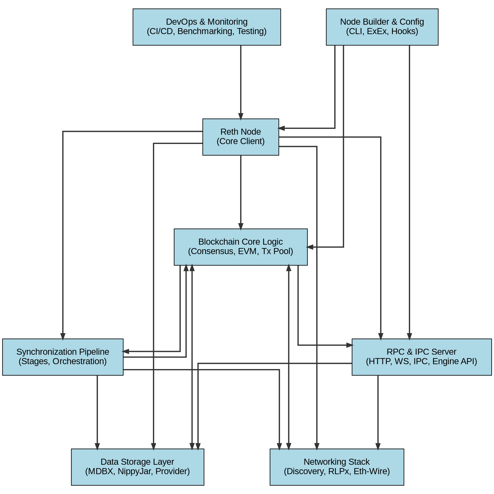
```dot
digraph G {
	nodesep=1.0;
	overlap=false;
	rankdir=TD;
	ranksep=1.0;
	ratio=1.0;
	splines=ortho;
	"DevOps & Monitoring"->"Reth Node"[ arrowsize=0.8, color="#333333", fontname="Arial", fontsize=14, style=bold ];
	"Node Builder & Config"->"Reth Node"[ arrowsize=0.8, color="#333333", fontname="Arial", fontsize=14, style=bold ];
	"Reth Node"->"Blockchain Core Logic"[ arrowsize=0.8, color="#333333", fontname="Arial", fontsize=14, style=bold ];
	"Reth Node"->"Data Storage Layer"[ arrowsize=0.8, color="#333333", fontname="Arial", fontsize=14, style=bold ];
	"Reth Node"->"Networking Stack"[ arrowsize=0.8, color="#333333", fontname="Arial", fontsize=14, style=bold ];
	"Reth Node"->"Synchronization Pipeline"[ arrowsize=0.8, color="#333333", fontname="Arial", fontsize=14, style=bold ];
	"Reth Node"->"RPC & IPC Server"[ arrowsize=0.8, color="#333333", fontname="Arial", fontsize=14, style=bold ];
	"Blockchain Core Logic"->"Data Storage Layer"[ arrowsize=0.8, color="#333333", dir=both, fontname="Arial", fontsize=14, style=bold ];
	"Blockchain Core Logic"->"Networking Stack"[ arrowsize=0.8, color="#333333", dir=both, fontname="Arial", fontsize=14, style=bold ];
	"Blockchain Core Logic"->"Synchronization Pipeline"[ arrowsize=0.8, color="#333333", fontname="Arial", fontsize=14, style=bold ];
	"Blockchain Core Logic"->"RPC & IPC Server"[ arrowsize=0.8, color="#333333", fontname="Arial", fontsize=14, style=bold ];
	"Synchronization Pipeline"->"Blockchain Core Logic"[ arrowsize=0.8, color="#333333", fontname="Arial", fontsize=14, style=bold ];
	"Synchronization Pipeline"->"Data Storage Layer"[ arrowsize=0.8, color="#333333", fontname="Arial", fontsize=14, style=bold ];
	"Synchronization Pipeline"->"Networking Stack"[ arrowsize=0.8, color="#333333", fontname="Arial", fontsize=14, style=bold ];
	"RPC & IPC Server"->"Data Storage Layer"[ arrowsize=0.8, color="#333333", fontname="Arial", fontsize=14, style=bold ];
	"RPC & IPC Server"->"Networking Stack"[ arrowsize=0.8, color="#333333", fontname="Arial", fontsize=14, style=bold ];
	"Node Builder & Config"->"Blockchain Core Logic"[ arrowsize=0.8, color="#333333", fontname="Arial", fontsize=14, style=bold ];
	"Node Builder & Config"->"RPC & IPC Server"[ arrowsize=0.8, color="#333333", fontname="Arial", fontsize=14, style=bold ];
	"Blockchain Core Logic" [ fillcolor=lightblue, fontname="Arial", fontsize=14, label="Blockchain Core Logic\n(Consensus, EVM, Tx Pool)", margin="0.3,0.2", shape=box, style=filled ];
	"Data Storage Layer" [ fillcolor=lightblue, fontname="Arial", fontsize=14, label="Data Storage Layer\n(MDBX, NippyJar, Provider)", margin="0.3,0.2", shape=box, style=filled ];
	"DevOps & Monitoring" [ fillcolor=lightblue, fontname="Arial", fontsize=14, label="DevOps & Monitoring\n(CI/CD, Benchmarking, Testing)", margin="0.3,0.2", shape=box, style=filled ];
	"Networking Stack" [ fillcolor=lightblue, fontname="Arial", fontsize=14, label="Networking Stack\n(Discovery, RLPx, Eth-Wire)", margin="0.3,0.2", shape=box, style=filled ];
	"Node Builder & Config" [ fillcolor=lightblue, fontname="Arial", fontsize=14, label="Node Builder & Config\n(CLI, ExEx, Hooks)", margin="0.3,0.2", shape=box, style=filled ];
	"RPC & IPC Server" [ fillcolor=lightblue, fontname="Arial", fontsize=14, label="RPC & IPC Server\n(HTTP, WS, IPC, Engine API)", margin="0.3,0.2", shape=box, style=filled ];
	"Reth Node" [ fillcolor=lightblue, fontname="Arial", fontsize=14, label="Reth Node\n(Core Client)", margin="0.3,0.2", shape=box, style=filled ];
	"Synchronization Pipeline" [ fillcolor=lightblue, fontname="Arial", fontsize=14, label="Synchronization Pipeline\n(Stages, Orchestration)", margin="0.3,0.2", shape=box, style=filled ];

}
```


---

### Reth 项目结构和开发工作流程

本节将介绍Reth Ethereum客户端的整体架构，重点介绍其模块化设计、性能重点和用户友好性。它还将涵盖持续集成和部署流程，包括基准测试和测试基础设施，这对于维持项目的质量和性能至关重要。

源码路径：

- `/paradigmxyz/reth`
- `/paradigmxyz/reth/.github`
- `/paradigmxyz/reth/scripts`

Reth 项目实现了 Ethereum 执行层客户端，该客户端专为模块化、高性能和用户友好性而设计，通过 Engine API 支持 Ethereum Consensus Layer。其架构允许将各个组件用作独立库，从而促进开发的可扩展性和灵活性。该项目遵循开源模式，旨在为 Ethereum 生态系统内的客户多样性做出贡献，并支持各种 EVM 兼容链。

Reth 开发的核​​心方面是强调持续集成和部署 (CI/CD)，这对于维护代码质量、性能和稳定性至关重要。该基础设施包括全面的基准测试和广泛的测试功能。例如，CI/CD 系统通过位于 [`/paradigmxyz/reth/.github/scripts`](%2Fparadigmxyz%2Freth%2F.github%2Fscripts) 目录中的各种基准测试脚本自动监控性能，这些脚本处理节点设置、执行、数据收集和结果分析。这些脚本可以生成详细的性能报告、延迟和吞吐量等指标的图形表示以及不同代码版本之间的统计比较，从而确保快速识别性能回归。此外，CI/CD 管道还包含兼容性检查，例如验证 Docker 映像架构和 WebAssembly 对 Rust 包的支持，这些包可在 [`/paradigmxyz/reth/.github/scripts/verify_image_arch.sh`](%2Fparadigmxyz%2Freth%2F.github%2Fscripts%2Fverify_image_arch.sh) 和 [`/paradigmxyz/reth/.github/scripts/check_wasm.sh`](%2Fparadigmxyz%2Freth%2F.github%2Fscripts%2Fcheck_wasm.sh) 等文件中找到。

除了自动检查之外，Reth 还包含用于严格验证的强大测试框架。该项目的测试基础设施，特别是在 [`/paradigmxyz/reth/testing`](%2Fparadigmxyz%2Freth%2Ftesting) 目录中，支持 Ethereum 基础 (EF) 测试的执行。这些测试对于确保客户端遵守 Ethereum 协议规范至关重要。测试实用程序还有助于为不同的测试场景生成区块链数据和自定义创世块分配。 [`/paradigmxyz/reth/CONTRIBUTING.md`](%2Fparadigmxyz%2Freth%2FCONTRIBUTING.md) 中记录了为 Reth 做出贡献的综合指南，包括错误报告、功能请求和拉取请求礼仪，以确保一致且高质量的开发流程。此外，特定的清单，例如 [`/paradigmxyz/reth/HARDFORK-CHECKLIST.md`](%2Fparadigmxyz%2Freth%2FHARDFORK-CHECKLIST.md)，指导开发人员集成新的硬分叉更改、详细说明原始类型所需的修改、Engine API 更新和其他 Reth 特定的调整。整个构建、测试和开发工作流程由 [`/paradigmxyz/reth/Makefile`](%2Fparadigmxyz%2Freth%2FMakefile) 管理，它编排从二进制编译和交叉编译到全面测试和 linting 的任务。

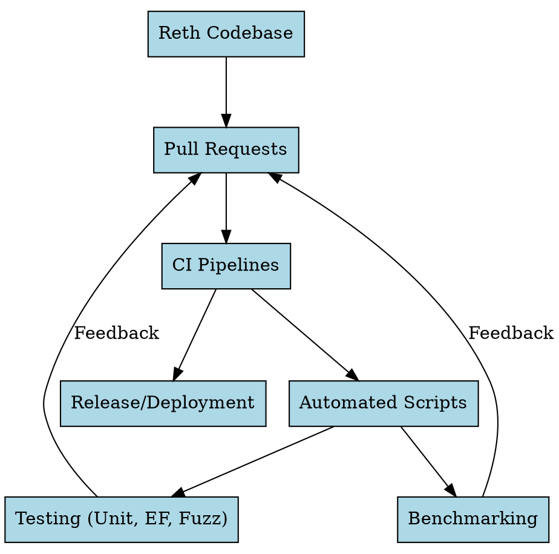
```dot
digraph G {
	rankdir=TD;
	ratio=1.0;
	"Codebase"->"Pull Requests";
	"Pull Requests"->"CI Pipelines";
	"CI Pipelines"->"Automated Scripts";
	"Automated Scripts"->"Testing (Unit, EF, Fuzz)";
	"Automated Scripts"->"Benchmarking";
	"Testing (Unit, EF, Fuzz)"->"Pull Requests"[ label="Feedback" ];
	"Benchmarking"->"Pull Requests"[ label="Feedback" ];
	"CI Pipelines"->"Release/Deployment";
	"Automated Scripts" [ fillcolor=lightblue, label="Automated Scripts", shape=box, style=filled ];
	"Benchmarking" [ fillcolor=lightblue, label="Benchmarking", shape=box, style=filled ];
	"CI Pipelines" [ fillcolor=lightblue, label="CI Pipelines", shape=box, style=filled ];
	"Codebase" [ fillcolor=lightblue, label="Reth Codebase", shape=box, style=filled ];
	"Pull Requests" [ fillcolor=lightblue, label="Pull Requests", shape=box, style=filled ];
	"Release/Deployment" [ fillcolor=lightblue, label="Release/Deployment", shape=box, style=filled ];
	"Testing (Unit, EF, Fuzz)" [ fillcolor=lightblue, label="Testing (Unit, EF, Fuzz)", shape=box, style=filled ];

}
```


---

#### Reth的模块化架构和设计原则

本小节将详细阐述 Reth 的总体设计理念，重点介绍如何通过其 Rust 包结构、具体设计目标以及数据库、P2P 堆栈和指标等组件的架构选择来实现模块化、性能、可配置性和开源友好性。

源码路径：

- `/paradigmxyz/reth/docs/design`
- `/paradigmxyz/reth/docs/repo/layout.md`
- `/paradigmxyz/reth/crates`

Reth Ethereum 客户端的设计非常强调模块化、性能、可配置性和开源友好性。这些原则反映在其 Rust 板条箱结构中，该结构在逻辑上分隔了不同的功能，以及对数据库、P2P 堆栈和指标等关键组件的架构选择。总体设计旨在创建一个强大且适应性强的客户端，能够实现高效的区块链同步和操作。

Reth 的核心目标通过优化状态访问和 I/O 操作来优先考虑性能，从而缩短同步时间并降低运营成本。此重点扩展到支持运行时生成数据（例如交易收据），以最大程度地减少磁盘占用空间，如 [`/paradigmxyz/reth/docs/design/goals.md`](%2Fparadigmxyz%2Freth%2Fdocs%2Fdesign%2Fgoals.md) 中的 Reth 目标文档中所述。可配置性是通过支持用户控制各种权衡的设计实现的，有助于为不同的用户配置文件（例如，存档节点、RPC 提供程序、MEV 搜索器）创建预设。这是通过广泛使用模块化和通用接口来实现的。通过提供设计、实现和贡献流程背景的综合文档来促进开源友好性，使其可供更广泛的开发人员社区使用。

该项目的架构被组织成不同的 Rust 包，每个包都解决特定的问题，如 [`/paradigmxyz/reth/docs/repo/layout.md`](%2Fparadigmxyz%2Freth%2Fdocs%2Frepo%2Flayout.md) 中的项目布局文档中详细说明。这种结构提高了代码的可重用性，简化了维护，并允许组件的独立开发和测试。

[`/paradigmxyz/reth/docs/design/database.md`](%2Fparadigmxyz%2Freth%2Fdocs%2Fdesign%2Fdatabase.md) 中描述的数据库体系结构专为灵活性和性能而设计。它采用 [`Database`](%2Fparadigmxyz%2Freth%2Fdocs%2Fcrates%2Fdb.md#L71) 特征来抽象不同的后端实现，目前支持 [`MDBX`](%2Fparadigmxyz%2Freth%2FMakefile#L100)。 [`Transaction`](%2Fparadigmxyz%2Freth%2Fbin%2Freth-bb%2Fsrc%2Fevm.rs#L427) 抽象进一步管理数据库操作。通用 [`Encode`](%2Fparadigmxyz%2Freth%2Fcrates%2Fstorage%2Fdb-api%2Fsrc%2Ftable.rs#L42) 和 [`Decode`](%2Fparadigmxyz%2Freth%2Fcrates%2Fstorage%2Fdb-api%2Fsrc%2Ftable.rs#L51) 特征以及 [`reth_codec`](%2Fparadigmxyz%2Freth%2Fdocs%2Fcrates%2Feth-wire.md#L133) 派生宏可实现数据的高效序列化和反序列化，支持各种格式并促进基准测试和模糊测试。数据库模式包括规范标头、交易、收据、字节码和历史状态更改的表，确保快速访问过去的状态以进行分析和重新执行。

P2P 网络堆栈基于使用分层子协议作为通用异步流的设计构建，如 [`/paradigmxyz/reth/docs/design/p2p.md`](%2Fparadigmxyz%2Freth%2Fdocs%2Fdesign%2Fp2p.md) 中所述。这种方法可以灵活高效地处理网络通信，包括 [`P2PStream`](%2Fparadigmxyz%2Freth%2Fdocs%2Fcrates%2Feth-wire.md#L163) 和 [`EthStream`](%2Fparadigmxyz%2Freth%2Fdocs%2Fcrates%2Feth-wire.md#L320) 组件。标头下载器（记录在 [`/paradigmxyz/reth/docs/design/headers-downloader.md`](%2Fparadigmxyz%2Freth%2Fdocs%2Fdesign%2Fheaders-downloader.md) 中）利用基于流的方法来高效下载和处理块标头，并在收到和验证后立即生成它们。

指标是 Reth 的监控和性能分析设计的组成部分，如 [`/paradigmxyz/reth/docs/design/metrics.md`](%2Fparadigmxyz%2Freth%2Fdocs%2Fdesign%2Fmetrics.md) 中所述。系统区分指标（以系统为中心的可聚合数据）和跟踪（以请求为中心的分析数据）。 Reth 提供添加计数器、仪表和直方图的机制，由 [`metrics.Key`](%2Fparadigmxyz%2Freth%2Fdocs%2Fdesign%2Fmetrics.md#L34) 和可选的 [`metrics.Label`](%2Fparadigmxyz%2Freth%2Fdocs%2Fdesign%2Fmetrics.md#L34) 标识以获取上下文信息。最佳实践指导指标命名和单位包含，同时避免可以从其他指标推断出的冗余指标。这个全面的指标系统支持 Prometheus 和 Grafana 等外部监控工具。

[`/paradigmxyz/reth/crates/chain-state`](%2Fparadigmxyz%2Freth%2Fcrates%2Fchain-state) 中的 [`chain-state`](%2Fparadigmxyz%2Freth%2FCargo.toml#L324) 箱对于管理核心区块链状态至关重要。它包括用于监视规范块、安全块和最终块的 [`ChainInfoTracker`](%2Fparadigmxyz%2Freth%2Fcrates%2Fchain-state%2Fsrc%2Flib.rs#L26)，用于优化 trie 数据计算的 [`DeferredTrieData`](%2Fparadigmxyz%2Freth%2Fcrates%2Fchain-state%2Fsrc%2Fdeferred_trie.rs#L91)，以及用于管理规范块及其在内存中的执行输出的 [`InMemoryState`](%2Fparadigmxyz%2Freth%2Fcrates%2Fchain-state%2Fsrc%2Fin_memory.rs#L69)。这些组件对于有效的状态访问和处理链重组至关重要。通知系统（[`CanonStateSubscriptions`](%2Fparadigmxyz%2Freth%2Fcrates%2Fchain-state%2Fsrc%2Fnotifications.rs#L29)、[`ForkChoiceSubscriptions`](%2Fparadigmxyz%2Freth%2Fcrates%2Fchain-state%2Fsrc%2Fnotifications.rs#L187)、[`PersistedBlockSubscriptions`](%2Fparadigmxyz%2Freth%2Fcrates%2Fchain-state%2Fsrc%2Fnotifications.rs#L245)) 提供订阅状态更改事件的机制。

[`/paradigmxyz/reth/crates/chainspec`](%2Fparadigmxyz%2Freth%2Fcrates%2Fchainspec) 中的 [`chainspec`](%2Fparadigmxyz%2Freth%2Fbin%2Freth%2Fsrc%2Flib.rs#L116) 包通过 [`EthChainSpec`](%2Fparadigmxyz%2Freth%2Fcrates%2Fchainspec%2Fsrc%2Fapi.rs#L14) 特征和 [`ChainSpec`](%2Fparadigmxyz%2Freth%2Fbin%2Freth-bb%2Fsrc%2Fmain.rs#L156) 结构集中了 Ethereum 网络规范的定义。这允许对链参数、硬分叉和创世数据进行清晰一致的配置，从而能够轻松适应不同的 Ethereum 网络。

[`/paradigmxyz/reth/crates/evm`](%2Fparadigmxyz%2Freth%2Fcrates%2Fevm) 中的 [`evm`](%2Fparadigmxyz%2Freth%2Fbin%2Freth-bb%2Fsrc%2Fevm.rs#L537) 包提供了 EVM 操作的框架。它定义了用于设置 EVM 环境的 [`ConfigureEvm`](%2Fparadigmxyz%2Freth%2Fbin%2Freth-bb%2Fsrc%2Fevm.rs#L91) 和用于事务执行的 [`Executor`](%2Fparadigmxyz%2Freth%2Fcrates%2Fevm%2Fevm%2Fsrc%2Fexecute.rs#L34) 等特征。这种模块化允许灵活的 EVM 配置和高效的执行错误处理。

总的来说，Reth 的架构是这些设计原则的仔细平衡，体现在其结构良好的 Rust 包和深思熟虑的实现选择中，以提供高性能、可配置和社区驱动的 Ethereum 客户端。

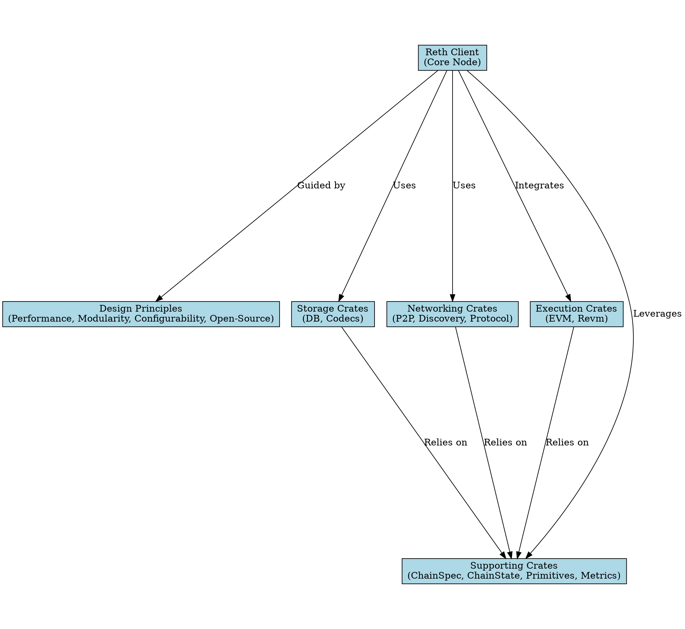
```dot
digraph G {
	rankdir=TD;
	ratio=1.0;
	RethClient->DesignPrinciples[ label="Guided by" ];
	RethClient->Storage[ label="Uses" ];
	RethClient->Networking[ label="Uses" ];
	RethClient->Execution[ label="Integrates" ];
	RethClient->SupportingCrates[ label="Leverages" ];
	Storage->SupportingCrates[ label="Relies on" ];
	Networking->SupportingCrates[ label="Relies on" ];
	Execution->SupportingCrates[ label="Relies on" ];
	DesignPrinciples [ fillcolor=lightblue, label="Design Principles\n(Performance, Modularity, Configurability, Open-Source)", shape=box, style=filled ];
	Execution [ fillcolor=lightblue, label="Execution Crates\n(EVM, Revm)", shape=box, style=filled ];
	Networking [ fillcolor=lightblue, label="Networking Crates\n(P2P, Discovery, Protocol)", shape=box, style=filled ];
	RethClient [ fillcolor=lightblue, label="Reth Client\n(Core Node)", shape=box, style=filled ];
	Storage [ fillcolor=lightblue, label="Storage Crates\n(DB, Codecs)", shape=box, style=filled ];
	SupportingCrates [ fillcolor=lightblue, label="Supporting Crates\n(ChainSpec, ChainState, Primitives, Metrics)", shape=box, style=filled ];

}
```


---

#### 持续集成和部署工作流程

本小节将详细介绍 Reth 的 CI/CD 基础设施，概述代码质量、文档、测试和发布流程的各种工作流程，包括 linting、单元测试、集成测试、模糊测试和夜间重新测试。

源码路径：

- `/paradigmxyz/reth/.github`
- `/paradigmxyz/reth/docs/repo/ci.md`
- `/paradigmxyz/reth/docs/workflow.md`
- `/paradigmxyz/reth/docs/release.md`

Reth 的持续集成和部署 (CI/CD) 基础架构可自动执行各种流程，以维护代码质量、确保功能、管理文档并促进发布。该系统主要由 [`.github`](%2Fparadigmxyz%2Freth%2FREADME.md#L85) 目录中定义的工作流程驱动，其中包含这些自动化任务的脚本和配置文件。

CI/CD 管道包括代码质量、文档、测试和发布管理的不同工作流程，如 [`/paradigmxyz/reth/docs/repo/ci.md`](%2Fparadigmxyz%2Freth%2Fdocs%2Frepo%2Fci.md) 文档中详细介绍。与代码相关的工作流程涵盖单元测试、集成测试和性能基准测试。文档工作流程构建、测试和部署项目的文档。元工作流处理发布流程、依赖关系管理和 Docker 映像发布。

所有拉取请求都会经过自动检查，包括 [`clippy`](%2Fparadigmxyz%2Freth%2FMakefile#L253) 和 [`rustfmt`](%2Fparadigmxyz%2Freth%2FAGENTS.md#L34) 等 linting 工具、单元测试、模糊测试以及模拟对等互连和测试网交互的集成测试，如 [`/paradigmxyz/reth/docs/workflow.md`](%2Fparadigmxyz%2Freth%2Fdocs%2Fworkflow.md) 文档中所述。此外，在发布之前，每个拉取请求每晚都会在实时测试网上重新测试，以确认稳定性和性能。

[`/paradigmxyz/reth/docs/release.md`](%2Fparadigmxyz%2Freth%2Fdocs%2Frelease.md) 中概述的发布过程包括准备发布拉取请求、更新版本号以及在 [`main`](%2Fparadigmxyz%2Freth%2Fbin%2Freth%2Fsrc%2Fmain.rs#L20) 分支上标记提交。这会触发一个自动化工作流程，该工作流程构建发布工件并在 GitHub 上创建草稿版本，然后维护人员最终确定该版本。

基准测试和性能分析已集成到 CI/CD 系统中。 [`/paradigmxyz/reth/.github/scripts`](%2Fparadigmxyz%2Freth%2F.github%2Fscripts) 中的脚本管理 GitHub 拉取请求的基准测试、报告生成和状态更新的执行。例如，[`/paradigmxyz/reth/.github/scripts/bench-job-summary.js`](%2Fparadigmxyz%2Freth%2F.github%2Fscripts%2Fbench-job-summary.js) 生成基准测试结果的详细摘要，包括性能指标、图表和分析链接。 [`/paradigmxyz/reth/.github/scripts/bench-slack-notify.js`](%2Fparadigmxyz%2Freth%2F.github%2Fscripts%2Fbench-slack-notify.js) 向通信渠道发送通知，[`/paradigmxyz/reth/.github/scripts/bench-update-status.js`](%2Fparadigmxyz%2Freth%2F.github%2Fscripts%2Fbench-update-status.js) 使用基准作业状态更新拉取请求评论。

兼容性检查确保 Reth 在不同环境和体系结构中发挥作用。例如，[`/paradigmxyz/reth/.github/scripts/check_rv32imac.sh`](%2Fparadigmxyz%2Freth%2F.github%2Fscripts%2Fcheck_rv32imac.sh) 验证是否可以为 RISC-V 目标构建特定的 Rust 包，而 [`/paradigmxyz/reth/.github/scripts/check_wasm.sh`](%2Fparadigmxyz%2Freth%2F.github%2Fscripts%2Fcheck_wasm.sh) 确认 WebAssembly 兼容性。 [`/paradigmxyz/reth/.github/scripts/hive`](%2Fparadigmxyz%2Freth%2F.github%2Fscripts%2Fhive) 子目录管理 [`hive`](%2Fparadigmxyz%2Freth%2Fdocs%2Frepo%2Fci.md#L27) 模拟器以进行广泛的集成测试，包括构建和运行模拟器以及解析测试报告以进行验证。

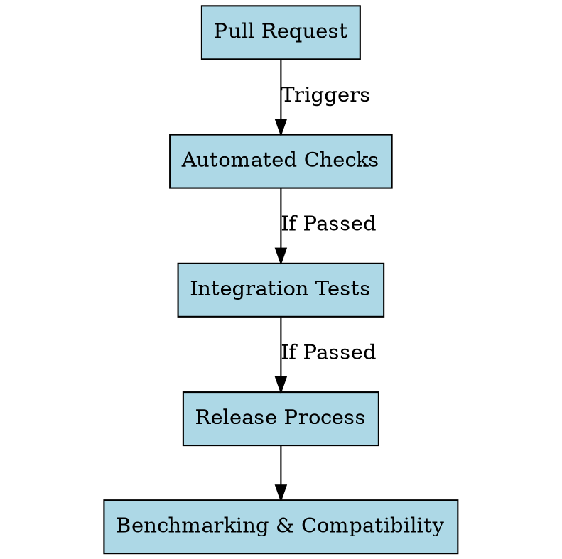
```dot
digraph G {
	rankdir=TD;
	ratio=1.0;
	"Pull Request"->"Automated Checks"[ label="Triggers" ];
	"Automated Checks"->"Integration Tests"[ label="If Passed" ];
	"Integration Tests"->"Release Process"[ label="If Passed" ];
	"Release Process"->"Benchmarking & Compatibility";
	"Automated Checks" [ fillcolor=lightblue, shape=box, style=filled ];
	"Benchmarking & Compatibility" [ fillcolor=lightblue, shape=box, style=filled ];
	"Integration Tests" [ fillcolor=lightblue, shape=box, style=filled ];
	"Pull Request" [ fillcolor=lightblue, shape=box, style=filled ];
	"Release Process" [ fillcolor=lightblue, shape=box, style=filled ];

}
```


---

#### 全面的基准测试和性能分析

本小节将深入介绍 Reth 的广泛基准测试工具和流程，涵盖如何测量、分析和报告性能，包括“大块”基准测试、实时同步性能、事务生成以及使用 `benchmarkoor` 和 Prometheus 等工具进行度量。

源码路径：

- `/paradigmxyz/reth/bin/reth-bb`
- `/paradigmxyz/reth/bin/reth-bench`
- `/paradigmxyz/reth/.github/scripts`

Reth 采用广泛的工具和流程套件进行基准测试和性能分析，涵盖“大块”执行、实时同步和事务生成。这些功能对于评估和维护客户的绩效特征至关重要。

[`reth-bench`](%2Fparadigmxyz%2Freth%2FCargo.toml#L323) 实用程序位于 [`/paradigmxyz/reth/bin/reth-bench`](%2Fparadigmxyz%2Freth%2Fbin%2Freth-bench) 中，可用作对 Reth 性能进行基准测试的通用工具，特别关注实时同步。它通过模拟 Consensus Layer (CL) 客户端、重放历史区块以及在受控环境中执行 Reth 的实时同步代码路径来进行操作。这允许测量关键指标，例如延迟、每个块使用的 Gas 和 Gas 吞吐量 ([`GGas/s`](%2Fparadigmxyz%2Freth%2Fbin%2Freth-bench%2FREADME.md#L122))。 [`reth-bench`](%2Fparadigmxyz%2Freth%2FCargo.toml#L323) 支持各种 Engine API 交互模拟，包括 [`newPayload`](%2Fparadigmxyz%2Freth%2FAGENTS.md#L21) 和 [`forkchoiceUpdated`](%2Fparadigmxyz%2Freth%2FAGENTS.md#L21) 调用，这是主网实时同步的基础。它还提供受控等待模式、RPC 配置选项以及相对于当前磁头对块进行基准测试的能力，使其能够适应不同的测试场景。为了进行深入的性能分析，[`reth-bench`](%2Fparadigmxyz%2Freth%2FCargo.toml#L323) 与 Prometheus 集成以进行指标收集，并提供 CSV 格式的输出，从而实现结果的进一步处理和可视化。还内置了分析支持，允许在基准测试期间进行详细的 CPU 和内存使用情况分析。 [`/paradigmxyz/reth/bin/reth-bench/scripts`](%2Fparadigmxyz%2Freth%2Fbin%2Freth-bench%2Fscripts) 中的脚本有助于分析和比较来自 [`reth-bench`](%2Fparadigmxyz%2Freth%2FCargo.toml#L323) 输出的性能指标，生成延迟直方图和气体吞吐量图表等图表，以识别性能回归或改进。

为了对“大块”执行进行基准测试，Reth 利用位于 [`/paradigmxyz/reth/bin/reth-bb`](%2Fparadigmxyz%2Freth%2Fbin%2Freth-bb) 中的专用 [`reth-bb`](%2Fparadigmxyz%2Freth%2Fbin%2Freth-bb%2FREADME.md#L1) 工具。这个修改后的 Reth 节点旨在通过将来自多个标准块的交易合并到单个人为的大负载中来模拟高 Gas 工作负载。 [`reth-bb`](%2Fparadigmxyz%2Freth%2Fbin%2Freth-bb%2FREADME.md#L1) 放宽了某些共识验证以适应这些大块，使其适合压力测试执行性能而不是生产用途。工作流程涉及使用 [`reth-bench generate-big-block`](%2Fparadigmxyz%2Freth%2Fbin%2Freth-bb%2FREADME.md#L27) 生成这些大块，运行 [`reth-bb`](%2Fparadigmxyz%2Freth%2Fbin%2Freth-bb%2FREADME.md#L1) 节点，然后重放生成的有效负载。 [`reth-bb`](%2Fparadigmxyz%2Freth%2Fbin%2Freth-bb%2FREADME.md#L1) 节点处理这些大块的多段执行，其中每个段在自己的 EVM 环境中运行，以准确模拟原始合并块的执行上下文。

持续集成和部署 (CI/CD) 基础设施大量利用这些基准测试工具。 [`/paradigmxyz/reth/.github/scripts`](%2Fparadigmxyz%2Freth%2F.github%2Fscripts) 中的脚本编排全面的基准测试工作流程。例如，[`/paradigmxyz/reth/.github/scripts/bench-benchmarkoor-run.sh`](%2Fparadigmxyz%2Freth%2F.github%2Fscripts%2Fbench-benchmarkoor-run.sh) 管理 Reth 节点生命周期、重置数据目录并集成以进行测试执行和结果记录。 [`/paradigmxyz/reth/.github/scripts/bench-benchmarkoor-snapshot.sh`](%2Fparadigmxyz%2Freth%2F.github%2Fscripts%2Fbench-benchmarkoor-snapshot.sh) 自动设置区块链快照，以实现一致的基准测试环境。 [`/paradigmxyz/reth/.github/scripts/bench-benchmarkoor-summary.py`](%2Fparadigmxyz%2Freth%2F.github%2Fscripts%2Fbench-benchmarkoor-summary.py) 等后处理脚本总结性能结果，而 [`/paradigmxyz/reth/.github/scripts/bench-reth-summary.py`](%2Fparadigmxyz%2Freth%2F.github%2Fscripts%2Fbench-reth-summary.py) 提供基线和功能性能之间的统计比较，包括 `compute_paired_stats` 和 `significance`。通过 [`/paradigmxyz/reth/.github/scripts/bench-metrics-proxy.py`](%2Fparadigmxyz%2Freth%2F.github%2Fscripts%2Fbench-metrics-proxy.py) 和 [`/paradigmxyz/reth/.github/scripts/bench-reth-charts.py`](%2Fparadigmxyz%2Freth%2F.github%2Fscripts%2Fbench-reth-charts.py) 支持指标收集和可视化，前者将基准特定标签和时间戳注入 Prometheus 指标，后者生成延迟、吞吐量和 Gas 指标的图形表示。这些 CI/CD 脚本还管理事务生成基准，从而能够评估 Reth 在各种事务负载条件下的性能。这些基准测试的结果可以通过 [`/paradigmxyz/reth/.github/scripts/bench-upload-clickhouse.py`](%2Fparadigmxyz%2Freth%2F.github%2Fscripts%2Fbench-upload-clickhouse.py) 上传到 ClickHouse 数据库以进行长期性能监控，并且通过 [`/paradigmxyz/reth/.github/scripts/bench-slack-notify.js`](%2Fparadigmxyz%2Freth%2F.github%2Fscripts%2Fbench-slack-notify.js) 和 [`/paradigmxyz/reth/.github/scripts/bench-update-status.js`](%2Fparadigmxyz%2Freth%2F.github%2Fscripts%2Fbench-update-status.js) 管理 GitHub 拉取请求评论的通知。

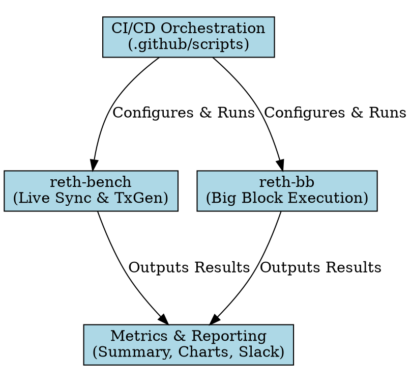
```dot
digraph G {
	rankdir=TD;
	ratio=1.0;
	"CI/CD Orchestration"->"reth-bench (Live Sync)"[ label="Configures & Runs" ];
	"CI/CD Orchestration"->"reth-bb (Big Block)"[ label="Configures & Runs" ];
	"reth-bench (Live Sync)"->"Metrics & Reporting"[ label="Outputs Results" ];
	"reth-bb (Big Block)"->"Metrics & Reporting"[ label="Outputs Results" ];
	"CI/CD Orchestration" [ fillcolor=lightblue, label="CI/CD Orchestration\n(.github/scripts)", shape=box, style=filled ];
	"Metrics & Reporting" [ fillcolor=lightblue, label="Metrics & Reporting\n(Summary, Charts, Slack)", shape=box, style=filled ];
	"reth-bb (Big Block)" [ fillcolor=lightblue, label="reth-bb\n(Big Block Execution)", shape=box, style=filled ];
	"reth-bench (Live Sync)" [ fillcolor=lightblue, label="reth-bench\n(Live Sync & TxGen)", shape=box, style=filled ];

}
```


---

#### 核心开发和贡献指南

本小节将解释为 Reth 做出贡献的准则，包括项目的行为准则、错误报告、功能请求流程、拉取请求礼仪以及硬分叉集成的具体说明，以确保开发的一致性和质量。

源码路径：

- `/paradigmxyz/reth/AGENTS.md`
- `/paradigmxyz/reth/CONTRIBUTING.md`
- `/paradigmxyz/reth/HARDFORK-CHECKLIST.md`
- `/paradigmxyz/reth/scripts`

为 Reth 项目做出贡献需要遵守一组旨在维护代码质量、一致性和协作环境的准则。所有贡献均受到重视并在 Apache 2.0 和 MIT 许可证下做出。

该项目概述了符合 Rust 社区标准的明确[行为准则][rust-coc]。违规行为可报告至 [`georgios@paradigm.xyz`](%2Fparadigmxyz%2Freth%2FCONTRIBUTING.md#L24)。

贡献者可以通过报告错误、建议功能或提交拉取请求来参与。如果有问题或需要帮助，建议在存储库的讨论板上进行讨论，[Reth 文档][reth-docs] 提供全面的信息。

错误报告应包括 Reth 版本、操作平台、代码片段（如果适用）以及重现问题的具体步骤。功能请求需要详细的解释，最好是来自其他工具的示例。

拉取请求是代码更改的主要机制。对于重大更改，建议首先提出问题以收集反馈。合并之前，所有代码更改都必须通过 [`make pr`](%2Fparadigmxyz%2Freth%2FMakefile#L40) 检查，其中包括格式设置、linting 和测试。鼓励对更大的功能草拟拉取请求，以促进早期协作并防止重复工作。

提交拉取请求时，必须包含针对任何更改代码的一项或多项测试。这包括针对特定功能的单元测试和针对更广泛功能的集成测试。有关运行各个测试的信息可在 [cargo-test](https://doc.rust-lang.org/cargo/commands/cargo-test.html) 文档中找到。提交应该按逻辑组织，在打开拉取请求之前压缩“检查点”提交。提供了一个模板来指导拉取请求提交过程。

该项目采用审查流程，任何社区成员都可以提供反馈。审稿人应该是有帮助的、有洞察力的、有建设性的，专注于提高贡献。评审应优先考虑 Reth 的整体意义、重大改进、明确的错误和可读的提交消息。增量改进足以进行合并，并且审阅者被要求请求更改而不是要求更改。小的、非必要的建议（nits）是可以接受的，但应该明确标记。如果拉取请求被放弃，其他人可能会接管工作，并将功劳归于原始贡献者。

对于集成新的硬分叉或 devnet 更改的开发人员，[`/paradigmxyz/reth/HARDFORK-CHECKLIST.md`](%2Fparadigmxyz%2Freth%2FHARDFORK-CHECKLIST.md) 中提供了特定的清单。此清单指导修改 [`alloy`](%2Fparadigmxyz%2Freth%2Fdeny.toml#L93) 内的原始数据结构、更新 EIP 数据结构和常量，以及调整现有结构，例如 [`Header`](%2Fparadigmxyz%2Freth%2Fcrates%2Fchainspec%2Fsrc%2Fapi.rs#L16) 或 [`Block`](%2Fparadigmxyz%2Freth%2Fbin%2Freth-bb%2Fsrc%2Fmain.rs#L77)。它还详细介绍了添加新的 Engine API 类型以及将 [`ExecutionPayload`](%2Fparadigmxyz%2Freth%2Fcrates%2Fpayload%2Fprimitives%2Fsrc%2Fpayload.rs#L16) 的转换逻辑更新为 Execution Layer (EL) 块，以及特定于版本的验证检查。

对于为 Reth 做出贡献的 AI 代理，[`/paradigmxyz/reth/AGENTS.md`](%2Fparadigmxyz%2Freth%2FAGENTS.md) 中的专门指南概述了架构、开发工作流程和贡献标准。本指南强调模块化、性能、通过特征的可扩展性以及类型安全作为核心设计原则。它还详细介绍了开发工作流程，包括代码风格（例如，[`cargo +nightly fmt --all`](%2Fparadigmxyz%2Freth%2FMakefile#L12)、[`cargo +nightly clippy`](%2Fparadigmxyz%2Freth%2FMakefile#L12)）、测试指南（单元、集成、基准测试、模糊、属性测试）和性能注意事项（避免在热路径中分配，使用 [`rayon`](%2Fparadigmxyz%2Freth%2FCargo.toml#L525) 和 [`tokio`](%2Fparadigmxyz%2Freth%2FCargo.toml#L564)）。该指南还提供了打开 PR 的最佳实践，包括使用 [常规提交](https://www.conventionalcommits.org/) 作为标题，并提供了评论建议，重点解释“为什么”和非显而易见的行为。它还指定 Rust 样式指南，例如主要类型与文件名匹配的文件中的类型排序。 PR 提交前的 CI 要求包括格式、剪辑、测试和文档更新，特别提到 CLI 文档的 [`make update-book-cli`](%2Fparadigmxyz%2Freth%2FMakefile#L40)。

| 贡献类型 | 主要要求和指南 | 审核流程期望 |
| :---------------- | :---------------------------- | :-------------------------- |
| 错误报告       | 提供Reth版本、平台、代码片段以及具体复现步骤。 | 为了清楚起见，可能会提出更多问题。 |
| 功能请求  | 详细说明、附加上下文以及其他工具的示例（如果适用）。 | 随后将进行讨论以完善该功能。 |
| 请求请求     | 遵守行为准则，通过 `make pr` 检查（fmt、clippy、测试），遵循提交消息指南（常规提交），并包含测试。 | 将提供反馈；注重变更的逻辑分组、渐进式改进和建设性批评。 Nits 还可以，但不应该阻碍 PR。 |


---

#### 端到端测试和 Ethereum 基础测试集成

本小节将描述 Reth 强大的测试基础设施，特别关注用于执行和评估 Ethereum 基础 (EF) 测试、生成测试数据以及为各种节点交互和场景模拟提供端到端测试实用程序的框架。

源码路径：

- `/paradigmxyz/reth/testing`
- `/paradigmxyz/reth/crates/e2e-test-utils`

Reth 采用强大的测试基础设施，旨在确保客户端的正确性和性能。这包括用于执行和评估 Ethereum 基础 (EF) 测试的综合框架、用于生成合成区块链数据的实用程序，以及用于模拟各种节点交互和场景的一套端到端测试工具。

Ethereum 基础测试的测试框架位于 [`/paradigmxyz/reth/testing/ef-tests`](%2Fparadigmxyz%2Freth%2Ftesting%2Fef-tests)，提供用于处理测试用例、管理结果和断言结果的抽象。它专门实现了 [`BlockchainTests`](%2Fparadigmxyz%2Freth%2Ftesting%2Fef-tests%2Fsrc%2Fcases%2Fblockchain_test.rs#L38) 的测试运行程序，这对于根据已知的 Ethereum 状态验证 Reth 的执行逻辑至关重要。该框架从 JSON 文件加载和过滤测试用例，执行它们，并根据预期状态验证执行结果，包括状态根验证。此上下文中的数据建模涉及反映 EF 测试 JSON 格式的 Rust 结构，有助于将特定于测试的分叉定义转换为 Reth 的 [`ChainSpec`](%2Fparadigmxyz%2Freth%2Fbin%2Freth-bb%2Fsrc%2Fmain.rs#L156) 对象。 [`/paradigmxyz/reth/testing/runner`](%2Fparadigmxyz%2Freth%2Ftesting%2Frunner) 中提供了命令行界面来运行这些 EF 区块链测试。

除了 EF 测试之外，Reth 还包括 [`/paradigmxyz/reth/crates/e2e-test-utils`](%2Fparadigmxyz%2Freth%2Fcrates%2Fe2e-test-utils) 中的端到端测试实用程序，可简化测试 Reth 节点设置的创建、配置和交互。这些实用程序允许生成和配置测试环境、管理节点交互以及处理事务。它们还提供用于有效负载和链数据操作的工具，包括 RLP 导入/导出功能。该测试套件位于 [`/paradigmxyz/reth/crates/e2e-test-utils/tests`](%2Fparadigmxyz%2Freth%2Fcrates%2Fe2e-test-utils%2Ftests) 中，涵盖了广泛的 Reth 功能，包括核心区块链操作、多节点同步以及使用 [`RocksDB`](%2Fparadigmxyz%2Freth%2Fcrates%2Fstorage%2Fprovider%2Fsrc%2Feither_writer.rs#L85) 的持久性。该框架通过 [`TestBuilder`](%2Fparadigmxyz%2Freth%2Fexamples%2Fexex-test%2Fsrc%2Fmain.rs#L5) 模式支持灵活的场景构建，从而实现复杂的多节点和共识相关的测试场景。

为了进一步帮助测试和开发，[`/paradigmxyz/reth/testing/testing-utils`](%2Fparadigmxyz%2Freth%2Ftesting%2Ftesting-utils) 目录提供了随机区块链数据的生成器和用于促进自定义创世块分配的工具。这些生成器可以创建各种区块链原语，例如密封标头、具有随机交易的完整块、ommer 和提款，以及模拟状态转换。该实用程序中的 [`GenesisAllocator`](%2Fparadigmxyz%2Freth%2Ftesting%2Ftesting-utils%2Fsrc%2Fgenesis_allocator.rs#L44) 允许使用特定帐户余额、代码和存储创建自定义创世分配，支持灵活的测试设置配置。

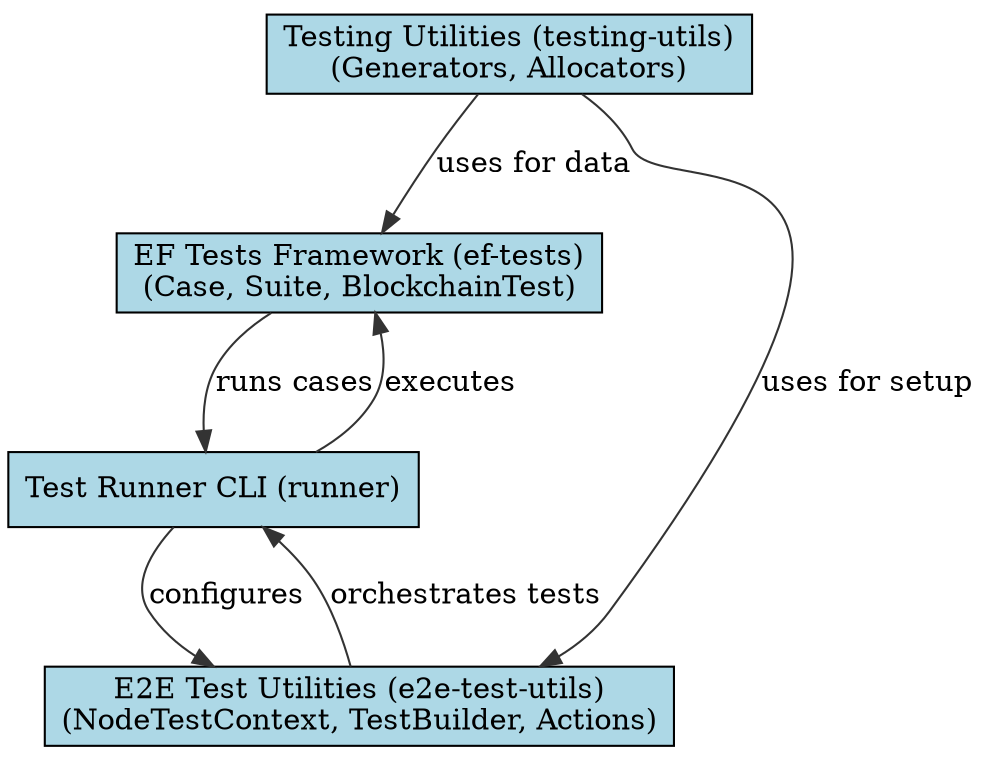
```dot
digraph G {
	overlap=false;
	rankdir=TD;
	ratio=1.0;
	splines=true;
	"Testing Utilities"->"EF Tests Framework"[ color="#333333", label="uses for data" ];
	"Testing Utilities"->"E2E Test Utilities"[ color="#333333", label="uses for setup" ];
	"EF Tests Framework"->"Test Runner CLI"[ color="#333333", label="runs cases" ];
	"E2E Test Utilities"->"Test Runner CLI"[ color="#333333", label="orchestrates tests" ];
	"Test Runner CLI"->"EF Tests Framework"[ color="#333333", label="executes" ];
	"Test Runner CLI"->"E2E Test Utilities"[ color="#333333", label="configures" ];
	"E2E Test Utilities" [ fillcolor=lightblue, label="E2E Test Utilities (e2e-test-utils)\n(NodeTestContext, TestBuilder, Actions)", shape=box, style=filled ];
	"EF Tests Framework" [ fillcolor=lightblue, label="EF Tests Framework (ef-tests)\n(Case, Suite, BlockchainTest)", shape=box, style=filled ];
	"Test Runner CLI" [ fillcolor=lightblue, label="Test Runner CLI (runner)", shape=box, style=filled ];
	"Testing Utilities" [ fillcolor=lightblue, label="Testing Utilities (testing-utils)\n(Generators, Allocators)", shape=box, style=filled ];

}
```


---

#### Reth CLI 应用程序结构和功能标志

本小节将详细介绍主要 `reth` 可执行文件的内部结构，解释它如何从各种板条箱重新导出模块，为自定义构建和运行时行为定义大量功能标志，以及管理命令行界面向后兼容性。

源码路径：

- `/paradigmxyz/reth/bin/reth`

主 [`reth`](%2Fparadigmxyz%2Freth%2FCargo.toml#L320) 可执行文件提供启动 Ethereum 节点、处理命令行参数解析并提供调试功能的入口点。它采用模块化架构设计，可从其他 [`reth_`](%2Fparadigmxyz%2Freth%2Fcrates%2Frpc%2Frpc-builder%2Fsrc%2Flib.rs#L875) 包中重新导出各种组件，并使用功能标志来启用自定义构建和运行时行为。可执行文件的核心库位于 [`/paradigmxyz/reth/bin/reth/src`](%2Fparadigmxyz%2Freth%2Fbin%2Freth%2Fsrc) 中，其中包含负责节点初始化和生命周期管理的 [`main.rs`](%2Fparadigmxyz%2Freth%2Fbin%2Freth%2FCargo.toml#L193) 文件。

该可执行文件充当中央集线器，通过从各种 [`reth_`](%2Fparadigmxyz%2Freth%2Fcrates%2Frpc%2Frpc-builder%2Fsrc%2Flib.rs#L875) 包重新导出模块来防止破坏性更改，例如 [`cli`](%2Fparadigmxyz%2Freth%2Fcrates%2Fethereum%2Fcli%2Fsrc%2Fapp.rs#L32)、[`utils`](%2Fparadigmxyz%2Freth%2Fbin%2Freth%2Fsrc%2Flib.rs#L59)、[`payload`](%2Fparadigmxyz%2Freth%2Fcrates%2Fnode%2Ftypes%2Fsrc%2Flib.rs#L111)、[`api`](%2Fparadigmxyz%2Freth%2Fcrates%2Frpc%2Frpc-builder%2Fsrc%2Feth.rs#L10)、 [`core`](%2Fparadigmxyz%2Freth%2Fbin%2Freth%2Fsrc%2Flib.rs#L80)、[`prometheus_exporter`](%2Fparadigmxyz%2Freth%2Fbin%2Freth%2Fsrc%2Flib.rs#L85)、[`args`](%2Fparadigmxyz%2Freth%2Fcrates%2Fcli%2Fcommands%2Fsrc%2Fdb%2Flist.rs#L93)、[`version`](%2Fparadigmxyz%2Freth%2Fdeny.toml#L45)、[`builder`](%2Fparadigmxyz%2Freth%2Fcrates%2Ftasks%2Fsrc%2Fpool.rs#L71)、[`dirs`](%2Fparadigmxyz%2Freth%2Fbin%2Freth%2Fsrc%2Flib.rs#L111)、[`chainspec`](%2Fparadigmxyz%2Freth%2Fbin%2Freth%2Fsrc%2Flib.rs#L116)、 [`providers`](%2Fparadigmxyz%2Freth%2Fbin%2Freth%2Fsrc%2Flib.rs#L122)、[`primitives`](%2Fparadigmxyz%2Freth%2Fdocs%2Frepo%2Flayout.md#L172)、[`beacon_consensus`](%2Fparadigmxyz%2Freth%2Fbin%2Freth%2Fsrc%2Flib.rs#L134)、[`consensus`](%2Fparadigmxyz%2Freth%2Fcrates%2Fnode%2Fapi%2Fsrc%2Fnode.rs#L86)、[`revm`](%2Fparadigmxyz%2Freth%2FCargo.toml#L437)、[`tasks`](%2Fparadigmxyz%2Freth%2Fcrates%2Fpayload%2Fbasic%2Fsrc%2Flib.rs#L119)、 [`network`](%2Fparadigmxyz%2Freth%2Fcrates%2Frpc%2Frpc%2Fsrc%2Fnet.rs#L12)、[`transaction_pool`](%2Fparadigmxyz%2Freth%2Fcrates%2Fnode%2Fbuilder%2Fsrc%2Fcomponents%2Fmod.rs#L74) 和 [`rpc`](%2Fparadigmxyz%2Freth%2Fexamples%2FREADME.md#L29)。这种在 [`/paradigmxyz/reth/bin/reth/src/lib.rs`](%2Fparadigmxyz%2Freth%2Fbin%2Freth%2Fsrc%2Flib.rs) 中实现的重新导出策略可确保应用程序能够不断发展，而不会不断破坏其使用者的接口。

[`reth`](%2Fparadigmxyz%2Freth%2FCargo.toml#L320) 可执行文件的灵活性的一个重要方面来自于它对 [`/paradigmxyz/reth/bin/reth/src/lib.rs`](%2Fparadigmxyz%2Freth%2Fbin%2Freth%2Fsrc%2Flib.rs) 中定义的功能标志的广泛使用。这些标志控制诸如全局内存分配器（例如，用于性能的 [`jemalloc`](%2Fparadigmxyz%2Freth%2Fbin%2Freth%2FCargo.toml#L124) 或用于替代方案的 [`snmalloc`](%2Fparadigmxyz%2Freth%2Fbin%2Freth%2FCargo.toml#L154)）、用于指标的 OpenTelemetry ([`otlp`](%2Fparadigmxyz%2Freth%2Fbin%2Freth%2FCargo.toml#L96))、用于 RPC 调试的 JavaScript 跟踪器 ([`js-tracer`](%2Fparadigmxyz%2Freth%2Fbin%2Freth%2FCargo.toml#L104))、Keccak256用于加密操作的缓存（[`keccak-cache-global`](%2Fparadigmxyz%2Freth%2Fbin%2Freth%2FCargo.toml#L119)、[`asm-keccak`](%2Fparadigmxyz%2Freth%2Fbin%2Freth%2FCargo.toml#L113))，以及用于调试和监控的各种日志级别。这些功能允许开发人员根据特定用例定制节点的构建，例如优化性能、启用分析工具或调整日志记录的详细程度。

命令行界面的向后兼容性是通过 [`/paradigmxyz/reth/bin/reth/src/cli/mod.rs`](%2Fparadigmxyz%2Freth%2Fbin%2Freth%2Fsrc%2Fcli%2Fmod.rs) 维护的，它重新导出已移至 [`reth_node_core`](%2Fparadigmxyz%2Freth%2Fbin%2Freth%2Fsrc%2Flib.rs#L62) 和 [`reth_ethereum_cli::interface`](%2Fparadigmxyz%2Freth%2Fbin%2Freth%2Fsrc%2Fcli%2Fmod.rs#L12) 的 CLI 相关类型。这可确保依赖 [`reth`](%2Fparadigmxyz%2Freth%2FCargo.toml#L320) CLI 的现有脚本和工具在内部重构的情况下仍能正常运行。整体结构允许强大且适应性强的 Ethereum 客户端，其核心可执行文件、各种组件及其配置机制之间的关注点清晰分离。如需更深入地了解Reth的整体结构和开发，请参阅[Reth项目结构和开发工作流程](#reth-project-structure-and-development-workflow)。有关通用CLI框架的更多详细信息，请参阅[通用CLI框架和链规范解析](#node-operation-and-command-line-interface-common-cli-framework-and-chain-specification-parsing)。

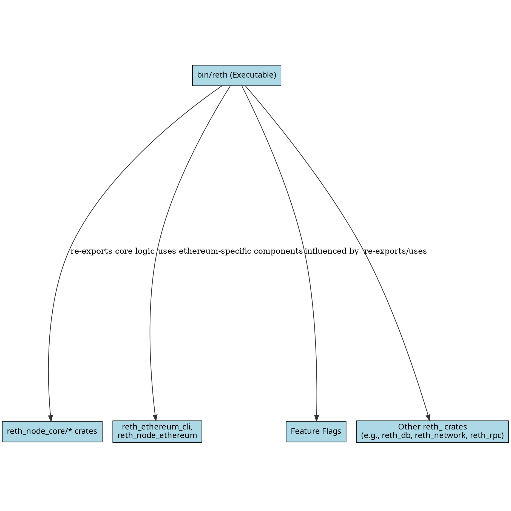
```dot
digraph G {
	rankdir=TD;
	ratio=1.0;
	"bin/reth"->"reth_node_core_crates"[ color="#333333", label="re-exports core logic", penwidth=1.2 ];
	"bin/reth"->"reth_node_specific_crates"[ color="#333333", label="uses ethereum-specific components", penwidth=1.2 ];
	"bin/reth"->"reth_feature_flags"[ color="#333333", label="influenced by", penwidth=1.2 ];
	"bin/reth"->"reth_components"[ color="#333333", label="re-exports/uses", penwidth=1.2 ];
	"bin/reth" [ fillcolor=lightblue, fontname="sans-serif", label="bin/reth (Executable)", shape=box, style=filled ];
	"reth_components" [ fillcolor=lightblue, fontname="sans-serif", label="Other reth_ crates\n(e.g., reth_db, reth_network, reth_rpc)", shape=box, style=filled ];
	"reth_feature_flags" [ fillcolor=lightblue, fontname="sans-serif", label="Feature Flags", shape=box, style=filled ];
	"reth_node_core_crates" [ fillcolor=lightblue, fontname="sans-serif", label="reth_node_core/* crates", shape=box, style=filled ];
	"reth_node_specific_crates" [ fillcolor=lightblue, fontname="sans-serif", label="reth_ethereum_cli,\nreth_node_ethereum", shape=box, style=filled ];

}
```


---

### 节点操作和命令行界面

本节重点介绍如何运行 Reth 节点并与之交互。它将详细介绍 Reth 二进制可执行文件提供的核心功能，包括命令行界面 (CLI) 操作、调试功能和用于性能分析的专用基准测试工具。它还将涵盖所有基于 Reth 的节点 CLI 的通用接口，包括参数解析、节点识别和命令管理。

源码路径：

- `/paradigmxyz/reth/bin`
- `/paradigmxyz/reth/crates/cli`

Reth 节点主要通过 [`reth`](%2Fparadigmxyz%2Freth%2FCargo.toml#L320) 二进制可执行文件进行操作，该二进制可执行文件提供了用于管理 Ethereum 客户端的综合命令行界面 (CLI)。该可执行文件提供核心节点功能、调试工具和专门的基准测试功能。

[`/paradigmxyz/reth/bin`](%2Fparadigmxyz%2Freth%2Fbin) 目录包含主要的 [`reth`](%2Fparadigmxyz%2Freth%2FCargo.toml#L320) 可执行文件，以及专门的基准测试工具，例如用于“大块”场景的 [`reth-bb`](%2Fparadigmxyz%2Freth%2Fbin%2Freth-bb%2FREADME.md#L1) 和用于分析实时同步性能的 [`reth-bench`](%2Fparadigmxyz%2Freth%2FCargo.toml#L323)。 [`reth`](%2Fparadigmxyz%2Freth%2FCargo.toml#L320) 可执行文件充当启动 Ethereum 节点、处理命令行参数解析和提供调试功能的入口点。它从各种 [`reth_`](%2Fparadigmxyz%2Freth%2Fcrates%2Frpc%2Frpc-builder%2Fsrc%2Flib.rs#L875) 板条箱中重新导出模块，以提供广泛的功能，并通过功能标志支持自定义构建。维护 CLI 相关类型的向后兼容性，以确保版本之间的平滑过渡。

所有基于 Reth 的 CLI 的通用接口都是通过 [`RethCli`](%2Fparadigmxyz%2Freth%2Fcrates%2Fcli%2Fcli%2Fsrc%2Flib.rs#L26) 特征建立的，该特征在 [`/paradigmxyz/reth/crates/cli/cli/src/lib.rs`](%2Fparadigmxyz%2Freth%2Fcrates%2Fcli%2Fcli%2Fsrc%2Flib.rs) 中定义。此特征标准化了 CLI 行为，允许一致的参数解析并与 [`CliRunner`](%2Fparadigmxyz%2Freth%2Fbin%2Freth%2Fsrc%2Flib.rs#L214) 集成以管理执行环境。链规范解析（包括创世数据的处理）由 [`/paradigmxyz/reth/crates/cli/cli/src/chainspec.rs`](%2Fparadigmxyz%2Freth%2Fcrates%2Fcli%2Fcli%2Fsrc%2Fchainspec.rs) 中的 [`ChainSpecParser`](%2Fparadigmxyz%2Freth%2Fcrates%2Fcli%2Fcli%2Fsrc%2Fchainspec.rs#L35) 特征管理。

一组广泛的 CLI 命令管理 Reth 节点操作的各个方面。其中包括用于配置和启动节点、管理数据库（例如检查表、查询数据、生成统计数据、修复尝试、迁移存储布局和清除数据）、导入和导出区块链数据（从 RLP 编码文件或 ERA 文件）以及从创世块或 JSONL 状态转储初始化节点的命令。 P2P 网络实用程序还可用于运行引导节点、生成 Enode 标识符和调试 RLPx 连接等任务。维护和验证命令支持数据库修剪、重新执行历史同步验证的块以及管道阶段的管理。此外，还提供了用于为 Reth 数据库表生成模糊测试向量的工具。有关具体命令的更多详细信息，请参阅[Reth CLI 命令参考](#node-operation-and-command-line-interface-reth-cli-command-reference)。

[`/paradigmxyz/reth/crates/cli/runner/src/lib.rs`](%2Fparadigmxyz%2Freth%2Fcrates%2Fcli%2Frunner%2Fsrc%2Flib.rs) 中的 [`CliRunner`](%2Fparadigmxyz%2Freth%2Fbin%2Freth%2Fsrc%2Flib.rs#L214) 框架促进了异步 CLI 命令的执行。该框架管理 Tokio 运行时，处理 [`SIGINT`](%2Fparadigmxyz%2Freth%2Fcrates%2Fcli%2Frunner%2Fsrc%2Flib.rs#L64) 和 [`SIGTERM`](%2Fparadigmxyz%2Freth%2Fcrates%2Fcli%2Frunner%2Fsrc%2Flib.rs#L64) 等操作系统信号以实现正常关闭，并提供 [`TaskExecutor`](%2Fparadigmxyz%2Freth%2Fcrates%2Ftasks%2Fsrc%2Flib.rs#L57) 用于生成后台任务，确保强大的错误和恐慌处理。

基本实用程序模块支持 Reth CLI 应用程序，位于 [`/paradigmxyz/reth/crates/cli/util`](%2Fparadigmxyz%2Freth%2Fcrates%2Fcli%2Futil)。其中包括自定义内存分配器（jemalloc、snmalloc）、协作任务取消机制、安全密钥管理、高级参数解析函数以及用于检测堆栈溢出的特定于平台的信号处理程序。

为了对大块执行进行基准测试，[`/paradigmxyz/reth/bin/reth-bb`](%2Fparadigmxyz%2Freth%2Fbin%2Freth-bb) 中的 [`reth-bb`](%2Fparadigmxyz%2Freth%2Fbin%2Freth-bb%2FREADME.md#L1) 工具通过将来自多个标准块的交易合并到单个大负载中来模拟高 Gas 工作负载。该工具放宽了某些共识验证以适应人为的大块，从而能够在极端条件下进行性能测试。

[`/paradigmxyz/reth/bin/reth-bench`](%2Fparadigmxyz%2Freth%2Fbin%2Freth-bench) 中的 [`reth-bench`](%2Fparadigmxyz%2Freth%2FCargo.toml#L323) 实用程序提供了一个通用框架，用于对 [`reth`](%2Fparadigmxyz%2Freth%2FCargo.toml#L320) 执行客户端的实时同步性能进行基准测试。它模拟 Consensus Layer (CL) 客户端来重放历史区块、测量性能指标并支持 Engine API 交互。该工具还包括生成无效负载以测试拒绝行为和收集 Prometheus 指标以进行详细性能分析的功能。

| 命令          | 类别               | 描述                                                                                                                                                                                                                                                                          |
| :--------------- | :--------------------- | :----------------------------------------------------------------------------------------------------------------------------------------------------------------------------------------------------------------------------------------------------------------------------------- |
| __代码_0__           | 节点运营         | 用于启动 Ethereum 节点的主 Reth CLI 应用程序。                                                                                                                                                                                                                        |
| __代码_0__      | 节点运营         | 启动 Ethereum 节点，并提供数据目录、网络、RPC、事务池、有效负载构建、调试、数据库、修剪、引擎和静态文件的可配置选项。                                                                                                    |
| __代码_0__  | 数据导入/导出     | 下载并提取快照存档以准备数据目录。支持单个存档下载或清单驱动的模块化组件下载以及交互式选择。                                                                                                    |
| __代码_0__        | 数据库管理    | 提供数据库交互实用程序，包括查看统计信息、列出内容、计算校验和、复制、比较、删除/清除表、修复 trie、查看静态文件头、管理设置、检查点以及将数据库迁移到 v2。 |
| __代码_0__       | __学期_0__ 实用程序          | 为 P2P 网络提供调试工具，例如下载块头和块体、RLPx 实用程序、管理引导节点和打印 enode 标识符。                                                                                                                         |
| __代码_0__     | 维护/验证 | 允许运行、删除、转储或展开 Reth 管道的各个阶段。                                                                                                                                                                                              |
| __代码_0__ | 开发/测试    | 为各种数据类型（包括数据库表和 `Compact` 类型）生成测试向量，以用于开发和测试目的。                                                                                                                                                  |


---

#### 核心 Reth 可执行文件和节点管理

本小节将描述 `reth` 二进制文件的核心功能，包括其入口点、参数解析、使用全局分配器和信号处理程序初始化 Ethereum 节点，以及支持自定义构建和运行时行为的扩展模块重新导出和功能标志。

源码路径：

- `/paradigmxyz/reth/bin/reth`
- `/paradigmxyz/reth/bin/reth/src`

[`reth`](%2Fparadigmxyz%2Freth%2FCargo.toml#L320) 二进制可执行文件充当启动和管理 Reth Ethereum 节点的主要入口点。其核心功能围绕命令行参数的解析、初始化基本系统组件以及编排节点的操作生命周期。

执行后，[`reth`](%2Fparadigmxyz%2Freth%2FCargo.toml#L320) 二进制文件首先处理内存分配和信号管理。它初始化一个全局分配器以实现高效的内存使用，并安装一个信号处理程序以优雅地管理分段错误，确保系统稳定性。默认情况下启用调试功能，并配置回溯以在出现运行时错误时提供详细的诊断信息。

命令行参数解析是 [`reth`](%2Fparadigmxyz%2Freth%2FCargo.toml#L320) 的一个基本方面，允许用户配置节点行为的各个方面。 [`Cli`](%2Fparadigmxyz%2Freth%2Fcrates%2Fethereum%2Fcli%2Fsrc%2Finterface.rs#L57) 结构与 [`EthereumChainSpecParser`](%2Fparadigmxyz%2Freth%2Fcrates%2Fethereum%2Fcli%2Fsrc%2Fchainspec.rs#L28) 结合处理用户输入，包括链规范，这对于定义节点将与之交互的 Ethereum 网络至关重要。

[`reth`](%2Fparadigmxyz%2Freth%2FCargo.toml#L320) 可执行文件的一个重要设计原则是其模块化，这是通过广泛的模块重新导出实现的。主库文件 ([`/paradigmxyz/reth/bin/reth/src/lib.rs`](%2Fparadigmxyz%2Freth%2Fbin%2Freth%2Fsrc%2Flib.rs)) 充当中央枢纽，使来自众多底层 [`reth_`](%2Fparadigmxyz%2Freth%2Fcrates%2Frpc%2Frpc-builder%2Fsrc%2Flib.rs#L875) 包（例如 [`reth_node_core`](%2Fparadigmxyz%2Freth%2Fbin%2Freth%2Fsrc%2Flib.rs#L62)、[`reth_ethereum_primitives`](%2Fparadigmxyz%2Freth%2Fbin%2Freth%2Fsrc%2Flib.rs#L129) 和 [`reth_network`](%2Fparadigmxyz%2Freth%2Fbin%2Freth%2Fsrc%2Flib.rs#L158)）的组件通过统一的接口进行访问。这种方法简化了开发并确保随着项目的发展向后兼容。

[`/paradigmxyz/reth/bin/reth/src/lib.rs`](%2Fparadigmxyz%2Freth%2Fbin%2Freth%2Fsrc%2Flib.rs) 中定义的一组全面的功能标志有助于自定义节点的构建和运行时行为。这些标志允许开发人员和操作人员选择不同的内存分配器（例如，[`jemalloc`](%2Fparadigmxyz%2Freth%2Fbin%2Freth%2FCargo.toml#L124)、[`snmalloc`](%2Fparadigmxyz%2Freth%2Fbin%2Freth%2FCargo.toml#L154)）、配置日志记录详细程度、启用 Keccak256 缓存等性能优化，或激活特定的开发工具（例如用于 RPC 调试的 JavaScript 跟踪器）。这种精细控制确保 [`reth`](%2Fparadigmxyz%2Freth%2FCargo.toml#L320) 二进制文件可以根据不同的操作环境和性能要求进行定制。

[`/paradigmxyz/reth/bin/reth/src/cli/mod.rs`](%2Fparadigmxyz%2Freth%2Fbin%2Freth%2Fsrc%2Fcli%2Fmod.rs) 模块专门解决了命令行界面类型的向后兼容性问题，确保移动到其他 crate 的模块仍然可访问，从而防止依赖 [`reth`](%2Fparadigmxyz%2Freth%2FCargo.toml#L320) crate 的 CLI 功能的用户进行重大更改。

最终，[`reth`](%2Fparadigmxyz%2Freth%2FCargo.toml#L320) 二进制文件启动一个 [`EthereumNode`](%2Fparadigmxyz%2Freth%2Fcrates%2Fethereum%2Fnode%2Fsrc%2Fnode.rs#L66) 实例，启动 Ethereum 客户端运行所需的复杂进程，例如网络同步、事务处理和状态管理。然后，节点进入等待状态，优雅地管理其生命周期，直到收到关闭命令。

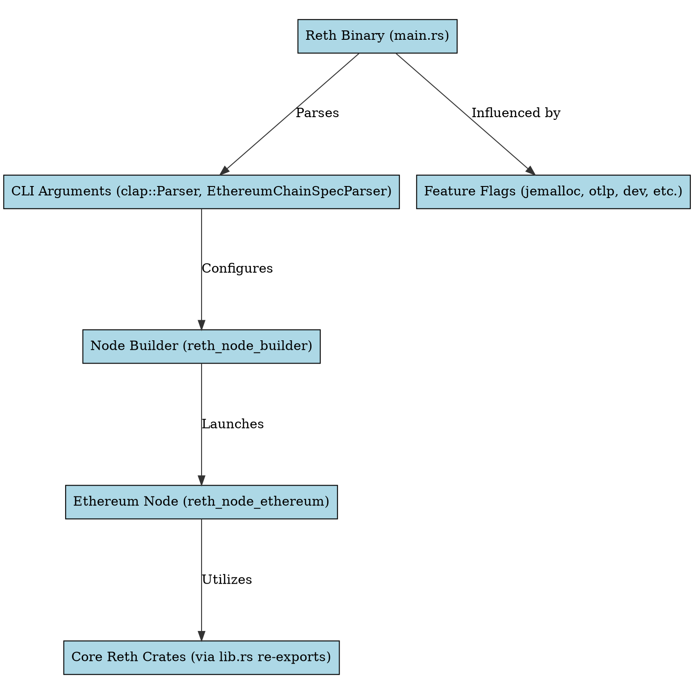
```dot
digraph G {
	overlap=true;
	rankdir=TD;
	ratio=1.0;
	splines=true;
	RethBinary->CliArguments[ color="#333333", label="Parses" ];
	CliArguments->NodeBuilder[ color="#333333", label="Configures" ];
	NodeBuilder->EthereumNode[ color="#333333", label="Launches" ];
	EthereumNode->RethCrates[ color="#333333", label="Utilizes" ];
	RethBinary->FeatureFlags[ color="#333333", label="Influenced by" ];
	CliArguments [ fillcolor=lightblue, label="CLI Arguments (clap::Parser, EthereumChainSpecParser)", shape=box, style=filled ];
	EthereumNode [ fillcolor=lightblue, label="Ethereum Node (reth_node_ethereum)", shape=box, style=filled ];
	FeatureFlags [ fillcolor=lightblue, label="Feature Flags (jemalloc, otlp, dev, etc.)", shape=box, style=filled ];
	NodeBuilder [ fillcolor=lightblue, label="Node Builder (reth_node_builder)", shape=box, style=filled ];
	RethBinary [ fillcolor=lightblue, label="Reth Binary (main.rs)", shape=box, style=filled ];
	RethCrates [ fillcolor=lightblue, label="Core Reth Crates (via lib.rs re-exports)", shape=box, style=filled ];

}
```


---

#### 通用CLI框架和链规范解析

本小节将详细介绍所有基于 Reth 的 CLI 的通用接口，涵盖用于标准化行为的 `RethCli` 特征、使用 `clap` 进行参数解析，以及用于处理区块链规范（包括解析创世数据）的 `ChainSpecParser` 。

源码路径：

- `/paradigmxyz/reth/crates/cli/cli`
- `/paradigmxyz/reth/crates/cli/cli/src`

所有基于 Reth 的命令行界面 (CLI) 的通用框架均由 [`RethCli`](%2Fparadigmxyz%2Freth%2Fcrates%2Fcli%2Fcli%2Fsrc%2Flib.rs#L26) 特征建立，该特征标准化了应用程序行为、参数解析和节点标识。此特征在 [`/paradigmxyz/reth/crates/cli/cli/src/lib.rs`](%2Fparadigmxyz%2Freth%2Fcrates%2Fcli%2Fcli%2Fsrc%2Flib.rs) 中定义，提供了一个一致的接口来管理 CLI 生命周期，从参数解析到运行时环境中命令的执行。它利用 [`clap`](%2Fparadigmxyz%2Freth%2FCargo.toml#L501) 箱进行强大的命令行参数处理，使应用程序能够有效地解析输入。

该框架的一个关键方面是区块链链规范的处理。在 [`/paradigmxyz/reth/crates/cli/cli/src/chainspec.rs`](%2Fparadigmxyz%2Freth%2Fcrates%2Fcli%2Fcli%2Fsrc%2Fchainspec.rs) 中实现的 [`ChainSpecParser`](%2Fparadigmxyz%2Freth%2Fcrates%2Fcli%2Fcli%2Fsrc%2Fchainspec.rs#L35) 特征定义了如何解析和管理特定于链的数据（例如创世配置）。这包括识别预定义的链名称以及从文件路径或直接 JSON 字符串解析创世数据。这种模块化方法确保不同的基于 Reth 的 CLI 可以通过实现通用解析接口轻松支持各种 Ethereum 网络和配置。 [`ChainSpecParser`](%2Fparadigmxyz%2Freth%2Fcrates%2Fcli%2Fcli%2Fsrc%2Fchainspec.rs#L35) 还与 [`clap`](%2Fparadigmxyz%2Freth%2FCargo.toml#L501) 集成，为链相关参数提供描述性帮助消息和默认值。

[`RethCli`](%2Fparadigmxyz%2Freth%2Fcrates%2Fcli%2Fcli%2Fsrc%2Flib.rs#L26) 特征通过与 [`CliRunner`](%2Fparadigmxyz%2Freth%2Fbin%2Freth%2Fsrc%2Flib.rs#L214) 集成进一步促进命令的执行。该运行器负责设置和管理 CLI 命令的执行环境，确保从参数解析到命令执行的简化流程。有关如何构建和管理 CLI 命令的更多详细信息，请参阅 [Reth CLI 命令参考](#node-operation-and-command-line-interface-reth-cli-command-reference) 和 [CLI 运行时执行和任务管理](#node-operation-and-command-line-interface-cli-runtime-execution-and-task-management)。

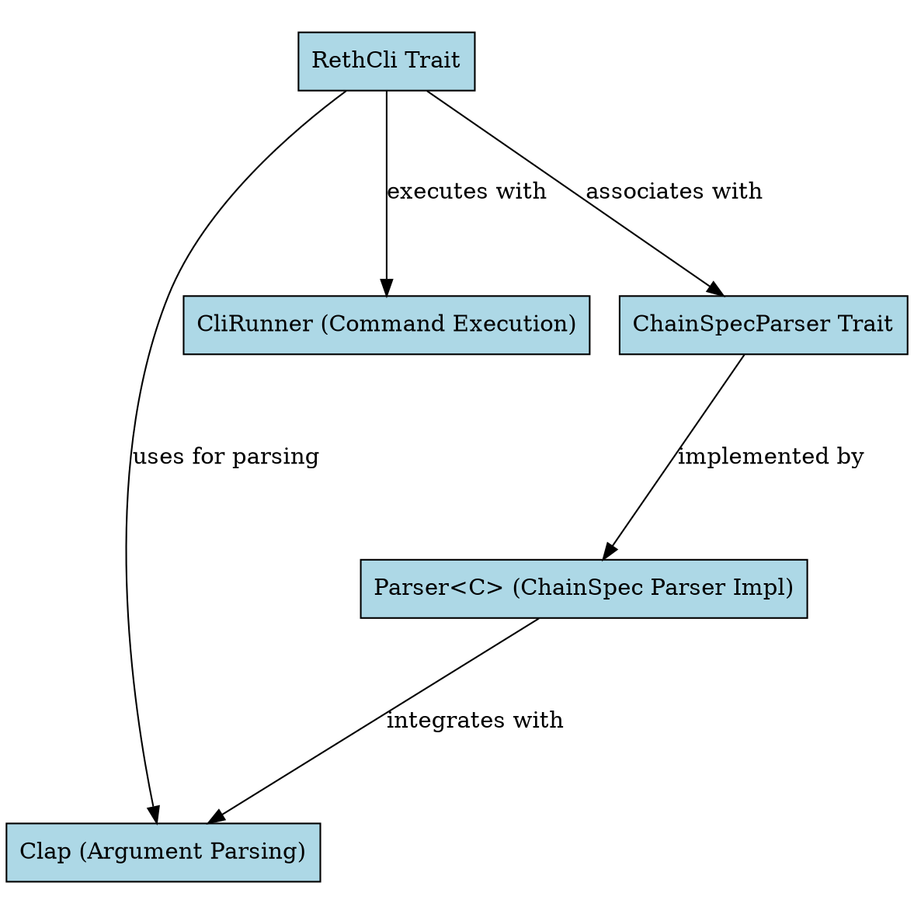
```dot
digraph G {
	rankdir=TD;
	ratio=1.0;
	RethCli->Clap[ label="uses for parsing" ];
	RethCli->CliRunner[ label="executes with" ];
	RethCli->ChainSpecParser[ label="associates with" ];
	ChainSpecParser->ParserImpl[ label="implemented by" ];
	ParserImpl->Clap[ label="integrates with" ];
	ChainSpecParser [ fillcolor=lightblue, label="ChainSpecParser Trait", shape=box, style=filled ];
	Clap [ fillcolor=lightblue, label="Clap (Argument Parsing)", shape=box, style=filled ];
	CliRunner [ fillcolor=lightblue, label="CliRunner (Command Execution)", shape=box, style=filled ];
	ParserImpl [ fillcolor=lightblue, label="Parser<C> (ChainSpec Parser Impl)", shape=box, style=filled ];
	RethCli [ fillcolor=lightblue, label="RethCli Trait", shape=box, style=filled ];

}
```


---

#### Reth CLI 命令参考

本小节将深入介绍广泛的 `reth` CLI 命令集，涵盖节点生命周期和配置、全面的数据库管理工具（检查、查询、维护、统计）、数据导入/导出、各种来源的节点初始化、P2P 网络实用程序以及维护/验证工具（例如修剪和重新执行）。

源码路径：

- `/paradigmxyz/reth/crates/cli/commands`
- `/paradigmxyz/reth/crates/cli/commands/src`

[`reth`](%2Fparadigmxyz%2Freth%2FCargo.toml#L320) 命令行界面 (CLI) 提供了一套全面的工具来管理 Ethereum 节点。这些命令主要组织在 [`/paradigmxyz/reth/crates/cli/commands`](%2Fparadigmxyz%2Freth%2Fcrates%2Fcli%2Fcommands) 目录中，提供从节点操作和配置到详细的数据库管理、数据导入/导出和网络实用程序的功能。

节点生命周期和配置通过主 [`reth node`](%2Fparadigmxyz%2Freth%2FAGENTS.md#L1) 命令进行管理，该命令允许用户配置和启动 Reth 节点。此命令解析与网络、RPC 服务、事务池和调试相关的各种参数。 [`reth config`](%2Fparadigmxyz%2Freth%2FAGENTS.md#L1) 命令（在 [`/paradigmxyz/reth/crates/cli/commands/src/config_cmd.rs`](%2Fparadigmxyz%2Freth%2Fcrates%2Fcli%2Fcommands%2Fsrc%2Fconfig_cmd.rs) 中定义）使用户能够从指定文件或使用默认设置显示节点的配置。常见的命令行参数和环境设置由 [`/paradigmxyz/reth/crates/cli/commands/src/common.rs`](%2Fparadigmxyz%2Freth%2Fcrates%2Fcli%2Fcommands%2Fsrc%2Fcommon.rs) 中的 [`EnvironmentArgs`](%2Fparadigmxyz%2Freth%2Fcrates%2Fcli%2Fcommands%2Fsrc%2Fprune.rs#L2) 处理，它解析数据目录、加载节点配置并初始化数据库和静态文件提供程序，包括一致性检查。

对于全面的数据库管理，[`reth db`](%2Fparadigmxyz%2Freth%2FMakefile#L9) 命令提供了一组子命令。用户可以分别使用 [`reth db list`](%2Fparadigmxyz%2Freth%2FMakefile#L9)、[`reth db get`](%2Fparadigmxyz%2Freth%2FMakefile#L9) 和 [`reth db static-file-header`](%2Fparadigmxyz%2Freth%2Fdocs%2Fvocs%2Fsidebar-cli-reth.ts#L3) 等命令检查数据库表，从 MDBX、RocksDB 或静态文件检索数据，以及查询静态文件头。可通过 [`reth db stats`](%2Fparadigmxyz%2Freth%2FCargo.toml#L320) 进行数据库和静态文件的统计分析。 [`reth db checksum`](%2Fparadigmxyz%2Freth%2Fdocs%2Fvocs%2Fsidebar-cli-reth.ts#L3) 命令支持完整性检查，该命令计算各种数据库组件的校验和，而 [`reth db repair-trie`](%2Fparadigmxyz%2Freth%2Fdocs%2Fvocs%2Fsidebar-cli-reth.ts#L3) 命令则用于验证和修复 Merkle Patricia Trie。数据库维护包括用于复制数据库的 [`reth db copy`](%2Fparadigmxyz%2Freth%2FMakefile#L9)、用于从表或静态文件中删除数据的 [`reth db clear`](%2Fparadigmxyz%2Freth%2FAGENTS.md#L1) 以及用于更新存储布局的 [`reth db migrate-v2`](%2Fparadigmxyz%2Freth%2Fdocs%2Fvocs%2Fsidebar-cli-reth.ts#L3)。可通过 [`reth db prune-checkpoints`](%2Fparadigmxyz%2Freth%2Fdocs%2Fvocs%2Fsidebar-cli-reth.ts#L3) 和 [`reth db stage-checkpoints`](%2Fparadigmxyz%2Freth%2Fdocs%2Fvocs%2Fsidebar-cli-reth.ts#L3) 进行修剪和阶段检查点管理，而 [`reth db settings`](%2Fparadigmxyz%2Freth%2FCONTRIBUTING.md#L1) 允许配置存储选项。这些数据库功能在[数据库抽象层和数据建模](#data-storage-and-retrieval-database-abstraction-layer-and-data-modeling) 和[MDBX 数据库实现和管理](#data-storage-and-retrieval-mdbx-database-implementation-and-management) 中有详细介绍。

数据导入和导出功能也集成到 CLI 中。 [`reth import`](%2Fparadigmxyz%2Freth%2FREADME.md#L1) 命令由 [`/paradigmxyz/reth/crates/cli/commands/src/import.rs`](%2Fparadigmxyz%2Freth%2Fcrates%2Fcli%2Fcommands%2Fsrc%2Fimport.rs) 及其 [`/paradigmxyz/reth/crates/cli/commands/src/import_core.rs`](%2Fparadigmxyz%2Freth%2Fcrates%2Fcli%2Fcommands%2Fsrc%2Fimport_core.rs) 中的核心逻辑驱动，允许将 RLP 编码块从文件导入到数据库中。同样，[`reth import-era`](%2Fparadigmxyz%2Freth%2Fbin%2Freth%2Ftests%2Fit%2Fmain.rs#L5) 可以通过从 ERA 文件导入区块链数据来初始化节点，而 [`reth export-era`](%2Fparadigmxyz%2Freth%2Fbin%2Freth%2Ftests%2Fit%2Fmain.rs#L5)（在 [`/paradigmxyz/reth/crates/cli/commands/src/export_era.rs`](%2Fparadigmxyz%2Freth%2Fcrates%2Fcli%2Fcommands%2Fsrc%2Fexport_era.rs) 中定义）有助于将区块数据导出到 ERA1 文件。来自外部源的节点初始化还包括用于使用创世块 ([`/paradigmxyz/reth/crates/cli/commands/src/init_cmd.rs`](%2Fparadigmxyz%2Freth%2Fcrates%2Fcli%2Fcommands%2Fsrc%2Finit_cmd.rs)) 设置数据库的 [`reth init`](%2Fparadigmxyz%2Freth%2Fbin%2Freth-bb%2Fsrc%2Fevm.rs#L22) 和用于从 JSONL 状态转储进行初始化的 [`reth init-state`](%2Fparadigmxyz%2Freth%2Fbin%2Freth%2Ftests%2Fit%2Fmain.rs#L5)。此外，[`reth dump-genesis`](%2Fparadigmxyz%2Freth%2Fbin%2Freth%2Ftests%2Fit%2Fmain.rs#L5) 命令 ([`/paradigmxyz/reth/crates/cli/commands/src/dump_genesis.rs`](%2Fparadigmxyz%2Freth%2Fcrates%2Fcli%2Fcommands%2Fsrc%2Fdump_genesis.rs)) 输出创世块的 JSON 配置。

P2P 网络实用程序可在 [`reth p2p`](%2Fparadigmxyz%2Freth%2FAGENTS.md#L1) 命令下使用。其中包括用于运行仅发现引导节点的 [`reth p2p bootnode`](%2Fparadigmxyz%2Freth%2Fcrates%2Fnet%2Fdiscv4%2Fsrc%2Flib.rs#L2154)、用于生成 Enode 标识符的 [`reth p2p enode`](%2Fparadigmxyz%2Freth%2Fcrates%2Fnet%2Fdiscv5%2Fsrc%2Flib.rs#L4) 和用于 RLPx 调试的 [`reth p2p rlpx`](%2Fparadigmxyz%2Freth%2FCargo.toml#L320)，例如 ping 节点和执行 ECIES 加密握手。这些工具在 [对等发现机制（Discv4、Discv5 和 DNS）](#networking-and-peer-to-peer-communication-peer-discovery-mechanisms-discv4-discv5-and-dns) 和 [RLPx ECIES 安全传输协议](#networking-and-peer-to-peer-communication-rlpx-ecies-secure-transport-protocol) 中进行了进一步详细阐述。

为了维护和验证，[`reth prune`](%2Fparadigmxyz%2Freth%2FCargo.toml#L320) 命令管理数据库修剪，支持将数据迁移到静态文件并压缩数据库。 [`reth re-execute`](%2Fparadigmxyz%2Freth%2Fbin%2Freth%2Ftests%2Fit%2Fmain.rs#L5) 命令通过重新执行数据库中的块来验证历史同步。 [`reth stage`](%2Fparadigmxyz%2Freth%2FREADME.md#L1) 子命令提供对同步管道阶段的细粒度控制，允许用户运行、删除、转储或展开特定阶段。测试向量生成主要用于模糊测试和数据完整性，由 [`reth test-vectors compact`](%2Fparadigmxyz%2Freth%2Fcrates%2Fcli%2Fcommands%2Fsrc%2Ftest_vectors%2Fmod.rs#L5) 和 [`reth test-vectors tables`](%2Fparadigmxyz%2Freth%2Fcrates%2Fcli%2Fcommands%2Fsrc%2Ftest_vectors%2Fmod.rs#L6) 支持，尽管它们通常用于开发和测试环境。

| 命令 | 子命令 | 描述 | 源文件 |
| :---: | :---: | :--- | :---: |
| __代码_0__ |  | 启动具有可配置网络、RPC、数据库和其他设置的 Reth 节点。 | __代码_0__ |
| __代码_0__ |  | 显示默认节点配置或指定的配置文件。 | __代码_0__ |
| __代码_0__ | __代码_0__ | 列出 MDBX 和 RocksDB 的数据库表统计信息，包括条目计数和大小。 | __代码_0__、__代码_1__ |
|  | __代码_0__ | 列出带有过滤选项的指定数据库表的内容。 | __代码_0__、__代码_1__ |
|  | __代码_0__ | 从 MDBX、RocksDB 或静态文件中检索并显示特定键的内容。 | __代码_0__、__代码_1__ |
|  | __代码_0__ | 计算并显示数据库表或静态文件段的校验和。 | __代码_0__、__代码_1__ |
|  | __代码_0__ | 将 MDBX 数据库复制到新位置，并可选择压缩。 | __代码_0__、__代码_1__ |
|  | __代码_0__ | 删除指定数据库表或静态文件段中的所有条目。 | __代码_0__、__代码_1__ |
|  | __代码_0__ | 验证并可选择修复 Merkle Patricia Trie 中的不一致之处。 | __代码_0__、__代码_1__ |
|  | __代码_0__ | 读取并显示静态文件段的标头元数据。 | __代码_0__、__代码_1__ |
|  | __代码_0__ | 将存储从 v1（仅限 MDBX）迁移到 v2（静态文件 + RocksDB）。 | __代码_0__、__代码_1__ |
|  | __代码_0__ | 查看或设置各种数据库段的修剪检查点。 | __代码_0__、__代码_1__ |
|  | __代码_0__ | 查看或设置不同管道阶段的阶段检查点。 | __代码_0__、__代码_1__ |
| __代码_0__ |  | 将一个或多个文件中的 RLP 编码块导入数据库。 | __代码_0__、__代码_1__ |
| __代码_0__ |  | 从 ERA 文件（本地目录或远程 URL）导入块数据。 | __代码_0__ |
| __代码_0__ |  | 将块数据从数据库导出到 ERA1 文件中。 | __代码_0__ |
| __代码_0__ |  | 使用链规范定义的创世块初始化数据库。 | __代码_0__ |
| __代码_0__ |  | 从 JSONL 状态转储文件初始化数据库状态。 | __代码_0__ |
| __代码_0__ |  | 打印指定链的创世块 JSON 配置。 | __代码_0__ |
| __代码_0__ | __代码_0__、__代码_1__ | 从 P2P 网络下载特定的块头或块体。 | __代码_0__ |
|  | __代码_0__ | 提供 RLPx 协议实用程序，例如 ping 节点。 | __代码_0__、__代码_1__ |
|  | __代码_0__ | 为 P2P 网络引导启动仅发现的引导节点。 | __代码_0__、__代码_1__ |
|  | __代码_0__ | 打印给定密钥的 enode 标识符。 | __代码_0__、__代码_1__ |
| __代码_0__ |  | 根据配置的修剪模式从数据库中修剪旧数据。 | __代码_0__ |
| __代码_0__ |  | 并行重新执行数据库中的块以验证历史同步的正确性。 | __代码_0__ |
| __代码_0__ | __代码_0__ | 为指定的块范围运行单个管道阶段。 | __代码_0__、__代码_1__ |
|  | __代码_0__ | 删除阶段的表并重置其在数据库中的检查点。 | __代码_0__、__代码_1__ |
|  | __代码_0__ | 将阶段的数据从某个范围转储到新数据库中。 | __代码_0__、__代码_1__ |
|  | __代码_0__ | 从数据库中展开特定的块范围，删除其数据。 | __代码_0__、__代码_1__ |
| __代码_0__ | __代码_0__ | 为数据库表生成测试向量。 | __代码_0__、__代码_1__ |
|  | __代码_0__ | 生成或验证 `Compact` 编解码器类型的测试向量。 | __代码_0__、__代码_1__ |


---

#### CLI 运行时执行和任务管理

本小节将解释执行异步 CLI 命令的框架，包括 `CliRunner` 如何管理 Tokio 运行时、处理操作系统信号以正常关闭、提供 `TaskExecutor` 用于生成后台任务，并确保强大的错误和恐慌处理。

源码路径：

- `/paradigmxyz/reth/crates/cli/runner`
- `/paradigmxyz/reth/crates/cli/runner/src`

Reth 命令行界面 (CLI) 使用一个框架来执行异步命令、管理其生命周期以及处理正常关闭。该框架主要由 [`CliRunner`](%2Fparadigmxyz%2Freth%2Fbin%2Freth%2Fsrc%2Flib.rs#L214) 结构体现，抽象了运行时管理、信号处理和任务协调的复杂性。

[`CliRunner`](%2Fparadigmxyz%2Freth%2Fbin%2Freth%2Fsrc%2Flib.rs#L214) 管理 Tokio 运行时，这对于有效处理异步操作至关重要。它提供了执行命令的机制，包括那些受 CPU 限制的命令，通过利用 Tokio 的 [`spawn_blocking`](%2Fparadigmxyz%2Freth%2FAGENTS.md#L154) 来防止主事件循环停止。 [`CliRunner`](%2Fparadigmxyz%2Freth%2Fbin%2Freth%2Fsrc%2Flib.rs#L214) 配置为拦截操作系统信号，例如 [`SIGINT`](%2Fparadigmxyz%2Freth%2Fcrates%2Fcli%2Frunner%2Fsrc%2Flib.rs#L64) (Ctrl-C) 和 [`SIGTERM`](%2Fparadigmxyz%2Freth%2Fcrates%2Fcli%2Frunner%2Fsrc%2Flib.rs#L64)，从而能够正常终止长时间运行的操作。在关闭期间，它会协调生成的任务的有序停止，使它们能够在可配置的超时时间内完成工作。

对于后台任务，[`CliContext`](%2Fparadigmxyz%2Freth%2Fbin%2Freth%2Fsrc%2Flib.rs#L214) 结构提供了 [`TaskExecutor`](%2Fparadigmxyz%2Freth%2Fcrates%2Ftasks%2Fsrc%2Flib.rs#L57)，允许命令生成其他异步任务。该框架还包含强大的错误和恐慌处理功能，确保错误传播，并且在关键后台服务遇到恐慌时 CLI 立即退出。这种设计优先考虑异步执行，同时为阻塞操作提供显式支持，保持系统稳定性和响应能力。

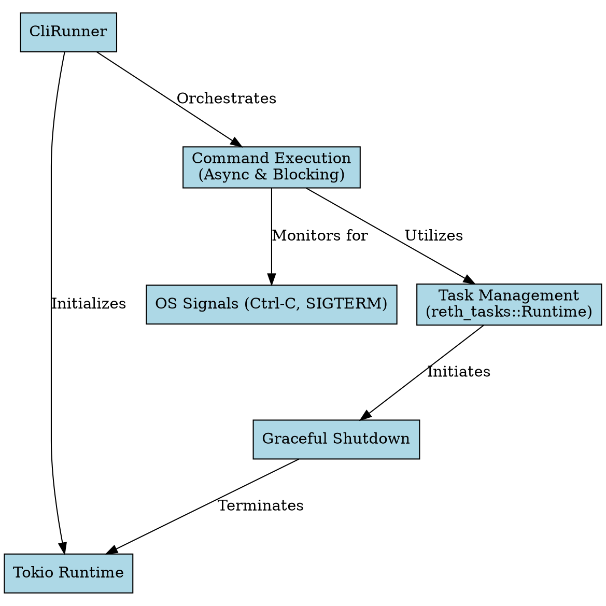
```dot
digraph G {
	rankdir=TD;
	ratio=1.0;
	CliRunner->TokioRuntime[ label="Initializes" ];
	CliRunner->CommandExecution[ label="Orchestrates" ];
	CommandExecution->OSSignals[ label="Monitors for" ];
	CommandExecution->TaskManagement[ label="Utilizes" ];
	TaskManagement->GracefulShutdown[ label="Initiates" ];
	GracefulShutdown->TokioRuntime[ label="Terminates" ];
	CliRunner [ fillcolor=lightblue, label="CliRunner", shape=box, style=filled ];
	CommandExecution [ fillcolor=lightblue, label="Command Execution\n(Async & Blocking)", shape=box, style=filled ];
	GracefulShutdown [ fillcolor=lightblue, label="Graceful Shutdown", shape=box, style=filled ];
	OSSignals [ fillcolor=lightblue, label="OS Signals (Ctrl-C, SIGTERM)", shape=box, style=filled ];
	TaskManagement [ fillcolor=lightblue, label="Task Management\n(reth_tasks::Runtime)", shape=box, style=filled ];
	TokioRuntime [ fillcolor=lightblue, label="Tokio Runtime", shape=box, style=filled ];

}
```


---

#### CLI 实用模块

本小节将介绍跨 Reth CLI 应用程序使用的基本实用程序模块，例如自定义内存分配器配置（jemalloc、snmalloc）、协作任务取消机制、安全密钥管理、高级参数解析函数以及用于检测和调试堆栈溢出的特定于平台的信号处理程序。

源码路径：

- `/paradigmxyz/reth/crates/cli/util`

Reth 的命令行界面 (CLI) 应用程序依赖于一组实用程序模块来处理常见功能，例如内存管理、进程控制、安全凭证处理和强大的输入解析。这些实用程序集中在 [`/paradigmxyz/reth/crates/cli/util`](%2Fparadigmxyz%2Freth%2Fcrates%2Fcli%2Futil) 中。

Reth CLI 应用程序的内存分配可以通过 [`allocator`](%2Fparadigmxyz%2Freth%2Fcrates%2Fcli%2Futil%2Fsrc%2Flib.rs#L16) 模块进行自定义，该模块在 [`/paradigmxyz/reth/crates/cli/util/src/allocator.rs`](%2Fparadigmxyz%2Freth%2Fcrates%2Fcli%2Futil%2Fsrc%2Fallocator.rs) 中定义。该模块允许在 Unix 系统上选择高性能分配器，例如 [`jemalloc`](%2Fparadigmxyz%2Freth%2Fbin%2Freth%2FCargo.toml#L124) 或 [`snmalloc`](%2Fparadigmxyz%2Freth%2Fbin%2Freth%2FCargo.toml#L154)，如果未配置自定义选项，则回退到标准系统分配器。这种功能门控方法可以在不改变核心应用程序逻辑的情况下进行性能调整，并且还可以与内存分析工具集成。

协作任务取消由位于 [`/paradigmxyz/reth/crates/cli/util/src/cancellation.rs`](%2Fparadigmxyz%2Freth%2Fcrates%2Fcli%2Futil%2Fsrc%2Fcancellation.rs) 的 [`cancellation`](%2Fparadigmxyz%2Freth%2Fcrates%2Fcli%2Futil%2Fsrc%2Flib.rs#L17) 模块管理。该模块提供了跨线程发送信号和检测取消请求的机制，允许 CLI 应用程序正常关闭或中断长时间运行的操作。其设计利用原子操作来确保线程安全和效率。

[`secp256k1::SecretKey`](%2Fparadigmxyz%2Freth%2Fcrates%2Fnet%2Fdns%2Fsrc%2Flib.rs#L28) 实例的安全管理由 [`load_secret_key`](%2Fparadigmxyz%2Freth%2Fcrates%2Fcli%2Futil%2Fsrc%2Flib.rs#L20) 模块处理，该模块位于 [`/paradigmxyz/reth/crates/cli/util/src/load_secret_key.rs`](%2Fparadigmxyz%2Freth%2Fcrates%2Fcli%2Futil%2Fsrc%2Fload_secret_key.rs) 中。该实用程序有助于生成新的密钥、从文件系统加载现有密钥以及从各种字符串格式（包括十六进制表示形式）解析它们。它包括针对文件系统操作和解码问题的全面错误处理。

[`parsers`](%2Fparadigmxyz%2Freth%2Fcrates%2Fcli%2Futil%2Fsrc%2Flib.rs#L24) 模块在 [`/paradigmxyz/reth/crates/cli/util/src/parsers.rs`](%2Fparadigmxyz%2Freth%2Fcrates%2Fcli%2Futil%2Fsrc%2Fparsers.rs) 中定义，提供了一组函数，用于将字符串输入从 CLI 参数转换为结构化数据类型。这包括解析持续时间（支持秒和毫秒）、解析套接字地址、解释区块链标识符（例如块哈希或数字）以及将人类可读的 Ether 值转换为其 Wei 等值。这些解析器增强了 CLI 输入处理的用户友好性和稳健性。

为了调试严重错误，特别是堆栈溢出，Reth 在 [`sigsegv_handler`](%2Fparadigmxyz%2Freth%2Fbin%2Freth%2Fsrc%2Fmain.rs#L21) 模块的 [`/paradigmxyz/reth/crates/cli/util/src/sigsegv_handler.rs`](%2Fparadigmxyz%2Freth%2Fcrates%2Fcli%2Futil%2Fsrc%2Fsigsegv_handler.rs) 处包含一个特定于平台的 [`SIGSEGV`](%2Fparadigmxyz%2Freth%2Fcrates%2Fcli%2Futil%2Fsrc%2Fsigsegv_handler.rs#L35) 处理程序。该处理程序主要用于类 Unix 系统，旨在捕获分段错误并直接向标准错误提供详细的堆栈跟踪。它采用替代信号堆栈来确保即使主程序堆栈损坏，处理程序也可以执行。此外，它还结合了检测和压缩堆栈跟踪中的循环模式的逻辑，这是无限递归的常见指标。

| 模块 | 文件路径 | 描述 |
| :----: | :-------- | :---------- |
| __代码_0__ | __代码_0__ | 提供自定义内存分配器实现，在 Unix 系统上优先考虑 `jemalloc` 或 `snmalloc`，并支持 `tracy-allocator` 分析。 |
| __代码_0__ | __代码_0__ | 为协作任务取消提供线程安全原语，包括 `CancellationToken` 和 `CancellationGuard`。 |
| __代码_0__ | __代码_0__ | 处理加密密钥的加载和生成，以及文件系统和解码问题的错误处理。 |
| __代码_0__ | __代码_0__ | 包含用于解析各种 CLI 输入类型的实用函数，例如持续时间、`BlockHashOrNumber`、`SocketAddr` 和 Ether 值。 |
| __代码_0__ | __代码_0__ | 在支持的 Unix 系统上安装 SIGSEGV 信号处理程序，以在出现分段错误时打印堆栈跟踪。 |


---

#### Reth 大块基准测试工具 (`reth-bb`)

本小节将描述用于对“大块”进行基准测试的专用 `reth-bb` 工具，解释它如何模拟高 Gas 工作负载、自定义 EVM 配置和有效负载处理、放宽共识验证以及允许合并交易的多段执行。

源码路径：

- `/paradigmxyz/reth/bin/reth-bb`
- `/paradigmxyz/reth/bin/reth-bb/src`

[`reth-bb`](%2Fparadigmxyz%2Freth%2Fbin%2Freth-bb%2FREADME.md#L1) 工具是一个专门的 [`reth`](%2Fparadigmxyz%2Freth%2FCargo.toml#L320) 节点，旨在对“大块”的性能进行基准测试，“大块”模拟 Ethereum 网络上的高 Gas 工作负载。与标准 [`reth`](%2Fparadigmxyz%2Freth%2FCargo.toml#L320) 节点不同，[`reth-bb`](%2Fparadigmxyz%2Freth%2Fbin%2Freth-bb%2FREADME.md#L1) 不适用于生产环境，因为它放宽了多个共识验证以适应其处理的人工块结构。

为了模拟高 Gas 工作负载，[`reth-bb`](%2Fparadigmxyz%2Freth%2Fbin%2Freth-bb%2FREADME.md#L1) 将来自多个连续标准块的交易合并为单个更大的有效负载。此过程创建的区块的 Gas 使用量明显高于典型的 Ethereum 区块。然后，该工具可以以多段方式执行这些合成的“大块”，其中每个段代表合并的有效负载中的原始块。这种方法允许 [`reth-bb`](%2Fparadigmxyz%2Freth%2Fbin%2Freth-bb%2FREADME.md#L1) 准确地模拟每个原始块的执行上下文，即使它们是作为较大单元的一部分进行处理的。

[`reth-bb`](%2Fparadigmxyz%2Freth%2Fbin%2Freth-bb%2FREADME.md#L1) 的架构通过引入自定义 EVM 配置和有效负载处理来扩展标准 [`reth-ethereum-cli`](%2Fparadigmxyz%2Freth%2FCargo.toml#L358)。它利用 [`BbEvmConfig`](%2Fparadigmxyz%2Freth%2Fbin%2Freth-bb%2Fsrc%2Fmain.rs#L12)（在 [`/paradigmxyz/reth/bin/reth-bb/src/evm_config.rs`](%2Fparadigmxyz%2Freth%2Fbin%2Freth-bb%2Fsrc%2Fevm_config.rs) 中定义）动态管理 EVM 环境，在大块内每个段的边界交换配置和执行上下文。这包括禁用基本费用验证和重新播种块哈希，以实现跨段的正确 [`BLOCKHASH`](%2Fparadigmxyz%2Freth%2Fbin%2Freth-bb%2Fsrc%2Fevm.rs#L48) 操作码解析。

关键组件是 [`BbEngineValidator`](%2Fparadigmxyz%2Freth%2Fbin%2Freth-bb%2Fsrc%2Fmain.rs#L76)（在 [`/paradigmxyz/reth/bin/reth-bb/src/main.rs`](%2Fparadigmxyz%2Freth%2Fbin%2Freth-bb%2Fsrc%2Fmain.rs) 中找到），它将 [`BigBlockData<ExecutionData>`](%2Fparadigmxyz%2Freth%2Fcrates%2Fengine%2Fprimitives%2Fsrc%2Fmessage.rs#L190) 有效负载（代表一个大块）转换为单个 [`SealedBlock<Block>`](%2Fparadigmxyz%2Freth%2Fbin%2Freth-bb%2Fsrc%2Fmain.rs#L82)。该验证器将 [`BigBlockData`](%2Fparadigmxyz%2Freth%2Fbin%2Freth-bb%2FREADME.md#L11) 解构为其组成部分 [`ExecutionData`](%2Fparadigmxyz%2Freth%2Fbin%2Freth-bb%2Fsrc%2Fmain.rs#L43) 项，将它们合并，并调整块头以创建 [`reth`](%2Fparadigmxyz%2Freth%2FCargo.toml#L320) 执行引擎可以处理的统一“大块”。这种机制确保合并后的区块保持正确的状态和交易顺序，尽管其具有合成性质。跨段的实际执行由 [`BbBlockExecutor`](%2Fparadigmxyz%2Freth%2Fbin%2Freth-bb%2Fsrc%2Fevm.rs#L176) （位于 [`/paradigmxyz/reth/bin/reth-bb/src/evm.rs`](%2Fparadigmxyz%2Freth%2Fbin%2Freth-bb%2Fsrc%2Fevm.rs)）管理，它包装了标准 [`EthBlockExecutor`](%2Fparadigmxyz%2Freth%2Fbin%2Freth-bb%2Fsrc%2Fevm.rs#L6) 来编排段感知执行，累积 Gas 使用量并聚合来自所有已处理段的请求。

使用 [`reth-bb`](%2Fparadigmxyz%2Freth%2Fbin%2Freth-bb%2FREADME.md#L1) 的工作流程涉及使用 [`reth-bench generate-big-block`](%2Fparadigmxyz%2Freth%2Fbin%2Freth-bb%2FREADME.md#L27) 命令生成这些大块（请参阅 [Reth 通用基准测试工具 (`reth-bench`)](#node-operation-and-command-line-interface-reth-general-benchmarking-tool-reth-bench)），运行 [`reth-bb`](%2Fparadigmxyz%2Freth%2Fbin%2Freth-bb%2FREADME.md#L1) 节点，然后使用它重播生成的有效负载[`reth-bench replay-payloads`](%2Fparadigmxyz%2Freth%2Fbin%2Freth-bb%2FREADME.md#L27)。 [`--reth-new-payload`](%2Fparadigmxyz%2Freth%2Fbin%2Freth-bb%2FREADME.md#L67) 标志确保使用自定义 [`reth_newPayload`](%2Fparadigmxyz%2Freth%2Fbin%2Freth-bb%2FREADME.md#L11) 端点，这对于处理 [`BigBlockData`](%2Fparadigmxyz%2Freth%2Fbin%2Freth-bb%2FREADME.md#L11) 和启用多段执行至关重要。

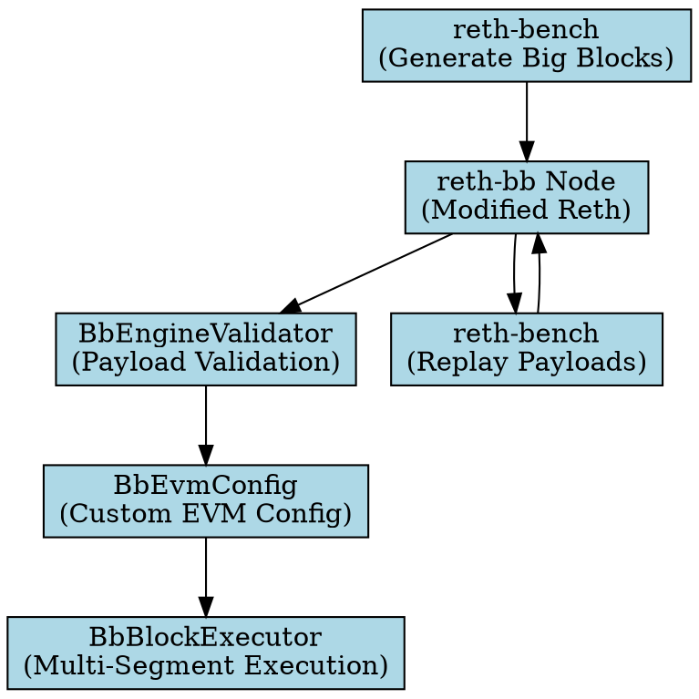
```dot
digraph G {
	rankdir=TD;
	ratio=1.0;
	"reth-bench (Generate Big Blocks)"->"reth-bb Node";
	"reth-bb Node"->"BbEngineValidator";
	"BbEngineValidator"->"BbEvmConfig";
	"BbEvmConfig"->"BbBlockExecutor";
	"reth-bench (Replay Payloads)"->"reth-bb Node";
	"reth-bb Node"->"reth-bench (Replay Payloads)";
	"BbBlockExecutor" [ fillcolor=lightblue, label="BbBlockExecutor\n(Multi-Segment Execution)", shape=box, style=filled ];
	"BbEngineValidator" [ fillcolor=lightblue, label="BbEngineValidator\n(Payload Validation)", shape=box, style=filled ];
	"BbEvmConfig" [ fillcolor=lightblue, label="BbEvmConfig\n(Custom EVM Config)", shape=box, style=filled ];
	"reth-bb Node" [ fillcolor=lightblue, label="reth-bb Node\n(Modified Reth)", shape=box, style=filled ];
	"reth-bench (Generate Big Blocks)" [ fillcolor=lightblue, label="reth-bench\n(Generate Big Blocks)", shape=box, style=filled ];
	"reth-bench (Replay Payloads)" [ fillcolor=lightblue, label="reth-bench\n(Replay Payloads)", shape=box, style=filled ];

}
```


---

#### Reth 通用基准测试工具 (`reth-bench`)

本小节将详细介绍用于对实时同步性能进行基准测试的 `reth-bench` 实用程序，涵盖其对 Engine API 交互（new-payload-fcu、new-payload-only）的模拟、受控等待模式、RPC 配置、分析支持、使用 CSV 和 Prometheus 进行输出分析，以及用于性能比较和可视化的相关 Python 脚本。

源码路径：

- `/paradigmxyz/reth/bin/reth-bench`
- `/paradigmxyz/reth/bin/reth-bench/src`
- `/paradigmxyz/reth/bin/reth-bench/scripts`

[`reth-bench`](%2Fparadigmxyz%2Freth%2FCargo.toml#L323) 实用程序位于 [`/paradigmxyz/reth/bin/reth-bench`](%2Fparadigmxyz%2Freth%2Fbin%2Freth-bench) 中，它是一个综合工具，用于对 [`reth`](%2Fparadigmxyz%2Freth%2FCargo.toml#L320) 执行客户端的实时同步性能进行基准测试。它通过模拟 Consensus Layer (CL) 客户端、重放历史区块并测量关键性能指标（例如延迟、每个区块使用的 Gas 以及每秒使用的计算 Gas）来实现这一目标。

该工具提供了几个子命令来模拟各种 Engine API 交互，这对于 CL/EL 通信至关重要。在 [`/paradigmxyz/reth/bin/reth-bench/src/bench/new_payload_fcu.rs`](%2Fparadigmxyz%2Freth%2Fbin%2Freth-bench%2Fsrc%2Fbench%2Fnew_payload_fcu.rs) 中实现的 [`new-payload-fcu`](%2Fparadigmxyz%2Freth%2Fbin%2Freth-bench%2FREADME.md#L32) 子命令通过在 [`engine_newPayload`](%2Fparadigmxyz%2Freth%2Fbin%2Freth-bench%2FREADME.md#L32) 和 [`engine_forkchoiceUpdated`](%2Fparadigmxyz%2Freth%2Fbin%2Freth-bench%2FREADME.md#L32) 调用之间交替来模拟典型的实时同步行为。更简单的 [`new-payload-only`](%2Fparadigmxyz%2Freth%2Fbin%2Freth-bench%2FREADME.md#L38) 子命令位于 [`/paradigmxyz/reth/bin/reth-bench/src/bench/new_payload_only.rs`](%2Fparadigmxyz%2Freth%2Fbin%2Freth-bench%2Fsrc%2Fbench%2Fnew_payload_only.rs) 中，专门关注 [`engine_newPayload`](%2Fparadigmxyz%2Freth%2Fbin%2Freth-bench%2FREADME.md#L32) 调用。为了更精细地控制负载提交，[`send-payload`](%2Fparadigmxyz%2Freth%2Fbin%2Freth-bench%2Fsrc%2Fbench%2Fmod.rs#L49) 子命令允许发送从 JSON 块输入构造的 [`engine_newPayload`](%2Fparadigmxyz%2Freth%2Fbin%2Freth-bench%2FREADME.md#L32) 请求，支持不同的 Engine API 版本（V3、V4、V5）。为了测试 Engine API 的稳健性，[`send-invalid-payload`](%2Fparadigmxyz%2Freth%2Fbin%2Freth-bench%2Fsrc%2Fbench%2Fmod.rs#L73) 子命令可以生成并发送故意格式错误的 [`engine_newPayload`](%2Fparadigmxyz%2Freth%2Fbin%2Freth-bench%2FREADME.md#L32) 请求。对于高级压力测试，在 [`/paradigmxyz/reth/bin/reth-bench/src/bench/generate_big_block.rs`](%2Fparadigmxyz%2Freth%2Fbin%2Freth-bench%2Fsrc%2Fbench%2Fgenerate_big_block.rs) 中实现的 [`generate-big-block`](%2Fparadigmxyz%2Freth%2Fbin%2Freth-bb%2FREADME.md#L35) 通过合并真实区块中的交易来合成大区块，以模拟高 Gas 工作负载。

[`reth-bench`](%2Fparadigmxyz%2Freth%2FCargo.toml#L323) 提供受控等待模式来准确模拟现实世界的条件。 [`new-payload-fcu`](%2Fparadigmxyz%2Freth%2Fbin%2Freth-bench%2FREADME.md#L32) 命令可以使用固定的 [`--wait-time`](%2Fparadigmxyz%2Freth%2Fbin%2Freth-bench%2FREADME.md#L35) 或 [`--wait-for-persistence`](%2Fparadigmxyz%2Freth%2Fbin%2Freth-bench%2FREADME.md#L42) 机制，该机制利用 [`reth_subscribePersistedBlock`](%2Fparadigmxyz%2Freth%2Fbin%2Freth-bench%2FREADME.md#L36) 订阅来确保在继续操作之前保留块。 RPC 配置灵活，允许用户指定外部 RPC 端点（[`--rpc-url`](%2Fparadigmxyz%2Freth%2Fbin%2Freth-bench%2FREADME.md#L64)）来获取区块数据，并配置基准节点的 Engine API 端点（[`--engine-rpc-url`](%2Fparadigmxyz%2Freth%2Fbin%2Freth-bench%2FREADME.md#L44)）。

该工具支持 [`reth`](%2Fparadigmxyz%2Freth%2FCargo.toml#L320) 客户端的详细分析。提供了使用特定配置文件（[`profiling`](%2Fparadigmxyz%2Freth%2FCargo.toml#L293)、[`maxperf`](%2Fparadigmxyz%2Freth%2FMakefile#L242)）和功能（[`jemalloc-prof`](%2Fparadigmxyz%2Freth%2Fbin%2Freth%2FCargo.toml#L131)、[`snmalloc-native,asm-keccak,min-trace-logs`](%2Fparadigmxyz%2Freth%2Fbin%2Freth-bench%2FREADME.md#L89)）编译 [`reth`](%2Fparadigmxyz%2Freth%2FCargo.toml#L320) 的建议，以方便使用外部工具进行 CPU 和内存分析。对于输出分析，[`reth-bench`](%2Fparadigmxyz%2Freth%2FCargo.toml#L323) 在控制台中显示结果，并可以使用 [`--output`](%2Fparadigmxyz%2Freth%2FMakefile#L130) 标志以 CSV 格式保存气体使用基准。它还与 Prometheus 集成，以便在使用 [`--metrics`](%2Fparadigmxyz%2Freth%2Fetc%2Flighthouse.yml#L49) 配置 [`reth`](%2Fparadigmxyz%2Freth%2FCargo.toml#L320) 时收集和分析指标。位于 [`/paradigmxyz/reth/bin/reth-bench/src/bench/metrics_scraper.rs`](%2Fparadigmxyz%2Freth%2Fbin%2Freth-bench%2Fsrc%2Fbench%2Fmetrics_scraper.rs) 中的 [`MetricsScraper`](%2Fparadigmxyz%2Freth%2Fbin%2Freth-bench%2Fsrc%2Fbench%2Fmetrics_scraper.rs#L30) 连接到 Prometheus 端点，以在每个处理块之后抓取性能指标，例如执行持续时间和状态根计算。

为了进一步帮助性能分析，[`/paradigmxyz/reth/bin/reth-bench/scripts`](%2Fparadigmxyz%2Freth%2Fbin%2Freth-bench%2Fscripts) 目录包含 Python 脚本。具体来说，[`/paradigmxyz/reth/bin/reth-bench/scripts/compare_newpayload_latency.py`](%2Fparadigmxyz%2Freth%2Fbin%2Freth-bench%2Fscripts%2Fcompare_newpayload_latency.py) 会比较 [`reth-bench`](%2Fparadigmxyz%2Freth%2FCargo.toml#L323) 生成的两个 [`combined_latency.csv`](%2Fparadigmxyz%2Freth%2Fbin%2Freth-bench%2Fsrc%2Fbench%2Foutput.rs#L15) 文件。此脚本分析 [`total_latency`](%2Fparadigmxyz%2Freth%2Fbin%2Freth-bench%2Fsrc%2Fbench%2Foutput.rs#L90) 和 [`gas_used`](%2Fparadigmxyz%2Freth%2Fcrates%2Fengine%2Fprimitives%2Fsrc%2Fmessage.rs#L219) 指标，通过延迟百分比变化的直方图、延迟随时间变化的线图和 Gas 吞吐量图表来可视化性能变化。这样可以对不同 [`reth`](%2Fparadigmxyz%2Freth%2FCargo.toml#L320) 版本或配置之间的性能进行详细比较，从而帮助识别回归或改进。

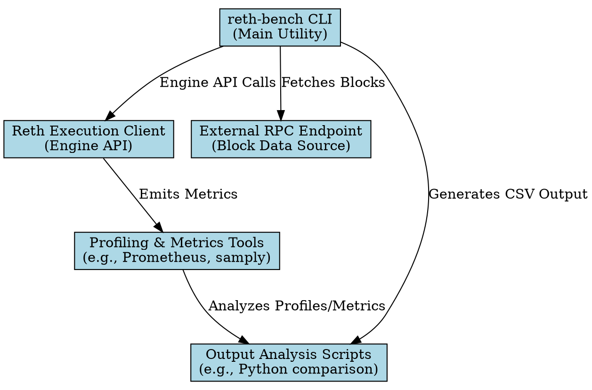
```dot
digraph G {
	rankdir=TD;
	ratio=1.0;
	"reth-bench CLI"->"Reth Execution Client"[ label="Engine API Calls" ];
	"reth-bench CLI"->"External RPC Endpoint"[ label="Fetches Blocks" ];
	"Reth Execution Client"->"Profiling & Metrics Tools"[ label="Emits Metrics" ];
	"reth-bench CLI"->"Output Analysis Scripts"[ label="Generates CSV Output" ];
	"Profiling & Metrics Tools"->"Output Analysis Scripts"[ label="Analyzes Profiles/Metrics" ];
	"External RPC Endpoint" [ fillcolor=lightblue, label="External RPC Endpoint\n(Block Data Source)", shape=box, style=filled ];
	"Output Analysis Scripts" [ fillcolor=lightblue, label="Output Analysis Scripts\n(e.g., Python comparison)", shape=box, style=filled ];
	"Profiling & Metrics Tools" [ fillcolor=lightblue, label="Profiling & Metrics Tools\n(e.g., Prometheus, samply)", shape=box, style=filled ];
	"Reth Execution Client" [ fillcolor=lightblue, label="Reth Execution Client\n(Engine API)", shape=box, style=filled ];
	"reth-bench CLI" [ fillcolor=lightblue, label="reth-bench CLI\n(Main Utility)", shape=box, style=filled ];

}
```


---

### 区块链核心组件

本节深入研究使 Reth 能够充当 Ethereum 客户端的基本组件。它将涵盖核心共识验证逻辑、EVM 操作、块执行和构建以及事务生命周期的管理，包括摄取、验证和池化。它还将涉及缓存系统的优化块处理、执行见证生成和本地块挖掘。

源码路径：

- `/paradigmxyz/reth/crates/consensus`
- `/paradigmxyz/reth/crates/engine`
- `/paradigmxyz/reth/crates/evm`
- `/paradigmxyz/reth/crates/transaction-pool`

Reth 的核心区块链组件将其身份定义为 Ethereum 客户端，涵盖共识、执行和数据管理的基本流程。从本质上讲，Reth 实现了 Ethereum 块的通用验证逻辑，确保遵守协议规则和硬分叉规范。这包括对块头、执行前条件和执行后结果的检查，以及详细的错误报告，以诊断 [`/paradigmxyz/reth/crates/consensus/common`](%2Fparadigmxyz%2Freth%2Fcrates%2Fconsensus%2Fcommon) 和 [`/paradigmxyz/reth/crates/consensus/consensus`](%2Fparadigmxyz%2Freth%2Fcrates%2Fconsensus%2Fconsensus) 中协议的偏差。出于测试目的，调试客户端模拟共识层，从 Etherscan 或 RPC 端点等外部源获取执行负载，并分派 [`ForkchoiceUpdated`](%2Fparadigmxyz%2Freth%2Fcrates%2Fengine%2Fprimitives%2Fsrc%2Fevent.rs#L24) 和新的负载消息以测试 [`/paradigmxyz/reth/crates/consensus/debug-client`](%2Fparadigmxyz%2Freth%2Fcrates%2Fconsensus%2Fdebug-client) 中的执行客户端。

Ethereum 虚拟机 (EVM) 是 Reth 操作的核心，具有用于配置 EVM 操作、执行事务和组装块的框架。该框架支持并行事务处理并聚合多个块的执行结果，包括状态更改、事务收据和 EIP-7685 请求。 EVM 执行的错误处理（特别是状态和存储 trie 操作）也被集中化，以确保 [`/paradigmxyz/reth/crates/evm`](%2Fparadigmxyz%2Freth%2Fcrates%2Fevm) 的稳健性。

事务管理由事务池处理，该事务池协调事务的生命周期，从摄取和验证到分类到子池（待处理、停放、blob）及其最终的块包含排序。这包括对 EIP-4844 blob 存储的支持，以及 [`/paradigmxyz/reth/crates/transaction-pool`](%2Fparadigmxyz%2Freth%2Fcrates%2Ftransaction-pool) 中的池限制、费用参数和本地事务处理的配置。

块处理通过多级缓存系统进行优化。该系统包括用于帐户、存储和字节码数据的内存缓存，旨在跨顺序块重用缓存状态，以提高 [`/paradigmxyz/reth/crates/engine/execution-cache`](%2Fparadigmxyz%2Freth%2Fcrates%2Fengine%2Fexecution-cache) 的性能。当遇到无效块时，Reth 提供重新执行它们、生成执行见证并分析状态差异以在 [`/paradigmxyz/reth/crates/engine/invalid-block-hooks`](%2Fparadigmxyz%2Freth%2Fcrates%2Fengine%2Finvalid-block-hooks) 中进行调试的机制。对于开发和测试，本地引擎服务通过可配置模式（即时、间隔、触发）促进区块挖掘，并生成 Ethereum 有效负载属性，适应 [`/paradigmxyz/reth/crates/engine/local`](%2Fparadigmxyz%2Freth%2Fcrates%2Fengine%2Flocal) 中的各种硬分叉规范。

与 Ethereum Engine API 的交互是通过一组核心原语进行管理的，这些原语定义了配置、错误处理、事件管理以及跟踪 forkchoice 状态，以便与 [`/paradigmxyz/reth/crates/engine/primitives`](%2Fparadigmxyz%2Freth%2Fcrates%2Fengine%2Fprimitives) 中的信标共识引擎进行通信。引擎的树逻辑负责链编排、块下载、状态持久性以及使用稀疏尝试和 [`/paradigmxyz/reth/crates/engine/tree`](%2Fparadigmxyz%2Freth%2Fcrates%2Fengine%2Ftree) 中的并行执行计算 Ethereum 状态根的复杂过程。此外，还有一套实用程序可用于处理和转换 Beacon Engine API 消息流，这对于测试和模拟 [`/paradigmxyz/reth/crates/engine/util`](%2Fparadigmxyz%2Freth%2Fcrates%2Fengine%2Futil) 中的区块链重组特别有用。

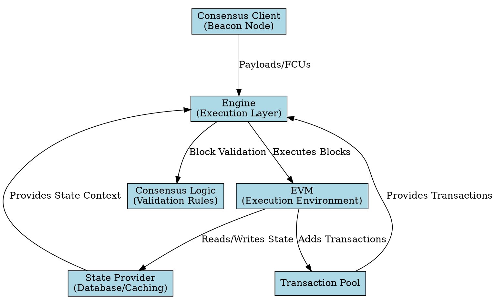
```dot
digraph G {
	rankdir=TD;
	ratio=1.0;
	"Consensus Client"->"Engine"[ label="Payloads/FCUs" ];
	"Engine"->"EVM"[ label="Executes Blocks" ];
	"EVM"->"State Provider"[ label="Reads/Writes State" ];
	"EVM"->"Transaction Pool"[ label="Adds Transactions" ];
	"Engine"->"Consensus Logic"[ label="Block Validation" ];
	"Transaction Pool"->"Engine"[ label="Provides Transactions" ];
	"State Provider"->"Engine"[ label="Provides State Context" ];
	"Consensus Client" [ fillcolor=lightblue, label="Consensus Client\n(Beacon Node)", shape=box, style=filled ];
	"Consensus Logic" [ fillcolor=lightblue, label="Consensus Logic\n(Validation Rules)", shape=box, style=filled ];
	"EVM" [ fillcolor=lightblue, label="EVM\n(Execution Environment)", shape=box, style=filled ];
	"Engine" [ fillcolor=lightblue, label="Engine\n(Execution Layer)", shape=box, style=filled ];
	"State Provider" [ fillcolor=lightblue, label="State Provider\n(Database/Caching)", shape=box, style=filled ];
	"Transaction Pool" [ fillcolor=lightblue, label="Transaction Pool", shape=box, style=filled ];

}
```


---

#### 核心共识验证逻辑

本小节将深入研究确保 Ethereum 块遵守协议规则和硬分叉规范的常见验证逻辑和特征，包括标头、执行前和执行后检查，以及详细的错误报告和测试实现。

源码路径：

- `/paradigmxyz/reth/crates/consensus`
- `/paradigmxyz/reth/crates/consensus/common`
- `/paradigmxyz/reth/crates/consensus/consensus`

Reth 实现通用验证逻辑和特征，以确保 Ethereum 块遵守协议规则和硬分叉规范。这包括块处理不同阶段的检查：标头验证、执行前主体验证和执行后状态验证。

核心共识功能是通过位于 [`/paradigmxyz/reth/crates/consensus/consensus`](%2Fparadigmxyz%2Freth%2Fcrates%2Fconsensus%2Fconsensus) 中的一组分层特征来定义的。 [`HeaderValidator`](%2Fparadigmxyz%2Freth%2Fcrates%2Fethereum%2Fconsensus%2Fsrc%2Flib.rs#L20) 特征定义了验证块头的方法，无论是独立的还是与父块头相关的。这保证了区块链的结构完整性和顺序正确性。对此进行扩展，[`Consensus`](%2Fparadigmxyz%2Freth%2Fdocs%2Frepo%2Flayout.md#L94) 特征添加了块体执行前验证的方法，在实际处理任何交易之前验证块体的摘要字段（例如交易根和 ommer 哈希）与块头一致。 [`FullConsensus`](%2Fparadigmxyz%2Freth%2Fcrates%2Fnode%2Fapi%2Fsrc%2Fnode.rs#L6) 特征通过包含执行后验证进一步扩展了这些功能，该验证检查块执行的结果（例如 [`gas_used`](%2Fparadigmxyz%2Freth%2Fcrates%2Fengine%2Fprimitives%2Fsrc%2Fmessage.rs#L219) 和 [`receipt_root`](%2Fparadigmxyz%2Freth%2Fcrates%2Fengine%2Ftree%2Fsrc%2Ftree%2Fpayload_processor%2Freceipt_root_task.rs#L73)）是否与块标头中指定的承诺保持一致。

全面的 [`ConsensusError`](%2Fparadigmxyz%2Freth%2Fcrates%2Fconsensus%2Fconsensus%2Fsrc%2Flib.rs#L490) 枚举提供各种验证失败的详细报告。该枚举允许对问题进行精细识别，从不正确的气体限制到状态根的差异，并有助于区分瞬时错误和永久错误。这种详细的错误报告对于调试和节点的稳健运行至关重要。

适用于不同 Ethereum 硬分叉的特定验证规则集中在 [`/paradigmxyz/reth/crates/consensus/common`](%2Fparadigmxyz%2Freth%2Fcrates%2Fconsensus%2Fcommon) 中。这些规则包括检查 [`gas_used`](%2Fparadigmxyz%2Freth%2Fcrates%2Fengine%2Fprimitives%2Fsrc%2Fmessage.rs#L219) 和 [`gas_limit`](%2Fparadigmxyz%2Freth%2Fcrates%2Fnode%2Fcore%2Fsrc%2Fcli%2Fconfig.rs#L28)、伦敦硬分叉的 [`base_fee_per_gas`](%2Fparadigmxyz%2Freth%2Fbin%2Freth-bench%2Fsrc%2Fbench%2Fsend_invalid_payload%2Finvalidation.rs#L22) 是否存在、上海提款的正确性以及坎昆的 [`blob_gas_used`](%2Fparadigmxyz%2Freth%2Fcrates%2Fconsensus%2Fconsensus%2Fsrc%2Flib.rs#L377)。它还根据标头值处理块体根的验证，以及与 Blob 事务的 EIP-4844 相关的各种检查。这些通用验证功能确保了与不断发展的 Ethereum 协议的一致性和合规性。

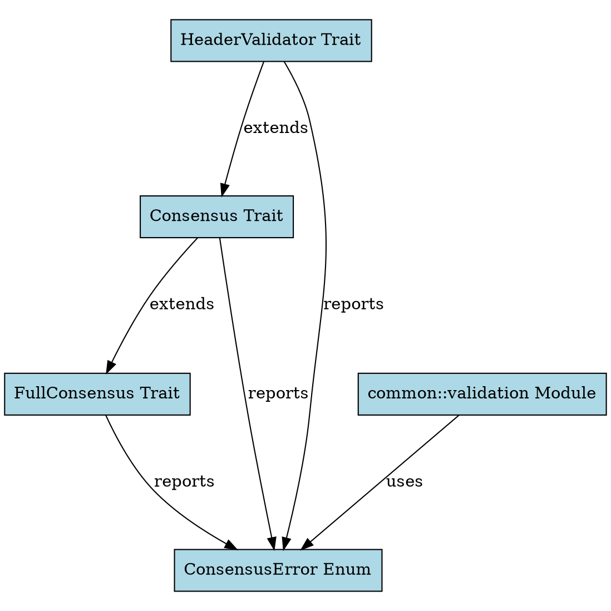
```dot
digraph G {
	overlap=true;
	rankdir=TD;
	ratio=1.0;
	splines=true;
	HeaderValidator->Consensus[ label="extends" ];
	Consensus->FullConsensus[ label="extends" ];
	Consensus->ConsensusError[ label="reports" ];
	FullConsensus->ConsensusError[ label="reports" ];
	HeaderValidator->ConsensusError[ label="reports" ];
	CommonValidation->ConsensusError[ label="uses" ];
	CommonValidation [ fillcolor=lightblue, label="common::validation Module", shape=box, style=filled ];
	Consensus [ fillcolor=lightblue, label="Consensus Trait", shape=box, style=filled ];
	ConsensusError [ fillcolor=lightblue, label="ConsensusError Enum", shape=box, style=filled ];
	FullConsensus [ fillcolor=lightblue, label="FullConsensus Trait", shape=box, style=filled ];
	HeaderValidator [ fillcolor=lightblue, label="HeaderValidator Trait", shape=box, style=filled ];

}
```


---

#### 调试共识客户端以进行 Execution Layer 测试

本小节将描述用于模拟共识层的调试客户端，解释它如何从 Etherscan 或 RPC 端点等外部提供商获取执行负载，并将 `ForkchoiceUpdated` 和 `new_payload` 消息发送到测试执行客户端。

源码路径：

- `/paradigmxyz/reth/crates/consensus/debug-client`

调试客户端旨在模拟共识层以测试执行客户端，从而无需完整的共识节点即可进行开发和验证。此模拟是通过从外部提供程序获取执行有效负载并使用它们将 [`ForkchoiceUpdated`](%2Fparadigmxyz%2Freth%2Fcrates%2Fengine%2Fprimitives%2Fsrc%2Fevent.rs#L24) (FCU) 和 [`new_payload`](%2Fparadigmxyz%2Freth%2Fcrates%2Fe2e-test-utils%2Fsrc%2Fnode.rs#L136) 消息发送到执行客户端来实现的。

[`/paradigmxyz/reth/crates/consensus/debug-client/src/client.rs`](%2Fparadigmxyz%2Freth%2Fcrates%2Fconsensus%2Fdebug-client%2Fsrc%2Fclient.rs) 中的 [`DebugConsensusClient`](%2Fparadigmxyz%2Freth%2Fcrates%2Fnode%2Fbuilder%2Fsrc%2Flaunch%2Fdebug.rs#L8) 协调此模拟。它利用 [`PayloadProvider`](%2Fparadigmxyz%2Freth%2Fcrates%2Fnode%2Fbuilder%2Fsrc%2Flaunch%2Fdebug.rs#L8) 特征来抽象执行负载的来源，允许各种外部服务提供块数据。此特征的当前实现包括 [`/paradigmxyz/reth/crates/consensus/debug-client/src/providers/etherscan.rs`](%2Fparadigmxyz%2Freth%2Fcrates%2Fconsensus%2Fdebug-client%2Fsrc%2Fproviders%2Fetherscan.rs) 中的 [`EtherscanBlockProvider`](%2Fparadigmxyz%2Freth%2Fcrates%2Fnode%2Fbuilder%2Fsrc%2Flaunch%2Fdebug.rs#L8) 和 [`/paradigmxyz/reth/crates/consensus/debug-client/src/providers/rpc.rs`](%2Fparadigmxyz%2Freth%2Fcrates%2Fconsensus%2Fdebug-client%2Fsrc%2Fproviders%2Frpc.rs) 中的 [`RpcBlockProvider`](%2Fparadigmxyz%2Freth%2Fcrates%2Fnode%2Fbuilder%2Fsrc%2Flaunch%2Fdebug.rs#L8)。 [`EtherscanBlockProvider`](%2Fparadigmxyz%2Freth%2Fcrates%2Fnode%2Fbuilder%2Fsrc%2Flaunch%2Fdebug.rs#L8) 直接从 Etherscan API 获取区块数据，而 [`RpcBlockProvider`](%2Fparadigmxyz%2Freth%2Fcrates%2Fnode%2Fbuilder%2Fsrc%2Flaunch%2Fdebug.rs#L8) 从标准 RPC 端点检索区块。两个提供程序都支持单块检索和新块的连续订阅，将原始数据转换为 [`DebugConsensusClient`](%2Fparadigmxyz%2Freth%2Fcrates%2Fnode%2Fbuilder%2Fsrc%2Flaunch%2Fdebug.rs#L8) 可以处理的通用 [`ExecutionData`](%2Fparadigmxyz%2Freth%2Fbin%2Freth-bb%2Fsrc%2Fmain.rs#L43) 格式。

收到有效负载后，客户端将 [`new_payload`](%2Fparadigmxyz%2Freth%2Fcrates%2Fe2e-test-utils%2Fsrc%2Fnode.rs#L136) 消息发送到执行客户端。然后，它根据最近的区块历史记录计算 [`safe_block_hash`](%2Fparadigmxyz%2Freth%2Fcrates%2Fstorage%2Fstorage-api%2Fsrc%2Fblock_id.rs#L126) 和 [`finalized_block_hash`](%2Fparadigmxyz%2Freth%2Fcrates%2Fstorage%2Fstorage-api%2Fsrc%2Fblock_id.rs#L131)，这对于构建 [`ForkchoiceState`](%2Fparadigmxyz%2Freth%2Fdocs%2Fcrates%2Fnetwork.md#L71) 至关重要。该状态随后通过 [`fork_choice_updated`](%2Fparadigmxyz%2Freth%2Fcrates%2Fengine%2Fprimitives%2Fsrc%2Fmessage.rs#L368) 消息发送到执行客户端，有效模拟共识层在指导执行客户端链进程中的作用。在 [`/paradigmxyz/reth/crates/consensus/debug-client/src/client.rs`](%2Fparadigmxyz%2Freth%2Fcrates%2Fconsensus%2Fdebug-client%2Fsrc%2Fclient.rs) 中使用环形缓冲区 ([`AllocRingBuffer`](%2Fparadigmxyz%2Freth%2Fcrates%2Fconsensus%2Fdebug-client%2Fsrc%2Fclient.rs#L4)) 可有效管理这些最近的块哈希值，以进行 [`safe`](%2Fparadigmxyz%2Freth%2Fcrates%2Fengine%2Ftree%2Fsrc%2Ftree%2Fmetrics.rs#L139) 和 [`finalized`](%2Fparadigmxyz%2Freth%2Fcrates%2Fengine%2Ftree%2Fsrc%2Ftree%2Fmetrics.rs#L141) 块确定。

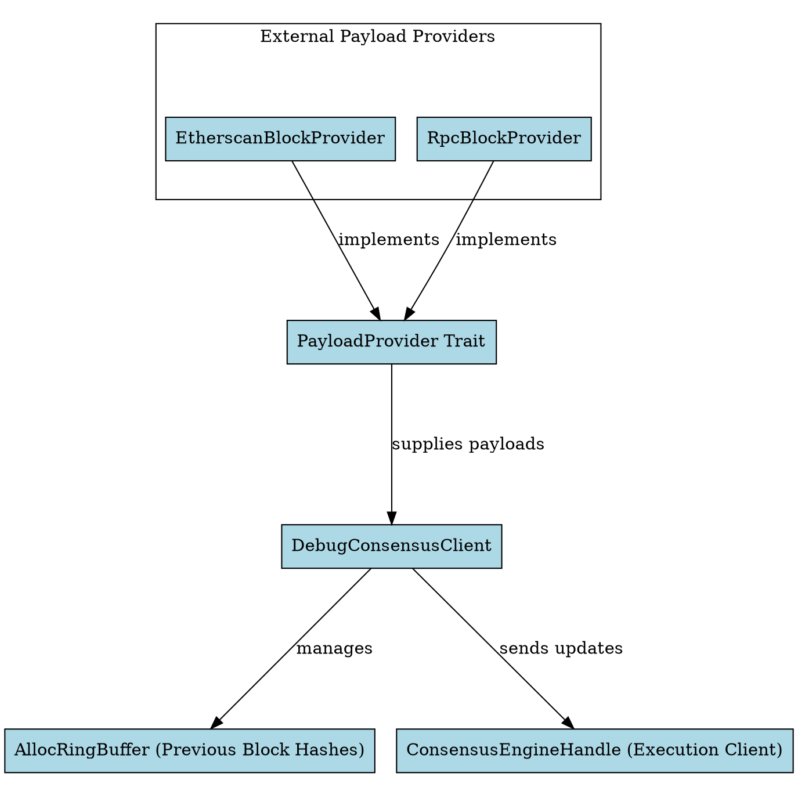
```dot
digraph G {
	rankdir=TD;
	ratio=1.0;
	"EtherscanBlockProvider"->"PayloadProvider Trait"[ label="implements" ];
	"RpcBlockProvider"->"PayloadProvider Trait"[ label="implements" ];
	"PayloadProvider Trait"->"DebugConsensusClient"[ label="supplies payloads" ];
	"DebugConsensusClient"->"AllocRingBuffer"[ label="manages" ];
	"DebugConsensusClient"->"ConsensusEngineHandle"[ label="sends updates" ];
	subgraph cluster_providers {
	label="External Payload Providers";
	"EtherscanBlockProvider" [ fillcolor=lightblue, label="EtherscanBlockProvider", shape=box, style=filled ];
	"RpcBlockProvider" [ fillcolor=lightblue, label="RpcBlockProvider", shape=box, style=filled ];

}
;
	"AllocRingBuffer" [ fillcolor=lightblue, label="AllocRingBuffer (Previous Block Hashes)", shape=box, style=filled ];
	"ConsensusEngineHandle" [ fillcolor=lightblue, label="ConsensusEngineHandle (Execution Client)", shape=box, style=filled ];
	"DebugConsensusClient" [ fillcolor=lightblue, shape=box, style=filled ];
	"PayloadProvider Trait" [ fillcolor=lightblue, shape=box, style=filled ];

}
```


---

#### EVM 配置和块执行

本小节将详细介绍 EVM 的核心功能，包括用于设置 EVM 环境、执行事务、组装块以及管理执行结果和状态更改的 `ConfigureEvm` 特征，并支持并行事务处理。

源码路径：

- `/paradigmxyz/reth/crates/evm`
- `/paradigmxyz/reth/crates/evm/evm`

Reth 中的 Ethereum 虚拟机 (EVM) 的核心功能集中在配置 EVM 环境、执行事务、组装块和管理执行结果。这主要是由 [`ConfigureEvm`](%2Fparadigmxyz%2Freth%2Fbin%2Freth-bb%2Fsrc%2Fevm.rs#L91) 特征促进的，它充当客户端内这些操作的统一接口。

[`/paradigmxyz/reth/crates/evm/evm/src/lib.rs`](%2Fparadigmxyz%2Freth%2Fcrates%2Fevm%2Fevm%2Fsrc%2Flib.rs) 中定义的 [`ConfigureEvm`](%2Fparadigmxyz%2Freth%2Fbin%2Freth-bb%2Fsrc%2Fevm.rs#L91) 特征对于设置 EVM 至关重要。它提供了创建 EVM 环境（[`evm_env`](%2Fparadigmxyz%2Freth%2Fcrates%2Fevm%2Fevm%2Fsrc%2Flib.rs#L220)、[`next_evm_env`](%2Fparadigmxyz%2Freth%2Fcrates%2Fevm%2Fevm%2Fsrc%2Flib.rs#L237))、执行上下文（[`context_for_block`](%2Fparadigmxyz%2Freth%2Fcrates%2Fevm%2Fevm%2Fsrc%2Flib.rs#L244)、[`context_for_next_block`](%2Fparadigmxyz%2Freth%2Fcrates%2Fevm%2Fevm%2Fsrc%2Flib.rs#L251)) 以及将事务转换为 EVM 兼容格式的方法([`tx_env`](%2Fparadigmxyz%2Freth%2Fcrates%2Fevm%2Fevm%2Fsrc%2Flib.rs#L258))。此特征还充当工厂，用于创建 [`BlockExecutor`](%2Fparadigmxyz%2Freth%2Fbin%2Freth-bb%2Fsrc%2Fevm.rs#L14) 实例来处理整个块和 [`BlockBuilder`](%2Fparadigmxyz%2Freth%2Fcrates%2Fevm%2Fevm%2Fsrc%2Fexecute.rs#L329) 实例来构造新块。例如， [`builder_for_next_block`](%2Fparadigmxyz%2Freth%2Fcrates%2Fevm%2Fevm%2Fsrc%2Flib.rs#L410) 是一个高级帮助程序，它结合了几个步骤来为新块构造准备 [`BlockBuilder`](%2Fparadigmxyz%2Freth%2Fcrates%2Fevm%2Fevm%2Fsrc%2Fexecute.rs#L329)。这种方法确保了一种灵活且可扩展的方式来定义不同的 EVM 配置，而无需更改核心执行逻辑。

块执行和组装由不同的组件处理。在 [`/paradigmxyz/reth/crates/evm/evm/src/execute.rs`](%2Fparadigmxyz%2Freth%2Fcrates%2Fevm%2Fevm%2Fsrc%2Fexecute.rs) 中指定的 [`Executor`](%2Fparadigmxyz%2Freth%2Fcrates%2Fevm%2Fevm%2Fsrc%2Fexecute.rs#L34) 特征定义了用于执行块的接口，包括处理单个事务和管理状态更改。 [`BasicBlockExecutor`](%2Fparadigmxyz%2Freth%2Fcrates%2Fevm%2Fevm%2Fsrc%2Flib.rs#L29) 是一个具体实现，它使用 [`ConfigureEvm`](%2Fparadigmxyz%2Freth%2Fbin%2Freth-bb%2Fsrc%2Fevm.rs#L91) 工厂为块创建执行器。一旦执行交易并记录状态更改，[`BlockAssembler`](%2Fparadigmxyz%2Freth%2Fcrates%2Fevm%2Fevm%2Fsrc%2Flib.rs#L208) 特征（也在 [`/paradigmxyz/reth/crates/evm/evm/src/execute.rs`](%2Fparadigmxyz%2Freth%2Fcrates%2Fevm%2Fevm%2Fsrc%2Fexecute.rs) 中）将获取此输出并构造一个完整的块，处理使用的气体、收据根和日志绽放等字段。由 [`BasicBlockBuilder`](%2Fparadigmxyz%2Freth%2Fcrates%2Fevm%2Fevm%2Fsrc%2Flib.rs#L20) 实现的 [`BlockBuilder`](%2Fparadigmxyz%2Freth%2Fcrates%2Fevm%2Fevm%2Fsrc%2Fexecute.rs#L329) 特征提供了更高级别的抽象，可以协调事务的执行并利用 [`BlockAssembler`](%2Fparadigmxyz%2Freth%2Fcrates%2Fevm%2Fevm%2Fsrc%2Flib.rs#L208) 来完成区块​​。

Reth 还支持并行事务处理。 [`ConfigureEngineEvm`](%2Fparadigmxyz%2Freth%2Fcrates%2Fevm%2Fevm%2Fsrc%2Fengine.rs#L8) 特征在 [`/paradigmxyz/reth/crates/evm/evm/src/engine.rs`](%2Fparadigmxyz%2Freth%2Fcrates%2Fevm%2Fevm%2Fsrc%2Fengine.rs) 中定义，扩展了 [`ConfigureEvm`](%2Fparadigmxyz%2Freth%2Fbin%2Freth-bb%2Fsrc%2Fevm.rs#L91) 功能以有效处理交易有效负载。它提供了专门用于并行处理的构造 EVM 环境和上下文的方法，并且最重要的是，返回 [`ExecutableTxIterator`](%2Fparadigmxyz%2Freth%2Fcrates%2Fevm%2Fevm%2Fsrc%2Fengine.rs#L122) 来并行处理事务。 [`ConvertTx`](%2Fparadigmxyz%2Freth%2Fcrates%2Fevm%2Fevm%2Fsrc%2Fengine.rs#L29) 特征将原始交易抽象为可执行形式的转换，从而允许并行解码或签名恢复。为了管理事务迭代器中的潜在变化，[`EitherIter<L, R>`](%2Fparadigmxyz%2Freth%2Fcrates%2Fevm%2Fevm%2Fsrc%2Fengine.rs#L142) 结构体包装了 [`Either<L, R>`](%2Fparadigmxyz%2Freth%2Fcrates%2Fevm%2Fevm%2Fsrc%2Fengine.rs#L142) 以提供透明的并行和顺序迭代，以适应不同类型的事务列表和转换器。

执行后，[`ExecutionOutcome<T>`](%2Fparadigmxyz%2Freth%2Fcrates%2Fevm%2Fexecution-types%2Fsrc%2Fexecution_outcome.rs#L67)（在 [`/paradigmxyz/reth/crates/evm/execution-types/src/execution_outcome.rs`](%2Fparadigmxyz%2Freth%2Fcrates%2Fevm%2Fexecution-types%2Fsrc%2Fexecution_outcome.rs) 中定义）聚合并管理结果，包括状态更改（来自 [`revm`](%2Fparadigmxyz%2Freth%2FCargo.toml#L437) 捆绑包）、交易收据和 EIP-7685 请求。此结构提供了访问执行后数据的统一方法，例如 [`state`](%2Fparadigmxyz%2Freth%2Fcrates%2Ftasks%2Fsrc%2Fpool.rs#L320) 更改、[`accounts_iter`](%2Fparadigmxyz%2Freth%2Fcrates%2Fevm%2Fexecution-types%2Fsrc%2Fexecution_outcome.rs#L179) 和 [`receipts`](%2Fparadigmxyz%2Freth%2Fbin%2Freth-bb%2Fsrc%2Fevm.rs#L541)。 EVM 执行的错误处理集中在 [`/paradigmxyz/reth/crates/evm/execution-errors/src/lib.rs`](%2Fparadigmxyz%2Freth%2Fcrates%2Fevm%2Fexecution-errors%2Fsrc%2Flib.rs) 中，它重新导出与状态和存储 trie 操作相关的特定错误类型，确保整个系统的错误报告一致。有关更多详细信息，请参阅 [EVM 执行错误处理和 Trie 操作](#core-blockchain-components-evm-execution-error-handling-and-trie-operations)。

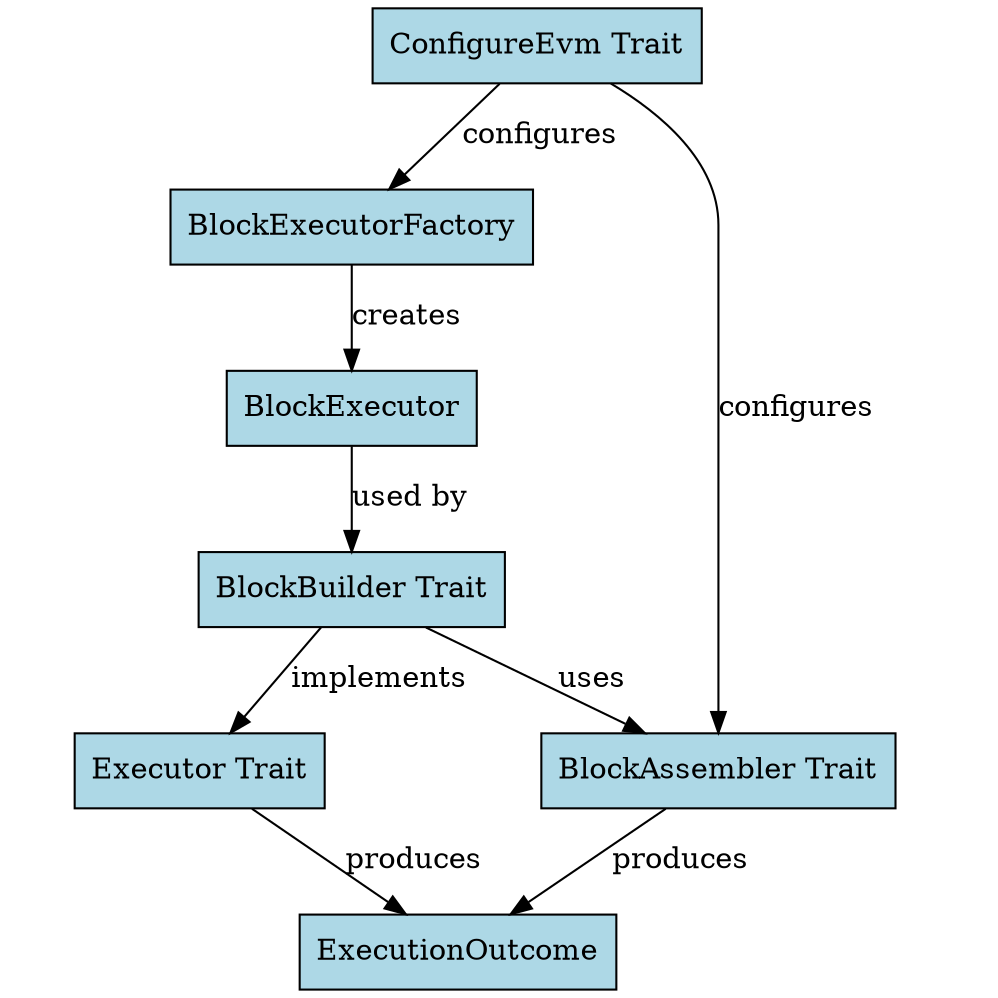
```dot
digraph G {
	rankdir=TD;
	ratio=1.0;
	ConfigureEvm->BlockExecutorFactory[ label="configures" ];
	ConfigureEvm->BlockAssembler[ label="configures" ];
	BlockExecutorFactory->BlockExecutor[ label="creates" ];
	BlockExecutor->BlockBuilder[ label="used by" ];
	BlockBuilder->BlockAssembler[ label="uses" ];
	BlockBuilder->Executor[ label="implements" ];
	Executor->ExecutionOutcome[ label="produces" ];
	BlockAssembler->ExecutionOutcome[ label="produces" ];
	BlockAssembler [ fillcolor=lightblue, label="BlockAssembler Trait", shape=box, style=filled ];
	BlockBuilder [ fillcolor=lightblue, label="BlockBuilder Trait", shape=box, style=filled ];
	BlockExecutor [ fillcolor=lightblue, label="BlockExecutor", shape=box, style=filled ];
	BlockExecutorFactory [ fillcolor=lightblue, label="BlockExecutorFactory", shape=box, style=filled ];
	ConfigureEvm [ fillcolor=lightblue, label="ConfigureEvm Trait", shape=box, style=filled ];
	ExecutionOutcome [ fillcolor=lightblue, label="ExecutionOutcome", shape=box, style=filled ];
	Executor [ fillcolor=lightblue, label="Executor Trait", shape=box, style=filled ];

}
```


---

#### EVM 执行错误处理和 Trie 操作

本小节将介绍 EVM 执行的集中错误处理，重点关注与状态和存储 trie 操作相关的问题，包括状态根计算、状态证明计算和稀疏 trie 不一致。

源码路径：

- `/paradigmxyz/reth/crates/evm/execution-errors`

Reth 中 EVM 执行的集中错误处理主要解决与状态和存储 trie 操作相关的问题，包括状态根计算、状态证明计算以及稀疏 trie 中的不一致。该系统聚合并重新导出常见错误类型，确保跨各种块处理组件的报告一致。

例如，在计算状态根期间出现的错误由特定的错误类型捕获，然后可以将其转换为更广泛的提供者级别错误，以进行更通用的处理。同样，存储根计算期间遇到的问题也是单独管理的。在计算状态证明时，系统会处理数据库不一致、RLP 解码失败和 trie 差异等错误，这些错误可能会导致证明计算停止。

对于稀疏 trie 实现，专门的错误类型区分各种问题，例如无效根节点、尝试更新不完整或未初始化的 trie（称为“盲”try）以及未找到预期节点的情况。这种细粒度方法有助于诊断与 Merkle Patricia Tries 的完整性和一致性相关的问题，这是 Ethereum 状态表示的基础。错误处理机制还解决了与 trie 见证人相关的问题，这可能涉及不存在的帐户或状态证明生成期间的问题。该设计采用一致的结构，通常对错误类型进行装箱，以有效地管理内存并允许不同错误类型之间的多态性。

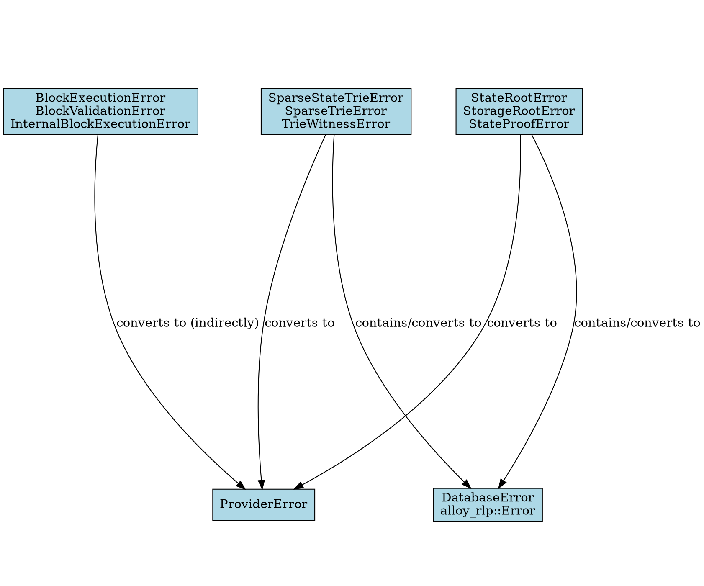
```dot
digraph G {
	rankdir=TD;
	ratio=1.0;
	"Trie-related Errors"->"Database & RLP Errors"[ label="contains/converts to" ];
	"Sparse Trie Errors"->"Database & RLP Errors"[ label="contains/converts to" ];
	"Trie-related Errors"->"ProviderError"[ label="converts to" ];
	"Sparse Trie Errors"->"ProviderError"[ label="converts to" ];
	"EVM Block Errors"->"ProviderError"[ label="converts to (indirectly)" ];
	"Database & RLP Errors" [ fillcolor=lightblue, label="DatabaseError\nalloy_rlp::Error", shape=box, style=filled ];
	"EVM Block Errors" [ fillcolor=lightblue, label="BlockExecutionError\nBlockValidationError\nInternalBlockExecutionError", shape=box, style=filled ];
	"ProviderError" [ fillcolor=lightblue, label="ProviderError", shape=box, style=filled ];
	"Sparse Trie Errors" [ fillcolor=lightblue, label="SparseStateTrieError\nSparseTrieError\nTrieWitnessError", shape=box, style=filled ];
	"Trie-related Errors" [ fillcolor=lightblue, label="StateRootError\nStorageRootError\nStateProofError", shape=box, style=filled ];

}
```


---

#### 聚合 EVM 执行结果

本小节将解释 Reth 如何跨多个块聚合和管理 EVM 执行结果，包括状态更改、交易收据和 EIP-7685 请求，以及它如何提供用于访问执行后数据的统一结构。

源码路径：

- `/paradigmxyz/reth/crates/evm/execution-types`

Reth 跨多个块管理和聚合 EVM 执行结果，以提供用于访问执行后数据的统一结构。这包括处理状态更改、交易收据和 EIP-7685 请求。此聚合的核心组件是 [`ExecutionOutcome`](%2Fparadigmxyz%2Freth%2Fcrates%2Fevm%2Fexecution-types%2Fsrc%2Fexecution_outcome.rs#L406) 结构，在 [`/paradigmxyz/reth/crates/evm/execution-types/src/execution_outcome.rs`](%2Fparadigmxyz%2Freth%2Fcrates%2Fevm%2Fexecution-types%2Fsrc%2Fexecution_outcome.rs) 中定义。该结构使用 [`revm`](%2Fparadigmxyz%2Freth%2FCargo.toml#L437) 的捆绑状态封装状态更改，存储按块分类的交易收据，并跟踪 EIP-7685 请求。

[`ExecutionOutcome`](%2Fparadigmxyz%2Freth%2Fcrates%2Fevm%2Fexecution-types%2Fsrc%2Fexecution_outcome.rs#L406) 提供了访问和操作此聚合数据的方法。例如，它允许从 [`BundleState`](%2Fparadigmxyz%2Freth%2Fcrates%2Ftrie%2Fdb%2Fsrc%2Fstate.rs#L367) 检索帐户信息、字节码和存储值。它还有助于从内部捆绑状态计算状态根，这对于验证区块链的完整性至关重要。有多种方法可用于管理收据，例如迭代所有收据，或检索特定于特定块的收据。

为了支持重组等动态区块链操作，[`ExecutionOutcome`](%2Fparadigmxyz%2Freth%2Fcrates%2Fevm%2Fexecution-types%2Fsrc%2Fexecution_outcome.rs#L406) 包含将状态、收据和请求恢复到指定历史区块号的功能。它还支持在给定块上拆分聚合结果，从而有效地创建两个单独的结果。相反，它可以通过合并另一个 [`ExecutionOutcome`](%2Fparadigmxyz%2Freth%2Fcrates%2Fevm%2Fexecution-types%2Fsrc%2Fexecution_outcome.rs#L406) 来扩展自身，假设传入状态建立在当前状态的基础上。这种模块化方法允许在整个同步过程中灵活处理区块链数据。有关如何在一系列块中使用这些结果的更多详细信息，请参阅[聚合 EVM 执行结果](#core-blockchain-components-aggregated-evm-execution-outcomes)。

[`/paradigmxyz/reth/crates/evm/execution-types/src/chain.rs`](%2Fparadigmxyz%2Freth%2Fcrates%2Fevm%2Fexecution-types%2Fsrc%2Fchain.rs) 中的 [`chain`](%2Fparadigmxyz%2Freth%2Fcrates%2Fchainspec%2Fsrc%2Fapi.rs#L19) 模块通过管理一系列 EVM 块、它们的执行结果和关联的 trie 数据进一步扩展了这个概念。 [`Chain`](%2Fparadigmxyz%2Freth%2Fexamples%2FREADME.md#L62) 结构存储 [`RecoveredBlock`](%2Fparadigmxyz%2Freth%2Fcrates%2Frpc%2Frpc%2Fsrc%2Fdebug.rs#L22) 实例，以及用于状态和更改的 [`ExecutionOutcome`](%2Fparadigmxyz%2Freth%2Fcrates%2Fevm%2Fexecution-types%2Fsrc%2Fexecution_outcome.rs#L406) 以及用于存储 trie 相关信息的 [`LazyTrieData`](%2Fparadigmxyz%2Freth%2Fcrates%2Ftrie%2Fcommon%2Fsrc%2Flazy.rs#L44)。这使得能够管理有序的区块序列及其结果状态，提供对区块数据、执行结果和交易详细信息的全面访问。它还支持附加新块或合并整个链，确保状态转换的一致性和正确处理。

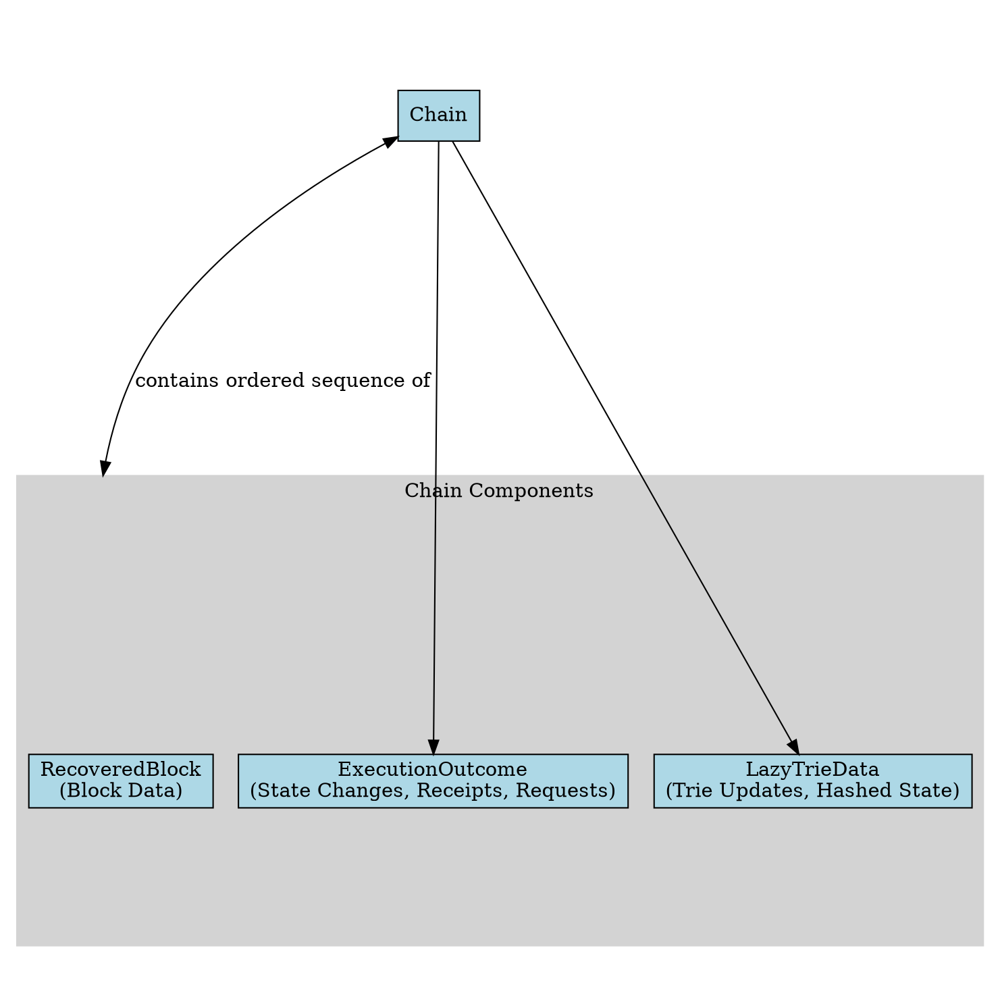
```dot
digraph G {
	compound=true;
	overlap=false;
	rankdir=TD;
	ratio=1.0;
	splines=true;
	Chain->RecoveredBlock[ dir=both, label="contains ordered sequence of", lhead=cluster_chain_components ];
	Chain->ExecutionOutcome;
	Chain->LazyTrieData;
	subgraph cluster_chain_components {
	color=lightgrey;
	compound=true;
	label="Chain Components";
	overlap=false;
	splines=true;
	style=filled;
	ExecutionOutcome [ fillcolor=lightblue, label="ExecutionOutcome\n(State Changes, Receipts, Requests)", shape=box, style=filled ];
	LazyTrieData [ fillcolor=lightblue, label="LazyTrieData\n(Trie Updates, Hashed State)", shape=box, style=filled ];
	RecoveredBlock [ fillcolor=lightblue, label="RecoveredBlock\n(Block Data)", shape=box, style=filled ];

}
;
	Chain [ fillcolor=lightblue, label="Chain", shape=box, style=filled ];

}
```


---

#### 交易池：摄取、验证和池化

本小节将探讨交易池的生命周期管理，涵盖交易摄取、综合验证、子池分类（待处理、停放、blob）以及为块包含排序交易的机制，包括 EIP-4844 blob 存储。

源码路径：

- `/paradigmxyz/reth/crates/transaction-pool`
- `/paradigmxyz/reth/crates/transaction-pool/src`

交易池管理 Reth 内 Ethereum 交易的生命周期，从最初的摄取和全面验证到分类到专门的子池和最终排序以包含块。该系统确保只有有效的、经济上可行的交易才会被考虑用于区块生产，支持包括 EIP-4844 blob 交易在内的各种交易类型。

事务请求提交到池中，并通过 [`/paradigmxyz/reth/crates/transaction-pool/src/batcher.rs`](%2Fparadigmxyz%2Freth%2Fcrates%2Ftransaction-pool%2Fsrc%2Fbatcher.rs) 中的 [`BatchTxProcessor`](%2Fparadigmxyz%2Freth%2Fcrates%2Ftransaction-pool%2Fsrc%2Fbatcher.rs#L53) 进行批处理。这种批处理机制将多个事务插入合并到单个操作中，从而减少争用并提高高并发环境中的吞吐量。每个批处理的请求都包含一个通道，用于将处理结果传达回调用者。

摄取后，交易会使用 [`TransactionValidator`](%2Fparadigmxyz%2Freth%2Fcrates%2Ftransaction-pool%2Fsrc%2Fvalidate%2Fmod.rs#L170) 进行多方面的验证过程。该验证器由 [`/paradigmxyz/reth/crates/transaction-pool/src/validate/eth.rs`](%2Fparadigmxyz%2Freth%2Fcrates%2Ftransaction-pool%2Fsrc%2Fvalidate%2Feth.rs) 中的 [`EthTransactionValidator`](%2Fparadigmxyz%2Freth%2Fcrates%2Ftransaction-pool%2Fsrc%2Fvalidate%2Feth.rs#L79) 实现，针对当前链条件和硬分叉规范执行无状态检查（例如签名有效性、格式）和状态检查（例如随机数、余额、gas 限制）。 EIP-4844 和 EIP-7702 交易存在专门的验证例程，确保遵守各自的规则。可以使用 [`/paradigmxyz/reth/crates/transaction-pool/src/validate/task.rs`](%2Fparadigmxyz%2Freth%2Fcrates%2Ftransaction-pool%2Fsrc%2Fvalidate%2Ftask.rs) 中的 [`TransactionValidationTaskExecutor`](%2Fparadigmxyz%2Freth%2Fcrates%2Fethereum%2Fnode%2Fsrc%2Fnode.rs#L56) 将此验证卸载到后台任务，以防止阻塞主事件循环。

然后，经过验证的交易被分类并放入几个子池之一，每个子池对交易数量和总大小都有特定的限制，在 [`/paradigmxyz/reth/crates/transaction-pool/src/config.rs`](%2Fparadigmxyz%2Freth%2Fcrates%2Ftransaction-pool%2Fsrc%2Fconfig.rs) 的 [`PoolConfig`](%2Fparadigmxyz%2Freth%2Fcrates%2Ftransaction-pool%2Fsrc%2Fconfig.rs#L77) 中定义：
*   **待处理池：** 包含已准备好立即包含在块中的交易。
*   **停放/排队池：** 保存当前不可执行但将来可能会执行的交易（例如，由于基本费用较低、祖先交易丢失或发送者余额不足）。
*   **基本费用池：** 停放池的子集，专门用于等待更高基本费用的交易。
*   **Blob 池：** 管理尚不符合待处理池资格的 EIP-4844 Blob 事务。

[`/paradigmxyz/reth/crates/transaction-pool/src/lib.rs`](%2Fparadigmxyz%2Freth%2Fcrates%2Ftransaction-pool%2Fsrc%2Flib.rs) 中的 [`Pool`](%2Fparadigmxyz%2Freth%2Fcrates%2Fnode%2Fapi%2Fsrc%2Fnode.rs#L68) 结构体提供了与这些子池交互的主接口，包括添加、检索和删除交易的方法。它还为各种事务状态（例如，待处理、丢弃、排队）提供事件侦听器，允许其他组件对池更改做出反应。

事务池操作的核心是 EIP-4844 和 EIP-7594 Blob 数据的管理。 [`BlobStore`](%2Fparadigmxyz%2Freth%2Fcrates%2Ftransaction-pool%2Fsrc%2Fblobstore%2Fmod.rs#L33) 特征在 [`/paradigmxyz/reth/crates/transaction-pool/src/blobstore/mod.rs`](%2Fparadigmxyz%2Freth%2Fcrates%2Ftransaction-pool%2Fsrc%2Fblobstore%2Fmod.rs) 中定义，抽象 blob 存储和检索。实现包括 [`/paradigmxyz/reth/crates/transaction-pool/src/blobstore/disk.rs`](%2Fparadigmxyz%2Freth%2Fcrates%2Ftransaction-pool%2Fsrc%2Fblobstore%2Fdisk.rs) 中的 [`DiskFileBlobStore`](%2Fparadigmxyz%2Freth%2Fcrates%2Ftransaction-pool%2Fsrc%2Fblobstore%2Fdisk.rs#L36) 用于持久存储，以及 [`/paradigmxyz/reth/crates/transaction-pool/src/blobstore/mem.rs`](%2Fparadigmxyz%2Freth%2Fcrates%2Ftransaction-pool%2Fsrc%2Fblobstore%2Fmem.rs) 中的 [`InMemoryBlobStore`](%2Fparadigmxyz%2Freth%2Fcrates%2Ftransaction-pool%2Fsrc%2Fblobstore%2Fmem.rs#L16) 用于缓存。 [`/paradigmxyz/reth/crates/transaction-pool/src/blobstore/tracker.rs`](%2Fparadigmxyz%2Freth%2Fcrates%2Ftransaction-pool%2Fsrc%2Fblobstore%2Ftracker.rs) 中的 [`BlobStoreCanonTracker`](%2Fparadigmxyz%2Freth%2Fcrates%2Ftransaction-pool%2Fsrc%2Fblobstore%2Ftracker.rs#L17) 确保正确跟踪并最终清理规范事务的 blob。不同 blob sidecar 格式之间的转换由 [`/paradigmxyz/reth/crates/transaction-pool/src/blobstore/converter.rs`](%2Fparadigmxyz%2Freth%2Fcrates%2Ftransaction-pool%2Fsrc%2Fblobstore%2Fconverter.rs) 中的 [`BlobSidecarConverter`](%2Fparadigmxyz%2Freth%2Fcrates%2Ftransaction-pool%2Fsrc%2Fblobstore%2Fconverter.rs#L13) 处理。

块包含的交易排序由 [`/paradigmxyz/reth/crates/transaction-pool/src/ordering.rs`](%2Fparadigmxyz%2Freth%2Fcrates%2Ftransaction-pool%2Fsrc%2Fordering.rs) 中的 [`TransactionOrdering`](%2Fparadigmxyz%2Freth%2Fcrates%2Ftransaction-pool%2Fsrc%2Fordering.rs#L44) 特征管理。默认的 [`CoinbaseTipOrdering`](%2Fparadigmxyz%2Freth%2Fcrates%2Ftransaction-pool%2Fsrc%2Flib.rs#L292) 策略根据每个 Gas 的有效小费来确定交易的优先级。池的状态不断更新以响应链事件，例如新块或重组，由 [`/paradigmxyz/reth/crates/transaction-pool/src/maintain.rs`](%2Fparadigmxyz%2Freth%2Fcrates%2Ftransaction-pool%2Fsrc%2Fmaintain.rs) 中的维护逻辑处理。

事务生命周期中遇到的错误按 [`/paradigmxyz/reth/crates/transaction-pool/src/error.rs`](%2Fparadigmxyz%2Freth%2Fcrates%2Ftransaction-pool%2Fsrc%2Ferror.rs) 中的 [`PoolError`](%2Fparadigmxyz%2Freth%2Fcrates%2Ftransaction-pool%2Fsrc%2Ferror.rs#L77) 和 [`InvalidPoolTransactionError`](%2Fparadigmxyz%2Freth%2Fcrates%2Ftransaction-pool%2Fsrc%2Ferror.rs#L300) 进行分类。这些错误类型区分“不良”事务（导致对等点惩罚）和其他问题，影响网络对等点的管理方式。

交易发送者 ([`SenderId`](%2Fparadigmxyz%2Freth%2Fcrates%2Ftransaction-pool%2Fsrc%2Fidentifier.rs#L63)) 和单个交易 ([`TransactionId`](%2Fparadigmxyz%2Freth%2Fcrates%2Ftransaction-pool%2Fsrc%2Fidentifier.rs#L99)) 的唯一标识符由 [`SenderIdentifiers`](%2Fparadigmxyz%2Freth%2Fcrates%2Ftransaction-pool%2Fsrc%2Fidentifier.rs#L19) 在 [`/paradigmxyz/reth/crates/transaction-pool/src/identifier.rs`](%2Fparadigmxyz%2Freth%2Fcrates%2Ftransaction-pool%2Fsrc%2Fidentifier.rs) 中管理。该系统允许有效跟踪交易及其依赖性，特别是涉及随机数的情况。

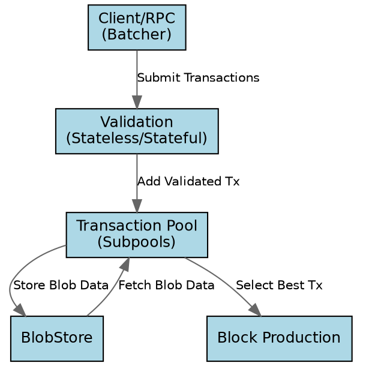
```dot
digraph G {
	rankdir=TD;
	ratio=1.0;
	"Client/RPC"->"Validation"[ color="#666666", fontname="Helvetica", fontsize=10, label="Submit Transactions" ];
	"Validation"->"TransactionPool"[ color="#666666", fontname="Helvetica", fontsize=10, label="Add Validated Tx" ];
	"TransactionPool"->"BlobStore"[ color="#666666", fontname="Helvetica", fontsize=10, label="Store Blob Data" ];
	"BlobStore"->"TransactionPool"[ color="#666666", fontname="Helvetica", fontsize=10, label="Fetch Blob Data" ];
	"TransactionPool"->"Block Production"[ color="#666666", fontname="Helvetica", fontsize=10, label="Select Best Tx" ];
	"BlobStore" [ fillcolor=lightblue, fontname="Helvetica", fontsize=12, label="BlobStore", shape=box, style=filled ];
	"Block Production" [ fillcolor=lightblue, fontname="Helvetica", fontsize=12, label="Block Production", shape=box, style=filled ];
	"Client/RPC" [ fillcolor=lightblue, fontname="Helvetica", fontsize=12, label="Client/RPC\n(Batcher)", shape=box, style=filled ];
	"TransactionPool" [ fillcolor=lightblue, fontname="Helvetica", fontsize=12, label="Transaction Pool\n(Subpools)", shape=box, style=filled ];
	"Validation" [ fillcolor=lightblue, fontname="Helvetica", fontsize=12, label="Validation\n(Stateless/Stateful)", shape=box, style=filled ];

}
```


---

#### 通过缓存优化块处理

本小节将描述 Reth 的多级缓存系统，旨在优化块处理，包括帐户、存储和字节码数据的内存缓存，以及如何跨顺序块重用缓存状态。

源码路径：

- `/paradigmxyz/reth/crates/engine/execution-cache`

Reth 采用多级缓存系统来优化块处理，特别是在顺序块执行期间。该系统旨在通过将频繁访问的执行相关数据存储在内存中来减少冗余数据库查找。

从本质上讲，[`/paradigmxyz/reth/crates/engine/execution-cache/src/cached_state.rs`](%2Fparadigmxyz%2Freth%2Fcrates%2Fengine%2Fexecution-cache%2Fsrc%2Fcached_state.rs) 中的 [`ExecutionCache`](%2Fparadigmxyz%2Freth%2Fcrates%2Fengine%2Fexecution-cache%2Fsrc%2Fcached_state.rs#L690) 管理帐户、存储和字节码数据的内存缓存。该缓存配置有分配在不同数据类型之间的大小预算。当块执行发生时，[`ExecutionCache`](%2Fparadigmxyz%2Freth%2Fcrates%2Fengine%2Fexecution-cache%2Fsrc%2Fcached_state.rs#L690) 首先尝试从这些内存缓存中检索必要的数据。如果未找到某条数据（缓存未命中），则会从底层状态提供程序中获取该数据，然后将其插入缓存中以供将来使用。缓存还通过更新或清除相关缓存条目来处理块执行期间发生的状态更新，例如帐户更改或自毁操作，以保持一致性。

为了进一步增强顺序块处理的性能，Reth 利用位于 [`/paradigmxyz/reth/crates/engine/execution-cache/src/lib.rs`](%2Fparadigmxyz%2Freth%2Fcrates%2Fengine%2Fexecution-cache%2Fsrc%2Flib.rs) 中的 [`PayloadExecutionCache`](%2Fparadigmxyz%2Freth%2Fcrates%2Fengine%2Fexecution-cache%2Fsrc%2Flib.rs#L49)。这是一个线程安全、受保护的缓存，保存与最近处理的块关联的 [`ExecutionCache`](%2Fparadigmxyz%2Freth%2Fcrates%2Fengine%2Fexecution-cache%2Fsrc%2Fcached_state.rs#L690) 实例。它的主要作用是允许新块重用其父块的缓存状态，这在通常按顺序处理块的同步期间特别有用。当处理新块时，[`PayloadExecutionCache`](%2Fparadigmxyz%2Freth%2Fcrates%2Fengine%2Fexecution-cache%2Fsrc%2Flib.rs#L49) 检查父块的缓存状态是否可用并与预期的父哈希匹配。如果是这样，它可以向执行过程提供这个预热的缓存，从而显着减少初始数据加载时间。如果父哈希不匹配（表示分叉或无序处理），现有缓存将被清除并重置以用于新块，从而确保数据完整性。这种机制对于最大限度地减少密集型区块链操作期间的延迟和资源消耗至关重要。

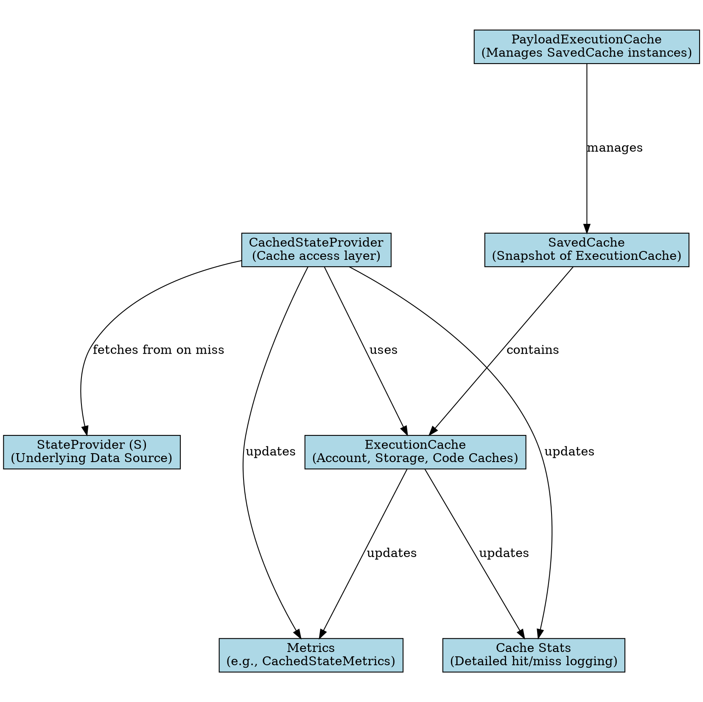
```dot
digraph G {
	rankdir=TD;
	ratio=1.0;
	PayloadExecutionCache->SavedCache[ label="manages" ];
	SavedCache->ExecutionCache[ label="contains" ];
	CachedStateProvider->ExecutionCache[ label="uses" ];
	CachedStateProvider->StateProvider[ label="fetches from on miss" ];
	CachedStateProvider->Metrics[ label="updates" ];
	CachedStateProvider->CacheStats[ label="updates" ];
	ExecutionCache->Metrics[ label="updates" ];
	ExecutionCache->CacheStats[ label="updates" ];
	CacheStats [ fillcolor=lightblue, label="Cache Stats\n(Detailed hit/miss logging)", shape=box, style=filled ];
	CachedStateProvider [ fillcolor=lightblue, label="CachedStateProvider\n(Cache access layer)", shape=box, style=filled ];
	ExecutionCache [ fillcolor=lightblue, label="ExecutionCache\n(Account, Storage, Code Caches)", shape=box, style=filled ];
	Metrics [ fillcolor=lightblue, label="Metrics\n(e.g., CachedStateMetrics)", shape=box, style=filled ];
	PayloadExecutionCache [ fillcolor=lightblue, label="PayloadExecutionCache\n(Manages SavedCache instances)", shape=box, style=filled ];
	SavedCache [ fillcolor=lightblue, label="SavedCache\n(Snapshot of ExecutionCache)", shape=box, style=filled ];
	StateProvider [ fillcolor=lightblue, label="StateProvider (S)\n(Underlying Data Source)", shape=box, style=filled ];

}
```


---

#### 无效块处理和执行见证生成

本小节将详细介绍 Reth 如何处理无效的 Ethereum 块，重点是重新执行它们以生成和分析执行见证和状态差异以进行调试。

源码路径：

- `/paradigmxyz/reth/crates/engine/invalid-block-hooks`

Reth 包括用于处理和分析无效 Ethereum 块的专门机制，主要位于 [`/paradigmxyz/reth/crates/engine/invalid-block-hooks`](%2Fparadigmxyz%2Freth%2Fcrates%2Fengine%2Finvalid-block-hooks) 目录中。当遇到无效块时，系统会重新执行它以生成“执行见证”和详细的“状态差异”，这对于调试和理解无效的根本原因至关重要。此过程由 [`InvalidBlockWitnessHook`](%2Fparadigmxyz%2Freth%2Fcrates%2Fengine%2Finvalid-block-hooks%2Fsrc%2Fwitness.rs#L193)（在 [`/paradigmxyz/reth/crates/engine/invalid-block-hooks/src/witness.rs`](%2Fparadigmxyz%2Freth%2Fcrates%2Fengine%2Finvalid-block-hooks%2Fsrc%2Fwitness.rs) 中定义）管理，它充当触发重新执行和分析的回调。

重新执行涉及获取无效块并通过 Ethereum 虚拟机 (EVM) 针对父块的状态运行它。在此重新执行期间，Reth 收集所有状态更改，包括合约代码、帐户/存储原像和最终的哈希后状态。收集到的数据形成 [`ExecutionWitness`](%2Fparadigmxyz%2Freth%2Fcrates%2Frevm%2Fsrc%2Fwitness.rs#L26)，提供块的执行路径及其对状态的影响的全面记录。

为了确保一致性并帮助调试，系统会执行多次比较：
*   将重新执行期间生成的 [`BundleState`](%2Fparadigmxyz%2Freth%2Fcrates%2Ftrie%2Fdb%2Fsrc%2Fstate.rs#L367)（代表所有状态更改）与原始 [`BundleState`](%2Fparadigmxyz%2Freth%2Fcrates%2Ftrie%2Fdb%2Fsrc%2Fstate.rs#L367) 进行比较，以识别差异。
*   根据块声明的状态根来验证重新执行的块的计算状态根和特里树更新。
*   或者，如果与健康 Ethereum 节点的连接可用，则可以将生成的执行见证与从健康节点获取的见证进行比较，突出显示可能表明协议偏差或细微错误的差异。

所有分析结果（包括生成的见证和任何已识别的状态差异）都保存到文件中。这种基于文件的输出支持离线调试以及与外部分析工具的集成，使开发人员能够仔细检查块被视为无效的原因。有关调试功能的更多详细信息，请参阅[调试功能和无效块处理](#node-configuration-and-extensibility-debugging-features-and-invalid-block-handling)。

```dot
digraph G {
	rankdir=TD;
	ratio=1.0;
	"Invalid Block Encountered"->"Block Re-execution";
	"Block Re-execution"->"Execution Witness & State Collection";
	"Execution Witness & State Collection"->"Comparison & Validation";
	"Comparison & Validation"->"Healthy Node Client"[ label="Witness Comparison" ];
	"Comparison & Validation"->"Output Analysis Results"[ label="BundleState, State Root, Trie Updates Validation" ];
	"Healthy Node Client"->"Output Analysis Results";
	"Output Analysis Results"->"Output Directory";
	"Block Re-execution" [ fillcolor=lightblue, label="Block Re-execution\n(re_execute_block)", shape=box, style=filled ];
	"Comparison & Validation" [ fillcolor=lightblue, label="Comparison &\nValidation", shape=box, style=filled ];
	"Execution Witness & State Collection" [ fillcolor=lightblue, label="Execution Witness &\nState Collection\n(collect_execution_data, generate)", shape=box, style=filled ];
	"Healthy Node Client" [ fillcolor=lightblue, label="Healthy Node\nClient (Optional)", shape=box, style=filled ];
	"Invalid Block Encountered" [ fillcolor=lightblue, label="Invalid Block\nEncountered", shape=box, style=filled ];
	"Output Analysis Results" [ fillcolor=lightblue, label="Output Analysis Results\n(save_file, save_diff)", shape=box, style=filled ];
	"Output Directory" [ fillcolor=lightblue, label="Output Directory", shape=box, style=filled ];

}
```


---

#### 本地区块挖掘和有效负载属性

本小节将解释用于开发区块链的本地引擎服务，特别是它如何支持具有可配置模式（即时、间隔、触发）的本地块挖掘并生成 Ethereum 有效负载属性，同时考虑到硬分叉规范。

源码路径：

- `/paradigmxyz/reth/crates/engine/local`

Reth 为开发区块链提供本地引擎服务，可以模拟 Ethereum 的共识层交互。该服务支持具有可配置模式的本地块挖掘，并生成 Ethereum 有效负载属性，考虑硬分叉规范。

核心组件 [`LocalMiner`](%2Fparadigmxyz%2Freth%2Fcrates%2Fengine%2Flocal%2Fsrc%2Fminer.rs#L151) 位于 [`/paradigmxyz/reth/crates/engine/local/src/miner.rs`](%2Fparadigmxyz%2Freth%2Fcrates%2Fengine%2Flocal%2Fsrc%2Fminer.rs) 中，负责通过构建和提交新区块来推进区块链。它基于各种 [`MiningMode`](%2Fparadigmxyz%2Freth%2Fcrates%2Fengine%2Flocal%2Fsrc%2Fminer.rs#L26) 策略进行操作：
*   **即时挖掘**：在新交易或达到指定交易数量后立即挖掘区块。
*   **间隔挖矿**：在固定的时间段内开采区块。
*   **触发挖矿**：区块生产由来自异步流的外部信号启动，为自定义场景提供灵活的控制。

[`LocalMiner`](%2Fparadigmxyz%2Freth%2Fcrates%2Fengine%2Flocal%2Fsrc%2Fminer.rs#L151) 使用 [`/paradigmxyz/reth/crates/engine/local/src/payload.rs`](%2Fparadigmxyz%2Freth%2Fcrates%2Fengine%2Flocal%2Fsrc%2Fpayload.rs) 中定义的 [`LocalPayloadAttributesBuilder`](%2Fparadigmxyz%2Freth%2Fcrates%2Fengine%2Flocal%2Fsrc%2Fpayload.rs#L23) 来构造 [`EthPayloadAttributes`](%2Fparadigmxyz%2Freth%2Fcrates%2Fethereum%2Fnode%2Fsrc%2Fnode.rs#L12)。此构建器填充时间戳、[`prev_randao`](%2Fparadigmxyz%2Freth%2Fcrates%2Fevm%2Fevm%2Fsrc%2Flib.rs#L502) 和建议的费用接收者等字段。至关重要的是，它有条件地包括基于生成时间戳处的活动硬分叉（例如上海、坎昆、阿姆斯特丹）的硬分叉特定字段，如 [`withdrawals`](%2Fparadigmxyz%2Freth%2Fcrates%2Fpayload%2Fbasic%2Fsrc%2Fstack.rs#L76)、[`parent_beacon_block_root`](%2Fparadigmxyz%2Freth%2Fcrates%2Fpayload%2Fbasic%2Fsrc%2Fstack.rs#L69) 和 [`slot_number`](%2Fparadigmxyz%2Freth%2Fcrates%2Fpayload%2Fbasic%2Fsrc%2Fstack.rs#L83)，由 [`ChainSpec`](%2Fparadigmxyz%2Freth%2Fbin%2Freth-bb%2Fsrc%2Fmain.rs#L156) 确定。这确保本地开采的区块准确反映指定 Ethereum 网络的协议规则。

[`LocalMiner`](%2Fparadigmxyz%2Freth%2Fcrates%2Fengine%2Flocal%2Fsrc%2Fminer.rs#L151) 通过 [`ConsensusEngineHandle`](%2Fparadigmxyz%2Freth%2Fcrates%2Fnode%2Fapi%2Fsrc%2Fnode.rs#L8) 与共识引擎交互，发送 [`fork_choice_updated`](%2Fparadigmxyz%2Freth%2Fcrates%2Fengine%2Fprimitives%2Fsrc%2Fmessage.rs#L368) 和 [`new_payload`](%2Fparadigmxyz%2Freth%2Fcrates%2Fe2e-test-utils%2Fsrc%2Fnode.rs#L136) 消息，并使用 [`PayloadBuilderHandle`](%2Fparadigmxyz%2Freth%2Fcrates%2Fnode%2Fapi%2Fsrc%2Fnode.rs#L13) 解析负载详细信息。这种解耦设计允许矿工使用不同的共识引擎实现，只要它们遵守定义的 RPC 接口。此功能对于快速本地开发和测试特别有用，允许开发人员模拟区块链进展并观察其在各种条件下的行为，而无需连接到实时网络。有关节点调试的更多详细信息，请参阅[调试功能和无效块处理](#node-configuration-and-extensibility-debugging-features-and-invalid-block-handling)。

```dot
digraph G {
	rankdir=TD;
	ratio=1.0;
	MiningMode->LocalMiner[ label="triggers block production" ];
	LocalMiner->PayloadAttributesBuilder[ label="requests attributes" ];
	PayloadAttributesBuilder->EthChainSpec[ label="uses hardfork info" ];
	LocalMiner->ConsensusEngineHandle[ label="sends FCU and NewPayload" ];
	LocalMiner->PayloadBuilderHandle[ label="resolves payload" ];
	ConsensusEngineHandle->LocalMiner[ label="returns status" ];
	PayloadBuilderHandle->LocalMiner[ label="returns BuiltPayload" ];
	ConsensusEngineHandle [ fillcolor=lightblue, label="ConsensusEngineHandle", shape=box, style=filled ];
	EthChainSpec [ fillcolor=lightblue, label="EthChainSpec\n(Hardforks)", shape=box, style=filled ];
	LocalMiner [ fillcolor=lightblue, label="LocalMiner", shape=box, style=filled ];
	MiningMode [ fillcolor=lightblue, label="MiningMode\n(Instant, Interval, Trigger)", shape=box, style=filled ];
	PayloadAttributesBuilder [ fillcolor=lightblue, label="LocalPayloadAttributesBuilder\n(EthPayloadAttributes)", shape=box, style=filled ];
	PayloadBuilderHandle [ fillcolor=lightblue, label="PayloadBuilderHandle", shape=box, style=filled ];

}
```


---

#### Engine API 原语和 Forkchoice 状态管理

本小节将介绍 Reth 引擎与 Ethereum Engine API 交互的基本构建块，包括配置、错误处理、事件管理以及信标共识引擎通信的分叉选择状态跟踪。

源码路径：

- `/paradigmxyz/reth/crates/engine/primitives`

Reth 引擎与 Ethereum Engine API 的交互依赖于通信和状态管理的基本构建块。这涉及结构化配置、强大的错误处理、详细的事件报告以及对 forkchoice 状态的精确跟踪。

引擎树组件的配置通过 [`/paradigmxyz/reth/crates/engine/primitives/src/config.rs`](%2Fparadigmxyz%2Freth%2Fcrates%2Fengine%2Fprimitives%2Fsrc%2Fconfig.rs) 中的 [`TreeConfig`](%2Fparadigmxyz%2Freth%2Fcrates%2Fnode%2Fbuilder%2Fsrc%2Frpc.rs#L27) 结构进行管理。该结构集中管理持久性、缓存、并行执行和状态根计算的参数。它包括影响块数据何时保存到磁盘、内部缓存如何运行以及如何计算状态根的设置，以及并行任务或回退机制的选项。该配置还包括特定于 Engine API 交互的参数，例如控制如何处理从共识层接收到的块的参数。

与信标共识引擎交互产生的错误条件在 [`/paradigmxyz/reth/crates/engine/primitives/src/error.rs`](%2Fparadigmxyz%2Freth%2Fcrates%2Fengine%2Fprimitives%2Fsrc%2Ferror.rs) 中定义。其中包括针对新负载处理期间问题的 [`BeaconOnNewPayloadError`](%2Fparadigmxyz%2Freth%2Fcrates%2Fengine%2Fprimitives%2Fsrc%2Ferror.rs#L18) 和针对应用 forkchoice 更新时遇到的问题的 [`BeaconForkChoiceUpdateError`](%2Fparadigmxyz%2Freth%2Fcrates%2Fengine%2Fprimitives%2Fsrc%2Ferror.rs#L42)。这些错误类型旨在以 JSON RPC 错误的形式返回到信标节点，从而提供引擎不可用或内部处理失败的明确指示。

共识引擎通过 [`/paradigmxyz/reth/crates/engine/primitives/src/event.rs`](%2Fparadigmxyz%2Freth%2Fcrates%2Fengine%2Fprimitives%2Fsrc%2Fevent.rs) 中的 [`ConsensusEngineEvent`](%2Fparadigmxyz%2Freth%2Fcrates%2Fnode%2Fapi%2Fsrc%2Fnode.rs#L8) 枚举定义的事件系统来传达其运行状态和进度。这些事件涵盖关键事件，例如 [`ForkchoiceUpdated`](%2Fparadigmxyz%2Freth%2Fcrates%2Fengine%2Fprimitives%2Fsrc%2Fevent.rs#L24)、[`BlockReceived`](%2Fparadigmxyz%2Freth%2Fcrates%2Fengine%2Fprimitives%2Fsrc%2Fevent.rs#L28)、[`CanonicalBlockAdded`](%2Fparadigmxyz%2Freth%2Fcrates%2Fengine%2Fprimitives%2Fsrc%2Fevent.rs#L30) 和 [`InvalidBlock`](%2Fparadigmxyz%2Freth%2Fcrates%2Fengine%2Fprimitives%2Fsrc%2Fevent.rs#L34)，提供有关引擎活动的详细信息。该事件系统对于监控引擎的健康状况和状态变化至关重要，允许其他组件对区块链同步过程中的重大发展做出反应。

Engine API 的核心是 Ethereum forkchoice 状态的管理，该状态由 [`/paradigmxyz/reth/crates/engine/primitives/src/forkchoice.rs`](%2Fparadigmxyz%2Freth%2Fcrates%2Fengine%2Fprimitives%2Fsrc%2Fforkchoice.rs) 中的 [`ForkchoiceStateTracker`](%2Fparadigmxyz%2Freth%2Fcrates%2Fengine%2Fprimitives%2Fsrc%2Fforkchoice.rs#L17) 处理。此跟踪器维护最新接收的、最后有效的和同步的 [`ForkchoiceState`](%2Fparadigmxyz%2Freth%2Fdocs%2Fcrates%2Fnetwork.md#L71) 对象的不同状态。这种设计对于准确处理来自共识层的异步更新非常重要，特别是在确认真正有效的状态之前处理无效或同步状态时。 [`set_latest`](%2Fparadigmxyz%2Freth%2Fcrates%2Fengine%2Fprimitives%2Fsrc%2Fforkchoice.rs#L22) 和 [`promote_sync_target_to_valid`](%2Fparadigmxyz%2Freth%2Fcrates%2Fengine%2Fprimitives%2Fsrc%2Fforkchoice.rs#L42) 等方法可以实现这些状态之间的动态更新和转换，反映区块链头部、安全和最终区块的不断变化的状态。

[`ConsensusEngineHandle`](%2Fparadigmxyz%2Freth%2Fcrates%2Fnode%2Fapi%2Fsrc%2Fnode.rs#L8) 和 [`OnForkChoiceUpdated`](%2Fparadigmxyz%2Freth%2Fcrates%2Fengine%2Fprimitives%2Fsrc%2Fmessage.rs#L44) 类型促进了与 Beacon 共识引擎的通信，这些类型在 [`/paradigmxyz/reth/crates/engine/primitives/src/message.rs`](%2Fparadigmxyz%2Freth%2Fcrates%2Fengine%2Fprimitives%2Fsrc%2Fmessage.rs) 中定义。 [`ConsensusEngineHandle`](%2Fparadigmxyz%2Freth%2Fcrates%2Fnode%2Fapi%2Fsrc%2Fnode.rs#L8) 提供向共识引擎发送 [`NewPayload`](%2Fparadigmxyz%2Freth%2Fcrates%2Fengine%2Futil%2Fsrc%2Fengine_store.rs#L30) 和 [`ForkchoiceUpdated`](%2Fparadigmxyz%2Freth%2Fcrates%2Fengine%2Fprimitives%2Fsrc%2Fevent.rs#L24) 等消息的主要接口。 [`OnForkChoiceUpdated`](%2Fparadigmxyz%2Freth%2Fcrates%2Fengine%2Fprimitives%2Fsrc%2Fmessage.rs#L44) future 表示 forkchoice 更新的异步结果，提供即时状态并最终解析为更完整的结果，可能包括 [`PayloadId`](%2Fparadigmxyz%2Freth%2Fcrates%2Fpayload%2Fbasic%2Fsrc%2Flib.rs#L19)。这种异步设计允许引擎在不阻塞调用者的情况下处理请求，从而实现高效的后台操作。对于特殊场景，定义 [`BigBlockData`](%2Fparadigmxyz%2Freth%2Fbin%2Freth-bb%2FREADME.md#L11) 来表示组合多个“真实”块的执行负载，管理环境切换和复杂多段执行的块哈希解析。

```dot
digraph G {
	rankdir=TD;
	ratio=1.0;
	"ConsensusEngineHandle"->"BeaconEngineMessages"[ label="Sends" ];
	"BeaconEngineMessages"->"EngineBehavior"[ label="Triggers" ];
	"TreeConfig"->"EngineBehavior"[ label="Configures" ];
	"EngineBehavior"->"ForkchoiceStateManagement"[ label="Updates" ];
	"EngineBehavior"->"EngineEvents"[ label="Emits" ];
	"EngineBehavior"->"ErrorHandling"[ label="Reports" ];
	"ForkchoiceStateManagement"->"EngineBehavior"[ label="Informs" ];
	"BeaconEngineMessages" [ fillcolor=lightblue, label="BeaconEngineMessage Types\n(NewPayload, ForkchoiceUpdated)", shape=box, style=filled ];
	"ConsensusEngineHandle" [ fillcolor=lightblue, label="ConsensusEngineHandle\n(Message Passing)", shape=box, style=filled ];
	"EngineBehavior" [ fillcolor=lightblue, label="Engine Behavior\n(Persistence, Caching, Execution)", shape=box, style=filled ];
	"EngineEvents" [ fillcolor=lightblue, label="ConsensusEngineEvent\n(Event Emission)", shape=box, style=filled ];
	"ErrorHandling" [ fillcolor=lightblue, label="BeaconOnNewPayloadError,\nBeaconForkChoiceUpdateError\n(Error Reporting)", shape=box, style=filled ];
	"ForkchoiceStateManagement" [ fillcolor=lightblue, label="ForkchoiceStateTracker\n(State Tracking)", shape=box, style=filled ];
	"TreeConfig" [ fillcolor=lightblue, label="TreeConfig\n(Engine Configuration)", shape=box, style=filled ];

}
```


---

#### 引擎树逻辑：链编排和状态根计算

本小节将深入探讨 Reth 引擎与共识层交互的核心逻辑，重点关注链编排、区块下载、状态持久化，以及使用稀疏尝试和并行执行计算 Ethereum 状态根的复杂过程。

源码路径：

- `/paradigmxyz/reth/crates/engine/tree`

Reth 引擎与共识层的交互由协调链推进和回填同步的集中式 [`ChainOrchestrator`](%2Fparadigmxyz%2Freth%2Fcrates%2Fengine%2Ftree%2Fsrc%2Fchain.rs#L44) 管理。该协调器在 [`/paradigmxyz/reth/crates/engine/tree/src/chain.rs`](%2Fparadigmxyz%2Freth%2Fcrates%2Fengine%2Ftree%2Fsrc%2Fchain.rs) 中定义，使用状态驱动的方法来管理 [`ChainHandler`](%2Fparadigmxyz%2Freth%2Fcrates%2Fengine%2Ftree%2Fsrc%2Fchain.rs#L199)（用于核心链逻辑）和 [`BackfillSync`](%2Fparadigmxyz%2Freth%2Fcrates%2Fengine%2Ftree%2Fsrc%2Fbackfill.rs#L50) 组件之间的事件和操作，确保一致的数据处理和独占数据库访问。

该组件的核心职责是块数据的管理，包括获取和持久化。在 [`/paradigmxyz/reth/crates/engine/tree/src/download.rs`](%2Fparadigmxyz%2Freth%2Fcrates%2Fengine%2Ftree%2Fsrc%2Fdownload.rs) 中实现的 [`BlockDownloader`](%2Fparadigmxyz%2Freth%2Fcrates%2Fengine%2Ftree%2Fsrc%2Fdownload.rs#L23) 处理对单个块、块集或范围的请求，缓冲它们并按升序返回它们。该组件利用 [`FullBlockClient`](%2Fparadigmxyz%2Freth%2Fcrates%2Fnet%2Fp2p%2Fsrc%2Ffull_block.rs#L101) 从网络获取块、跟踪正在进行的请求并管理与活动下载相关的指标。一旦处理完块，[`PersistenceService`](%2Fparadigmxyz%2Freth%2Fcrates%2Fengine%2Ftree%2Fsrc%2Fpersistence.rs#L65) 将在专用线程中运行，如 [`/paradigmxyz/reth/crates/engine/tree/src/persistence.rs`](%2Fparadigmxyz%2Freth%2Fcrates%2Fengine%2Ftree%2Fsrc%2Fpersistence.rs) 中所述，将数据保存到数据库和静态文件，包括修剪操作，从而从关键路径卸载 I/O。

链进程通过两种不同的同步类型进行处理：回填和实时同步。回填同步由 [`/paradigmxyz/reth/crates/engine/tree/src/backfill.rs`](%2Fparadigmxyz%2Freth%2Fcrates%2Fengine%2Ftree%2Fsrc%2Fbackfill.rs) 中的 [`PipelineSync`](%2Fparadigmxyz%2Freth%2Fcrates%2Fengine%2Ftree%2Fsrc%2Flib.rs#L45) 管理，通过执行 [`Pipeline`](%2Fparadigmxyz%2Freth%2Fcrates%2Fnode%2Fevents%2Fsrc%2Fnode.rs#L429) 任务来下载数据并执行到指定的块目标，从而解决链中的大间隙。相反，实时同步通过响应共识层的新块并动态下载任何丢失的块来处理较小的间隙。 [`EngineApiTreeHandler`](%2Fparadigmxyz%2Freth%2Fcrates%2Fengine%2Ftree%2Fsrc%2Ftree%2Fmod.rs#L264) 是引擎操作的核心，在 [`/paradigmxyz/reth/crates/engine/tree/src/tree/mod.rs`](%2Fparadigmxyz%2Freth%2Fcrates%2Fengine%2Ftree%2Fsrc%2Ftree%2Fmod.rs) 中定义，管理区块链的内存状态、处理 [`newPayload`](%2Fparadigmxyz%2Freth%2FAGENTS.md#L21) 和 [`forkchoiceUpdated`](%2Fparadigmxyz%2Freth%2FAGENTS.md#L21) 消息、执行块和协调回填。

引擎树的一个关键功能是计算 Ethereum 状态根，这是一个由 [`engine_newPayload`](%2Fparadigmxyz%2Freth%2Fbin%2Freth-bench%2FREADME.md#L32) 请求启动的复杂过程，如 [`/paradigmxyz/reth/crates/engine/tree/docs/root.md`](%2Fparadigmxyz%2Freth%2Fcrates%2Fengine%2Ftree%2Fdocs%2Froot.md) 中详述。这个过程涉及：
*   **预热**：交易与预取已修改帐户和存储槽的证明并行执行。
*   **顺序执行**：然后顺序执行事务，并将状态更新发送到 [`State Root Task`](%2Fparadigmxyz%2Freth%2Fcrates%2Fengine%2Ftree%2Fdocs%2Froot.md#L1)。
*   **状态根任务**：此状态机协调整体计算，请求从 [`MultiProof Manager`](%2Fparadigmxyz%2Freth%2Fcrates%2Fengine%2Ftree%2Fdocs%2Froot.md#L147) 生成证明并通过 [`Sparse Trie Task`](%2Fparadigmxyz%2Freth%2Fcrates%2Fengine%2Ftree%2Fdocs%2Froot.md#L61) 更新稀疏特里树。
*   **MultiProof Manager**：为修改后的状态元素生成 Merkle Patricia Trie (MPT) 证明。
*   **稀疏特里树任务**：该组件在“稀疏”特里树上运行，它仅将状态特里树的已修改和必​​要部分加载到内存中。它揭示证明并将更新应用于存储和帐户，尝试计算最终状态根哈希。

[`/paradigmxyz/reth/crates/engine/tree/src/launch.rs`](%2Fparadigmxyz%2Freth%2Fcrates%2Fengine%2Ftree%2Fsrc%2Flaunch.rs) 中的 [`build_engine_orchestrator`](%2Fparadigmxyz%2Freth%2Fcrates%2Fengine%2Ftree%2Fsrc%2Flaunch.rs#L3) 函数集成了所有这些组件，包括 [`BasicBlockDownloader`](%2Fparadigmxyz%2Freth%2Fcrates%2Fengine%2Ftree%2Fsrc%2Flaunch.rs#L10)、[`PersistenceHandle`](%2Fparadigmxyz%2Freth%2Fcrates%2Fengine%2Ftree%2Fsrc%2Flaunch.rs#L12)、[`EngineApiTreeHandler`](%2Fparadigmxyz%2Freth%2Fcrates%2Fengine%2Ftree%2Fsrc%2Ftree%2Fmod.rs#L264)、[`EngineApiRequestHandler`](%2Fparadigmxyz%2Freth%2Fcrates%2Fengine%2Ftree%2Fsrc%2Fengine.rs#L178)、 [`EngineHandler`](%2Fparadigmxyz%2Freth%2Fcrates%2Fengine%2Ftree%2Fsrc%2Fengine.rs#L50) 和 [`PipelineSync`](%2Fparadigmxyz%2Freth%2Fcrates%2Fengine%2Ftree%2Fsrc%2Flib.rs#L45) 转换为 [`ChainOrchestrator`](%2Fparadigmxyz%2Freth%2Fcrates%2Fengine%2Ftree%2Fsrc%2Fchain.rs#L44)，驱动整个链进程。

```dot
digraph G {
	rankdir=TD;
	ratio=1.0;
	ChainOrchestrator->EngineHandler[ label="polls" ];
	ChainOrchestrator->PipelineSync[ label="polls" ];
	EngineHandler->EngineApiTreeHandler[ label="sends requests/receives events" ];
	EngineHandler->BlockDownloader[ label="initiates downloads" ];
	EngineApiTreeHandler->PersistenceService[ label="sends actions" ];
	EngineApiTreeHandler->StateRootCalculation[ label="initiates" ];
	BlockDownloader [ fillcolor=lightblue, label="{<p>BlockDownloader|Downloads blocks on demand}", shape=box, style=filled ];
	ChainOrchestrator [ fillcolor=lightblue, label="{<p>ChainOrchestrator|Drives chain forward, orchestrates components, polls handler}", shape=box, style=filled ];
	EngineApiTreeHandler [ fillcolor=lightblue, label="{<p>EngineApiTreeHandler|Processes Engine API requests, manages in-memory chain state, calculates state root}", shape=box, style=filled ];
	EngineHandler [ fillcolor=lightblue, label="{<p>EngineHandler|Routes CL messages, manages downloads}", shape=box, style=filled ];
	PersistenceService [ fillcolor=lightblue, label="{<p>PersistenceService|Writes state to DB, performs pruning}", shape=box, style=filled ];
	PipelineSync [ fillcolor=lightblue, label="{<p>PipelineSync|Handles large block range synchronization}", shape=box, style=filled ];
	StateRootCalculation [ fillcolor=lightblue, label="{<p>State Root Calculation|Manages MPT proofs and sparse trie updates}", shape=box, style=filled ];

}
```


---

#### 用于消息流操作的引擎实用程序

本小节将描述为处理、转换和持久 Ethereum Beacon Engine API 消息流提供的实用程序，包括跳过消息、将消息存储到磁盘以及模拟区块链重组以进行测试和调试的功能。

源码路径：

- `/paradigmxyz/reth/crates/engine/util`

[`engine/util`](%2Fparadigmxyz%2Freth%2FCargo.toml#L32) 包提供了一组工具，旨在处理、转换和保留 Ethereum Beacon Engine API 消息流。这些实用程序对于测试、模拟和调试共识层和执行层之间的交互特别有用。

核心组件是 [`/paradigmxyz/reth/crates/engine/util/src/lib.rs`](%2Fparadigmxyz%2Freth%2Fcrates%2Fengine%2Futil%2Fsrc%2Flib.rs) 中定义的 [`EngineMessageStreamExt`](%2Fparadigmxyz%2Freth%2Fcrates%2Fengine%2Futil%2Fsrc%2Flib.rs#L34) 特征，它扩展了 [`BeaconEngineMessage`](%2Fparadigmxyz%2Freth%2Fcrates%2Fengine%2Futil%2Fsrc%2Flib.rs#L12) 项的 [`futures::Stream`](%2Fparadigmxyz%2Freth%2Fcrates%2Frpc%2Frpc%2Fsrc%2Fdebug.rs#L14) 特征。此特征提供了操作引擎消息流的方法，包括 [`skip_fcu`](%2Fparadigmxyz%2Freth%2Fcrates%2Fengine%2Futil%2Fsrc%2Flib.rs#L37) 和 [`skip_new_payload`](%2Fparadigmxyz%2Freth%2Fcrates%2Fengine%2Futil%2Fsrc%2Flib.rs#L59)，它们允许有选择地忽略指定计数的 [`ForkchoiceUpdated`](%2Fparadigmxyz%2Freth%2Fcrates%2Fengine%2Fprimitives%2Fsrc%2Fevent.rs#L24) 和 [`NewPayload`](%2Fparadigmxyz%2Freth%2Fcrates%2Fengine%2Futil%2Fsrc%2Fengine_store.rs#L30) 消息。这在某些消息可能冗余或需要抑制的情况下非常有用，例如在特定同步阶段或错误恢复期间。

该包还包括使用 [`/paradigmxyz/reth/crates/engine/util/src/engine_store.rs`](%2Fparadigmxyz%2Freth%2Fcrates%2Fengine%2Futil%2Fsrc%2Fengine_store.rs) 中的 [`EngineMessageStore`](%2Fparadigmxyz%2Freth%2Fcrates%2Fengine%2Futil%2Fsrc%2Fengine_store.rs#L44) 持久存储引擎消息的机制。该组件可以将 [`BeaconEngineMessage`](%2Fparadigmxyz%2Freth%2Fcrates%2Fengine%2Futil%2Fsrc%2Flib.rs#L12) 作为 JSON 文件存储到磁盘，以便以后检查和重放。然后，[`EngineStoreStream`](%2Fparadigmxyz%2Freth%2Fcrates%2Fengine%2Futil%2Fsrc%2Flib.rs#L18) 包装现有消息流，以便在处理消息时透明地拦截和存储消息，从而提供一种非侵入式的方式来记录消息流。

此外，[`/paradigmxyz/reth/crates/engine/util/src/reorg.rs`](%2Fparadigmxyz%2Freth%2Fcrates%2Fengine%2Futil%2Fsrc%2Freorg.rs) 中的 [`EngineReorg`](%2Fparadigmxyz%2Freth%2Fcrates%2Fengine%2Futil%2Fsrc%2Flib.rs#L27) 允许模拟区块链重组。此工具以可配置的频率和深度将合成的 [`NewPayload`](%2Fparadigmxyz%2Freth%2Fcrates%2Fengine%2Futil%2Fsrc%2Fengine_store.rs#L30) 和 [`ForkchoiceUpdated`](%2Fparadigmxyz%2Freth%2Fcrates%2Fengine%2Fprimitives%2Fsrc%2Fevent.rs#L24) 消息注入流中，从而创建重组事件。这对于测试执行客户端在面临链重组时的弹性和正确性非常有用，这是区块链操作的正常部分。 [`create_reorg_head`](%2Fparadigmxyz%2Freth%2Fcrates%2Fengine%2Futil%2Fsrc%2Freorg.rs#L162) 辅助函数通过重新执行历史区块中的交易以形成替代链头来协助生成这些重组区块。

```dot
digraph G {
	rankdir=TD;
	ratio=1.0;
	"Initial Stream"->"Message Utilities"[ label="" ];
	"Message Utilities"->"Processed Stream"[ label="" ];
	"Initial Stream" [ fillcolor=lightblue, label="Initial BeaconEngineMessage Stream", penwidth=2, shape=box, style=filled ];
	"Message Utilities" [ fillcolor=lightblue, label="EngineMessageStreamExt\n(Skip/Store/Reorg)", penwidth=2, shape=box, style=filled ];
	"Processed Stream" [ fillcolor=lightblue, label="Processed BeaconEngineMessage Stream", penwidth=2, shape=box, style=filled ];

}
```


---

### 网络和点对点通信

本节将描述 Reth 如何管理 Ethereum 网络内的通信。它将解释对等发现、连接管理、安全通信协议以及块数据下载的不同有线协议的处理。它还将涵盖外部 IP 解析和可用于网络的灵活配置选项。

源码路径：

- `/paradigmxyz/reth/crates/net`

Reth 通过模块化网络堆栈管理 Ethereum 网络内的通信。该堆栈有助于对等点发现、连接建立和管理以及块数据和其他特定于协议的消息的安全交换。该系统结合了灵活的配置选项和外部IP解析机制。

对等发现是通过实现基于 Discv4、Discv5 和 DNS 的发现 (EIP-1459) 来实现的。 Discv4，可在 [`/paradigmxyz/reth/crates/net/discv4`](%2Fparadigmxyz%2Freth%2Fcrates%2Fnet%2Fdiscv4) 中找到，利用类似 Kademlia 的分布式哈希表来定位和管理对等点，包括支持 UPnP 来处理外部连接。 Discv5 是 [`/paradigmxyz/reth/crates/net/discv5`](%2Fparadigmxyz%2Freth%2Fcrates%2Fnet%2Fdiscv5) 中 [`sigp/discv5`](%2Fparadigmxyz%2Freth%2Fdeny.toml#L101) 库的包装器，通过高级配置和 ENR 过滤提供类似的功能。 EIP-1459 基于 DNS 的发现，在 [`/paradigmxyz/reth/crates/net/dns`](%2Fparadigmxyz%2Freth%2Fcrates%2Fnet%2Fdns) 中实现，允许通过 DNS ENR 树同步 Ethereum 节点记录 (ENR)。这些机制共同确保 Reth 节点可以有效地查找并连接到网络上的其他节点。

一旦发现对等点，Reth 就会使用 RLPx ECIES（椭圆曲线集成加密方案）框架传输协议建立安全通信，详细信息请参见 [`/paradigmxyz/reth/crates/net/ecies`](%2Fparadigmxyz%2Freth%2Fcrates%2Fnet%2Fecies)。该协议处理连接的加密方面，包括密钥派生、消息加密和解密以及 RLPx 握手过程，确保对等点之间交换的数据的机密性和完整性。

通过已建立的安全通道进行的通信采用 Ethereum 有线协议 ([`eth-wire`](%2Fparadigmxyz%2Freth%2Fdocs%2Fcrates%2Feth-wire.md#L1))，该协议在 [`/paradigmxyz/reth/crates/net/eth-wire`](%2Fparadigmxyz%2Freth%2Fcrates%2Fnet%2Feth-wire) 中实现。该协议定义了交换各种区块链数据（例如区块、交易和状态信息）的消息类型和过程。它管理 P2P 流握手、消息复用，并包括针对特定协议问题的错误处理。这些有线协议的数据结构在 [`/paradigmxyz/reth/crates/net/eth-wire-types`](%2Fparadigmxyz%2Freth%2Fcrates%2Fnet%2Feth-wire-types) 中定义。

块数据下载是一项关键功能，由位于 [`/paradigmxyz/reth/crates/net/downloaders`](%2Fparadigmxyz%2Freth%2Fcrates%2Fnet%2Fdownloaders) 的专门下载器管理。这些组件采用算法来同时请求和验证块体和标头，并结合反压机制来管理网络负载并确保高效同步。集成了指标跟踪来监控这些下载过程的性能。

Reth 还包括管理对等点和 IP 禁止列表的功能，如 [`/paradigmxyz/reth/crates/net/banlist`](%2Fparadigmxyz%2Freth%2Fcrates%2Fnet%2Fbanlist) 中所述。这样可以根据对等方 ID 或 IP 地址排除恶意或行为不当的对等方，并支持定时禁止和使用 CIDR 范围的 IP 过滤。外部 IP 解析由 [`/paradigmxyz/reth/crates/net/nat`](%2Fparadigmxyz%2Freth%2Fcrates%2Fnet%2Fnat) 处理，使用 UPnP 和公共 IP API 等各种策略确定节点的公共 IP 地址，这对于其他节点的连接至关重要。 [`/paradigmxyz/reth/crates/net/network-api`](%2Fparadigmxyz%2Freth%2Fcrates%2Fnet%2Fnetwork-api) 和 [`/paradigmxyz/reth/crates/net/p2p`](%2Fparadigmxyz%2Freth%2Fcrates%2Fnet%2Fp2p) 中的总体网络 API 和对等管理抽象定义了网络交互的核心特征和数据结构，包括块下载、事件监听和对等信誉管理。整个网络堆栈封装在 [`/paradigmxyz/reth/crates/net`](%2Fparadigmxyz%2Freth%2Fcrates%2Fnet) 内，为 Ethereum P2P 通信提供全面且可配置的解决方案。

```dot
digraph G {
	rankdir=TD;
	ratio=1.0;
	"Discovery"->"Network Manager"[ color="#333333", label="Manages Peers", penwidth=1.2 ];
	"Network Manager"->"ECIES"[ color="#333333", label="Establishes Secure Channel", penwidth=1.2 ];
	"ECIES"->"Eth-Wire"[ color="#333333", label="Encrypts/Decrypts Traffic", penwidth=1.2 ];
	"Eth-Wire"->"Downloaders"[ color="#333333", label="Requests/Receives Data", penwidth=1.2 ];
	"Network Manager"->"BanList"[ color="#333333", label="Enforces Policies", penwidth=1.2 ];
	"Network Manager"->"Discovery"[ color="#333333", label="Updates Status", penwidth=1.2 ];
	"Downloaders"->"Network Manager"[ color="#333333", label="Provides Block Data", penwidth=1.2 ];
	"BanList" [ fillcolor=lightblue, label="BanList & Filters", penwidth=2, shape=box, style=filled ];
	"Discovery" [ fillcolor=lightblue, label="Peer Discovery\n(Discv4, Discv5, DNS)", penwidth=2, shape=box, style=filled ];
	"Downloaders" [ fillcolor=lightblue, label="Downloaders", penwidth=2, shape=box, style=filled ];
	"ECIES" [ fillcolor=lightblue, label="ECIES Transport", penwidth=2, shape=box, style=filled ];
	"Eth-Wire" [ fillcolor=lightblue, label="Eth-Wire Protocol", penwidth=2, shape=box, style=filled ];
	"Network Manager" [ fillcolor=lightblue, label="Network Manager", penwidth=2, shape=box, style=filled ];

}
```


---

#### 对等发现机制（Discv4、Discv5 和 DNS）

本小节将深入研究 Reth 中实现的各种对等发现协议，详细介绍基于 Discv4、Discv5 和 DNS 的发现 (EIP-1459) 如何操作来查找和管理节点，包括其底层 Kademlia 使用、ENR 管理和配置选项。

源码路径：

- `/paradigmxyz/reth/crates/net/discv4`
- `/paradigmxyz/reth/crates/net/discv5`
- `/paradigmxyz/reth/crates/net/dns`
- `/paradigmxyz/reth/crates/net/peers`

Reth 采用多种对等发现协议来查找和管理 Ethereum 网络内的节点：基于 Discv4、Discv5 和 DNS 的发现 (EIP-1459)。这些协议共同构建和维护强大的对等表，使客户端能够连接到其他节点并同步区块链数据。

Discv4 在 [`/paradigmxyz/reth/crates/net/discv4`](%2Fparadigmxyz%2Freth%2Fcrates%2Fnet%2Fdiscv4) 中实现，是一个类似 Kademlia 的分布式哈希表，它不断寻找连接以建立 RLPx 会话。它重用了 Discv5 箱中的 Kademlia 功能。 Discv4 的一个关键方面是它依赖准确的系统时钟来获得正确的过期时间戳，如果不准确，可能会导致连接问题。 Discv4 实现提供用于交互的前端 API 和管理状态、UDP 通信和 Kademlia 路由表的后端服务 ([`/paradigmxyz/reth/crates/net/discv4/src/lib.rs`](%2Fparadigmxyz%2Freth%2Fcrates%2Fnet%2Fdiscv4%2Fsrc%2Flib.rs))。它处理各种消息类型，如 Ping、Pong、FindNode 和 Neighbours，并包括外部 IP 解析和禁止列表管理机制。 Discv4 的配置参数，包括网络计时、缓冲区大小和对等管理，在 [`/paradigmxyz/reth/crates/net/discv4/src/config.rs`](%2Fparadigmxyz%2Freth%2Fcrates%2Fnet%2Fdiscv4%2Fsrc%2Fconfig.rs) 中定义。

Discv5，主要是 [`sigp/discv5`](%2Fparadigmxyz%2Freth%2Fdeny.toml#L101) 库的包装器，位于 [`/paradigmxyz/reth/crates/net/discv5`](%2Fparadigmxyz%2Freth%2Fcrates%2Fnet%2Fdiscv5)，管理对等点发现和 k-bucket 维护。它处理 Discv5 服务的配置，维护本地 Ethereum 节点记录 (ENR)，发现和过滤对等点，并管理 Kademlia k-buckets。 Discv5 的配置（如 [`/paradigmxyz/reth/crates/net/discv5/src/config.rs`](%2Fparadigmxyz%2Freth%2Fcrates%2Fnet%2Fdiscv5%2Fsrc%2Fconfig.rs) 中详述）允许灵活设置，包括添加启动节点、[`tcp_socket`](%2Fparadigmxyz%2Freth%2Fcrates%2Fnet%2Fdiscv5%2Fsrc%2Fconfig.rs#L183) 和 [`advertised_ip`](%2Fparadigmxyz%2Freth%2Fcrates%2Fnet%2Fdiscv5%2Fsrc%2Fconfig.rs#L190) 规范以及 ENR 键值对的管理。 Discv5 还支持 ENR 和 PeerId 之间的转换 ([`/paradigmxyz/reth/crates/net/discv5/src/enr.rs`](%2Fparadigmxyz%2Freth%2Fcrates%2Fnet%2Fdiscv5%2Fsrc%2Fenr.rs))、错误处理 ([`/paradigmxyz/reth/crates/net/discv5/src/error.rs`](%2Fparadigmxyz%2Freth%2Fcrates%2Fnet%2Fdiscv5%2Fsrc%2Ferror.rs)) 和 ENR 过滤 ([`/paradigmxyz/reth/crates/net/discv5/src/filter.rs`](%2Fparadigmxyz%2Freth%2Fcrates%2Fnet%2Fdiscv5%2Fsrc%2Ffilter.rs))。

基于 DNS 的发现实现了 EIP-1459，可在 [`/paradigmxyz/reth/crates/net/dns`](%2Fparadigmxyz%2Freth%2Fcrates%2Fnet%2Fdns) 中找到。此机制管理 DNS ENR 树的同步、解析 DNS 记录并流式传输发现的 ENR。 [`DnsDiscoveryService`](%2Fparadigmxyz%2Freth%2Fcrates%2Fnet%2Fdns%2Fsrc%2Flib.rs#L117) ([`/paradigmxyz/reth/crates/net/dns/src/lib.rs`](%2Fparadigmxyz%2Freth%2Fcrates%2Fnet%2Fdns%2Fsrc%2Flib.rs)) 协调发现过程、处理事件循环、处理命令和管理 [`SyncTree`](%2Fparadigmxyz%2Freth%2Fcrates%2Fnet%2Fdns%2Fsrc%2Fsync.rs#L8) 同步。 DNS 发现的配置参数（例如 [`lookup_timeout`](%2Fparadigmxyz%2Freth%2Fcrates%2Fnet%2Fdns%2Fsrc%2Fquery.rs#L41)、[`max_requests_per_sec`](%2Fparadigmxyz%2Freth%2Fcrates%2Fnet%2Fdns%2Fsrc%2Fconfig.rs#L22) 和 [`recheck_interval`](%2Fparadigmxyz%2Freth%2Fcrates%2Fnet%2Fdns%2Fsrc%2Flib.rs#L110)）在 [`/paradigmxyz/reth/crates/net/dns/src/config.rs`](%2Fparadigmxyz%2Freth%2Fcrates%2Fnet%2Fdns%2Fsrc%2Fconfig.rs) 中定义。该系统包括用于 DNS 条目解析和查找操作 ([`/paradigmxyz/reth/crates/net/dns/src/error.rs`](%2Fparadigmxyz%2Freth%2Fcrates%2Fnet%2Fdns%2Fsrc%2Ferror.rs)) 的强大错误处理，以及用于管理 DNS 查询执行和速率限制的 [`QueryPool`](%2Fparadigmxyz%2Freth%2Fcrates%2Fnet%2Fdns%2Fsrc%2Fquery.rs#L29) ([`/paradigmxyz/reth/crates/net/dns/src/query.rs`](%2Fparadigmxyz%2Freth%2Fcrates%2Fnet%2Fdns%2Fsrc%2Fquery.rs))。 [`Resolver`](%2Fparadigmxyz%2Freth%2Fcrates%2Fnet%2Fdns%2Fsrc%2Fresolver.rs#L10) 特征 ([`/paradigmxyz/reth/crates/net/dns/src/resolver.rs`](%2Fparadigmxyz%2Freth%2Fcrates%2Fnet%2Fdns%2Fsrc%2Fresolver.rs)) 抽象 DNS 文本记录查找，提供解析机制的灵活性。 DNS ENR 树的同步状态和逻辑由 [`/paradigmxyz/reth/crates/net/dns/src/sync.rs`](%2Fparadigmxyz%2Freth%2Fcrates%2Fnet%2Fdns%2Fsrc%2Fsync.rs) 中的 [`SyncTree`](%2Fparadigmxyz%2Freth%2Fcrates%2Fnet%2Fdns%2Fsrc%2Fsync.rs#L8) 结构管理，该结构跟踪根、链接和同步状态。 EIP-1459 DNS 记录类型的数据结构（包括根、链接、分支和节点条目）在 [`/paradigmxyz/reth/crates/net/dns/src/tree.rs`](%2Fparadigmxyz%2Freth%2Fcrates%2Fnet%2Fdns%2Fsrc%2Ftree.rs) 中定义。

用于管理 Ethereum 对等表示的通用框架（包括 [`NodeRecord`](%2Fparadigmxyz%2Freth%2Fcrates%2Fnet%2Fpeers%2Fsrc%2Flib.rs#L118)、[`PeerId`](%2Fparadigmxyz%2Freth%2Fcrates%2Fnet%2Fpeers%2Fsrc%2Flib.rs#L71) 和 [`Enr`](%2Fparadigmxyz%2Freth%2Fcrates%2Fnet%2Fdns%2Fsrc%2Flib.rs#L388)）位于 [`/paradigmxyz/reth/crates/net/peers`](%2Fparadigmxyz%2Freth%2Fcrates%2Fnet%2Fpeers) 中。该模块提供用于引导节点管理的实用程序，例如各种 Ethereum 网络 ([`/paradigmxyz/reth/crates/net/peers/src/bootnodes.rs`](%2Fparadigmxyz%2Freth%2Fcrates%2Fnet%2Fpeers%2Fsrc%2Fbootnodes.rs)) 的引导节点 [`enode`](%2Fparadigmxyz%2Freth%2Fcrates%2Fnet%2Fnetwork-api%2Fsrc%2Flib.rs#L236) URL 的静态列表。它还包括通过 [`AnyNode`](%2Fparadigmxyz%2Freth%2Fcrates%2Fnet%2Fpeers%2Fsrc%2Flib.rs#L126) 灵活地反序列化对等标识符，以及通过 [`TrustedPeer`](%2Fparadigmxyz%2Freth%2Fcrates%2Fnet%2Fpeers%2Fsrc%2Ftrusted_peer.rs#L33) ([`/paradigmxyz/reth/crates/net/peers/src/trusted_peer.rs`](%2Fparadigmxyz%2Freth%2Fcrates%2Fnet%2Fpeers%2Fsrc%2Ftrusted_peer.rs)) 支持域名的可信对等解析。这些组件共同确保Reth能够有效地发现并连接到其他节点，适应不同的网络环境和协议版本。有关这些发现机制帮助建立的 RLPx ECIES 安全传输协议的更多详细信息，请参阅 [RLPx ECIES 安全传输协议](#networking-and-peer-to-peer-communication-rlpx-ecies-secure-transport-protocol)。

```dot
digraph G {
	overlap=false;
	rankdir=TD;
	ratio=1.0;
	"Discovery Mechanisms"->"Peer Management"[ label="Discover/Update" ];
	"Discovery Mechanisms"->"ENR/NodeRecord/PeerId";
	"Peer Management"->"ENR/NodeRecord/PeerId"[ label="Utilizes" ];
	"Discovery Mechanisms" [ fillcolor=lightblue, label="Discovery Mechanisms\n(Discv4, Discv5, DNS)", shape=box, style=filled ];
	"ENR/NodeRecord/PeerId" [ fillcolor=lightblue, label="ENR/NodeRecord/PeerId Conversions", shape=box, style=filled ];
	"Peer Management" [ fillcolor=lightblue, label="Peer Management (reth_network_peers)", shape=box, style=filled ];

}
```


---

#### RLPx ECIES 安全传输协议

本小节将解释 RLPx ECIES （椭圆曲线集成加密方案）框架传输协议的实现，包括密钥派生、消息加密/解密、身份验证握手过程和非标准 Ethereum MAC 构造。

源码路径：

- `/paradigmxyz/reth/crates/net/ecies`

RLPx ECIES（椭圆曲线集成加密方案）框架传输协议在 Reth Ethereum 客户端内提供安全通信，从而实现加密和经过身份验证的点对点连接。该实现通过管理密钥交换、消息加密/解密和消息验证码来确保网络流量的机密性和完整性。

ECIES 实现的核心位于 [`ECIES`](%2Fparadigmxyz%2Freth%2Fcrates%2Fnet%2Fecies%2Fsrc%2Falgorithm.rs#L52) 结构体中，该结构体在 [`/paradigmxyz/reth/crates/net/ecies/src/algorithm.rs`](%2Fparadigmxyz%2Freth%2Fcrates%2Fnet%2Fecies%2Fsrc%2Falgorithm.rs) 中定义。该结构封装了 ECIES 会话的状态和操作，包括静态和临时加密密钥、随机数以及用于加密和 MAC 操作的派生对称密钥。密钥派生是协议的一个基本方面，依赖于椭圆曲线 Diffie-Hellman 密钥交换的 [`ecdh_x`](%2Fparadigmxyz%2Freth%2Fcrates%2Fnet%2Fecies%2Fsrc%2Falgorithm.rs#L34) 和 NIST SP 800-56A 级联密钥派生功能的 [`kdf`](%2Fparadigmxyz%2Freth%2Fcrates%2Fnet%2Fecies%2Fsrc%2Falgorithm.rs#L48)，它们共同在对等方之间建立共享秘密。消息加密和解密由 [`encrypt_message`](%2Fparadigmxyz%2Freth%2Fcrates%2Fnet%2Fecies%2Fsrc%2Falgorithm.rs#L367) 和 [`decrypt_message`](%2Fparadigmxyz%2Freth%2Fcrates%2Fnet%2Fecies%2Fsrc%2Falgorithm.rs#L400) 处理，它们通过为每个非握手消息生成新的临时密钥对来确保数据机密性和每条消息的前向保密性。

身份验证握手过程对于建立安全通道至关重要，涉及 [`auth`](%2Fparadigmxyz%2Freth%2Fcrates%2Fnode%2Fbuilder%2Fsrc%2Frpc.rs#L65)（身份验证）和 [`ack`](%2Fparadigmxyz%2Freth%2Fcrates%2Fnet%2Fecies%2Fsrc%2Flib.rs#L32)（确认）消息。 [`create_auth_unencrypted`](%2Fparadigmxyz%2Freth%2Fcrates%2Fnet%2Fecies%2Fsrc%2Falgorithm.rs#L411)、[`write_auth`](%2Fparadigmxyz%2Freth%2Fcrates%2Fnet%2Fecies%2Fsrc%2Falgorithm.rs#L456)、[`parse_auth_unencrypted`](%2Fparadigmxyz%2Freth%2Fcrates%2Fnet%2Fecies%2Fsrc%2Falgorithm.rs#L475) 和 [`read_auth`](%2Fparadigmxyz%2Freth%2Fcrates%2Fnet%2Fecies%2Fsrc%2Fcodec.rs#L79) 等函数管理 [`auth`](%2Fparadigmxyz%2Freth%2Fcrates%2Fnode%2Fbuilder%2Fsrc%2Frpc.rs#L65) 消息的生成、编码、加密和验证，其中包含发送者的公钥、临时公钥签名和随机数。同样，[`create_ack_unencrypted`](%2Fparadigmxyz%2Freth%2Fcrates%2Fnet%2Fecies%2Fsrc%2Falgorithm.rs#L509)、[`write_ack`](%2Fparadigmxyz%2Freth%2Fcrates%2Fnet%2Fecies%2Fsrc%2Falgorithm.rs#L532)、[`parse_ack_unencrypted`](%2Fparadigmxyz%2Freth%2Fcrates%2Fnet%2Fecies%2Fsrc%2Falgorithm.rs#L560) 和 [`read_ack`](%2Fparadigmxyz%2Freth%2Fcrates%2Fnet%2Fecies%2Fsrc%2Fcodec.rs#L98) 处理相应的 [`ack`](%2Fparadigmxyz%2Freth%2Fcrates%2Fnet%2Fecies%2Fsrc%2Flib.rs#L32) 消息。此握手过程通过 [`/paradigmxyz/reth/crates/net/ecies/src/codec.rs`](%2Fparadigmxyz%2Freth%2Fcrates%2Fnet%2Fecies%2Fsrc%2Fcodec.rs) 中的 [`ECIESCodec`](%2Fparadigmxyz%2Freth%2Fcrates%2Fnet%2Fecies%2Fsrc%2Fcodec.rs#L45) 管理的状态机进行编排，状态机通过 [`Auth`](%2Fparadigmxyz%2Freth%2Fcrates%2Fnet%2Fecies%2Fsrc%2Flib.rs#L30)、[`Ack`](%2Fparadigmxyz%2Freth%2Fcrates%2Fnet%2Fecies%2Fsrc%2Flib.rs#L32)、[`InitialHeader`](%2Fparadigmxyz%2Freth%2Fcrates%2Fnet%2Fecies%2Fsrc%2Fcodec.rs#L35) 进行转换， [`Header`](%2Fparadigmxyz%2Freth%2Fcrates%2Fchainspec%2Fsrc%2Fapi.rs#L16) 和 [`Body`](%2Fparadigmxyz%2Freth%2Fcrates%2Fnet%2Fp2p%2Fsrc%2Feither.rs#L40) 状态以确保消息按正确的顺序处理。

RLPx ECIES 协议的一个显着特征是其非标准 Ethereum 消息验证代码 (MAC) 结构。 [`MAC`](%2Fparadigmxyz%2Freth%2Fcrates%2Fnet%2Fecies%2Fsrc%2Fmac.rs#L31) 结构体在 [`/paradigmxyz/reth/crates/net/ecies/src/mac.rs`](%2Fparadigmxyz%2Freth%2Fcrates%2Fnet%2Fecies%2Fsrc%2Fmac.rs) 中实现，专为 128 位消息而设计，并使用 AES-256 和 Keccak-256 进行完整性验证。 [`update_header`](%2Fparadigmxyz%2Freth%2Fcrates%2Fnet%2Fecies%2Fsrc%2Fmac.rs#L43) 和 [`update_body`](%2Fparadigmxyz%2Freth%2Fcrates%2Fnet%2Fecies%2Fsrc%2Fmac.rs#L55) 等函数应用特定的加密和 XOR 操作序列，将标头和主体字节累积到 MAC 的内部状态中，而 [`digest`](%2Fparadigmxyz%2Freth%2Fcrates%2Fnet%2Fecies%2Fsrc%2Fmac.rs#L70) 生成最终的 128 位 MAC。此自定义 MAC 确保对等点之间交换的数据帧的真实性和完整性。

[`/paradigmxyz/reth/crates/net/ecies/src/stream.rs`](%2Fparadigmxyz%2Freth%2Fcrates%2Fnet%2Fecies%2Fsrc%2Fstream.rs) 中的 [`ECIESStream`](%2Fparadigmxyz%2Freth%2Fcrates%2Fnet%2Fecies%2Fsrc%2Fstream.rs#L38) 促进了通过这些安全通道的异步通信，它用 [`ECIESCodec`](%2Fparadigmxyz%2Freth%2Fcrates%2Fnet%2Fecies%2Fsrc%2Fcodec.rs#L45) 包装了 [`tokio_util::codec::Framed`](%2Fparadigmxyz%2Freth%2Fcrates%2Fnet%2Fecies%2Fsrc%2Ferror.rs#L92)。该流提供了客户端连接建立（例如，[`connect`](%2Fparadigmxyz%2Freth%2Fcrates%2Fe2e-test-utils%2Fsrc%2Fnode.rs#L74)、[`connect_with_timeout`](%2Fparadigmxyz%2Freth%2Fcrates%2Fnet%2Fecies%2Fsrc%2Fstream.rs#L53)）和服务器端流接受（[`incoming`](%2Fparadigmxyz%2Freth%2Fcrates%2Fnet%2Fecies%2Fsrc%2Fstream.rs#L99)）的方法，处理完整的 ECIES 握手和后续的安全消息交换。 [`ECIESStream`](%2Fparadigmxyz%2Freth%2Fcrates%2Fnet%2Fecies%2Fsrc%2Fstream.rs#L38) 实现 [`tokio_stream::Stream`](%2Fparadigmxyz%2Freth%2Fcrates%2Fnet%2Feth-wire%2Fsrc%2Fpinger.rs#L9) 和 [`Sink`](%2Fparadigmxyz%2Freth%2Fdocs%2Fcrates%2Feth-wire.md#L252)，允许以 [`Bytes`](%2Fparadigmxyz%2Freth%2Fbin%2Freth-bb%2Fsrc%2Fmain.rs#L36) 的形式异步发送和接收加密消息。 [`/paradigmxyz/reth/crates/net/ecies/src/util.rs`](%2Fparadigmxyz%2Freth%2Fcrates%2Fnet%2Fecies%2Fsrc%2Futil.rs) 中提供了用于加密哈希 ([`sha256`](%2Fparadigmxyz%2Freth%2Fcrates%2Fnet%2Fecies%2Fsrc%2Futil.rs#L8)) 和密钥哈希消息身份验证代码 ([`hmac_sha256`](%2Fparadigmxyz%2Freth%2Fcrates%2Fnet%2Fecies%2Fsrc%2Futil.rs#L15)) 的实用函数来支持这些加密操作。总体设计优先考虑 Reth 的稳健、安全和高性能的网络层。

```dot
digraph G {
	rankdir=TD;
	ratio=1.0;
	ECIESStream->ECIESCodec[ label="Uses" ];
	ECIESCodec->ECIES[ label="Manages" ];
	ECIESCodec->Keys[ label="Initializes with" ];
	ECIES->Keys[ label="Manages" ];
	ECIES->EncryptedMessage[ label="Parses/Decrypts" ];
	EncryptedMessage->SymmetricKeys[ label="Derives" ];
	ECIES->SymmetricKeys[ label="Uses" ];
	ECIES [ fillcolor=lightblue, label="ECIES (Core Crypto Logic)", shape=box, style=filled ];
	ECIESCodec [ fillcolor=lightblue, label="ECIESCodec (Tokio Codec)", shape=box, style=filled ];
	ECIESStream [ fillcolor=lightblue, label="ECIESStream (Async I/O)", shape=box, style=filled ];
	EncryptedMessage [ fillcolor=lightblue, label="EncryptedMessage (Parsed RLPx)", shape=box, style=filled ];
	Keys [ fillcolor=lightblue, label="SecretKey, PublicKey, PeerId", shape=box, style=filled ];
	SymmetricKeys [ fillcolor=lightblue, label="RLPxSymmetricKeys", shape=box, style=filled ];

}
```


---

#### Ethereum 有线协议 (eth-wire) 和消息类型

本小节将详细介绍 `eth` 有线协议，包括其 P2P 流管理、握手过程、消息复用、各种 `eth` 和 `snap` 有线协议消息（块、事务、状态数据）的定义、版本控制和内存安全 RLP 编码/解码。

源码路径：

- `/paradigmxyz/reth/crates/net/eth-wire`
- `/paradigmxyz/reth/crates/net/eth-wire-types`

[`eth`](%2Fparadigmxyz%2Freth%2Fcrates%2Frpc%2Frpc%2Fsrc%2Fnet.rs#L14) 有线协议定义了 Ethereum 节点交换区块链数据的通信模式。它包含点对点（P2P）流管理、握手过程、消息复用以及块、交易和状态数据的各种消息的具体定义。该协议确保节点可以有效地同步区块链并保持网络视图的一致。

[`eth`](%2Fparadigmxyz%2Freth%2Fcrates%2Frpc%2Frpc%2Fsrc%2Fnet.rs#L14) 有线协议的核心是在对等点之间建立和维护连接的能力。此过程从握手开始，其中节点交换 [`HelloMessage`](%2Fparadigmxyz%2Freth%2Fcrates%2Fnet%2Feth-wire%2Fsrc%2Fhello.rs#L126) 以发现彼此的功能并协商共享协议，如 [`/paradigmxyz/reth/crates/net/eth-wire/src/hello.rs`](%2Fparadigmxyz%2Freth%2Fcrates%2Fnet%2Feth-wire%2Fsrc%2Fhello.rs) 中所定义。一旦建立初始 P2P 连接，就会发生 [`eth`](%2Fparadigmxyz%2Freth%2Fcrates%2Frpc%2Frpc%2Fsrc%2Fnet.rs#L14) 子协议握手，其中交换 [`StatusMessage`](%2Fparadigmxyz%2Freth%2Fcrates%2Fnet%2Feth-wire-types%2Fsrc%2Fstatus.rs#L405) 以就通用 Ethereum 协议版本达成一致并确保链兼容性，如 [`/paradigmxyz/reth/crates/net/eth-wire/src/handshake.rs`](%2Fparadigmxyz%2Freth%2Fcrates%2Fnet%2Feth-wire%2Fsrc%2Fhandshake.rs) 中处理。

系统支持通过单个连接复用多个 RLPx 子协议，例如 [`eth`](%2Fparadigmxyz%2Freth%2Fcrates%2Frpc%2Frpc%2Fsrc%2Fnet.rs#L14) 和 [`snap`](%2Fparadigmxyz%2Freth%2Fcrates%2Fnet%2Feth-wire%2Fsrc%2Fprotocol.rs#L34)。这是通过仔细管理消息 ID 偏移量来实现的。每个共享功能（例如 [`Eth`](%2Fparadigmxyz%2Freth%2Fcrates%2Fnet%2Feth-wire%2Fsrc%2Fcapability.rs#L25) 或 [`Snap`](%2Fparadigmxyz%2Freth%2Fcrates%2Fnet%2Feth-wire%2Fsrc%2Feth_snap_stream.rs#L53)）都会分配一系列消息 ID，从而允许 [`/paradigmxyz/reth/crates/net/eth-wire/src/multiplex.rs`](%2Fparadigmxyz%2Freth%2Fcrates%2Fnet%2Feth-wire%2Fsrc%2Fmultiplex.rs) 中的 [`RlpxProtocolMultiplexer`](%2Fparadigmxyz%2Freth%2Fcrates%2Fnet%2Feth-wire%2Fsrc%2Fmultiplex.rs#L42) 正确路由消息。 [`/paradigmxyz/reth/crates/net/eth-wire/src/capability.rs`](%2Fparadigmxyz%2Freth%2Fcrates%2Fnet%2Feth-wire%2Fsrc%2Fcapability.rs) 中定义的 [`SharedCapability`](%2Fparadigmxyz%2Freth%2Fcrates%2Fnet%2Feth-wire%2Fsrc%2Fcapability.rs#L49) 和 [`SharedCapabilities`](%2Fparadigmxyz%2Freth%2Fcrates%2Fnet%2Feth-wire%2Fsrc%2Fcapability.rs#L149) 结构管理这些功能及其消息 ID 偏移量，这对于对等点之间的一致复用至关重要。

[`eth`](%2Fparadigmxyz%2Freth%2Fcrates%2Frpc%2Frpc%2Fsrc%2Fnet.rs#L14) 有线协议定义了多种消息类型，用于交换不同类型的区块链数据。这些消息的结构支持节点同步和操作的各个方面。例如，[`GetBlockHeaders`](%2Fparadigmxyz%2Freth%2Fcrates%2Fnet%2Fnetwork%2Fsrc%2Fmessage.rs#L116)和[`BlockHeaders`](%2Fparadigmxyz%2Freth%2Fcrates%2Fnet%2Fnetwork%2Fsrc%2Fmessage.rs#L137)用于请求和发送块头，而[`GetBlockBodies`](%2Fparadigmxyz%2Freth%2Fcrates%2Fnet%2Fnetwork%2Fsrc%2Fmessage.rs#L121)和[`BlockBodies`](%2Fparadigmxyz%2Freth%2Fcrates%2Fnet%2Fnetwork%2Fsrc%2Fmessage.rs#L142)处理块内容的传输。与交易相关的消息包括用于宣布新区块的 [`NewBlockHashes`](%2Fparadigmxyz%2Freth%2Fcrates%2Fnet%2Fnetwork%2Fsrc%2Fstate.rs#L609) 和 [`NewBlock`](%2Fparadigmxyz%2Freth%2Fcrates%2Fnet%2Fnetwork%2Fsrc%2Fstate.rs#L603)，以及用于广播新交易及其哈希值的 [`Transactions`](%2Fparadigmxyz%2Freth%2Fcrates%2Fstatic-file%2Ftypes%2Fsrc%2Fsegment.rs#L36) 和 [`NewPooledTransactionHashes`](%2Fparadigmxyz%2Freth%2Fcrates%2Fnet%2Feth-wire-types%2Fsrc%2Fmessage.rs#L621)。该协议还包括用于交换状态 trie 节点的 [`GetNodeData`](%2Fparadigmxyz%2Freth%2Fcrates%2Fnet%2Fnetwork-api%2Fsrc%2Fevents.rs#L223) 和 [`NodeData`](%2Fparadigmxyz%2Freth%2Fcrates%2Fnet%2Fnetwork%2Fsrc%2Fmessage.rs#L152)，以及用于交易收据的 [`GetReceipts`](%2Fparadigmxyz%2Freth%2Fcrates%2Fnet%2Fnetwork%2Fsrc%2Fmessage.rs#L130) 和 [`Receipts`](%2Fparadigmxyz%2Freth%2Fcrates%2Fnet%2Fnetwork%2Fsrc%2Fmessage.rs#L157)。这些消息定义及其各自的 RLP（递归长度前缀）编码和解码逻辑主要位于 [`/paradigmxyz/reth/crates/net/eth-wire-types`](%2Fparadigmxyz%2Freth%2Fcrates%2Fnet%2Feth-wire-types) 目录中。

该协议支持各种 [`eth`](%2Fparadigmxyz%2Freth%2Fcrates%2Frpc%2Frpc%2Fsrc%2Fnet.rs#L14) 协议版本（例如，[`Eth66`](%2Fparadigmxyz%2Freth%2Fcrates%2Fnet%2Feth-wire-types%2Fsrc%2Fversion.rs#L23) 到 [`Eth72`](%2Fparadigmxyz%2Freth%2Fcrates%2Fnet%2Feth-wire-types%2Fsrc%2Fversion.rs#L35)）和 RLPx 协议版本，确保 Ethereum 网络内的向后和向前兼容性。 [`/paradigmxyz/reth/crates/net/eth-wire-types/src/version.rs`](%2Fparadigmxyz%2Freth%2Fcrates%2Fnet%2Feth-wire-types%2Fsrc%2Fversion.rs) 中定义的 [`EthVersion`](%2Fparadigmxyz%2Freth%2Fcrates%2Fnet%2Fnetwork%2Fsrc%2Ffetch%2Fmod.rs#L755) 和 [`ProtocolVersion`](%2Fparadigmxyz%2Freth%2Fcrates%2Fnet%2Feth-wire-types%2Fsrc%2Fversion.rs#L204) 枚举有助于此版本控制。消息结构通常使用 [`EthVersion`](%2Fparadigmxyz%2Freth%2Fcrates%2Fnet%2Fnetwork%2Fsrc%2Ffetch%2Fmod.rs#L755) 动态解释消息格式，支持版本控制和转换以适应不同的对等能力。

高效的数据处理至关重要，尤其是对于大型事务列表。某些消息类型（例如 [`Transactions`](%2Fparadigmxyz%2Freth%2Fcrates%2Fstatic-file%2Ftypes%2Fsrc%2Fsegment.rs#L36) 和 [`PooledTransactions`](%2Fparadigmxyz%2Freth%2Fcrates%2Fnet%2Fnetwork%2Fsrc%2Fmessage.rs#L57)）实现了内存预算反序列化函数，例如 [`/paradigmxyz/reth/crates/net/eth-wire-types/src/broadcast.rs`](%2Fparadigmxyz%2Freth%2Fcrates%2Fnet%2Feth-wire-types%2Fsrc%2Fbroadcast.rs) 中的 [`decode_with_memory_budget`](%2Fparadigmxyz%2Freth%2Fcrates%2Fnet%2Feth-wire-types%2Fsrc%2Fbroadcast.rs#L151)，以防止解码期间消耗过多内存。这确保节点可以在不耗尽系统资源的情况下处理网络流量。

[`/paradigmxyz/reth/crates/net/eth-wire/src/eth_snap_stream.rs`](%2Fparadigmxyz%2Freth%2Fcrates%2Fnet%2Feth-wire%2Fsrc%2Feth_snap_stream.rs) 中的 [`EthSnapStream`](%2Fparadigmxyz%2Freth%2Fcrates%2Fnet%2Feth-wire%2Fsrc%2Feth_snap_stream.rs#L68) 是一个抽象，它通过单个 RLPx 连接结合了 Ethereum ([`eth`](%2Fparadigmxyz%2Freth%2Fcrates%2Frpc%2Frpc%2Fsrc%2Fnet.rs#L14)) 和 Snap ([`snap`](%2Fparadigmxyz%2Freth%2Fcrates%2Fnet%2Feth-wire%2Fsrc%2Fprotocol.rs#L34)) 协议流。它处理 [`EthSnapMessage`](%2Fparadigmxyz%2Freth%2Fcrates%2Fnet%2Feth-wire%2Fsrc%2Feth_snap_stream.rs#L49) 的编码、解码和 ID 复用，允许更高级别的逻辑与两种协议无缝交互。这种统一的流机制对于需要支持经典 [`eth`](%2Fparadigmxyz%2Freth%2Fcrates%2Frpc%2Frpc%2Fsrc%2Fnet.rs#L14) 协议功能和更优化的 [`snap`](%2Fparadigmxyz%2Freth%2Fcrates%2Fnet%2Feth-wire%2Fsrc%2Fprotocol.rs#L34) 状态同步协议的现代 Ethereum 客户端至关重要。

```dot
digraph G {
	rankdir=TD;
	ratio=1.0;
	P2PConnection->RlpxHandshake[ color="#333333", label="establishes", penwidth=1.5 ];
	RlpxHandshake->EthHandshake[ color="#333333", label="initiates", penwidth=1.5 ];
	EthHandshake->Multiplexer[ color="#333333", label="configures", penwidth=1.5 ];
	Multiplexer->EthMessages[ color="#333333", label="routes", penwidth=1.5 ];
	Multiplexer->SnapMessages[ color="#333333", label="routes", penwidth=1.5 ];
	EthMessages->RequestResponsePairs[ color="#333333", label="includes", penwidth=1.5 ];
	EthHandshake [ fillcolor=lightblue, label="Eth Protocol Handshake", penwidth=2, shape=box, style=filled ];
	EthMessages [ fillcolor=lightblue, label="Eth Messages", penwidth=2, shape=box, style=filled ];
	Multiplexer [ fillcolor=lightblue, label="Protocol Multiplexer", penwidth=2, shape=box, style=filled ];
	P2PConnection [ fillcolor=lightblue, label="P2P Connection", penwidth=2, shape=box, style=filled ];
	RequestResponsePairs [ fillcolor=lightblue, label="Request/Response Pairs", penwidth=2, shape=box, style=filled ];
	RlpxHandshake [ fillcolor=lightblue, label="RLPx Handshake", penwidth=2, shape=box, style=filled ];
	SnapMessages [ fillcolor=lightblue, label="Snap Messages", penwidth=2, shape=box, style=filled ];

}
```


---

#### 块和标头下载器

本小节将描述 Reth 的 Ethereum 块体和标头的专用下载器，概述其并发请求、验证、背压机制和指标跟踪的算法，以及基于文件的客户端实现。

源码路径：

- `/paradigmxyz/reth/crates/net/downloaders`

Reth 的块和标头下载器对于同步 Ethereum 区块链至关重要。这些专用组件使用并发请求、数据验证和反压控制策略来管理从对等网络中检索块体和标头。

对于块体，[`/paradigmxyz/reth/crates/net/downloaders/src/bodies/bodies.rs`](%2Fparadigmxyz%2Freth%2Fcrates%2Fnet%2Fdownloaders%2Fsrc%2Fbodies%2Fbodies.rs) 中的 [`BodiesDownloader`](%2Fparadigmxyz%2Freth%2Fdocs%2Fcrates%2Fnetwork.md#L53) 充当异步流，生成批量下载的块体。它通过 [`BodiesClient`](%2Fparadigmxyz%2Freth%2Fdocs%2Fcrates%2Fnetwork.md#L360) 协调请求，并利用内部 [`OrderedBodiesResponse`](%2Fparadigmxyz%2Freth%2Fcrates%2Fnet%2Fdownloaders%2Fsrc%2Fbodies%2Fbodies.rs#L447) [`BinaryHeap`](%2Fparadigmxyz%2Freth%2Fcrates%2Fetl%2Fsrc%2Flib.rs#L19) 确保按顺序处理响应，即使它们不按顺序到达。反压机制，例如 [`can_submit_new_request`](%2Fparadigmxyz%2Freth%2Fcrates%2Fnet%2Fdownloaders%2Fsrc%2Fbodies%2Fbodies.rs#L272)，可以防止下载程序请求过多的数据并导致系统资源过多。 [`BodiesDownloaderBuilder`](%2Fparadigmxyz%2Freth%2Fcrates%2Fnet%2Fdownloaders%2Fsrc%2Fbodies%2Fbodies.rs#L513) 允许配置请求限制和并发等参数。为了管理多个并发请求，[`/paradigmxyz/reth/crates/net/downloaders/src/bodies/queue.rs`](%2Fparadigmxyz%2Freth%2Fcrates%2Fnet%2Fdownloaders%2Fsrc%2Fbodies%2Fqueue.rs) 中的 [`BodiesRequestQueue`](%2Fparadigmxyz%2Freth%2Fcrates%2Fnet%2Fdownloaders%2Fsrc%2Fbodies%2Fqueue.rs#L31) 使用 [`FuturesUnordered`](%2Fparadigmxyz%2Freth%2Fdocs%2Fcrates%2Fnetwork.md#L715) 来处理 [`BodiesRequestFuture`](%2Fparadigmxyz%2Freth%2Fcrates%2Fnet%2Fdownloaders%2Fsrc%2Fbodies%2Frequest.rs#L39) 实例，这些实例负责各个正文下载请求的生命周期，包括调度、处理和验证响应。对于专用任务有益的场景，[`/paradigmxyz/reth/crates/net/downloaders/src/bodies/task.rs`](%2Fparadigmxyz%2Freth%2Fcrates%2Fnet%2Fdownloaders%2Fsrc%2Fbodies%2Ftask.rs) 中的 [`TaskDownloader`](%2Fparadigmxyz%2Freth%2Fcrates%2Fnet%2Fdownloaders%2Fsrc%2Fbodies%2Ftask.rs#L34) 可以包装任何 [`BodyDownloader`](%2Fparadigmxyz%2Freth%2Fcrates%2Fnet%2Fp2p%2Fsrc%2Fbodies%2Fdownloader.rs#L16) 并在单独的异步任务上运行它。

类似地，标头下载由 [`/paradigmxyz/reth/crates/net/downloaders/src/headers/reverse_headers.rs`](%2Fparadigmxyz%2Freth%2Fcrates%2Fnet%2Fdownloaders%2Fsrc%2Fheaders%2Freverse_headers.rs) 中的 [`ReverseHeadersDownloader`](%2Fparadigmxyz%2Freth%2Fdocs%2Fcrates%2Fnetwork.md#L384) 等实现管理。该组件从链端开始向后下载并验证标头，并批量处理它们。它还支持并发请求，动态调整并发性，并集成错误处理来惩罚无响应的对等点。使用 [`BinaryHeap`](%2Fparadigmxyz%2Freth%2Fcrates%2Fetl%2Fsrc%2Flib.rs#L19) 中的 [`OrderedHeadersResponse`](%2Fparadigmxyz%2Freth%2Fcrates%2Fnet%2Fdownloaders%2Fsrc%2Fheaders%2Freverse_headers.rs#L961) 对标头进行缓冲和排序，以在使用注入的 [`Consensus`](%2Fparadigmxyz%2Freth%2Fdocs%2Frepo%2Flayout.md#L94) 对象进行验证之前保持顺序。 [`/paradigmxyz/reth/crates/net/downloaders/src/headers/task.rs`](%2Fparadigmxyz%2Freth%2Fcrates%2Fnet%2Fdownloaders%2Fsrc%2Fheaders%2Ftask.rs) 中的 [`TaskDownloader`](%2Fparadigmxyz%2Freth%2Fcrates%2Fnet%2Fdownloaders%2Fsrc%2Fbodies%2Ftask.rs#L34) 也可用于将标头下载卸载到单独的任务。

正文和标头下载器分别与 [`/paradigmxyz/reth/crates/net/downloaders/src/metrics.rs`](%2Fparadigmxyz%2Freth%2Fcrates%2Fnet%2Fdownloaders%2Fsrc%2Fmetrics.rs) 中的 [`BodyDownloaderMetrics`](%2Fparadigmxyz%2Freth%2Fcrates%2Fnet%2Fdownloaders%2Fsrc%2Fmetrics.rs#L54) 和 [`HeaderDownloaderMetrics`](%2Fparadigmxyz%2Freth%2Fcrates%2Fnet%2Fdownloaders%2Fsrc%2Fmetrics.rs#L134) 集成。这些指标跟踪性能指标，例如总下载项目、正在进行的请求、缓冲响应和各种错误类型，从而提供对下载程序运行状况的深入了解。

Reth 还包括基于文件的客户端，由 [`file-client`](%2Fparadigmxyz%2Freth%2Fcrates%2Fnet%2Fdownloaders%2FCargo.toml#L75) 功能启用，适用于涉及从本地文件而不是网络读取区块链数据的场景。 [`/paradigmxyz/reth/crates/net/downloaders/src/file_client.rs`](%2Fparadigmxyz%2Freth%2Fcrates%2Fnet%2Fdownloaders%2Fsrc%2Ffile_client.rs) 中的 [`FileClient`](%2Fparadigmxyz%2Freth%2Fcrates%2Fnet%2Fdownloaders%2Fsrc%2Flib.rs#L30) 提供内存中客户端，用于从本地文件获取块数据（标头、主体）。它支持未压缩和 Gzip 压缩的 RLP 编码块流，并实现 [`HeadersClient`](%2Fparadigmxyz%2Freth%2Fdocs%2Fcrates%2Fnetwork.md#L360)、[`BodiesClient`](%2Fparadigmxyz%2Freth%2Fdocs%2Fcrates%2Fnetwork.md#L360)、[`DownloadClient`](%2Fparadigmxyz%2Freth%2Fcrates%2Fnet%2Fp2p%2Fsrc%2Feither.rs#L7) 和 [`BlockClient`](%2Fparadigmxyz%2Freth%2Fcrates%2Fnet%2Fp2p%2Fsrc%2Flib.rs#L65) 特征，使其能够替代基于网络的下载器。在文件摄取期间，注入的 [`Consensus`](%2Fparadigmxyz%2Freth%2Fdocs%2Frepo%2Flayout.md#L94) 特征对象会验证块，确保数据完整性。 [`/paradigmxyz/reth/crates/net/downloaders/src/receipt_file_client.rs`](%2Fparadigmxyz%2Freth%2Fcrates%2Fnet%2Fdownloaders%2Fsrc%2Freceipt_file_client.rs) 中的 [`ReceiptFileClient`](%2Fparadigmxyz%2Freth%2Fcrates%2Fnet%2Fdownloaders%2Fsrc%2Freceipt_file_client.rs#L52) 将此功能扩展到收据，从文件中读取和解码 RLP 编码的收据，并按块号组织它们。 [`/paradigmxyz/reth/crates/net/downloaders/src/file_codec.rs`](%2Fparadigmxyz%2Freth%2Fcrates%2Fnet%2Fdownloaders%2Fsrc%2Ffile_codec.rs) 中的 [`BlockFileCodec`](%2Fparadigmxyz%2Freth%2Fcrates%2Fnet%2Fdownloaders%2Fsrc%2Ffile_codec.rs#L21) 为与这些基于文件的客户端交互时的 [`Block`](%2Fparadigmxyz%2Freth%2Fbin%2Freth-bb%2Fsrc%2Fmain.rs#L77) 类型提供必要的编码和解码逻辑。

```dot
digraph G {
	rankdir=TD;
	ratio=1.0;
	"Downloaders"->"Downloader Logic"[ label="Uses" ];
	"Downloader Logic"->"Client Interfaces"[ label="Sends Requests" ];
	"Client Interfaces"->"Downloader Logic"[ label="Sends Responses" ];
	"Downloader Logic"->"Request Management"[ label="Manages Requests" ];
	"Request Management"->"Response Buffering"[ label="Buffers Responses" ];
	"Response Buffering"->"Downloader Logic"[ label="Provides Ordered Data" ];
	"Downloader Logic"->"Metrics"[ label="Reports Data" ];
	"Task Spawning"->"Downloader Logic"[ label="Spawns" ];
	"Client Interfaces" [ fillcolor=lightblue, label="BodiesClient / HeadersClient", shape=box, style=filled ];
	"Downloader Logic" [ fillcolor=lightblue, label="BodiesDownloader / ReverseHeadersDownloader", shape=box, style=filled ];
	"Downloaders" [ fillcolor=lightblue, label="Block and Header Downloaders", shape=box, style=filled ];
	"Metrics" [ fillcolor=lightblue, label="BodyDownloaderMetrics / HeaderDownloaderMetrics", shape=box, style=filled ];
	"Request Management" [ fillcolor=lightblue, label="BodiesRequestQueue / In-progress Futures", shape=box, style=filled ];
	"Response Buffering" [ fillcolor=lightblue, label="BinaryHeap (Ordered Responses)", shape=box, style=filled ];
	"Task Spawning" [ fillcolor=lightblue, label="TaskDownloader", shape=box, style=filled ];

}
```


---

#### 网络 API 和对等管理抽象

本小节将涵盖定义 Reth 网络 API 的核心特征和数据结构，包括块下载、事件侦听、对等信息检索、对等信誉管理和连接状态处理的抽象，以及用于测试的无操作实现。

源码路径：

- `/paradigmxyz/reth/crates/net/network-api`
- `/paradigmxyz/reth/crates/net/network-types`
- `/paradigmxyz/reth/crates/net/p2p`

Reth 网络 API 提供了一组用于管理点对点通信和区块链数据同步的基本抽象。这些抽象主要通过特征和数据结构来定义，从而实现网络交互的模块化方法。

此 API 的核心是 [`FullNetwork`](%2Fparadigmxyz%2Freth%2Fcrates%2Fnet%2Fnetwork-api%2Fsrc%2Flib.rs#L49) 特征，在 [`/paradigmxyz/reth/crates/net/network-api/src/lib.rs`](%2Fparadigmxyz%2Freth%2Fcrates%2Fnet%2Fnetwork-api%2Fsrc%2Flib.rs) 中定义。这种复合特征整合了运行节点所需的功能，包括块下载、网络同步、一般网络信息、事件监听和对等管理。这种设计允许各种组件通过单个统一的接口与网络交互。

网络信息和状态可通过 [`NetworkInfo`](%2Fparadigmxyz%2Freth%2Fbin%2Freth%2Fsrc%2Flib.rs#L162) 特征访问，该特征也在 [`/paradigmxyz/reth/crates/net/network-api/src/lib.rs`](%2Fparadigmxyz%2Freth%2Fcrates%2Fnet%2Fnetwork-api%2Fsrc%2Flib.rs) 中，它提供了本地监听地址、当前网络状态、链 ID 和同步状态等详细信息。对等管理由 [`PeersInfo`](%2Fparadigmxyz%2Freth%2Fbin%2Freth%2Fsrc%2Flib.rs#L162) 和 [`Peers`](%2Fparadigmxyz%2Freth%2Fbin%2Freth%2Fsrc%2Flib.rs#L162) 特征处理，它们提供查询连接对等点数量、检索本地节点记录、添加或删除对等点、管理连接和调整对等点信誉的功能。

API 还包括处理网络事件的机制。 [`NetworkEventListenerProvider`](%2Fparadigmxyz%2Freth%2Fexamples%2Fbsc-p2p%2Fsrc%2Fmain.rs#L17) 特征位于 [`/paradigmxyz/reth/crates/net/network-api/src/events.rs`](%2Fparadigmxyz%2Freth%2Fcrates%2Fnet%2Fnetwork-api%2Fsrc%2Fevents.rs) 中，允许组件订阅网络流和特定于对等的事件，例如会话建立或关闭。同样，[`PeerRequestSender`](%2Fparadigmxyz%2Freth%2Fcrates%2Fnet%2Fnetwork-api%2Fsrc%2Fevents.rs#L355) 有助于向各个对等点发送特定的协议级请求，从而实现数据检索的细粒度通信。

对于不需要实际网络操作的场景，例如测试或占位符实现，Reth 在 [`/paradigmxyz/reth/crates/net/network-api/src/noop.rs`](%2Fparadigmxyz%2Freth%2Fcrates%2Fnet%2Fnetwork-api%2Fsrc%2Fnoop.rs) 中提供了 [`NoopNetwork`](%2Fparadigmxyz%2Freth%2Fexamples%2Frpc-db%2Fsrc%2Fmain.rs#L22) 实现。该实用程序通过无操作或默认响应满足所有与网络相关的特征，通过消除对实时网络连接的需要来简化开发和测试。

网络 API 还定义了用于管理对等信誉和连接状态的类型，这对于维护健康可靠的对等网络至关重要。对等点分类、连接配置和有问题的对等点的退避策略都封装在 [`/paradigmxyz/reth/crates/net/network-types`](%2Fparadigmxyz%2Freth%2Fcrates%2Fnet%2Fnetwork-types) 箱中。

块和标头下载功能是通过 [`BlockDownloaderProvider`](%2Fparadigmxyz%2Freth%2Fcrates%2Fnet%2Fnetwork%2Fsrc%2Flib.rs#L154) 和 [`BlockClient`](%2Fparadigmxyz%2Freth%2Fcrates%2Fnet%2Fp2p%2Fsrc%2Flib.rs#L65) 等特征提供的，这些特征在 [`/paradigmxyz/reth/crates/net/network-api/src/downloaders.rs`](%2Fparadigmxyz%2Freth%2Fcrates%2Fnet%2Fnetwork-api%2Fsrc%2Fdownloaders.rs) 中定义。这些特征抽象了从网络获取区块链数据的过程，允许系统请求块和标头，而无需了解底层的点对点通信细节。 [块和标头下载器](#networking-and-peer-to-peer-communication-block-and-header-downloaders) 中提供了针对各种数据类型的更具体的下载器。所有与网络相关的错误类型，例如 [`NetworkError`](%2Fparadigmxyz%2Freth%2Fcrates%2Fnet%2Fnetwork%2Fsrc%2Ferror.rs#L68)，均在 [`/paradigmxyz/reth/crates/net/network-api/src/error.rs`](%2Fparadigmxyz%2Freth%2Fcrates%2Fnet%2Fnetwork-api%2Fsrc%2Ferror.rs) 中定义，集中网络操作的错误处理。

```dot
digraph G {
	rankdir=TD;
	ratio=1.0;
	FullNetwork->NetworkInfo;
	FullNetwork->PeersApi;
	FullNetwork->NetworkEvents;
	FullNetwork->BlockDownloading;
	BlockDownloading [ fillcolor=lightblue, label="BlockDownloaderProvider &\nBlockClient", shape=box, style=filled ];
	FullNetwork [ fillcolor=lightblue, label="FullNetwork\n(Composite API)", shape=box, style=filled ];
	NetworkEvents [ fillcolor=lightblue, label="NetworkEventListenerProvider", shape=box, style=filled ];
	NetworkInfo [ fillcolor=lightblue, label="NetworkInfo", shape=box, style=filled ];
	PeersApi [ fillcolor=lightblue, label="PeersInfo &\nPeers", shape=box, style=filled ];

}
```


---

#### 对等和 IP 禁止列表管理

本小节将详细介绍 Reth 如何管理被禁止的对等点和 IP 地址，包括使用定时禁令、驱逐过期禁令以及基于 CIDR 范围的 IP 过滤以限制网络通信。

源码路径：

- `/paradigmxyz/reth/crates/net/banlist`
- `/paradigmxyz/reth/crates/net/banlist/src`

Reth 包含管理对等和 IP 地址禁止列表的机制，这对于维护网络健康和稳定至关重要。此功能主要由两个组件处理：[`BanList`](%2Fparadigmxyz%2Freth%2Fcrates%2Fnet%2Fbanlist%2Fsrc%2Flib.rs#L38) 和 [`IpFilter`](%2Fparadigmxyz%2Freth%2Fcrates%2Fnet%2Fbanlist%2Fsrc%2Flib.rs#L227)，位于 [`/paradigmxyz/reth/crates/net/banlist`](%2Fparadigmxyz%2Freth%2Fcrates%2Fnet%2Fbanlist) 目录中。

[`BanList`](%2Fparadigmxyz%2Freth%2Fcrates%2Fnet%2Fbanlist%2Fsrc%2Flib.rs#L38) 组件管理被禁止的对等点和 IP 地址的条目。可以无限期或在指定时间内禁止对等点或 IP 地址。该系统允许检查给定对等点或 IP 的禁令状态，并包括用于驱逐过期禁令的实用程序，确保禁令列表保持最新状态。 [`BanList`](%2Fparadigmxyz%2Freth%2Fcrates%2Fnet%2Fbanlist%2Fsrc%2Flib.rs#L38) 的一个显着功能是它能够区分全局可路由和非全局可路由的 IP 地址，从而防止意外禁止私有或环回地址。

[`IpFilter`](%2Fparadigmxyz%2Freth%2Fcrates%2Fnet%2Fbanlist%2Fsrc%2Flib.rs#L227) 组件提供了一种基于 CIDR 标记的 IP 范围限制网络通信的机制。它可以配置允许的网络列表，确保仅允许源自或发往这些范围的连接。如果未设置特定限制，[`IpFilter`](%2Fparadigmxyz%2Freth%2Fcrates%2Fnet%2Fbanlist%2Fsrc%2Flib.rs#L227) 默认允许所有 IP 地址。该组件支持根据 CIDR 字符串输入创建过滤器，并包含一种验证给定 IP 地址是否属于允许的网络配置范围的方法。

```dot
digraph G {
	overlap=false;
	rankdir=TD;
	ratio=1.0;
	splines=true;
	"Incoming/Outgoing Connection"->"BanList"[ color="#333333", label="Checks if Banned", penwidth=1.5 ];
	"Incoming/Outgoing Connection"->"IpFilter"[ color="#333333", label="Checks if Allowed", penwidth=1.5 ];
	"BanList"->"Decision"[ color="#333333", label="Informs", penwidth=1.5 ];
	"IpFilter"->"Decision"[ color="#333333", label="Informs", penwidth=1.5 ];
	"BanList" [ fillcolor=lightblue, fontname="Helvetica", label="BanList (Peer IDs & IPs)", shape=box, style=filled ];
	"Decision" [ fillcolor=lightblue, fontname="Helvetica", label="Connection Decision", shape=box, style=filled ];
	"Incoming/Outgoing Connection" [ fillcolor=lightblue, fontname="Helvetica", label="Connection Attempt", shape=box, style=filled ];
	"IpFilter" [ fillcolor=lightblue, fontname="Helvetica", label="IP Filter (CIDR Ranges)", shape=box, style=filled ];

}
```


---

#### 外部IP解析和NAT穿越

本小节将解释 Reth 用于确定计算机外部 IP 地址的各种策略，包括 UPnP、公共 IP API、网络接口解析和定期更新，以促进对等连接。

源码路径：

- `/paradigmxyz/reth/crates/net/nat`

Reth 使用各种解析策略确定节点的外部 IP 地址，这是点对点连接的关键步骤。这些策略封装在 [`/paradigmxyz/reth/crates/net/nat/src/lib.rs`](%2Fparadigmxyz%2Freth%2Fcrates%2Fnet%2Fnat%2Fsrc%2Flib.rs) 的 [`NatResolver`](%2Fparadigmxyz%2Freth%2Fcrates%2Fnet%2Fnat%2Fsrc%2Flib.rs#L67) 枚举中。

可用的策略包括：
*   **UPnP（通用即插即用）**：Reth 可以尝试使用 UPnP 从兼容路由器发现其外部 IP 地址。
*   **公共 IP API**：客户端可以查询返回调用者公共 IP 地址的外部 HTTP 服务。此方法利用预定义的可靠公共 IP API 列表，发送并发请求并利用第一个成功响应。
*   **静态IP配置**：操作员可以显式地为节点配置固定的外部IP地址。
*   **域名解析**：对于通过域名公开节点外部地址的环境，Reth 可以将此域解析为 IP 地址。这在 Docker 等容器化设置中特别有用。
*   **网络接口解析**：Reth 可以识别与特定本地网络接口关联的 IP 地址，例如 [`eth0`](%2Fparadigmxyz%2Freth%2Fcrates%2Fnet%2Fnat%2Fsrc%2Fnet_if.rs#L5)，这在 Docker 容器中很常见。这是由 [`/paradigmxyz/reth/crates/net/nat/src/net_if.rs`](%2Fparadigmxyz%2Freth%2Fcrates%2Fnet%2Fnat%2Fsrc%2Fnet_if.rs) 中的功能处理的。

为了确保弹性并适应动态网络条件，Reth 可以定期重新解析其外部 IP 地址。这种机制由 [`ResolveNatInterval`](%2Fparadigmxyz%2Freth%2Fcrates%2Fnet%2Fnat%2Fsrc%2Flib.rs#L148) 结构提供，可确保节点的通告 IP 保持最新，即使底层网络配置发生变化也是如此。此结构中的 [`tick`](%2Fparadigmxyz%2Freth%2Fcrates%2Fnet%2Fnat%2Fsrc%2Flib.rs#L189) 方法管理基于间隔的重新解析，防止多个并发解析尝试。

```dot
digraph G {
	rankdir=TD;
	ratio=1.0;
	NatResolver->ResolveNatInterval[ label="uses" ];
	ResolveNatInterval->IpResolutionStrategies[ label="invokes" ];
	IpResolutionStrategies->ResolvedIpAddress[ label="produces" ];
	NatResolver->ResolvedIpAddress[ label="can directly provide" ];
	IpResolutionStrategies [ fillcolor=lightblue, label="IP Resolution Strategies (e.g., UPnP, Public IP APIs, Network Interface, Fixed IP/Domain)", shape=box, style=filled ];
	NatResolver [ fillcolor=lightblue, label="NatResolver Enum", shape=box, style=filled ];
	ResolveNatInterval [ fillcolor=lightblue, label="ResolveNatInterval (Periodic Resolver)", shape=box, style=filled ];
	ResolvedIpAddress [ fillcolor=lightblue, label="Resolved IP Address", shape=box, style=filled ];

}
```


---

### 数据存储和检索

本节重点介绍 Reth 如何保存和管理区块链数据。它将涵盖 MDBX 数据库实现，包括环境管理、事务、游标和指标。 It will also describe the database abstraction layer, supporting various table types and atomic transactions, as well as the utilities for database operations. Additionally, it will explain the handling of Ethereum trie operations, including changesets, caching, and parallel state root and proof computation.

源码路径：

- `/paradigmxyz/reth/crates/storage`
- `/paradigmxyz/reth/crates/trie`

Reth 通过结构化且高性能的存储层管理区块链数据。该层主要利用 MDBX 数据库的强大事务功能，并提供抽象层来支持各种数据模型和表类型。通过列式存储和统一不同存储后端访问的灵活提供程序框架，进一步优化数据持久性。

Reth 数据存储的核心是其 MDBX 数据库实现，位于 [`/paradigmxyz/reth/crates/storage/db`](%2Fparadigmxyz%2Freth%2Fcrates%2Fstorage%2Fdb)。此实现处理环境管理，支持 MDBX 实例的打开和配置，以及数据库表的创建和跟踪。事务是数据完整性的核心，具有不同的只读和读写操作（[`/paradigmxyz/reth/crates/storage/db/src/implementation/mdbx/tx.rs`](%2Fparadigmxyz%2Freth%2Fcrates%2Fstorage%2Fdb%2Fsrc%2Fimplementation%2Fmdbx%2Ftx.rs) 中的 [`Tx`](%2Fparadigmxyz%2Freth%2Fcrates%2Ftrie%2Fdb%2Fsrc%2Fproof.rs#L16)），确保原子性和一致性。游标（[`/paradigmxyz/reth/crates/storage/db/src/implementation/mdbx/cursor.rs`](%2Fparadigmxyz%2Freth%2Fcrates%2Fstorage%2Fdb%2Fsrc%2Fimplementation%2Fmdbx%2Fcursor.rs) 中的 [`Cursor`](%2Fparadigmxyz%2Freth%2Fcrates%2Fstorage%2Flibmdbx-rs%2Fsrc%2Fcursor.rs#L17)）有助于在这些事务中高效导航和检索数据。为了维护数据库的健康和性能，收集操作和事务的指标，并且存储锁定机制可防止多个进程的并发写入访问。

[`/paradigmxyz/reth/crates/storage/db-api`](%2Fparadigmxyz%2Freth%2Fcrates%2Fstorage%2Fdb-api) 中定义的抽象层提供了与数据库交互的统一接口。该层为核心数据库操作、事务管理和基于游标的数据迭代建立特征，将应用程序逻辑与底层 MDBX 实现解耦。它还通过 [`Table`](%2Fparadigmxyz%2Freth%2Fcrates%2Fstorage%2Fdb-api%2Fsrc%2Ftable.rs#L79) 和 [`DupSort`](%2Fparadigmxyz%2Freth%2Fcrates%2Fstorage%2Fdb-api%2Fsrc%2Ftable.rs#L110) 等特征定义数据建模原则，这些特征指定数据的序列化、键控和存储方式。预定义的 [`tables!`](%2Fparadigmxyz%2Freth%2Fcrates%2Ftrie%2Fdb%2Fsrc%2Ftrie_cursor.rs#L140) ([`/paradigmxyz/reth/crates/storage/db-api/src/tables/mod.rs`](%2Fparadigmxyz%2Freth%2Fcrates%2Fstorage%2Fdb-api%2Fsrc%2Ftables%2Fmod.rs)) 和特定的数据模型 ([`/paradigmxyz/reth/crates/storage/db-api/src/models`](%2Fparadigmxyz%2Freth%2Fcrates%2Fstorage%2Fdb-api%2Fsrc%2Fmodels)) 确保帐户、区块和其他区块链实体的结构化存储，通常利用高效的紧凑序列化。

对于历史数据，Reth 采用名为 [`NippyJar`](%2Fparadigmxyz%2Freth%2Fcrates%2Fstorage%2Fnippy-jar%2Fsrc%2Flib.rs#L116) 的列式存储格式，在 [`/paradigmxyz/reth/crates/storage/nippy-jar`](%2Fparadigmxyz%2Freth%2Fcrates%2Fstorage%2Fnippy-jar) 中实现。这种格式专为不可变且高效的存储而设计，支持各种压缩算法以减少磁盘使用并优化读取性能。可以通过专门的游标写入和读取数据，并进行一致性检查以确保数据完整性。

位于 [`/paradigmxyz/reth/crates/storage/provider`](%2Fparadigmxyz%2Freth%2Fcrates%2Fstorage%2Fprovider) 的综合提供者框架，抽象了不同的存储后端，包括 MDBX 和静态文件，为所有类型的区块链数据提供统一的访问点。该框架允许灵活的数据检索，支持访问帐户、区块、交易、收据和状态的各种特征。此外，Reth 可以通过基于 RPC 的提供程序 ([`/paradigmxyz/reth/crates/storage/rpc-provider`](%2Fparadigmxyz%2Freth%2Fcrates%2Fstorage%2Frpc-provider)) 远程获取区块链数据，通过将 RPC 响应转换为 Reth 的本机数据类型，实现轻客户端操作或与执行扩展 (ExEx) 集成。

Ethereum 的 Merkle Patricia Trie 操作在 [`/paradigmxyz/reth/crates/trie`](%2Fparadigmxyz%2Freth%2Fcrates%2Ftrie) 中处理。该模块管理 trie 变更集及其内存缓存，这对于支持区块链重组至关重要。它还提供并行状态根和证明计算的机制，从而增强状态密集型操作的性能。基于 arena 的稀疏 trie 实现针对并行操作进行了优化，用于有效管理 Ethereum 状态 trie，包括帐户和存储数据。该模块负责计算状态根、生成 Merkle 证明（V1 和 V2）以及计算 trie 变更集以跟踪状态随时间的修改。

```dot
digraph G {
	rankdir=TD;
	ratio=1.0;
	MDBX->"DB-API"[ color="#333333", label="implements", penwidth=1.5 ];
	"DB-API"->"Provider Framework"[ color="#333333", label="uses", penwidth=1.5 ];
	"NippyJar"->"Provider Framework"[ color="#333333", label="integrated with", penwidth=1.5 ];
	"Provider Framework"->MDBX[ color="#333333", label="accesses", penwidth=1.5 ];
	"Provider Framework"->"NippyJar"[ color="#333333", label="accesses", penwidth=1.5 ];
	Trie->"DB-API"[ color="#333333", label="uses", penwidth=1.5 ];
	"Provider Framework"->Trie[ color="#333333", label="integrates", penwidth=1.5 ];
	"DB-API" [ fillcolor=lightblue, label="DB-API Abstraction", penwidth=2, shape=box, style=filled ];
	"NippyJar" [ fillcolor=lightblue, label="NippyJar (Columnar Storage)", penwidth=2, shape=box, style=filled ];
	"Provider Framework" [ fillcolor=lightblue, label="Provider Framework", penwidth=2, shape=box, style=filled ];
	MDBX [ fillcolor=lightblue, label="MDBX Database", penwidth=2, shape=box, style=filled ];
	Trie [ fillcolor=lightblue, label="Trie Module", penwidth=2, shape=box, style=filled ];

}
```


---

#### MDBX 数据库实施和管理

本小节将深入研究 Reth 的 MDBX 数据库实现的底层细节，包括环境配置、事务类型（只读和读写）、数据导航的游标操作、性能监控指标、强大的存储锁定机制以及静态文件数据库表的专门处理。

源码路径：

- `/paradigmxyz/reth/crates/storage/db`
- `/paradigmxyz/reth/crates/storage/libmdbx-rs`

Reth 采用基于 MDBX 的数据库实现来存储和管理区块链数据，强调模块化、性能和鲁棒性。该系统提供了一种结构化的持久数据存储方法，包括环境配置、事务管理、通过游标的高效数据访问、性能监控以及确保跨进程数据完整性的机制。

MDBX 实现的核心涉及管理数据库环境，这些环境被初始化和配置为处理各种操作参数，例如内存几何、最大读取器数量和同步模式。此设置对于定义数据库如何与底层文件系统交互以及管理其内存占用至关重要。

事务构成数据交互的基础，保证原子性和一致性。 Reth 区分只读和读写事务，每种事务都提供特定的保证和功能。读写事务允许执行数据修改操作，例如插入、更新或删除键值对，而只读事务针对数据检索进行了优化。这些事务被管理以跟踪其持续时间和结果，这对于识别和记录可能影响性能的长时间运行的事务至关重要。

为了导航和访问数据库中的数据，Reth 使用基于游标的方法。游标提供了一种类型安全的机制来迭代数据库条目、查找特定键并有效地处理重复数据。这种对数据访问模式的精细控制支持区块链操作所需的各种检索策略。

性能监控直接集成到数据库层。收集数据库操作和事务的指标，以便持续评估事务持续时间、调用计数和大值处理等性能特征。此指标收集对于识别瓶颈和优化数据库交互至关重要。

为了防止并发访问造成数据损坏，采用了强大的存储锁定机制。该系统使用包含进程标识符和启动时间的锁定文件来确保在任何给定时间只有一个进程可以对存储目录进行写访问。该机制包括验证拥有锁的进程是否仍处于活动状态、在关闭时正常清理锁文件以及管理进程可能崩溃并留下过时锁文件的情况的逻辑。

此外，Reth 处理静态文件数据库表，这些表是不可变的并针对历史区块链数据进行了优化。这些表通过专门的游标进行组织和访问，这些游标可以有效地从 [`NippyJar`](%2Fparadigmxyz%2Freth%2Fcrates%2Fstorage%2Fnippy-jar%2Fsrc%2Flib.rs#L116) 档案中检索数据。这种方法提高了稳定历史数据的数据检索效率，补充了主 MDBX 数据库的动态特性。有关列式数据存储格式的更多详细信息，请参阅[使用 NippyJar 的列式数据存储](#data-storage-and-retrieval-columnar-data-storage-with-nippyjar)。底层 [`libmdbx`](%2Fparadigmxyz%2Freth%2FCargo.toml#L375) 库提供低级数据库功能，通过包装其 C API 的 Rust 绑定进行集成，从而实现与数据库原语的安全且惯用的交互。更多信息可在 [MDBX 数据库实施和管理](#data-storage-and-retrieval-mdbx-database-implementation-and-management) 中找到。

```dot
digraph G {
	rankdir=TD;
	ratio=1.0;
	"MDBX Environment"->"Transactions (RO/RW)";
	"Transactions (RO/RW)"->"Cursors";
	"Transactions (RO/RW)"->"Performance Metrics";
	"MDBX Environment"->"Storage Lockfile";
	"MDBX Environment"->"Static File Tables";
	"MDBX Environment"->"libmdbx-rs Bindings";
	"Cursors" [ fillcolor=lightblue, label="Cursors", shape=box, style=filled ];
	"MDBX Environment" [ fillcolor=lightblue, label="MDBX Environment", shape=box, style=filled ];
	"Performance Metrics" [ fillcolor=lightblue, label="Performance Metrics", shape=box, style=filled ];
	"Static File Tables" [ fillcolor=lightblue, label="Static File Tables (NippyJar)", shape=box, style=filled ];
	"Storage Lockfile" [ fillcolor=lightblue, label="Storage Lockfile", shape=box, style=filled ];
	"Transactions (RO/RW)" [ fillcolor=lightblue, label="Transactions (RO/RW)", shape=box, style=filled ];
	"libmdbx-rs Bindings" [ fillcolor=lightblue, label="libmdbx-rs Bindings", shape=box, style=filled ];

}
```


---

#### 数据库抽象层和数据建模

本小节将详细介绍数据库抽象层，重点关注 `db-api` 包在为各种表类型、原子事务和灵活的数据建模提供统一接口方面的作用，包括标准表和 `DupSort` 表的序列化、键值定义和基于游标的迭代的特定特征。

源码路径：

- `/paradigmxyz/reth/crates/storage/db-api`
- `/paradigmxyz/reth/crates/storage/db-models`

Reth 采用主要在 [`db-api`](%2Fparadigmxyz%2Freth%2Fcrates%2Fstorage%2Fstorage-api%2FCargo.toml#L64) 包中定义的数据库抽象层，以提供用于与各种表类型交互和管理原子事务的统一接口。该层对于维护不同存储后端之间的数据一致性和灵活性至关重要。

从本质上讲，[`Database`](%2Fparadigmxyz%2Freth%2Fdocs%2Fcrates%2Fdb.md#L71) 特征 ([`/paradigmxyz/reth/crates/storage/db-api/src/database.rs`](%2Fparadigmxyz%2Freth%2Fcrates%2Fstorage%2Fdb-api%2Fsrc%2Fdatabase.rs)) 充当数据库交互的入口点，允许创建只读 ([`DbTx`](%2Fparadigmxyz%2Freth%2Fcrates%2Fstorage%2Fdb-api%2Fsrc%2Ftransaction.rs#L21)) 和读写 ([`DbTxMut`](%2Fparadigmxyz%2Freth%2Fcrates%2Fstorage%2Fdb-api%2Fsrc%2Ftransaction.rs#L52)) 事务。 Reth 内的所有数据修改都被设计为在这些事务边界内发生，以确保原子性和数据完整性。 [`DbTx`](%2Fparadigmxyz%2Freth%2Fcrates%2Fstorage%2Fdb-api%2Fsrc%2Ftransaction.rs#L21) 和 [`DbTxMut`](%2Fparadigmxyz%2Freth%2Fcrates%2Fstorage%2Fdb-api%2Fsrc%2Ftransaction.rs#L52) 特征 ([`/paradigmxyz/reth/crates/storage/db-api/src/transaction.rs`](%2Fparadigmxyz%2Freth%2Fcrates%2Fstorage%2Fdb-api%2Fsrc%2Ftransaction.rs)) 指定可用的操作，[`DbTxMut`](%2Fparadigmxyz%2Freth%2Fcrates%2Fstorage%2Fdb-api%2Fsrc%2Ftransaction.rs#L52) 扩展 [`DbTx`](%2Fparadigmxyz%2Freth%2Fcrates%2Fstorage%2Fdb-api%2Fsrc%2Ftransaction.rs#L21) 以包括写入功能，例如 [`put`](%2Fparadigmxyz%2Freth%2Fcrates%2Fstorage%2Fdb-api%2Fsrc%2Fmock.rs#L159)， [`append`](%2Fparadigmxyz%2Freth%2Fcrates%2Ftrie%2Fcommon%2Fsrc%2Finput.rs#L100) 和 [`delete`](%2Fparadigmxyz%2Freth%2Fcrates%2Fstorage%2Fdb-api%2Fsrc%2Fmock.rs#L167)。

抽象层还定义数据的结构和序列化方式。 [`Table`](%2Fparadigmxyz%2Freth%2Fcrates%2Fstorage%2Fdb-api%2Fsrc%2Ftable.rs#L79) 特征 ([`/paradigmxyz/reth/crates/storage/db-api/src/table.rs`](%2Fparadigmxyz%2Freth%2Fcrates%2Fstorage%2Fdb-api%2Fsrc%2Ftable.rs)) 由所有数据库表实现，指定其特征，包括名称、键类型 ([`Key`](%2Fparadigmxyz%2Freth%2Fcrates%2Fstorage%2Fdb-api%2Fsrc%2Ftable.rs#L62)) 和值类型 ([`Value`](%2Fparadigmxyz%2Freth%2Fcrates%2Fstorage%2Fdb-api%2Fsrc%2Ftable.rs#L67))。对于允许每个键有多个值的表（称为 [`DupSort`](%2Fparadigmxyz%2Freth%2Fcrates%2Fstorage%2Fdb-api%2Fsrc%2Ftable.rs#L110) 表），[`DupSort`](%2Fparadigmxyz%2Freth%2Fcrates%2Fstorage%2Fdb-api%2Fsrc%2Ftable.rs#L110) 特征扩展了 [`Table`](%2Fparadigmxyz%2Freth%2Fcrates%2Fstorage%2Fdb-api%2Fsrc%2Ftable.rs#L79)，并添加了一个附加的 [`SubKey`](%2Fparadigmxyz%2Freth%2Fcrates%2Ftrie%2Fdb%2Fsrc%2Ftrie_cursor.rs#L47) 类型，用于对重复值进行排序。 [`Encode`](%2Fparadigmxyz%2Freth%2Fcrates%2Fstorage%2Fdb-api%2Fsrc%2Ftable.rs#L42) 和 [`Decode`](%2Fparadigmxyz%2Freth%2Fcrates%2Fstorage%2Fdb-api%2Fsrc%2Ftable.rs#L51) 特征处理数据与字节表示形式之间的转换以进行存储，而 [`Compress`](%2Fparadigmxyz%2Freth%2Fdocs%2Fcrates%2Fdb.md#L31) 和 [`Decompress`](%2Fparadigmxyz%2Freth%2Fdocs%2Fcrates%2Fdb.md#L31) 特征管理值的序列化和反序列化。

为了迭代表条目，Reth 使用游标系统。 [`DbCursorRO`](%2Fparadigmxyz%2Freth%2Fcrates%2Fstorage%2Fdb-api%2Fsrc%2Fcursor.rs#L13) 提供标准表的只读遍历，而 [`DbDupCursorRO`](%2Fparadigmxyz%2Freth%2Fcrates%2Fstorage%2Fdb-api%2Fsrc%2Fcursor.rs#L64) 专门用于 [`DupSort`](%2Fparadigmxyz%2Freth%2Fcrates%2Fstorage%2Fdb-api%2Fsrc%2Ftable.rs#L110) 表，提供浏览重复值的方法。读写游标 [`DbCursorRW`](%2Fparadigmxyz%2Freth%2Fcrates%2Fstorage%2Fdb-api%2Fsrc%2Fcursor.rs#L109) 和 [`DbDupCursorRW`](%2Fparadigmxyz%2Freth%2Fcrates%2Fstorage%2Fdb-api%2Fsrc%2Fcursor.rs#L129) 通过 [`upsert`](%2Fparadigmxyz%2Freth%2Fcrates%2Fstorage%2Fdb-api%2Fsrc%2Fmock.rs#L359) 和 [`delete_current`](%2Fparadigmxyz%2Freth%2Fcrates%2Fstorage%2Fdb-api%2Fsrc%2Fmock.rs#L389) 等数据操作功能扩展这些功能。这些游标特征由 [`Walker`](%2Fparadigmxyz%2Freth%2Fcrates%2Fstorage%2Fdb-api%2Fsrc%2Fcursor.rs#L140)、[`ReverseWalker`](%2Fparadigmxyz%2Freth%2Fcrates%2Fstorage%2Fdb-api%2Fsrc%2Fcursor.rs#L187) 和 [`RangeWalker`](%2Fparadigmxyz%2Freth%2Fcrates%2Fstorage%2Fdb-api%2Fsrc%2Fcursor.rs#L243) ([`/paradigmxyz/reth/crates/storage/db-api/src/cursor.rs`](%2Fparadigmxyz%2Freth%2Fcrates%2Fstorage%2Fdb-api%2Fsrc%2Fcursor.rs)) 等迭代器结构补充，简化了常见的遍历模式。

[`db-models`](%2Fparadigmxyz%2Freth%2FCargo.toml#L339) 包 ([`/paradigmxyz/reth/crates/storage/db-models`](%2Fparadigmxyz%2Freth%2Fcrates%2Fstorage%2Fdb-models)) 定义了针对数据库持久性优化的特定数据结构，例如用于帐户状态的 [`AccountBeforeTx`](%2Fparadigmxyz%2Freth%2Fcrates%2Fstorage%2Fdb-models%2Fsrc%2Faccounts.rs#L18) 和用于事务索引的 [`StoredBlockBodyIndices`](%2Fparadigmxyz%2Freth%2Fcrates%2Fstorage%2Fdb-models%2Fsrc%2Fblocks.rs#L30)。这些模型通常利用 [`reth_codecs`](%2Fparadigmxyz%2Freth%2Fcrates%2Fprune%2Ftypes%2Fsrc%2Fmode.rs#L7) 中的 [`Compact`](%2Fparadigmxyz%2Freth%2FREADME.md#L143) 特征进行高效的二进制序列化，确保最小的存储占用和快速的 I/O。编码的选择（包括子项的手动处理）经过专门设计，以促进高效的数据库索引和检索操作，例如 [`seek_by_key_subkey`](%2Fparadigmxyz%2Freth%2Fcrates%2Fstorage%2Fdb-api%2Fsrc%2Fmock.rs#L337)。 [数据存储和检索](#data-storage-and-retrieval) 提供有关整体数据存储机制的进一步上下文。

```dot
digraph G {
	rankdir=TD;
	ratio=1.0;
	"Database"->"Transactions"[ label="creates" ];
	"Transactions"->"Table Definitions"[ label="uses" ];
	"Transactions"->"Cursors"[ label="manages" ];
	"Table Definitions"->"Data Codecs"[ label="defines format" ];
	"Cursors"->"Table Definitions"[ label="iterates over" ];
	"Cursors" [ fillcolor=lightblue, label="DbCursorRO / DbCursorRW", shape=box, style=filled ];
	"Data Codecs" [ fillcolor=lightblue, label="Encode / Decode", shape=box, style=filled ];
	"Database" [ fillcolor=lightblue, label="Database Trait", shape=box, style=filled ];
	"Table Definitions" [ fillcolor=lightblue, label="Table / DupSort", shape=box, style=filled ];
	"Transactions" [ fillcolor=lightblue, label="DbTx / DbTxMut", shape=box, style=filled ];

}
```


---

#### 使用 NippyJar 的列式数据存储

本小节将解释 `NippyJar` 列式数据存储格式，该格式专为历史区块链数据的不可变且高效存储而设计，包括其对各​​种压缩算法的支持、通过游标写入和读取数据的机制以及一致性检查。

源码路径：

- `/paradigmxyz/reth/crates/storage/nippy-jar`

[`NippyJar`](%2Fparadigmxyz%2Freth%2Fcrates%2Fstorage%2Fnippy-jar%2Fsrc%2Flib.rs#L116) 是一种不可变的列式数据存储格式，专为在 Reth 内高效持久化和检索历史区块链数据而设计。它通过内存映射和强大的一致性检查来优化 I/O 效率。

[`NippyJar`](%2Fparadigmxyz%2Freth%2Fcrates%2Fstorage%2Fnippy-jar%2Fsrc%2Flib.rs#L116) 功能的核心由 [`NippyJar<H>`](%2Fparadigmxyz%2Freth%2Fcrates%2Fstorage%2Fnippy-jar%2Fsrc%2Flib.rs#L116) 结构提供，可在 [`/paradigmxyz/reth/crates/storage/nippy-jar/src/lib.rs`](%2Fparadigmxyz%2Freth%2Fcrates%2Fstorage%2Fnippy-jar%2Fsrc%2Flib.rs) 中找到。该结构管理列式数据存储的配置、元数据和文件路径。它通过 [`NippyJarHeader`](%2Fparadigmxyz%2Freth%2Fcrates%2Fstorage%2Fnippy-jar%2Fsrc%2Flib.rs#L73) 特征支持可选的用户定义标头，从而支持自定义元数据与数据一起存储。该设计通过将数据组织到列中并利用 [`memmap2::Mmap`](%2Fparadigmxyz%2Freth%2Fcrates%2Fstorage%2Fnippy-jar%2Fsrc%2Flib.rs#L15) 进行内存映射 I/O，从而减少大文件的开销，从而优先考虑高效读取和存储。

[`NippyJar`](%2Fparadigmxyz%2Freth%2Fcrates%2Fstorage%2Fnippy-jar%2Fsrc%2Flib.rs#L116) 集成了各种压缩算法，包括 Zstd 和 LZ4，以最大限度地减少存储占用。 [`/paradigmxyz/reth/crates/storage/nippy-jar/src/compression/mod.rs`](%2Fparadigmxyz%2Freth%2Fcrates%2Fstorage%2Fnippy-jar%2Fsrc%2Fcompression%2Fmod.rs) 中定义的 [`Compression`](%2Fparadigmxyz%2Freth%2Fcrates%2Fstorage%2Fnippy-jar%2Fsrc%2Fcompression%2Fmod.rs#L10) 特征为这些算法提供了统一的接口，使它们可以互换。该设计还支持高级压缩功能，例如基于字典的 Zstd，可以显着提高区块链历史中常见的重复数据模式的压缩率。

使用 [`NippyJarWriter<H>`](%2Fparadigmxyz%2Freth%2Fcrates%2Fstorage%2Fnippy-jar%2Fsrc%2Fwriter.rs#L48) ([`/paradigmxyz/reth/crates/storage/nippy-jar/src/writer.rs`](%2Fparadigmxyz%2Freth%2Fcrates%2Fstorage%2Fnippy-jar%2Fsrc%2Fwriter.rs)) 将数据写入 [`NippyJar`](%2Fparadigmxyz%2Freth%2Fcrates%2Fstorage%2Fnippy-jar%2Fsrc%2Flib.rs#L116)。该组件处理附加数据行和列、应用压缩以及管理将偏移量写入磁盘。它在刷新内存中的偏移量之前对其进行缓冲，从而优化写入性能。一旦数据被写入并且jar被最终确定，它就变得不可变，从而提高读取效率。 [`NippyJarWriter`](%2Fparadigmxyz%2Freth%2Fcrates%2Fstorage%2Fnippy-jar%2Fsrc%2Flib.rs#L49) 还包括修复潜在不一致状态的机制，确保数据完整性。

为了读取存储的数据， [`NippyJarCursor`](%2Fparadigmxyz%2Freth%2Fcrates%2Fstorage%2Fnippy-jar%2Fsrc%2Flib.rs#L46) ([`/paradigmxyz/reth/crates/storage/nippy-jar/src/cursor.rs`](%2Fparadigmxyz%2Freth%2Fcrates%2Fstorage%2Fnippy-jar%2Fsrc%2Fcursor.rs)) 提供了类似迭代器的机制。它允许高效的逐行数据检索，包括选择性列读取，并具有透明的解压缩功能。游标使用内部缓冲区来管理解压缩的数据，最大限度地减少重新分配并提高读取性能。

[`NippyJar`](%2Fparadigmxyz%2Freth%2Fcrates%2Fstorage%2Fnippy-jar%2Fsrc%2Flib.rs#L116) 的数据和偏移量文件的一致性通过 [`NippyJarChecker<H>`](%2Fparadigmxyz%2Freth%2Fcrates%2Fstorage%2Fnippy-jar%2Fsrc%2Fconsistency.rs#L30) ([`/paradigmxyz/reth/crates/storage/nippy-jar/src/consistency.rs`](%2Fparadigmxyz%2Freth%2Fcrates%2Fstorage%2Fnippy-jar%2Fsrc%2Fconsistency.rs)) 来维护。该组件根据 [`NippyJar`](%2Fparadigmxyz%2Freth%2Fcrates%2Fstorage%2Fnippy-jar%2Fsrc%2Flib.rs#L116) 的配置验证文件完整性，该配置被视为权威来源。它可以报告不一致情况，也可以尝试通过截断损坏的文件来修复不一致的情况，从而保护数据的可靠性。

总体而言，[`NippyJar`](%2Fparadigmxyz%2Freth%2Fcrates%2Fstorage%2Fnippy-jar%2Fsrc%2Flib.rs#L116) 提供了一个强大而高效的解决方案，用于管理 Reth 内的历史区块链数据，平衡存储效率与快速检索和数据完整性。

```dot
digraph G {
	rankdir=TD;
	ratio=1.0;
	NippyJar->NippyJarWriter;
	NippyJar->NippyJarCursor;
	NippyJar->NippyJarChecker;
	NippyJar->DataReader;
	NippyJarWriter->Filesystem;
	NippyJarWriter->CompressionAlgorithms;
	NippyJarCursor->DataReader;
	NippyJarCursor->CompressionAlgorithms;
	NippyJarChecker->Filesystem;
	DataReader->Filesystem;
	CompressionAlgorithms [ fillcolor=lightblue, label="Compression Algorithms\n(Zstd, Lz4)", shape=box, style=filled ];
	DataReader [ fillcolor=lightblue, label="DataReader\n(Low-level I/O)", shape=box, style=filled ];
	Filesystem [ fillcolor=lightblue, label="Filesystem\n(Data, Offsets, Config Files)", shape=box, style=filled ];
	NippyJar [ fillcolor=lightblue, label="NippyJar\n(Core Configuration)", shape=box, style=filled ];
	NippyJarChecker [ fillcolor=lightblue, label="NippyJarChecker\n(Consistency Checks/Heals)", shape=box, style=filled ];
	NippyJarCursor [ fillcolor=lightblue, label="NippyJarCursor\n(Data Reading)", shape=box, style=filled ];
	NippyJarWriter [ fillcolor=lightblue, label="NippyJarWriter\n(Data Writing)", shape=box, style=filled ];

}
```


---

#### 统一区块链数据访问和Provider框架

本小节将描述综合提供程序框架，该框架抽象不同的存储后端（MDBX、静态文件、RocksDB），以提供统一的接口，用于通过 `FullProvider` 等特征访问所有类型的区块链数据，包括区块、交易、收据和状态。

源码路径：

- `/paradigmxyz/reth/crates/storage/provider`
- `/paradigmxyz/reth/crates/storage/storage-api`

Reth 采用全面的提供程序框架来抽象和统一对各种区块链数据类型的访问，包括块、交易、收据和状态，而不管底层存储后端如何。该框架支持MDBX、静态文件和RocksDB，确保数据检索的接口一致。

该抽象的核心位于 [`/paradigmxyz/reth/crates/storage/provider`](%2Fparadigmxyz%2Freth%2Fcrates%2Fstorage%2Fprovider) 目录中。该框架定义了一组特征，例如 [`FullProvider`](%2Fparadigmxyz%2Freth%2Fcrates%2Fstorage%2Fprovider%2Fsrc%2Ftraits%2Ffull.rs#L17)，它将多个数据访问功能组合到一个接口中。这允许数据的使用者（例如 RPC 服务器或同步阶段）与区块链状态进行交互，而无需了解所使用的特定存储机制。

核心组件是 [`BlockchainProvider`](%2Fparadigmxyz%2Freth%2Fexamples%2Frpc-db%2Fsrc%2Fmain.rs#L27)，在 [`/paradigmxyz/reth/crates/storage/provider/src/providers/mod.rs`](%2Fparadigmxyz%2Freth%2Fcrates%2Fstorage%2Fprovider%2Fsrc%2Fproviders%2Fmod.rs) 中定义，充当统一入口点。它集成了数据库工厂和内存状态跟踪器，实现了许多提供者特征，例如 [`HeaderProvider`](%2Fparadigmxyz%2Freth%2Fdocs%2Fcrates%2Fdb.md#L216)、[`BlockReader`](%2Fparadigmxyz%2Freth%2Fcrates%2Fstorage%2Fstorage-api%2Fsrc%2Fblock.rs#L50)、[`StateProviderFactory`](%2Fparadigmxyz%2Freth%2Fcrates%2Frpc%2Frpc%2Fsrc%2Freth.rs#L20) 和 [`CanonChainTracker`](%2Fparadigmxyz%2Freth%2Fcrates%2Fstorage%2Fstorage-api%2Fsrc%2Fchain_info.rs#L5)。这意味着单个 [`BlockchainProvider`](%2Fparadigmxyz%2Freth%2Fexamples%2Frpc-db%2Fsrc%2Fmain.rs#L27) 实例可以满足对块头、完整块、状态信息和规范链状态的请求。

[`EitherReader`](%2Fparadigmxyz%2Freth%2Fcrates%2Fstorage%2Fprovider%2Fsrc%2Feither_writer.rs#L679) 和 [`EitherWriter`](%2Fparadigmxyz%2Freth%2Fcrates%2Fstorage%2Fprovider%2Fsrc%2Finit.rs#L2) 枚举位于 [`/paradigmxyz/reth/crates/storage/provider/src/either_writer.rs`](%2Fparadigmxyz%2Freth%2Fcrates%2Fstorage%2Fprovider%2Fsrc%2Feither_writer.rs) 中，对于将读写操作动态路由到正确的后端至关重要。这些枚举封装数据库游标、静态文件编写器或 RocksDB 批处理，选择由节点的 [`StorageSettings`](%2Fparadigmxyz%2Freth%2Fcrates%2Fstorage%2Fdb-api%2Fsrc%2Fmodels%2Fmetadata.rs#L29) 驱动。这种设计选择支持灵活的数据管理，允许 Reth 根据数据不变性和访问模式等因素优化存储。例如，历史数据可能存储在高效的静态文件中，而可变状态可以驻留在事务数据库中。

此外，该框架还包括各种数据类别的专门提供程序。例如，[`/paradigmxyz/reth/crates/storage/provider/src/providers/state`](%2Fparadigmxyz%2Freth%2Fcrates%2Fstorage%2Fprovider%2Fsrc%2Fproviders%2Fstate)模块提供了不同的[`StateProvider`](%2Fparadigmxyz%2Freth%2Fcrates%2Frevm%2Fsrc%2Fdatabase.rs#L5)实现，例如[`HistoricalStateProvider`](%2Fparadigmxyz%2Freth%2Fcrates%2Fstorage%2Fprovider%2Fsrc%2Flib.rs#L25)和[`LatestStateProvider`](%2Fparadigmxyz%2Freth%2Fcrates%2Fstorage%2Fprovider%2Fsrc%2Flib.rs#L26)，以查询特定块号或当前链尖端的状态。同样，[`/paradigmxyz/reth/crates/storage/provider/src/providers/static_file`](%2Fparadigmxyz%2Freth%2Fcrates%2Fstorage%2Fprovider%2Fsrc%2Fproviders%2Fstatic_file) 中的 [`StaticFileProvider`](%2Fparadigmxyz%2Freth%2Fexamples%2Frpc-db%2Fsrc%2Fmain.rs#L27) 处理以 [`NippyJar`](%2Fparadigmxyz%2Freth%2Fcrates%2Fstorage%2Fnippy-jar%2Fsrc%2Flib.rs#L116) 列格式存储的数据，旨在实现高效的历史数据访问。 RocksDB 提供程序在 [`/paradigmxyz/reth/crates/storage/provider/src/providers/rocksdb`](%2Fparadigmxyz%2Freth%2Fcrates%2Fstorage%2Fprovider%2Fsrc%2Fproviders%2Frocksdb) 中管理事务哈希值等辅助数据。

[`storage-api`](%2Fparadigmxyz%2Freth%2Fcrates%2Fethereum%2Freth%2FCargo.toml#L183) 箱位于 [`/paradigmxyz/reth/crates/storage/storage-api`](%2Fparadigmxyz%2Freth%2Fcrates%2Fstorage%2Fstorage-api) 中，定义了管理所有数据库交互的广泛特征集。这些特征涵盖账户、区块、交易、收据和状态，提供对不同数据段的精细控制和访问。此 API 还包括用于处理区块链重组、块处理和同步检查点的接口。通过这种抽象，提供者框架确保 Reth 的核心组件能够与存储的区块链数据可靠地交互，根据需要适应不同的存储策略。有关用于数据访问的 RPC 接口的更多详细信息，请参阅[RPC-基于区块链数据访问](#data-storage-and-retrieval-rpc-based-blockchain-data-access)。

```dot
digraph G {
	rankdir=TD;
	ratio=1.0;
	"BlockchainProvider"->"ProviderFactory"[ arrowhead=vee, color="#333333", label="uses" ];
	"BlockchainProvider"->"Data Access Traits"[ arrowhead=vee, color="#333333", label="implements" ];
	"ProviderFactory"->"RocksDBProvider"[ arrowhead=vee, color="#333333", label="manages" ];
	"ProviderFactory"->"StaticFileProvider"[ arrowhead=vee, color="#333333", label="manages" ];
	"EitherReader/Writer"->"ProviderFactory"[ arrowhead=vee, color="#333333", label="routes to" ];
	"State Providers"->"EitherReader/Writer"[ arrowhead=vee, color="#333333", label="uses" ];
	"State Providers"->"Data Access Traits"[ arrowhead=vee, color="#333333", label="implements" ];
	"BlockchainProvider" [ fillcolor=lightblue, label="BlockchainProvider\n(Main Entry Point)", penwidth=2, shape=box, style=filled ];
	"Data Access Traits" [ fillcolor=lightblue, label="Data Access Traits\n(HeaderProvider, BlockReader, StateProviderFactory, CanonChainTracker, etc.)", penwidth=2, shape=box, style=filled ];
	"EitherReader/Writer" [ fillcolor=lightblue, label="EitherReader/Writer\n(Unified Backend Access)", penwidth=2, shape=box, style=filled ];
	"ProviderFactory" [ fillcolor=lightblue, label="ProviderFactory\n(MDBX & Files)", penwidth=2, shape=box, style=filled ];
	"RocksDBProvider" [ fillcolor=lightblue, label="RocksDBProvider\n(Secondary Indexes)", penwidth=2, shape=box, style=filled ];
	"State Providers" [ fillcolor=lightblue, label="State Providers\n(Historical, Latest, Overlay)", penwidth=2, shape=box, style=filled ];
	"StaticFileProvider" [ fillcolor=lightblue, label="StaticFileProvider\n(Archival Data)", penwidth=2, shape=box, style=filled ];

}
```


---

#### 基于RPC的区块链数据访问

本小节将介绍 `rpc-provider` 在启用远程访问区块链数据方面的作用，允许 Reth 作为轻客户端运行或通过从外部 RPC 端点获取数据并将其转换为 Reth 的本机类型来与执行扩展 (ExEx) 集成。

源码路径：

- `/paradigmxyz/reth/crates/storage/rpc-provider`

Reth 的 [`rpc-provider`](%2Fparadigmxyz%2Freth%2FCargo.toml#L321) 包支持远程访问区块链数据，允许客户端充当轻客户端或通过从外部 RPC 端点获取数据并将其转换为 Reth 的本机类型来与执行扩展 (ExEx) 集成。这种机制有助于操作而无需完整的本地数据库，这对于测试和某些集成场景特别有用。

此功能的核心在于 [`RpcBlockchainProvider`](%2Fparadigmxyz%2Freth%2Fcrates%2Fstorage%2Frpc-provider%2FREADME.md#L19)，它实现了各种 Reth 提供程序特征来镜像本地 [`BlockchainProvider`](%2Fparadigmxyz%2Freth%2Fexamples%2Frpc-db%2Fsrc%2Fmain.rs#L27) 的接口。该组件使用底层通用 [`Provider`](%2Fparadigmxyz%2Freth%2Fcrates%2Fnode%2Fapi%2Fsrc%2Fnode.rs#L30) 进行异步 RPC 调用以获取数据，例如块、标头、收据和交易。然后，这些响应将转换为 Reth 的内部原始类型。虽然它提供了广泛的远程数据访问，但故意不支持某些以数据库为中心的功能，例如历史范围查询或直接数据库访问，因为其目的是与外部 RPC 交互而不是管理本地状态。如果远程端点支持，可以将 [`RpcBlockchainProvider`](%2Fparadigmxyz%2Freth%2Fcrates%2Fstorage%2Frpc-provider%2FREADME.md#L19) 配置为使用 Reth 特定的 RPC 方法来提高性能或计算状态根。

伴随组件 [`RpcBlockchainStateProvider`](%2Fparadigmxyz%2Freth%2Fcrates%2Fstorage%2Frpc-provider%2Fsrc%2Flib.rs#L906) 表示特定 [`BlockId`](%2Fparadigmxyz%2Freth%2Fcrates%2Frpc%2Frpc%2Fsrc%2Freth.rs#L4) 处的区块链状态。它还通过 RPC 获取帐户和字节码信息，可以选择利用 Reth 特定的方法来提高效率。为了处理从特定于网络的 RPC 响应到 Reth 的标准基元类型的转换，使用了 [`RpcResponseConverter`](%2Fparadigmxyz%2Freth%2Fcrates%2Fstorage%2Frpc-provider%2Fsrc%2Frpc_response.rs#L25) 特征。 [`EthRpcConverter`](%2Fparadigmxyz%2Freth%2Fcrates%2Frpc%2Frpc%2Fsrc%2Feth%2Fhelpers%2Ftypes.rs#L9) 为 Ethereum 网络提供默认实现，确保与现有 [`alloy`](%2Fparadigmxyz%2Freth%2Fdeny.toml#L93) 和 Reth 类型兼容。此架构允许 Reth 抽象数据源，提供统一的接口，无论数据是从本地数据库还是远程 RPC 端点检索。

```dot
digraph G {
	rankdir=TD;
	ratio=1.0;
	RpcBlockchainProvider->ExternalRpcEndpoint[ label="RPC Requests\n(get_block, get_receipt)" ];
	ExternalRpcEndpoint->RpcResponseConverter[ label="RPC Responses" ];
	RpcResponseConverter->RethPrimitives[ label="Converts To" ];
	RpcBlockchainProvider->RethPrimitives[ label="Provides Access To" ];
	RpcBlockchainProvider->BlockchainProvider[ label="Same Interface As" ];
	BlockchainProvider [ fillcolor=lightblue, label="BlockchainProvider (Local)", shape=box, style=filled ];
	ExternalRpcEndpoint [ fillcolor=lightblue, label="External RPC Endpoint\n(e.g., eth.merkle.io)", shape=box, style=filled ];
	RethPrimitives [ fillcolor=lightblue, label="Reth Primitive Types\n(Block, Tx, Receipt)", shape=box, style=filled ];
	RpcBlockchainProvider [ fillcolor=lightblue, label="RpcBlockchainProvider", shape=box, style=filled ];
	RpcResponseConverter [ fillcolor=lightblue, label="RpcResponseConverter\n(e.g., EthRpcConverter)", shape=box, style=filled ];

}
```


---

#### Ethereum Trie 操作和状态根计算

本小节将重点介绍 Reth 对 Ethereum 的 Merkle Patricia Trie 操作的实现，包括用于重组支持的 trie 变更集管理、内存中缓存、并行状态根和证明计算，以及使用基于 arena 的稀疏 trie 来优化性能。

源码路径：

- `/paradigmxyz/reth/crates/trie`

Reth 实现 Ethereum 的 Merkle Patricia Trie 操作是有效管理区块链状态的基础。它包括处理 trie 变更集以支持重组的机制，采用内存缓存来提高性能，并集成并行状态根和证明计算。一个显着的特点是使用基于竞技场的稀疏特里树，它针对并行操作进行了优化。

Reth 的核心是在 [`/paradigmxyz/reth/crates/trie/common`](%2Fparadigmxyz%2Freth%2Fcrates%2Ftrie%2Fcommon) 中定义了 trie 操作的各种常见类型和实用程序。这包括内存中哈希状态、trie 输入、节点表示和证明生成的数据结构，这对于高效 trie 计算和状态管理至关重要。 [`/paradigmxyz/reth/crates/trie/common/src/account.rs`](%2Fparadigmxyz%2Freth%2Fcrates%2Ftrie%2Fcommon%2Fsrc%2Faccount.rs) 中的 [`TrieAccount`](%2Fparadigmxyz%2Freth%2Fcrates%2Fchainspec%2Fsrc%2Fspec.rs#L1306) 表示 trie 中的帐户数据，[`/paradigmxyz/reth/crates/trie/common/src/added_removed_keys.rs`](%2Fparadigmxyz%2Freth%2Fcrates%2Ftrie%2Fcommon%2Fsrc%2Fadded_removed_keys.rs) 中的 [`MultiAddedRemovedKeys`](%2Fparadigmxyz%2Freth%2Fcrates%2Ftrie%2Fcommon%2Fsrc%2Fadded_removed_keys.rs#L22) 跟踪关键更改以实现高效更新和证明生成。 Trie 输入由 [`/paradigmxyz/reth/crates/trie/common/src/input.rs`](%2Fparadigmxyz%2Freth%2Fcrates%2Ftrie%2Fcommon%2Fsrc%2Finput.rs) 中的 [`TrieInput`](%2Fparadigmxyz%2Freth%2Fcrates%2Ftrie%2Fcommon%2Fsrc%2Finput.rs#L22) 和 [`TrieInputSorted`](%2Fparadigmxyz%2Freth%2Fcrates%2Ftrie%2Fcommon%2Fsrc%2Finput.rs#L153) 聚合，可以合并缓存的 trie 节点和状态更改。

对于数据库交互，[`/paradigmxyz/reth/crates/trie/db`](%2Fparadigmxyz%2Freth%2Fcrates%2Ftrie%2Fdb) 目录管理 trie 变更集及其缓存以支持重组。它提供数据库支持的 trie 游标和状态根计算的实现，以及历史 trie 状态的证明生成。 [`/paradigmxyz/reth/crates/trie/db/src/changesets.rs`](%2Fparadigmxyz%2Freth%2Fcrates%2Ftrie%2Fdb%2Fsrc%2Fchangesets.rs) 中的 [`ChangesetCache`](%2Fparadigmxyz%2Freth%2Fcrates%2Ftrie%2Fdb%2Fsrc%2Fchangesets.rs#L356) 是 [`TrieUpdatesSorted`](%2Fparadigmxyz%2Freth%2Fcrates%2Ftrie%2Fcommon%2Fsrc%2Fupdates.rs#L558) 的内存中线程安全缓存，有助于管理计算的 trie 更改。 [`DatabaseStateRoot`](%2Fparadigmxyz%2Freth%2Fcrates%2Ftrie%2Fdb%2Fsrc%2Fstate.rs#L24) 特征在 [`/paradigmxyz/reth/crates/trie/db/src/state.rs`](%2Fparadigmxyz%2Freth%2Fcrates%2Ftrie%2Fdb%2Fsrc%2Fstate.rs) 中定义，提供状态根计算方法，包括增量更新和覆盖根。类似地，[`/paradigmxyz/reth/crates/trie/db/src/proof.rs`](%2Fparadigmxyz%2Freth%2Fcrates%2Ftrie%2Fdb%2Fsrc%2Fproof.rs) 中的 [`DatabaseProof`](%2Fparadigmxyz%2Freth%2Fcrates%2Ftrie%2Fdb%2Fsrc%2Fproof.rs#L14) 和 [`DatabaseStorageProof`](%2Fparadigmxyz%2Freth%2Fcrates%2Ftrie%2Fdb%2Fsrc%2Fproof.rs#L78) 特征扩展了基本证明功能，用于从数据库交易生成 Merkle 证明。

Reth 还利用并行处理进行状态根和证明计算，该计算在 [`/paradigmxyz/reth/crates/trie/parallel`](%2Fparadigmxyz%2Freth%2Fcrates%2Ftrie%2Fparallel) 目录中进行管理。 [`/paradigmxyz/reth/crates/trie/parallel/src/root.rs`](%2Fparadigmxyz%2Freth%2Fcrates%2Ftrie%2Fparallel%2Fsrc%2Froot.rs) 中的 [`ParallelStateRoot`](%2Fparadigmxyz%2Freth%2Fcrates%2Ftrie%2Fparallel%2Fsrc%2Froot.rs#L47) 结构协调并行状态根计算，同时计算修改帐户的存储根并遍历状态树。 [`/paradigmxyz/reth/crates/trie/parallel/src/proof_task.rs`](%2Fparadigmxyz%2Freth%2Fcrates%2Ftrie%2Fparallel%2Fsrc%2Fproof_task.rs) 中的 [`ProofWorkerHandle`](%2Fparadigmxyz%2Freth%2Fcrates%2Ftrie%2Fparallel%2Fsrc%2Fproof_task.rs#L153) 利用专用工作线程调度并行 Merkle 证明计算的请求。这种并行架构显着增强了资源密集型操作的性能。

位于 [`/paradigmxyz/reth/crates/trie/sparse`](%2Fparadigmxyz%2Freth%2Fcrates%2Ftrie%2Fsparse) 中的稀疏 trie 实现的使用进一步优化了 trie 操作。这种基于竞技场的稀疏特里树使用槽映射来管理节点，并专为分层架构的并行操作而设计。它支持叶子更新、证明中的节点揭示和特里修剪。 [`/paradigmxyz/reth/crates/trie/sparse/src/arena/mod.rs`](%2Fparadigmxyz%2Freth%2Fcrates%2Ftrie%2Fsparse%2Fsrc%2Farena%2Fmod.rs) 中的 [`ArenaParallelSparseTrie`](%2Fparadigmxyz%2Freth%2Fcrates%2Ftrie%2Fsparse%2Fsrc%2Farena%2Fmod.rs#L635) 使用 [`NodeArena`](%2Fparadigmxyz%2Freth%2Fcrates%2Ftrie%2Fsparse%2Fsrc%2Farena%2Fmod.rs#L35) 进行高效、基于索引的 trie 节点存储，并支持并发处理。 [`/paradigmxyz/reth/crates/trie/sparse/src/state.rs`](%2Fparadigmxyz%2Freth%2Fcrates%2Ftrie%2Fsparse%2Fsrc%2Fstate.rs) 中的 [`SparseStateTrie`](%2Fparadigmxyz%2Freth%2Fcrates%2Ftrie%2Fsparse%2Fsrc%2Fstate.rs#L148) 管理 Ethereum 状态 trie，使用 [`RevealableSparseTrie`](%2Fparadigmxyz%2Freth%2Fcrates%2Ftrie%2Fsparse%2Fsrc%2Ftrie.rs#L225) 用于帐户，使用 [`StorageTries`](%2Fparadigmxyz%2Freth%2Fcrates%2Ftrie%2Fsparse%2Fsrc%2Fstate.rs#L931) 进行存储，通过 LFU 缓存优化内存使用。

[`/paradigmxyz/reth/crates/trie/trie`](%2Fparadigmxyz%2Freth%2Fcrates%2Ftrie%2Ftrie) 中的核心 trie 功能为经过身份验证的键值存储提供了基本的 Merkle Patricia Trie 实现。这包括通过 [`/paradigmxyz/reth/crates/trie/trie/src/trie.rs`](%2Fparadigmxyz%2Freth%2Fcrates%2Ftrie%2Ftrie%2Fsrc%2Ftrie.rs) 中的 [`StateRoot`](%2Fparadigmxyz%2Freth%2Fcrates%2Ftrie%2Fdb%2Fsrc%2Fstate.rs#L14) 和 [`StorageRoot`](%2Fparadigmxyz%2Freth%2Fcrates%2Ftrie%2Ftrie%2Fsrc%2Ftrie.rs#L477) 计算状态和存储根，以及通过 [`/paradigmxyz/reth/crates/trie/trie/src/proof`](%2Fparadigmxyz%2Freth%2Fcrates%2Ftrie%2Ftrie%2Fsrc%2Fproof) 和 [`/paradigmxyz/reth/crates/trie/trie/src/proof_v2`](%2Fparadigmxyz%2Freth%2Fcrates%2Ftrie%2Ftrie%2Fsrc%2Fproof_v2) 等模块生成 Merkle 证明（V1 和优化的 V2）。系统还使用 [`/paradigmxyz/reth/crates/trie/trie/src/witness.rs`](%2Fparadigmxyz%2Freth%2Fcrates%2Ftrie%2Ftrie%2Fsrc%2Fwitness.rs) 中的 [`TrieWitness`](%2Fparadigmxyz%2Freth%2Fcrates%2Ftrie%2Ftrie%2Fsrc%2Fwitness.rs#L43) 生成状态转换见证。为了导航 trie，[`/paradigmxyz/reth/crates/trie/trie/src/trie_cursor`](%2Fparadigmxyz%2Freth%2Fcrates%2Ftrie%2Ftrie%2Fsrc%2Ftrie_cursor) 和 [`/paradigmxyz/reth/crates/trie/trie/src/hashed_cursor`](%2Fparadigmxyz%2Freth%2Fcrates%2Ftrie%2Ftrie%2Fsrc%2Fhashed_cursor) 中提供了各种游标实现，从而实现高效的遍历和数据检索。

```dot
digraph G {
	rankdir=TD;
	ratio=1.0;
	"trie"->"common"[ color="#333333", label="Uses types like\n TrieAccount, StateRoot", penwidth=1.5 ];
	"trie"->"db"[ color="#333333", label="Interacts via\n Changesets, Cursors", penwidth=1.5 ];
	"trie"->"parallel"[ color="#333333", label="Orchestrates\n ParallelStateRoot", penwidth=1.5 ];
	"trie"->"sparse"[ color="#333333", label="Integrates\n Sparse Trie Implementation", penwidth=1.5 ];
	"db"->"common"[ color="#333333", label="Uses common types", penwidth=1.5 ];
	"parallel"->"common"[ color="#333333", label="Uses common types", penwidth=1.5 ];
	"sparse"->"common"[ color="#333333", label="Uses common types", penwidth=1.5 ];
	"common" [ fillcolor=lightblue, fontname="Arial", label="reth/crates/trie/common\n(Shared Types)", shape=box, style=filled ];
	"db" [ fillcolor=lightblue, fontname="Arial", label="reth/crates/trie/db\n(DB Interaction & Caching)", shape=box, style=filled ];
	"parallel" [ fillcolor=lightblue, fontname="Arial", label="reth/crates/trie/parallel\n(Parallel Computation)", shape=box, style=filled ];
	"sparse" [ fillcolor=lightblue, fontname="Arial", label="reth/crates/trie/sparse\n(Sparse Trie)", shape=box, style=filled ];
	"trie" [ fillcolor=lightblue, fontname="Arial", label="reth/crates/trie/trie\n(Core Trie Logic)", shape=box, style=filled ];

}
```


---

### 节点配置和扩展性

本节将介绍配置、构建和启动 Reth 节点所涉及的过程。它将描述节点生命周期管理、组件组成、可选扩展和挂钩的集成以及调试功能。它还将详细介绍节点配置特征、类型和可扩展性的 API，从而允许自定义和集成新功能。

源码路径：

- `/paradigmxyz/reth/crates/node`

Reth 提供了一个模块化且可扩展的框架，用于配置、构建和启动 Ethereum 节点。该框架强调组件组合，允许开发人员集成可选扩展和挂钩以实现定制功能。该系统的核心由一组特征和类型定义，这些特征和类型支持灵活的节点配置和可扩展性。

Reth 节点的基础设计以 [`NodeTypes`](%2Fparadigmxyz%2Freth%2Fcrates%2Fnode%2Ftypes%2Fsrc%2Flib.rs#L27) 特征为中心，它定义了节点的基本组件，包括原语、链规范、存储和有效负载类型。此特征通过 [`NodeTypesWithDB`](%2Fparadigmxyz%2Freth%2Fcrates%2Fnode%2Ftypes%2Fsrc%2Flib.rs#L42) 进行了扩展，合并了数据库集成。这些特征在 [`/paradigmxyz/reth/crates/node/types/src/lib.rs`](%2Fparadigmxyz%2Freth%2Fcrates%2Fnode%2Ftypes%2Fsrc%2Flib.rs) 中定义，并通过 [`AnyNodeTypes`](%2Fparadigmxyz%2Freth%2Fcrates%2Fnode%2Ftypes%2Fsrc%2Flib.rs#L89) 等构建器模式促进节点的构造。

节点构建和生命周期管理由 [`reth-node-builder`](%2Fparadigmxyz%2Freth%2FCargo.toml#L387) 组件中的声明性 API 编排。这个 API 主要在 [`/paradigmxyz/reth/crates/node/builder`](%2Fparadigmxyz%2Freth%2Fcrates%2Fnode%2Fbuilder) 中找到，允许配置和启动 Reth 节点，支持各种数据库后端和状态转换。 [`NodeBuilder`](%2Fparadigmxyz%2Freth%2Fcrates%2Fnode%2Fapi%2Fsrc%2Fnode.rs#L135) 用于配置数据库和类型等方面，而 [`LaunchNode`](%2Fparadigmxyz%2Freth%2Fcrates%2Fnode%2Fbuilder%2Fsrc%2Flaunch%2Fmod.rs#L24) 特征处理实际的节点启动，返回 [`NodeHandle`](%2Fparadigmxyz%2Freth%2Fcrates%2Fnode%2Fbuilder%2Fsrc%2Flib.rs#L40) 用于管理正在运行的节点。交易池、EVM 执行器、共识引擎、网络接口和有效负载构建器服务等关键节点组件通过 [`ComponentsBuilder`](%2Fparadigmxyz%2Freth%2Fbin%2Freth-bb%2Fsrc%2Fmain.rs#L165) 组装。

Reth 的可扩展性是核心设计原则，允许进行重大定制。这包括通过 [`/paradigmxyz/reth/crates/node/builder/src/exex.rs`](%2Fparadigmxyz%2Freth%2Fcrates%2Fnode%2Fbuilder%2Fsrc%2Fexex.rs) 中的 [`LaunchExEx`](%2Fparadigmxyz%2Freth%2Fcrates%2Fnode%2Fbuilder%2Fsrc%2Fexex.rs#L10) 和 [`BoxedLaunchExEx`](%2Fparadigmxyz%2Freth%2Fcrates%2Fnode%2Fbuilder%2Fsrc%2Fexex.rs#L25) 特征集成执行扩展 (ExEx)，这些特征管理这些自定义扩展的生命周期。此外，在 [`/paradigmxyz/reth/crates/node/builder/src/hooks.rs`](%2Fparadigmxyz%2Freth%2Fcrates%2Fnode%2Fbuilder%2Fsrc%2Fhooks.rs) 中定义的 [`NodeHooks`](%2Fparadigmxyz%2Freth%2Fcrates%2Fnode%2Fbuilder%2Fsrc%2Fhooks.rs#L8) 提供了一种将自定义逻辑附加到各种生命周期事件的途径，例如组件初始化或节点启动时。 RPC 服务器管理（详见 [`/paradigmxyz/reth/crates/node/builder/src/rpc.rs`](%2Fparadigmxyz%2Freth%2Fcrates%2Fnode%2Fbuilder%2Fsrc%2Frpc.rs)）也是高度可配置的，支持常规和经过身份验证的 Engine API 服务，并具有可定制的构建器特征和中间件。这样可以灵活构建 RPC 组件，并通过 [`RethRpcMiddleware`](%2Fparadigmxyz%2Freth%2Fcrates%2Frpc%2Frpc-builder%2Fsrc%2Fmiddleware.rs#L10) 和 [`RethAuthHttpMiddleware`](%2Fparadigmxyz%2Freth%2Fcrates%2Frpc%2Frpc-builder%2Fsrc%2Fmiddleware.rs#L48) 集成自定义处理。

调试功能也集成到节点配置中。例如，[`/paradigmxyz/reth/crates/node/builder/src/launch/debug.rs`](%2Fparadigmxyz%2Freth%2Fcrates%2Fnode%2Fbuilder%2Fsrc%2Flaunch%2Fdebug.rs) 中的 [`DebugNode`](%2Fparadigmxyz%2Freth%2Fcrates%2Fnode%2Fbuilder%2Fsrc%2Flaunch%2Fdebug.rs#L61) 和 [`DebugNodeLauncher`](%2Fparadigmxyz%2Freth%2Fcrates%2Fnode%2Fbuilder%2Fsrc%2Flib.rs#L34) 通过支持自定义有效负载属性构建器、本地开发的各种挖掘模式以及从外部 RPC 端点提供块来促进测试和分析。 Reth 还提供了处理无效块的机制，例如配置 [`InvalidBlockHook`](%2Fparadigmxyz%2Freth%2Fcrates%2Fengine%2Fprimitives%2Fsrc%2Finvalid_block_hook.rs#L8) 实现来捕获和保存无效块中的数据，如 [`/paradigmxyz/reth/crates/node/builder/src/launch/invalid_block_hook.rs`](%2Fparadigmxyz%2Freth%2Fcrates%2Fnode%2Fbuilder%2Fsrc%2Flaunch%2Finvalid_block_hook.rs) 中所示。

节点的核心配置和命令行参数解析在[`/paradigmxyz/reth/crates/node/core`](%2Fparadigmxyz%2Freth%2Fcrates%2Fnode%2Fcore)中集中管理。该目录聚合并解析数据库管理、数据目录、日志记录、网络、修剪、RPC 和事务池的各种设置。 [`/paradigmxyz/reth/crates/node/core/src/node_config.rs`](%2Fparadigmxyz%2Freth%2Fcrates%2Fnode%2Fcore%2Fsrc%2Fnode_config.rs) 中的 [`NodeConfig`](%2Fparadigmxyz%2Freth%2Fcrates%2Fnode%2Fapi%2Fsrc%2Fnode.rs#L11) 结构体集中了这些配置，并提供了构建、修改和访问各种节点设置的方法。此外，Reth 管理应用程序数据目录并确保节点正常退出，[`/paradigmxyz/reth/crates/node/core/src/exit.rs`](%2Fparadigmxyz%2Freth%2Fcrates%2Fnode%2Fcore%2Fsrc%2Fexit.rs) 中的 [`NodeExitFuture`](%2Fparadigmxyz%2Freth%2Fcrates%2Fnode%2Fcore%2Fsrc%2Fexit.rs#L12) 根据共识引擎的状态处理节点关闭。

指标收集和公开对于监控 Reth 节点操作至关重要。系统通过 Prometheus 收集、跟踪和公开各种指标，提供用于抓取的 HTTP 端点和可选的 Pushgateway 客户端。这些指标包括链、流程、存储和版本详细信息，由 [`/paradigmxyz/reth/crates/node/metrics`](%2Fparadigmxyz%2Freth%2Fcrates%2Fnode%2Fmetrics) 中的模块管理。节点事件也得到广泛处理，提供状态更新和对节点操作的洞察，包括监控 Consensus Layer 运行状况和发出降级事件，如 [`/paradigmxyz/reth/crates/node/events`](%2Fparadigmxyz%2Freth%2Fcrates%2Fnode%2Fevents) 中所述。此外，Reth 包括一个 Ethstats 客户端（可在 [`/paradigmxyz/reth/crates/node/ethstats`](%2Fparadigmxyz%2Freth%2Fcrates%2Fnode%2Fethstats) 中找到），它通过 WebSocket 连接、验证并向 EthStats 服务器报告节点和网络统计信息，从而提供实时操作可见性。

```dot
digraph G {
	overlap=false;
	rankdir=TD;
	ratio=1.0;
	splines=true;
	NodeConfig->NodeBuilder[ color="#333333", fontname="Arial", label="configures" ];
	NodeBuilder->NodeTypes[ color="#333333", fontname="Arial", label="defines" ];
	NodeBuilder->NodeComponentsBuilder[ color="#333333", fontname="Arial", label="uses" ];
	NodeBuilder->NodeAddOns[ color="#333333", fontname="Arial", label="integrates" ];
	NodeBuilder->LaunchNode[ color="#333333", fontname="Arial", label="launched by" ];
	LaunchNode->NodeHandle[ color="#333333", fontname="Arial", label="returns" ];
	NodeAddOns->NodeHandle[ color="#333333", fontname="Arial", label="includes handle" ];
	LaunchNode [ fillcolor=lightblue, fontname="Arial", label="LaunchNode", shape=box, style=filled ];
	NodeAddOns [ fillcolor=lightblue, fontname="Arial", label="NodeAddOns", shape=box, style=filled ];
	NodeBuilder [ fillcolor=lightblue, fontname="Arial", label="NodeBuilder", shape=box, style=filled ];
	NodeComponentsBuilder [ fillcolor=lightblue, fontname="Arial", label="NodeComponentsBuilder", shape=box, style=filled ];
	NodeConfig [ fillcolor=lightblue, fontname="Arial", label="NodeConfig", shape=box, style=filled ];
	NodeHandle [ fillcolor=lightblue, fontname="Arial", label="NodeHandle", shape=box, style=filled ];
	NodeTypes [ fillcolor=lightblue, fontname="Arial", label="NodeTypes", shape=box, style=filled ];

}
```


---

#### 节点生成器 API 和生命周期管理

本小节将详细介绍 Node Builder 提供的声明性 API，用于配置、组装和启动 Reth 节点，包括组件组合（交易池、EVM、共识、网络、有效负载服务）、生命周期挂钩和用于管理运行节点的 `NodeHandle`。

源码路径：

- `/paradigmxyz/reth/crates/node/builder`
- `/paradigmxyz/reth/crates/node/builder/src`
- `/paradigmxyz/reth/crates/node/builder/src/builder`
- `/paradigmxyz/reth/crates/node/builder/src/launch`
- `/paradigmxyz/reth/crates/node/builder/src/handle.rs`
- `/paradigmxyz/reth/crates/node/builder/src/components`
- `/paradigmxyz/reth/crates/node/builder/src/components/builder.rs`
- `/paradigmxyz/reth/crates/node/builder/src/components/mod.rs`
- `/paradigmxyz/reth/crates/node/builder/src/node.rs`
- `/paradigmxyz/reth/crates/node/builder/src/aliases.rs`

Reth 中的节点生成器提供了声明性 API 用于配置、组装和启动 Ethereum 节点，重点关注模块化和可扩展性。该框架允许组合各种节点组件、生命周期管理以及自定义功能的集成。

节点生成器的核心由 [`NodeBuilder`](%2Fparadigmxyz%2Freth%2Fcrates%2Fnode%2Fapi%2Fsrc%2Fnode.rs#L135) 结构体定义，主要位于 [`/paradigmxyz/reth/crates/node/builder/src/builder/mod.rs`](%2Fparadigmxyz%2Freth%2Fcrates%2Fnode%2Fbuilder%2Fsrc%2Fbuilder%2Fmod.rs) 中。该构建器促进了节点构建的结构化、分步过程。它从基本配置开始，例如使用 [`with_database`](%2Fparadigmxyz%2Freth%2Fcrates%2Fnode%2Fbuilder%2Fsrc%2Fbuilder%2Fmod.rs#L233) 或 [`with_rocksdb_provider`](%2Fparadigmxyz%2Freth%2Fcrates%2Fnode%2Fbuilder%2Fsrc%2Fbuilder%2Fmod.rs#L238) 等方法选择数据库，然后通过 [`with_launch_context`](%2Fparadigmxyz%2Freth%2Fcrates%2Fnode%2Fbuilder%2Fsrc%2Fbuilder%2Fmod.rs#L246) 设置执行上下文。这种方法使用类型状态模式来指导配置过程，确保组件按逻辑顺序初始化并始终保持类型安全。

组件组合通过 [`ComponentsBuilder`](%2Fparadigmxyz%2Freth%2Fbin%2Freth-bb%2Fsrc%2Fmain.rs#L165) 进行管理，它协调基本节点模块的创建，如交易池、EVM 执行器、共识引擎、网络接口和有效负载构建服务。该构建器提供了自定义或替换单个组件构建器的方法，允许灵活的配置，包括用于测试或专门用例的“noop”实现。 [`/paradigmxyz/reth/crates/node/builder/src/components/mod.rs`](%2Fparadigmxyz%2Freth%2Fcrates%2Fnode%2Fbuilder%2Fsrc%2Fcomponents%2Fmod.rs) 中的 [`NodeComponents`](%2Fparadigmxyz%2Freth%2Fcrates%2Fnode%2Fbuilder%2Fsrc%2Fcomponents%2Fmod.rs#L38) 特征为这些可配置部分提供了一个抽象层，允许对正在运行的节点的组装组件进行统一访问。

节点生命周期管理不仅涉及初始设置，还涉及为自定义逻辑提供挂钩以及管理运行节点的机制。 [`NodeHooks`](%2Fparadigmxyz%2Freth%2Fcrates%2Fnode%2Fbuilder%2Fsrc%2Fhooks.rs#L8) 在 [`/paradigmxyz/reth/crates/node/builder/src/hooks.rs`](%2Fparadigmxyz%2Freth%2Fcrates%2Fnode%2Fbuilder%2Fsrc%2Fhooks.rs) 中定义，允许开发人员在关键生命周期事件（例如组件初始化或节点启动时）注入自定义逻辑。这使得监控、调试或其他自定义流程的集成成为可能。一旦节点启动，就会返回 [`NodeHandle`](%2Fparadigmxyz%2Freth%2Fcrates%2Fnode%2Fbuilder%2Fsrc%2Flib.rs#L40)，如 [`/paradigmxyz/reth/crates/node/builder/src/handle.rs`](%2Fparadigmxyz%2Freth%2Fcrates%2Fnode%2Fbuilder%2Fsrc%2Fhandle.rs) 中所述。该句柄封装了正在运行的节点的组件和退出未来，允许编程交互和节点终止的优雅管理。

节点生成器还支持高级功能，包括[通过执行扩展 (ExEx) 和挂钩实现的扩展性](#node-configuration-and-extensibility-extensibility-through-execution-extensions-exex-and-hooks) 的集成以及灵活的[RPC 服务器配置和自定义](#node-configuration-and-extensibility-rpc-server-configuration-and-customization)。这些功能使开发人员能够将 Reth 的功能扩展到其默认产品之外，添加自定义处理逻辑或修改 RPC 行为。还集成了调试功能，例如[`/paradigmxyz/reth/crates/node/builder/src/launch/debug.rs`](%2Fparadigmxyz%2Freth%2Fcrates%2Fnode%2Fbuilder%2Fsrc%2Flaunch%2Fdebug.rs)中的[`DebugNode`](%2Fparadigmxyz%2Freth%2Fcrates%2Fnode%2Fbuilder%2Fsrc%2Flaunch%2Fdebug.rs#L61)和[`DebugNodeLauncher`](%2Fparadigmxyz%2Freth%2Fcrates%2Fnode%2Fbuilder%2Fsrc%2Flib.rs#L34)，它们提供了用于测试和分析节点行为的工具，包括无效块的处理。


---

#### 节点配置特征和类型

本小节将描述定义 Reth 节点的可配置方面的基本特征（`NodeTypes`、`NodeTypesWithDB`、`FullNodeTypes`、`FullNodeComponents`、`NodeAddOns`）和核心类型（`NodeConfig`、`AddOnsContext`），从而实现原语、链规范、数据库集成、EVM 和各种节点组件的自定义。

源码路径：

- `/paradigmxyz/reth/crates/node/api`
- `/paradigmxyz/reth/crates/node/api/src`
- `/paradigmxyz/reth/crates/node/api/src/lib.rs`
- `/paradigmxyz/reth/crates/node/api/src/node.rs`
- `/paradigmxyz/reth/crates/node/types`
- `/paradigmxyz/reth/crates/node/types/src`
- `/paradigmxyz/reth/crates/node/types/src/lib.rs`
- `/paradigmxyz/reth/crates/node/core/src/node_config.rs`

Reth 的节点配置是通过一组基本特征和核心类型定义的，这些特征和核心类型支持自定义其各种组件。这些抽象允许灵活集成不同的原语、链规范、数据库实现、EVM 行为和其他特定于节点的服务。

[`NodeTypes`](%2Fparadigmxyz%2Freth%2Fcrates%2Fnode%2Ftypes%2Fsrc%2Flib.rs#L27) 特征在 [`/paradigmxyz/reth/crates/node/types/src/lib.rs`](%2Fparadigmxyz%2Freth%2Fcrates%2Fnode%2Ftypes%2Fsrc%2Flib.rs) 中定义，对于定义 Ethereum 节点的配置至关重要。它指定关键组件的关联类型，例如 [`Primitives`](%2Fparadigmxyz%2Freth%2Fdocs%2Frepo%2Flayout.md#L172)（基本区块链操作）、[`ChainSpec`](%2Fparadigmxyz%2Freth%2Fbin%2Freth-bb%2Fsrc%2Fmain.rs#L156)（EVM 配置和硬分叉规则）、[`Storage`](%2Fparadigmxyz%2Freth%2Fdocs%2Frepo%2Flayout.md#L38)（用于持久数据）和 [`Payload`](%2Fparadigmxyz%2Freth%2Fbin%2Freth-bb%2Fsrc%2Fmain.rs#L158)（用于与共识引擎交互）。此特征侧重于类型定义，为节点的架构组件提供蓝图。

[`NodeTypes`](%2Fparadigmxyz%2Freth%2Fcrates%2Fnode%2Ftypes%2Fsrc%2Flib.rs#L27) 的基础上，[`NodeTypesWithDB`](%2Fparadigmxyz%2Freth%2Fcrates%2Fnode%2Ftypes%2Fsrc%2Flib.rs#L42) 特征（也在 [`/paradigmxyz/reth/crates/node/types/src/lib.rs`](%2Fparadigmxyz%2Freth%2Fcrates%2Fnode%2Ftypes%2Fsrc%2Flib.rs) 中）引入了一个数据库组件 ([`DB`](%2Fparadigmxyz%2Freth%2Fcrates%2Fnode%2Fapi%2Fsrc%2Fnode.rs#L28))，该组件必须实现特定的数据库接口以实现稳健的数据管理。此扩展有助于将数据库集成到节点的配置中。

位于 [`/paradigmxyz/reth/crates/node/api/src/node.rs`](%2Fparadigmxyz%2Freth%2Fcrates%2Fnode%2Fapi%2Fsrc%2Fnode.rs) 中的 [`FullNodeTypes`](%2Fparadigmxyz%2Freth%2Fcrates%2Fnode%2Fapi%2Fsrc%2Fnode.rs#L24) 特征通过将 [`NodeTypes`](%2Fparadigmxyz%2Freth%2Fcrates%2Fnode%2Ftypes%2Fsrc%2Flib.rs#L27) 与特定的 [`Database`](%2Fparadigmxyz%2Freth%2Fdocs%2Fcrates%2Fdb.md#L71) 和 [`FullProvider`](%2Fparadigmxyz%2Freth%2Fcrates%2Fstorage%2Fprovider%2Fsrc%2Ftraits%2Ffull.rs#L17) 实现相结合，进一步细化了这些定义。这一特性确立了功能节点的核心要求，充当更复杂配置的基础。

对于需要有状态组件的节点，[`FullNodeComponents`](%2Fparadigmxyz%2Freth%2Fcrates%2Fnode%2Fapi%2Fsrc%2Fnode.rs#L66) 特征（也在 [`/paradigmxyz/reth/crates/node/api/src/node.rs`](%2Fparadigmxyz%2Freth%2Fcrates%2Fnode%2Fapi%2Fsrc%2Fnode.rs) 中）通过包含事务池、EVM 配置、共识引擎和网络堆栈的实例来扩展 [`FullNodeTypes`](%2Fparadigmxyz%2Freth%2Fcrates%2Fnode%2Fapi%2Fsrc%2Fnode.rs#L24)。此特征提供了访问这些组件的方法，允许与节点的核心功能进行交互。

最后，[`/paradigmxyz/reth/crates/node/api/src/node.rs`](%2Fparadigmxyz%2Freth%2Fcrates%2Fnode%2Fapi%2Fsrc%2Fnode.rs) 中定义的 [`NodeAddOns`](%2Fparadigmxyz%2Freth%2Fcrates%2Fnode%2Fapi%2Fsrc%2Fnode.rs#L165) 特征提供了一个扩展点，用于在节点启动期间集成 RPC 服务器或监控工具等自定义服务。此特征允许启动附加功能并提供 [`Handle`](%2Fparadigmxyz%2Freth%2Fcrates%2Fnode%2Fapi%2Fsrc%2Fnode.rs#L178) 来管理这些服务。

[`NodeConfig`](%2Fparadigmxyz%2Freth%2Fcrates%2Fnode%2Fapi%2Fsrc%2Fnode.rs#L11) 结构体在 [`/paradigmxyz/reth/crates/node/core/src/node_config.rs`](%2Fparadigmxyz%2Freth%2Fcrates%2Fnode%2Fcore%2Fsrc%2Fnode_config.rs) 中定义，聚合所有这些配置参数，提供统一的节点设置方法。它包括网络、RPC、数据库和各种开发模式的设置。在 [`/paradigmxyz/reth/crates/node/api/src/node.rs`](%2Fparadigmxyz%2Freth%2Fcrates%2Fnode%2Fapi%2Fsrc%2Fnode.rs) 中指定的 [`AddOnsContext`](%2Fparadigmxyz%2Freth%2Fbin%2Freth-bb%2Fsrc%2Fmain.rs#L19) 结构封装了启动这些 [`NodeAddOns`](%2Fparadigmxyz%2Freth%2Fcrates%2Fnode%2Fapi%2Fsrc%2Fnode.rs#L165) 所需的信息，例如节点组件、配置、引擎 API 句柄和 JWT 密钥。这种结构化的配置和可扩展性方法支持创建不同的节点实现，同时保持一致且可管理的架构。

```dot
digraph G {
	rankdir=TD;
	ratio=1.0;
	NodeTypes->FullNodeTypes[ label="extends" ];
	FullNodeTypes->FullNodeComponents[ label="extends" ];
	FullNodeComponents->AddOnsContext[ label="uses" ];
	NodeConfig->AddOnsContext[ label="configures" ];
	AddOnsContext->NodeAddOns[ label="provides context" ];
	FullNodeComponents->NodeAddOns[ label="requires" ];
	AddOnsContext [ fillcolor=lightblue, label="AddOnsContext", shape=box, style=filled ];
	FullNodeComponents [ fillcolor=lightblue, label="FullNodeComponents", shape=box, style=filled ];
	FullNodeTypes [ fillcolor=lightblue, label="FullNodeTypes", shape=box, style=filled ];
	NodeAddOns [ fillcolor=lightblue, label="NodeAddOns", shape=box, style=filled ];
	NodeConfig [ fillcolor=lightblue, label="NodeConfig", shape=box, style=filled ];
	NodeTypes [ fillcolor=lightblue, label="NodeTypes\n(incl. NodeTypesWithDB)", shape=box, style=filled ];

}
```


---

#### 通过执行扩展 (ExEx) 和挂钩实现可扩展性

本小节将介绍扩展 Reth 功能的机制，包括集成执行扩展 (ExEx) 以进行自定义处理、使用 `NodeHooks` 将自定义逻辑注入节点生命周期事件以及 Engine API 的可扩展性。

源码路径：

- `/paradigmxyz/reth/crates/node/builder/src/exex.rs`
- `/paradigmxyz/reth/crates/node/builder/src/launch/exex.rs`
- `/paradigmxyz/reth/crates/node/builder/src/hooks.rs`
- `/paradigmxyz/reth/crates/node/builder/src/engine_api_ext.rs`

Reth 提供了多种扩展其核心功能的机制，允许开发人员注入自定义逻辑并与外部服务集成。这些机制包括用于自定义处理的执行扩展 (ExEx)、用于管理节点生命周期事件的 [`NodeHooks`](%2Fparadigmxyz%2Freth%2Fcrates%2Fnode%2Fbuilder%2Fsrc%2Fhooks.rs#L8) 以及可扩展的 Engine API。

执行扩展 (ExEx) 专为全节点环境中的独立执行和事件发射而设计。 [`LaunchExEx`](%2Fparadigmxyz%2Freth%2Fcrates%2Fnode%2Fbuilder%2Fsrc%2Fexex.rs#L10) 特征及其在 [`/paradigmxyz/reth/crates/node/builder/src/exex.rs`](%2Fparadigmxyz%2Freth%2Fcrates%2Fnode%2Fbuilder%2Fsrc%2Fexex.rs) 中定义的盒装对应物 [`BoxedLaunchExEx`](%2Fparadigmxyz%2Freth%2Fcrates%2Fnode%2Fbuilder%2Fsrc%2Fexex.rs#L25) 支持这些扩展的集成和管理。 [`ExExLauncher`](%2Fparadigmxyz%2Freth%2Fcrates%2Fnode%2Fbuilder%2Fsrc%2Flaunch%2Fmod.rs#L11) 位于 [`/paradigmxyz/reth/crates/node/builder/src/launch/exex.rs`](%2Fparadigmxyz%2Freth%2Fcrates%2Fnode%2Fbuilder%2Fsrc%2Flaunch%2Fexex.rs) 中，负责初始化、生成和监督多个 ExEx 实例。它协调它们的生命周期以及与核心区块链组件的通信，利用预写日志（WAL）来保存 ExEx 状态并确保崩溃恢复。启动器为每个扩展设置一个 [`ExExContext`](%2Fparadigmxyz%2Freth%2Fcrates%2Fexex%2Fexex%2Fsrc%2Fcontext.rs#L15)，提供对节点配置、组件以及事件通知和状态更新的通信通道的访问。

[`NodeHooks`](%2Fparadigmxyz%2Freth%2Fcrates%2Fnode%2Fbuilder%2Fsrc%2Fhooks.rs#L8) 提供了一个灵活的系统，用于将自定义逻辑附加到 Reth 节点的关键生命周期事件，特别是在组件初始化期间和节点完全启动之后。在 [`/paradigmxyz/reth/crates/node/builder/src/hooks.rs`](%2Fparadigmxyz%2Freth%2Fcrates%2Fnode%2Fbuilder%2Fsrc%2Fhooks.rs) 中定义的 [`NodeHooks`](%2Fparadigmxyz%2Freth%2Fcrates%2Fnode%2Fbuilder%2Fsrc%2Fhooks.rs#L8) 结构包含 [`OnComponentInitializedHook`](%2Fparadigmxyz%2Freth%2Fcrates%2Fnode%2Fbuilder%2Fsrc%2Fhooks.rs#L90) 和 [`OnNodeStartedHook`](%2Fparadigmxyz%2Freth%2Fcrates%2Fnode%2Fbuilder%2Fsrc%2Fhooks.rs#L107) 的特征对象。这些特征允许在节点生命周期的特定点动态调度自定义的、用户定义的行为。 [`FnOnce`](%2Fparadigmxyz%2Freth%2Fdocs%2Fcrates%2Fdb.md#L99) 闭包的实现支持简单的函数或基于闭包的钩子，确保灵活性和易用性。如果钩子的执行导致错误，则可以中止节点启动过程。

Engine API 是 Consensus Layer 和 Execution Layer 之间交互的关键接口，也是为了可扩展性而设计的。位于 [`/paradigmxyz/reth/crates/node/builder/src/engine_api_ext.rs`](%2Fparadigmxyz%2Freth%2Fcrates%2Fnode%2Fbuilder%2Fsrc%2Fengine_api_ext.rs) 中的 [`EngineApiExt`](%2Fparadigmxyz%2Freth%2Fcrates%2Fnode%2Fbuilder%2Fsrc%2Fengine_api_ext.rs#L18) 包装器通过允许在构建 Engine API 后执行回调函数来增强现有的 [`EngineApiBuilder`](%2Fparadigmxyz%2Freth%2Fcrates%2Fnode%2Fbuilder%2Fsrc%2Frpc.rs#L1366)。此机制提供对 [`EngineApi`](%2Fparadigmxyz%2Freth%2Fcrates%2Fnode%2Fbuilder%2Fsrc%2Frpc.rs#L1368) 实例的外部访问，促进与其他组件的集成或启用构建后设置和处理。

```dot
digraph G {
	overlap=false;
	rankdir=TD;
	ratio=1.0;
	splines=true;
	RethNode->ExExLauncher[ label="manages" ];
	ExExLauncher->ExExContext[ label="provides" ];
	RethNode->NodeHooks[ label="uses" ];
	RethNode->EngineApiExt[ label="integrates" ];
	EngineApiExt [ fillcolor=lightblue, label="EngineApiExt", shape=box, style=filled ];
	ExExContext [ fillcolor=lightblue, label="ExExContext", shape=box, style=filled ];
	ExExLauncher [ fillcolor=lightblue, label="ExExLauncher", shape=box, style=filled ];
	NodeHooks [ fillcolor=lightblue, label="NodeHooks", shape=box, style=filled ];
	RethNode [ fillcolor=lightblue, label="Reth Node", shape=box, style=filled ];

}
```


---

#### RPC 服务器配置和定制

本小节将详细介绍 Reth 的 RPC 服务器的灵活配置和自定义选项，包括 HTTP、WebSocket、IPC 和经过身份验证的 Engine API，并讨论构建器特征、中间件集成和资源限制。

源码路径：

- `/paradigmxyz/reth/crates/node/builder/src/rpc.rs`
- `/paradigmxyz/reth/crates/node/core/src/args/rpc_state_cache.rs`
- `/paradigmxyz/reth/crates/node/core/src/args/gas_price_oracle.rs`

Reth 为其 RPC 服务器提供灵活的配置和自定义选项，支持各种传输，包括 HTTP、WebSocket 和进程间通信 (IPC)，以及经过身份验证的 Engine API。这是通过构建器特征、中间件集成和可配置资源限制的系统进行管理的。

RPC 服务器配置的核心位于 [`RpcAddOns`](%2Fparadigmxyz%2Freth%2Fcrates%2Fnode%2Fbuilder%2Fsrc%2Frpc.rs#L519) 结构中，该结构在 [`/paradigmxyz/reth/crates/node/builder/src/rpc.rs`](%2Fparadigmxyz%2Freth%2Fcrates%2Fnode%2Fbuilder%2Fsrc%2Frpc.rs) 中定义。该结构协调 RPC 服务器的设置和启动。它允许通过泛型类型参数集成关键 RPC 组件的自定义实现，例如 Ethereum API 的 [`EthApiBuilder`](%2Fparadigmxyz%2Freth%2Fcrates%2Fnode%2Fbuilder%2Fsrc%2Frpc.rs#L1322) 和 Engine API 的 [`EngineApiBuilder`](%2Fparadigmxyz%2Freth%2Fcrates%2Fnode%2Fbuilder%2Fsrc%2Frpc.rs#L1366)。这些构建器使开发人员能够用专门的版本替换默认行为，而无需更改核心 RPC 逻辑。

自定义中间件可应用于常规 RPC 和经过身份验证的 HTTP 服务器传输。 [`RpcAddOns`](%2Fparadigmxyz%2Freth%2Fcrates%2Fnode%2Fbuilder%2Fsrc%2Frpc.rs#L519) 中的 [`with_rpc_middleware`](%2Fparadigmxyz%2Freth%2Fcrates%2Fnode%2Fbuilder%2Fsrc%2Frpc.rs#L719) 和 [`with_auth_http_middleware`](%2Fparadigmxyz%2Freth%2Fcrates%2Fnode%2Fbuilder%2Fsrc%2Frpc.rs#L749) 方法分别允许集成自定义 [`RethRpcMiddleware`](%2Fparadigmxyz%2Freth%2Fcrates%2Frpc%2Frpc-builder%2Fsrc%2Fmiddleware.rs#L10) 和 [`RethAuthHttpMiddleware`](%2Fparadigmxyz%2Freth%2Fcrates%2Frpc%2Frpc-builder%2Fsrc%2Fmiddleware.rs#L48)。此功能通过组合多个中间件层来实现请求处理、日志记录或自定义安全功能等高级功能。该系统利用中间件的 [`tower::Layer`](%2Fparadigmxyz%2Freth%2Fcrates%2Fnode%2Fbuilder%2Fsrc%2Frpc.rs#L698) 模式，促进灵活且可扩展的请求处理。

[`/paradigmxyz/reth/crates/node/builder/src/rpc.rs`](%2Fparadigmxyz%2Freth%2Fcrates%2Fnode%2Fbuilder%2Fsrc%2Frpc.rs) 中的 [`RpcHooks`](%2Fparadigmxyz%2Freth%2Fcrates%2Fnode%2Fbuilder%2Fsrc%2Frpc.rs#L69) 结构提供了进一步的自定义点。它包括像 [`on_rpc_started`](%2Fparadigmxyz%2Freth%2Fcrates%2Fnode%2Fbuilder%2Fsrc%2Frpc.rs#L146) 这样的钩子，它在 RPC 服务器启动后执行自定义逻辑，以及 [`extend_rpc_modules`](%2Fparadigmxyz%2Freth%2Fcrates%2Fnode%2Fbuilder%2Fsrc%2Frpc.rs#L185)，它允许在安装过程中修改或添加 RPC 模块。这些挂钩配有 [`RpcContext`](%2Fparadigmxyz%2Freth%2Fcrates%2Fnode%2Fbuilder%2Fsrc%2Frpc.rs#L293)，授予对节点组件、配置和 RPC 注册表的访问权限，从而实现广泛的自定义。

RPC 状态的资源限制和缓存机制也是可配置的。 [`RpcStateCacheArgs`](%2Fparadigmxyz%2Freth%2Fcrates%2Fnode%2Fcore%2Fsrc%2Fargs%2Frpc_state_cache.rs#L55) 结构体在 [`/paradigmxyz/reth/crates/node/core/src/args/rpc_state_cache.rs`](%2Fparadigmxyz%2Freth%2Fcrates%2Fnode%2Fcore%2Fsrc%2Fargs%2Frpc_state_cache.rs) 中定义，管理与 RPC 状态缓存大小相关的命令行参数。这允许操作员设置各种缓存的最大长度，例如块、收据、标头和 revm 块访问列表，以及并发数据库请求的最大数量。这些设置对于平衡性能和内存使用至关重要。有关这些缓存如何支持高效 RPC 操作的详细信息，请参阅 [RPC Eth 类型：缓存、错误处理和数据建模](#rpc-and-inter-process-communication-rpc-eth-types-caching-error-handling-and-data-modeling)。

同样，影响交易 Gas 价格估算的 Gas Price Oracle (GPO) 参数可以通过 [`/paradigmxyz/reth/crates/node/core/src/args/gas_price_oracle.rs`](%2Fparadigmxyz%2Freth%2Fcrates%2Fnode%2Fcore%2Fsrc%2Fargs%2Fgas_price_oracle.rs) 中的 [`GasPriceOracleArgs`](%2Fparadigmxyz%2Freth%2Fcrates%2Fnode%2Fcore%2Fsrc%2Fargs%2Fgas_price_oracle.rs#L34) 进行配置。这包括设置要分析的最近区块的数量、忽略低价交易的阈值、建议的最高天然气价格以及用于估计的百分位。此配置可确保与 Gas 价格相关的 RPC 响应符合特定的操作要求。

该框架采用泛型和基于特征的构建器进行设计，以促进高度灵活和可扩展的 RPC 组件构建。这种方法允许开发人员无缝集成自定义逻辑和组件，通过不同的配置选项和生命周期管理将常规 RPC 服务与经过身份验证的 Engine API 分开。

```dot
digraph G {
	overlap=false;
	rankdir=TD;
	ratio=1.0;
	RpcAddOns->EthApiBuilder[ fontname="Arial", fontsize=10, label="configures" ];
	RpcAddOns->EngineApiBuilder[ fontname="Arial", fontsize=10, label="configures" ];
	RpcAddOns->RpcHooks[ fontname="Arial", fontsize=10, label="uses" ];
	RpcAddOns->RpcMiddleware[ fontname="Arial", fontsize=10, label="with_rpc_middleware" ];
	RpcAddOns->AuthHttpMiddleware[ fontname="Arial", fontsize=10, label="with_auth_http_middleware" ];
	AuthHttpMiddleware [ fillcolor=lightblue, fontname="Arial", label="AuthHttpMiddleware", shape=box, style=filled ];
	EngineApiBuilder [ fillcolor=lightblue, fontname="Arial", label="EngineApiBuilder", shape=box, style=filled ];
	EthApiBuilder [ fillcolor=lightblue, fontname="Arial", label="EthApiBuilder", shape=box, style=filled ];
	RpcAddOns [ fillcolor=lightblue, fontname="Arial", label="RpcAddOns\n(Orchestrator)", shape=box, style=filled ];
	RpcHooks [ fillcolor=lightblue, fontname="Arial", label="RpcHooks", shape=box, style=filled ];
	RpcMiddleware [ fillcolor=lightblue, fontname="Arial", label="RpcMiddleware", shape=box, style=filled ];

}
```


---

#### 调试功能和无效块处理

本小节将解释集成到 Reth 中的调试功能，例如用于专门测试的 `DebugNode`、用于本地挖掘的自定义 `PayloadAttributesBuilder`、`MiningMode`、`RpcBlockProvider` 以及用于分析无效块的 `InvalidBlockHook` 实现的配置。

源码路径：

- `/paradigmxyz/reth/crates/node/builder/src/launch/debug.rs`
- `/paradigmxyz/reth/crates/node/builder/src/launch/invalid_block_hook.rs`
- `/paradigmxyz/reth/crates/node/core/src/args/debug.rs`

Reth 结合了多种调试功能和处理无效块的机制，这对于 Ethereum 网络内的开发、测试和诊断问题至关重要。可以使用各种调试标志启动核心 [`reth`](%2Fparadigmxyz%2Freth%2FCargo.toml#L320) 可执行文件，以控制同步行为、模拟网络条件并分析块执行。

节点操作员可以通过 [`/paradigmxyz/reth/crates/node/core/src/args/debug.rs`](%2Fparadigmxyz%2Freth%2Fcrates%2Fnode%2Fcore%2Fsrc%2Fargs%2Fdebug.rs) 中定义的 [`DebugArgs`](%2Fparadigmxyz%2Freth%2Fcrates%2Fnode%2Fcore%2Fsrc%2Fargs%2Fdebug.rs#L122) 结构配置与调试相关的命令行参数。这些参数允许对节点的行为进行细粒度的控制。例如，同步可以限制为特定的块号，或者可以出于测试目的引入人工链重组。

调试的一个关键方面是能够使用外部源作为共识客户端。 Reth 支持从 RPC 端点或 Etherscan 获取区块，作为标准共识客户端的替代方案。这是由 [`/paradigmxyz/reth/crates/node/builder/src/launch/debug.rs`](%2Fparadigmxyz%2Freth%2Fcrates%2Fnode%2Fbuilder%2Fsrc%2Flaunch%2Fdebug.rs) 中的 [`DebugNodeLauncher`](%2Fparadigmxyz%2Freth%2Fcrates%2Fnode%2Fbuilder%2Fsrc%2Flib.rs#L34) 管理的。当启用 Etherscan 集成时，可以使用 [`RpcBlockProvider`](%2Fparadigmxyz%2Freth%2Fcrates%2Fnode%2Fbuilder%2Fsrc%2Flaunch%2Fdebug.rs#L8) 配置此启动器，以从指定的 RPC URL 或 [`EtherscanBlockProvider`](%2Fparadigmxyz%2Freth%2Fcrates%2Fnode%2Fbuilder%2Fsrc%2Flaunch%2Fdebug.rs#L8) 提取块数据。 [`DebugNode`](%2Fparadigmxyz%2Freth%2Fcrates%2Fnode%2Fbuilder%2Fsrc%2Flaunch%2Fdebug.rs#L61) 特征对此至关重要，它提供必要的转换，将外部块格式集成到 Reth 的内部块表示中，并为本地挖掘启用自定义 [`PayloadAttributesBuilder`](%2Fparadigmxyz%2Freth%2Fcrates%2Fethereum%2Fnode%2Fsrc%2Fnode.rs#L20) 实现。

对于本地开发和测试，Reth 提供了 [`LocalMiner`](%2Fparadigmxyz%2Freth%2Fcrates%2Fengine%2Flocal%2Fsrc%2Fminer.rs#L151)，它允许使用可配置模式（例如即时、间隔或基于触发器）进行本地块挖掘。此功能由 [`MiningMode`](%2Fparadigmxyz%2Freth%2Fcrates%2Fengine%2Flocal%2Fsrc%2Fminer.rs#L26) 设置驱动，允许开发人员控制区块生产。可以提供自定义 [`PayloadAttributesBuilder`](%2Fparadigmxyz%2Freth%2Fcrates%2Fethereum%2Fnode%2Fsrc%2Fnode.rs#L20) 实例，以便为特定测试场景定制块有效负载的创建。

一个重要的调试功能是 [`InvalidBlockHook`](%2Fparadigmxyz%2Freth%2Fcrates%2Fengine%2Fprimitives%2Fsrc%2Finvalid_block_hook.rs#L8) 机制，详细信息请参见 [`/paradigmxyz/reth/crates/node/builder/src/launch/invalid_block_hook.rs`](%2Fparadigmxyz%2Freth%2Fcrates%2Fnode%2Fbuilder%2Fsrc%2Flaunch%2Finvalid_block_hook.rs)。该系统旨在分析未通过验证的块。当遇到无效块时，会触发配置的钩子。例如，“见证”挂钩可以捕获详细的执行跟踪和状态更改，并将它们保存到指定的输出目录。这对于理解为什么块被认为是无效的特别有用。该系统还支持根据健康的外部 RPC 节点验证无效块，以帮助区分本地节点问题和实际的协议违规。选择启用哪些无效块挂钩由 [`invalid_block_hook`](%2Fparadigmxyz%2Freth%2Fcrates%2Fengine%2Fprimitives%2Fsrc%2Flib.rs#L43) 参数控制，该参数接受逗号分隔的类型，例如“witness”、“prestate”或“opcode”。这些由 [`/paradigmxyz/reth/crates/node/core/src/args/debug.rs`](%2Fparadigmxyz%2Freth%2Fcrates%2Fnode%2Fcore%2Fsrc%2Fargs%2Fdebug.rs) 中找到的 [`InvalidBlockSelectionValueParser`](%2Fparadigmxyz%2Freth%2Fcrates%2Fnode%2Fcore%2Fsrc%2Fargs%2Fdebug.rs#L267) 和 [`InvalidBlockSelection`](%2Fparadigmxyz%2Freth%2Fcrates%2Fnode%2Fcore%2Fsrc%2Fargs%2Fdebug.rs#L157) 类型进行解析。

可配置同步、外部共识客户端集成、灵活的本地挖掘和强大的无效块分析工具的组合提供了用于调试和测试 Reth Ethereum 客户端的全面套件。

```dot
digraph G {
	overlap=false;
	rankdir=TD;
	ratio=1.0;
	DebugArgs->DebugNodeLauncher[ label="configures" ];
	DebugNodeLauncher->ConsensusClients[ label="uses" ];
	DebugNodeLauncher->LocalMining[ label="enables" ];
	InvalidBlockHook->NodeHandle[ label="intercepts" ];
	DebugArgs->InvalidBlockHook[ label="defines hook type" ];
	ConsensusClients->NodeHandle[ label="submits blocks to" ];
	LocalMining->NodeHandle[ label="produces blocks for" ];
	ConsensusClients [ fillcolor=lightblue, label="External Consensus Clients\n(Etherscan, RPC)", shape=box, style=filled ];
	DebugArgs [ fillcolor=lightblue, label="DebugArgs (CLI Config)", shape=box, style=filled ];
	DebugNodeLauncher [ fillcolor=lightblue, label="DebugNodeLauncher", shape=box, style=filled ];
	InvalidBlockHook [ fillcolor=lightblue, label="InvalidBlockHook", shape=box, style=filled ];
	LocalMining [ fillcolor=lightblue, label="Local Miner (Dev Mode)", shape=box, style=filled ];
	NodeHandle [ fillcolor=lightblue, label="Reth Node Instance", shape=box, style=filled ];

}
```


---

#### 节点事件处理和 Consensus Layer 健康监控

本小节将描述 Reth 如何处理和处理各种节点事件，包括监控 Consensus Layer 运行状况、发出降级事件以及维护 `NodeState` 以跟踪运行状态并提供见解。

源码路径：

- `/paradigmxyz/reth/crates/node/events`
- `/paradigmxyz/reth/crates/node/events/src`
- `/paradigmxyz/reth/crates/node/events/src/lib.rs`
- `/paradigmxyz/reth/crates/node/events/src/cl.rs`
- `/paradigmxyz/reth/crates/node/events/src/node.rs`

Reth 的架构包括用于处理各种节点事件和监控其 Consensus Layer (CL) 客户端运行状况的强大机制。该系统处理事件流，以提供实时更新和对节点运行状态的洞察。这对于诊断问题、跟踪同步进度以及维持与 Ethereum 网络的健康连接至关重要。

Reth 事件处理的核心是 [`NodeEvent`](%2Fparadigmxyz%2Freth%2Fcrates%2Fnode%2Fevents%2Fsrc%2Fnode.rs#L427) 枚举，它表示不同节点组件发出的所有可能的事件，例如管道事件（同步阶段的进度）、共识引擎事件和与 CL 运行状况相关的事件。这些事件由 [`EventHandler`](%2Fparadigmxyz%2Freth%2Fcrates%2Fnode%2Fevents%2Fsrc%2Fnode.rs#L472) 处理，更新 [`NodeState`](%2Fparadigmxyz%2Freth%2Fcrates%2Fnode%2Fevents%2Fsrc%2Fnode.rs#L34)——封装节点高级状态的中央数据结构。该状态包括连接对等点的数量、当前同步阶段和最新块详细信息等信息。

位于 [`/paradigmxyz/reth/crates/node/events/src/cl.rs`](%2Fparadigmxyz%2Freth%2Fcrates%2Fnode%2Fevents%2Fsrc%2Fcl.rs) 中的专用 [`ConsensusLayerHealthEvents`](%2Fparadigmxyz%2Freth%2Fcrates%2Fnode%2Fevents%2Fsrc%2Fcl.rs#L22) 流负责监控 CL 客户端的运行状况。它定期检查来自 CL 的及时分叉选择更新 (FCU)。如果这些更新在配置的持续时间内延迟或缺失，系统会发出 [`ConsensusLayerHealthEvent`](%2Fparadigmxyz%2Freth%2Fcrates%2Fnode%2Fevents%2Fsrc%2Fcl.rs#L21)，表明 CL 连接性或响应能力可能会下降。此类事件会触发警告，提醒操作员调查网络分区或 CL 客户端无响应等问题。

除了健康监控之外，事件系统还跟踪和记录块处理性能。例如，[`NodeState`](%2Fparadigmxyz%2Freth%2Fcrates%2Fnode%2Fevents%2Fsrc%2Fnode.rs#L34) 可以记录处理时间异常长的块的详细诊断信息，包括执行计时、缓存命中率和吞吐量指标。此信息对于识别 Execution Layer (EL) 内的性能瓶颈至关重要。该系统还利用 [`tracing`](%2Fparadigmxyz%2Freth%2FCargo.toml#L541) 库进行结构化日志记录，通过提供可轻松过滤和分析的上下文丰富的消息来增强可观察性。以可配置的时间间隔生成定期状态报告，总结节点的进度和运行状况，包括同步管道进度、连接的对等点和最近的块信息。这种统一的事件处理和状态管理方法使 Reth 能够提供对其操作的全面见解并维护 Ethereum 客户端的稳定性。

```dot
digraph G {
	overlap=false;
	rankdir=TD;
	ratio=1.0;
	"Node Components"->"NodeEvent Stream"[ label="Emits" ];
	"ConsensusLayerHealthEvents"->"NodeEvent Stream"[ label="Emits" ];
	"NodeEvent Stream"->"EventHandler"[ label="Feeds events to" ];
	"EventHandler"->"NodeState"[ label="Updates" ];
	"EventHandler"->"Logger"[ label="Logs info/warnings" ];
	"CL Client"->"ConsensusLayerHealthEvents"[ label="Provides data" ];
	"NodeState"->"Logger"[ label="Provides status to" ];
	"CL Client" [ fillcolor=lightblue, label="CL Client", shape=box, style=filled ];
	"ConsensusLayerHealthEvents" [ fillcolor=lightblue, label="ConsensusLayerHealthEvents", shape=box, style=filled ];
	"EventHandler" [ fillcolor=lightblue, label="EventHandler", shape=box, style=filled ];
	"Logger" [ fillcolor=lightblue, label="Logger", shape=box, style=filled ];
	"Node Components" [ fillcolor=lightblue, label="Node Components\n(Pipeline, Engine, Pruner, etc.)", shape=box, style=filled ];
	"NodeEvent Stream" [ fillcolor=lightblue, label="NodeEvent Stream", shape=box, style=filled ];
	"NodeState" [ fillcolor=lightblue, label="NodeState", shape=box, style=filled ];

}
```


---

#### 指标公开和 Prometheus 集成

本小节将详细介绍 Reth 的综合指标系统，涵盖如何收集指标、通过 Prometheus （HTTP 端点、Pushgateway）公开和提供指标，包括链、流程、存储和版本详细信息，以及指标收集挂钩的管理。

源码路径：

- `/paradigmxyz/reth/crates/node/metrics`
- `/paradigmxyz/reth/crates/node/metrics/src`
- `/paradigmxyz/reth/crates/node/metrics/src/lib.rs`
- `/paradigmxyz/reth/crates/node/metrics/src/server.rs`
- `/paradigmxyz/reth/crates/node/metrics/src/recorder.rs`
- `/paradigmxyz/reth/crates/node/metrics/src/hooks.rs`
- `/paradigmxyz/reth/crates/node/metrics/src/chain.rs`
- `/paradigmxyz/reth/crates/node/metrics/src/process.rs`
- `/paradigmxyz/reth/crates/node/metrics/src/storage.rs`
- `/paradigmxyz/reth/crates/node/metrics/src/version.rs`
- `/paradigmxyz/reth/crates/node/core/src/args/metric.rs`

Reth 的综合指标系统收集并公开各种操作细节以进行监控和分析，主要与 Prometheus 集成。对指标进行分类以提供对节点状态、性能和环境的深入了解。

该系统提供了一个可配置的 Prometheus 指标端点，允许外部监控工具通过 HTTP 抓取数据。此外，它还支持可选的 Pushgateway 集成，适用于直接抓取不可行的环境，以指定的时间间隔推送指标。

公开的核心指标包括：
*   **链信息**：识别节点正在运行的特定 Ethereum 链，允许监控系统跟踪正确的网络上下文，如 [`/paradigmxyz/reth/crates/node/metrics/src/chain.rs`](%2Fparadigmxyz%2Freth%2Fcrates%2Fnode%2Fmetrics%2Fsrc%2Fchain.rs) 中详述。
*   **进程详细信息**：收集并公开有关正在运行的 Reth 进程的信息，例如启动期间使用的命令行参数。参数中的敏感数据被剥离以防止泄漏，如 [`/paradigmxyz/reth/crates/node/metrics/src/process.rs`](%2Fparadigmxyz%2Freth%2Fcrates%2Fnode%2Fmetrics%2Fsrc%2Fprocess.rs) 中所述。
*   **存储配置**：提供有关节点存储设置的详细信息，包括存储布局版本和修剪模式，这对于理解数据持久化和优化很有用，如 [`/paradigmxyz/reth/crates/node/metrics/src/storage.rs`](%2Fparadigmxyz%2Freth%2Fcrates%2Fnode%2Fmetrics%2Fsrc%2Fstorage.rs) 中实现。
*   **版本信息**：公开应用程序的版本、构建时间戳、Git SHA 和其他与构建相关的元数据，以便于版本跟踪和调试，如 [`/paradigmxyz/reth/crates/node/metrics/src/version.rs`](%2Fparadigmxyz%2Freth%2Fcrates%2Fnode%2Fmetrics%2Fsrc%2Fversion.rs) 中所定义。

该系统还包括用于管理指标收集挂钩的机制，这些挂钩是在指标呈现之前执行的可定制函数。这些挂钩允许在公开指标之前集成额外的动态数据收集或触发特定操作。 jemalloc 堆分析和 Tokio 任务转储等调试功能也可通过特定端点获得，尽管是有条件编译的，但作为 [`/paradigmxyz/reth/crates/node/metrics/src/server.rs`](%2Fparadigmxyz%2Freth%2Fcrates%2Fnode%2Fmetrics%2Fsrc%2Fserver.rs) 中指标服务器功能的一部分。

节点操作员可以使用 [`/paradigmxyz/reth/crates/node/core/src/args/metric.rs`](%2Fparadigmxyz%2Freth%2Fcrates%2Fnode%2Fcore%2Fsrc%2Fargs%2Fmetric.rs) 中定义的命令行参数配置 Prometheus 端点的地址、Pushgateway URL 和推送间隔。管理全局 Prometheus 记录器安装及其生命周期，以确保一致的指标收集和可用性，如 [`/paradigmxyz/reth/crates/node/metrics/src/recorder.rs`](%2Fparadigmxyz%2Freth%2Fcrates%2Fnode%2Fmetrics%2Fsrc%2Frecorder.rs) 中所述。

```dot
digraph G {
	rankdir=TD;
	ratio=1.0;
	"Metric Sources"->"Prometheus Recorder"[ label="Register & Report Metrics" ];
	"Prometheus Recorder"->"Metrics Server"[ label="Provides Handle" ];
	"Metric Hooks"->"Prometheus Recorder"[ label="Trigger Collection" ];
	"Metrics Server"->"Prometheus HTTP Endpoint"[ label="Serves" ];
	"Metrics Server"->"Pushgateway"[ label="Pushes Metrics To" ];
	"Prometheus HTTP Endpoint"->"Metric Hooks"[ label="Invokes" ];
	"Metric Hooks" [ fillcolor=lightblue, label="Metric Hooks", shape=box, style=filled ];
	"Metric Sources" [ fillcolor=lightblue, label="Metric Sources\n(Chain, Process, Storage, Version)", shape=box, style=filled ];
	"Metrics Server" [ fillcolor=lightblue, label="Metrics Server", shape=box, style=filled ];
	"Prometheus HTTP Endpoint" [ fillcolor=lightblue, label="Prometheus HTTP Endpoint", shape=box, style=filled ];
	"Prometheus Recorder" [ fillcolor=lightblue, label="Prometheus Recorder", shape=box, style=filled ];
	"Pushgateway" [ fillcolor=lightblue, label="Optional Pushgateway", shape=box, style=filled ];

}
```


---

#### 用于节点统计报告的 Ethstats 客户端

本小节将解释 Ethstats 客户端功能，详细说明 Reth 如何通过 WebSocket 连接、验证并向 EthStats 服务器报告节点和网络统计信息，包括区块、待处理事务和延迟信息。

源码路径：

- `/paradigmxyz/reth/crates/node/ethstats`
- `/paradigmxyz/reth/crates/node/ethstats/src`
- `/paradigmxyz/reth/crates/node/ethstats/src/lib.rs`
- `/paradigmxyz/reth/crates/node/ethstats/src/ethstats.rs`
- `/paradigmxyz/reth/crates/node/ethstats/src/connection.rs`
- `/paradigmxyz/reth/crates/node/ethstats/src/credentials.rs`
- `/paradigmxyz/reth/crates/node/ethstats/src/error.rs`
- `/paradigmxyz/reth/crates/node/ethstats/src/events.rs`

Reth 包括一个 Ethstats 客户端，用于连接到 [`EthStats`](%2Fparadigmxyz%2Freth%2Fcrates%2Fnode%2Fethstats%2Fsrc%2Flib.rs#L2) 服务器并向其报告节点和网络统计信息。该客户端主要在 [`/paradigmxyz/reth/crates/node/ethstats`](%2Fparadigmxyz%2Freth%2Fcrates%2Fnode%2Fethstats) 目录中实现，处理与 [`EthStats`](%2Fparadigmxyz%2Freth%2Fcrates%2Fnode%2Fethstats%2Fsrc%2Flib.rs#L2) 服务器通信的整个生命周期，从建立和维护 [`WebSocket`](%2Fparadigmxyz%2Freth%2Fcrates%2Fnode%2Fethstats%2Fsrc%2Ferror.rs#L15) 连接到验证和定期发送各种类型的数据。

[`EthStatsService`](%2Fparadigmxyz%2Freth%2Fcrates%2Fnode%2Fethstats%2Fsrc%2Fethstats.rs#L69) ([`/paradigmxyz/reth/crates/node/ethstats/src/ethstats.rs`](%2Fparadigmxyz%2Freth%2Fcrates%2Fnode%2Fethstats%2Fsrc%2Fethstats.rs)) 充当核心协调器，管理 [`WebSocket`](%2Fparadigmxyz%2Freth%2Fcrates%2Fnode%2Fethstats%2Fsrc%2Ferror.rs#L15) 连接，利用 [`EthstatsCredentials`](%2Fparadigmxyz%2Freth%2Fcrates%2Fnode%2Fethstats%2Fsrc%2Fcredentials.rs#L20) ([`/paradigmxyz/reth/crates/node/ethstats/src/credentials.rs`](%2Fparadigmxyz%2Freth%2Fcrates%2Fnode%2Fethstats%2Fsrc%2Fcredentials.rs)) 进行身份验证，并从各种 Reth 组件（例如网络信息、块读取器和交易）收集必要的数据池。它报告一般节点统计信息，包括同步状态、对等点计数和 Gas 价格，并在处理新块时发送有关新块的详细信息。该服务还监控并报告内存池中待处理交易的数量。为了确保连接活跃度并测量网络性能，它会定期发送 ping 并报告延迟指标。如果发生连接丢失，该服务包括用于自动重新连接的强大机制。

[`WebSocket`](%2Fparadigmxyz%2Freth%2Fcrates%2Fnode%2Fethstats%2Fsrc%2Ferror.rs#L15) 上的通信由 [`ConnWrapper`](%2Fparadigmxyz%2Freth%2Fcrates%2Fnode%2Fethstats%2Fsrc%2Fconnection.rs#L27) ([`/paradigmxyz/reth/crates/node/ethstats/src/connection.rs`](%2Fparadigmxyz%2Freth%2Fcrates%2Fnode%2Fethstats%2Fsrc%2Fconnection.rs)) 管理，它提供了用于发送和接收 JSON 消息的线程安全异步接口。与 [`EthStats`](%2Fparadigmxyz%2Freth%2Fcrates%2Fnode%2Fethstats%2Fsrc%2Flib.rs#L2) 服务器交换的所有数据（例如节点信息、身份验证消息、区块详细信息、历史数据、待处理交易计数和延迟测量）均使用 [`/paradigmxyz/reth/crates/node/ethstats/src/events.rs`](%2Fparadigmxyz%2Freth%2Fcrates%2Fnode%2Fethstats%2Fsrc%2Fevents.rs) 中定义的特定消息类型进行构建。这些结构利用 [`serde`](%2Fparadigmxyz%2Freth%2FCargo.toml#L529) 进行高效的 JSON 序列化，确保与 [`EthStats`](%2Fparadigmxyz%2Freth%2Fcrates%2Fnode%2Fethstats%2Fsrc%2Flib.rs#L2) 协议兼容。 [`/paradigmxyz/reth/crates/node/ethstats/src/error.rs`](%2Fparadigmxyz%2Freth%2Fcrates%2Fnode%2Fethstats%2Fsrc%2Ferror.rs) 中定义的错误类型提供全面的错误处理，包括连接失败、身份验证问题和数据检索问题。

```dot
digraph G {
	rankdir=TD;
	ratio=1.0;
	EthStatsService->ConnWrapper[ label="uses" ];
	EthStatsService->EthstatsCredentials[ label="uses" ];
	EthStatsService->RethComponents[ label="queries" ];
	EthStatsService->EthStatsMessages[ label="generates" ];
	ConnWrapper->EthStatsServer[ label="WebSocket comms" ];
	EthStatsMessages->EthStatsServer[ label="sends" ];
	EthStatsServer->EthStatsMessages[ label="receives" ];
	ConnWrapper [ fillcolor=lightblue, label="ConnWrapper\n(WebSocket Manager)", penwidth=2, shape=box, style=filled ];
	EthStatsMessages [ fillcolor=lightblue, label="EthStats Messages\n(Auth, Stats, Block, etc.)", penwidth=2, shape=box, style=filled ];
	EthStatsServer [ fillcolor=lightblue, label="EthStats Server\n(External Service)", penwidth=2, shape=box, style=filled ];
	EthStatsService [ fillcolor=lightblue, label="EthStatsService\n(Main Client Logic)", penwidth=2, shape=box, style=filled ];
	EthstatsCredentials [ fillcolor=lightblue, label="EthstatsCredentials\n(Auth)", penwidth=2, shape=box, style=filled ];
	RethComponents [ fillcolor=lightblue, label="Reth Components\n(Network, Blocks, Tx Pool)", penwidth=2, shape=box, style=filled ];

}
```


---

#### 核心配置和命令行参数解析

本小节将描述节点配置的集中管理以及使用 `clap` 解析命令行参数，涵盖数据库、数据目录、日志记录、网络、修剪、RPC 和事务池的广泛设置。

源码路径：

- `/paradigmxyz/reth/crates/node/core`
- `/paradigmxyz/reth/crates/node/core/src`
- `/paradigmxyz/reth/crates/node/core/build.rs`
- `/paradigmxyz/reth/crates/node/core/src/args`
- `/paradigmxyz/reth/crates/node/core/src/cli`

Reth 节点将其配置和命令行参数解析集中在 [`/paradigmxyz/reth/crates/node/core`](%2Fparadigmxyz%2Freth%2Fcrates%2Fnode%2Fcore) 箱内。该包提供了一个强大的模块化系统，用于定义、收集和应用各种设置，这些设置控制节点在各个组件上的行为。在 [`/paradigmxyz/reth/crates/node/core/src/node_config.rs`](%2Fparadigmxyz%2Freth%2Fcrates%2Fnode%2Fcore%2Fsrc%2Fnode_config.rs) 中定义的 [`NodeConfig`](%2Fparadigmxyz%2Freth%2Fcrates%2Fnode%2Fapi%2Fsrc%2Fnode.rs#L11) 结构充当所有这些设置的中央聚合器，汇集与数据目录、网络配置、RPC 服务、事务池行为和调试选项相关的参数。

命令行参数使用 [`clap`](%2Fparadigmxyz%2Freth%2FCargo.toml#L501) 包进行处理，特定参数结构在 [`/paradigmxyz/reth/crates/node/core/src/args`](%2Fparadigmxyz%2Freth%2Fcrates%2Fnode%2Fcore%2Fsrc%2Fargs) 目录中组织。这种模块化方法允许对不同方面进行专用配置，例如用于数据库设置的 [`DatabaseArgs`](%2Fparadigmxyz%2Freth%2Fcrates%2Fnode%2Fcore%2Fsrc%2Fargs%2Fdatabase.rs#L75)、用于管理文件系统路径的 [`DatadirArgs`](%2Fparadigmxyz%2Freth%2Fcrates%2Fnode%2Fcore%2Fsrc%2Fargs%2Fdatadir_args.rs#L40)、用于全面日志记录控制的 [`LogArgs`](%2Fparadigmxyz%2Freth%2Fcrates%2Fnode%2Fcore%2Fsrc%2Fargs%2Flog.rs#L115)、用于点对点通信的 [`NetworkArgs`](%2Fparadigmxyz%2Freth%2Fcrates%2Fnode%2Fcore%2Fsrc%2Fargs%2Fnetwork.rs#L445) 和 [`DiscoveryArgs`](%2Fparadigmxyz%2Freth%2Fcrates%2Fnode%2Fcore%2Fsrc%2Fargs%2Fnetwork.rs#L988)， [`PruningArgs`](%2Fparadigmxyz%2Freth%2Fcrates%2Fnode%2Fcore%2Fsrc%2Fargs%2Fpruning.rs#L254) 用于数据保留策略，[`RpcServerArgs`](%2Fparadigmxyz%2Freth%2Fcrates%2Frpc%2Frpc-builder%2Fsrc%2Fconfig.rs#L84) 用于定义 RPC 端点和安全性，[`TxPoolArgs`](%2Fparadigmxyz%2Freth%2Fcrates%2Fnode%2Fcore%2Fsrc%2Fargs%2Ftxpool.rs#L416) 用于事务池参数。

此外， [`/paradigmxyz/reth/crates/node/core/src/cli`](%2Fparadigmxyz%2Freth%2Fcrates%2Fnode%2Fcore%2Fsrc%2Fcli) 模块定义了 [`PayloadBuilderConfig`](%2Fparadigmxyz%2Freth%2Fcrates%2Fnode%2Fcore%2Fsrc%2Fcli%2Fconfig.rs#L17)、[`RethNetworkConfig`](%2Fparadigmxyz%2Freth%2Fcrates%2Fnode%2Fcore%2Fsrc%2Fcli%2Fconfig.rs#L55) 和 [`RethTransactionPoolConfig`](%2Fparadigmxyz%2Freth%2Fcrates%2Fnode%2Fcore%2Fsrc%2Fcli%2Fconfig.rs#L83) 等特征，这些特征建立了用于配置这些相应节点组件的通用接口，从而提高了一致性和可扩展性。该系统还包括版本信息、优雅的节点退出和管理特定于平台的数据目录的实用程序，确保配置既全面又适应不同的操作环境。

```dot
digraph G {
	rankdir=TD;
	ratio=1.0;
	ClapArgs->NodeConfig[ label="are aggregated into" ];
	ClapArgs [ fillcolor=lightblue, label="Clap Argument Structures (e.g., DatabaseArgs, NetworkArgs, RpcServerArgs, PruningArgs, TxPoolArgs, DatadirArgs, LogArgs)", shape=box, style=filled ];
	NodeConfig [ fillcolor=lightblue, label="NodeConfig (central configuration)", shape=box, style=filled ];

}
```


---

#### 数据目录管理和节点退出

本小节将详细介绍 Reth 如何管理应用程序数据目录，包括特定于操作系统的默认路径、特定于链的前缀，以及基于共识引擎的状态通过 `NodeExitFuture` 处理节点退出条件。

源码路径：

- `/paradigmxyz/reth/crates/node/core/src/dirs.rs`
- `/paradigmxyz/reth/crates/node/core/src/exit.rs`

Reth 通过抽象特定于操作系统的配置、数据、日志和缓存的默认路径来管理应用程序数据目录。这是通过提供特定于平台的目录解析的实用程序来促进的，从而确保不同操作系统之间的一致性。此外，Reth 通过合并 [`reth_chainspec::Chain`](%2Fparadigmxyz%2Freth%2Fcrates%2Fnode%2Fcore%2Fsrc%2Fdirs.rs#L4) 枚举来为子目录生成唯一的前缀，从而支持特定于链的路径处理。这允许在运行多个链配置或不同的网络实例时清晰地隔离数据。

管理这些路径的核心结构涉及通用包装器，这些包装器要么利用用户提供的路径，要么默认使用特定于操作系统的路径。 [`ChainPath`](%2Fparadigmxyz%2Freth%2Fcrates%2Fnode%2Fcore%2Fsrc%2Fdirs.rs#L271) 结构封装了 [`PlatformPath`](%2Fparadigmxyz%2Freth%2Fcrates%2Fnode%2Fcore%2Fsrc%2Fdirs.rs#L107) 并包含特定于链的信息，对于访问与特定区块链相关的所有数据路径至关重要。此结构提供了派生各种数据组件（例如数据库、静态文件和 P2P 密钥）的完整路径的方法，从而允许灵活的存储配置。

节点退出条件通过 [`/paradigmxyz/reth/crates/node/core/src/exit.rs`](%2Fparadigmxyz%2Freth%2Fcrates%2Fnode%2Fcore%2Fsrc%2Fexit.rs) 中的 [`NodeExitFuture`](%2Fparadigmxyz%2Freth%2Fcrates%2Fnode%2Fcore%2Fsrc%2Fexit.rs#L12) 中的 [`NodeExitFuture`](%2Fparadigmxyz%2Freth%2Fcrates%2Fnode%2Fcore%2Fsrc%2Fexit.rs#L12) 进行处理。当相关的共识引擎 future 完成时，该 future 就会解析，发出节点正常关闭或终止的信号。该机制异步等待核心组件完成，确保资源得到正确释放并且节点干净退出。

```dot
digraph G {
	overlap=true;
	rankdir=TD;
	ratio=1.0;
	splines=true;
	"OS-Specific Path Resolution"->"PlatformPath Abstraction"[ label="resolves to" ];
	"PlatformPath Abstraction"->"ChainPath Structure"[ label="with chain context" ];
	"Chain-Specific Context"->"ChainPath Structure"[ label="defines prefix for" ];
	"ChainPath Structure"->"Data Components"[ label="manages access to" ];
	"NodeExitFuture"->"OS-Specific Path Resolution"[ label="unrelated to paths", style=dotted ];
	"Chain-Specific Context" [ fillcolor=lightblue, label="Chain\n(reth_chainspec::Chain)", shape=box, style=filled ];
	"ChainPath Structure" [ fillcolor=lightblue, label="ChainPath\n(Chain-Specific Data Root)", shape=box, style=filled ];
	"Data Components" [ fillcolor=lightblue, label="Data Components\n(DB, Logs, Config, etc.)", shape=box, style=filled ];
	"NodeExitFuture" [ fillcolor=lightblue, label="NodeExitFuture\n(Async Shutdown)", shape=box, style=filled ];
	"OS-Specific Path Resolution" [ fillcolor=lightblue, label="OS-Specific\nPath Resolution\n(dirs_next, XdgPath)", shape=box, style=filled ];
	"PlatformPath Abstraction" [ fillcolor=lightblue, label="PlatformPath\n(Generic Path Wrapper)", shape=box, style=filled ];

}
```


---

### RPC 和进程间通信

本节将详细介绍 Reth 中的远程过程调用 (RPC) 功能。它将涵盖使用 `jsonrpsee` 进行本地套接字通信的 IPC 服务器和客户端的实现。它还将解释如何聚合和重新导出所有 RPC API 特征，以及如何配置、构建和管理 Reth RPC 服务器。

源码路径：

- `/paradigmxyz/reth/crates/rpc`

Reth 的远程过程调用 (RPC) 功能提供了与 Ethereum 节点交互的主要接口，使外部应用程序和内部组件能够查询区块链数据并提交交易。该系统专为模块化和可扩展性而设计，提供各种传输机制、API 定义和服务器管理工​​具。

Reth 中的进程间通信 (IPC) 利用 [`jsonrpsee`](%2Fparadigmxyz%2Freth%2FCargo.toml#L589) 来促进本地套接字通信。这对于与 Reth 节点在同一台计算机上运行的性能敏感的应用程序至关重要。 [`/paradigmxyz/reth/crates/rpc/ipc`](%2Fparadigmxyz%2Freth%2Fcrates%2Frpc%2Fipc) 中的 IPC 实现包括服务器和客户端组件，通过 [`StreamCodec`](%2Fparadigmxyz%2Freth%2Fcrates%2Frpc%2Fipc%2Fsrc%2Fstream_codec.rs#L57) 处理消息帧，该组件通过本地套接字有效地编码和解码 JSON-RPC 消息。 [`StreamCodec`](%2Fparadigmxyz%2Freth%2Fcrates%2Frpc%2Fipc%2Fsrc%2Fstream_codec.rs#L57) 管理分隔符并智能识别流中完整的 JSON 对象或数组，从而实现进程之间的稳健通信。

所有 RPC API 特征均通过 [`/paradigmxyz/reth/crates/rpc/rpc-api`](%2Fparadigmxyz%2Freth%2Fcrates%2Frpc%2Frpc-api) 目录集中定义、聚合和重新导出。此聚合充当 Reth 中可用的各种 RPC 接口的单一事实来源，涵盖多种功能，例如管理任务、调试、Engine API 交互、事务池管理和标准 Ethereum [`eth_`](%2Fparadigmxyz%2Freth%2Fdocs%2Frepo%2Flayout.md#L127) API 方法。此结构允许跨不同组件保持一致的 API 定义，并简化针对 Reth 的 RPC 服务的开发过程。

核心 RPC 服务器实现可在 [`/paradigmxyz/reth/crates/rpc/rpc`](%2Fparadigmxyz%2Freth%2Fcrates%2Frpc%2Frpc) 中找到，它协调如何提供这些 API 接口。它处理传入的 RPC 请求，确保阻塞或 CPU 密集型任务有效地卸载到单独的线程。这种异步处理模型对于维持节点响应能力和防止瓶颈至关重要。例如，[`/paradigmxyz/reth/crates/rpc/rpc/src/eth/core.rs`](%2Fparadigmxyz%2Freth%2Fcrates%2Frpc%2Frpc%2Fsrc%2Feth%2Fcore.rs) 中的 [`EthApi`](%2Fparadigmxyz%2Freth%2Fcrates%2Fnode%2Fbuilder%2Fsrc%2Frpc.rs#L1265) 管理典型的 Ethereum 请求，例如事务提交和块查询，利用 [`blocking_io_request_semaphore`](%2Fparadigmxyz%2Freth%2Fcrates%2Frpc%2Frpc%2Fsrc%2Feth%2Fcore.rs#L256) 等机制来管理并发阻塞 I/O 操作。

Reth 的 RPC 服务器通过位于 [`/paradigmxyz/reth/crates/rpc/rpc-builder`](%2Fparadigmxyz%2Freth%2Fcrates%2Frpc%2Frpc-builder) 的灵活的 RPC 构建器框架进行配置、构建和管理。该框架允许通过 HTTP、WebSocket 和 IPC 传输建立 RPC 端点。它包括对关键功能的支持，例如使用 JWT 进行身份验证 ([`/paradigmxyz/reth/crates/rpc/rpc-builder/src/auth.rs`](%2Fparadigmxyz%2Freth%2Fcrates%2Frpc%2Frpc-builder%2Fsrc%2Fauth.rs))、跨源资源共享 (CORS)、速率限制 ([`/paradigmxyz/reth/crates/rpc/rpc-builder/src/rate_limiter.rs`](%2Fparadigmxyz%2Freth%2Fcrates%2Frpc%2Frpc-builder%2Fsrc%2Frate_limiter.rs)) 和指标收集 ([`/paradigmxyz/reth/crates/rpc/rpc-builder/src/metrics.rs`](%2Fparadigmxyz%2Freth%2Fcrates%2Frpc%2Frpc-builder%2Fsrc%2Fmetrics.rs))。 [`tower`](%2Fparadigmxyz%2Freth%2FCargo.toml#L581) 中间件的集成提供了进一步的自定义功能，支持对 RPC 请求和响应进行自定义处理。 [`RpcModuleBuilder`](%2Fparadigmxyz%2Freth%2Fexamples%2Frpc-db%2Fsrc%2Fmain.rs#L31) 允许操作员选择和注册特定的 RPC 命名空间，从而提供对暴露的 API 表面的细粒度控制。

Reth 的内部基元类型与其 RPC 表示形式之间的数据类型转换由 [`/paradigmxyz/reth/crates/rpc/rpc-convert`](%2Fparadigmxyz%2Freth%2Fcrates%2Frpc%2Frpc-convert) 中的实用程序标准化。这确保了不同 RPC API 之间的兼容性和一致的数据格式。

Engine API 实现（详见 [`/paradigmxyz/reth/crates/rpc/rpc-engine-api`](%2Fparadigmxyz%2Freth%2Fcrates%2Frpc%2Frpc-engine-api)）专门促进了 Consensus Layer (CL) 和 Execution Layer (EL) 之间的交互。这个 API 对于区块生成、验证和数据检索至关重要，它将对各种 Ethereum 硬分叉和 Reth 特定扩展的支持纳入到标准 Engine API 中。它还包括功能管理和强大的错误处理机制。同样，广泛的 Ethereum RPC [`eth_`](%2Fparadigmxyz%2Freth%2Fdocs%2Frepo%2Flayout.md#L127) API 在 [`/paradigmxyz/reth/crates/rpc/rpc-eth-api`](%2Fparadigmxyz%2Freth%2Fcrates%2Frpc%2Frpc-eth-api) 中实现，提供模块化设计，具有用于 EVM 执行、状态访问、事务处理以及 L2 扩展和发布-订阅机制等专用功能的辅助特征。

最后，[`/paradigmxyz/reth/crates/rpc/rpc-eth-types`](%2Fparadigmxyz%2Freth%2Fcrates%2Frpc%2Frpc-eth-types) 中定义的 RPC [`eth`](%2Fparadigmxyz%2Freth%2Fcrates%2Frpc%2Frpc%2Fsrc%2Fnet.rs#L14) 命名空间类型为 RPC 响应建立数据模型。这包括缓存机制（例如 [`/paradigmxyz/reth/crates/rpc/rpc-eth-types/src/cache`](%2Fparadigmxyz%2Freth%2Fcrates%2Frpc%2Frpc-eth-types%2Fsrc%2Fcache) 中的 [`EthStateCache`](%2Fparadigmxyz%2Freth%2Fcrates%2Fnode%2Fbuilder%2Fsrc%2Frpc.rs#L46)）、集中式错误处理机制（[`/paradigmxyz/reth/crates/rpc/rpc-eth-types/src/error`](%2Fparadigmxyz%2Freth%2Fcrates%2Frpc%2Frpc-eth-types%2Fsrc%2Ferror) 中的 [`EthApiError`](%2Fparadigmxyz%2Freth%2Fcrates%2Frpc%2Frpc-eth-types%2Fsrc%2Ferror%2Fmod.rs#L218)）以及用于 Gas 估算和费用历史记录的实用程序。 RPC 层还包括 [`/paradigmxyz/reth/crates/rpc/rpc-layer`](%2Fparadigmxyz%2Freth%2Fcrates%2Frpc%2Frpc-layer) 中的身份验证和压缩实现，利用 [`tower`](%2Fparadigmxyz%2Freth%2FCargo.toml#L581) 层进行 JWT 验证和 HTTP 响应压缩。核心 RPC 服务器类型、常量和验证逻辑（例如用于模块选择和标准化 RPC 结果处理的 [`RethRpcModule`](%2Fparadigmxyz%2Freth%2Fcrates%2Frpc%2Frpc-server-types%2Fsrc%2Fmodule.rs#L336) 枚举）集中定义在 [`/paradigmxyz/reth/crates/rpc/rpc-server-types`](%2Fparadigmxyz%2Freth%2Fcrates%2Frpc%2Frpc-server-types) 中。

```dot
digraph G {
	rankdir=TD;
	ratio=1.0;
	"RPC Builder"->"API Definitions"[ label="Uses" ];
	"RPC Builder"->"Core RPC & Engine API"[ label="Instantiates & Configures" ];
	"Core RPC & Engine API"->"API Definitions"[ label="Implements" ];
	"Core RPC & Engine API"->"Middleware & Utilities"[ label="Integrates" ];
	"Middleware & Utilities"->"Transports"[ label="Applied to" ];
	"RPC Builder"->"Transports"[ label="Manages" ];
	"API Definitions" [ fillcolor=lightblue, label="rpc-api: RPC Interface Definitions", shape=box, style=filled ];
	"Core RPC & Engine API" [ fillcolor=lightblue, label="rpc, rpc-engine-api: Core RPC and Engine API Implementations", shape=box, style=filled ];
	"Middleware & Utilities" [ fillcolor=lightblue, label="auth, rate_limiter, metrics, rpc-convert: Middleware & Utilities", shape=box, style=filled ];
	"RPC Builder" [ fillcolor=lightblue, label="rpc-builder: RPC Configuration & Server Orchestration", shape=box, style=filled ];
	"Transports" [ fillcolor=lightblue, label="IPC, HTTP, WS Transports", shape=box, style=filled ];

}
```


---

#### 进程间通信 (IPC) 实现

本小节将详细介绍使用 `jsonrpsee` 进行本地套接字通信的 IPC 服务器和客户端的低级实现，重点关注 `StreamCodec` 用于消息帧、连接管理、请求处理和错误处理。

源码路径：

- `/paradigmxyz/reth/crates/rpc/ipc`
- `/paradigmxyz/reth/crates/rpc/ipc/src`

Reth 中的进程间通信 (IPC) 实现提供了一种进程间本地通信的机制，主要用于 JSON-RPC 服务。这允许各种组件或外部应用程序通过本地套接字与 Reth 节点交互。 IPC 系统使用 [`jsonrpsee`](%2Fparadigmxyz%2Freth%2FCargo.toml#L589)（一个 JSON-RPC 客户端和服务器库）来通过这些本地连接处理 RPC 协议。

IPC 功能的核心位于 [`jsonrpsee`](%2Fparadigmxyz%2Freth%2FCargo.toml#L589) 传输适配器中，该传输适配器由 [`/paradigmxyz/reth/crates/rpc/ipc/src`](%2Fparadigmxyz%2Freth%2Fcrates%2Frpc%2Fipc%2Fsrc) 提供。该适配器建立了用于发送和接收消息的客户端功能，并实现了用于处理传入请求的强大服务器。

位于 [`/paradigmxyz/reth/crates/rpc/ipc/src/stream_codec.rs`](%2Fparadigmxyz%2Freth%2Fcrates%2Frpc%2Fipc%2Fsrc%2Fstream_codec.rs) 中的 [`StreamCodec`](%2Fparadigmxyz%2Freth%2Fcrates%2Frpc%2Fipc%2Fsrc%2Fstream_codec.rs#L57) 是如何通过 IPC 处理消息的核心。它负责消息成帧，确保可以从套接字的连续字节流正确分隔和重建各个 JSON-RPC 消息。该编解码器支持显式的基于字节的分隔符（如换行符）和“空”分隔符模式，该模式通过跟踪嵌套级别和字符串转义来智能地解析完整的 JSON 对象或数组，使其能够适应碎片消息。

IPC 服务器在 [`/paradigmxyz/reth/crates/rpc/ipc/src/server`](%2Fparadigmxyz%2Freth%2Fcrates%2Frpc%2Fipc%2Fsrc%2Fserver) 中实现，管理并发客户端连接，将单个和批量请求分派到适当的 RPC 方法。它利用 [`tokio`](%2Fparadigmxyz%2Freth%2FCargo.toml#L564) 进行异步操作，允许每个客户端连接在自己的任务中处理，从而防止缓慢的客户端阻塞其他客户端。服务器支持中间件，支持自定义处理请求（例如日志记录），并强制执行订阅限制以防止资源耗尽。使用 [`jsonrpsee`](%2Fparadigmxyz%2Freth%2FCargo.toml#L589) 的结构化错误对象集成错误处理，确保报告的一致性。

在客户端，在 [`/paradigmxyz/reth/crates/rpc/ipc/src/client`](%2Fparadigmxyz%2Freth%2Fcrates%2Frpc%2Fipc%2Fsrc%2Fclient) 中实现，[`IpcClientBuilder`](%2Fparadigmxyz%2Freth%2Fcrates%2Frpc%2Fipc%2Fsrc%2Fserver%2Fmod.rs#L771) 有助于连接到 IPC 套接字。此构建器处理使用 [`StreamCodec`](%2Fparadigmxyz%2Freth%2Fcrates%2Frpc%2Fipc%2Fsrc%2Fstream_codec.rs#L57) 进行消息序列化和反序列化的发送者和接收者组件的创建。客户端还包含针对连接失败和不支持的操作的错误处理。

本质上，IPC 实现为本地通信提供了灵活高效的通道，这对于调试、测试以及与需要直接访问节点的 RPC 服务而无需网络开销的外部工具集成至关重要。

```dot
digraph G {
	rankdir=TD;
	ratio=1.0;
	"IPC Client"->"jsonrpsee library"[ color="#666666", label="Uses ClientBuilder", penwidth=1.5 ];
	"IPC Server"->"jsonrpsee library"[ color="#666666", label="Uses Server/Methods", penwidth=1.5 ];
	"IPC Client"->"Local Socket"[ color="#666666", label="Connects to", penwidth=1.5 ];
	"IPC Server"->"Local Socket"[ color="#666666", label="Listens on", penwidth=1.5 ];
	"Local Socket"->"StreamCodec"[ color="#666666", label="Transports data via", penwidth=1.5 ];
	"StreamCodec"->"IPC Client"[ color="#666666", label="Decodes/Encodes", penwidth=1.5 ];
	"StreamCodec"->"IPC Server"[ color="#666666", label="Decodes/Encodes", penwidth=1.5 ];
	"IPC Client" [ color="#333333", fillcolor=lightblue, fontname="Helvetica", label="IPC Client\n(reth-ipc/client)", penwidth=2, shape=box, style=filled ];
	"IPC Server" [ color="#333333", fillcolor=lightblue, fontname="Helvetica", label="IPC Server\n(reth-ipc/server)", penwidth=2, shape=box, style=filled ];
	"Local Socket" [ color="#333333", fillcolor=lightblue, fontname="Helvetica", label="Local Socket\n(Interprocess Communication)", penwidth=2, shape=box, style=filled ];
	"StreamCodec" [ color="#333333", fillcolor=lightblue, fontname="Helvetica", label="StreamCodec\n(Serialization/Deserialization)", penwidth=2, shape=box, style=filled ];
	"jsonrpsee library" [ color="#333333", fillcolor=lightblue, fontname="Helvetica", label="jsonrpsee library", penwidth=2, shape=box, style=filled ];

}
```


---

#### 聚合 RPC API 定义和特征

本小节将描述 Reth 如何使用 `jsonrpsee` 定义、聚合和重新导出所有 RPC API 服务器和客户端特征，涵盖各种命名空间，如 `Admin`、`Eth`、`Debug`、`Engine`、`Reth` 及其用于服务器实现和客户端使用的特定方法。

源码路径：

- `/paradigmxyz/reth/crates/rpc/rpc-api`
- `/paradigmxyz/reth/crates/rpc/rpc-api/src`

Reth 通过 [`/paradigmxyz/reth/crates/rpc/rpc-api`](%2Fparadigmxyz%2Freth%2Fcrates%2Frpc%2Frpc-api) 目录聚合并重新导出所有 RPC API 服务器和客户端特征。这种集中式方法利用 [`jsonrpsee`](%2Fparadigmxyz%2Freth%2FCargo.toml#L589) 库，定义了一个统一的接口，用于与 Reth 节点的各种功能进行交互。此设计促进了 RPC 层的一致性和模块化。

此聚合的核心位于 [`/paradigmxyz/reth/crates/rpc/rpc-api/src/lib.rs`](%2Fparadigmxyz%2Freth%2Fcrates%2Frpc%2Frpc-api%2Fsrc%2Flib.rs) 中，它充当跨多个 API 命名空间定义和重新导出服务器和客户端特征的中心枢纽。这些命名空间封装了特定的功能，提供了一种与节点的不同方面进行交互的结构化方式：

*   **Admin API**：[`/paradigmxyz/reth/crates/rpc/rpc-api/src/admin.rs`](%2Fparadigmxyz%2Freth%2Fcrates%2Frpc%2Frpc-api%2Fsrc%2Fadmin.rs) 中的 [`AdminApi`](%2Fparadigmxyz%2Freth%2Fcrates%2Frpc%2Frpc%2Fsrc%2Fadmin.rs#L22) 特征提供管理功能，用于管理网络对等点（例如，[`add_peer`](%2Fparadigmxyz%2Freth%2Fcrates%2Frpc%2Frpc%2Fsrc%2Fadmin.rs#L46)、[`remove_peer`](%2Fparadigmxyz%2Freth%2Fcrates%2Frpc%2Frpc%2Fsrc%2Fadmin.rs#L52)）、检索节点信息（[`node_info`](%2Fparadigmxyz%2Freth%2Fcrates%2Frpc%2Frpc%2Fsrc%2Fadmin.rs#L103)）和清除交易池([`clear_txpool`](%2Fparadigmxyz%2Freth%2Fcrates%2Frpc%2Frpc%2Fsrc%2Fadmin.rs#L188))。
*   **Anvil API**：由 [`/paradigmxyz/reth/crates/rpc/rpc-api/src/anvil.rs`](%2Fparadigmxyz%2Freth%2Fcrates%2Frpc%2Frpc-api%2Fsrc%2Fanvil.rs) 中的 [`AnvilApi`](%2Fparadigmxyz%2Freth%2Fcrates%2Frpc%2Frpc-api%2Fsrc%2Fanvil.rs#L11) 特征定义，此命名空间提供与 Anvil 开发节点交互的专用方法。它包括帐户模拟、对块挖掘的细粒度控制、状态操作（例如，[`anvil_set_balance`](%2Fparadigmxyz%2Freth%2Fcrates%2Frpc%2Frpc-api%2Fsrc%2Fanvil.rs#L57)、[`anvil_set_code`](%2Fparadigmxyz%2Freth%2Fcrates%2Frpc%2Frpc-api%2Fsrc%2Fanvil.rs#L61)）、时间调整和网络配置的功能。
*   **调试 API**：[`/paradigmxyz/reth/crates/rpc/rpc-api/src/debug.rs`](%2Fparadigmxyz%2Freth%2Fcrates%2Frpc%2Frpc-api%2Fsrc%2Fdebug.rs) 中的 [`DebugApi`](%2Fparadigmxyz%2Freth%2Fcrates%2Frpc%2Frpc%2Fsrc%2Flib.rs#L46) 特征提供了对区块链状态的广泛的低级内省和控制。这包括检索原始区块链数据、详细交易和区块跟踪、执行见证生成以及各种节点诊断（例如内存和 CPU 分析）的方法。
*   **Engine API**：位于 [`/paradigmxyz/reth/crates/rpc/rpc-api/src/engine.rs`](%2Fparadigmxyz%2Freth%2Fcrates%2Frpc%2Frpc-api%2Fsrc%2Fengine.rs) 中的 [`EngineApi`](%2Fparadigmxyz%2Freth%2Fcrates%2Fnode%2Fbuilder%2Fsrc%2Frpc.rs#L1368) 和 [`EngineEthApi`](%2Fparadigmxyz%2Freth%2Fcrates%2Frpc%2Frpc%2Fsrc%2Fengine.rs#L33) 特征对于共识客户端和执行客户端之间的交互至关重要。他们定义了提交新执行负载、更新分叉选择状态和检索执行负载的方法，所有这些都符合不同的 Ethereum 硬分叉规范。
*   **Hardhat API**：与 Anvil API 类似，[`/paradigmxyz/reth/crates/rpc/rpc-api/src/hardhat.rs`](%2Fparadigmxyz%2Freth%2Fcrates%2Frpc%2Frpc-api%2Fsrc%2Fhardhat.rs) 中的 [`HardhatApi`](%2Fparadigmxyz%2Freth%2Fcrates%2Frpc%2Frpc-api%2Fsrc%2Fhardhat.rs#L9) 特征提供了与 Hardhat 兼容的开发网络进行编程交互的方法，包括事务操作、帐户模拟、挖掘控制和状态修改。
*   **MEV API**：[`/paradigmxyz/reth/crates/rpc/rpc-api/src/mev.rs`](%2Fparadigmxyz%2Freth%2Fcrates%2Frpc%2Frpc-api%2Fsrc%2Fmev.rs) 中的 [`MevSimApi`](%2Fparadigmxyz%2Freth%2Fcrates%2Frpc%2Frpc-api%2Fsrc%2Fmev.rs#L7) 和 [`MevFullApi`](%2Fparadigmxyz%2Freth%2Fcrates%2Frpc%2Frpc-api%2Fsrc%2Fmev.rs#L21) 特征定义了最大可提取值 (MEV) 操作的接口，特别是用于模拟和提交交易包。
*   **矿工 API**：[`/paradigmxyz/reth/crates/rpc/rpc-api/src/miner.rs`](%2Fparadigmxyz%2Freth%2Fcrates%2Frpc%2Frpc-api%2Fsrc%2Fminer.rs) 中的 [`MinerApi`](%2Fparadigmxyz%2Freth%2Fcrates%2Frpc%2Frpc%2Fsrc%2Flib.rs#L49) 特征允许配置矿工或构建器设置，例如 [`extra_data`](%2Fparadigmxyz%2Freth%2Fcrates%2Fnode%2Fcore%2Fsrc%2Fcli%2Fconfig.rs#L19)、最低 Gas 价格和区块 Gas 限制。
*   **Net API**：[`/paradigmxyz/reth/crates/rpc/rpc-api/src/net.rs`](%2Fparadigmxyz%2Freth%2Fcrates%2Frpc%2Frpc-api%2Fsrc%2Fnet.rs) 中的 [`NetApi`](%2Fparadigmxyz%2Freth%2Fcrates%2Frpc%2Frpc%2Fsrc%2Fnet.rs#L10) 特征提供基本的网络相关查询，例如检索网络版本、对等点计数和侦听状态。
*   **Otterscan API**：由 [`/paradigmxyz/reth/crates/rpc/rpc-api/src/otterscan.rs`](%2Fparadigmxyz%2Freth%2Fcrates%2Frpc%2Frpc-api%2Fsrc%2Fotterscan.rs) 中的 [`Otterscan`](%2Fparadigmxyz%2Freth%2Fcrates%2Frpc%2Frpc%2Fsrc%2Fotterscan.rs#L32) 特征定义，此 API 提供用于区块链数据检索和分析的专用端点，并针对 Otterscan 区块浏览器进行了优化。
*   **Reth API**：[`/paradigmxyz/reth/crates/rpc/rpc-api/src/reth.rs`](%2Fparadigmxyz%2Freth%2Fcrates%2Frpc%2Frpc-api%2Fsrc%2Freth.rs) 中的 [`RethApi`](%2Fparadigmxyz%2Freth%2Fcrates%2Frpc%2Frpc%2Fsrc%2Freth.rs#L29) 特征封装了 Reth 特定的功能，例如查询余额变化、重新执行区块和订阅链通知。
*   **Reth Engine API**：扩展标准 Engine API，[`/paradigmxyz/reth/crates/rpc/rpc-api/src/reth_engine.rs`](%2Fparadigmxyz%2Freth%2Fcrates%2Frpc%2Frpc-api%2Fsrc%2Freth_engine.rs) 中的 [`RethEngineApi`](%2Fparadigmxyz%2Freth%2Fcrates%2Frpc%2Frpc-builder%2Fsrc%2Flib.rs#L45) 特征引入了增强的负载状态和新负载的灵活输入类型。

在这些特征上使用 [`jsonrpsee`](%2Fparadigmxyz%2Freth%2FCargo.toml#L589) 属性会自动生成 RPC 服务器和客户端实现（可选），从而减少样板文件并确保一致的 RPC 方法命名和序列化。该架构允许模块化 RPC 系统，其中可以通过定义新特征并将其集成到此聚合结构中来添加新功能。

| __学期_0__ 姓名 | 文件路径 | 功能描述 |
| :--- | :--- | :--- |
| 管理接口 | __代码_0__ | 提供管理对等连接、检索节点信息和清除事务池的方法。 |
| AnvilAPI | __代码_0__ | 为 Anvil 特定功能提供自定义方法，包括帐户模拟、挖掘控制、状态操作和调试工具。 |
| 调试接口 | __代码_0__ | 公开各种调试和跟踪功能，例如检索原始块数据、事务跟踪、执行见证生成和数据库自省。 |
| 引擎API | __代码_0__ | 定义共识层客户端的核心 Engine API ，包括新有效负载提交、分叉选择更新以及检索有效负载数据和客户端版本的方法。 |
| 安全帽API | __代码_0__ | 提供 Hardhat 网络特有的方法，例如交易丢弃、帐户模拟、挖矿控制和状态操纵。 |
| MevSimApi 和 MevFullApi | __代码_0__ | 促进与 MEV 继电器的交互以进行捆绑模拟和提交。 |
| 矿工API | __代码_0__ | 允许控制矿工/构建器设置，包括额外数据、Gas 价格和 Gas 限制。 |
| 网络API | __代码_0__ | 提供网络相关信息，例如网络 ID、对等点计数和侦听状态。 |
| 奥特扫描 | __代码_0__ | 提供 Otterscan 特定的 RPC 方法，用于增强区块和交易详细信息、内部操作跟踪和合约创建信息。 |
| 瑞思API | __代码_0__ | 实现 Reth 特定的功能，包括余额变化跟踪、块执行结果检索和链状态通知。 |
| RethEngineApi | __代码_0__ | 使用 Reth 特定的新有效负载和分叉选择更新方法扩展 Engine API，包括详细的计时信息。 |
| RpcAPI | __代码_0__ | 用于发现可用的 RPC 模块及其版本。 |
| 测试API | __代码_0__ | 提供构建块的特定测试方法。 **警告：安全敏感，请谨慎使用。** |
| 跟踪API | __代码_0__ | 启用详细的事务和块跟踪，包括调用跟踪、重放功能和操作码分析。 |
| 交易池API | __代码_0__ | 提供对交易池的洞察，包括状态、检查和内容检索。 |
| 区块提交验证Api | __代码_0__ | 提供验证构建器块提交的方法。 |
| Web3Api | __代码_0__ | 用于客户端版本和 SHA3 哈希的标准 Web3 API 方法。 |


---

#### 核心 RPC 服务器实现和异步处理

本小节将解释核心 Reth RPC 实现，重点介绍如何提供所有 RPC 接口、如何有效地将阻塞和 CPU 密集型任务卸载到单独的线程以进行异步请求处理，以及关键 API 实现（如 `EthApi`、`DebugApi` 和 `EngineEthApi`）的结构。

源码路径：

- `/paradigmxyz/reth/crates/rpc/rpc`
- `/paradigmxyz/reth/crates/rpc/rpc/src`

Reth RPC 实现主要位于 [`/paradigmxyz/reth/crates/rpc/rpc`](%2Fparadigmxyz%2Freth%2Fcrates%2Frpc%2Frpc) 目录中，提供客户端节点通信所需的所有接口，包括各种 Ethereum API 命名空间。此实现中的一个关键架构决策是如何通过将 CPU 密集型任务卸载到单独的线程来解决异步处理程序中潜在的阻塞行为。此方法可确保 RPC 服务器保持响应并可以处理大量并发请求，而不会降低性能。

RPC 实现被构造为不同的模块，每个模块负责一组特定的功能。例如，[`EthApi`](%2Fparadigmxyz%2Freth%2Fcrates%2Fnode%2Fbuilder%2Fsrc%2Frpc.rs#L1265) 处理广泛的标准 Ethereum RPC 方法，例如交易提交、区块和交易查询以及 Gas 价格估算。同样，[`DebugApi`](%2Fparadigmxyz%2Freth%2Fcrates%2Frpc%2Frpc%2Fsrc%2Flib.rs#L46) 为 EVM 执行、块处理和状态检索提供详细的自省和跟踪功能，包括跟踪事务和块以及访问原始数据的功能。另一方面，[`EngineEthApi`](%2Fparadigmxyz%2Freth%2Fcrates%2Frpc%2Frpc%2Fsrc%2Fengine.rs#L33) 充当适配器，公开适合经过身份验证的 Engine API 请求的 Ethereum RPC 方法的精选子集，促进 Consensus Layer 和 Execution Layer 之间的交互。

这种模块化与将阻塞操作委托给专用线程池的策略相结合，允许 Reth 维护响应灵敏且高效的 RPC 服务，这对于高性能 Ethereum 客户端至关重要。 [`/paradigmxyz/reth/crates/rpc/rpc/src/lib.rs`](%2Fparadigmxyz%2Freth%2Fcrates%2Frpc%2Frpc%2Fsrc%2Flib.rs) 文件充当中央聚合器，重新导出这些各种 RPC API 实现，使 Reth RPC 板条箱的使用者可以轻松访问它们。

```dot
digraph G {
	rankdir=TD;
	ratio=1.0;
	"RPC Core"->"EthApi"[ label="uses" ];
	"RPC Core"->"DebugApi"[ label="uses" ];
	"RPC Core"->"EngineEthApi"[ label="uses" ];
	"EthApi"->"Blocking Task Pool"[ label="offloads CPU-intensive tasks" ];
	"DebugApi"->"Blocking Task Pool"[ label="offloads CPU-intensive tasks" ];
	"EngineEthApi"->"EthApi"[ label="delegates to" ];
	"EngineEthApi"->"EthFilter"[ label="delegates to" ];
	subgraph cluster_0 {
	label="Reth RPC Server (lib.rs)";
	"DebugApi" [ fillcolor=lightblue, label="DebugApi\n(debug.rs)", shape=box, style=filled ];
	"EngineEthApi" [ fillcolor=lightblue, label="EngineEthApi\n(engine.rs)", shape=box, style=filled ];
	"EthApi" [ fillcolor=lightblue, label="EthApi\n(eth/core.rs)", shape=box, style=filled ];
	"RPC Core" [ fillcolor=lightblue, label="Reth RPC Core\n(lib.rs)", shape=box, style=filled ];

}
;
	"Blocking Task Pool" [ fillcolor=lightblue, label="Separate Thread Pool\n(reth_tasks::pool)", shape=box, style=filled ];
	"EthFilter" [ fillcolor=lightblue, label="EthFilter", shape=box, style=filled ];

}
```


---

#### RPC 服务器配置、管理和中间件

本小节将详细介绍跨 HTTP、WebSocket 和 IPC 传输的 Reth RPC 服务器的灵活配置、构建和管理，包括身份验证 (JWT)、CORS、速率限制、指标收集以及用于自定义处理的 `tower` 中间件集成。

源码路径：

- `/paradigmxyz/reth/crates/rpc/rpc-builder`
- `/paradigmxyz/reth/crates/rpc/rpc-builder/src`

Reth 提供了一个灵活的系统来配置、构建和管理其远程过程调用 (RPC) 服务器。该系统支持各种传输协议，包括HTTP、WebSocket和进程间通信(IPC)，允许不同的客户端连接和集成场景。

用于定义公开哪些 RPC API 的核心组件是 [`RpcModuleBuilder`](%2Fparadigmxyz%2Freth%2Fexamples%2Frpc-db%2Fsrc%2Fmain.rs#L31)。该构建器聚合了基本的节点组件，例如数据提供者、交易池、网络信息和 EVM 配置，以实例化各种 RPC 命名空间的处理程序（例如，[`eth`](%2Fparadigmxyz%2Freth%2Fcrates%2Frpc%2Frpc%2Fsrc%2Fnet.rs#L14)、[`admin`](%2Fparadigmxyz%2Freth%2Fcrates%2Frpc%2Frpc%2Fsrc%2Flib.rs#L28)、[`debug`](%2Fparadigmxyz%2Freth%2FCargo.toml#L267)）。它允许创建针对特定传输定制的不同 [`RpcModule`](%2Fparadigmxyz%2Freth%2Fcrates%2Fnode%2Fbuilder%2Fsrc%2Frpc.rs#L21) 实例。对于经过身份验证的交互，例如使用 Engine API 的交互，会配置 [`AuthRpcModule`](%2Fparadigmxyz%2Freth%2Fcrates%2Fnode%2Fbuilder%2Fsrc%2Frpc.rs#L41)，通常会公开 [`eth_`](%2Fparadigmxyz%2Freth%2Fdocs%2Frepo%2Flayout.md#L127) 命名空间的子集以进行安全调用。

服务器配置和启动由 [`RpcServerConfig`](%2Fparadigmxyz%2Freth%2Fexamples%2Frpc-db%2Fsrc%2Fmain.rs#L31) 管理，它定义 HTTP、WebSocket 和 IPC 服务器的设置。这包括指定侦听地址、用于基于 Web 的访问的跨源资源共享 (CORS) 策略以及用于身份验证的 JSON Web 令牌 (JWT) 密钥。当 HTTP 和 WebSocket 服务器配置为共享同一端口时，系统确保其模块选择和 CORS 设置兼容以防止冲突。 [`RpcServerHandle`](%2Fparadigmxyz%2Freth%2Fcrates%2Fnode%2Fbuilder%2Fsrc%2Frpc.rs#L43) 提供了一个编程接口来管理这些正在运行的服务器的生命周期，允许它们正常停止并促进经过身份验证的 RPC 客户端的创建。

为了安全交互，特别是与 Engine API 交互，Reth 实现 JWT 身份验证。这涉及到一个 [`AuthHttpLayer`](%2Fparadigmxyz%2Freth%2Fcrates%2Frpc%2Frpc-builder%2Fsrc%2Fauth.rs#L128)，它包装 HTTP 请求以在处理之前验证 JWT 令牌，确保只有授权的客户端才能访问敏感端点。

该系统还集成了 [`tower`](%2Fparadigmxyz%2Freth%2FCargo.toml#L581) 中间件，为自定义 RPC 处理管道提供了强大的机制。这允许诸如资源密集型调用的速率限制（例如，[`trace_`](%2Fparadigmxyz%2Freth%2Fdocs%2Frepo%2Flayout.md#L129)和[`debug_`](%2Fparadigmxyz%2Freth%2Fdocs%2Frepo%2Flayout.md#L126)方法）和全面的指标收集等功能。 RPC 请求指标在连接和单个方法调用级别收集，提供对服务器性能和使用情况的深入了解。 CORS 配置是通过解析允许的源域、支持特定域或全局通配符同时强制执行有效配置来处理的。 [`/paradigmxyz/reth/crates/rpc/rpc-builder/src/lib.rs`](%2Fparadigmxyz%2Freth%2Fcrates%2Frpc%2Frpc-builder%2Fsrc%2Flib.rs) 中定义的整体架构强调分层方法，其中 API 定义与服务器配置分离，从而促进模块化和可扩展性。核心配置和命令行参数解析进一步集中了这些设置的管理，详见[核心配置和命令行参数解析](#node-configuration-and-extensibility-core-configuration-and-command-line-argument-parsing)。

```dot
digraph G {
	rankdir=TD;
	ratio=1.0;
	ClientRequest->JsonrpseeServer[ label="Connects to" ];
	JsonrpseeServer->AuthHttpLayer[ label="Applies HTTP Middleware" ];
	AuthHttpLayer->RpcRequestRateLimiter[ label="Applies RPC Middleware" ];
	RpcRequestRateLimiter->TransportRpcModules[ label="Executes RPC Method" ];
	RpcModuleBuilder->TransportRpcModules[ label="Builds" ];
	RpcServerConfig->JsonrpseeServer[ label="Configures" ];
	RpcServerConfig->TransportRpcModules[ label="Uses for Modules" ];
	AuthHttpLayer [ fillcolor=lightblue, label="AuthHttpLayer\n(HTTP Auth/Middleware)", shape=box, style=filled ];
	ClientRequest [ fillcolor=lightblue, label="Client Request", shape=box, style=filled ];
	JsonrpseeServer [ fillcolor=lightblue, label="jsonrpsee::Server\n(HTTP, WS, IPC)", shape=box, style=filled ];
	RpcModuleBuilder [ fillcolor=lightblue, label="RpcModuleBuilder\n(API Aggregation)", shape=box, style=filled ];
	RpcRequestRateLimiter [ fillcolor=lightblue, label="RpcRequestRateLimiter\n(RPC Rate Limiting)", shape=box, style=filled ];
	RpcServerConfig [ fillcolor=lightblue, label="RpcServerConfig\n(Server Settings)", shape=box, style=filled ];
	TransportRpcModules [ fillcolor=lightblue, label="TransportRpcModules\n(Transport-specific APIs)", shape=box, style=filled ];

}
```


---

#### Ethereum Engine API CL/EL 交互的实现

本小节将介绍 Reth 对 Ethereum Engine API 的实现，描述其在 Consensus Layer (CL) 和 Execution Layer (EL) 交互中的作用，支持跨不同硬分叉的块生成、验证和数据检索，包括 Reth 特定的扩展、功能管理和错误处理。

源码路径：

- `/paradigmxyz/reth/crates/rpc/rpc-engine-api`
- `/paradigmxyz/reth/crates/rpc/rpc-engine-api/src`

Reth 对 Ethereum Engine API 的实现促进了 Consensus Layer (CL) 和 Execution Layer (EL) 之间的通信，在区块生产、验证和数据检索中发挥着核心作用。此 API 支持各种 Ethereum 硬分叉，包含 Reth 特定的扩展，并包括功能管理和全面错误处理的机制。

Engine API 功能的核心由 [`EngineApi`](%2Fparadigmxyz%2Freth%2Fcrates%2Fnode%2Fbuilder%2Fsrc%2Frpc.rs#L1368) 结构提供，该结构在 [`/paradigmxyz/reth/crates/rpc/rpc-engine-api/src/engine_api.rs`](%2Fparadigmxyz%2Freth%2Fcrates%2Frpc%2Frpc-engine-api%2Fsrc%2Fengine_api.rs) 中定义。该结构充当来自 CL 的请求的主要接口，支持提交新的执行负载、更新 EL 的分叉选择状态以及检索构建的执行负载及其主体等操作。它支持这些方法的不同版本（例如，[`new_payload_v1`](%2Fparadigmxyz%2Freth%2Fcrates%2Frpc%2Frpc-engine-api%2Fsrc%2Fmetrics.rs#L18) 到 [`new_payload_v5`](%2Fparadigmxyz%2Freth%2Fcrates%2Frpc%2Frpc-engine-api%2Fsrc%2Fmetrics.rs#L26)），与巴黎、上海、坎昆、布拉格、大阪和阿姆斯特丹的 Ethereum 硬分叉时间表保持一致。

Reth 使用自己的 [`reth_`](%2Fparadigmxyz%2Freth%2Fcrates%2Frpc%2Frpc-builder%2Fsrc%2Flib.rs#L875) 命名空间端点扩展了标准 Engine API，由 [`/paradigmxyz/reth/crates/rpc/rpc-engine-api/src/reth_engine_api.rs`](%2Fparadigmxyz%2Freth%2Fcrates%2Frpc%2Frpc-engine-api%2Fsrc%2Freth_engine_api.rs) 中的 [`RethEngineApi`](%2Fparadigmxyz%2Freth%2Fcrates%2Frpc%2Frpc-builder%2Fsrc%2Flib.rs#L45) 结构管理。这些扩展（例如 [`reth_new_payload`](%2Fparadigmxyz%2Freth%2Fcrates%2Fengine%2Fprimitives%2Fsrc%2Fmessage.rs#L348) 和 [`reth_forkchoice_updated`](%2Fparadigmxyz%2Freth%2Fcrates%2Frpc%2Frpc-engine-api%2Fsrc%2Freth_engine_api.rs#L64)）提供了附加功能，包括有效负载处理的详细计时指标，提供对块验证和持久性性能的深入了解。

能力管理由 [`/paradigmxyz/reth/crates/rpc/rpc-engine-api/src/capabilities.rs`](%2Fparadigmxyz%2Freth%2Fcrates%2Frpc%2Frpc-engine-api%2Fsrc%2Fcapabilities.rs) 中的 [`EngineCapabilities`](%2Fparadigmxyz%2Freth%2Fcrates%2Frpc%2Frpc-engine-api%2Fsrc%2Fcapabilities.rs#L49) 处理。该组件通过比较支持的 Engine API 版本和方法来确保 EL 和 CL 之间的兼容性。它识别并记录不匹配，特别是与 [`engine_forkchoiceUpdated`](%2Fparadigmxyz%2Freth%2Fbin%2Freth-bench%2FREADME.md#L32) 和 [`engine_newPayload`](%2Fparadigmxyz%2Freth%2Fbin%2Freth-bench%2FREADME.md#L32) 等核心操作相关的关键方法，这有助于操作员检测和解决潜在的同步问题。

Engine API 中的错误处理通过 [`EngineApiError`](%2Fparadigmxyz%2Freth%2Fcrates%2Frpc%2Frpc-engine-api%2Fsrc%2Ferror.rs#L91) 枚举进行集中处理，该枚举在 [`/paradigmxyz/reth/crates/rpc/rpc-engine-api/src/error.rs`](%2Fparadigmxyz%2Freth%2Fcrates%2Frpc%2Frpc-engine-api%2Fsrc%2Ferror.rs) 中定义。该枚举提供了一种结构化的方法来报告各种错误情况，包括未知的有效负载、太大的请求、无效的范围和终端块哈希不匹配。至关重要的是，[`EngineApiError`](%2Fparadigmxyz%2Freth%2Fcrates%2Frpc%2Frpc-engine-api%2Fsrc%2Ferror.rs#L91) 可以转换为符合规范的 JSON-RPC 2.0 错误对象，确保 EL 客户端以标准化且可理解的格式将错误传达给 CL 客户端，并遵守 Ethereum Engine API 规范。有关 RPC 总体框架的更多详细信息，请参阅 [核心 RPC 服务器实现和异步处理](#rpc-and-inter-process-communication-core-rpc-server-implementation-and-asynchronous-handling)。

```dot
digraph G {
	rankdir=TD;
	ratio=1.0;
	CL->EngineApi[ label="sends requests to" ];
	CL->RethEngineApi[ label="sends requests to" ];
	EngineApi->EL[ label="processes requests for" ];
	RethEngineApi->EL[ label="processes requests for" ];
	EngineApi->EngineCapabilities[ label="uses" ];
	EngineApi->EngineApiError[ label="handles" ];
	RethEngineApi->EngineApiError[ label="handles" ];
	EngineCapabilities->EngineApiError[ label="reports mismatches to" ];
	CL [ fillcolor=lightblue, label="Consensus Layer (CL)", shape=box, style=filled ];
	EL [ fillcolor=lightblue, label="Execution Layer (EL)", shape=box, style=filled ];
	EngineApi [ fillcolor=lightblue, label="EngineApi", shape=box, style=filled ];
	EngineApiError [ fillcolor=lightblue, label="EngineApiError", shape=box, style=filled ];
	EngineCapabilities [ fillcolor=lightblue, label="EngineCapabilities", shape=box, style=filled ];
	RethEngineApi [ fillcolor=lightblue, label="RethEngineApi", shape=box, style=filled ];

}
```


---

#### Ethereum RPC `eth_` API 和模块化

本小节将深入解释 Reth 对 Ethereum RPC `eth_` API 的实现，详细介绍核心 Ethereum 方法、事务捆绑、L2 扩展、日志过滤和发布-订阅机制的服务器和客户端功能，并通过 EVM 执行、状态访问和事务处理的辅助特征强调其模块化设计。

源码路径：

- `/paradigmxyz/reth/crates/rpc/rpc-eth-api`
- `/paradigmxyz/reth/crates/rpc/rpc-eth-api/src`

Reth 的 Ethereum RPC [`eth_`](%2Fparadigmxyz%2Freth%2Fdocs%2Frepo%2Flayout.md#L127) API 的实现提供了与 Ethereum 区块链交互的综合接口，支持各种核心 Ethereum 方法、交易捆绑、第 2 层 (L2) 扩展、日志过滤和发布-订阅机制。这个 API 的设计考虑到了模块化，利用基于特征的方法来组织功​​能并抽象底层复杂性，使其能够适应不同的网络类型和开发场景。

[`eth_`](%2Fparadigmxyz%2Freth%2Fdocs%2Frepo%2Flayout.md#L127) API 的核心位于 [`/paradigmxyz/reth/crates/rpc/rpc-eth-api/src/core.rs`](%2Fparadigmxyz%2Freth%2Fcrates%2Frpc%2Frpc-eth-api%2Fsrc%2Fcore.rs)，它定义了 [`EthApiServer`](%2Fparadigmxyz%2Freth%2Fcrates%2Frpc%2Frpc%2Fsrc%2Fengine.rs#L9) 特征。此特征是大多数 Ethereum 相关 RPC 调用的主要入口点，包括对链和块信息的请求（例如，[`protocol_version`](%2Fparadigmxyz%2Freth%2Fcrates%2Fnet%2Feth-wire%2Fsrc%2Fhello.rs#L191)、[`block_number`](%2Fparadigmxyz%2Freth%2Fcrates%2Frpc%2Frpc%2Fsrc%2Fengine.rs#L73)、[`block_by_hash`](%2Fparadigmxyz%2Freth%2Fcrates%2Frpc%2Frpc%2Fsrc%2Fengine.rs#L99)）、交易详细信息（[`transaction_by_hash`](%2Fparadigmxyz%2Freth%2Fcrates%2Frpc%2Frpc-eth-api%2Fsrc%2Fcore.rs#L581)、 [`transaction_receipt`](%2Fparadigmxyz%2Freth%2Fcrates%2Frpc%2Frpc%2Fsrc%2Fengine.rs#L128))、账户和状态查询 ([`balance`](%2Fparadigmxyz%2Freth%2Fcrates%2Frpc%2Frpc-eth-api%2Fsrc%2Fcore.rs#L662)、[`get_code`](%2Fparadigmxyz%2Freth%2Fcrates%2Frpc%2Frpc%2Fsrc%2Fengine.rs#L94)、[`storage_at`](%2Fparadigmxyz%2Freth%2Fcrates%2Frpc%2Frpc-eth-api%2Fsrc%2Fcore.rs#L668)) 以及交易模拟和估算 ([`call`](%2Fparadigmxyz%2Freth%2Fcrates%2Frpc%2Frpc%2Fsrc%2Fengine.rs#L80)、[`estimate_gas`](%2Fparadigmxyz%2Freth%2Fcrates%2Frpc%2Frpc-eth-api%2Fsrc%2Fcore.rs#L780))。该设计将这些方法的具体逻辑委托给专门的辅助特征，从而促进关注点和可重用性的明确分离。

对于交易捆绑和私有交易，特定的 RPC API 特征如 [`EthCallBundleApi`](%2Fparadigmxyz%2Freth%2Fcrates%2Frpc%2Frpc-eth-api%2Fsrc%2Fbundle.rs#L15) 和 [`EthBundleApi`](%2Fparadigmxyz%2Freth%2Fcrates%2Frpc%2Frpc-eth-api%2Fsrc%2Fbundle.rs#L12) 在 [`/paradigmxyz/reth/crates/rpc/rpc-eth-api/src/bundle.rs`](%2Fparadigmxyz%2Freth%2Fcrates%2Frpc%2Frpc-eth-api%2Fsrc%2Fbundle.rs) 中定义。这些特征为Flashbots相关功能提供了方法，例如发送、调用和取消交易包，以及提交和取消私有交易。同样，L2 Ethereum API 扩展是通过 [`/paradigmxyz/reth/crates/rpc/rpc-eth-api/src/ext.rs`](%2Fparadigmxyz%2Freth%2Fcrates%2Frpc%2Frpc-eth-api%2Fsrc%2Fext.rs) 中的 [`L2EthApiExt`](%2Fparadigmxyz%2Freth%2Fcrates%2Frpc%2Frpc-eth-api%2Fsrc%2Fext.rs#L10) 特征引入的，从而启用与 L2 网络相关的条件原始交易提交等功能。

日志过滤和事件订阅分别由 [`/paradigmxyz/reth/crates/rpc/rpc-eth-api/src/filter.rs`](%2Fparadigmxyz%2Freth%2Fcrates%2Frpc%2Frpc-eth-api%2Fsrc%2Ffilter.rs) 中的 [`EthFilterApi`](%2Fparadigmxyz%2Freth%2Fcrates%2Frpc%2Frpc-eth-api%2Fsrc%2Ffilter.rs#L11) 特征和 [`/paradigmxyz/reth/crates/rpc/rpc-eth-api/src/pubsub.rs`](%2Fparadigmxyz%2Freth%2Fcrates%2Frpc%2Frpc-eth-api%2Fsrc%2Fpubsub.rs) 中的 [`EthPubSubApi`](%2Fparadigmxyz%2Freth%2Fcrates%2Frpc%2Frpc-eth-api%2Fsrc%2Fpubsub.rs#L9) 特征管理。这些允许客户端创建和管理日志、块和待处理事务的过滤器，以及订阅各种 Ethereum 事件以进行实时更新。 [`QueryLimits`](%2Fparadigmxyz%2Freth%2Fcrates%2Frpc%2Frpc-eth-api%2Fsrc%2Ffilter.rs#L53) 结构提供了一种约束日志查询操作的机制，这对于资源管理，尤其是内部引擎操作至关重要。

模块化设计延伸到底层的数据访问和处理。 [`/paradigmxyz/reth/crates/rpc/rpc-eth-api/src/helpers`](%2Fparadigmxyz%2Freth%2Fcrates%2Frpc%2Frpc-eth-api%2Fsrc%2Fhelpers) 抽象原子数据库读取操作中定义的一组 [`Load`](%2Fparadigmxyz%2Freth%2Fcrates%2Fconfig%2Fsrc%2Fconfig.rs#L46) 特征（例如，[`LoadBlock`](%2Fparadigmxyz%2Freth%2Fcrates%2Frpc%2Frpc-eth-api%2Fsrc%2Fhelpers%2Fblock.rs#L253)、[`LoadState`](%2Fparadigmxyz%2Freth%2Fcrates%2Frpc%2Frpc-eth-api%2Fsrc%2Fhelpers%2Fstate.rs#L255)、[`LoadTransaction`](%2Fparadigmxyz%2Freth%2Fcrates%2Frpc%2Frpc-eth-api%2Fsrc%2Fhelpers%2Ftransaction.rs#L646))。然后，这些 [`Load`](%2Fparadigmxyz%2Freth%2Fcrates%2Fconfig%2Fsrc%2Fconfig.rs#L46) 特征由更高级别的 [`Eth`](%2Fparadigmxyz%2Freth%2Fcrates%2Fnet%2Feth-wire%2Fsrc%2Fcapability.rs#L25) 特征（例如，[`EthBlocks`](%2Fparadigmxyz%2Freth%2Fcrates%2Frpc%2Frpc-eth-api%2Fsrc%2Fhelpers%2Fblock.rs#L33)、[`EthState`](%2Fparadigmxyz%2Freth%2Fcrates%2Frpc%2Frpc-eth-api%2Fsrc%2Fhelpers%2Fstate.rs#L28)、[`EthCall`](%2Fparadigmxyz%2Freth%2Fcrates%2Frpc%2Frpc-eth-api%2Fsrc%2Fhelpers%2Fcall.rs#L54)、[`EthFees`](%2Fparadigmxyz%2Freth%2Fcrates%2Frpc%2Frpc-eth-api%2Fsrc%2Fhelpers%2Ffee.rs#L23)) 使用来组合和处理特定 [`eth_`](%2Fparadigmxyz%2Freth%2Fdocs%2Frepo%2Flayout.md#L127) RPC 请求的数据。例如，[`/paradigmxyz/reth/crates/rpc/rpc-eth-api/src/helpers/call.rs`](%2Fparadigmxyz%2Freth%2Fcrates%2Frpc%2Frpc-eth-api%2Fsrc%2Fhelpers%2Fcall.rs) 中的 [`EthCall`](%2Fparadigmxyz%2Freth%2Fcrates%2Frpc%2Frpc-eth-api%2Fsrc%2Fhelpers%2Fcall.rs#L54) 特征处理 EVM 执行和模拟，而 [`/paradigmxyz/reth/crates/rpc/rpc-eth-api/src/helpers/state.rs`](%2Fparadigmxyz%2Freth%2Fcrates%2Frpc%2Frpc-eth-api%2Fsrc%2Fhelpers%2Fstate.rs) 中的 [`EthState`](%2Fparadigmxyz%2Freth%2Fcrates%2Frpc%2Frpc-eth-api%2Fsrc%2Fhelpers%2Fstate.rs#L28) 提供对区块链状态和证明生成的高级访问。费用估算和历史检索分别由 [`/paradigmxyz/reth/crates/rpc/rpc-eth-api/src/helpers/fee.rs`](%2Fparadigmxyz%2Freth%2Fcrates%2Frpc%2Frpc-eth-api%2Fsrc%2Fhelpers%2Ffee.rs) 和 [`/paradigmxyz/reth/crates/rpc/rpc-eth-api/src/helpers/estimate.rs`](%2Fparadigmxyz%2Freth%2Fcrates%2Frpc%2Frpc-eth-api%2Fsrc%2Fhelpers%2Festimate.rs) 中的 [`EthFees`](%2Fparadigmxyz%2Freth%2Fcrates%2Frpc%2Frpc-eth-api%2Fsrc%2Fhelpers%2Ffee.rs#L23) 和 [`EstimateCall`](%2Fparadigmxyz%2Freth%2Fcrates%2Frpc%2Frpc-eth-api%2Fsrc%2Fhelpers%2Festimate.rs#L37) 管理。

阻塞任务（例如 CPU 密集型 EVM 跟踪或 I/O 密集型数据库操作）的并发控制是通过 [`/paradigmxyz/reth/crates/rpc/rpc-eth-api/src/helpers/blocking_task.rs`](%2Fparadigmxyz%2Freth%2Fcrates%2Frpc%2Frpc-eth-api%2Fsrc%2Fhelpers%2Fblocking_task.rs) 中的 [`SpawnBlocking`](%2Fparadigmxyz%2Freth%2Fcrates%2Frpc%2Frpc-eth-api%2Fsrc%2Fhelpers%2Fblocking_task.rs#L26) 特征进行处理。此机制通过限制并发阻塞操作的数量来防止 RPC 服务器中的资源耗尽。 [`/paradigmxyz/reth/crates/rpc/rpc-eth-api/src/node.rs`](%2Fparadigmxyz%2Freth%2Fcrates%2Frpc%2Frpc-eth-api%2Fsrc%2Fnode.rs) 中的 [`RpcNodeCore`](%2Fparadigmxyz%2Freth%2Fcrates%2Frpc%2Frpc-eth-api%2Fsrc%2Fnode.rs#L24) 特征为 RPC 组件提供了一个通用接口，用于访问基本节点功能，而无需与完整节点的实现细节紧密耦合。它允许灵活访问区块链原语、交易池、EVM 配置和网络信息。

总体而言，该设计强调基于特征的抽象、异步操作和清晰的关注点分离，促进健壮且可扩展的 [`eth_`](%2Fparadigmxyz%2Freth%2Fdocs%2Frepo%2Flayout.md#L127) RPC API 的开发和维护。要更广泛地了解 RPC 系统，请参阅 [RPC 和进程间通信](#rpc-and-inter-process-communication) 部分。

```dot
digraph G {
	rankdir=TD;
	ratio=1.0;
	EthApiServer->SpecializedAPIs[ color="#333333", label="Delegates to", penwidth=1.2 ];
	EthApiServer->EthHelpers[ color="#333333", label="Uses", penwidth=1.2 ];
	SpecializedAPIs->EthHelpers[ color="#333333", label="Utilizes", penwidth=1.2 ];
	EthHelpers->LoadHelpers[ color="#333333", label="Accesses data via", penwidth=1.2 ];
	EthHelpers->Concurrency[ color="#333333", label="Manages tasks with", penwidth=1.2 ];
	EthHelpers->NodeAccess[ color="#333333", label="Interacts with", penwidth=1.2 ];
	Concurrency [ fillcolor=lightblue, fontname="Arial", label="Concurrency\n(SpawnBlocking)", shape=box, style=filled ];
	EthApiServer [ fillcolor=lightblue, fontname="Arial", label="EthApiServer\n(Core RPC Interface)", shape=box, style=filled ];
	EthHelpers [ fillcolor=lightblue, fontname="Arial", label="Eth Helpers\n(EthBlocks, EthState, EthCall, EthFees, etc.)", shape=box, style=filled ];
	LoadHelpers [ fillcolor=lightblue, fontname="Arial", label="Load Helpers\n(LoadBlock, LoadState, LoadFee, etc.)", shape=box, style=filled ];
	NodeAccess [ fillcolor=lightblue, fontname="Arial", label="Node Access\n(RpcNodeCore, RpcNodeCoreExt)", shape=box, style=filled ];
	SpecializedAPIs [ fillcolor=lightblue, fontname="Arial", label="Specialized APIs\n(Bundle, Filter, PubSub, L2 Ext)", shape=box, style=filled ];

}
```


---

#### RPC Eth 类型：缓存、错误处理和数据建模

本小节将描述 `eth` 命名空间的 RPC API 类型定义，重点关注 Reth 如何管理缓存机制（例如 `EthStateCache`）、集中式错误处理（`EthApiError`）、gas 估算、费用历史以及区块和交易数据的结构化处理。

源码路径：

- `/paradigmxyz/reth/crates/rpc/rpc-eth-types`
- `/paradigmxyz/reth/crates/rpc/rpc-eth-types/src`

Reth 的 RPC API 中的 [`eth`](%2Fparadigmxyz%2Freth%2Fcrates%2Frpc%2Frpc%2Fsrc%2Fnet.rs#L14) 命名空间定义了用于处理 Ethereum 相关请求和响应的数据类型和实用程序，重点关注缓存、错误处理、gas 估算、费用历史记录和区块链数据的结构化处理。这些组件共同确保通过 RPC 层与 Ethereum 网络进行高效且一致的交互。

区块和交易的核心数据类型在 [`/paradigmxyz/reth/crates/rpc/rpc-eth-types/src/block.rs`](%2Fparadigmxyz%2Freth%2Fcrates%2Frpc%2Frpc-eth-types%2Fsrc%2Fblock.rs) 中定义。其中包括用于优化对交易详细信息的访问的 [`CachedTransaction`](%2Fparadigmxyz%2Freth%2Fcrates%2Frpc%2Frpc-eth-types%2Fsrc%2Fblock.rs#L29) 等结构，以及将 [`RecoveredBlock`](%2Fparadigmxyz%2Freth%2Fcrates%2Frpc%2Frpc%2Fsrc%2Fdebug.rs#L22) 与其收据配对的 [`BlockAndReceipts`](%2Fparadigmxyz%2Freth%2Fcrates%2Frpc%2Frpc-eth-types%2Fsrc%2Fblock.rs#L120) 等结构，旨在减少内存占用并提高数据传输效率。这些结构提供了检索交易和收据数据并将其转换为 RPC 兼容格式的方法。

缓存通过 [`/paradigmxyz/reth/crates/rpc/rpc-eth-types/src/cache/mod.rs`](%2Fparadigmxyz%2Freth%2Fcrates%2Frpc%2Frpc-eth-types%2Fsrc%2Fcache%2Fmod.rs) 中的 [`EthStateCache`](%2Fparadigmxyz%2Freth%2Fcrates%2Fnode%2Fbuilder%2Fsrc%2Frpc.rs#L46) 和 [`EthStateCacheService`](%2Fparadigmxyz%2Freth%2Fcrates%2Frpc%2Frpc-eth-types%2Fsrc%2Fcache%2Fmod.rs#L359) 进行管理。该系统对块、收据、标题和帐户余额采用 LRU 缓存，以最大限度地减少直接数据库查找并加速 RPC 查询响应。缓存主动监视 [`CanonStateNotification`](%2Fparadigmxyz%2Freth%2Fcrates%2Frpc%2Frpc%2Fsrc%2Freth.rs#L10) 事件，以确保链更新和重组期间的数据一致性，根据需要使缓存条目失效或更新。 [`/paradigmxyz/reth/crates/rpc/rpc-eth-types/src/cache/multi_consumer.rs`](%2Fparadigmxyz%2Freth%2Fcrates%2Frpc%2Frpc-eth-types%2Fsrc%2Fcache%2Fmulti_consumer.rs) 中的 [`MultiConsumerLruCache`](%2Fparadigmxyz%2Freth%2Fcrates%2Frpc%2Frpc-eth-types%2Fsrc%2Fcache%2Fmulti_consumer.rs#L14) 通过对请求进行排队并在获取数据后通知所有使用者，有助于防止对相同未缓存项目进行冗余数据库查询。缓存机制的配置（包括不同缓存项的最大大小）由 [`/paradigmxyz/reth/crates/rpc/rpc-eth-types/src/cache/config.rs`](%2Fparadigmxyz%2Freth%2Fcrates%2Frpc%2Frpc-eth-types%2Fsrc%2Fcache%2Fconfig.rs) 中的 [`EthStateCacheConfig`](%2Fparadigmxyz%2Freth%2Fcrates%2Frpc%2Frpc-eth-types%2Fsrc%2Fcache%2Fconfig.rs#L38) 处理。

集中式错误处理机制由位于 [`/paradigmxyz/reth/crates/rpc/rpc-eth-types/src/error/mod.rs`](%2Fparadigmxyz%2Freth%2Fcrates%2Frpc%2Frpc-eth-types%2Fsrc%2Ferror%2Fmod.rs) 中的 [`EthApiError`](%2Fparadigmxyz%2Freth%2Fcrates%2Frpc%2Frpc-eth-types%2Fsrc%2Ferror%2Fmod.rs#L218) 枚举提供。该枚举聚合了 [`eth`](%2Fparadigmxyz%2Freth%2Fcrates%2Frpc%2Frpc%2Fsrc%2Fnet.rs#L14) RPC API 中的各种潜在问题，从事务处理失败到数据访问错误。它有助于将内部应用程序错误转换为标准化的 JSON-RPC 错误对象，确保一致且信息丰富的错误响应。 [`RpcInvalidTransactionError`](%2Fparadigmxyz%2Freth%2Fcrates%2Frpc%2Frpc-eth-types%2Fsrc%2Ferror%2Fmod.rs#L743) 和 [`RpcPoolError`](%2Fparadigmxyz%2Freth%2Fcrates%2Frpc%2Frpc-eth-types%2Fsrc%2Ferror%2Fmod.rs#L1051) 等特定错误类型与常见的 Ethereum 客户端（例如 Geth）错误消息保持一致，从而提高兼容性。 [`/paradigmxyz/reth/crates/rpc/rpc-eth-types/src/error/api.rs`](%2Fparadigmxyz%2Freth%2Fcrates%2Frpc%2Frpc-eth-types%2Fsrc%2Ferror%2Fapi.rs) 中的辅助特征标准化了错误转换，特别是对于 EVM 执行结果。

天然气价格估算由 [`/paradigmxyz/reth/crates/rpc/rpc-eth-types/src/gas_oracle.rs`](%2Fparadigmxyz%2Freth%2Fcrates%2Frpc%2Frpc-eth-types%2Fsrc%2Fgas_oracle.rs) 中的 [`GasPriceOracle`](%2Fparadigmxyz%2Freth%2Fcrates%2Frpc%2Frpc%2Fsrc%2Feth%2Fcore.rs#L25) 处理。该组件分析历史区块数据，并考虑有效小费值的可配置百分位数，建议适当的 Gas 价格。它还包括类似 Optimism 链的专门逻辑，以根据区块容量建议小费上限。内部 LRU 缓存存储先前计算的有效提示值，从而提高性能。 [`GasPriceOracle`](%2Fparadigmxyz%2Freth%2Fcrates%2Frpc%2Frpc%2Fsrc%2Feth%2Fcore.rs#L25) 的行为可通过同一文件中的 [`GasPriceOracleConfig`](%2Fparadigmxyz%2Freth%2Fcrates%2Frpc%2Frpc-eth-types%2Fsrc%2Fgas_oracle.rs#L61) 进行自定义，从而允许调整所考虑的块数和用于估计的百分位数。

[`/paradigmxyz/reth/crates/rpc/rpc-eth-types/src/fee_history.rs`](%2Fparadigmxyz%2Freth%2Fcrates%2Frpc%2Frpc-eth-types%2Fsrc%2Ffee_history.rs) 中的 [`FeeHistoryCache`](%2Fparadigmxyz%2Freth%2Fcrates%2Frpc%2Frpc%2Fsrc%2Feth%2Fcore.rs#L25) 管理和缓存 Ethereum 区块费用历史记录，包括交易奖励和 EIP-4844 Blob Gas 详细信息。此缓存通过存储 [`FeeHistoryEntry`](%2Fparadigmxyz%2Freth%2Fcrates%2Frpc%2Frpc-eth-types%2Fsrc%2Flib.rs#L37) 对象来有效支持 [`eth_feeHistory`](%2Fparadigmxyz%2Freth%2Fcrates%2Frpc%2Frpc-eth-api%2Fsrc%2Fcore.rs#L839) RPC 请求。它被设计为通过后台任务持续更新，该后台任务侦听新的规范块通知、计算奖励百分位数并根据 [`FeeHistoryCacheConfig`](%2Fparadigmxyz%2Freth%2Fcrates%2Frpc%2Frpc-eth-types%2Fsrc%2Ffee_history.rs#L197) 中定义的配置维护缓存容量。

用于跟踪 [`pubsub`](%2Fparadigmxyz%2Freth%2Fcrates%2Frpc%2Frpc-builder%2Fsrc%2Feth.rs#L14) 实现中的 Ethereum 订阅的唯一订阅 ID 由 [`/paradigmxyz/reth/crates/rpc/rpc-eth-types/src/id_provider.rs`](%2Fparadigmxyz%2Freth%2Fcrates%2Frpc%2Frpc-eth-types%2Fsrc%2Fid_provider.rs) 中的 [`EthSubscriptionIdProvider`](%2Fparadigmxyz%2Freth%2Fcrates%2Frpc%2Frpc-eth-types%2Fsrc%2Fid_provider.rs#L16) 生成。该提供程序生成十六进制编码的 [`QUANTITY`](%2Fparadigmxyz%2Freth%2Fcrates%2Frpc%2Frpc-eth-types%2Fsrc%2Fid_provider.rs#L11) ID，确保唯一性并遵守 JSON-RPC [`pubsub`](%2Fparadigmxyz%2Freth%2Fcrates%2Frpc%2Frpc-builder%2Fsrc%2Feth.rs#L14) 机制所需的格式。

对于日志处理和过滤，[`/paradigmxyz/reth/crates/rpc/rpc-eth-types/src/logs_utils.rs`](%2Fparadigmxyz%2Freth%2Fcrates%2Frpc%2Frpc-eth-types%2Fsrc%2Flogs_utils.rs) 提供了实用程序来根据给定的过滤器从交易收据中提取和格式化日志对象。这些函数可以从内存中的块或通过提供者检索事务哈希，并且它们验证块范围以进行过滤，以确保与当前链状态的一致性。

[`eth`](%2Fparadigmxyz%2Freth%2Fcrates%2Frpc%2Frpc%2Fsrc%2Fnet.rs#L14) RPC 命名空间的配置（包括缓存、gas oracle、跟踪、阻塞 I/O 和事务处理的设置）集中在 [`/paradigmxyz/reth/crates/rpc/rpc-eth-types/src/builder/config.rs`](%2Fparadigmxyz%2Freth%2Fcrates%2Frpc%2Frpc-eth-types%2Fsrc%2Fbuilder%2Fconfig.rs) 内的 [`EthConfig`](%2Fparadigmxyz%2Freth%2Fcrates%2Frpc%2Frpc-eth-types%2Fsrc%2Fbuilder%2Fconfig.rs#L117) 中。此结构允许对 RPC 服务器的行为进行细粒度控制，并通过默认实现提供合理的初始值。它还定义了如何通过 [`PendingBlockKind`](%2Fparadigmxyz%2Freth%2Fcrates%2Frpc%2Frpc-eth-types%2Fsrc%2Fbuilder%2Fconfig.rs#L34) 枚举构造待处理块。

```dot
digraph G {
	rankdir=TD;
	ratio=1.0;
	EthStateCache->CacheAction[ label="Sends Requests" ];
	CacheAction->EthStateCacheService[ label="Processes" ];
	EthStateCacheService->MultiConsumerLruCache[ label="Manages Caches" ];
	EthStateCacheService->DataStorage[ label="Fetches Data (on miss)" ];
	EthStateCacheService->LruMapTxHashIndex[ label="Updates" ];
	DataStorage->EthStateCacheService[ label="Returns Data" ];
	MultiConsumerLruCache->CacheAction[ label="Queues/Sends Responses" ];
	CanonStateNotification->EthStateCache[ label="Triggers Updates" ];
	EthStateCache->CacheAction[ label="Sends Chain Changes" ];
	CacheAction [ fillcolor=lightblue, label="CacheAction\n(Messages)", shape=box, style=filled ];
	CanonStateNotification [ fillcolor=lightblue, label="CanonStateNotification\n(Chain Events)", shape=box, style=filled ];
	DataStorage [ fillcolor=lightblue, label="Provider/DB\n(BlockReader, BalProvider)", shape=box, style=filled ];
	EthStateCache [ fillcolor=lightblue, label="EthStateCache\n(Frontend)", shape=box, style=filled ];
	EthStateCacheService [ fillcolor=lightblue, label="EthStateCacheService\n(Backend Service)", shape=box, style=filled ];
	LruMapTxHashIndex [ fillcolor=lightblue, label="LruMap\n(Tx Hash Index)", shape=box, style=filled ];
	MultiConsumerLruCache [ fillcolor=lightblue, label="MultiConsumerLruCache\n(Blocks, Receipts, Headers, BALs)", shape=box, style=filled ];

}
```


---

#### RPC 层验证和压缩

本小节将详细介绍用于身份验证和压缩的 RPC 层实现，特别讨论在服务器和客户端上使用 `tower` 层进行 JWT 验证，以及如何基于 `ACCEPT_ENCODING` 标头压缩 HTTP 响应正文。

源码路径：

- `/paradigmxyz/reth/crates/rpc/rpc-layer`
- `/paradigmxyz/reth/crates/rpc/rpc-layer/src`

Reth 的 RPC 层包括身份验证和压缩的实现，主要利用 [`tower`](%2Fparadigmxyz%2Freth%2FCargo.toml#L581) 服务生态系统进行中间件集成。身份验证涉及服务器和客户端上的 JSON Web 令牌 (JWT) 验证，而压缩侧重于基于 [`ACCEPT_ENCODING`](%2Fparadigmxyz%2Freth%2Fcrates%2Frpc%2Frpc-layer%2Fsrc%2Fcompression_layer.rs#L82) 标头优化 HTTP 响应正文。

对于服务器端身份验证，[`/paradigmxyz/reth/crates/rpc/rpc-layer/src/auth_layer.rs`](%2Fparadigmxyz%2Freth%2Fcrates%2Frpc%2Frpc-layer%2Fsrc%2Fauth_layer.rs) 中的 [`AuthLayer`](%2Fparadigmxyz%2Freth%2Fcrates%2Frpc%2Frpc-layer%2Fsrc%2Flib.rs#L26) 充当 HTTP 中间件。它使用 [`AuthValidator`](%2Fparadigmxyz%2Freth%2Fcrates%2Frpc%2Frpc-layer%2Fsrc%2Flib.rs#L31) 特征来处理传入的 [`HttpRequest`](%2Fparadigmxyz%2Freth%2Fcrates%2Frpc%2Frpc-layer%2Fsrc%2Fauth_layer.rs#L2) 标头，特别是查找 [`AUTHORIZATION`](%2Fparadigmxyz%2Freth%2Fcrates%2Frpc%2Frpc-builder%2Fsrc%2Flib.rs#L27) 标头。 [`AuthService`](%2Fparadigmxyz%2Freth%2Fcrates%2Frpc%2Frpc-layer%2Fsrc%2Fauth_layer.rs#L75) 将验证委托给 [`AuthValidator`](%2Fparadigmxyz%2Freth%2Fcrates%2Frpc%2Frpc-layer%2Fsrc%2Flib.rs#L31)，并将有效请求传递到下一个服务层，或者在验证失败时返回未经授权的 [`HttpResponse`](%2Fparadigmxyz%2Freth%2Fcrates%2Frpc%2Frpc-layer%2Fsrc%2Flib.rs#L12)。 [`/paradigmxyz/reth/crates/rpc/rpc-layer/src/jwt_validator.rs`](%2Fparadigmxyz%2Freth%2Fcrates%2Frpc%2Frpc-layer%2Fsrc%2Fjwt_validator.rs) 中的 [`JwtAuthValidator`](%2Fparadigmxyz%2Freth%2Fcrates%2Frpc%2Frpc-layer%2Fsrc%2Fjwt_validator.rs#L14) 是基于 JWT 身份验证的具体实现，提取不记名令牌并根据 [`JwtSecret`](%2Fparadigmxyz%2Freth%2Fcrates%2Fnode%2Fapi%2Fsrc%2Fnode.rs#L4) 验证它们。

客户端身份验证由 [`/paradigmxyz/reth/crates/rpc/rpc-layer/src/auth_client_layer.rs`](%2Fparadigmxyz%2Freth%2Fcrates%2Frpc%2Frpc-layer%2Fsrc%2Fauth_client_layer.rs) 中的 [`AuthClientLayer`](%2Fparadigmxyz%2Freth%2Fcrates%2Frpc%2Frpc-layer%2Fsrc%2Fauth_client_layer.rs#L15) 处理。该层使用 [`AuthClientService`](%2Fparadigmxyz%2Freth%2Fcrates%2Frpc%2Frpc-layer%2Fsrc%2Fauth_client_layer.rs#L37) 包装内部服务，该服务会自动生成 JWT 并将其注入到传出 HTTP 请求的 [`AUTHORIZATION`](%2Fparadigmxyz%2Freth%2Fcrates%2Frpc%2Frpc-builder%2Fsrc%2Flib.rs#L27) 标头中。 [`secret_to_bearer_header`](%2Fparadigmxyz%2Freth%2Fcrates%2Frpc%2Frpc-layer%2Fsrc%2Fauth_client_layer.rs#L64) 辅助函数用于通过对特定的 [`Claims`](%2Fparadigmxyz%2Freth%2Fcrates%2Frpc%2Frpc-layer%2Fsrc%2Flib.rs#L23) 数据进行编码，从 [`JwtSecret`](%2Fparadigmxyz%2Freth%2Fcrates%2Fnode%2Fapi%2Fsrc%2Fnode.rs#L4) 创建这些承载令牌。

HTTP 响应压缩由 [`/paradigmxyz/reth/crates/rpc/rpc-layer/src/compression_layer.rs`](%2Fparadigmxyz%2Freth%2Fcrates%2Frpc%2Frpc-layer%2Fsrc%2Fcompression_layer.rs) 中的 [`CompressionLayer`](%2Fparadigmxyz%2Freth%2Fcrates%2Frpc%2Frpc-layer%2Fsrc%2Fcompression_layer.rs#L19) 管理。此 [`tower::Layer`](%2Fparadigmxyz%2Freth%2Fcrates%2Fnode%2Fbuilder%2Fsrc%2Frpc.rs#L698) 创建一个拦截 HTTP 响应的 [`CompressionService`](%2Fparadigmxyz%2Freth%2Fcrates%2Frpc%2Frpc-layer%2Fsrc%2Fcompression_layer.rs#L53)。它分析原始 [`HttpRequest`](%2Fparadigmxyz%2Freth%2Fcrates%2Frpc%2Frpc-layer%2Fsrc%2Fauth_layer.rs#L2) 的 [`ACCEPT_ENCODING`](%2Fparadigmxyz%2Freth%2Fcrates%2Frpc%2Frpc-layer%2Fsrc%2Fcompression_layer.rs#L82) 标头，并对 [`HttpResponse`](%2Fparadigmxyz%2Freth%2Fcrates%2Frpc%2Frpc-layer%2Fsrc%2Flib.rs#L12) 正文应用适当的压缩（例如 zstd、gzip、brotli 或 deflate）（如果客户端支持）。这有助于减少网络带宽使用并提高 RPC 通信的性能。

```dot
digraph G {
	rankdir=TD;
	ratio=1.0;
	Client->AuthClientLayer[ label="HTTP Request" ];
	AuthClientLayer->AuthLayer[ label="Authenticated HTTP Request" ];
	AuthLayer->RpcService[ label="Validated HTTP Request" ];
	RpcService->CompressionLayer[ label="HTTP Response" ];
	CompressionLayer->Client[ label="Compressed HTTP Response" ];
	AuthClientLayer [ fillcolor=lightblue, label="AuthClientLayer (Adds JWT)", shape=box, style=filled ];
	AuthLayer [ fillcolor=lightblue, label="AuthLayer (Validates JWT)", shape=box, style=filled ];
	Client [ fillcolor=lightblue, label="Client", shape=box, style=filled ];
	CompressionLayer [ fillcolor=lightblue, label="CompressionLayer (Compresses Response)", shape=box, style=filled ];
	RpcService [ fillcolor=lightblue, label="RPC Service (Business Logic)", shape=box, style=filled ];

}
```


---

#### RPC 服务器类型、常量和验证

本小节将介绍定义 Reth 的 RPC 服务器模块的核心类型、特征、常量和验证逻辑，包括用于模块选择的 `RethRpcModule` 枚举、标准 RPC 结果和错误处理，以及网络、过滤和性能设置的集中默认值。

源码路径：

- `/paradigmxyz/reth/crates/rpc/rpc-server-types`
- `/paradigmxyz/reth/crates/rpc/rpc-server-types/src`

Reth 的 RPC 服务器模块围绕一组核心类型、特征和常量构建，这些核心类型、特征和常量有助于模块选择、标准化错误处理和集中配置。 RPC 服务器定义 [`RethRpcModule`](%2Fparadigmxyz%2Freth%2Fcrates%2Frpc%2Frpc-server-types%2Fsrc%2Fmodule.rs#L336) 来枚举受支持的 RPC 模块，例如 [`Admin`](%2Fparadigmxyz%2Freth%2Fcrates%2Frpc%2Frpc-server-types%2Fsrc%2Fmodule.rs#L301)、[`Eth`](%2Fparadigmxyz%2Freth%2Fcrates%2Fnet%2Feth-wire%2Fsrc%2Fcapability.rs#L25)、[`Debug`](%2Fparadigmxyz%2Freth%2Fcrates%2Fstorage%2Ferrors%2Fsrc%2Fdb.rs#L144)、[`Trace`](%2Fparadigmxyz%2Freth%2Fcrates%2Frpc%2Frpc-eth-api%2Fsrc%2Fhelpers%2Ftrace.rs#L26) 等。此枚举允许不同 RPC 服务的一致交互和识别。 [`RpcModuleSelection`](%2Fparadigmxyz%2Freth%2Fcrates%2Frpc%2Frpc-server-types%2Fsrc%2Fmodule.rs#L29) 枚举通过启用所有模块、标准集或特定模块的自定义 [`HashSet`](%2Fparadigmxyz%2Freth%2Fdocs%2Fcli%2Fhelp.rs#L14) 的选择进一步细化了这一点，从而为配置 RPC 服务器的公开功能提供了灵活性。

为了确保模块选择的完整性，[`RpcModuleValidator`](%2Fparadigmxyz%2Freth%2Fcrates%2Frpc%2Frpc-server-types%2Fsrc%2Fmodule.rs#L468) 特征及其 [`DefaultRpcModuleValidator`](%2Fparadigmxyz%2Freth%2Fcrates%2Frpc%2Frpc-server-types%2Fsrc%2Fmodule.rs#L507) 和 [`LenientRpcModuleValidator`](%2Fparadigmxyz%2Freth%2Fcrates%2Frpc%2Frpc-server-types%2Fsrc%2Fmodule.rs#L532) 实现会解析和验证传入的模块选择。 [`DefaultRpcModuleValidator`](%2Fparadigmxyz%2Freth%2Fcrates%2Frpc%2Frpc-server-types%2Fsrc%2Fmodule.rs#L507) 强制严格遵守已知的 [`RethRpcModule`](%2Fparadigmxyz%2Freth%2Fcrates%2Frpc%2Frpc-server-types%2Fsrc%2Fmodule.rs#L336) 变体，而 [`LenientRpcModuleValidator`](%2Fparadigmxyz%2Freth%2Fcrates%2Frpc%2Frpc-server-types%2Fsrc%2Fmodule.rs#L532) 通过接受未知模块名称提供更宽松的方法，然后将其分类为 [`RethRpcModule::Other`](%2Fparadigmxyz%2Freth%2Fcrates%2Frpc%2Frpc-builder%2Fsrc%2Flib.rs#L1039)。这些定义和验证主要可以在 [`/paradigmxyz/reth/crates/rpc/rpc-server-types/src/module.rs`](%2Fparadigmxyz%2Freth%2Fcrates%2Frpc%2Frpc-server-types%2Fsrc%2Fmodule.rs) 和 [`/paradigmxyz/reth/crates/rpc/rpc-server-types/src/lib.rs`](%2Fparadigmxyz%2Freth%2Fcrates%2Frpc%2Frpc-server-types%2Fsrc%2Flib.rs) 中找到。

JSON-RPC 操作的标准化错误处理通过 [`ToRpcResult`](%2Fparadigmxyz%2Freth%2Fcrates%2Frpc%2Frpc-server-types%2Fsrc%2Fresult.rs#L11) 特征进行管理，该特征在 [`/paradigmxyz/reth/crates/rpc/rpc-server-types/src/result.rs`](%2Fparadigmxyz%2Freth%2Fcrates%2Frpc%2Frpc-server-types%2Fsrc%2Fresult.rs) 中定义。此特征提供了将各种 [`Result`](%2Fparadigmxyz%2Freth%2Fbin%2Freth-bb%2Fsrc%2Fevm.rs#L430) 类型转换为 [`jsonrpsee_core::RpcResult`](%2Fparadigmxyz%2Freth%2Fcrates%2Frpc%2Frpc-server-types%2Fsrc%2Fresult.rs#L7) 的方法，确保所有 RPC 端点上的错误格式和消息传递一致。宏 [`impl_to_rpc_result!`](%2Fparadigmxyz%2Freth%2Fcrates%2Frpc%2Frpc-server-types%2Fsrc%2Fresult.rs#L105) 可自动执行常见错误类型的 [`ToRpcResult`](%2Fparadigmxyz%2Freth%2Fcrates%2Frpc%2Frpc-server-types%2Fsrc%2Fresult.rs#L11)，从而简化错误处理的集成。此外，还提供实用函数来构造特定的 [`jsonrpsee_types::error::ErrorObject`](%2Fparadigmxyz%2Freth%2Fcrates%2Frpc%2Frpc-engine-api%2Fsrc%2Ferror.rs#L112) 实例，以应对无效参数或内部错误等场景。

RPC 服务器的集中常量和默认值维护在 [`/paradigmxyz/reth/crates/rpc/rpc-server-types/src/constants.rs`](%2Fparadigmxyz%2Freth%2Fcrates%2Frpc%2Frpc-server-types%2Fsrc%2Fconstants.rs) 中。该文件包含关键配置参数，例如网络端口（[`DEFAULT_HTTP_RPC_PORT`](%2Fparadigmxyz%2Freth%2Fcrates%2Frpc%2Frpc-server-types%2Fsrc%2Fconstants.rs#L4)、[`DEFAULT_WS_RPC_PORT`](%2Fparadigmxyz%2Freth%2Fcrates%2Frpc%2Frpc-server-types%2Fsrc%2Fconstants.rs#L7))、各种过滤和响应限制（[`DEFAULT_MAX_BLOCKS_PER_FILTER`](%2Fparadigmxyz%2Freth%2Fcrates%2Frpc%2Frpc-server-types%2Fsrc%2Fconstants.rs#L13)、[`DEFAULT_MAX_LOGS_PER_RESPONSE`](%2Fparadigmxyz%2Freth%2Fcrates%2Frpc%2Frpc-server-types%2Fsrc%2Fconstants.rs#L16))，以及性能调整参数，例如 [`DEFAULT_MAX_BLOCKING_IO_REQUEST`](%2Fparadigmxyz%2Freth%2Fcrates%2Frpc%2Frpc-server-types%2Fsrc%2Fconstants.rs#L33) 和[`default_max_tracing_requests`](%2Fparadigmxyz%2Freth%2Fcrates%2Frpc%2Frpc-server-types%2Fsrc%2Fconstants.rs#L38)。它还定义了 IPC 端点、模拟和存储限制，以及与证明窗口和交易费用上限相关的 Ethereum 特定常量。此外，它还包含 Gas Price Oracle (GPO) 的参数和各种缓存的默认大小，确保 RPC 服务器以一致和优化的设置运行。

```dot
digraph G {
	overlap=false;
	rankdir=TD;
	ratio=1.0;
	RethRpcModule->RpcModuleSelection[ label="enumerates" ];
	RpcModuleSelection->RpcModuleValidator[ label="validated by" ];
	RpcModuleValidator->RpcModuleSelection[ label="parses" ];
	ToRpcResult->RpcErrorHandlers[ label="uses" ];
	RethRpcModule [ fillcolor=lightblue, label="RethRpcModule\n(Admin, Eth, etc.)", shape=box, style=filled ];
	RpcErrorHandlers [ fillcolor=lightblue, label="RPC Error Handlers", shape=box, style=filled ];
	RpcModuleSelection [ fillcolor=lightblue, label="RpcModuleSelection\n(All, Standard, Selection)", shape=box, style=filled ];
	RpcModuleValidator [ fillcolor=lightblue, label="RpcModuleValidator\n(Default, Lenient)", shape=box, style=filled ];
	ToRpcResult [ fillcolor=lightblue, label="ToRpcResult", shape=box, style=filled ];

}
```


---

#### RPC 数据类型转换实用程序

本小节将解释用于在 Reth 的内部基元类型与其 RPC 表示形式之间进行转换的兼容性和实用函数，重点关注 `RpcConvert` 和 `RpcConverter` 特征，用于标准化不同 RPC API 之间的交易、收据和标头的数据格式。

源码路径：

- `/paradigmxyz/reth/crates/rpc/rpc-convert`
- `/paradigmxyz/reth/crates/rpc/rpc-convert/src`

Reth 标准化了其内部数据结构到适合远程过程调用 (RPC) 接口的格式的转换。该转换系统注重灵活性和可扩展性，允许不同的区块链网络和 EVM 实现集成其特定的数据表示，而无需更改核心 RPC 处理程序逻辑。它主要处理共识层原语（例如交易、收据和标头）到其 RPC 特定对应项的转换。

该系统的核心是 [`/paradigmxyz/reth/crates/rpc/rpc-convert/src/rpc.rs`](%2Fparadigmxyz%2Freth%2Fcrates%2Frpc%2Frpc-convert%2Fsrc%2Frpc.rs) 中定义的 [`RpcTypes`](%2Fparadigmxyz%2Freth%2Fcrates%2Frpc%2Frpc-convert%2Fsrc%2Frpc.rs#L10) 特征。此特征为 RPC 相关数据类型建立了一个通用接口，确保各种 [`eth_`](%2Fparadigmxyz%2Freth%2Fdocs%2Frepo%2Flayout.md#L127) RPC API 交互之间的一致性。通过定义 [`Header`](%2Fparadigmxyz%2Freth%2Fcrates%2Fchainspec%2Fsrc%2Fapi.rs#L16)、[`Receipt`](%2Fparadigmxyz%2Freth%2Fbin%2Freth-bb%2Fsrc%2Fevm.rs#L428)、[`TransactionResponse`](%2Fparadigmxyz%2Freth%2Fcrates%2Frpc%2Frpc-convert%2Fsrc%2Frpc.rs#L16) 和 [`TransactionRequest`](%2Fparadigmxyz%2Freth%2Fcrates%2Frpc%2Frpc-convert%2Fsrc%2Frpc.rs#L18) 的关联类型，[`RpcTypes`](%2Fparadigmxyz%2Freth%2Fcrates%2Frpc%2Frpc-convert%2Fsrc%2Frpc.rs#L10) 使现有网络实现能够自动符合一组标准的 RPC 响应结构。这种标准化简化了 RPC API 和底层网络逻辑之间的互操作性。

转换逻辑本身由 [`RpcConvert`](%2Fparadigmxyz%2Freth%2Fcrates%2Frpc%2Frpc%2Fsrc%2Feth%2Fcore.rs#L142) 特征及其具体实现 [`RpcConverter`](%2Fparadigmxyz%2Freth%2Fcrates%2Frpc%2Frpc-convert%2Fsrc%2Ftransaction.rs#L396) 编排，可在 [`/paradigmxyz/reth/crates/rpc/rpc-convert/src/transaction.rs`](%2Fparadigmxyz%2Freth%2Fcrates%2Frpc%2Frpc-convert%2Fsrc%2Ftransaction.rs) 中找到。 [`RpcConvert`](%2Fparadigmxyz%2Freth%2Fcrates%2Frpc%2Frpc%2Fsrc%2Feth%2Fcore.rs#L142) 特征充当所有 RPC 转换的中心接口，由特定原语、EVM 配置、网络和错误类型参数化。它定义了一些任务的方法，例如使用附加上下文填充 RPC 事务、准备模拟事务以及从 RPC 请求创建 EVM 事务环境。 [`#[auto_impl::auto_impl(&, Box, Arc)]`](%2Fparadigmxyz%2Freth%2Fcrates%2Fchainspec%2Fsrc%2Fapi.rs#L2) 宏有助于灵活地使用引用和智能指针。

[`RpcConverter`](%2Fparadigmxyz%2Freth%2Fcrates%2Frpc%2Frpc-convert%2Fsrc%2Ftransaction.rs#L396) 结构实现 [`RpcConvert`](%2Fparadigmxyz%2Freth%2Fcrates%2Frpc%2Frpc%2Fsrc%2Feth%2Fcore.rs#L142) 特征，并通过接受转换逻辑作为类型参数来利用“策略模式”。此设计允许通过专用转换器实现高度可定制的转换管道，用于收据 ([`ReceiptConverter`](%2Fparadigmxyz%2Freth%2Fcrates%2Frpc%2Frpc-convert%2Fsrc%2Ftransaction.rs#L34))、标头 ([`HeaderConverter`](%2Fparadigmxyz%2Freth%2Fcrates%2Frpc%2Frpc-convert%2Fsrc%2Ftransaction.rs#L60))、交易 ([`RpcTxConverter`](%2Fparadigmxyz%2Freth%2Fcrates%2Frpc%2Frpc-convert%2Fsrc%2Ftransaction.rs#L212)) 和模拟特定交易 ([`SimTxConverter`](%2Fparadigmxyz%2Freth%2Fcrates%2Frpc%2Frpc-convert%2Fsrc%2Ftransaction.rs#L264) 和 [`TxEnvConverter`](%2Fparadigmxyz%2Freth%2Fcrates%2Frpc%2Frpc-convert%2Fsrc%2Ftransaction.rs#L313))。这些转换器定义了原始区块链数据如何转换为 RPC 客户端期望的格式，支持从表示核心区块链交易到准备 RPC 交易模拟请求的场景。这些转换期间的错误处理由 [`TransactionConversionError`](%2Fparadigmxyz%2Freth%2Fcrates%2Frpc%2Frpc-convert%2Fsrc%2Flib.rs#L17) 枚举管理，该枚举捕获特定于事务相关转换的问题。这种模块化方法确保 Reth 的 RPC 层能够适应不同的需求，同时保持一致且强大的数据处理框架。

```dot
digraph G {
	rankdir=TD;
	ratio=1.0;
	"RpcTypes"->"RpcConvert"[ fontname="sans-serif", fontsize=10, label="defines types for" ];
	"RpcConvert"->"RpcConverter"[ fontname="sans-serif", fontsize=10, label="implemented by" ];
	"RpcConverter"->"Specialized Converters"[ fontname="sans-serif", fontsize=10, label="uses" ];
	"Reth Primitives"->"RpcConverter"[ fontname="sans-serif", fontsize=10, label="converted by" ];
	"RpcConverter"->"RPC Data Types"[ fontname="sans-serif", fontsize=10, label="produces" ];
	"Specialized Converters"->"Reth Primitives"[ fontname="sans-serif", fontsize=10, label="processes" ];
	"Specialized Converters"->"RPC Data Types"[ fontname="sans-serif", fontsize=10, label="outputs" ];
	"RPC Data Types" [ fillcolor=lightblue, fontname="sans-serif", label="RPC Data Types\n(External Format)", shape=box, style=filled ];
	"Reth Primitives" [ fillcolor=lightblue, fontname="sans-serif", label="Reth Primitives\n(Internal Data)", shape=box, style=filled ];
	"RpcConvert" [ fillcolor=lightblue, fontname="sans-serif", label="RpcConvert\n(Conversion Trait)", shape=box, style=filled ];
	"RpcConverter" [ fillcolor=lightblue, fontname="sans-serif", label="RpcConverter\n(Generic Converter)", shape=box, style=filled ];
	"RpcTypes" [ fillcolor=lightblue, fontname="sans-serif", label="RpcTypes\n(RPC Interface)", shape=box, style=filled ];
	"Specialized Converters" [ fillcolor=lightblue, fontname="sans-serif", label="Specialized Converters\n(Header, Tx, Receipt, TxEnv, SimTx)", shape=box, style=filled ];

}
```


---

#### 端到端 RPC 兼容性测试

本小节将描述 Reth 的 RPC 实现的端到端兼容性测试框架，详细说明它如何通过导入区块链数据、初始化节点、运行标准化 RPC 测试用例和比较响应来验证 `execution-apis` 测试套件。

源码路径：

- `/paradigmxyz/reth/crates/rpc/rpc-e2e-tests`
- `/paradigmxyz/reth/crates/rpc/rpc-e2e-tests/src`

Reth 为其远程过程调用 (RPC) 接口实现端到端测试框架，旨在验证官方 [`execution-apis`](%2Fparadigmxyz%2Freth%2FREADME.md#L23) 测试套件的兼容性。此框架确保 Reth 的 RPC 服务按预期运行并符合既定的 Ethereum API 规范。

测试过程涉及几个关键步骤：
1. **区块链数据导入**：该框架可以导入预构建的区块链数据（通常来自 RLP 文件），以建立测试的实际起始状态。
2. **节点初始化**：Reth 节点使用特定的链规范进行初始化，并配置为使用导入的区块链数据。
3. **Forkchoice 状态应用**：节点的分叉选择状态使用指定区块链头部的 JSON 文件进行更新。这模仿了共识客户端与执行客户端的通信方式。
4. **RPC 测试用例执行**：以特定 [`.io`](%2Fparadigmxyz%2Freth%2Fcrates%2Frpc%2Frpc-e2e-tests%2FREADME.md#L36) 文件格式定义的标准化 RPC 测试用例针对初始化的 Reth 节点执行。这些文件包含 JSON-RPC 请求及其预期响应。
5. **响应比较**：将 Reth 的实际 RPC 响应与预期响应进行比较。这种比较包括处理具有浮点容差的数值，并允许实际响应中存在额外的字段，从而在识别差异的同时确保鲁棒性。

该框架的核心是通过 [`reth_e2e_test_utils`](%2Fparadigmxyz%2Freth%2Fexamples%2Fexex-test%2Fsrc%2Fmain.rs#L2) 框架提供的基于操作的测试模型来实现，如 [`/paradigmxyz/reth/crates/rpc/rpc-e2e-tests/src/rpc_compat.rs`](%2Fparadigmxyz%2Freth%2Fcrates%2Frpc%2Frpc-e2e-tests%2Fsrc%2Frpc_compat.rs) 中所示。这包括用于执行 RPC 测试用例的 [`RunRpcCompatTests`](%2Fparadigmxyz%2Freth%2Fcrates%2Frpc%2Frpc-e2e-tests%2Fsrc%2Frpc_compat.rs#L36) 和用于设置链状态的 [`InitializeFromExecutionApis`](%2Fparadigmxyz%2Freth%2Fcrates%2Frpc%2Frpc-e2e-tests%2Fsrc%2Frpc_compat.rs#L333) 等操作。该测试套件还提供了用于详细错误报告的实用程序，包括 JSON 比较失败的差异，并且可以配置为在出现第一个错误时停止以加快调试速度。测试套件的示例可以在 [`/paradigmxyz/reth/crates/rpc/rpc-e2e-tests/tests/e2e-testsuite/main.rs`](%2Fparadigmxyz%2Freth%2Fcrates%2Frpc%2Frpc-e2e-tests%2Ftests%2Fe2e-testsuite%2Fmain.rs) 中找到。

```dot
digraph G {
	rankdir=TD;
	ratio=1.0;
	"Test Data"->"Test Builder"[ label="Loads" ];
	"Network Setup"->"Test Builder"[ label="Configures" ];
	"Test Builder"->"Initialize Node"[ label="Executes" ];
	"Initialize Node"->"Run RPC Tests"[ label="Feeds state to" ];
	"Run RPC Tests"->"Response Comparison"[ label="Generates results for" ];
	"Response Comparison"->"Test Builder"[ label="Reports findings to" ];
	"Initialize Node" [ fillcolor=lightblue, label="Initialize Node (ChainSpec, FCU)", shape=box, style=filled ];
	"Network Setup" [ fillcolor=lightblue, label="Network Setup", shape=box, style=filled ];
	"Response Comparison" [ fillcolor=lightblue, label="Response Comparison", shape=box, style=filled ];
	"Run RPC Tests" [ fillcolor=lightblue, label="Run RPC Tests (.io files)", shape=box, style=filled ];
	"Test Builder" [ fillcolor=lightblue, label="Test Builder", shape=box, style=filled ];
	"Test Data" [ fillcolor=lightblue, label="Test Data (RLP, JSON, .io)", shape=box, style=filled ];

}
```


---

#### RPC 测试跟踪和调试实用程序

本小节将介绍为测试 Reth RPC 功能提供的实用程序，特别关注使用自定义 JavaScript 跟踪器的调试跟踪和使用基于流的方法的一般跟踪，以及用于 RPC 响应比较和 EVM 执行跟踪资产的工具。

源码路径：

- `/paradigmxyz/reth/crates/rpc/rpc-testing-util`
- `/paradigmxyz/reth/crates/rpc/rpc-testing-util/src`

Reth 的 RPC 测试实用程序提供了一个框架，用于验证其远程过程调用实现的功能，特别是关于 Ethereum 的跟踪和调试 API。这些实用程序主要位于 [`/paradigmxyz/reth/crates/rpc/rpc-testing-util`](%2Fparadigmxyz%2Freth%2Fcrates%2Frpc%2Frpc-testing-util) 目录中，提供用于常规跟踪和调试跟踪、RPC 响应比较以及 EVM 执行跟踪资产管理的工具。

[`DebugApiExt`](%2Fparadigmxyz%2Freth%2Fcrates%2Frpc%2Frpc-testing-util%2Fsrc%2Fdebug.rs#L32) 特征扩展了 RPC 客户端，使其具有执行调试跟踪操作的功能。这包括跟踪单个事务、处理块内的所有事务以及使用异步流同时跟踪多个块。该框架支持使用自定义 JavaScript 跟踪器进行 [`debug_traceCall`](%2Fparadigmxyz%2Freth%2Fcrates%2Frpc%2Frpc%2Fsrc%2Fdebug.rs#L269) 操作，允许开发人员为各种执行生命周期挂钩定义特定逻辑，例如设置、故障处理、结果处理、逐步操作码执行和帧进入/退出。 [`JsTracerBuilder`](%2Fparadigmxyz%2Freth%2Fcrates%2Frpc%2Frpc-testing-util%2Fsrc%2Fdebug.rs#L179) 通过将用户定义的逻辑注入模板来简化这些自定义跟踪器的创建。对于需要跟踪器接口但不需要实际跟踪的场景，可以使用 [`NoopJsTracer`](%2Fparadigmxyz%2Freth%2Fcrates%2Frpc%2Frpc-testing-util%2Fsrc%2Fdebug.rs#L358)，它不执行任何操作。

类似地， [`TraceApiExt`](%2Fparadigmxyz%2Freth%2Fcrates%2Frpc%2Frpc-testing-util%2Fsrc%2Ftrace.rs#L52) 特征为一般跟踪 RPC 方法提供流功能。这允许跨多个块高效、异步地处理跟踪、重放事务以及将过滤器应用于跟踪数据。为各种跟踪操作提供了专用的流实现，确保跟踪数据可用时可以对其进行处理。

为了验证 RPC 行为，专用的 [`RpcComparer`](%2Fparadigmxyz%2Freth%2Fcrates%2Frpc%2Frpc-testing-util%2Fsrc%2Ftrace.rs#L493) 组件有助于直接比较来自两个不同客户端的 RPC 响应。这对于确保不同 RPC 实现或客户端版本之间的一致性和正确性特别有用。此外，这些实用程序还包括 EVM 执行跟踪资产，例如 JavaScript 跟踪器模板和无操作跟踪器，它们用作自定义和控制在 RPC 测试期间如何观察和分析 EVM 执行的基本元素。这些资产与调试和一般跟踪扩展一起提供了用于验证 Reth 的 RPC 层的全面套件。

```dot
digraph G {
	overlap=false;
	rankdir=TD;
	ratio=1.0;
	splines=true;
	"RPC Clients"->"DebugApiExt"[ label="extends" ];
	"RPC Clients"->"TraceApiExt"[ label="extends" ];
	"DebugApiExt"->"Custom JS Tracers"[ label="uses for tracing options" ];
	"DebugApiExt"->"Stream Implementations"[ label="returns streams" ];
	"TraceApiExt"->"Stream Implementations"[ label="returns streams" ];
	"RpcComparer"->"TraceApiExt"[ label="compares outputs of" ];
	"Custom JS Tracers" [ fillcolor=lightblue, label="Custom JS Tracers\n(JsTracerBuilder, NoopJsTracer)", shape=box, style=filled ];
	"DebugApiExt" [ fillcolor=lightblue, label="DebugApiExt Trait", shape=box, style=filled ];
	"RPC Clients" [ fillcolor=lightblue, label="RPC Clients\n(EthApiClient, DebugApiClient, TraceApiClient)", shape=box, style=filled ];
	"RpcComparer" [ fillcolor=lightblue, label="RpcComparer Utility", shape=box, style=filled ];
	"Stream Implementations" [ fillcolor=lightblue, label="Stream Implementations\n(DebugTraceTransactionsStream, TraceBlockStream, etc.)", shape=box, style=filled ];
	"TraceApiExt" [ fillcolor=lightblue, label="TraceApiExt Trait", shape=box, style=filled ];

}
```


---

### 区块链同步阶段

本节将解释Reth中区块链同步的模块化和可扩展框架。它将涵盖核心 API 定义、同步管道的编排、错误管理策略和指标收集。它还将重点介绍用于定义和测试同步阶段的实用程序。

源码路径：

- `/paradigmxyz/reth/crates/stages`

Reth 的区块链同步由模块化且可扩展的框架管理，该框架协调数据采集和处理的各个阶段。该框架确保客户端可以有效地下载和验证区块链数据、处理错误并通过指标提供性能见解。

该框架的核心是 [`Pipeline`](%2Fparadigmxyz%2Freth%2Fcrates%2Fnode%2Fevents%2Fsrc%2Fnode.rs#L429) 的概念，它管理各个 [`Stage`](%2Fparadigmxyz%2Freth%2Fdocs%2Fcrates%2Fstages.md#L24) 实现的执行。 [`Pipeline`](%2Fparadigmxyz%2Freth%2Fcrates%2Fnode%2Fevents%2Fsrc%2Fnode.rs#L429) 负责组织操作顺序、管理阶段之间的流程以及在同步期间响应各种事件。例如，[`Pipeline`](%2Fparadigmxyz%2Freth%2Fcrates%2Fnode%2Fevents%2Fsrc%2Fnode.rs#L429) 可以按顺序执行阶段，必要时展开进度，并处理处理期间发生的错误。该结构允许灵活的配置，能够添加或修改阶段以满足不同的同步需求。

每个 [`Stage`](%2Fparadigmxyz%2Freth%2Fdocs%2Fcrates%2Fstages.md#L24) 代表同步过程中的一个原子工作单元，例如下载块头、获取块体、执行事务或计算状态根。这些阶段定义了它们的具体职责以及它们如何与整个管道交互，包括它们如何接收输入、产生输出和处理展开操作。该框架包括预定义的阶段集，例如 [`DefaultStages`](%2Fparadigmxyz%2Freth%2Fcrates%2Fstages%2Fstages%2Fsrc%2Fsets.rs#L103)、[`OnlineStages`](%2Fparadigmxyz%2Freth%2Fcrates%2Fstages%2Fstages%2Fsrc%2Fsets.rs#L208) 和 [`OfflineStages`](%2Fparadigmxyz%2Freth%2Fcrates%2Fstages%2Fstages%2Fsrc%2Fsets.rs#L313)，它们对常见同步任务进行分组，以简化各种场景的管道配置。

同步过程中的错误管理是精细的，区分允许阶段重试的可恢复错误和需要停止整个管道的致命错误。这种区别对于保持同步过程的稳健性至关重要，允许在可能的情况下进行自我纠正，同时防止持续存在的问题破坏区块链状态。

为了提供同步进度和性能的可见性，Reth 合并了一个指标收集系统。该系统跟踪总体同步高度、特定于阶段的检查点、处理的实体数量以及每个阶段所用的时间。这些指标对于监控客户端的运行状况和识别同步过程中的潜在瓶颈至关重要。

该框架还提供了用于定义和测试同步阶段的实用程序。这包括用于为隔离测试和综合集成测试创建模拟阶段的工具，这些测试模拟各种同步场景，包括前进进度和展开操作。这些测试能力保证了不同条件下同步逻辑的可靠性和正确性。

```dot
digraph G {
	rankdir=TD;
	ratio=1.0;
	Pipeline->Stage[ label="orchestrates" ];
	Stage->ExecutionFlow[ label="executes" ];
	ExecutionFlow->Provider[ label="interacts with" ];
	ExecutionFlow->Stage[ label="on completion" ];
	Stage->UnwindFlow[ label="unwinds" ];
	UnwindFlow->Provider[ label="resets data in" ];
	Pipeline->ErrorHandling[ label="manages" ];
	ErrorHandling->Stage[ label="recovers/halts" ];
	Stage->ControlFlow[ label="determines next" ];
	Pipeline->ControlFlow[ label="updates based on" ];
	ControlFlow [ fillcolor=lightblue, label="ControlFlow State", shape=box, style=filled ];
	ErrorHandling [ fillcolor=lightblue, label="Error Handling", shape=box, style=filled ];
	ExecutionFlow [ fillcolor=lightblue, label="Execution Flow", shape=box, style=filled ];
	Pipeline [ fillcolor=lightblue, label="Pipeline", shape=box, style=filled ];
	Provider [ fillcolor=lightblue, label="Provider", shape=box, style=filled ];
	Stage [ fillcolor=lightblue, label="Stage", shape=box, style=filled ];
	UnwindFlow [ fillcolor=lightblue, label="Unwind Flow", shape=box, style=filled ];

}
```


---

#### 核心管道编排和控制

本小节将详细介绍同步管道的架构和控制流，详细介绍 Pipeline 结构如何编排阶段执行、管理事件以及使用 ControlFlow 来管理诸如展开和延续之类的转换。

源码路径：

- `/paradigmxyz/reth/crates/stages/api/src/pipeline`
- `/paradigmxyz/reth/crates/stages/api/src/pipeline/mod.rs`
- `/paradigmxyz/reth/crates/stages/api/src/pipeline/builder.rs`
- `/paradigmxyz/reth/crates/stages/api/src/pipeline/ctrl.rs`
- `/paradigmxyz/reth/crates/stages/api/src/pipeline/event.rs`
- `/paradigmxyz/reth/crates/stages/api/src/pipeline/progress.rs`
- `/paradigmxyz/reth/crates/stages/api/src/pipeline/set.rs`

Reth 的同步管道旨在管理使 Ethereum 节点与网络保持同步的过程。在其核心，[`/paradigmxyz/reth/crates/stages/api/src/pipeline/mod.rs`](%2Fparadigmxyz%2Freth%2Fcrates%2Fstages%2Fapi%2Fsrc%2Fpipeline%2Fmod.rs) 中定义的 [`Pipeline`](%2Fparadigmxyz%2Freth%2Fcrates%2Fnode%2Fevents%2Fsrc%2Fnode.rs#L429) 结构编排了一系列单独的处理阶段。这些阶段可以通过 [`/paradigmxyz/reth/crates/stages/api/src/pipeline/builder.rs`](%2Fparadigmxyz%2Freth%2Fcrates%2Fstages%2Fapi%2Fsrc%2Fpipeline%2Fbuilder.rs) 中的 [`PipelineBuilder`](%2Fparadigmxyz%2Freth%2Fcrates%2Fstages%2Fapi%2Fsrc%2Fpipeline%2Fmod.rs#L98) 进行配置，执行不同的任务，例如下载标头、执行块或处理事务。

管道可以在连续模式下运行，无限期同步，或针对特定的块号。其操作的一个关键方面是其管理控制流的能力，特别是在错误或重组期间。 [`ControlFlow`](%2Fparadigmxyz%2Freth%2Fcrates%2Fstages%2Fapi%2Fsrc%2Fpipeline%2Fctrl.rs#L31) 枚举（如 [`/paradigmxyz/reth/crates/stages/api/src/pipeline/ctrl.rs`](%2Fparadigmxyz%2Freth%2Fcrates%2Fstages%2Fapi%2Fsrc%2Fpipeline%2Fctrl.rs) 中所述）指示管道是否应继续、表示没有进度或展开到先前的状态。这种展开机制对于通过以相反顺序恢复阶段的影响来从无效块或链重组中恢复至关重要。

在整个执行过程中，管道会发出各种 [`PipelineEvent`](%2Fparadigmxyz%2Freth%2Fcrates%2Fnode%2Fevents%2Fsrc%2Fnode.rs#L15) 实例，如 [`/paradigmxyz/reth/crates/stages/api/src/pipeline/event.rs`](%2Fparadigmxyz%2Freth%2Fcrates%2Fstages%2Fapi%2Fsrc%2Fpipeline%2Fevent.rs) 中所定义。这些事件为外部组件提供了对管道当前状态的洞察，包括正在运行的阶段、其进度以及遇到的任何错误。管道的整体进度，跟踪当前、最小和最大块号，由 [`/paradigmxyz/reth/crates/stages/api/src/pipeline/progress.rs`](%2Fparadigmxyz%2Freth%2Fcrates%2Fstages%2Fapi%2Fsrc%2Fpipeline%2Fprogress.rs) 中的 [`PipelineProgress`](%2Fparadigmxyz%2Freth%2Fcrates%2Fstages%2Fapi%2Fsrc%2Fpipeline%2Fprogress.rs#L14) 管理，允许系统监控其同步状态并确定下一个控制流操作。还可以使用 [`/paradigmxyz/reth/crates/stages/api/src/pipeline/set.rs`](%2Fparadigmxyz%2Freth%2Fcrates%2Fstages%2Fapi%2Fsrc%2Fpipeline%2Fset.rs) 中的 [`StageSet`](%2Fparadigmxyz%2Freth%2Fcrates%2Fstages%2Fapi%2Fsrc%2Fpipeline%2Fset.rs#L13) 和 [`StageSetBuilder`](%2Fparadigmxyz%2Freth%2Fcrates%2Fstages%2Fapi%2Fsrc%2Fpipeline%2Fset.rs#L47) 对阶段集进行分组和配置，从而简化常见同步工作流程的定义。

```dot
digraph G {
	fontsize=12;
	overlap=false;
	rankdir=TD;
	ratio=1.0;
	splines=true;
	Pipeline->Stage[ arrowhead=vee, color="#1f77b4", label="Orchestrates", penwidth=1.5 ];
	Pipeline->ControlFlow[ arrowhead=vee, color="#1f77b4", label="Decides", penwidth=1.5 ];
	Pipeline->PipelineEvent[ arrowhead=vee, color="#1f77b4", label="Emits", penwidth=1.5 ];
	Pipeline->ProviderFactory[ arrowhead=vee, color="#1f77b4", label="Accesses", penwidth=1.5 ];
	PipelineBuilder->Pipeline[ arrowhead=vee, color="#1f77b4", label="Constructs", penwidth=1.5 ];
	Stage->ControlFlow[ arrowhead=vee, color="#1f77b4", penwidth=1.5 ];
	ControlFlow->Pipeline[ arrowhead=vee, color="#1f77b4", penwidth=1.5 ];
	ControlFlow [ fillcolor=lightblue, label="ControlFlow\n(Continue, Unwind, NoProgress)", penwidth=1, shape=box, style=filled ];
	Pipeline [ fillcolor=lightblue, label="Pipeline", penwidth=1, shape=box, style=filled ];
	PipelineBuilder [ fillcolor=lightblue, label="PipelineBuilder", penwidth=1, shape=box, style=filled ];
	PipelineEvent [ fillcolor=lightblue, label="PipelineEvent", penwidth=1, shape=box, style=filled ];
	ProviderFactory [ fillcolor=lightblue, label="ProviderFactory", penwidth=1, shape=box, style=filled ];
	Stage [ fillcolor=lightblue, label="Stage\n(Exec, Unwind)", penwidth=1, shape=box, style=filled ];

}
```


---

#### 各个同步阶段及其功能

本小节将深入讨论 Reth 同步管道中的各种具体 Stage 实现，描述它们在下载数据、处理事务、散列、索引和状态根计算中的特定角色。

源码路径：

- `/paradigmxyz/reth/crates/stages/stages/src/stages`
- `/paradigmxyz/reth/crates/stages/stages/src/stages/bodies.rs`
- `/paradigmxyz/reth/crates/stages/stages/src/stages/era.rs`
- `/paradigmxyz/reth/crates/stages/stages/src/stages/execution`
- `/paradigmxyz/reth/crates/stages/stages/src/stages/execution/mod.rs`
- `/paradigmxyz/reth/crates/stages/stages/src/stages/execution/slot_preimages.rs`
- `/paradigmxyz/reth/crates/stages/stages/src/stages/finish.rs`
- `/paradigmxyz/reth/crates/stages/stages/src/stages/hashing_account.rs`
- `/paradigmxyz/reth/crates/stages/stages/src/stages/hashing_storage.rs`
- `/paradigmxyz/reth/crates/stages/stages/src/stages/headers.rs`
- `/paradigmxyz/reth/crates/stages/stages/src/stages/index_account_history.rs`
- `/paradigmxyz/reth/crates/stages/stages/src/stages/index_storage_history.rs`
- `/paradigmxyz/reth/crates/stages/stages/src/stages/merkle.rs`
- `/paradigmxyz/reth/crates/stages/stages/src/stages/prune.rs`
- `/paradigmxyz/reth/crates/stages/stages/src/stages/sender_recovery.rs`
- `/paradigmxyz/reth/crates/stages/stages/src/stages/tx_lookup.rs`
- `/paradigmxyz/reth/crates/stages/stages/src/stages/utils.rs`

Reth 的同步管道由各个不同的阶段组成，每个阶段在处理和验证区块链数据方面都有特定的目的。这些阶段共同管理 Ethereum 块从网络接收到最终持久存储的过程，确保数据完整性和计算正确性。

[`HeaderStage`](%2Fparadigmxyz%2Freth%2Fdocs%2Fcrates%2Fstages.md#L44) ([`/paradigmxyz/reth/crates/stages/stages/src/stages/headers.rs`](%2Fparadigmxyz%2Freth%2Fcrates%2Fstages%2Fstages%2Fsrc%2Fstages%2Fheaders.rs)) 负责下载和存储 Ethereum 块头。它将标头数据从网络同步到本地存储，更新将块哈希映射到块编号的静态文件和数据库表。然后 [`BodyStage`](%2Fparadigmxyz%2Freth%2Fdocs%2Fcrates%2Fstages.md#L56) ([`/paradigmxyz/reth/crates/stages/stages/src/stages/bodies.rs`](%2Fparadigmxyz%2Freth%2Fcrates%2Fstages%2Fstages%2Fsrc%2Fstages%2Fbodies.rs)) 下载并保存这些同步标头的相应块体。此阶段还确保数据库和静态文件之间的一致性，管理实际的块数据。对于预合并历史数据，[`EraStage`](%2Fparadigmxyz%2Freth%2Fcrates%2Fstages%2Fstages%2Fsrc%2Fstages%2Fera.rs#L35) ([`/paradigmxyz/reth/crates/stages/stages/src/stages/era.rs`](%2Fparadigmxyz%2Freth%2Fcrates%2Fstages%2Fstages%2Fsrc%2Fstages%2Fera.rs)) 将块头和块体从 ERA1 文件导入到数据库中。该阶段纯粹关注数据摄取，不执行执行；交易收据是在后续执行阶段生成的。

[`ExecutionStage`](%2Fparadigmxyz%2Freth%2Fdocs%2Fcrates%2Fstages.md#L84) ([`/paradigmxyz/reth/crates/stages/stages/src/stages/execution/mod.rs`](%2Fparadigmxyz%2Freth%2Fcrates%2Fstages%2Fstages%2Fsrc%2Fstages%2Fexecution%2Fmod.rs)) 是一个核心组件，在块内执行交易、应用状态更改以及根据共识规则进行验证。它与外部执行层集成并处理区块链重组的状态展开。此阶段还专门管理 [`keccak256(slot) → slot`](%2Fparadigmxyz%2Freth%2Fcrates%2Ftrie%2Fcommon%2Fsrc%2Fproofs.rs#L60) 原像映射 ([`/paradigmxyz/reth/crates/stages/stages/src/stages/execution/slot_preimages.rs`](%2Fparadigmxyz%2Freth%2Fcrates%2Fstages%2Fstages%2Fsrc%2Fstages%2Fexecution%2Fslot_preimages.rs))，这对于通过从哈希表示恢复原始存储槽密钥来处理坎昆前 [`SELFDESTRUCT`](%2Fparadigmxyz%2Freth%2Fcrates%2Frpc%2Frpc%2Fsrc%2Fotterscan.rs#L161) 操作至关重要。

为了高效的状态根计算，[`AccountHashingStage`](%2Fparadigmxyz%2Freth%2Fdocs%2Fcrates%2Fstages.md#L104) ([`/paradigmxyz/reth/crates/stages/stages/src/stages/hashing_account.rs`](%2Fparadigmxyz%2Freth%2Fcrates%2Fstages%2Fstages%2Fsrc%2Fstages%2Fhashing_account.rs)) 将普通帐户数据哈希为适合 Merkle 树计算的格式。类似地，[`StorageHashingStage`](%2Fparadigmxyz%2Freth%2Fdocs%2Fcrates%2Fstages.md#L110) ([`/paradigmxyz/reth/crates/stages/stages/src/stages/hashing_storage.rs`](%2Fparadigmxyz%2Freth%2Fcrates%2Fstages%2Fstages%2Fsrc%2Fstages%2Fhashing_storage.rs)) 通过完整扫描或增量更新来计算存储条目的 Keccak256 哈希值。然后，这些散列数据会输入到 [`MerkleStage`](%2Fparadigmxyz%2Freth%2Fdocs%2Fcrates%2Fstages.md#L11) ([`/paradigmxyz/reth/crates/stages/stages/src/stages/merkle.rs`](%2Fparadigmxyz%2Freth%2Fcrates%2Fstages%2Fstages%2Fsrc%2Fstages%2Fmerkle.rs))，后者使用 Merkle Patricia Trie 计算并验证区块的 Ethereum 状态根。

其他阶段支持数据索引和维护。 [`SenderRecoveryStage`](%2Fparadigmxyz%2Freth%2Fdocs%2Fcrates%2Fstages.md#L72) ([`/paradigmxyz/reth/crates/stages/stages/src/stages/sender_recovery.rs`](%2Fparadigmxyz%2Freth%2Fcrates%2Fstages%2Fstages%2Fsrc%2Fstages%2Fsender_recovery.rs)) 恢复交易发送者，存储此信息以供以后使用。 [`TransactionLookupStage`](%2Fparadigmxyz%2Freth%2Fdocs%2Fcrates%2Fstages.md#L116) ([`/paradigmxyz/reth/crates/stages/stages/src/stages/tx_lookup.rs`](%2Fparadigmxyz%2Freth%2Fcrates%2Fstages%2Fstages%2Fsrc%2Fstages%2Ftx_lookup.rs)) 将交易哈希映射到相应的交易编号，以便进行高效查找。为了有效管理历史数据，[`IndexAccountHistoryStage`](%2Fparadigmxyz%2Freth%2Fdocs%2Fcrates%2Fstages.md#L128) ([`/paradigmxyz/reth/crates/stages/stages/src/stages/index_account_history.rs`](%2Fparadigmxyz%2Freth%2Fcrates%2Fstages%2Fstages%2Fsrc%2Fstages%2Findex_account_history.rs)) 和 [`IndexStorageHistoryStage`](%2Fparadigmxyz%2Freth%2Fdocs%2Fcrates%2Fstages.md#L122) ([`/paradigmxyz/reth/crates/stages/stages/src/stages/index_storage_history.rs`](%2Fparadigmxyz%2Freth%2Fcrates%2Fstages%2Fstages%2Fsrc%2Fstages%2Findex_storage_history.rs)) 索引帐户和存储历史记录变更集。 [`PruneStage`](%2Fparadigmxyz%2Freth%2Fdocs%2Fcrates%2Fstages.md#L140) ([`/paradigmxyz/reth/crates/stages/stages/src/stages/prune.rs`](%2Fparadigmxyz%2Freth%2Fcrates%2Fstages%2Fstages%2Fsrc%2Fstages%2Fprune.rs)) 负责历史数据段的一般修剪，包括专门用于交易发送者数据的 [`PruneSenderRecoveryStage`](%2Fparadigmxyz%2Freth%2Fdocs%2Fcrates%2Fstages.md#L134)。最后，[`FinishStage`](%2Fparadigmxyz%2Freth%2Fdocs%2Fcrates%2Fstages.md#L146) ([`/paradigmxyz/reth/crates/stages/stages/src/stages/finish.rs`](%2Fparadigmxyz%2Freth%2Fcrates%2Fstages%2Fstages%2Fsrc%2Fstages%2Ffinish.rs)) 标记所有先前阶段已完全同步的最高块号，作为进度标记，而不执行任何数据处理本身。实用程序 ([`/paradigmxyz/reth/crates/stages/stages/src/stages/utils.rs`](%2Fparadigmxyz%2Freth%2Fcrates%2Fstages%2Fstages%2Fsrc%2Fstages%2Futils.rs)) 通过收集和加载分片历史索引来支持这些阶段。

```dot
digraph G {
	rankdir=TD;
	ratio=1.0;
	"Header Download"->"Block & Transaction Data";
	"Block & Transaction Data"->"Execution";
	"Execution"->"State Hashing";
	"State Hashing"->"State Root Calculation";
	"Execution"->"Transaction Lookup & Senders";
	"Transaction Lookup & Senders"->"Pruning";
	"State Root Calculation"->"Pruning";
	"Block & Transaction Data" [ fillcolor=lightblue, label="Block & Transaction Data\n(BodyStage, EraStage)", shape=box, style=filled ];
	"Execution" [ fillcolor=lightblue, label="Execution\n(ExecutionStage)", shape=box, style=filled ];
	"Header Download" [ fillcolor=lightblue, label="Header Download\n(HeadersStage)", shape=box, style=filled ];
	"Pruning" [ fillcolor=lightblue, label="Pruning\n(PruneStage)", shape=box, style=filled ];
	"State Hashing" [ fillcolor=lightblue, label="State Hashing\n(AccountHashingStage,\nStorageHashingStage)", shape=box, style=filled ];
	"State Root Calculation" [ fillcolor=lightblue, label="State Root Calculation\n(MerkleStage)", shape=box, style=filled ];
	"Transaction Lookup & Senders" [ fillcolor=lightblue, label="Transaction Lookup &\nSender Recovery\n(TxLookupStage, SenderRecoveryStage)", shape=box, style=filled ];

}
```


---

#### 检查点和进度跟踪

本小节将详细介绍用于检查每个同步阶段进度的数据结构和机制，从而实现容错、恢复以及处理实体和块范围的有效跟踪。

源码路径：

- `/paradigmxyz/reth/crates/stages/types/src`
- `/paradigmxyz/reth/crates/stages/types/src/checkpoints.rs`
- `/paradigmxyz/reth/crates/stages/types/src/execution.rs`
- `/paradigmxyz/reth/crates/stages/types/src/id.rs`
- `/paradigmxyz/reth/crates/stages/types/src/lib.rs`

Reth 利用强大的系统来跟踪其同步阶段的进度，这对于容错和有效恢复操作的能力至关重要。该系统依赖于记录每个阶段状态的各种数据结构，允许管道从中断中恢复并从最后一个已知点继续。

此跟踪的核心是 [`StageCheckpoint`](%2Fparadigmxyz%2Freth%2Fcrates%2Fstages%2Fapi%2Fsrc%2Fmetrics%2Flistener.rs#L24) 的概念，它捕获给定阶段的总体进度，包括已完成工作的 [`block_number`](%2Fparadigmxyz%2Freth%2Fcrates%2Frpc%2Frpc%2Fsrc%2Fengine.rs#L73)。每个 [`StageCheckpoint`](%2Fparadigmxyz%2Freth%2Fcrates%2Fstages%2Fapi%2Fsrc%2Fmetrics%2Flistener.rs#L24) 可以选择包含一个 [`StageUnitCheckpoint`](%2Fparadigmxyz%2Freth%2Fcrates%2Fstages%2Ftypes%2Fsrc%2Flib.rs#L22)，这是一个枚举，用于保存根据各个同步阶段的性质定制的特定进度详细信息。例如，[`MerkleCheckpoint`](%2Fparadigmxyz%2Freth%2Fcrates%2Fstages%2Ftypes%2Fsrc%2Flib.rs#L21)记录了Merkle树构建的进度，包括最后处理的帐户密钥和哈希生成器的状态。同样，[`ExecutionCheckpoint`](%2Fparadigmxyz%2Freth%2Fcrates%2Fstages%2Ftypes%2Fsrc%2Flib.rs#L20) 跟踪执行阶段的状态，而 [`HeadersCheckpoint`](%2Fparadigmxyz%2Freth%2Fcrates%2Fstages%2Ftypes%2Fsrc%2Flib.rs#L21) 和 [`AccountHashingCheckpoint`](%2Fparadigmxyz%2Freth%2Fcrates%2Fstages%2Ftypes%2Fsrc%2Flib.rs#L20) 监视各自的进程。这些特定检查点通常包括 [`CheckpointBlockRange`](%2Fparadigmxyz%2Freth%2Fcrates%2Fstages%2Ftypes%2Fsrc%2Flib.rs#L20) 来指示它们覆盖的包含块范围，以及 [`EntitiesCheckpoint`](%2Fparadigmxyz%2Freth%2Fcrates%2Fnode%2Fevents%2Fsrc%2Fnode.rs#L15) 来量化 [`processed`](%2Fparadigmxyz%2Freth%2Fdocs%2Fcli%2Fhelp.rs#L144) 与在该范围内处理的 [`total`](%2Fparadigmxyz%2Freth%2Fcrates%2Fnet%2Fnetwork%2Fsrc%2Fmetrics.rs#L316) 实体。通用 [`EntitiesCheckpoint`](%2Fparadigmxyz%2Freth%2Fcrates%2Fnode%2Fevents%2Fsrc%2Fnode.rs#L15) 还提供了一种以百分比显示进度的方法。该设计确保可以一致地跟踪进度并有效地序列化存储，主要使用 [`reth_codecs::Compact`](%2Fparadigmxyz%2Freth%2Fcrates%2Fprune%2Ftypes%2Fsrc%2Fmode.rs#L7) 进行二进制编码，这对于数据库交互和快速恢复至关重要。

文件 [`/paradigmxyz/reth/crates/stages/types/src/execution.rs`](%2Fparadigmxyz%2Freth%2Fcrates%2Fstages%2Ftypes%2Fsrc%2Fexecution.rs) 进一步定义了 [`ExecutionStageThresholds`](%2Fparadigmxyz%2Freth%2Fcrates%2Fconfig%2Fsrc%2Fconfig.rs#L299)，这是管理执行阶段状态更改提交频率的关键组件。这些阈值（例如，最大块、更改、累积气体或持续时间）指示何时将累积状态更改写入数据库。通过定期保留状态，Reth 可以减轻内存压力，并最大限度地减少意外关闭时数据丢失的风险。当满足任何这些阈值时，[`is_end_of_batch`](%2Fparadigmxyz%2Freth%2Fcrates%2Fexex%2Fexex%2Fsrc%2Fbackfill%2Fjob.rs#L125) 方法会发出信号，表明需要提交到数据库。这种机制确保执行阶段保持高性能和健壮性，平衡内存使用和数据持久性。

```dot
digraph G {
	rankdir=TD;
	ratio=1.0;
	"User Interface"->"API Gateway";
	"API Gateway"->"Orchestration Layer";
	"Orchestration Layer"->"Data Access Layer";
	"Data Access Layer"->"Databases";
	"Orchestration Layer"->"External Services";
	"API Gateway" [ fillcolor=lightblue, shape=box, style=filled ];
	"Data Access Layer" [ fillcolor=lightblue, shape=box, style=filled ];
	"Databases" [ fillcolor=lightblue, shape=box, style=filled ];
	"External Services" [ fillcolor=lightblue, shape=box, style=filled ];
	"Orchestration Layer" [ fillcolor=lightblue, shape=box, style=filled ];
	"User Interface" [ fillcolor=lightblue, shape=box, style=filled ];

}
```


---

#### 预定义的阶段集和同步流程

本小节将介绍各种预定义的 StageSet 实现，这些实现对常见同步场景的阶段进行分组，例如全节点同步、在线和离线任务、执行、哈希和历史索引，从而简化管道配置。

源码路径：

- `/paradigmxyz/reth/crates/stages/stages/src`
- `/paradigmxyz/reth/crates/stages/stages/src/sets.rs`
- `/paradigmxyz/reth/crates/stages/stages/src/prelude.rs`

Reth 利用预定义的同步阶段集合（称为 [`StageSet`](%2Fparadigmxyz%2Freth%2Fcrates%2Fstages%2Fapi%2Fsrc%2Fpipeline%2Fset.rs#L13)）来简化其区块链同步过程的配置和管理。这些集将执行特定任务（例如下载数据或处理事务）的各个阶段分组为用于常见同步场景的内聚工作流。这种模块化方法简化了整个同步管道的构造，并确保不同同步类型之间的一致性。

此功能的核心位于 [`/paradigmxyz/reth/crates/stages/stages/src/sets.rs`](%2Fparadigmxyz%2Freth%2Fcrates%2Fstages%2Fstages%2Fsrc%2Fsets.rs) 文件中，该文件定义了多个 [`StageSet`](%2Fparadigmxyz%2Freth%2Fcrates%2Fstages%2Fapi%2Fsrc%2Fpipeline%2Fset.rs#L13) 实现。每个 [`StageSet`](%2Fparadigmxyz%2Freth%2Fcrates%2Fstages%2Fapi%2Fsrc%2Fpipeline%2Fset.rs#L13) 提供一个 [`builder`](%2Fparadigmxyz%2Freth%2Fcrates%2Ftasks%2Fsrc%2Fpool.rs#L71) 方法，该方法返回一个 [`StageSetBuilder`](%2Fparadigmxyz%2Freth%2Fcrates%2Fstages%2Fapi%2Fsrc%2Fpipeline%2Fset.rs#L47)，允许灵活组装管道。这些预定义集包括：

*   **[`DefaultStages`](%2Fparadigmxyz%2Freth%2Fcrates%2Fstages%2Fstages%2Fsrc%2Fsets.rs#L103)**：这个综合集编排了完整的节点同步，集成了依赖于网络的任务和本地处理任务。它涵盖了从标头和正文下载到执行、散列、修剪和索引的整个同步过程。其 [`add_offline_stages`](%2Fparadigmxyz%2Freth%2Fcrates%2Fstages%2Fstages%2Fsrc%2Fsets.rs#L146) 方法体现了模块化设计，可以单独添加离线任务。
*   **[`OnlineStages`](%2Fparadigmxyz%2Freth%2Fcrates%2Fstages%2Fstages%2Fsrc%2Fsets.rs#L208)**：此集合对需要网络连接才能执行其功能的阶段进行分组。它通常包括下载块头和块体的阶段，并且如果提供了 [`era_import_source`](%2Fparadigmxyz%2Freth%2Fcrates%2Fnode%2Fbuilder%2Fsrc%2Flaunch%2Fcommon.rs#L1097)，也可以选择从 ERA1 文件导入预合并数据。
*   **[`OfflineStages`](%2Fparadigmxyz%2Freth%2Fcrates%2Fstages%2Fstages%2Fsrc%2Fsets.rs#L313)**：此集包含仅对本地数据进行操作的阶段，无需网络访问。它结合了块执行、状态哈希和各种数据修剪操作。
*   **[`ExecutionStages`](%2Fparadigmxyz%2Freth%2Fcrates%2Fstages%2Fstages%2Fsrc%2Fsets.rs#L374)**：专注于处理现有块数据，该集包括恢复交易发送者和执行交易以更新 Ethereum 虚拟机 (EVM) 状态的阶段。
*   **[`HashingStages`](%2Fparadigmxyz%2Freth%2Fcrates%2Fstages%2Fstages%2Fsrc%2Fsets.rs#L421)**：该集合负责哈希帐户状态以及构建和验证 Merkle 树。它包含 Merkle 树计算以及帐户和存储数据哈希的阶段。
*   **[`HistoryIndexingStages`](%2Fparadigmxyz%2Freth%2Fcrates%2Fstages%2Fstages%2Fsrc%2Fsets.rs#L455)**：该集提供了创建历史状态数据的附加索引的阶段，例如将事务哈希映射到数字以及对存储和帐户历史记录中的更改进行索引。

[`/paradigmxyz/reth/crates/stages/stages/src/prelude.rs`](%2Fparadigmxyz%2Freth%2Fcrates%2Fstages%2Fstages%2Fsrc%2Fprelude.rs) 文件重新导出这些常用的阶段集，使开发人员可以轻松访问它们来配置同步管道。每个 [`StageSet`](%2Fparadigmxyz%2Freth%2Fcrates%2Fstages%2Fapi%2Fsrc%2Fpipeline%2Fset.rs#L13) 均使用 [`StageConfig`](%2Fparadigmxyz%2Freth%2Fcrates%2Fconfig%2Fsrc%2Fconfig.rs#L135) 结构进行配置，该结构规定了各个阶段的行为和参数，并使用 [`PruneModes`](%2Fparadigmxyz%2Freth%2Fdocs%2Fcrates%2Fstages.md#L142) 进行配置，该结构指定了何时以及如何修剪各种数据段。这种设计确保开发人员可以选择和配置适当的阶段集来满足其特定的同步要求，同时还保持 Reth 客户端的完整性和效率。

| 舞台集名称 | 描述 | 构成阶段/特征 | 在 `prelude.rs` 中重新导出 |
| :------------ | :---------- | :--------------------------------- | :--------------------------: |
| __代码_0__ | 运行 Reth 的完全同步实例所需的所有阶段。 | 组合 `OnlineStages`、`OfflineStages` 和 `FinishStage`。 | :heavy_check_mark: |
| __代码_0__ | 主要涉及数据采集的网络交互的阶段。 | `EraStage`（可选）、`HeaderStage`、`BodyStage`。 | :heavy_check_mark: |
| __代码_0__ | 不需要网络访问的阶段，专注于本地数据处理。 | __代码_0__、__代码_1__、__代码_2__、__代码_3__、__代码_4__。 | :heavy_check_mark: |
| __代码_0__ | 用于执行预先存在的块数据的核心阶段。 | __代码_0__、__代码_1__。 | :heavy_check_mark: |
| __代码_0__ | 专用于哈希帐户和存储状态的阶段。 | Merkle 阶段（展开并执行），`AccountHashingStage`，`StorageHashingStage`。 | :heavy_check_mark: |
| __代码_0__ | 为历史状态创建附加索引的阶段。 | __代码_0__、__代码_1__、__代码_2__。 | :heavy_check_mark: |


---

#### 指标收集和报告

本小节将解释 Reth 如何收集、跟踪和公开同步过程指标，包括总体同步高度、特定于阶段的检查点、已处理的实体、总实体和已用时间。

源码路径：

- `/paradigmxyz/reth/crates/stages/api/src/metrics`
- `/paradigmxyz/reth/crates/stages/api/src/metrics/listener.rs`
- `/paradigmxyz/reth/crates/stages/api/src/metrics/sync_metrics.rs`
- `/paradigmxyz/reth/crates/stages/api/src/metrics/mod.rs`

Reth 采用一个系统来收集、跟踪和公开与其区块链同步过程相关的指标。该系统旨在提供对各个同步阶段的进度和性能的洞察，包括总体同步高度、特定于阶段的检查点、已处理的实体、总实体和已用时间。

该系统的核心涉及 [`/paradigmxyz/reth/crates/stages/api/src/metrics/listener.rs`](%2Fparadigmxyz%2Freth%2Fcrates%2Fstages%2Fapi%2Fsrc%2Fmetrics%2Flistener.rs) 内的 [`MetricsListener`](%2Fparadigmxyz%2Freth%2Fcrates%2Fstages%2Fapi%2Fsrc%2Fmetrics%2Flistener.rs#L45)，它充当指标事件的中央处理程序。同步过程的不同部分会生成 [`MetricEvent`](%2Fparadigmxyz%2Freth%2Fcrates%2Fstages%2Fapi%2Fsrc%2Fmetrics%2Fmod.rs#L4)，然后由该侦听器使用和处理。这些事件可以表示总体同步高度的更新（例如，[`MetricEvent::SyncHeight`](%2Fparadigmxyz%2Freth%2Fcrates%2Fengine%2Ftree%2Fsrc%2Fpersistence.rs#L102)）或特定同步阶段的更新（例如，[`MetricEvent::StageCheckpoint`](%2Fparadigmxyz%2Freth%2Fcrates%2Fstages%2Fapi%2Fsrc%2Fpipeline%2Fmod.rs#L140)）。

实际的度量数据结构在 [`/paradigmxyz/reth/crates/stages/api/src/metrics/sync_metrics.rs`](%2Fparadigmxyz%2Freth%2Fcrates%2Fstages%2Fapi%2Fsrc%2Fmetrics%2Fsync_metrics.rs) 中定义。 [`SyncMetrics`](%2Fparadigmxyz%2Freth%2Fcrates%2Fstages%2Fapi%2Fsrc%2Fmetrics%2Fsync_metrics.rs#L11) 结构充当所有阶段特定指标的容器，利用 [`HashMap`](%2Fparadigmxyz%2Freth%2Fcrates%2Ftrie%2Fsparse%2Fsrc%2Ftraits.rs#L381) 将每个 [`StageId`](%2Fparadigmxyz%2Freth%2Fcrates%2Fstorage%2Fdb-api%2Fsrc%2Ftables%2Fmod.rs#L610) 与其相应的 [`StageMetrics`](%2Fparadigmxyz%2Freth%2Fcrates%2Fstages%2Fapi%2Fsrc%2Fmetrics%2Fsync_metrics.rs#L8) 相关联。 [`StageMetrics`](%2Fparadigmxyz%2Freth%2Fcrates%2Fstages%2Fapi%2Fsrc%2Fmetrics%2Fsync_metrics.rs#L8) 结构包括用于跟踪上次提交的块编号 ([`checkpoint`](%2Fparadigmxyz%2Freth%2Fcrates%2Fstages%2Fapi%2Fsrc%2Fstage.rs#L43))、上次提交期间处理的实体数量 ([`entities_processed`](%2Fparadigmxyz%2Freth%2Fcrates%2Fstages%2Fapi%2Fsrc%2Fmetrics%2Fsync_metrics.rs#L27))、与上次提交相关的实体总数 ([`entities_total`](%2Fparadigmxyz%2Freth%2Fcrates%2Fstages%2Fapi%2Fsrc%2Fmetrics%2Fsync_metrics.rs#L29)) 以及执行和提交阶段所花费的总时间([`total_elapsed`](%2Fparadigmxyz%2Freth%2Fcrates%2Fstages%2Fapi%2Fsrc%2Fmetrics%2Fsync_metrics.rs#L31))。这种模块化方法允许独立监控每个阶段的进度和表现。 [`MetricsListener`](%2Fparadigmxyz%2Freth%2Fcrates%2Fstages%2Fapi%2Fsrc%2Fmetrics%2Flistener.rs#L45) 异步运行，处理传入的 [`MetricEvent`](%2Fparadigmxyz%2Freth%2Fcrates%2Fstages%2Fapi%2Fsrc%2Fmetrics%2Fmod.rs#L4)，而不妨碍主执行流程，确保高效、连续的指标收集。

```dot
digraph G {
	overlap=false;
	rankdir=TD;
	ratio=1.0;
	"Synchronization Stages"->"MetricEventsSender"[ label="generates" ];
	"MetricEventsSender"->"UnboundedReceiver<MetricEvent>"[ label="sends to" ];
	"UnboundedReceiver<MetricEvent>"->"MetricsListener"[ label="receives from" ];
	"MetricsListener"->"SyncMetrics"[ label="updates" ];
	"SyncMetrics"->"StageMetrics"[ label="contains" ];
	subgraph cluster_producers {
	label="Metric Event Producers";
	overlap=false;
	rankdir="LR";
	"Synchronization Stages" [ fillcolor=lightblue, shape=box, style=filled ];

}
;
	"MetricEventsSender" [ fillcolor=lightblue, shape=box, style=filled ];
	"MetricsListener" [ fillcolor=lightblue, shape=box, style=filled ];
	"StageMetrics" [ fillcolor=lightblue, shape=box, style=filled ];
	"SyncMetrics" [ fillcolor=lightblue, shape=box, style=filled ];
	"UnboundedReceiver<MetricEvent>" [ fillcolor=lightblue, shape=box, style=filled ];

}
```


---

#### 测试实用程序和集成测试

本小节将描述为同步阶段和管道开发的广泛测试实用程序和集成测试，包括可模拟阶段、临时数据库环境以及用于测试前向和展开操作的专用宏。

源码路径：

- `/paradigmxyz/reth/crates/stages/api/src/test_utils.rs`
- `/paradigmxyz/reth/crates/stages/stages/src/test_utils`
- `/paradigmxyz/reth/crates/stages/stages/src/test_utils/macros.rs`
- `/paradigmxyz/reth/crates/stages/stages/src/test_utils/mod.rs`
- `/paradigmxyz/reth/crates/stages/stages/src/test_utils/runner.rs`
- `/paradigmxyz/reth/crates/stages/stages/src/test_utils/set.rs`
- `/paradigmxyz/reth/crates/stages/stages/src/test_utils/test_db.rs`
- `/paradigmxyz/reth/crates/stages/stages/tests`
- `/paradigmxyz/reth/crates/stages/stages/tests/pipeline.rs`
- `/paradigmxyz/reth/crates/stages/stages/tests/preimage.rs`

Reth 项目提供了一组实用程序和集成测试，旨在验证其区块链同步阶段和整个管道的功能。这些工具有助于全面测试 Reth 如何处理块、管理状态和处理不同的存储配置，包括跨硬分叉的 [`SELFDESTRUCT`](%2Fparadigmxyz%2Freth%2Fcrates%2Frpc%2Frpc%2Fsrc%2Fotterscan.rs#L161) 操作等特定场景。

该测试框架的核心是 [`/paradigmxyz/reth/crates/stages/stages/src/test_utils/macros.rs`](%2Fparadigmxyz%2Freth%2Fcrates%2Fstages%2Fstages%2Fsrc%2Ftest_utils%2Fmacros.rs) 中的 [`stage_test_suite!`](%2Fparadigmxyz%2Freth%2Fcrates%2Fstages%2Fstages%2Fsrc%2Fstages%2Fera.rs#L613) 和 [`stage_test_suite_ext!`](%2Fparadigmxyz%2Freth%2Fcrates%2Fstages%2Fstages%2Fsrc%2Fstages%2Fprune.rs#L209) 宏。这些宏自动生成用于阶段执行和展开的通用测试用例，确保一致的测试模式。它们涵盖了诸如空数据库的执行阶段、完整的执行周期、没有新条目的展开以及处理已达到目标的情况等场景。

为了为这些测试提供隔离和受控的环境，Reth 使用 [`TestStageDB`](%2Fparadigmxyz%2Freth%2Fcrates%2Fstages%2Fstages%2Fsrc%2Ftest_utils%2Ftest_db.rs#L44) 在 [`/paradigmxyz/reth/crates/stages/stages/src/test_utils/test_db.rs`](%2Fparadigmxyz%2Freth%2Fcrates%2Fstages%2Fstages%2Fsrc%2Ftest_utils%2Ftest_db.rs) 中定义。该实用程序为每个测试创建一个临时数据库环境（RocksDB 和静态文件），防止测试运行之间的干扰。 [`TestStageDB`](%2Fparadigmxyz%2Freth%2Fcrates%2Fstages%2Fstages%2Fsrc%2Ftest_utils%2Ftest_db.rs#L44) 提供插入和查询各种区块链数据类型的方法，支持数据库和静态文件存储。它还包括回填静态文件的逻辑，即使测试数据稀疏，也能确保静态文件结构有效。

为了针对此临时数据库执行和展开阶段，Reth 提供了 [`StageTestRunner`](%2Fparadigmxyz%2Freth%2Fcrates%2Fstages%2Fstages%2Fsrc%2Ftest_utils%2Frunner.rs#L21)、[`ExecuteStageTestRunner`](%2Fparadigmxyz%2Freth%2Fcrates%2Fstages%2Fstages%2Fsrc%2Ftest_utils%2Frunner.rs#L32) 和 [`UnwindStageTestRunner`](%2Fparadigmxyz%2Freth%2Fcrates%2Fstages%2Fstages%2Fsrc%2Ftest_utils%2Frunner.rs#L67) 特征，这些特征在 [`/paradigmxyz/reth/crates/stages/stages/src/test_utils/runner.rs`](%2Fparadigmxyz%2Freth%2Fcrates%2Fstages%2Fstages%2Fsrc%2Ftest_utils%2Frunner.rs) 中实现。这些特征标准化了测试执行过程，允许播种数据库、使用 [`tokio::spawn`](%2Fparadigmxyz%2Freth%2Fexamples%2Fbsc-p2p%2Fsrc%2Fmain.rs#L76) 异步运行阶段并验证其结果。

为了在不依赖实际阶段实现的情况下测试管道相关逻辑，Reth 在 [`/paradigmxyz/reth/crates/stages/stages/src/test_utils/set.rs`](%2Fparadigmxyz%2Freth%2Fcrates%2Fstages%2Fstages%2Fsrc%2Ftest_utils%2Fset.rs) 中提供了可配置的 [`StageSet`](%2Fparadigmxyz%2Freth%2Fcrates%2Fstages%2Fapi%2Fsrc%2Fpipeline%2Fset.rs#L13) 到 [`TestStages`](%2Fparadigmxyz%2Freth%2Fcrates%2Fstages%2Fstages%2Fsrc%2Ftest_utils%2Fset.rs#L12)。这允许开发人员通过预定义 [`exec`](%2Fparadigmxyz%2Freth%2FCross.toml#L5) 和 [`unwind`](%2Fparadigmxyz%2Freth%2Fcrates%2Fstages%2Fapi%2Fsrc%2Fstage.rs#L294) 操作的预期结果来模拟阶段行为，从而能够模拟各种场景。

管道本身的集成测试位于 [`/paradigmxyz/reth/crates/stages/stages/tests`](%2Fparadigmxyz%2Freth%2Fcrates%2Fstages%2Fstages%2Ftests)，重点是验证管道在前向同步和展开操作期间的行为。这些测试验证块、状态更新和阶段检查点的正确处理，特别强调 [`storage change sets`](%2Fparadigmxyz%2Freth%2FREADME.md#L53) 和 [`SELFDESTRUCT`](%2Fparadigmxyz%2Freth%2Fcrates%2Frpc%2Frpc%2Fsrc%2Fotterscan.rs#L161) 操作的处理。这包括断言存储变更集正确记录被破坏帐户的普通槽密钥，并且辅助 [`preimage`](%2Fparadigmxyz%2Freth%2Fcrates%2Fnet%2Fdiscv5%2Fsrc%2Flib.rs#L939) 数据库按预期进行管理。这些测试使用以编程方式生成的块和模拟网络客户端来模拟现实的区块链处理。这确保管道正确处理复杂的状态转换和硬分叉特定的行为，例如坎昆硬分叉引入的行为。要详细了解核心管道如何编排阶段执行，请参阅[核心管道编排和控制](#blockchain-synchronization-stages-core-pipeline-orchestration-and-control)。

```dot
digraph G {
	rankdir=TD;
	ratio=1.0;
	StageTestSuite->StageTestRunner[ label="uses" ];
	StageTestRunner->TestStageDB[ label="interacts with" ];
	TestStageDB->TestStages[ label="provides context for" ];
	StageTestRunner->TestStages[ label="tests stage logic" ];
	StageTestRunner [ fillcolor=lightblue, label="`StageTestRunner` Traits\n(e.g., `ExecuteStageTestRunner`)", shape=box, style=filled ];
	StageTestSuite [ fillcolor=lightblue, label="`stage_test_suite!` / `_ext!`\n(Test Macros)", shape=box, style=filled ];
	TestStageDB [ fillcolor=lightblue, label="`TestStageDB`\n(Database Setup)", shape=box, style=filled ];
	TestStages [ fillcolor=lightblue, label="`TestStages`\n(StageSet Implementation)", shape=box, style=filled ];

}
```


---

### 示例和实用程序

本节提供实际示例，演示 Reth 核心组件的各种功能，包括 Node Builder、ExEx、RPC、Database、Network、Mempool 和 P2P。它还包括有关各种配置文件和实用程序的信息，例如示例 Grafana 仪表板和 Prometheus 配置。

源码路径：

- `/paradigmxyz/reth/examples`
- `/paradigmxyz/reth/etc`

[`/paradigmxyz/reth/examples`](%2Fparadigmxyz%2Freth%2Fexamples) 目录提供了 Reth 核心组件的各种功能的实际演示。这些示例说明了如何配置和扩展 Reth 节点、与其服务交互以及与外部系统集成。

对于节点定制，示例展示了如何构建具有特定配置的节点。这包括添加自定义 RPC 命名空间和 CLI 参数，以及使用节点生命周期事件集成自定义逻辑，如 [`/paradigmxyz/reth/examples/node-custom-rpc`](%2Fparadigmxyz%2Freth%2Fexamples%2Fnode-custom-rpc) 和 [`/paradigmxyz/reth/examples/node-event-hooks`](%2Fparadigmxyz%2Freth%2Fexamples%2Fnode-event-hooks) 中所示。开发人员可以探索通过定制预编译或状态根计算来实现自定义 EVM 配置、定义自定义硬分叉或设置用于测试的编程开发节点，示例见 [`/paradigmxyz/reth/examples/custom-evm`](%2Fparadigmxyz%2Freth%2Fexamples%2Fcustom-evm)、[`/paradigmxyz/reth/examples/custom-hardforks`](%2Fparadigmxyz%2Freth%2Fexamples%2Fcustom-hardforks) 和 [`/paradigmxyz/reth/examples/custom-dev-node`](%2Fparadigmxyz%2Freth%2Fexamples%2Fcustom-dev-node)。进一步的定制扩展到集成用于事务跟踪的自定义 EVM 检查器 ([`/paradigmxyz/reth/examples/custom-inspector`](%2Fparadigmxyz%2Freth%2Fexamples%2Fcustom-inspector))、定义自定义 Engine API 类型和验证器 ([`/paradigmxyz/reth/examples/custom-engine-types`](%2Fparadigmxyz%2Freth%2Fexamples%2Fcustom-engine-types)) 以及覆盖核心组件，例如事务池 ([`/paradigmxyz/reth/examples/custom-node-components`](%2Fparadigmxyz%2Freth%2Fexamples%2Fcustom-node-components)) 或用于生成特定块类型的有效负载构建器([`/paradigmxyz/reth/examples/custom-payload-builder`](%2Fparadigmxyz%2Freth%2Fexamples%2Fcustom-payload-builder))。 [`/paradigmxyz/reth/examples/custom-beacon-withdrawals`](%2Fparadigmxyz%2Freth%2Fexamples%2Fcustom-beacon-withdrawals) 中的示例演示了修改块执行以通过智能合约调用而不是本机代币铸造来处理信标链取款。

Reth 还支持执行扩展 (ExEx)，允许开发人员构建与节点状态和事件交互的自定义​​模块。示例包括为存储更改创建自定义 RPC 订阅端点、与用于 blob 事务的信标链 sidecar 数据获取集成以及开发用于测试和监控的 ExEx 模块，如 [`/paradigmxyz/reth/examples/exex-subscription`](%2Fparadigmxyz%2Freth%2Fexamples%2Fexex-subscription)、[`/paradigmxyz/reth/examples/beacon-api-sidecar-fetcher`](%2Fparadigmxyz%2Freth%2Fexamples%2Fbeacon-api-sidecar-fetcher) 和 [`/paradigmxyz/reth/examples/exex-test`](%2Fparadigmxyz%2Freth%2Fexamples%2Fexex-test) 中所示。

RPC 框架可以通过中间件进行自定义，例如为经过身份验证的服务器实现自定义 HTTP 传输中间件或添加 JSON-RPC 层中间件来更改响应（[`/paradigmxyz/reth/examples/custom-auth-http-middleware`](%2Fparadigmxyz%2Freth%2Fexamples%2Fcustom-auth-http-middleware)、[`/paradigmxyz/reth/examples/custom-rpc-middleware`](%2Fparadigmxyz%2Freth%2Fexamples%2Fcustom-rpc-middleware)）。还可以针对具有自定义扩展 ([`/paradigmxyz/reth/examples/rpc-db`](%2Fparadigmxyz%2Freth%2Fexamples%2Frpc-db)) 的 Reth 数据库实例运行独立的 RPC 服务器。

演示了数据库交互模式，包括从外部进程访问区块链数据、查询各种数据类型（标头、交易、收据、状态）以及提取特定合约的完整状态，如 [`/paradigmxyz/reth/examples/db-access`](%2Fparadigmxyz%2Freth%2Fexamples%2Fdb-access) 和 [`/paradigmxyz/reth/examples/full-contract-state`](%2Fparadigmxyz%2Freth%2Fexamples%2Ffull-contract-state) 中所示。

示例涵盖了高级网络和 P2P 通信配置，这些示例展示了如何独立使用网络组件、设置 Ethereum 请求代理、实现自定义 RLPx 子协议以及为币安智能链 (BSC) 和 Polygon 等特定链配置 P2P 通信。请参阅 [`/paradigmxyz/reth/examples/network`](%2Fparadigmxyz%2Freth%2Fexamples%2Fnetwork)、[`/paradigmxyz/reth/examples/network-proxy`](%2Fparadigmxyz%2Freth%2Fexamples%2Fnetwork-proxy)、[`/paradigmxyz/reth/examples/custom-rlpx-subprotocol`](%2Fparadigmxyz%2Freth%2Fexamples%2Fcustom-rlpx-subprotocol)、[`/paradigmxyz/reth/examples/manual-p2p`](%2Fparadigmxyz%2Freth%2Fexamples%2Fmanual-p2p)、[`/paradigmxyz/reth/examples/polygon-p2p`](%2Fparadigmxyz%2Freth%2Fexamples%2Fpolygon-p2p) 和 [`/paradigmxyz/reth/examples/bsc-p2p`](%2Fparadigmxyz%2Freth%2Fexamples%2Fbsc-p2p)。

对于内存池和交易池，示例演示了在到达时跟踪待处理交易，并将网络用作带有自定义交易池验证器的独立组件（[`/paradigmxyz/reth/examples/txpool-tracing`](%2Fparadigmxyz%2Freth%2Fexamples%2Ftxpool-tracing)、[`/paradigmxyz/reth/examples/network-txpool`](%2Fparadigmxyz%2Freth%2Fexamples%2Fnetwork-txpool)）。

除了代码示例之外，[`/paradigmxyz/reth/etc`](%2Fparadigmxyz%2Freth%2Fetc) 目录还包含各种配置文件和实用程序，例如示例 Grafana 仪表板和用于监视 Reth 节点的 Prometheus 配置。这些资源可帮助用户为其 Reth 实例设置强大的监控环境。 [`/paradigmxyz/reth/etc/generate-jwt.sh`](%2Fparadigmxyz%2Freth%2Fetc%2Fgenerate-jwt.sh) 脚本还提供了用于生成 JWT 令牌文件的实用程序。

| 功能区 | 例子 | 描述 |
| :-------------- | :------ | :---------- |
| **节点生成器** | [附加 RPC 命名空间](./node-custom-rpc) | 说明如何添加自定义 CLI 参数并设置自定义 RPC 命名空间。 |
|  | [自定义事件挂钩](./node-event-hooks) | 说明如何挂钩各种节点生命周期事件。 |
|  | [自定义开发节点](./custom-dev-node) | 说明如何以编程方式运行自定义开发节点并通过 RPC 向其提交事务。 |
|  | [自定义 EVM](./custom-evm) | 说明如何使用自定义 EVM 实现节点。 |
|  | [自定义预编译缓存](./precompile-cache) | 说明如何实现具有状态预编译缓存的节点。 |
|  | [自定义检查器](./custom-inspector) | 说明如何使用自定义 EVM 检查器来跟踪新事务。 |
|  | [自定义引擎类型](./custom-engine-types) | 说明如何创建具有自定义引擎类型的节点。 |
|  | [自定义节点组件](./custom-node-components) | 说明如何配置自定义节点组件。 |
|  | [自定义负载生成器](./custom-payload-builder) | 说明如何使用自定义负载生成器。 |
| **执行扩展** | [ExEx 示例](https://github.com/paradigmxyz/reth-exex-examples) | 用于执行扩展示例的专用存储库。 |
| **__学期_0__** | [自定义身份验证 HTTP 中间件](./custom-auth-http-middleware) | 说明如何将 HTTP 传输中间件添加到身份验证服务器以实现基于路径的请求代理。 |
|  | [自定义 RPC 中间件](./custom-rpc-middleware) | 说明如何添加 JSON-RPC 层中间件来更改 RPC 错误响应。 |
|  | [RPC 上的数据库](./rpc-db) | 说明如何在 Reth 数据库实例上运行独立的 RPC 服务器。 |
| **数据库** | [数据库访问](./db-access) | 说明如何在单独的进程中访问 Reth 的数据库。 |
|  | [完整合约状态](./full-contract-state) | 演示如何从 Reth 数据库中提取特定合约的完整状态。 |
| **联网** | [独立网络](./network) | 说明如何将网络用作独立组件。 |
|  | [手册 P2P](./manual-p2p) | 说明如何与同伴建立联系和通信。 |
|  | [BSC P2P](./bsc-p2p) | 说明如何与币安智能链上的对等点连接和通信。 |
|  | [Polygon P2P](./polygon-p2p) | 说明如何在 Polygon 上与同伴连接和通信。 |
| **内存池** | [跟踪待处理交易](./txpool-tracing) | 说明如何在待处理的交易到达内存池时对其进行跟踪。 |
|  | [独立交易池](./network-txpool) | 说明如何将网络作为独立组件与带有自定义池验证器的事务池一起使用。 |
| **各种各样的** | [信标 API 上交所](./beacon-api-sse) | 说明如何通过 SSE 订阅信标链事件。 |


---

#### 节点生成器自定义和挂钩

本小节将探索使用 Node Builder 的 Reth 节点的高级自定义点，包括添加自定义 RPC 命名空间和 CLI 参数、与节点生命周期事件集成、通过定制预编译或状态根计算实现自定义 EVM 配置以及定义自定义硬分叉。

源码路径：

- `/paradigmxyz/reth/examples/node-custom-rpc`
- `/paradigmxyz/reth/examples/node-event-hooks`
- `/paradigmxyz/reth/examples/custom-dev-node`
- `/paradigmxyz/reth/examples/custom-evm`
- `/paradigmxyz/reth/examples/precompile-cache`
- `/paradigmxyz/reth/examples/custom-inspector`
- `/paradigmxyz/reth/examples/custom-engine-types`
- `/paradigmxyz/reth/examples/custom-node-components`
- `/paradigmxyz/reth/examples/custom-payload-builder`
- `/paradigmxyz/reth/examples/node-builder-api`
- `/paradigmxyz/reth/examples/custom-beacon-withdrawals`
- `/paradigmxyz/reth/examples/custom-hardforks`
- `/paradigmxyz/reth/examples/custom-state-root`

Reth 的节点生成器提供了一个灵活的框架，用于配置和启动 Ethereum 节点，从而实现广泛的自定义。这包括定义自定义 RPC 命名空间、集成专用 CLI 参数以及挂钩各种节点生命周期事件的能力。

例如，可以添加自定义 RPC 端点来管理和监控事务池。 [`/paradigmxyz/reth/examples/node-custom-rpc`](%2Fparadigmxyz%2Freth%2Fexamples%2Fnode-custom-rpc) 中的示例演示了如何引入 [`txpoolExt`](%2Fparadigmxyz%2Freth%2Fexamples%2Fnode-custom-rpc%2Fsrc%2Fmain.rs#L75) RPC 命名空间，允许查询事务计数、清除池以及订阅计数更新。这是通过使用 RPC 方法定义特征并为自定义事务池扩展实现它来实现的。同样，节点生命周期事件也可以被拦截，如[`/paradigmxyz/reth/examples/node-event-hooks`](%2Fparadigmxyz%2Freth%2Fexamples%2Fnode-event-hooks)所示。此示例说明如何注册在节点启动、启动 RPC 服务或初始化组件时执行的回调。

节点生成器还支持 Ethereum 虚拟机 (EVM) 的高级自定义。开发人员可以实现自定义 EVM 工厂来引入定制预编译，例如在 [`SpecId::PRAGUE`](%2Fparadigmxyz%2Freth%2Fexamples%2Fcustom-evm%2Fsrc%2Fmain.rs#L69) 等特定硬分叉期间激活的预编译，如 [`/paradigmxyz/reth/examples/custom-evm`](%2Fparadigmxyz%2Freth%2Fexamples%2Fcustom-evm) 中详述。这允许扩展 EVM 的内置功能。此外，该框架还支持集成自定义 EVM 检查器，它可以监视和记录待处理交易的执行步骤，按接收者过滤它们或检查所有交易，如 [`/paradigmxyz/reth/examples/custom-inspector`](%2Fparadigmxyz%2Freth%2Fexamples%2Fcustom-inspector) 所示。

另一个定制点涉及修改核心执行逻辑，例如改变信标链提现的处理方式。 [`/paradigmxyz/reth/examples/custom-beacon-withdrawals`](%2Fparadigmxyz%2Freth%2Fexamples%2Fcustom-beacon-withdrawals) 中的示例演示了通过自定义智能合约调用而不是默认的本机代币铸造来重新路由提款。这突出了覆盖默认块执行行为的能力。状态根计算也可以自定义，如 [`/paradigmxyz/reth/examples/custom-state-root`](%2Fparadigmxyz%2Freth%2Fexamples%2Fcustom-state-root) 中所示，其中状态根计算被覆盖以始终返回零值。这对于调试或专门的测试环境特别有用。

此外，开发人员可以定义自定义硬分叉并将其集成到 Reth 的 [`ChainSpec`](%2Fparadigmxyz%2Freth%2Fbin%2Freth-bb%2Fsrc%2Fmain.rs#L156) 中，从而扩展客户端的链管理以包含新的协议升级点。 [`/paradigmxyz/reth/examples/custom-hardforks`](%2Fparadigmxyz%2Freth%2Fexamples%2Fcustom-hardforks) 中的示例演示了如何定义包含这些升级的 [`CustomHardfork`](%2Fparadigmxyz%2Freth%2Fexamples%2Fcustom-hardforks%2Fsrc%2Fchainspec.rs#L23) 枚举和 [`CustomChainSpec`](%2Fparadigmxyz%2Freth%2Fexamples%2Fcustom-hardforks%2Fsrc%2Fchainspec.rs#L52)。节点生成器的灵活性还扩展到覆盖标准组件，例如用自定义实现及其关联的维护任务替换默认事务池，如 [`/paradigmxyz/reth/examples/custom-node-components`](%2Fparadigmxyz%2Freth%2Fexamples%2Fcustom-node-components) 中所示。这种模块化允许根据特定要求定制节点的行为。

```dot
digraph G {
	overlap=false;
	rankdir=TD;
	ratio=1.0;
	splines=true;
	"NodeBuilder"->"NodeComponents"[ label="configures" ];
	"NodeBuilder"->"NodeAddOns"[ label="configures" ];
	"NodeComponents"->"EVMConfiguration"[ label="influences" ];
	"NodeAddOns"->"ExecutionHooks"[ label="provides access to" ];
	"NodeBuilder"->"CustomCLI"[ label="integrates" ];
	"EVMConfiguration"->"ExecutionHooks"[ label="impacts" ];
	"CustomCLI" [ fillcolor=lightblue, label="Custom CLI Args", shape=box, style=filled ];
	"EVMConfiguration" [ fillcolor=lightblue, label="EVM Configuration\n(Factory, Precompiles)", shape=box, style=filled ];
	"ExecutionHooks" [ fillcolor=lightblue, label="Execution Hooks\n(Events, State Root, Withdrawals)", shape=box, style=filled ];
	"NodeAddOns" [ fillcolor=lightblue, label="Node Add-Ons\n(RPC, Engine Validator)", shape=box, style=filled ];
	"NodeBuilder" [ fillcolor=lightblue, shape=box, style=filled ];
	"NodeComponents" [ fillcolor=lightblue, label="Node Components\n(Executor, Pool)", shape=box, style=filled ];

}
```


---

#### 执行扩展 (ExEx) 实现

本小节将详细介绍 Reth 中执行扩展 (ExEx) 的架构和实现，展示如何构建用于存储更改的自定义 RPC 订阅端点，与用于 Blob 事务的信标链 sidecar 数据获取集成，以及开发用于测试和监控的 ExEx 模块。

源码路径：

- `/paradigmxyz/reth/examples/exex-subscription`
- `/paradigmxyz/reth/examples/exex-test`
- `/paradigmxyz/reth/examples/beacon-api-sidecar-fetcher`

执行扩展 (ExEx) 提供了一种模块化方式来扩展 Reth 的功能，允许开发人员将自定义处理逻辑直接集成到节点的生命周期中。这些扩展可以增强节点的功能，而无需修改其核心代码库，支持从自定义 RPC 端点到专门的数据获取和监控的广泛用例。该框架支持开发与 Reth 的内部状态和事件流直接交互的新功能和工具。

ExEx 的一项应用是构建自定义 RPC 订阅端点。例如，可以开发 ExEx 来提供特定 Ethereum 地址的存储更改的实时更新。这是通过监视来自 Reth 节点的 [`ExExNotification`](%2Fparadigmxyz%2Freth%2Fdocs%2Fvocs%2Fdocs%2Fsnippets%2Fsources%2Fexex%2Fremote%2Fproto%2Fexex.proto#L11) 事件来实现的，特别是表示新块承诺的 [`ChainCommitted`](%2Fparadigmxyz%2Freth%2Fcrates%2Fexex%2Ftypes%2Fsrc%2Fnotification.rs#L12) 通知。当此类事件发生时，ExEx 会处理 [`execution_outcome`](%2Fparadigmxyz%2Freth%2Fcrates%2Fevm%2Fexecution-types%2Fsrc%2Fchain.rs#L119) 以识别订阅地址的存储修改，并通过 RPC 订阅通道将这些更改分派给客户端。 RPC 方法，例如 [`subscribe_storage_changes`](%2Fparadigmxyz%2Freth%2Fexamples%2Fexex-subscription%2Fsrc%2Fmain.rs#L60)，接受客户端请求，注册订阅，并将 [`StorageDiff`](%2Fparadigmxyz%2Freth%2Fexamples%2Fexex-subscription%2Fsrc%2Fmain.rs#L18) 消息（包含存储槽的地址、密钥、旧值和新值）流式传输回客户端。使用通道的消息传递促进了 RPC 处理与核心状态处理的解耦，如 [`/paradigmxyz/reth/examples/exex-subscription/src/main.rs`](%2Fparadigmxyz%2Freth%2Fexamples%2Fexex-subscription%2Fsrc%2Fmain.rs) 中的示例所示。

ExEx 实用程序的另一个示例是与信标链集成以获取 sidecar 数据，特别是对于 EIP-4844 blob 事务。作为 ExEx 实现的 sidecar 应用程序可以从 Reth 节点订阅有效负载属性事件流。收到 [`CanonStateNotification`](%2Fparadigmxyz%2Freth%2Fcrates%2Frpc%2Frpc%2Fsrc%2Freth.rs#L10) 事件后，它会从 Consensus Layer (CL) 客户端获取信标 sidecar 数据。这涉及优先考虑 Blob 事务的本地存储，并在数据无法立即可用时回退到信标链客户端。 ExEx 处理新挖掘的 blob 事务和受链重组影响的事务，确保数据一致性。 [`/paradigmxyz/reth/examples/beacon-api-sidecar-fetcher/src/mined_sidecar.rs`](%2Fparadigmxyz%2Freth%2Fexamples%2Fbeacon-api-sidecar-fetcher%2Fsrc%2Fmined_sidecar.rs) 中的 [`MinedSidecarStream`](%2Fparadigmxyz%2Freth%2Fexamples%2Fbeacon-api-sidecar-fetcher%2Fsrc%2Fmined_sidecar.rs#L96) 通过使用规范状态通知、访问本地事务池以及向 Beacon API 发出异步请求来演示这一点。

ExEx 模块还有助于测试和监控 Reth 节点的各个方面。开发人员可以创建 ExEx 实现来模拟区块生产、处理链通知并验证终结事件。这允许严格测试 ExEx 如何与节点的核心进程交互并验证其在不同条件下的行为。例如，ExEx 可以跟踪接收到的块、观察 trie 更新并监视最终确定的块号。 [`/paradigmxyz/reth/examples/exex-test/src/main.rs`](%2Fparadigmxyz%2Freth%2Fexamples%2Fexex-test%2Fsrc%2Fmain.rs) 中的测试 ExEx 体现了此功能，它利用测试构建器来模拟块生产并断言预期结果。此外，ExEx 可用于测试特定的内部机制，例如预写日志 (WAL) 行为，通过观察块终结来模拟其效果，如 [`/paradigmxyz/reth/examples/exex-test/src/wal_test.rs`](%2Fparadigmxyz%2Freth%2Fexamples%2Fexex-test%2Fsrc%2Fwal_test.rs) 中所示。

```dot
digraph G {
	rankdir=TD;
	ratio=1.0;
	"RPC Client"->"Reth Node"[ label="RPC Calls" ];
	"Reth Node"->"ExEx Modules"[ label="Notifications & State Access" ];
	"ExEx Modules"->"RPC Client"[ label="RPC Subscriptions" ];
	"ExEx Modules"->"Consensus Layer Client"[ label="Data Requests" ];
	"Consensus Layer Client" [ fillcolor=lightblue, label="Consensus Layer Client", shape=box, style=filled ];
	"ExEx Modules" [ fillcolor=lightblue, label="ExEx Modules (Storage Watcher, Test ExEx, Sidecar Fetcher)", shape=box, style=filled ];
	"RPC Client" [ fillcolor=lightblue, label="RPC Client", shape=box, style=filled ];
	"Reth Node" [ fillcolor=lightblue, label="Reth Node", shape=box, style=filled ];

}
```


---

#### RPC 和中间件定制

本小节将介绍如何通过为经过身份验证的服务器实现自定义 HTTP 传输中间件、添加 JSON-RPC 层中间件来更改响应以及针对具有自定义扩展的 Reth 数据库实例运行独立 RPC 服务器来自定义 Reth 的远程过程调用服务。

源码路径：

- `/paradigmxyz/reth/examples/custom-auth-http-middleware`
- `/paradigmxyz/reth/examples/custom-rpc-middleware`
- `/paradigmxyz/reth/examples/rpc-db`

Reth 提供灵活的机制来自定义其远程过程调用 (RPC) 服务，允许开发人员扩展功能、修改行为以及与外部系统集成。这种自定义可以发生在各个级别，从用于经过身份验证的服务器的 HTTP 传输层到用于响应更改的 JSON-RPC 层，并且包括运行具有自定义扩展的独立 RPC 服务器的能力。

可以为经过身份验证的 RPC 服务器（例如 Engine API）实现自定义 HTTP 中间件。这允许根据 URL 路径拦截和处理特定的 HTTP 请求，*在*JWT 身份验证之后但*在*JSON-RPC 解析之前。 [`/paradigmxyz/reth/examples/custom-auth-http-middleware/src/main.rs`](%2Fparadigmxyz%2Freth%2Fexamples%2Fcustom-auth-http-middleware%2Fsrc%2Fmain.rs) 中的 [`PathProxyLayer`](%2Fparadigmxyz%2Freth%2Fexamples%2Fcustom-auth-http-middleware%2Fsrc%2Fmain.rs#L78) 和 [`PathProxyService`](%2Fparadigmxyz%2Freth%2Fexamples%2Fcustom-auth-http-middleware%2Fsrc%2Fmain.rs#L97) 演示了这样的示例。该中间件可以路由或处理特定的 API 端点，从而实现与外部服务的集成或对请求的专门处理。 [`with_auth_http_middleware`](%2Fparadigmxyz%2Freth%2Fcrates%2Fnode%2Fbuilder%2Fsrc%2Frpc.rs#L749) 函数用于将此类自定义中间件注入到经过身份验证的服务器的请求管道中，利用 [`tower`](%2Fparadigmxyz%2Freth%2FCargo.toml#L581) 箱的 [`Layer`](%2Fparadigmxyz%2Freth%2FREADME.md#L23) 和 [`Service`](%2Fparadigmxyz%2Freth%2Fcrates%2Frpc%2Frpc-builder%2Fsrc%2Fmetrics.rs#L72) 特征进行异步和可组合 HTTP 处理。

在 JSON-RPC 层，中间件可用于更改 RPC 响应，例如修改错误消息。 [`/paradigmxyz/reth/examples/custom-rpc-middleware/src/main.rs`](%2Fparadigmxyz%2Freth%2Fexamples%2Fcustom-rpc-middleware%2Fsrc%2Fmain.rs) 中的 [`ResponseMutationLayer`](%2Fparadigmxyz%2Freth%2Fexamples%2Fcustom-rpc-middleware%2Fsrc%2Fmain.rs#L58) 和 [`ResponseMutationService`](%2Fparadigmxyz%2Freth%2Fexamples%2Fcustom-rpc-middleware%2Fsrc%2Fmain.rs#L71) 通过用自定义消息替换标准 RPC 错误来说明这一点。该中间件使用 [`with_rpc_middleware`](%2Fparadigmxyz%2Freth%2Fcrates%2Fnode%2Fbuilder%2Fsrc%2Frpc.rs#L719) 集成到节点的 RPC 堆栈中，确保所有 RPC 调用都通过此逻辑。这种方法还使用 [`tower`](%2Fparadigmxyz%2Freth%2FCargo.toml#L581) 的 [`Layer`](%2Fparadigmxyz%2Freth%2FREADME.md#L23) 特征和 [`jsonrpsee`](%2Fparadigmxyz%2Freth%2FCargo.toml#L589) 的 [`RpcServiceT`](%2Fparadigmxyz%2Freth%2Fcrates%2Frpc%2Fipc%2Fsrc%2Fserver%2Fmod.rs#L14) 特征，允许将横切关注点注入到 RPC 响应流中。

此外，Reth 支持运行直接在本地数据库上运行的独立 RPC 服务器，非常适合在不需要实时区块链同步的情况下提供历史数据。这些独立服务器可以集成自定义 RPC 扩展以提供专门的功能。 [`/paradigmxyz/reth/examples/rpc-db/src/main.rs`](%2Fparadigmxyz%2Freth%2Fexamples%2Frpc-db%2Fsrc%2Fmain.rs) 中提供了一个示例，其中 [`RpcModuleBuilder`](%2Fparadigmxyz%2Freth%2Fexamples%2Frpc-db%2Fsrc%2Fmain.rs#L31) 用于设置一个服务器，该服务器公开标准 Ethereum RPC 方法，并合并来自 [`myrpc_ext`](%2Fparadigmxyz%2Freth%2Fexamples%2Frpc-db%2Fsrc%2Fmain.rs#L40) 模块（在 [`/paradigmxyz/reth/examples/rpc-db/src/myrpc_ext.rs`](%2Fparadigmxyz%2Freth%2Fexamples%2Frpc-db%2Fsrc%2Fmyrpc_ext.rs) 中定义）的自定义逻辑。此自定义扩展 [`MyRpcExt`](%2Fparadigmxyz%2Freth%2Fexamples%2Frpc-db%2Fsrc%2Fmyrpc_ext.rs#L18) 定义了新的 RPC 方法，例如 [`myrpcExt_customMethod`](%2Fparadigmxyz%2Freth%2Fexamples%2Frpc-db%2Fsrc%2Fmain.rs#L9)，它可以通过 [`Provider`](%2Fparadigmxyz%2Freth%2Fcrates%2Fnode%2Fapi%2Fsrc%2Fnode.rs#L30) 从底层数据库访问和返回区块链数据。这种模块化设计允许开发人员使用特定于域的数据检索或处理功能来扩展 RPC API。有关 RPC 服务器配置和管理的更多详细信息，请参阅 [RPC 服务器配置、管理和中间件](#rpc-and-inter-process-communication-rpc-server-configuration-management-and-middleware)。

```dot
digraph G {
	rankdir=TD;
	ratio=1.0;
	"HTTP Server"->"JWT Auth"[ label="" ];
	"JWT Auth"->"PathProxyMiddleware"[ label="Authenticated Request" ];
	"PathProxyMiddleware"->"JSON-RPC Layer"[ label="Non-proxied Request" ];
	"PathProxyMiddleware"->"HTTP Server"[ label="Proxied Response" ];
	"JSON-RPC Layer"->"ResponseMutationMiddleware"[ label="" ];
	"ResponseMutationMiddleware"->"Engine API Handler"[ label="" ];
	"Engine API Handler"->"Database"[ label="Data Access" ];
	"ResponseMutationMiddleware"->"JSON-RPC Layer"[ label="Modified Response" ];
	"Database" [ fillcolor=lightblue, label="Database", shape=box, style=filled ];
	"Engine API Handler" [ fillcolor=lightblue, label="Engine API Handler / Custom RPC", shape=box, style=filled ];
	"HTTP Server" [ fillcolor=lightblue, label="HTTP Server (8551)", shape=box, style=filled ];
	"JSON-RPC Layer" [ fillcolor=lightblue, label="JSON-RPC Layer", shape=box, style=filled ];
	"JWT Auth" [ fillcolor=lightblue, label="JWT Authentication", shape=box, style=filled ];
	"PathProxyMiddleware" [ fillcolor=lightblue, label="PathProxyMiddleware", shape=box, style=filled ];
	"ResponseMutationMiddleware" [ fillcolor=lightblue, label="ResponseMutationMiddleware", shape=box, style=filled ];

}
```


---

#### 数据库交互模式

本小节将说明与 Reth 的数据库交互的各种模式，包括从外部进程访问区块链数据、查询标头、交易、收据和状态，以及提取特定合约的完整状态。

源码路径：

- `/paradigmxyz/reth/examples/db-access`
- `/paradigmxyz/reth/examples/full-contract-state`

Reth 客户端提供了示例，演示如何出于各种目的与其数据库进行交互，从访问一般区块链数据到提取特定合约的完整状态。这些示例说明了 Reth 的提供程序抽象的使用，它为跨不同存储后端的数据访问提供了统一的接口。

一种模式涉及查询不同的 Ethereum 区块链数据类型。这在 [`/paradigmxyz/reth/examples/db-access`](%2Fparadigmxyz%2Freth%2Fexamples%2Fdb-access) 中进行了展示，其中只读数据库提供程序被初始化以查询块头、交易、收据和状态。 [`HeaderProvider`](%2Fparadigmxyz%2Freth%2Fdocs%2Fcrates%2Fdb.md#L216)、[`TransactionsProvider`](%2Fparadigmxyz%2Freth%2Fexamples%2Fdb-access%2Fsrc%2Fmain.rs#L10)、[`BlockReader`](%2Fparadigmxyz%2Freth%2Fcrates%2Fstorage%2Fstorage-api%2Fsrc%2Fblock.rs#L50)、[`ReceiptProvider`](%2Fparadigmxyz%2Freth%2Fexamples%2Fdb-access%2Fsrc%2Fmain.rs#L10)、[`StateProvider`](%2Fparadigmxyz%2Freth%2Fcrates%2Frevm%2Fsrc%2Fdatabase.rs#L5) 和 [`AccountReader`](%2Fparadigmxyz%2Freth%2Fcrates%2Frevm%2Fsrc%2Fdatabase.rs#L5) 等关键提供程序特征用于检索数据，例如[`header_by_number`](%2Fparadigmxyz%2Freth%2Fcrates%2Frpc%2Frpc-eth-api%2Fsrc%2Fcore.rs#L705)、[`transaction_by_hash`](%2Fparadigmxyz%2Freth%2Fcrates%2Frpc%2Frpc-eth-api%2Fsrc%2Fcore.rs#L581)、[`sealed_block_with_senders`](%2Fparadigmxyz%2Freth%2Fcrates%2Fstorage%2Frpc-provider%2Fsrc%2Flib.rs#L514)、[`receipts_by_block`](%2Fparadigmxyz%2Freth%2Fcrates%2Fstorage%2Frpc-provider%2Fsrc%2Flib.rs#L601)、[`basic_account`](%2Fparadigmxyz%2Freth%2Fcrates%2Frevm%2Fsrc%2Fdatabase.rs#L16) 和 [`storage`](%2Fparadigmxyz%2Freth%2Fcrates%2Frevm%2Fsrc%2Fcached.rs#L125)。这些示例重点介绍了如何读取区块链的历史和当前状态。

另一种模式侧重于提取特定合约的完整状态。 [`/paradigmxyz/reth/examples/full-contract-state`](%2Fparadigmxyz%2Freth%2Fexamples%2Ffull-contract-state) 示例演示如何检索帐户的基本信息（余额、随机数、代码哈希）、其字节码以及所有关联的存储槽。这涉及初始化 [`ProviderFactory`](%2Fparadigmxyz%2Freth%2Fcrates%2Fstorage%2Fprovider%2Fsrc%2Fproviders%2Fdatabase%2Fmod.rs#L76) 以连接到数据库，然后使用 [`DBProvider`](%2Fparadigmxyz%2Freth%2Fcrates%2Fstorage%2Fstorage-api%2Fsrc%2Fdatabase_provider.rs#L15) 和 [`StateProvider`](%2Fparadigmxyz%2Freth%2Fcrates%2Frevm%2Fsrc%2Fdatabase.rs#L5) 实例。为了通过存储槽（存储为重复键条目）进行有效迭代，该示例利用数据库游标，例如 [`tables::PlainStorageState`](%2Fparadigmxyz%2Freth%2Ftesting%2Fef-tests%2Fsrc%2Fmodels.rs#L239) 上的 [`DbDupCursorRO`](%2Fparadigmxyz%2Freth%2Fcrates%2Fstorage%2Fdb-api%2Fsrc%2Fcursor.rs#L64)。这可确保有效检索给定合约地址的所有存储键值对。

```rust
// Initialize ProviderFactory (details in full example)
let factory = EthereumNode::provider_factory_builder()
    .open_read_only(
        // ... chainspec, ReadOnlyConfig from datadir, runtime
    )?;

// Get a DBProvider and StateProvider
let provider = factory.provider()?;
let state_provider = factory.latest()?;

// Contract address to query
let contract_address = Address::from_str("0x... Contract Address ...")?;

// Query basic account information
let account = state_provider.basic_account(&contract_address)?;
if let Some(acc) = account {
    println!("Balance: {}", acc.balance);
    println!("Nonce: {}", acc.nonce);
}

// Query contract bytecode
let bytecode = state_provider.account_code(&contract_address)?;
if let Some(code) = bytecode {
    println!("Bytecode len: {}", code.len());
}

// Iterate through storage slots using DBProvider cursor
let mut storage_cursor = provider.tx_ref().cursor_dup_read::<tables::PlainStorageState>()?;
if let Some((_, first_entry)) = storage_cursor.seek_exact(contract_address)? {
    println!("First storage slot: {}: {}", first_entry.key, first_entry.value);
    while let Some((_, entry)) = storage_cursor.next_dup()? {
        println!("  {}: {}", entry.key, entry.value);
    }
}
```


---

#### 高级网络和 P2P 配置

本小节将介绍 Reth 中的高级网络配置和 P2P 通信模式，包括独立使用网络组件、设置 Ethereum 请求代理、实现自定义 RLPx 子协议以及为币安智能链 (BSC) 和 Polygon 等特定链配置 P2P 通信。

源码路径：

- `/paradigmxyz/reth/examples/network`
- `/paradigmxyz/reth/examples/network-proxy`
- `/paradigmxyz/reth/examples/custom-rlpx-subprotocol`
- `/paradigmxyz/reth/examples/manual-p2p`
- `/paradigmxyz/reth/examples/polygon-p2p`
- `/paradigmxyz/reth/examples/bsc-p2p`

Reth 提供高级网络配置和 P2P 通信功能，超越基本节点操作以支持自定义行为和特定于链的交互。这些配置允许开发人员在较低级别与 Ethereum 网络进行交互，集成专用协议，并使节点适应替代链。

与 Reth 的网络组件交互的一种方法是独立使用它们。这允许自定义网络配置，而无需运行完整的 Ethereum 节点。例如，[`/paradigmxyz/reth/examples/network/src/main.rs`](%2Fparadigmxyz%2Freth%2Fexamples%2Fnetwork%2Fsrc%2Fmain.rs) 中的 [`main`](%2Fparadigmxyz%2Freth%2Fbin%2Freth%2Fsrc%2Fmain.rs#L20) 函数演示了如何初始化 [`NetworkManager`](%2Fparadigmxyz%2Freth%2Fdocs%2Fcrates%2Fnetwork.md#L97)，使用本地密钥和启动节点配置它，然后侦听网络事件，展示网络堆栈的独立使用。

对于需要 Ethereum 请求代理的场景，可以配置 Reth 来促进对等点之间的通信，其中一个充当另一个的请求处理程序。 [`/paradigmxyz/reth/examples/network-proxy/src/main.rs`](%2Fparadigmxyz%2Freth%2Fexamples%2Fnetwork-proxy%2Fsrc%2Fmain.rs) 中的示例通过设置两个对等点来说明这一点：响应传入 [`GetBlockHeaders`](%2Fparadigmxyz%2Freth%2Fcrates%2Fnet%2Fnetwork%2Fsrc%2Fmessage.rs#L116) 请求并处理事务事件的主对​​等点，以及发送此类请求并分派事务哈希的辅助对等点。这演示了 [`NetworkManager`](%2Fparadigmxyz%2Freth%2Fdocs%2Fcrates%2Fnetwork.md#L97) 在代理 [`eth`](%2Fparadigmxyz%2Freth%2Fcrates%2Frpc%2Frpc%2Fsrc%2Fnet.rs#L14) 请求和管理事务事件流中的作用。

Reth 的网络层还通过自定义 RLPx 子协议支持可扩展性。这允许开发人员定义并集成自己的通信协议以及标准 Ethereum 协议。 [`/paradigmxyz/reth/examples/custom-rlpx-subprotocol/src/main.rs`](%2Fparadigmxyz%2Freth%2Fexamples%2Fcustom-rlpx-subprotocol%2Fsrc%2Fmain.rs) 中的示例展示了如何将 [`CustomRlpxProtoHandler`](%2Fparadigmxyz%2Freth%2Fexamples%2Fcustom-rlpx-subprotocol%2Fsrc%2Fsubprotocol%2Fprotocol%2Fhandler.rs#L19) 添加到节点，使用相同的自定义协议创建单独的网络实例，并建立通信以交换消息。这演示了在 Reth 框架内创建定制 P2P 通信通道的能力，使用 [`CustomCommand`](%2Fparadigmxyz%2Freth%2Fexamples%2Fcustom-rlpx-subprotocol%2Fsrc%2Fsubprotocol%2Fconnection%2Fmod.rs#L15) 等功能来表示消息类型，使用 [`ProtocolEvent`](%2Fparadigmxyz%2Freth%2Fcrates%2Fnet%2Fnetwork%2Ftests%2Fit%2Fmultiplex.rs#L167) 来表示连接状态。

对于需要在非常低级别与 Ethereum P2P 网络进行交互的开发人员，Reth 提供了手动对等点发现和握手过程的机制。 [`/paradigmxyz/reth/examples/manual-p2p/src/main.rs`](%2Fparadigmxyz%2Freth%2Fexamples%2Fmanual-p2p%2Fsrc%2Fmain.rs) 中的示例使用 [`reth-discv4`](%2Fparadigmxyz%2Freth%2FCargo.toml#L340) 进行对等发现，并使用 [`reth-network`](%2Fparadigmxyz%2Freth%2FCargo.toml#L380) 执行 P2P 和以太网线握手。然后，它会在不主动服务请求的情况下监听广播消息，说明如何建立加密连接并直接侦听网络流量。

Reth 还支持特定链的 P2P 通信，例如币安智能链 (BSC) 和 Polygon。这涉及使用特定于链的参数配置节点，例如启动节点、创世配置和硬分叉定义。例如，[`/paradigmxyz/reth/examples/polygon-p2p/src/main.rs`](%2Fparadigmxyz%2Freth%2Fexamples%2Fpolygon-p2p%2Fsrc%2Fmain.rs) 示例演示了如何为 Polygon P2P 网络设置 Reth 节点，使用 [`polygon_chain_spec`](%2Fparadigmxyz%2Freth%2Fexamples%2Fpolygon-p2p%2Fsrc%2Fchain_cfg.rs#L9) 和来自 [`/paradigmxyz/reth/examples/polygon-p2p/src/chain_cfg.rs`](%2Fparadigmxyz%2Freth%2Fexamples%2Fpolygon-p2p%2Fsrc%2Fchain_cfg.rs) 的 Polygon 特定 [`BOOTNODES`](%2Fparadigmxyz%2Freth%2Fexamples%2Fbsc-p2p%2Fsrc%2Fchainspec.rs#L130) 进行对等发现和网络配置。同样，[`/paradigmxyz/reth/examples/bsc-p2p/src/main.rs`](%2Fparadigmxyz%2Freth%2Fexamples%2Fbsc-p2p%2Fsrc%2Fmain.rs) 示例为 BSC 网络配置一个节点，包含 BSC 特定的块导入逻辑、链规范和扩展的 RLPx 握手（来自 [`/paradigmxyz/reth/examples/bsc-p2p/src/handshake.rs`](%2Fparadigmxyz%2Freth%2Fexamples%2Fbsc-p2p%2Fsrc%2Fhandshake.rs) 的 [`BscHandshake`](%2Fparadigmxyz%2Freth%2Fexamples%2Fbsc-p2p%2Fsrc%2Fhandshake.rs#L21)），其中包括[`upgrade_status`](%2Fparadigmxyz%2Freth%2Fexamples%2Fbsc-p2p%2Fsrc%2Fhandshake.rs#L23) 协商。这些示例强调了 Reth 如何使其 P2P 层适应不同 EVM 兼容链的独特要求和共识规则。

```dot
digraph G {
	compound=true;
	overlap=false;
	rankdir=TD;
	ratio=1.0;
	splines=true;
	"NetworkManager (Standalone)"->"Reth Core Components";
	"NetworkManager (Standalone)"->"Network Handles & Events"[ label="Exposes" ];
	"NetworkManager (Proxy)"->"Reth Core Components";
	"NetworkManager (Proxy)"->"Network Handles & Events"[ label="Exposes & Uses" ];
	"NetworkManager (Proxy)"->"External Peers"[ label="Communicates via proxy" ];
	"NetworkManager (Custom RLPx)"->"Reth Core Components";
	"NetworkManager (Custom RLPx)"->"Network Handles & Events"[ label="Exposes & Extends" ];
	"NetworkManager (Custom RLPx)"->"External Peers"[ label="Communicates via custom RLPx" ];
	"P2P Handshake & Snoop"->"External Peers"[ label="Direct P2P Handshake" ];
	"P2P Handshake & Snoop"->"Reth Core Components"[ label="Uses (e.g., Chainspec)" ];
	"Network Handles & Events"->"External Peers"[ label="Interacts with" ];
	"External Peers" [ fillcolor=lightblue, label="External Peers", shape=box, style=filled ];
	"Network Handles & Events" [ fillcolor=lightblue, label="Network Handles & Events", shape=box, style=filled ];
	"NetworkManager (Custom RLPx)" [ fillcolor=lightblue, label="NetworkManager\n(Custom RLPx Subprotocol)", shape=box, style=filled ];
	"NetworkManager (Proxy)" [ fillcolor=lightblue, label="NetworkManager\n(with Proxy/Handlers)", shape=box, style=filled ];
	"NetworkManager (Standalone)" [ fillcolor=lightblue, label="NetworkManager\n(Standalone Component)", shape=box, style=filled ];
	"P2P Handshake & Snoop" [ fillcolor=lightblue, label="Manual P2P\nHandshake & Snoop", shape=box, style=filled ];
	"Reth Core Components" [ fillcolor=lightblue, label="Reth Core Components\n(e.g., Block Provider, Runtime)", shape=box, style=filled ];

}
```


---

#### 内存池和交易池定制

本小节将重点介绍与事务内存池相关的示例，包括如何在到达时跟踪待处理事务、使用网络作为具有自定义事务池验证器的独立组件以及配置内存中 blob 存储。

源码路径：

- `/paradigmxyz/reth/examples/txpool-tracing`
- `/paradigmxyz/reth/examples/network-txpool`

Reth 提供了与事务内存池交互和自定义事务内存池的示例。这包括跟踪待处理的事务、使用带有自定义事务池验证器的网络组件以及配置内存中的 Blob 存储。

一个示例演示了跟踪到达 Reth CLI 的新待处理事务。它启动一个 Reth 节点，订阅进入交易池的新交易，并根据接收者地址有条件地跟踪特定交易。该示例的主要功能在 [`/paradigmxyz/reth/examples/txpool-tracing/src/main.rs`](%2Fparadigmxyz%2Freth%2Fexamples%2Ftxpool-tracing%2Fsrc%2Fmain.rs) 内的 [`main`](%2Fparadigmxyz%2Freth%2Fbin%2Freth%2Fsrc%2Fmain.rs#L20) 中实现，它解析命令行参数以指定收件人地址。 [`RethCliTxpoolExt`](%2Fparadigmxyz%2Freth%2Fexamples%2Ftxpool-tracing%2Fsrc%2Fmain.rs#L76) 结构有助于按收件人地址过滤交易，从而启用选择性跟踪或在未提供特定收件人的情况下跟踪所有交易。该示例利用 RPC 跟踪 API 的 [`trace_call`](%2Fparadigmxyz%2Freth%2Fcrates%2Frpc%2Frpc%2Fsrc%2Ftrace.rs#L92) 方法对匹配的事务执行 EVM 跟踪。核心Reth CLI的信息，请参见[通用CLI框架和链规范解析](#node-operation-and-command-line-interface-common-cli-framework-and-chain-specification-parsing)。

另一个示例展示了 Reth 的网络和交易池组件的独立使用，与完整的区块链客户端不同。可在 [`/paradigmxyz/reth/examples/network-txpool/src/main.rs`](%2Fparadigmxyz%2Freth%2Fexamples%2Fnetwork-txpool%2Fsrc%2Fmain.rs) 中找到。它说明了如何初始化 Ethereum 网络组件、使用自定义验证器 ([`OkValidator`](%2Fparadigmxyz%2Freth%2Fexamples%2Fnetwork-txpool%2Fsrc%2Fmain.rs#L15)) 配置事务池 ([`Pool`](%2Fparadigmxyz%2Freth%2Fcrates%2Fnode%2Fapi%2Fsrc%2Fnode.rs#L68)) 以及集成内存中 Blob 存储 ([`InMemoryBlobStore`](%2Fparadigmxyz%2Freth%2Fcrates%2Ftransaction-pool%2Fsrc%2Fblobstore%2Fmem.rs#L16))。该应用程序会侦听并记录添加到事务池中的新事务，为在较低级别与 Ethereum 网络交互的自定义​​应用程序提供基础。 [`NoopProvider`](%2Fparadigmxyz%2Freth%2Fcrates%2Fstorage%2Fstorage-api%2Fsrc%2Fnoop.rs#L87) 用作块提供程序的占位符，表示应用程序无权访问完整的区块链状态，适合测试组件交互。要更详细地了解网络组件，请参阅[网络和点对点通信](#networking-and-peer-to-peer-communication)。

此外，交易池跟踪示例提供了用于创建、签名和提交 Ethereum 交易的实用程序。 [`/paradigmxyz/reth/examples/txpool-tracing/src/submit.rs`](%2Fparadigmxyz%2Freth%2Fexamples%2Ftxpool-tracing%2Fsrc%2Fsubmit.rs) 中的 [`submit_transaction`](%2Fparadigmxyz%2Freth%2Fexamples%2Ftxpool-tracing%2Fsrc%2Fsubmit.rs#L23) 函数是一个通用实用程序，用于提交任何交易类型、处理签名和恢复以及订阅池中的交易事件。专门的助手 [`submit_eth_transfer`](%2Fparadigmxyz%2Freth%2Fexamples%2Ftxpool-tracing%2Fsrc%2Fsubmit.rs#L89) 可促进简单的 ETH 转账交易。这些函数演示了如何以编程方式与交易池交互以进行测试或模拟。

```dot
digraph G {
	rankdir=TD;
	ratio=1.0;
	RethNode->TxPool[ label="manages" ];
	RethNode->TraceAPI[ label="provides" ];
	TxPool->TxListener[ label="notifies new transactions" ];
	TxListener->TxFilter[ label="forwards transactions" ];
	TxFilter->TraceAPI[ label="traces matched transaction" ];
	RethNode [ fillcolor=lightblue, label="Reth Node", shape=box, style=filled ];
	TraceAPI [ fillcolor=lightblue, label="Trace API", shape=box, style=filled ];
	TxFilter [ fillcolor=lightblue, label="Recipient Filter", shape=box, style=filled ];
	TxListener [ fillcolor=lightblue, label="Pending Transaction Listener", shape=box, style=filled ];
	TxPool [ fillcolor=lightblue, label="Transaction Pool", shape=box, style=filled ];

}
```


---

#### Prometheus 和 Grafana 监控设置

本小节将提供有关为 Reth 指标收集设置 Prometheus 和配置 Grafana 仪表板以进行可视化的详细说明，包括添加新指标、导入仪表板以及使用 Docker Compose 实现统一监控环境。

源码路径：

- `/paradigmxyz/reth/etc`

Reth 与 Prometheus 和 Grafana 集成，以全面监控节点指标。 [`/paradigmxyz/reth/etc`](%2Fparadigmxyz%2Freth%2Fetc) 目录提供示例配置，包括 Prometheus 设置和 Grafana 仪表板，以促进性能和操作状态监督。

为了建立此监控环境，Reth 允许用户配置 Prometheus 以进行指标收集，并配置 Grafana 以可视化此数据。 [`/paradigmxyz/reth/etc/README.md`](%2Fparadigmxyz%2Freth%2Fetc%2FREADME.md) 文件详细介绍了如何使用 `/paradigmxyz/reth/etc/prometheus/prometheus.yml` 中的示例配置 Prometheus 以及如何利用位于 `/paradigmxyz/reth/etc/grafana` 中提供的 Grafana 仪表板和数据源。该文档还支持通过 Docker Compose 进行统一监控设置，从而能够同时执行 Reth、Grafana 和 Prometheus。

为了将新指标合并到现有 Grafana 仪表板中，该过程首先涉及在 Reth 代码库中公开指标，如 [指标公开和 Prometheus 集成](#node-configuration-and-extensibility-metrics-exposure-and-prometheus-integration) 部分中详细介绍的。随后，在 Grafana 的界面中，创建或更新可视化面板。此配置包括通过 [`Metrics browser`](%2Fparadigmxyz%2Freth%2Fetc%2FREADME.md#L29) 或 [`PromQL`](%2Fparadigmxyz%2Freth%2Fetc%2FREADME.md#L41) 终端选择指标并设置适当的单位和图例。然后，更新后的仪表板 JSON 将导出并保存到 `/paradigmxyz/reth/etc/grafana` 目录中的相关 JSON 文件中。导入 Grafana 仪表板可以通过在非 Docker 环境中直接导入 JSON 文件或通过在 Docker 设置中重新启动 Grafana 服务来应用更新来完成。

```dot
digraph G {
	overlap=false;
	rankdir=TD;
	ratio=1.0;
	splines=true;
	Reth->Prometheus[ color="#333333", label="" ];
	Prometheus->Grafana[ color="#333333", label="Queries" ];
	ConfigurationFiles->Prometheus[ color="#333333", label="Configures" ];
	GrafanaDashboards->Grafana[ color="#333333", label="Imports" ];
	DockerCompose->Reth[ color="#333333", label="Manages" ];
	DockerCompose->Prometheus[ color="#333333", label="Manages" ];
	DockerCompose->Grafana[ color="#333333", label="Manages" ];
	ConfigurationFiles [ fillcolor=lightblue, fontname="Helvetica", label="Configuration Files\n(/etc/prometheus/prometheus.yml)", shape=box, style=filled ];
	DockerCompose [ fillcolor=lightblue, fontname="Helvetica", label="Docker Compose\n(Orchestration)", shape=box, style=filled ];
	Grafana [ fillcolor=lightblue, fontname="Helvetica", label="Grafana\n(Visualizes Data)", shape=box, style=filled ];
	GrafanaDashboards [ fillcolor=lightblue, fontname="Helvetica", label="Grafana Dashboards\n(/etc/grafana/dashboards)", shape=box, style=filled ];
	Prometheus [ fillcolor=lightblue, fontname="Helvetica", label="Prometheus\n(Collects Metrics)", shape=box, style=filled ];
	Reth [ fillcolor=lightblue, fontname="Helvetica", label="Reth Node\n(Exposes Metrics)", shape=box, style=filled ];

}
```
